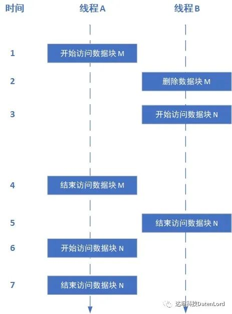

## 无锁数据结构内存管理

正如大家所熟知的，无锁数据结构在并发访问中往往具有更好的访问效率和并发度。无锁数据结构的性能优势主要来自于以下两点：

1. 数据结构的锁设计往往比较粗粒度，在很多可以并发访问的情况下，访问者被锁阻塞，无法实现并发访问。
2. 无锁数据结构访问不需要进行上下文切换，有锁数据结构在并发度高的时候往往会触发操作系统上下文切换。

但是无锁数据结构也带来了新的问题，即内存管理问题。举个例子：当线程 A 读取一块数据的时候，线程 B 要释放该数据块。在有锁数据结构中，这两个操作被串行了起来；无锁数据结构由于缺乏锁的保护，这两个操作可能同时进行。为了保证线程 A 访问数据的正确性，线程 B 的释放操作必须要延后执行，直到 A 完成了读取操作。为了达到上述延后释放内存的目的，大家一般采用下列的几种方法：

1. 语言本身的 GC 支持，如带有虚拟机 runtime 的语言，如 Java。
2. 引用计数（Reference Count）。
3. 基于代际的内存释放机制（Epoch-Based Reclamation），本文之后简称 EBR。

语言本身的 GC 机制一方面有语言的限制，另外一方面全局的 GC 往往会造成一定的性能损失，程序执行 Latency 不稳定。引用计数本身的性能开销不可忽视，特别是在读取操作较多的场景下，仅仅为了保护数据安全，每次读取都需要进行计数增加，读完了再进行计数减少，高并发的情况下效率不乐观。EBR 则规避了上述问题，一方面不需要语言层面的规约，另外一方面执行效率也相对更好。这里为大家简单介绍一下 EBR, 更加详细的解释请参见论文《 **Practical lock-freedom** 》。

## Epoch-Based Reclamation

在 EBR 的概念中有代际（Epoch）的概念，Epoch 为数字，其代表了当前处于第几世代，该数字单调递增。全局具有一个Global Epoch, 代表全局当前是第几世代。每个线程的每次数据结构的访问都包含一个Epoch，即Local Epoch，表示当前线程处在第几代。有了这些概念我们来看一下下面的例子，就能够理解 EBR 的工作原理了。

如下图中的例子，线程 A 和 B 并发地访问无锁数据中的内存块，自上而下为时间的流逝方向。在时间点 1 之前 Global Epoch 为 0。



- **时间节点1：** 线程 A 发现没有其他线程正在发给访问该数据结构，将Global Epoch 加 1，变成 1。同时线程 A Local Epoch 设置为 1.
- **时间节点2：** 线程 B 删除数据块 M，因为 B 发现只有线程 A 在访问数据结构，且 A 的Epoch 和 Global Epoch相等，都是1。线程 B 将 Global Epoch 再加 1，变成 2。B 线程 Local Epoch 和 Global Epoch 同步，也为 2. 由于 Epoch 的删除操作是延后的，需要放到一个收集器里，于是数据块 M 被放到收集器中，标记为 Epoch 1，意味着这个数据只有可能在Epoch 1中被使用，从 Epoch 2 开始数据结构中在没有数据块M（被线程 B 删除）。
- **时间节点3：** 线程 B 访问数据块 N，发现 Global Epoch 为2，线程 A 的 Epoch 为 1，则 B 标记自己的 Local Epoch 为2，与 Global Epoch 一致。
- **时间节点4 和 5：** 线程 A 和 B 都表示自己已经结束了数据访问，不再被数据结构追溯。
- **时间节点6：** 线程 A 也开始访问数据块 N，当前 Global Epoch 为 2，且没有其他线程访问该数据块，则线程 A 增加 Global Epoch 到 3，标记自己Local Epoch 为 3。同时线程 A 发现收集器中有一个 Epoch 为 1 的数据块 M，比当前Global Epoch相差了两个世代，可以被删除，数据块 M 被释放。
- **时间节点7：** 线程 A 表示自己结束了数据访问，不再被数据结构追溯。

通过上面的例子我们不难发现，被访问的数据只可能存在于两个 Epoch 中，一个为当前 Epoch，即 Global Epoch，另一个为前一个 Epoch，即 （Global Epoch - 1）。所有被标记了更早 Epoch 的数据都可以被删除，即收集器中被标记为小于 （Global Epoch - 1）的数据块。

分析一下 EBR 的算法，我们能够发现其性能优越性的根本原因在于数据回收的粗粒度管理。在 Reference Count 的方法中，并发度越高，对 Counter 的修改就越密集，竞争越大，性能越差。在 EBR 中，并发度高会造成几乎所有线程都处于一个 Epoch，并不需要对 Global Epoch 进行修改，也就避免了这方面的竞争，性能也就更好。当然 EBR 也存在其自身的问题，当某些原因导致一个访问操作无法结束时，则 Global Epoch 永远无法向前推进，也就永远无法触发垃圾回收，内存泄露就不可避免了。

综上所述，即使存在一些缺陷，EBR 极好的性能优势使其成为了高性能无锁数据结构实现的首选。

## Rust 语言实现 EBR

通过上述对 EBR 的分析，我们不难看出， EBR 需要知道数据访问起始点，配合起始点控制 Epoch 的迭代。其他语言有自己的封装和实现方法，而 Rust 的生命周期的概念则从语言层面提供了帮助。基于这个优势，Rust 语言天生适合实现EBR，并且已经有了一个成熟的实现版本，即 **crossbeam epoch**。这里不会对该实现做源码级的分析，而是会尝试将框架 API 和 EBR 的相关概念进行对应，帮助大家理解。

这里是示范代码，是无锁数据结构使用 epoch 最简单的方法：

```rust
{
    let guard = epoch::pin();
    guard.defer(move || mem.release());
}
```

第一行表示当前线程开始访问访问该数据结构，可能是读取可能是写入。第二行表示，延迟释放一块内存，具体何时释放，由 EBR 算法来决定。当整个代码块执行完成，表示退出数据结构访问，guard 的 drop 方法会将当前线程从监测的队列中注销。

再例如，Datenlord 中实现和使用的无锁Hashmap, **cuckoohash**，其接口为:

```rust
{
    let guard = pin();
    let value = map.get(&key, &guard);
    /// ... Use the value
}
```

第一行和前面的例子类似，第二行的语义为从 map 中寻找 key 对应的 value，获取 value 的引用，其生命周期不超过 guard 的生命周期。通过生命周期的方法，我们限定了 value 引用的使用范围为 guard 的存活范围。

## 总结

本文简单介绍了 Epoch-Based Reclamation 内存管理方法，并且从接口层面介绍了 Rust 的实现和使用。同时本文也分析了 EBR 在性能上的优越性，以及 Rust 语言从语言实现的优势。之后我们还会从 crossbeam epoch 的实现细节给大家带来深入的 Rust EBR 实现的分析。
