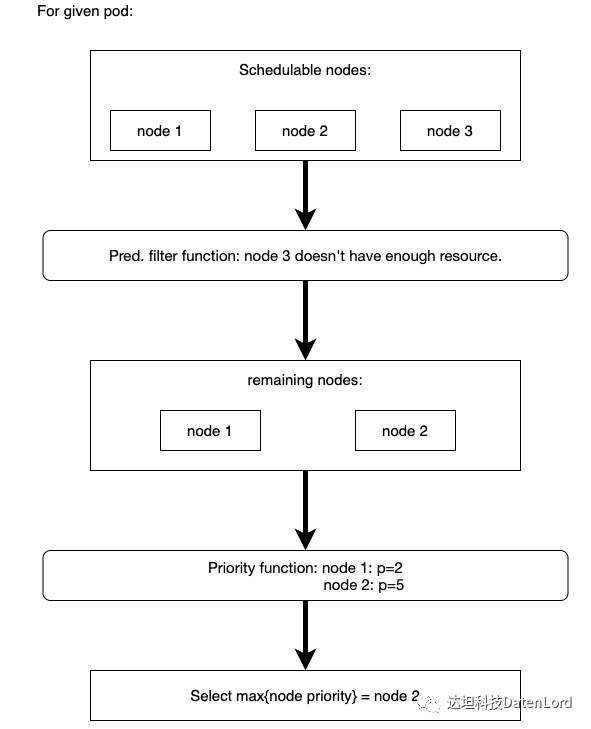

## 背景介绍

**K8S 调度器**(kube-scheduler)是 K8S 调度 pod 的控制器，它作为 K8S 核心组件运行。调度器基于一定的调度策略为 pod 找到合适的运行节点。

### 调度流程

K8S 调度器调度一个 pod 时候主要分为三个阶段

1. 过滤阶段：调用一系列 `predicate` 函数或者叫 `filter` 函数过滤掉不合适的节点，比如说某些节点上不满足 pod 声明的运行所需要的资源，如 CPU，内存等资源，那么这些节点会在这个阶段被过滤掉。
2. 打分阶段：调用一系列 `priority` 函数或者叫 `score` 函数给通过第一步过滤的节点打分排序。比如有三个节点通过了过滤阶段，当三个节点通过资源均衡函数的打分，那么最终剩余 CPU，内存等资源更多的节点会获得更高的优先级评分
3. 调度阶段：把 pod 调度到选择优先级最高的节点上

调度过程如下图所示：



### 调度算法

前文提到，K8S 调度器会调用一系列 `filter` 函数和 `priority` 函数，这些函数是 K8S 内置的调度算法, K8S 会根据默认的**调度算法**将 pod 调度到最合适的节点上。`filter` 函数的目的是过滤掉不符合 pod 要求的节点，通常会有多个节点通过 `filter` 阶段，`prioriry` 函数的目的就是在剩下的节点中选出最合适的节点。

我们来介绍一下 K8S 默认的调度策略有哪些。

- `filter` 策略:
  - `PodFitsResources`: 这条策略是过滤掉所剩资源不满足 pod 要求的节点
  - `MatchNodeSelector`: 这条策略是过滤掉不匹配 pod nodeSelector 要求的节点
  - `PodFitsHostPorts`: 这条策略是过滤掉 pod 声明的 HostPort 已经被占用的节点
  - 等等
- `priority` 策略：
  - `BalancedResourceAllocation` : 这条策略希望当 pod 被调度到一个节点后 CPU，内存使用率是均衡的。
  - `LeastRequestedPriority` : 这条策略基于节点的空闲部分，空闲部分基本算法就是（节点总容量 - 已有 pod 的请求 - 将要被调度的 pod 请求）/ 节点总容量，有更多的空闲部分的节点会获得更高的优先级。
  - 等等

K8S 提供了很多调度策略，我们在这里就不一一列举，K8S 并不会使用所有的这些调度策略，它会默认使用部分调度策略，我们可以通过 K8S 配置文件来组合使用这些策略来达到最符合我们应用场景的调度策略。

## 调度扩展

前文中介绍到 K8S 会提供很多调度策略，它们很大程度上允许我们控制 K8S 调度器的行为，然而 K8S 提供的调度策略也有它的局限性，它只能根据通用的标准如 CPU，内存的使用率来设计调度策略，当我们的应用需要更有针对性的调度策略时，比如说我们想把一个 pod 调度到网路带宽更高，延迟更低的节点上，这时候 K8S 提供的调度策略很难满足我们的需求。幸运的是 K8S 提供了 **K8S 调度扩展**机制。K8S 调度扩展提供给用户扩展调度策略的方法。K8S 调度扩展允许用户提供定制的 `predicate/filter` 函数和 `priority/score` 函数来扩展的调度策略。调度扩展的实现方式是用户提供一个 web 服务，并将 web 服务的 url 通过配置文件通知 K8S，K8S 会在调度 pod 的过滤阶段和打分阶段通过 RESTful API 的 `POST` 方法来调用用户提供的自定义扩展函数，从而达到扩展 K8S 调度策略的效果。具体架构如下图所示：

- 在 K8S 过滤阶段，kube-scheculer 发送 `POST ${URL}/filter` 到 scheduler-extender，请求中包含 Json 格式序列化的数据 `ExtenderArgs` ，scheduler-extender 收到请求后，通过本地自定义的 filter 函数，产生 filter 结果 `ExtenderFilterResult` 并序列化成 Json 格式返回。
- 在打分阶段，kube-scheculer 发送 `POST ${URL}/priority` 到 scheduler-extender，请求中包含 Json 格式序列化的数据 `ExtenderArgs` ，scheduler-extender 收到请求后，通过本地自定义的 `priority` 函数，产生 score 结果 `List<HostPriority>` 并序列化成 Json 格式返回。

### 数据结构

如上所示，K8S 在和用户调度扩展交互的过程中涉及到三个数据结构，K8S 使用 go 语言来定义它们，在通过 http 发送的时候会把它们序列化成 Json 格式。在 Rust 实现的调度扩展中需用将这些数据结构用 Rust 语言定义，并进行序列化和反序列化。

**调度扩展请求**  
这个数据结构是 K8S 发送的调度扩展请求， `filter` 和 `priority` 请求的结构是相同的。go 语言定义如下：

```rust
type ExtenderArgs struct {
     // Pod being scheduled
     Pod *v1.Pod
     // List of candidate nodes where the pod can be scheduled; to be populated
     // only if Extender.NodeCacheCapable == false
     Nodes *v1.NodeList
     // List of candidate node names where the pod can be scheduled; to be
     // populated only if Extender.NodeCacheCapable == true
     NodeNames *[]string
}
```

- `Pod` 表示需要调度的 pod
- `Nodes` 表示候选的节点列表
- `NodeNames` 表示候选的节点名字列表

这里需要注意的是 `Nodes` 和 `NodeNames` 只有一个会被填写，所以在 Rust 语言中需要将这两个域定义成 `Option` ，Rust 的定义如下:

```rust
#[derive(Clone, Debug, Serialize, Deserialize)]
struct ExtenderArgs {
    /// Pod being scheduled
    pub Pod: Pod,
    /// List of candidate nodes where the pod can be scheduled; to be populated
    /// only if Extender.NodeCacheCapable == false
    pub Nodes: Option<NodeList>,
    /// List of candidate node names where the pod can be scheduled; to be
    /// populated only if Extender.NodeCacheCapable == true
    pub NodeNames: Option<Vec<String>>,
}
```

`filter` 请求的应答  
这个数据结构作为 `predicate` 请求的应答，它包含了通过过滤的节点列表，节点失败的原因和错误信息。go 语言的定义如下：

```rust
type ExtenderFilterResult struct {
     // Filtered set of nodes where the pod can be scheduled; to be populated
     // only if Extender.NodeCacheCapable == false
     Nodes *v1.NodeList
     // Filtered set of nodes where the pod can be scheduled; to be populated
     // only if Extender.NodeCacheCapable == true
     NodeNames *[]string
     // Filtered out nodes where the pod can't be scheduled and the failure messages
     FailedNodes FailedNodesMap
     // Error message indicating failure
     Error string
}
```

- `Nodes` 表示通过 `filter` 函数的节点列表
- `NodeNames` 表示通过 `filter` 函数的节点名字列表
- `FailedNodes` 是一个 hashmap，保存了没有通过 `filter` 函数的节点和没有通过的原因
- `Error` 表示 `filter` 函数过程中的失败原因

同样 `Nodes` 和 `NodeNames` 只有一个会被填写，也需要定义成 `Option` ，Rust 的定义如下：

```rust
#[derive(Clone, Debug, Serialize, Deserialize)]
struct ExtenderFilterResult {
    /// Filtered set of nodes where the pod can be scheduled; to be populated
    /// only if Extender.NodeCacheCapable == false
    pub Nodes: Option<NodeList>,
    /// Filtered set of nodes where the pod can be scheduled; to be populated
    /// only if Extender.NodeCacheCapable == true
    pub NodeNames: Option<Vec<String>>,
    /// Filtered out nodes where the pod can't be scheduled and the failure messages
    pub FailedNodes: HashMap<String, String>,
    /// Error message indicating failure
    pub Error: String,
}
```

**`priority` 请求的应答**  
`priority` 请求的应答是一个 `HostPriority` 的列表， `HostPrority` 包含节点的名字和节点的分数，go 的定义如下：

```rust
type HostPriority struct {
     // Name of the host
     Host string
     // Score associated with the host
     Score int64
}
```

- `Host` 表示节点的名字
- `Score` 表示 `priority` 函数给该节点打的分数

对应的 Rust 定义如下:

```rust
#[derive(Clone, Debug, Serialize, Deserialize)]
struct HostPriority {
    /// Name of the host
    pub Host: String,
    /// Score associated with the host
    pub Score: i64,
}
```

在前面这三个数据结构中使用的类型比如说 `Pod` , `NodeList` 在**K8S-openapi**这个库中有 Rust 版本的定义，可以通过在 Cargo.toml 中加入依赖来使用它

```toml
K8S-openapi = { version = "0.11.0", default-features = false, features = ["v1_19"] }
```

这个库是根据 K8S openapi 的定义自动生成的 Rust 定义，节省了大家把 go 定义的数据结构转成 Rust 定义的麻烦，但是这个库只包含 core API 部分的数据结构， `ExtenderArgs` ， `ExtenderFilterResult` 和 `HostPriority` 属于 extender 的 API，所以需要自己定义。在使用过程中发现了 go 语言定义的一个问题, 主要原因是 `[]string` 在 go 语言中， `[]` 和 `nil` 都是有效的值，序列化对应到 Json 中分别是 `[]` 和 `null` ，一个域可以是 null 代表了它是 optional 的，所以类型是 `[]string` 的域需要加上 `+optional` 标记，相应的在 Rust 定义中也需要定义成 `Option` 。  
详细讨论请参考 **issue**, 目前这个问题在 K8S 中已经得到修复。

### 调度扩展 Web 服务

有了数据结构就需要实现一个 web 服务来处理 K8S 发起的请求，web 服务 Rust 有丰富的库可以使用，这里使用的是一个轻量级同步 http 的库（**tiny-http**），具体 `filter` 函数和 `priority` 函数的实现与具体业务逻辑相关，这里就不具体展示，示意代码如下：

```rust
match *request.method() {
    Method::Post => match request.url() {
        "/filter" | "/prioritize" => {
            let body = request.as_reader();
            let args: ExtenderArgs = try_or_return_err!(
                request,
                serde_json::from_reader(body),
                "failed to parse request".to_string()
            );

            let response = if request.url() == "/filter" {
                info!("Receive filter");
                /// 处理 filter 请求
                let result = self.filter(args);
                try_or_return_err!(
                    request,
                    serde_json::to_string(&result),
                    "failed to serialize response".to_string()
                )
            } else {
                info!("Receive prioritize");
                /// 处理 priority 请求
                let result = Self::prioritize(&args);
                try_or_return_err!(
                    request,
                    serde_json::to_string(&result),
                    "failed to serialize response".to_string()
                )
            };
            Ok(request.respond(Response::from_string(response))?)
        }
        _ => Self::empty_400(request),
    },
    ...省略
}
```

## 总结

通过本文的介绍我们对 K8S 的调度流程，K8S 的调度算法，K8S 调度扩展机制有了基本的了解。并且我们用 Rust 语言实现了 K8S 调度扩展，用 Rust 语言定义了 K8S 和调度扩展之间交互的数据结构，以及介绍了 Rust 定义中需要定义成 `Option` 的域以及相关需要注意的问题。
