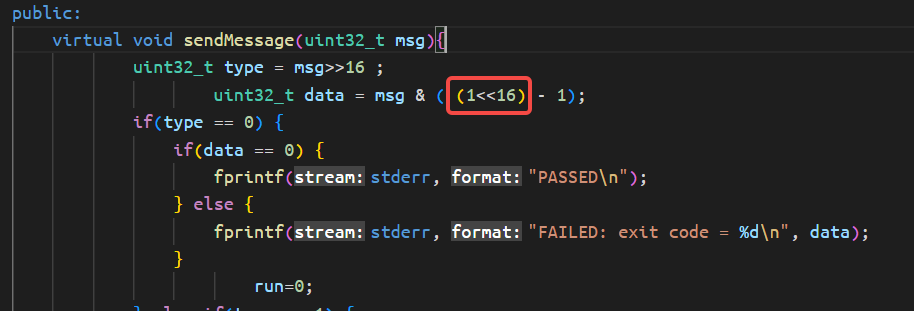

在 2023 年初，**达坦科技发起成立硬件设计学习社区**，邀请所有有志于从事数字芯片设计的同学加入我们的学习互助自学小组，以理解数字芯片设计的精髓，强化理论知识的同时提升实操技能，继而整体提升设计能力。6.175 和 6.375 的课程和 Lab 学习都有一定的难度，要求采用 Bluespec 语言实现 RISC-V 处理器，并支持多级流水、分支预测、缓存、异常处理、缓存一致性等功能。此外，Lab 环节还涉及软硬件联合开发，要求基于所实现的 RISC-V 处理器运行真实的 RISC-V 程序，并给出性能评估。

继 MIT6.175 和 MIT6.375 学习笔记之后，我们又整理了到目前为止，硬件设计学习社区里大家碰到的一些共同问题，希望我们的回复以及学习贴士对于想啃下这两门高难度课程，并想从事数字芯片设计的工程师或同学有所帮助。

## MIT Training Q & A

**Q1: 如何获得这两门课程的 Lab 的初始代码以及对应的评测程序;**
A: MIT 6.175 课程的官网没有提供 Lab 的初始代码，但可以在 GitHub 上找到 Lab 的代码实现和评测程序：如  
https://github.com/dmendelsohn/6.175  
https://github.com/kazutoiris/MIT6.175  
https://github.com/GTwhy/MIT_6.175

MIT 6.375 课程的大部分初始代码和评测程序可在课程官网下载到, 少部分缺失的代码可以在一下仓库找到:  
https://github.com/adamgallas/MIT_Bluespec_RISCV_Tutorial

**Q2: 如何搭建这两门课 Lab 所需的软件开发环境 ？**
A: 这两门课的 Lab 都需要在 Linux 环境下进行，具体依赖的软件包括:

- BSV 语言的编译和仿真器 BSC(bluespec complier):下载链接为 https://github.com/B-Lang-org/bsc/releases; 具体的安装步骤见解压后文件夹里的 README 文档
- riscv 工具链: 手动编译 riscv 工具链过程繁琐耗时且有些高版本的工具链可能并不适配 Lab 中的代码。推荐使用开源的预编译好的工具链,如:https://github.com/stnolting/riscv-gcc-prebuilt
- connectal 软硬件协同开发环境: connectal 项目链接如下https://github.com/cambridgehackers/connectal。实验中不建议手动编译源码构建开发环境(可能会引入很多bug)，可以使用一些已经配置好的docker镜像，如：
- https://hub.docker.com/r/pwang7/connectal
- https://hub.docker.com/r/kazutoiris/connectal

除了上述必需的软件工具外，开发过程中可能还会用到一些硬件综合工具，包括 vivado 和 yosys。由于这两个工具的配置步骤相对来说比较复杂, 建议可以跳过 Lab 中涉及这两个工具的内容。

**Q3: 对于这两门课的有没有推荐的学习顺序？**  
A: 这两门课的侧重点各有不同，6.175 更侧重体系结构相关的内容，而 6.375 对 BSV 语法的讲解更加详尽，因此在阅读这两门课的 slides 和 textbook 时可以互相交叉，先主要学习 BSV 语法，然后再看体系结构相关的内容。这两门课的 Lab 也都可以分成两部分，第一部分是 BSV 基础语法，另外一部分是 riscv CPU 相关的内容。建议的完成顺序如下：先学习 BSV 基础语法部分，包括 6.175 的 Lab0 - Lab4 以及 6.375 的 Lab1-Lab4; 然后完成和 riscv 相关的内容, 包括 6.175 的 Lab5-Lab8 和 project，以及 MIT6.375 的 Lab5。

**Q4: lab6 sixstage benchmarks median case fetch 得到 PC 全为 0**  
A: 原因是 doExe stage 在指令执行成功但没有 mispredict 的情况下才将传给下一阶段的 eInst 设置为 Valid。但是其实即使 mispredict 该条指令也应该是可以正常执行的，因此需要在执行后无论 predict 情况如何都设置为 Valid。

**Q5: CPU 跑通，但发现 ipc 只有 0.5，什么导致 IPC 降低？**  
A: 在 doExecute stage mispredict 之后 sb.remove 导致 IPC 降低。

TA 中提到了原因：  
Both Exec and WB try to call sb.remove(). This will cause Exec to conflict with WB. Also, the scoreboard implementation doesn’t allow out-of-order removal.

**Q6: 做完 lab6 后开始测各个设计的 benchmark。发现很多不符合预期，该有的优化没有体现出来。**  
A: 问题主要出在串联各个 stage 的 bypassfifo 实际上是用一个巨大的组合逻辑把所有 rule 串了起来。每一拍同时触发，数据从第一个 stage 到最后一个依次流过。因此只要预测错误，通过 exe stage 重置 pc 则下一拍就能纠正，但看 IPC 就已经很高了，加入其他优化并不能使性能更高。在对 fifo,sb,rfile 进行更换后，换成 cffifo 后体现出了一定的性能差别。

**Q7: 六级流水 CPU 加上 BHT 后存在冲突。**  
A: 观察 BHT 的构成和使用都只是是普通的寄存器读写，没有找到冲突源。BHT 改为 Bypass BHT 冲突仍然存在。猜测问题是 Decode 预测用 BHT，Exe 阶段更新使用 BHT，导致了冲突。

将 BHT.update 放到 Canonicalize 后 BHT 没问题了。但为什么 Bonus 采用 Bypass FIFO 的时候没有这些问题？  
因为 Bypass FIFO 相当于把所有 Stage 连接成了一个组合逻辑电路，从 Fetch 到 WB 由组合逻辑确定执行关系。BHT 在其中虽然进行了多次读但只进行了一次写，且顺序与 Bypass FIFO 一致。

可能的原因是存在优先级顺序的冲突。即 FIFO，SB，RFile 等部件包含了一个并发时 Rule 的执行顺序，新加入的 BTB、BHT 等如果放置在错误的 Stage，其操作寄存器的顺序，对 EHR 的读写、覆写的顺序可能与 FIFO 等定义的顺序不符。这样一来就会引发冲突。

因此比较好的做法是，以 FIFO 为抓手，思考每个 Stage 的优先级顺序，确定之后开始选择符合优先级顺序的 SB，RFile，BTB 等部件。

之所以 Canonicalize 可以避免冲突，主要是因为其可以在所有 Stage 之后运行，因此避免了正向数据流和反馈回路结合导致的复杂优先级关系。这样一来反馈回路就有了一个简单可靠的设计模式。即所有 Stage 将需要反馈的内容写入到 XXXRedirect[0]中，在 Canonicalize Rule 中对 Redirect 进行识别并完成反馈。

这样一来只需要考虑反馈作用的部件所在 Stage 与 Canonicalize 之间的优先级关系，而不是每个 Stage 与其要反馈的 Stage 之间的优先级关系，降低了问题的复杂性。

**Q8: jalr 和 ras 这两个 case 报错，return code！=0，但其他 case 正常。**  
A: 因为在没有进行 stall 判断的情况下就进行了 redirect。更本质地说是没有 deq 就改变了电路状态，或者该原子性完成的多个操作被分开了。

在 stall 的情况下这一条指令会在下一拍重新执行所有该 stage 的流程。如果 redirect pc 但因为 stall 而没有 deq，则当前这条 ppc 不正确的指令会在下一拍被 kill 掉，漏掉了一条指令，而下一次 exe 的指令将会是这一次 reg 阶段预测出来的 ppc，相当于跳过了很多条指令。  
由此得到的教训是：当 rule 中存在多个分支（判断）时，要仔细考虑哪些操作应该是一个原子事务。尤其关注一个 rule 中可能对其他 rule 产生影响的部分，如上例中的 regDirect 以及对 fifo 的 enq 和 deq 操作。

**Q9: 在 Windows 上跑 docker 奇慢无比，完成一次 connectal 的编译可能要花 10 分钟以上。**  
A: 检查一下 CPU 的型号，在最新的 Intel CPU 中引入了大小核，后台任务会被调度至小核上，尤其是虚拟机一类的性能表现会相当差。建议搜索有关大小核调度的文档，禁用小核来取得比较好的性能。

**Q10: 编译时候总是出现 schedule 的 error。**  
A: 不推荐使用 attribute 去指定 rule 的优先级，一般仅用于 assert 断言。可以尝试输出 rule 的 dot 文件来查看所有 rule 的依赖关系，从而判定前后顺序。由于 rule 前后级依赖相当多，很容易会写出一些前后冲突或者组合逻辑环。为此，可能需要学习一下 Pipeline FIFO / Bypass FIFO / Conflict-Free FIFO 的依赖关系。

**Q11：我在做 6.175 的 lab5 的时候，这个 lab 需要先编译那些汇编测试用例，包括在 Lab/programs/assembly/src/目录下的.S 文件，和 Lab/programs/benchmarks/目录下的文件，先生成.riscv 的 elf 文件，再通过 elf2hex 生成.riscv.vmh 的文件，我觉得好像是自己配置的 elf2hex 工具有问题，最后生成的.riscv.vmh 文件格式不对，放到 connectal 模拟出来的处理器上，跑不出来。**  
A：elf2hex 好像在 binutils 里被 depricated 了，不建议用。可以不用 elf2hex，直接用 Connetal 给 CPU 加载 binary。

**Q12：BSV 中关于一个 Rule 内部，不同代码之间先后顺序的差异，官方文档在哪里有描述么？**

举一个例子，比如我定义一个非寄存器类型的变量，之前我一直理解的是这个变量因为不存储状态，就可以把它当做一根链接两个逻辑门的导线，这样的话，在一个 rule 或 method 内部，代码书写的顺序应该是没有关系的。但是，以下面的代码为例，对变量 a 的赋值操作，给 a 变量赋值的顺序不同，会导致仿真 结果不一样。所以之前我把它理解成导线是错的吗？或者说，这里的“赋值”其实会发生变量的覆盖？我在官方手册里找到这么一句话：Multiple assignments to the same variable are just a shorthand for a cascaded computation

如果这么理解的话，就是 Bool a = ?;这一行也相当于是一次赋值，而不仅仅当做一个占位符使用，要是这么理解就能说得通了。

```rust
rule test;
Bool a = ?;
// Write a = True here？
a = True;
if (a) begin
$display("aaaa");
end else begin
$display("bbbb");
end
// Or write here
// a = True;
endrule
```

A：这个问题很好，对于深入理解 RTL 电路建模很有帮助。Rule 内部的非 Reg 变量都会生成连线，Rule 之间可以用 Wire 连线。Rule 内部的时序逻辑如果在同一个作用域可以前后交换顺序，Rule 内部的组合逻辑一般不能随意交换顺序。这个对应实际数字电路工作的场景，组合逻辑一般是有先后顺序的，时序逻辑一般是并行工作，并行工作的时序逻辑没有先后顺序。

这个问题其实对应于 Verilog 的时序逻辑 always 块和组合逻辑 always 块。在时序逻辑 always 块里的非阻塞赋值，如果在同一个作用域，可以交换顺序。在组合逻辑 always 块里的阻塞赋值有先后顺序关系，一般不能交换顺序。

**Q13：话说我用 docker 搭的环境下用 makefile 跑 bluespec 仿真 总是 make：killed 这个问题大家有遇到过吗？**  
A：我目前是用 docker 做的实验，6175 的 lab1-6 和 6375 的 lab1-4 目前没有遇到这个问题。不过目前 github 上能找到的实验项目可能跨了很多年，调试环境确实需要花些精力。

## MIT Training 小贴士

**Tips1：** 在做 6.175 的 lab5 实验时，发现 run_asm.sh 和 run_bmarks.sh 这两个脚本存在潜在错误的风险。我对照了群里几位同学之前的脚本，发现都存在这个问题：这个 shell 脚本中有如下两行：


注意第一行后面的&符号，会把仿真任务放到后台运行。第二行的 wait_time 默认是 3 秒，如果编译机器的速度比较慢，在 3 秒内无法完成编译，则会导致同时启动多个仿真，而这些仿真会共享 bluesim/mem.vmh 文件，从而导致冲突。

**Tips2:** 给大家同步一个坑~目前 6.175 的 Lab5，github 上能找到的一些实验源码，6.175/lab5/main.cpp 里面的(1>>16) - 1 应该是(1<<16) - 1，这个错误会导致在运行 benchmark 的时候，输出的 cycle 和 inst 数量有错误，大家做实验的时候需要小心（特别是在回答实验的 question 时候，计算 IPC 的时候需要用到这个输出结果）下图是修改后的正确书写方式。



这个是我修改后的仓库，已经推到 GitHub：https://github.com/myrfy001/learn_mit_bluespec.git

## Related Resources

[计算机体系结构｜ MIT6.175 和 MIT6.375 学习笔记](https://mp.weixin.qq.com/s?__biz=MzkwNTMzOTE2MA==&mid=2247485625&idx=1&sn=26167c93b21a5eccca61e89cf91055ca&chksm=c0f800cef78f89d8640873aede5db6711770234b73609450f9ada007f6b71dd747277649fdf1&scene=21#wechat_redirect)

达坦科技硬件设计学习社区持续开放，若想询问加入细节，请添加下方小助手微信号或邮件info@datenlord.com


