本文主要介绍了 DatenLord 团队在今年的 Xilinx 全球自适应计算挑战赛上获得 Big Data Analytics 赛道一等奖的作品——TRIDENT: Poseidon 哈希算法的硬件实现与加速。该项目基于 Xilinx Varium C1100 FPGA 加速卡，为 Filecoin 区块链应用中的 Poseidon 哈希算法提供了一套完整的硬件加速方案。在硬件方面，TRIDENT 基于 SpinalHDL 设计了 Poseidon 加速器 IP 并基于 Vivado 中 Block Design 工具搭建完整的 FPGA 硬件系统。在软件方面，我们为 Filecoin 软件实现 Lotus 提供了访问 FPGA 硬件加速器的接口。最终，TRIDENT 能够为 Filecoin 应用提供两倍于 AMD Ryzen 5900X 处理器的 Poseidon 计算加速效果。下文将主要从 Poseidon 哈希算法概述、基于 SpinalHDL 和 Cocotb 的硬件设计、总体方案设计、加速器 IP 设计和性能测试等方面对整个 TRIDENT 项目进行详细的介绍。

## 引言

Poseidon 是一种全新的面向零知识证明(ZKP: Zero-Knowledge Proof)密码学协议设计的哈希算法。相比同类算法，包括经典的 SHA-256、SHA-3 以及 Pedersen 哈希函数，在零知识证明的应用场景下，Poseidon 能够显著地降低证明生成和验证的计算复杂度，极大地提升零知识证明系统整体的运行效率。基于上述优点，Poseidon 目前已被广泛应用在了各种区块链项目当中，包括去中心化存储系统 Filecoin、加密货币 Mina Protocol 和 Dusk Network 等，主要用于加速其中的零知识证明系统。

### 0.1 Poseidon 与零知识证明

零知识证明(ZKP: Zero-Knowledge Proof)是一类用于验证计算完整性(Computational Integrity)的密码学协议。其基本的思想是: 使证明者(Prover)能够在不泄露任何有效信息的情况下向验证者(Verifier)证明某个计算等式(Computational Statement)的成立。一个具体的证明对象可以表示为如下形式：

f = (x, w)

其中 f 代表某个函数或程序, x 代表该函数中公开的输入, w 表示需要保密的函数输入，即只有证明者知晓。在零知识证明系统下, 证明者能够在不泄露 w 的情况下向验证者证明该等式的成立。由以上描述可见，零知识证明最显著的特点也是其最大的优势在于隐私保护性，证明者可以在不泄露任何重要私密信息的情况下完成对某个函数或程序的计算结果的证明。

由于零知识证明能够兼顾计算完整性证明和隐私保护, 其具备广泛的应用场景, 具体包括匿名线上拍卖、匿名电子投票、云数据库 SQL 查询验证、去中心化数据存储系统等。尤其是在区块链和加密货币领域，零知识证明凭借其出色的隐私保护特性, 近年来获得了大量开发者和设计者的青睐, 包括加密货币 Zcash 和 Pinocchio 以及分布式存储系统 Filecoin 等在其设计中都采用了 ZK-SNARK 零知识证明算法。

为了保证证明算法的通用性，零知识证明通常不会针对某一特定的函数 f 而设计。如果需要验证上述公式的成立，需要将具体的 f 函数转换到零知识证明算法所规定的受限表达式系统(Constraint System)当中，这一过程可以理解为“程序编译”, 即将待证明的程序转换成另一种由受限表达式(Constraints)组合成的具备相同功能的程序。例如对于 ZK-SNARKs 算法，需要将待证函数转换成由特殊的二次多项式 R1CS (R1CS: Rank-1 Quadratic Constraints) 组成的程序。而转换后的函数形式也被称为算数电路(Arithmetic Circuit), 证明者和验证者都需要在该电路的基础上进行一系列的算术运算来完成证明生成和验证的工作

虽然零知识证明能在提供计算完整性验证的同时兼顾隐私的保护, 但其代价是提高了证明生成和验证的计算复杂度。目前，不论对于证明者还是验证者完成一次零知识证明都需要消耗大量计算资源。通常情况下, 证明生成和验证的计算复杂度和待证函数 f 转换到受限表达式系统后的复杂度, 即转换结果所包含的受限表达式的数量成正比关系。不同待证函数经过“编译”后生成的受限表达式的数量不同, 所需计算的复杂度以及对应的证明生成和验证的时间也有很大的差异。在区块链应用中，待验证的函数通常与某种哈希函数相关。而 TRIDENT 所加速的 Poseidon 哈希算法对零知识证明做了针对性的优化，使得其对受限表达式系统的适配程度显著优于同类的算法。例如，Poseidon 哈希算法转换后所需的受限表达式的数量是同类 Pedersen 哈希函数的八分之一左右, 这意味着 Poseidon 完成零知识证明所需的计算量将显著地降低，同时整个零知识证明系统的效率也会得到大幅提升。

### 0.2 Filecoin 分布式存储网络

TRIDENT 项目中实现的 Poseidon 加速器主要针对的是应用在 Filecoin 分布式存储网络中的 Poseidon 哈希计算实例。Filecoin 在提供存储服务过程中需要对数据进行 Poseidon 哈希运算，这一计算过程需要消耗大量的算力，是整个 Filecoin 系统运行的性能瓶颈之一。

Filecoin 是基于区块链技术建立的一种去中心化、分布式、开源的云存储网络。其主网络已平稳运行一年，并展现出了高速、低成本和稳定的特点。由于其开源、去中心化的优点，目前 Filecoin 已经得到了广泛的应用，包括著名的维基百科(Wikipedia)已将其网站的数据库存储在 Filecoin 网络上。在 Filecoin 中主要有两种角色，分别是用户(Client)和矿工(Miner)，其基本的运行机制是：Client 发出数据存储或检索的需求并支付文件币，而矿工通过提供存储服务检索服务获得相应的奖励。

与传统的由数据中心提供的云存储服务不同, 任何具备空闲存储资源的设备均可以在 Filecoin 网络上提供存储服务。因此，为了保证存储服务的质量，Filecoin 中分别设计了包括复制证明 PoRep(Proof Of Replication)和时空证明 PoSt(Proof Of Spacetime)等机制来保证数据存储的完整性和持久性，而这些机制中涉及大量的密码学算法，包括哈希算法 SHA-256 和 Poseidon 以及零知识证明 zk-SNARK 等，需要大量的算力支持。目前这些算法主要是基于 GPU 实现计算加速，并没有相关开源的 FPGA 硬件加速方案。

目前，应用最为广泛的 Filecoin 软件实现是由 Protocol Labs 基于 Go 语言编写的 Lotus。可以将 Lotus 理解为用户与整个 Filecoin 存储网络进行交互的接口。具体来讲，Lotus 是一个在 Linux 操作系统上运行的命令行应用程序，其所提供的功能包括: 1)上传和下载文件；2)将空闲的存储空间出租给其他用户；3)检查计算机存储数据的完整性等。同时，Lotus 中提供了用于测试计算机硬件在 Filecoin 计算负载下性能表现的基准程序 Lotus-Bench。

TRIDENT 项目在 Poseidon 加速电路的基础上，为 Lotus 提供了访问底层 FPGA 硬件加速器的软件接口，进而通过 Lotus-Bench 对加速器的计算性能进行了测试和比较。

## Poseidon 哈希算法概述

### 1.1Poseidon 参数

准确地说，Poseidon 指的是一类具有相似计算流程的针对零知识证明算法而优化的哈希函数的集合。类比编程语言中面向对象的概念,可以将 Poseidon 理解成一个哈希函数类, 该类需要若干基本的初始化参数。在应用过程中, 需要通过初始化这些基本参数生成具体的哈希计算实例。而不同参数组合对应的 Poseidon 实例, 虽然在计算流程上基本相似, 但在安全性、计算量和复杂度等方面都有一定程度上的差异。Poseidon 哈希函数类初始化的所需的基本参数为(p, M, t), 由这三个参数可确定一个唯一的哈希计算实例。

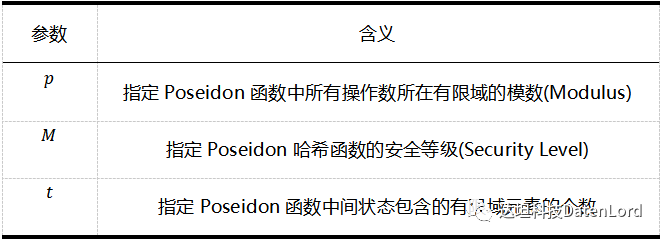

在这三个基本参数的基础上，可计算出其他与 Poseidon 计算流程相关的参数，包括：

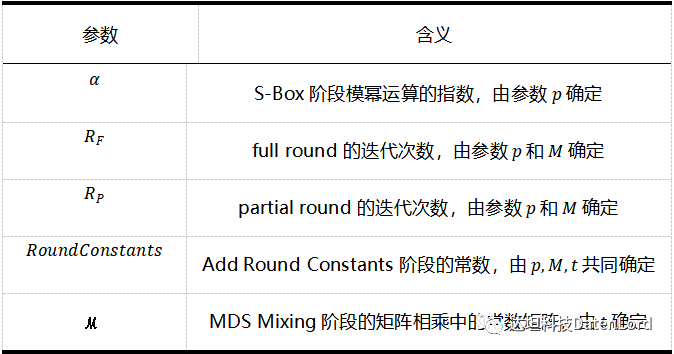

对于 TRIDENT 所要加速的 Filecoin Poseidon 计算实例，各个参数的取值如下：

其中参数的 16 进制表达式为：

p=0x73eda753299d7d483339d80809a1d80553bda402fffe5bfeffffffff00000001

参数 p 的实际位宽为 255 位，哈希函数中的所有算术运算操作均在 p 确定的有限域内完成，即所有的算术运算均是模数为 p 的模运算，包括 255-bit 模加和 255-bit 模乘；同时，参数 p 还确定了 S-Box 阶段模幂运算的指数 α=5 ；

Filecoin Poseidon 实例的参数 t ∈ {3, 5, 9, 12}，即 Poseidon 实例计算的中间状态可以包含 3、5、9 或 12 个有限域元素；

Filecoin Poseidon 实例的安全等级 M=128 Bits，安全等级 M 和参数 P 共同确定了 Full Round 迭代次数 RF=8 以及 Partial Round 迭代次数 RP ∈ {55, 56, 57, 57}(依次对应的四个取值)；

### 1.2 Poseidon 详细计算流程

从输入和输出的角度看，Poseidon 哈希函数将输入的(t − 1)个有限域元素映射到一个输出有限域元素。对于本次课题加速的 Filecoin Poseidon 实例，参数 t ∈{3, 5, 9, 12}，因此其输入数据所包含的元素个数可以是 2，4，8 或 12，输出为一个元素，由于参数 P 的位宽为 255 位，所以输入输出有限域元素的位宽也同样为 255 位。

Poseidon 的详细计算步骤可表述如下：

1. 初始化：将输入 preimage 的(t − 1)个元素通过拼接(Concatenation)和填充(Padding)的方式转换成包含 t 个有限域元素的中间状态 state;

2. 进行 RF /2 次 Full Round 循环：每次循环中需要对 state 向量的所有元素依次完成 Add Round Constant，S-Box 和 MDS Mixing 操作，其中 Add Round Constants 需要完成一次常数加法，S-Box 需要计算五次模幂，MDS Mixng 计算的是 state 向量和常数矩阵 M 相乘;

3. 进行 RP 次 Partial Round 循环：Partial Round 循环和 Full Round 循环的计算流程基本一致，不同点在于 Partial Round 在 S-Box 阶段只需完成第一个元素的模幂运算；

4. 进行 RP 次 Partial Round 循环：Partial Round 循环和 Full Round 循环的计算流程基本一致，不同点在于 Partial Round 在 S-Box 阶段只需完成第一个元素的模幂运算；

5. 输出：在完成步骤 1-4 中总共(RF + RP )次循环后，将 state 向量中的第二个元素作为哈希运算的结果输出；

即上述算法 2-8 步骤对应的计算流程图如下：

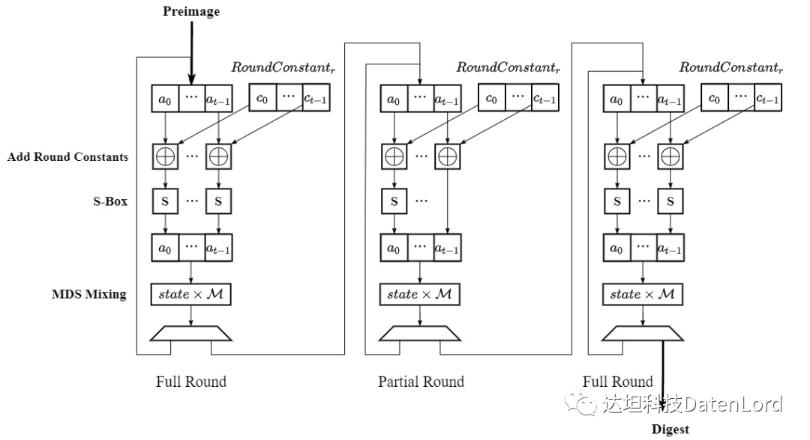

### 1.3Poseidon 算法特点

上文提到，Poseidon 可以看成是一类相似的哈希函数实例组成的集合，这类哈希函数计算流程的共同特点包括：

- 所有运算均在有限域内完成，即均为模运算；
- 计算过程中涉及大量的常数，包括和常数相加以及和常数矩阵相乘；
- 整体计算流程由多次相同的迭代组成，这些迭代可以分成 full round 和 partial round 两类；
- 计算过程中涉及两种高位宽的算数运算，分别是模加和模乘。以 Filecoin Poseidon 为例，其算数运算的操作数为 255 位；

上述四点简要概括了整个 Poseidon 哈希计算的特点，也是硬件加速器设计与实现中需要着重考虑的几个地方。本章第二节将结合详细的计算流程进一步深入地介绍 Poseidon 哈希函数。

## 基于 SpinalHDL 和 Cocotb 的硬件设计与验证

TRIDENT 项目采用了基于 Scala 的硬件生成器语言 SpinaHDL 和基于 Python 的验证框架 Cocotb 完成整个 Poseidon 加速器 IP 的设计与验证。这两种新兴的硬件设计和验证工具极大提升了整个加速器的开发效率和质量.

### 2.1 SpinalHDL 和 Cocotb 概述

和 RISC-V 处理器开发中常用的 Chisel 类似，SpinalHDL 是一种基于高级编程语言 Scala 的硬件生成器语言 HCL(HCL: Hardware Construction Language)，更确切地说，它是一个用于数字硬件设计的 Scala 编程包。

对于开发者来说，SpinalHDL 通常可以分成两部分: Scala 语法和 SpinalHDL 提供的电路元件抽象。SpinalHDL 通过 Scala 语法中类和函数的形式提供了硬件设计所需的各种基本电路元件的抽象，包括寄存器、逻辑门、多路选择器、译码器和算术运算电路等。而电路设计者所要完成的工作是：基于 Scala 的语法来描述电路的整体结构，即描述各个基本电路元件之间的连接关系。由于 Scala 是一门多范式的编程语言，其支持函数式编程、面向对象、递归等高级的语言特性，能够赋予设计者强大的结构建模能力和代码参数化的能力。

基于 SpinalHDL 的具体硬件开发流程如下：

1. 使用 Scala 语法和 SpinalHDL 中提供的电路元件抽象描述所需的硬件电路结构;
2. 编译并执行 Scala 代码以生成对应的 Verilog 或 VHDL 代码;
3. 使用 System Verilog 或 Python 语言搭建待测电路的验证平台；
4. 基于 Synopsys VCS、Vivado Simulator 或 ModelSim 等仿真器进行电路的功能仿真和验证，若功能仿真的结果和预期不符，则返回步骤 1 继续修改电路设计代码；

使用 Design Compiler 或 Vivado Synthesis 对通过功能验证的 RTL 代码进行综合，生成对应的网表文件以及电路的时序、面积和功耗等信息。若综合结果不满足设计需求，则返回步骤 1 进一步优化电路结构。

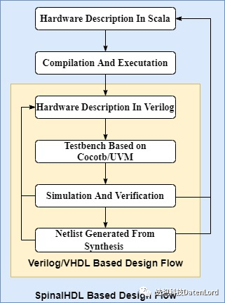

Cocotb 是一种开源的基于 Python 的数字电路验证框架，该验证框架的具体工作模式如下图所示。基于 Cocotb 的电路验证可以分为如下两个部分:

1. 基于 Python 编写的测试平台代码：基于 Python 中的协程(Coroutine)并行地完成：产生待测电路输入端的激励信号；将相同的激励信号传递给参考模型得到标准输出；监测待测电路的输出端口，并检查输出结果是否和标准输出一致；
2. 支持标准 GPI 编程接口的电路仿真器：通过 GPI 编程接口接收 Python 测试代码生成的输入端激励信号，并对待测电路 DUT(DUT: Design Under Test) 进行功能仿真

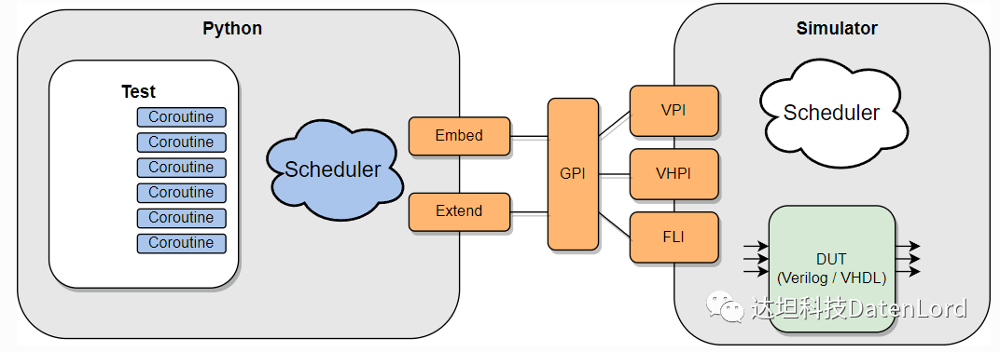

使用 Cocotb 进行电路功能仿真并不需要编写额外的 Verilog 或 VHDL 代码，测试中的所有工作，包括产生输入激励信号、参考模型的实现以及监测输出结果等都可以在 Python 代码中完成，而 Python 代码可以通过仿真器提供的 GPI 编程接口与待测电路进行交互。借助 Python 高效简洁的语法和强大的生态，验证人员可以更加快速地实现验证代码的逻辑功能，加快硬件设计的迭代速度。

### 2.2 SpinalHDL 在硬件设计中的优势

本章的第一节提到，SpinalHDL 对于开发者来说可以分成 Scala 语法和 SpinalHDL 提供的电路元件抽象两部分，而其在电路设计上的优势也主要源于这两方面。从 Scala 的角度来说，其高级的语言特性，包括函数式编程、面向对象和递归等，能为设计者提供强大的电路建模能力。而从 SpinalHDL 自身的角度来说，其提供的丰富电路抽象使开发者避免了一些常用电路模块的重复实现，从而能从更高的抽象层次进行电路的描述。下文将详细描述 SpinalHDL 在电路设计中的四点优势:

1. 和 Verilog 相同的电路描述粒度：

数字电路建模的方式通常可以分成行为级和结构级两种，如 Verilog 和 VHDL 就是从结构级对电路进行描述，而像高层次综合 HLS(HLS:High Level Synthesis)则是先通过高级编程语言描述算法行为，然后将其转换成对应电路的 RTL 代码。大多数情况下行为级建模能够更加高效地完成电路设计，但往往通过这种方式得到的电路在性能和资源消耗上很难达到设计者的要求。

和高层次综合 HLS 不同，SpinalHDL 虽然也是基于高级编程语言 Scala 进行设计，但其本质上仍然是从结构级对电路进行描述。对于开发者来说，如果不使用 Scala 中的高级语言特性以及 SpinalHDL 中抽象层次较高的电路模型，诸如 FIFO、计数器和总线仲裁器等，完全可以像使用 Verilog 一样对电路进行建模。

2. 更可靠的电路描述方式：

使用 SpinalHDL 进行电路描述能够提升设计的可靠性，显著地降低代码出错的概率。而代码可靠性的提升不仅能减轻电路验证的压力，同时对后期的代码维护也有很大的帮助。

3. 更强的建模和表达能力:

SpinalHDL 对电路强大的建模和表达能力主要源于 Scala 所提供的各种丰富的高级语言特性，包括函数式编程、面向对象以及递归等。此外，SpinalHDL 自身提供的丰富的电路抽象使开发者能够避免很多底层模块的重复实现，进而从更高的层次构建电路。SpinalHDL 中不仅提供了基本的电路元件如信号、逻辑运算符、算数运算符和寄存器等，同时也实现了诸如 FIFO、AXI 总线、计数器和状态机等较高层级的电路模型。

4. 更好的代码复用能力：

除了更加强大的电路建模能力外，SpinalHDL 还能为硬件设计代码带来更改好的复用性。硬件设计所要处理的问题经常都是高度定制化的，而 Verilog 中的“parameter”和“localparam”关键字往往不能提供足够的参数化能力，一份代码很难适用于不同的应用场景。而基于 SpinalHDL 和 Scala，开发者可以通过复杂函数的实现和面向对象的语法特性，对电路模型进行更高层次地抽象和参数化设计，从而提升代码的复用能力。

### 2.3Cocotb 在验证中的优势

1. Python 的语法特点：

相比传统硬件验证使用的语言，如 Verilog、VHDL 和 System Verilog，Python 具备更加高效和简洁的表达能力。即使和 C/C++以及 Java 这些软件开发中的高级语言相比，Python 在代码开发效率上也有很大的优势。此外，作为一门高级编程语言，Python 同样支持诸如面向对象等高级的语言特性，能提供很好的抽象和参数化的能力，帮助验证人员构建复用性更高的验证代码。

以本次课题中 Poseidon 加速的验证为例，Poseidon 哈希算法需要完成大位宽数据(255 位)的算术运算。而包括 C/C++以及 Java 等大部分编程语言一般最高只支持 64 位整数运算，而 Python 中的整数类型支持任意位宽的数据，这一点大大降低了 Poseidon 加速器软件参考模型实现的复杂度。

2. Python 丰富的软件生态：

同时 Python 拥有强大的生态和丰富的开源代码库。使用 Cocotb 进行硬件设计的验证，可以很方便地复用这些现有的基于 Python 的算法实现，作为硬件电路的参考模型。例如，在设计深度学习相关的加速器时，可以基于 Pytorch、Tensorflow 和 Caffe 等 Python 库搭建验证用的深度学习算法的参考模型；对于 SoC 设计中涉及的各种总线协议，如 AXI 协议等，Cocotb 中也提供了相应的开源软件实现；而对于网络协议相关的硬件实现，可以借助 Python 的网络包数据处理工具 Scapy 库搭建参考模型。使用 Python 现有的开源软件包不仅能够极大地减轻搭建参考模型的工作量，同也可降低代码出错的概率。

## 总体方案设计

### 3.1 开发平台

本次课题研究中使用的硬件开发平台为 Xilinx 公司最新推出的面向区块链应用的 Varium C1100 FPGA 加速卡。整张加速卡的核心是基于 Xilinx Virtex UltraScale+架构的 FPGA 芯片，具体型号为 XCU55N-FSVH2892-2L-E。该 FPGA 芯片配备了丰富的可编程硬件逻辑资源和高速的通讯接口，能够支持区块链应用中各种计算和访存密集型算法的硬件实现。整个 FPGA 加速板卡的外形如下图所示：

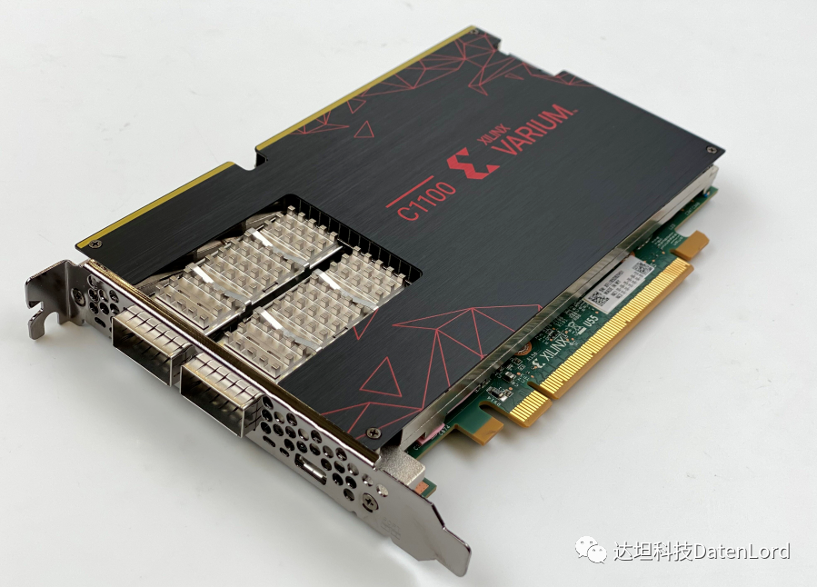

Varium C1100 板卡各项详细参数如下表所示。TRIDENT 中主要使用到的硬件资源包括：1) LUT 和寄存器资源:用于实现加速器电路的基本框架；2)DSP slices:算数运算单元的实现；3) RAM 资源：用于存储 Poseidon 计算中涉及的常数；4)寄存器；4) PCIe 接口:实现加速器与服务器主机之间的高速通讯。此外，在开发方式上，C1100 板卡既支持基于 C/C++语言的 Vitis HLS 高层次综合工具，也可以在 Vivado 集成开发环境下使用 RTL 语言进行硬件设计。

|        Specification        |    Varium C1100    |
| :-------------------------: | :----------------: |
|        Architecture         | Virtex UltraScale+ |
|    Look-up tables(LUTs)     |        872K        |
|          Registers          |       1743K        |
|         DSP slices          |        5952        |
|   Maximum distributed RAM   |       24.6Mb       |
|       36KB block RAM        |       47.3Mb       |
|       288KB UltraRAM        |      180.0Mb       |
|       PCIe Interface        |   Gen316, Gen48,   |
| Total Electrical Card Power |        75W         |

### 3.2 加速系统设计

TRIDENT 中设计的 FPGA 加速系统的整体架构下图所示。整个加速系统主要分为 CPU 服务器和 FPGA 加速卡两个主体。CPU 服务器运行 Filecoin 具体软件实现 Lotus 提供数据存储服务，当需要进行 Poseidon 哈希函数的计算时，服务器以 DMA 的方式将数据传输到 Poseidon 硬件加速器当中进行哈希计算。Poseidon 加速器完成计算后以相同的方式将哈希结果传回处理器内存中。

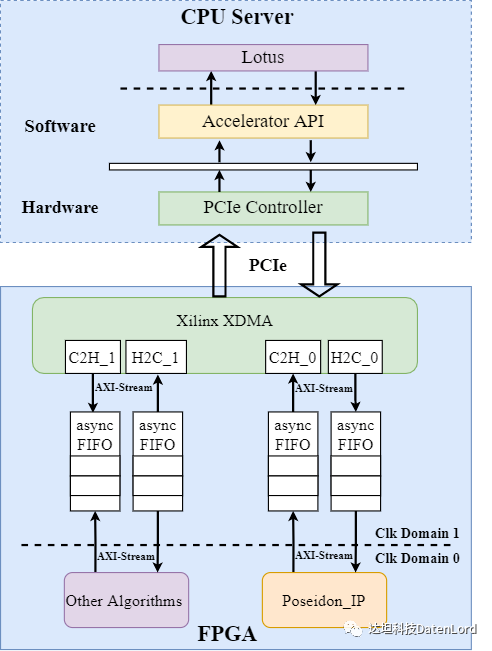

其中 FPGA 硬件系统主要由三个部分组成：

1. Xilinx XDMA IP：实现数据从 CPU 侧内存到 FPGA 的搬运；同时负责 PCIe 外设总线到 FPGA 片内 AXI-Stream 总线的转换；

2. 异步 FIFO：实现 XDMA IP 到 Poseidon 加速器间跨时钟域的数据传输；XDMA 输出的总线时钟固定为 250MHz，而 Poseidon 加速器 IP 的工作频率在 100-200MHz，且驱动两部分硬件的时钟源不同；

3. Poseidon 加速器：整个 FPGA 加速卡的核心部分，负责 Poseidon 哈希函数的计算加速;目前，系统中只实现了 Poseidon 哈希函数的加速器，还可以通过增加 XDMA 通道数以接入其他哈希算法的硬件加速单元；

在上述系统架构设计的基础上，本次课题研究中实际搭建的 FPGA 硬件系统如下。和上图展示的硬件架构图相比，实际的 FPGA 硬件系统中增加了 Utility Buffer、Utility Vector Logic 和 Clock Wizard 等模块来处理时钟和复位信号。

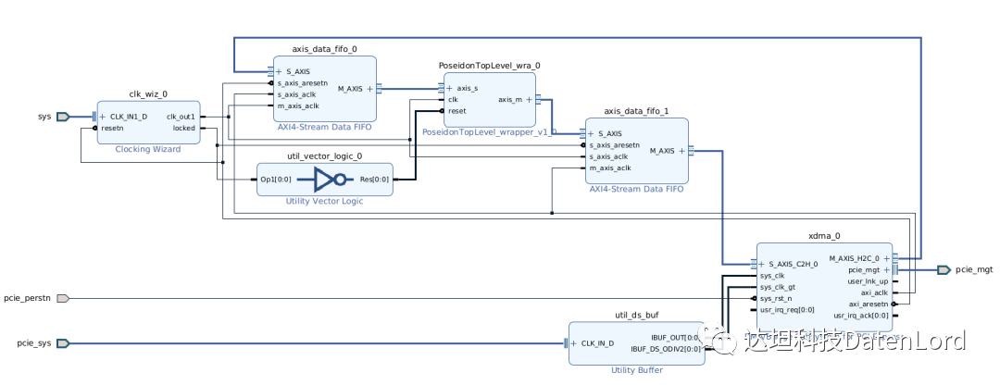

## 加速器 IP 设计

在上述 FPGA 硬件系统整体架构设计的基础上，本文的第四部分将介绍其中的核心模块 Poseidon 加速器 IP 的设计与实现细节。对于任意算法的硬件加速器，其设计与实现大体上都可以分成单元运算电路和整体硬件架构两部分。对于单元运算电路而言，诸如加法器、乘法器和模乘器等，其设计的主要目标是如何在更少的硬件开销下达到更佳的计算性能。在单元运算电路的基础上，硬件架构设计需要考虑的是如何提升每个运算单元的利用率，进而使加速器整体达到更高的数据吞吐率。本节将对 Poseidon 涉及的两种模运算，包括模加和模乘的具体电路实现以及加速器硬件架构的设计做详细地介绍。

### 4.1 模加电路的设计

模运算是密码学中核心的数学概念，大部分密码学算法都是建立在模加和模乘的基础之上。相比普通算术运算，模运算最大的特点就是所有的操作数和运算结果都在有限域(Finite Field)内，即不超过模运算所指定的模数。不论是模加还是模乘，基本上所有模运算的实现都可以分成普通算术运算和取余两个步骤。对于模加，首先需要对两个操作数完成一次普通加法运算，然后再将加法结果缩减到模数所规定的范围内，具体的数学定义如下：

a ⊕ b = (a + b) mod p

由于 a 和 b 都小于模数 p，因此模加实现过程中取余的步骤通过减去模值 p 即可实现，具体的算法流程如下。

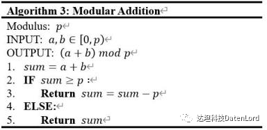

该算法对应硬件电路结构如下图(a)所示, 具体数据通路为：输入操作数经过一个加法器后得到加法结果，将加法结果同时传递给减法器和比较器，分别得到减去模值和与模值比较的结果，将比较结果作为多路选择器的选通信号对加法器和减法器的输出进行仲裁后输出。

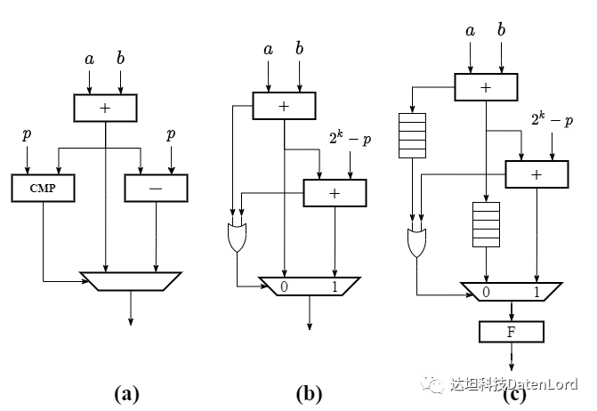

除了普通加法和减法操作相结合的方式外，还可以只通过两次普通加法实现同样的模加功能，具体的算法定义如下：

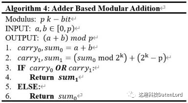

其对应的硬件电路结构由两个加法器和一个多路选择器组成，如上图(b)所示，具体数据通路为：输入操作数经过第一个加法器，输出两数之和与进位；两数之和继续输入第二个加法器(2k − p)与相加后得到对应的和与进位；将两次加法的进位进行或运算后，作为多路选择器的选通信号对两次加法的和进行仲裁后输出。

上述两种模加的实现方式，均需要两个加/减法器，分别完成加法和取余的计算步骤，然后经过一个多路选择器仲裁后输出。而不同之处在于仲裁器选通信号的产生方式，第一种算法的选通信号需要通过一个比较器产生，而第二种算法只需要对两次加法的进位进行一次或运算。相比普通的位运算，比较器在电路实现上通常会消耗大量的硬件逻辑资源，同时产生长的组合逻辑路径延迟，对电路的时序性能产生不利的影响。尤其是对于 Poseidon 中 255 位的操作数，比较器带来的硬件和时序上的开销对整体模加电路的影响会更加显著。因此，TRIDENT 中采用了第二种模加算法进行电路设计。

在具体的电路实现过程中，由于 Poseidon 操作数位宽为 255 比特，在代码中直接通过加法符号实现单周期加法器会对整体的时序产生较大的影响。为了提高电路的工作频率，我们将图(b)中两个 255 比特加法器进行了全流水线化，每个加法器进行五级流水线的分割，并在多路选择器的输出端添加一级寄存器，使得整体模加电路总共包含 11 级流水延迟。流水线化后的模加电路结构如上图 (c) 所示。

### 4.2 模乘电路的设计

和模加电路类似，模乘的实现也可以分解成一次普通的乘法运算和取余两个步骤。这两个步骤分别对应模乘实现过程中的两个难点。

首先，从普通乘法的角度，Poseidon 哈希函数的操作数的位宽为 255Bit，而对于高位宽的乘法器电路，如果实现方式不当，通常会消耗大量的逻辑资源，同时对电路的时序性能造成很大的影响。在实际硬件代码编写中，一般不会直接通过乘号实现乘法电路，通常的做法是调用现成的乘法器 IP，或者，基于各种优化算法和结构，如 Booth 编码和华莱士树结构等，在电路级层次自行设计乘法器。TRIDENT 项目的实现方式为：将高位宽乘法分解成若干并行的小位宽乘法，小位宽乘法则可以通过 Xilinx FPGA DSP 模块中嵌入的 28\*16 的乘法器实现。因此，整个 255-Bit 高位宽乘法器实现的关键在乘法的拆分算法上。

最简单的拆分方式是基于经典的级联算法实现，每次拆分将一个乘法器分解为四个并行的位宽减半的乘法器。对于 256-Bit 乘法器，经过四次递归的拆分，可通过 256 个 16-Bit 的乘法器实现。这种拆分方式虽然实现的电路结构简单规整，但拆分后乘法单元的数量仍然不够理想。TRIDENT 中采用了 Karatsuba-Ofman 算法进行乘法器拆分，这种分解方式虽然在电路结构上相对复杂，并且需要引入额外的加法器，但每次分解只需要三个位宽减半的乘法器，对于 256-Bit 乘法，三次拆分后总共只需要 81 个 16 比特乘法器，大概是普通级联算法的三分之一。Karatusba-Ofman 算法定义如下：

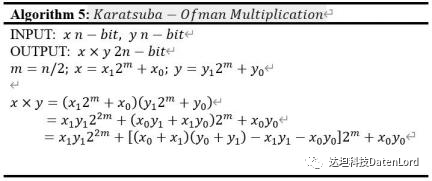

上述算法所对应的乘法器拆分结构如下图所示，每次拆分后乘法器位宽减半，但数量上增加两倍，同时需要引入额外的加/减法器。基于递归的思想，图中的三个乘法器还可以不断地进行拆分，直至位宽满足需求。TRIDENT 项目中对 255 比特的乘法器进行了三次拆分，最终分解为 27 个并行的 34-Bit 乘法器。而 34 比特乘法器则通过调用 Xilinx 提供的乘法器 IP 实现，每个 34 比特的乘法器 IP 由 4 个 DSP 模块中乘法器组合而成，因此，一个 255-Bit 乘法器总共需要消耗 108 个 DSP slices。

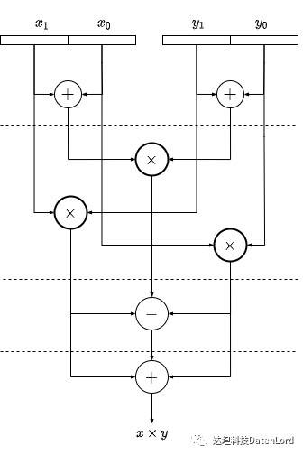

为了提升乘法器的工作频率，Poseidon 加速器中对 Karatsuba 乘法器拆分架构进行了流水线处理，上图中的虚线代表一级寄存器，每进行一次拆分乘法器内增加 3 级流水，而最底层的 Xilinx 乘法器 IP 内共有 5 级流水。因此，255-bit 的乘法器经过三级拆分后总共的流水线级数为 14。

其次，从取余的角度，和模加中通过减/加法即可实现不同，模乘运算的取余通常需要在除法的基础上完成，而除法器需要复杂的电路结构同时会消耗大量逻辑资源，对于硬件实现不够友好。因此，大部分模乘电路的设计都采用了优化的取余方式，将除法转换成其他容易在硬件上实现的算术运算。TRIDENT 项目中基于 Montgomery Reduction 算法实现模乘器电路。Montgomery 算法的基本思想是通过数域转换的方式，将操作数和运算结果转换到 Montgomery 域内，在该数域内取余的除法操作可以简化成移位运算。具体的数域转换方式为:当模运算的模数为 p 时，输入操作数 a 和 b 所对应的 Montgomery 域内的取值为：

a′ = a ⋅ R mod p

b′ = b ⋅ R mod p

其中 R 需要满⾜ R = 2k > p ; 且 R 和 p 满⾜互质关系，即 gcd(R,p) = 1; 在该数域内的乘法， 即 Montgomery 乘法操作的定义如下 ：

c′ = a′ ⋅ b′ mod p

详细的算法实现流程如下：

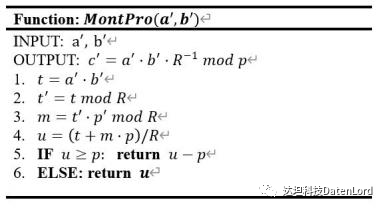

由 R = 2k 可知，上述算法中 2 - 4 步的取余和除法操作均可以由移位代替， 而在 R 和 p 固定的情况下步骤 3 中 p′ 的值可以提前计算，⽽ 5-6 步的取余操作可以通过⼀次加法或减法实现，因此，整个 Montgomery 模乘算法总共需要完成三次乘法和两次加法/减法。在具体的电路设计中，为了提⾼模乘器性能，TRIDENT 采⽤了展开的设计思路，三次乘法运算分别由三个级联的乘法器完成，使得每个周期均可以输出⼀个乘法结果，同时基于流水线技术对长组合逻辑路径进行切割以使电路达到更高的工作频率，具体的电路实现结构如下图所示。

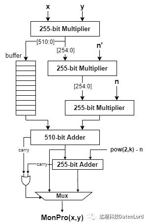

### 4.3 加速器架构设计

在上述单元运算电路的基础上，实现高性能算法加速器的另一个关键在于设计一个高效的电路架构，即如何组织好每一个运算器，最大化每个单元的利用率

由本文第二部分的介绍可知，TRIDENT 所加速的 Filecoin Poseidon 哈希实例的输入为个有限域元素，每个元素的位宽为 255 比特。具体的计算流程由

RF 次 Full Round 循环和 RP 次 Partial Round 循环组成。两种循环的计算流程基本相似，都依次包括 AddRoundConstant、SBox 和 MDSMixing 三个阶段，在这三个阶段分别完成常数模加、五次方模幂和向量—矩阵乘法，两者唯一的区别在于 Partial Round 在 Sbox 阶段只需要完成中间状态第一个元素的计算。Full Round 和 Partial Round 每次循环/迭代的计算流程如下图(a)和(b)所示。如果将 Poseidon 哈希函数的所有循环都依次展开，可以将其看成是一条单向的数据流，在该数据流上不断地进行模加、模幂和矩阵运算。

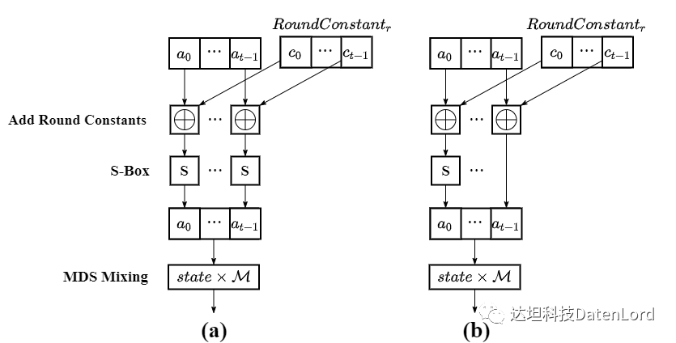

基于上述算法流程的定义，本次课题中实现的 Poseidon 加速器的具体硬件架构如下图所示。在 Poseidon 单次迭代的算法流程的基础上, 加速器的实现针对具体的 FPGA 架构特点和硬件资源限制做了如下几点优化：

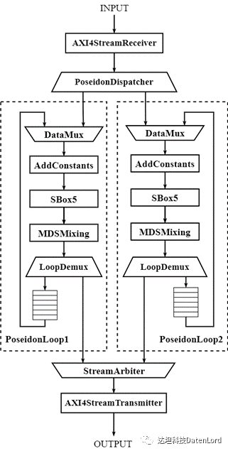

- 流水线处理:

为了提高加速器的工作频率，对 Poseidon 加速器的数据通路进行了流水线化的处理。数据通路主要由模乘和模加单元组成，而每个模运算单元的组合逻辑路径都进行了充分的切割，其中模加运算包含了 11 级流水，而 Montgomery 模乘器分割成了 43 级流水，整个计算通路总共由两百级左右的流水组成。

- 串行数据处理：

上文提到 Poseidon 哈希函数中间状态包含个有限域元素，每个元素的位宽为 255 比特。在算法流程图中，中间状态的所有元素并行地完成每个阶段的运算。但在 Poseidon 硬件加速器的实现中，中间状态的每个元素串行通过每个硬件计算单元，即一个周期只完成一个有限域元素的计算。而采用串行数据处理方式的主要原因包括：

1. 硬件资源的限制：对于 Poseidon 的 MDS Mixing 阶段，如果并行地完成中间状态向量和常数矩阵的相乘的运算，则需要同时实现个模乘器，其硬件资源的开销远远超过 FPGA 板卡的限制。

2. 输入数据的形式：Poseidon 加速器由 XDMA IP 提供输入数据，而 XDMA 输出总线位宽为 255 比特，即每个周期最多只能完成一个有限域元素的传输。

3. 运算单元利用率：Poseidon 中间状态向量的大小有四种取值，加速器需要兼容不同的大小的中间状态，而在这种情况下，串行数据处理的方式能够最大化每个计算单元的利用率。

- 折叠的设计思路：

Poseidon 哈希算法总共由(RP + RF )次迭代组成，对于 Filecoin Poseidon 实例，根据中间状态向量大小的不同，总共需要 63 - 65 次循环。由于硬件资源的限制，设计中不可能将所有循环都在硬件上展开。因此需要基于折叠的思路，即时分复用的方式，在有限的循环单元上完成 Poseidon 哈希算法的所有迭代。但同时折叠的实现方式会导致计算性能的下降。因此，如何平衡折叠和展开，从而在有限的硬件资源下达到最好的加速性能，是整个硬件设计的难点之一。TRIDENT 中设计的硬件加速器总共实现了两个并行的 Poseidon 迭代单元 PoseidonLoop，每个 PoseidonLoop 都可以完成一次 Partial Round 或 Full Round 的计算，而整个 PoseidonLoop 的数据通路呈环状结构，输入数据在环中不断的流动，直至所有迭代完成后输出。

基于上述架构设计，整个 Poseidon 加速器的工作流程主要可以分成三个阶段：

1. 输入阶段: AXIStreamReceiver 模块接收 XDMA IP 以 AXI-Stream 总线协议传送来的输入数据，并将其转换成加速器内部的数据传输格式。PoseidonDispatcher 负责将 AXIStreamReceiver 输出的数据分发到两个迭代单元中。

2. 计算阶段：输入数据在两个 PoseidonLoop 的环形数据通路中不断流动，直至所有循环完成后输出；

3. 输出阶段：StreamArbiter 对两个迭代模块 PoseidonLoop 的输出进行仲裁后传递给 AXIStreamTransmitter 模块，而 AXIStreamTransmitter 模块负责将内部数据传输格式转换成 AXI4-Stream 总线形式输出。

## 性能测试

在上文中介绍的 FPGA 硬件系统和其中 Poseidon 加速器 IP 的基础上，我们通过 Vivado 集成开发环境将其实现在了 Varium C1100 FPGA 加速卡上，该板卡搭载了 Xilinx Virtex UltraScale+系列的 FPGA 芯片，具体芯片型号为具体型号为 XCU55N-FSVH2892-2L-E。整个硬件系统实现(Implementation)后的报告以及计算性能的测试结果如下：

### 5.1 Vivado Implementation 报告

整体硬件加速系统综合实现后逻辑资源消耗情况如下表所示：

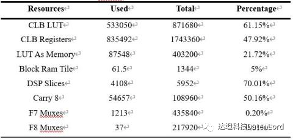

各项 FPGA 资源中 DSP Slices(70.01%)和 LUT(61.15%)的消耗最多, 主要用于 255-Bit Montgomery 模乘电路的实现上。这两项资源的不足也限制了在加速器中配置更多模乘器来提升计算并行度和整体的加速性能。

在时序上，实现(Implementation)后 Poseidon 加速器刚好能够满足 100MHz 工作频率的要求。关键路径上，建立(set up)时间的余量为 0.069ns，保持(hold)时间的余量为 0.01ns。

除了资源和时序外，FPGA 实现后的功耗信息如下图所示。由下图可见，在运行我们设计的加速器硬件时，FPGA 芯片的整体功耗在 24.7W 左右。而我们在性能测试中使用的 RTX 3070 GPU 加速卡的运行功耗在 120W 左右。

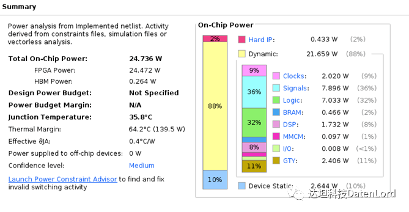

###　 5.2 计算性能测试

TRIDENT 项目中设计了两种方式测试 Poseidon 加速器的计算性能：

1. C 语言程序测试结果：在 Xilinx 提供的 XDMA 驱动的基础上使用 C 语言编写简单的性能测试程序。该测试程序向 FPGA 加速器写入一定数量的输入数据，并记录加速器完成所有数据哈希运算所需要的时间。基于该测试程序，我们分别测试了 Poseidon 加速器在三种长度输入数据下的性能表现。当输入数据的大小为 arity2, 即中间状态向量元素个数 时，加速器在 0.877 秒内完成了 850000 次的哈希运算，数据吞吐率可达到 29.1651MB/s, 即每秒大约能够完成 1M 次哈希运算

2. Lotus-Bench 测试结果：Lotus 中提供了计算机硬件在 Filecoin 计算负载下性能表现的基准测试程序 Lotus-Bench；与自己实现的 C 语言测试程序相比，Lotus-Bench 的测试更加接近实际的工作负载，能够得到更加准确的测试结果。在 Lotus-Bench 的基础上，我们分别测试了 CPU, GPU 和 FPGA 在 preCommit 阶段(该阶段主要完成 Poseidon 哈希函数的计算)处理 512MB 数据所需要的时间。FPGA 在 Lotus-Bench 测试下的算力可达到 15.65MB/s，大约是 AMD Ryzen 5900X CPU 实现的 2 倍，但和 RTX 3070 GPU 的加速性能相比仍有很大的提升空间.

## 总结

TRIDENT 项目旨在为 Filecoin 分布式存储系统中涉及的 Poseidon 哈希计算实例提供一套完整的 FPGA 加速方案。硬件上，我们基于 Xilinx Varium C1100 FPGA 板卡搭建了一个完整的加速系统，该系统主要由 XDMA、FIFO 以及 Poseidon 加速器 IP 三部分组成，并通过 PCIe 接口与服务器主机进行数据传输。软件上，我们为 Filecoin 的具体软件实现 Lotus 提供了访问底层 FPGA 加速器的接口，并通过 Lotus-Bench 对加速器的计算性能进行测试和比较。

整个硬件加速系统的核心模块—Poseidon 加速器 IP 的设计主要可以分成单元运算电路和整体架构两个部分。其中单元运算电路包括 255-Bit 的模乘和模加，对于模加器，TRIDENT 中采用基于加法的取余方式避免了多余的比较器电路开销。对于 255-Bit 模乘电路，我们基于 Karatsuba-Offman 算法将高位宽的乘法分解成若干并行的小乘法器实现，同时采用 Montgomery Reduction 算法将取余过程中复杂的除法运算转换成乘法实现。在加速器架构的设计上，我们针对具体的 FPGA 硬件资源限制，基于流水线和折叠技术设计了一个串行的 Poseidon 计算架构。性能表现上，目前 FPGA 加速器电路能够工作在 100MHz 并为 Filecoin 提供两倍于 AMD Ryzen 5900X 处理器的加速性能。但和 RTX 3070 GPU 相比还存在 2~3 倍的差距，仍然有较大的提升空间。

TRIDENT 项目后续的主要目标仍然是继续优化加速器的计算性能。根据已有的开发经验，我们认为整个加速系统未来的性能优化可以主要分成三个部分：1 提高电路的工作频率，包括优化电路设计中高扇出的信号以及长的组合逻辑路径；

2. 实现性能-面积比更高的模乘单元：模乘是 Poseidon 哈希函数中最主要的运算，同时对硬件资源的需求量也是最大的。如果在保持性能不变的情况下，减少模乘电路的硬件消耗，从而在 FPGA 设计中加入更多的模乘单元，可以进一步提高计算的并行度。

3. 优化加速器架构：由于需要适配 Filecoin Poseidon 计算实例中不同大小的输入数据，目前在输入较小的情况下加速器中存在一些冗余的运算单元。通过进一步优化加速器的整体架构，使得在不同长度的输入数据下，所有运算单元都能得到更好的利用，能够进一步提升整体的加速性能。
