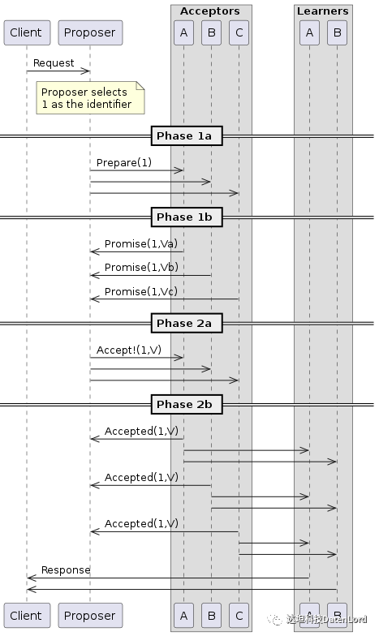
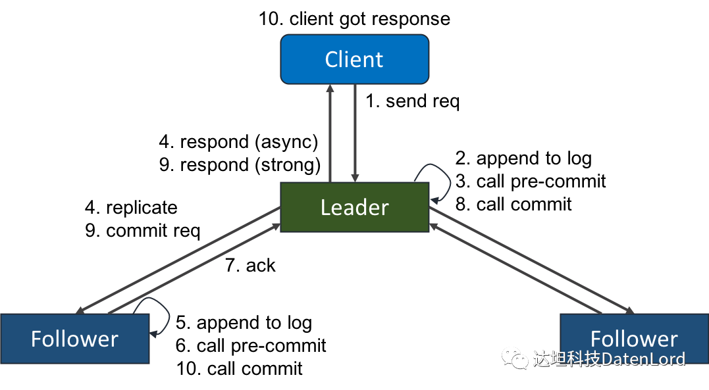
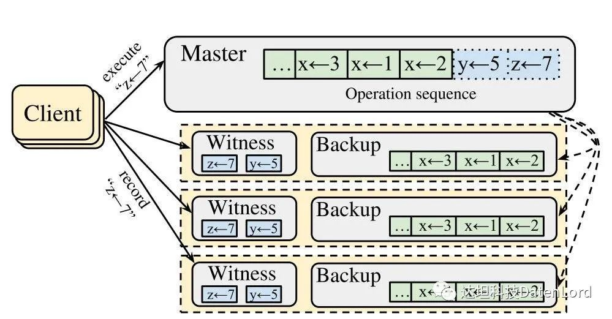

## 共识简介

共识协议是一种让分布式系统中多个节点保持信息一致的通信协议，即使少数节点发生故障也依然能够保证信息的准确和一致。而每当我们在讨论共识协议的时候往往会想到 classic paxos 或者 raft 协议，这两个协议是很多其他协议的基础，后续的很多协议都可以看成是它们的变种，例如 Multi-Paxos 和 Fast-Paxos 等等。我们今天先从这两个协议入手，先来回顾一下这两个协议是如何工作的。

首先来看 classic paxos 协议，如下图所示。Paxos 分为两个阶段（Phase)，第一个阶段是 Prepare，主要任务是在 Log 上占一个 Slot，第二个阶段为 Accept，主要是确定这个 Slot 已经明确被占用了，且在两个阶段间没有被其他人抢占。当 Client 收到绝大多数人的 Accept Ok 回复之后，说明该条记录已经被提交，在整个系统达成了共识。这里 Client 和 Proposer 可以视为一个整体，整个过程在两个阶段分别有一次消息传递，总共发生两次消息传递。

然后我们再看 raft 协议，如下图所示。Raft 也是通过 Client 来发起，Client 向 Leader 发送请求，Leader 将请求广播给所有 Follower，当超过半数 Follower 回复消息，Leader 确定该请求被提交，然后将消息回复给 Client。这里 Client 和 Leader 之间进行了一消息传递，Leader 和 Follower 之间进行了一次消息传递，总共发生了两次消息传递。

我们发现在上述的两个协议中，想要达成共识就必须要经过两次消息传递。两次消息传递在数据中心内部还不会造成太大的影响，增大的请求延迟往往还可以接受，但是在跨数据中心的场景下，每多一次消息传递就增加几十甚至上百毫秒的延迟，所以减小消息传递的数目在跨数据中心的场景下就非常必要。

接下去大家一定会问“两次消息是必要的的吗”？回答是在 Raft 和 Classic Paxos 的条件下，两次消息传递是必须的，因为他们同时保证了两个特性：

1. 请求一旦被 commit，则不会被修改或者丢失。
2. 请求执行顺序一旦被确定，顺序也不会被修改或丢失。

想要同时保证这两个特性，一次消息传递一定不够。在 paxos 这种无 Leader 的协议中，一次消息传递只能保证绝大多数节点收到的了请求，那么第 1 个特性能够保持，但是多个请求间的顺序没有办法在多节点间保持一致，破坏了第 2 个特性。在 Raft 这种有 Leader 的协议中，一次消息传递只能让 Leader 确定执行顺序，也就是第 2 个特性，但无法保证该请求不会丢失，因为此时只有 Leader 节点获悉这个请求。

那么我们有什么办法来减少一次消息传递呢？答案是放松特性，将特性 2 中的“全局唯一执行顺序”给舍弃，改变成“相冲突的请求保证全局唯一执行顺序，无关的请求可乱序执行”。Curp 协议就是引入了这个思想，仅通过 1 个消息传递实现共识协议。下面这个章节我们来介绍 `Curp` 协议。

## Curp 共识协议

本章我们来聊一聊 Curp 如何通过 1 个消息传递达成共识。因为细节繁琐和篇幅限制，本文不会完整讨论 Curp 共识协议的所有方面，而是摘取其中的关键点来阐述。下图为 Curp 协议的示意图：

主要流程描述如下：

1. Client 向包括 Master(Leader) 的所有节点发送请求。
2. 所有服务节点都维护一个请求“等待池子”，图中的蓝色请求都在“等待池子”中，这些请求都还没有完成同步。
3. 所有服务节点收到 Client 发送来的请求后会检查当前请求和“等待池子”中的所有请求是否冲突。
   a. 如果冲突，则给 Client 回复请求冲突，
   b. 如果不冲突，则给 Client 回复请求不冲突。
4. Client 在收集到不少于 (f + (f + 1)/ 2 + 1) 个“请求不冲突”回复且其中包含 Master 的回复后，认为该请求已经被 committed。否则 Client 等待 Master 将请求同步到绝大多数节点，而 Master 在同步完成后会将请求移出等待池子，并且通知 Client 请求达成共识。

这里我们以问答的方式来解释 Curp 协议，方便大家理解。  
Q1. Client 在收到不少于 (f + (f + 1)/ 2 + 1) 个“请求不冲突”回复且其中包含 Master 的回复后，为什么能够确认请求被 committed？  
A1：因为等待队池子是具有排他性质的，被绝大多数节点认可说明该请求在绝大多数的节点上不存在冲突，也阻止了后续可能冲突的请求被提交。此时即使有 f 个节点发生故障，我们仍然能够在 (f + 1) / 2 + 1 个节点上找到这个请求，请求不会丢失。这样不仅保证了这个请求一定不会丢失，还因为有之前的冲突检查，也保证了冲突请求间的执行顺序。

Q2. 上一个问题中数字 (f + (f + 1)/ 2 + 1) 很奇怪，为什么不是 f + 1？  
A2：共识协议最多允许 f 个节点发生故障，那么剩下的节点为 f + 1 个，最糟糕的情况中，那 f 个发生故障的节点全部包含了该请求，那么剩下的 f + 1 中还至少存在 (f + 1) / 2 + 1 个节点包含该请求，占有绝大多数，方便恢复流程将该请求恢复，防止丢失。

Q3. 是否所有的情况下 Curp 都能够在 1 个消息传递后达到共识？  
A3：不能保证。最好的情况是所有的请求都不互相冲突，那么所有请求都能够在一个消息传递后达到共识；最坏情况是所有的请求都相冲突，那么几乎所有请求都需要等 Master(Leader)节点完成同步后，Client 才能确认请求被 commit，这种情况就是 2 个消息传递，和 Raft 类似。

Q4. Master 同步请求的协议细节是什么？  
A4：Master 同步请求的方式 Raft Leader 节点一样，完全没有区别。

Q5. Curp 协议的恢复流程是如何的？  
A5：首先恢复流程需要选举一个新的 Master(Leader)，该流程和 Raft 一样。接下来的恢复流程可以大体分成两个模块：已经同步的请求部分，恢复流程和 Raft 协议保持一致；那些还没有被同步的请求需要从所有节点收集，当收集到 f + 1 个节点（包括新 Leader 自己）信息后，保留其中出现至少 (f + 1) / 2 + 1 次的请求，因为这些请求有可能已经被 commit 了，因此不能丢失。

## Curp 协议总结和讨论

通过上一个章节的论述，我们不难发现 Curp 协议和 Raft 协议非常像，其中的不同点就在于“等待池子”，这个池子的目的在于给冲突的请求排序，多个冲突请求一定不能被所有节点的“池子”同时接受，此时最多只有一个请求被 commit，也有可能所有请求都需要等待 master 的同步。也就是这个改动，让协议在某些情况下有更优秀的性能表现。

所以总结一下， Curp 协议在乐观情况下一个消息传递就能达到共识，悲观情况下会退化成 Raft 协议，需要两个消息传递才能达成共识。

关于 Curp 协议的更多细节请参考原始论文：https://www.usenix.org/system/files/nsdi19-park.pdf
