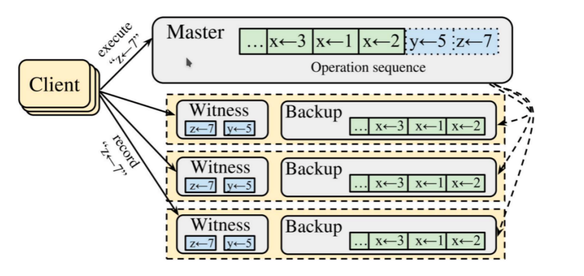

2022 年 10 月 15 日，达坦科技和 Rust 语言中文社区合作，在 Rust 唠嗑室活动中，由达坦科技（DatenLord）联合创始人施继成做了关于开源分布式存储技术的分享，着重介绍了达坦科技新的开源项目 Xline，这一跨云的 metadata(元数据)KV 存储的产品是如何实现高性能跨数据中心的数据一致性管理的。

## 内容介绍

施继成首先介绍了做 Xline 这个产品的动机。最初 2021 年 UCBerkeley 提出了 **Sky Computing（“天空计算”）** 的概念。与我们都熟知的 cloud computing（“云计算”）不同的是，sky computing，如其表面意义所讲，是天空中有很多的云，是解决跨云的问题。如何打破不同云之间的隔阂，或者打通和最大化利用跨云数据是当前面临的一个难题，也是我们的目标所在。如今谈论云计算时，我们不需要考虑云资源的部署，可扩展性等问题，因为云厂商已经都帮忙做了。但是，一旦跨云，则无论算力的迁移，或数据的迁移，都是摆在我们眼前要攻克的难题。达坦科技在做的就是解决“**如何做跨云数据交互**”的问题，我们致力于将分布式系统从数据中心范围扩散至全球范围，这样即使单个数据中心宕机，却仍不影响用户使用数据。

**跨云存储最重要的是解决共识一致性的问题。** 随着业务量的增长，server 数量也从最早的一个增长到了后来的多个。虽然可以使算力分开，让请求不会集中在一个 server 上，但同时也带来了挑战，即不同 server 间如何保证数据一致性，以及在少数 server 宕机时先前的决定还能够保存。不会出现“公说公有理、婆说婆有理”的局面，而是始终保留一致结果，且确保高可用性，这是共识算法想要达成的目的。

随即，施继成引入了 **Raft 和 Paxos 算法** 的概念，简单介绍了二者的发展以及操作过程。它们的思路和传递的 message 大同小异，但是后者没有一个确定的 leader。就传递多少 message 而言，没有很大差异，两者均会经过两个 Round Trip Time（2RRT）才完成一个共识协议的 request。

在全球数据中心间的延迟问题严重的情况下，multi-raft 解决方案应运而生，其不在协议上做深究，仅做数据切片。这种情况下虽然看似完善，但是仍然存在问题。例如，如果某数据中心区域因为某些原因不 available，那么运行在该数据中心的 raft group 就无法响应请求，其对应的数据也就不可获得了。

那是不是把该数据备份在不同的数据中心可以解决该问题呢？可以解决问题。但是正如前面提到的完成一次请求需要耗费 2RRT。若放置于不同的数据中心，Latency 则太大。所以，我们不经要问“**是不是一定要有 2RRT**”？

这个问题**促使大家重新审视 Raft 协议**。需要回顾我们拥有两个 RRT 的原因到底是什么？一个是确定 request 在 log 中的位置，即全局顺序，另一个是分发 request 给 followers 以确保数据不被丢失。后者 RRT 作为共识算法的能力是无法被放弃，因此，我们就着手从前者进行完善。

就全局顺序的原因，不得不提到 MVCC 的概念。MVCC 要求系统维护物理或者逻辑上的时钟，而全局顺序的 version 就是某种程度上的逻辑时钟，刚好共识协议的 log id 就可以被当作是 version。此时问题看似并没有得到解决，但如果假设没有 contention，那也就不需要 version 的保护。论文“**Exploiting Commutativity For Practical Fast Replication**”恰巧讲的就是这个原理，即 **CURP 协议**。CURP 的优势在于一方面在无冲突的情况下，一个 RRT 就可以完成请求，另一方面，在有冲突的情况下，可以退化成后端协议，即 Raft 或者 Paxos 等，最终保证没有请求都可以具有全局的 version。

## 我们的产品：Xline

**基于 CURP 这套协议，达坦科技开发了我们的产品 Xline**，它是兼容 etcd 接口的 metadata 存储接口。施继成最后提出，我们最终的希望是在跨云部署的情况下可以替代 etcd 取得更好的性能，同时能够将 CURP 协议剥离出来，后续可以被其他人复用。

现在 Xline 项目仍然处在早期状态，已经拥有了几个接口并且做了基本的测试。但是接口方面还有待完善，以及后续稳定性方面还需要迭代。我们手动搭建了一个容器环境模拟跨云场景，手动增加网络链接的延迟，当 Client 和 Leader 在一起时，Xline 延迟性方面的优越还无法体现，但当 Client 和 Leader 不在一个数据中心时，Xline 的优势就相当明显，这一测试结果也符合最初我们对原理的论述。

Xline 项目是以 **Rust** 语言写就，欢迎大家参与我们开源项目，GitHub 链接：  
https://github.com/datenlord/Xline.
