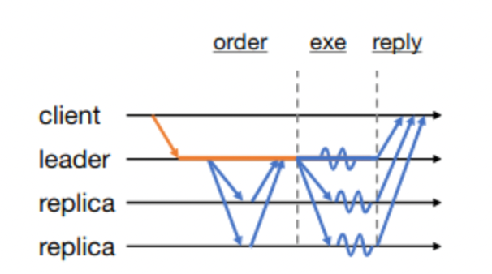
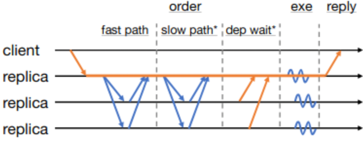

**论文原文：Tolerating Slowdowns in Replicated State Machines using Copilots**  
以下内容是对这篇论文的**阅读总结**，以及**部分重要章节（§3 Design、§5 Optimizations）的翻译**。

## 前言

现有的分布式状态机共识协议，不论其是何种流派，何种实现，都在模型中将节点状态抽象为仅有“在线”与“下线”两种情况。然而在实践上，节点状态并非只有这两种互斥的状态——节点可能因配置错误，节点侧网络问题，部分硬件出现问题，垃圾回收事件，以及其它很多原因而导致响应速度变慢（slowdown）。由于现有的共识算法没有很好地处理这一状态，系统内一个节点 slowdown 可能导致整个系统的响应速度变慢。Copilot 协议旨在解决这一问题：它可以在任何情况下可以容忍系统中 1 个节点发生 slowdown（1-slowdown-tolerant）。

### 定义 slowdown

要想解决这一问题，首先要对 slowdown 进行明确的定义。

首先要定义一个节点的处理速度。一个节点从收到一条消息开始，到其处理这条消息完毕，将回复送出为止，这段时间的长短就是一个节点的处理速度。这段时间不包含消息在网络链路上的传输时间，仅包含消息在节点本机处理所需的时间。假设一个节点处理一条消息的典型时间为 1ms，而设置超时阈值 t = 10ms，那么如果该节点处理一条消息花费了大于 10ms，就说明该节点出现了 slowdown。出错（failed）的节点一定是 slowdown 的，但 slowdown 的节点不一定 failed——它只是响应速度变慢，而不是停止响应。

下面定义 **s-slowdown-tolerance**。当一个系统中有 s 个节点发生 slowdown 时，系统仍能正常地提供服务，那么这个系统就是 s-slowdown-tolerance。假设一个分布式状态机系统有节点集 {r1, ..., rs, ..., rn}，且根据目前的 “slowdown” 定义排序，其中 {r1, ..., rs} 是最慢的节点。定义当前整个系统的处理速度为 T，并定义 T' 为将系统中节点 {r1, ..., rs} 全部替换为 rs + 1 时整个系统的处理速度。如果 T 与 T' 的差值接近 0，那么该系统就是 s-slowdown-tolerance。换句话讲，就是系统中出现 s 个节点 slowdown 不会影响整个系统的处理速度。

### 为什么现有的共识协议无法容忍 slowdown

一个分布式状态机系统在处理一条客户端指令时，如果在处理过程中的任意时间点，只有一条路径可走，那么该系统就存在“单点故障”的可能性——在这点处负责处理的节点发生 slowdown 会影响整个节点的处理速度。

Multi-Paxos

在 Multi-Paxos 系统中，所有客户端指令会通过 leader 处理，而 leader 可能会 slowdown 甚至 failed，此时系统的整体处理速度就会降低。

EPaxos

在 EPaxos 系统中，客户端指令会通过与之通信的节点处理，如果此节点 slowdown，系统的整体处理速度就会降低。

### Copilot 如何处理 slowdown

根据上一节，只要保证 在处理一条客户端指令过程中的任意时间点，都有大于等于 s + 1 条路径处理该条客户端指令，那么该系统就是 s-slowdown-tolerant。

Copilot 容忍一个节点 slowdown，因此需要在处理客户端指令时有两条路径。

## 设计

**本节内容是对论文 §3 Design 的翻译。**
Copilot 的设计核心是同时使用两个 leader 互为冗余地处理每一条 client 指令。两个 leader 为 pilot (P) 与 copilot (P')。

### 模型

- crash failure model - 出错的节点会停止发送与相应信息，无拜占庭错误
- 异步 - 执行指令与传递消息所需的时间没有限制，消息可能会延迟、乱序甚至丢失
- 容忍 2f + 1 个节点中出现 f 个错误并保证指令执行的线性顺序
- 可容忍 1 个节点发生 slowdown

### 排序

在 Copilot 排序中，pilot 与 copilot 都会收到 client 的指令并各自放入其 log 记录中，两者协调后得到最终顺序。pilot log 与 copilot log 通过 依赖 进行排序。依赖是指：应在执行某条指令前完成执行的指令。在提议阶段，pilot 与 copilot 会提出被排序指令的初始依赖。节点要么同意收到提议中的依赖顺序，要么回复其认为正确的依赖顺序。最终，每一条指令都会有其最终的依赖，以用于被执行。最终依赖可能会成环，这将在被执行时处理。执行时，pilot 与 copilot 的 log 记录通过上述排序过程被整合，在成环的依赖中 pilot 的指令会被优先执行以打破环。Copilot 排序会将指令与最终依赖持久化至其它节点以用于错误恢复。与 EPaxos 类似，每次排序操作都会经过 FastAccept 阶段，又是会经过 Accept 阶段。以下是排序的具体过程（暂时省略 fast takeover 与 view-change）。

#### Client 同时发送指令至 pilot 与 copilot

每个 client 都拥有 ID：cliid。client 会为每一个指令分配一个递增且不重复的 ID：cid。发送指令时，client 也会附加 cliid 与 cid 以标识指令，以便在执行阶段去重。

#### Pilot 提议指令与其初始依赖

当一 pilot 收到 client 发来的一条指令时会将其追加至自身 log 记录中，同时将最后收到的来自另一 pilot 的指令作为该指令的初始依赖。该 pilot 向其它节点（包括自己与另一 pilot）发送 FastAccept 消息提议这条指令与其初始依赖。

#### 节点回复 FastAccept

当一节点收到 FastAccept 消息时，它会检查收到的指令初始依赖是否与其之前已 Accept 的其它 entry 冲突。若不冲突，节点会回复此 FastAcceptOk。若冲突，节点会回复其认为正确的依赖顺序。

compability check：  
对于两个依赖，如果其中至少有一个的 entry 位于另一个的 entry 之后，则两依赖不冲突。在上图 a 中表示了冲突与未冲突的依赖：依赖于 P.1 的 P'.1 与依赖于 P'.1 的 P.2 没有冲突，因为 P.2 位于 P'.1 之后. 依赖于 P.2 的 P'.3 与依赖于 P'.2 的 P.3 冲突，因为它们都不位于对方 entry 之后。由于冲突的依赖可能导致指令执行顺序不一致，所以必须避免，如有节点会先执行 P.3 再执行 P'.3，有节点会反之。

节点会使用 compatibility check 检查 pilot 提供的初始依赖是否冲突。依赖于 P'.j 的 entry P.i 与 P.i 与 P'.j 之前 accept 的 entry 不冲突，所以 compatibility check 只需要检查该依赖是否与另一 pilot 之后的 log 是否冲突。若节点已 accept 另一 pilot 的 entry P'.k (k > j)，且 P'.k 依赖位于 P.i 之前的 entry，则依赖冲突。

如果节点：

- 还未收到之后的关于之后 entry 的依赖
- 已收到之后的 entry P'.k，但其依赖为 P.i 或在其后，如 P'.j, P.i, ... , P'.k

它会认为依赖不冲突，以 FastAcceptOk 回复，而相同的规则会阻止另一 pilot 之后的依赖冲突。否则节点会回复 FastAcceptReply 并附加其收到的最后一条来自另一 pilot 的 entry。

#### Pilot 尝试通过 fast path 来 commit 该指令

与 EPaxos 类似，若 pilot 收到至少 f + (f + 1) / 2 （fast quorum，包括该 pilot 本身）个节点的 FastAcceptOk 回复，就足以从之后可能发生的节点错误中恢复。此时 pilot 会通过 fast path 直接 commit 该指令与其依赖，向其它节点发送 commit 消息（无需等待回复）。

可能有两种原因导致 pilot 无法收到 fast quorum 的 FastAcceptOk 回复：

- 有其它节点出错，导致剩余节点不足 fast quorum
- 有其它节点检测到依赖冲突，回复 FastAcceptReply 与其认为正确的依赖顺序

不论哪种原因，pilot 都需要等待有至少 f + 1 个节点回复，才能进入下一步。

#### Pilot 在 Accept 阶段最终确定依赖

pilot 将上一步中收到的推荐依赖（包括自身，且 FastAcceptOk 即初始依赖）以升序排序，并选择第 f + 1 个推荐依赖作为最终依赖。选择第 f + 1 个是为了保证该依赖与任何已经 commit 的命令有交集以确保线性，不选择第 f + 1 个之后的依赖是为了防止之后的依赖与该依赖有依赖关系。

之后 pilot 使用 Accept 消息发送最终依赖到其它节点。最终依赖可能会导致成环，但这可以接受，因为执行时所有节点都会按照相同的方法打破环。其它节点收到该最终依赖后回复 AcceptOk。当 pilot 收到 f + 1 个 AcceptOk 回复后（包括其本身），即可 commit 该命令与最终依赖。

### 执行

节点使用两 pilot 的 log 合并后的顺序执行。合并后的 log 中，每个 client 指令都会出现两次。节点会在发现已执行过的指令时跳过该指令。执行指令后，pilot 与 copilot 都会将结果返回给 client。

#### Copilot 最终合并后的指令顺序

最终合并后的指令顺序由以下因素决定：

- 各 pilot 内各自的 log 顺序
- 两 pilot 指令间的依赖关系
- pilot 优先级，用于处理成环依赖

1. 最终顺序包含各 pilot 内各自的 log 顺序。上图，P.0 < P.1 < P.2。该顺序可能成环
2. 当依赖不成环时，依赖顺序即为最终顺序。上图，P.1 < P'.0 < P'.1 < P.2
3. 当依赖成环时，最终顺序由 pilot 优先级决定，pilot 的指令会在 copilot 的指令前执行。上图，P.4 < P.5 < P'.5

#### 依序执行

各节点在得到每条指令的最终依赖后就会按照相同的顺序执行。当一条指令 commit，且对应 entry 前的所有指令已都被执行后，节点会执行这条指令。

以下规则决定何时可以执行一条 entry 为 P.i、依赖为 P'.j 的指令：

1. P.i 已 commit
2. P.(i - 1) 已被执行
3. P'.j 已被执行，或 P.i 与 P'.j 成环且 P 为 pilot 指令

节点可以乱序接受指令的 commit 消息，如节点可能先得知一指令 commit，之后再得知该指令的依赖 commit。为了达到所有指令的执行顺序一致，节点必须在执行一条指令前执行过该指令的依赖以及该指令 entry 前的所有指令。例如在执行一条 entry 为 P.i、依赖为 P'.j 的指令时，需要：

- P.i 之前 entry 的所有指令都已被执行
- P'.j 已被执行
- P'.j 之前 entry 的所有指令都已被执行

才能执行 P.i。Copilot 的 Fast Takeover 机制可以防止正常运行的 pilot 等待 slowdown 的 pilot。

#### 去重执行并回复

若排序过程按正常情况执行，每一条指令在 log 合并后都会出现两次。节点只会在一条命令出现第一次时执行该命令。cliid 与 cid 组成的元组在这里可以用来标识指令。若该节点是 pilot 或 copilot，执行完成一条命令后会将结果返回给客户端。客户端收到一个返回的结果后，会忽略之后由另一 pilot 返回的结果。

### Fast Takeover

为了达到执行顺序一致，有时一 pilot 需要等待另一 pilot 的 commit 消息。正常工作的 pilot 等待另一 slowdown 的 pilot 会消耗大量时间，因此需要 Fast Takeover 机制。  
每个节点 log 中的每一个 entry 都会附有一 ballot number。与 Paxos 的 proposal number 类似，Copilot 协议过程中的每条消息都会带有 ballot number。通过这些序列号可以让 pilot 安全地进行与 Paxos 类似的所有权竞争的 Fast Takeover。

当一个节点被选举为 pilot 或 copilot，所有节点中该 pilot log 的 entry ballot number 都会被设置为 b。节点只会接受附加 ballot number 大于等于对应 entry 的 ballot number 的消息。在 pilot 正常工作时，其发出的所有消息的 ballot number 值都为 b。

当一 pilot 发现另一 pilot slowdown ，希望代替其完成某 entry 的 commit 时，正常工作的 pilot 会向所有其它节点发送关于该 entry 的 Prepare 消息并附加大于 b 的 ballot number 值 b'。如果其它节点确认 b'大于该 entry 原本的 ballot number 值 b 时会回复 PrepareOk 消息，并将该 entry 的 ballot number 值设置为 b'。PrepareOk 消息中会包含该 entry 目前的状态（not-accepted、fast-accepted、accepted 或 committed），同时包含该 entry 之前最大的 ballot number、指令与依赖。

在正常 pilot 发送 Prepare 消息后，它需要等待接收到至少 f + 1（包含它本身）个 PrepareOk 消息。如果通过某 PrepareOk 消息得知该指令已被 commit，该 pilot 会立即停止等待并 commit 该指令与其依赖，结束 Fast Takeover 过程。否则，该 pilot 会通过如下过程选择该指令与其依赖，并通过 Accept 消息发送，等待 f + 1 个 AcceptOk 回复，然后继续执行。

#### entry 内容的恢复过程

Fast Takeover 与 view-change 都使用了本过程，以正确恢复任意可被 commit 并执行的 entry。本过程十分复杂，细节可参阅 Technical Report TR-004-20。

在附加正确 ballot number 的 PrepareOk 回复集合中：

1. 若有至少一个回复 entry 状态为 accepted，则采用该回复的指令与依赖
2. 当有小于 (f + 1) / 2 个回复状态为 fast-accepted 时，设置该 entry 为 no-op 且依赖为空
3. 当有大于等于 f 个回复状态为 fast-accepted 时，采用该回复的指令与依赖

在第一种情况中，该 entry 可能已经被 commit 并附加了更小的 ballot number，所以必须采用原值与依赖。在第二种情况中，该 entry 不可能已被 commit，所以采用 no-op 是安全的。在第三种情况下，该 entry 可能已经被 commit 并附加了更小的 ballot number，所以可以采用原值与依赖，因为 f 个 fast-accepted 回复与该 pilot 本身已构成了一个 majority quorum。

除上述情况外，还有一种可能，有大于等于 (f + 1) / 2 且小于 f 个回复状态为 fast-accepted。这种情况下，该 entry 可能已被 commit，也可能有另一 pilot 已提案另一与之冲突的指令，且有其它节点已收到了该 fast-accept。为了确定情况，发起这次恢复过程的节点需要检查另一 pilot log 中是否存在冲突的 entry。若发现冲突的 entry 但还未 commit，则对此 entry 重复整个上述过程，最终安全地完成恢复。

#### 触发 Fast Takeover

当 pilot 得知一条 entry 为 P.i、依赖为 P'.j 的指令被 commit 时，如果：

- P.i 之前 entry 有指令未被 commit
- P'.j 未被 commit
- P'.j 之前 entry 有指令未被 commit

pilot 就会启动一个 timer。若 timer 达到了 takeover-timeout 且仍有执行 P.i 所需的指令没有被 commit，该 pilot 就会停止等待，主动接过 commit 所需指令与排序的任务，fast takeover 另一 pilot log 中所有可能为该指令执行前置条件的 entry。在该 Copilot 实现中，所有 entry 的 fast takeover 过程是被批量合并且是并行的。

如果 takeover-timeout 设置的时间太短，就会产生没有必要的错误 fast takeover，从而导致 proposal 竞争。proposal 竞争问题可以使用指数退避随机化 timeout 来避免。为了避免必要的错误 fast takeover，可以将 takeover-timeout 设置为一个中等大小的值（如 10ms）。中等大小的 takeover-timeout 可能导致处理速度变慢，但是使用 Null Dependency Elimination 可以避免这个问题。

Fast takeover 与 leader 选举看起来十分类似，它们都是通过等待某节点相应时超时触发的。Leader 选举是由于某节点无法在设定 timeout 内收到另一节点的某种消息（如心跳或新指令提议）触发的。但是有时虽然 leader 仍可正常发送心跳，但其实际处理指令的速度会因为一些因素而变慢。Fast takeover 是由指令处理路径上某点的 slowdown 触发的，配合指令同时有两条互不依赖的处理路径，可以在发生 slowdown 时总会由较快的 pilot 处理完成指令。当一个 pilot slowdown 时，另一个 pilot 会通过 fast overtake 处理所有指令，无需等待较慢的 pilot。

### 额外设计

本节未提到的 Copilot 设计都与其它分布式状态机的设计一致。

保证指令仅被执行一次是通过检查 cliid 与 cid 实现的。记录一条指令已被执行一次的 cliid 与 cid 容器会在第二次遇到相同指令时清空。

对于结果非确定的指令（如涉及随机数生成，每次执行结果都不同），可以由两 pilot 完成非确定部分（随机数生成），此时该指令的执行结果变为可确定的值，再进行排序与执行等操作。两 pilot 在完成非确定部分时可能不同，所以最终的指令可能的执行结果会有两个版本，但执行的去重机制可以保证只有一个结果有效。

与 Multi-Paxos 的 leader 选举类似，pilot 与 copilot 选举使用 view-change。view-change 选举得到的新的 pilot 与 copilot 使用之前提到的 entry 对应内容的恢复过程。由于两 pilot 有各自独立的 log，在重新选举一个 leader 时另一 pilot 可以不间断地为 client 提供服务。在这个过程中，正常的 pilot 不会将另一 pilot 的 entry 作为依赖，所以可以一直在 fast path 上 commit，直到另一 pilot 选举完毕。

### Copilot 能达到 1-slowdown-tolerant 的原因

Copilot 通过保证任何客户端指令在任意时间节点都在两条不同的处理路径上。两条路径的处理速度不同，处理速度快的路径得到的结果必定先返回客户端。

当两 pilot 都为正常状态时，就算有最多 f 个其它节点 slowdown 时，1-slowdown-tolerant 仍成立，因为在 regular path 上 commit 只需要 f + 1 个节点回复。  
当一 pilot 发生 slowdown 或出错时，另一个正常的 pilot 仍可以正常 commit 其 entry，如果有对 slowdown pilot 指令的依赖，正常 pilot 会执行 fast takeover 解决这个问题。在 slowdown 发生后，正常 pilot 会通过 fast takeover 迅速的解决对 slowdown pilot 指令的依赖，之后即可按正常流程继续处理。此时该分布式状态机的总体执行速度取决于此正常的 pilot，所以 1-slowdown-tolerant 成立。

## 优化

**本节内容是对论文 §5 Optimizations 的翻译。**

### Ping-Pong Batching

当两个 pilot 都在正常运行时，如果几条指令同时以乱序到达两个 pilot，就可能因顺序不一致导致无法通过 compability check。Ping-Pong Batching 通过协调两 pilot 的提案顺序从而避免上述情况，使提案总会通过 fast path 完成。

在 Ping-Pong Batching 过程中，各 pilot 会打包（batching）在一定时间段内到达的指令。在此期间该 pilot 每收到一条指令都会将其放入自己的下一个 entry 中，因此打包后的指令会是一组连续的 entry。当该 pilot 收到另一 pilot 的 FastAccept 消息，或到达设定的打包最长时间段（ping-pong-wait timeout），就会结束当前的打包操作。

当两 pilot 都未出现 slowdown 的正常情况下，打包操作会因收到另一 pilot 的 FastAccept 消息结束。如此，两 pilot 的 FastAccept 会如 ping-pong 一般进行。Pilot 结束其对第一批指令的打包并发送 FastAccept 消息，copilot 收到该消息后也会结束打包并发送这批指令的 FastAccept 消息，pilot 收到该消息后又会结束其对第二批指令的打包并发送 FastAccept 消息，如此往复。

上述流程可以保证每个 pilot 会在发出 FastAccept 前都会收到另一 pilot 的 entry 顺序，因此可以避免发出有依赖冲突的消息，因此其它节点在收到 FastAccept 消息后进行的 compability check 都会成功，使得每一次提案都可以在 fast path 上完成。

当有一 pilot 出现 slowdown 时，另一 pilot 会在达到 ping-pong-wait timeout 后结束打包操作。这避免了因一个 pilot 出现 slowdown 导致整个系统 slowdown。

### Null Dependency Elimination

当一 pilot 发现自己将要执行的指令有依赖位于另一 pilot log 中，且还未 commit，这时它会检查自身是否已执行过该依赖所对应的指令，若发现已执行过，则无需等待另一 pilot 的 commit 消息，可直接跳过。满足以上条件的依赖称为 null dependency，该机制名为 Null Dependency Elimination。在 null dependency 出现时，pilot 无需等待该未 commit 的依赖，因为该依赖不会对最终的执行结果产生影响，pilot 只需将该依赖标记为已执行然后继续。

当有一 pilot 出现持续的 slowdown 时，Null Dependency Elimination 可以让正常的 pilot 省去 fast takeover 的步骤。因为 slowdown 的 pilot 的提案比正常的 pilot 慢，所以其 entry 都是 null dependency，正常 pilot 可以直接跳过等待。若一 pilot 在提案后才发生 slowdown，fast takeover 仍是必要的。在正常 pilot fast takeover 过 slowdown pilot 的提案后，就可以通过 Null Dependency Elimination 跳过等待发生 slowdown 的 pilot 了。因此 1-slowdown-tolerant 仍是成立的。

## 总结

Copilot 协议借鉴了之前各协议的优点，其排序部分与 EPaxos 类似，fast takeover 过程与 Paxos 类似，pilot 选举与 Multi-Paxos 一致。同时，Copilot 排序不依赖客户端指令本身是否 interfere，而将指令到达时间作为排序的唯一依据，这也减小协议的实现难度。通过文中提到的优化，Copilot 在无节点 slowdown 时虽然无法达到 Multi-Paxos 或 EPaxos 性能水平，但仍有一定竞争力。在有节点 slowdown 时，Copilot 是唯一能避免整个系统速度收到影响的协议。综上，在选择分布式状态机系统的共识协议时，Copilot 协议不失为一个好的选择。
