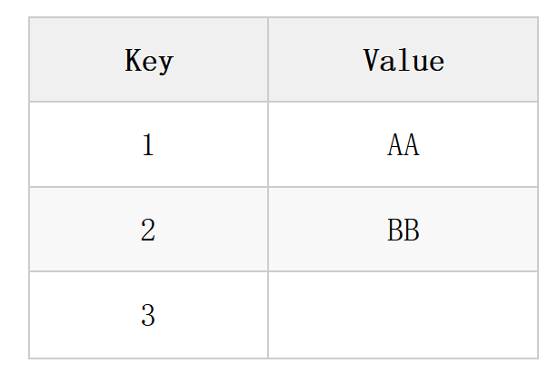
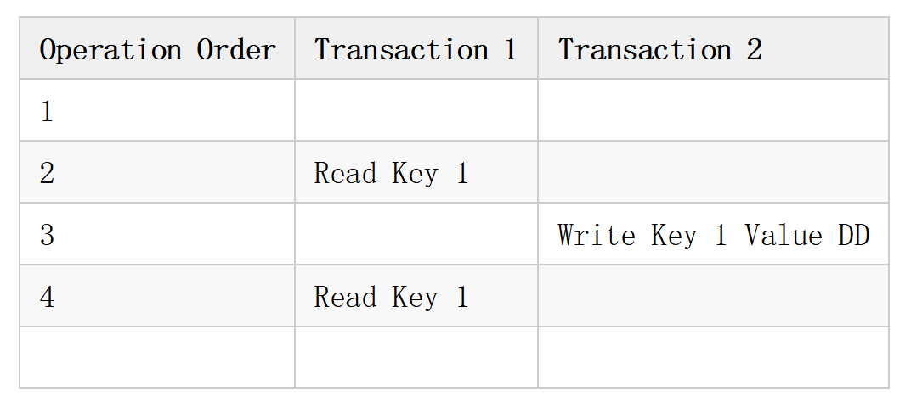
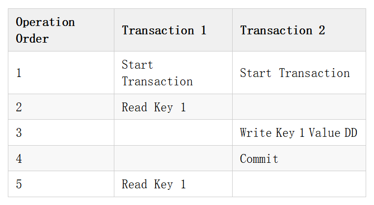
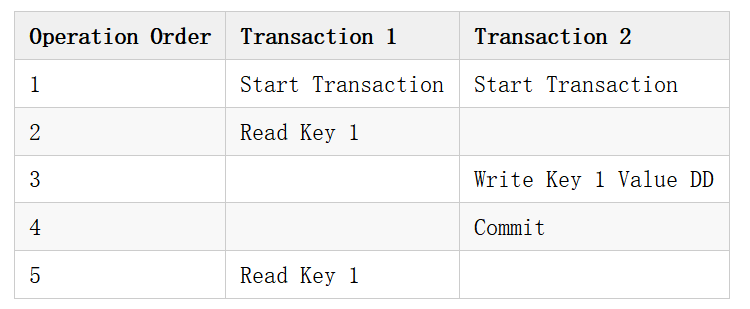
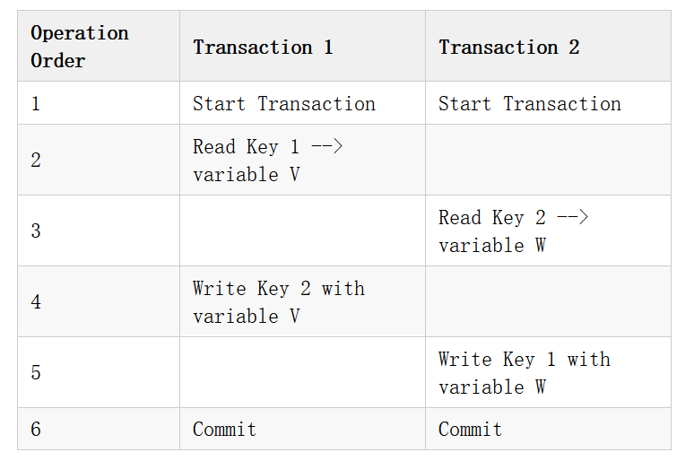

## 数据库隔离级别介绍

数据库在同时处理多个事务时需要决定事务之间能否看到对方的修改，能看到多少等等。根据隔离的严格程度，从严到松可以分为 Serializable, Repeatable reads, Read committed, Read uncommitted。我们用下面这个 KV 存储的例子来解释这四个隔离级别。KV 存储的初始状态如下：

Table 1:

### Read uncommitted

有两个事务同时被执行，自上而下是执行顺序。

Table 2:

在 Read uncommitted 的隔离级别中，多个同时执行的事务是能够互相看到互相没有 commit 的写操作，因此可以认为这种隔离级别几乎没有作用。在上述例子中，Operation 2 读到的内容是 “AA”，Operation 4 读到的内容则是“DD”，即使第二个事务最终 Rollback 了。Read committed 有两个事务同时被执行，自上而下是执行顺序。

Table 3:

在 Read committed 的隔离级别中，只有被 Commit 后的结果可以被看到，因此在 Table 2 的执行顺序中，Operation 2 和 4 都能够读取到 “AA” 的值，即 Key 1 的值没有改变。如果按照 Table 3 中的情况执行两个事务，Operation 2 读到的值为 “AA”，Operation 5 读到的值为 “DD”，因为此时事务 2 已经执行成功。

### Repeatable read

如果在 Table 3 中的事务 1 两次连续读操作，用户想要保证读到相同的值，那就需要使用 repeatable read 隔离级别。在这个隔离级别中，在同一个事务中对同一条数据的多次读取保证会得到相同的值，即使这个过程中该数据被其他已经提交的事务修改掉。当然该隔离级别也有一些情况无法保证隔离性，比如下列情况：

Table 4:

在 repeatable read 的隔离级别下，Operation 2 的返回结果是 ["CC"] —— 只有 Key 3 的值被返回了，但是 Operation 5 的返回值是 ["CC", "DD"]。总结一下，repeatable read 的隔离级别仍然无法很好处理涉及多条数据的情况，特别是当有新的数据插入或者删除的情况。

### Serializable

最严格的隔离级别叫做 Serializable，这个级别的定义也是最清晰明了的，在这种隔离级别下的执行结果，就“仿佛”是将所有事务串行起来一条一条执行的结果。上面这句话中值得强调的是 “仿佛” 二字，为了提高性能，几乎没有数据库是采用真正物理意义上的串行执行来保证 Serializable 的，仅仅达到类似效果即可，实现的方法是可以多种多样的。在 Serializable 级别下还有一个细致的分类，叫做 Snapshot，该分类与 Serializable 类似但约束能力上稍弱。正是因为 Snapshot 在约束上的放松，使得其实现起来具有更好的性能，也是绝大多数数据库默认支持的隔离级别。下面我们就来说说 Snapshot，以及引申出来的 MVCC 实现方法。

## Snapshot 隔离级别及 MVCC

想要区分最严格的 Serializable 和 Snapshot，我们还是从例子来看，看下列两个事务的操作：

Table 5:

如果按照严格的 Serializable 的隔离级别，无论 Transaction 1 和 2 哪个先执行，最终 Key 1 和 2 的值都是相同的，有可能是 “AA”， 也有可能是 “BB”。但是在 Snapshot 的级别下执行，执行结果则是 Key 1 和 2 的值进行互换。很明显在这种情况下 Snapshot 的隔离能力明显更弱。Isolation 对于存在读写交集的事务的先后顺序无能为力，只能保证存在写冲突的事务间的先后顺序。

上述例子中，我们虽然具体地看了 Snapshot 隔离级别和 Serializable 之间的差异，但是我们还没有完整介绍过 Snapshot 的特性：

- 在 Snapshot 中的事务具有两个重要的时间戳，一个是读时间戳 R，另外一个是写时间戳 W，R 之后的所有读取操作都只能读取到 R 之前 commit 的数据。
- Snapshot 允许两个不存在写交集的事务同时执行，并行不悖。

为了同时满足上面两个特性，很自然地就会想到为每一个数据保存多个版本，当写操作被 commit 的时候，新的数据被保存在新的版本中，旧的数据不会被覆盖，这也就是我们所说的 MVCC（Multiversion concurrency control）。

我们知道读操作之间是不存在冲突的，写操作之间在 Snapshot 的级别下也无法同时执行（或者发现冲突进行回滚），所以 MVCC 主要在读写操作发生冲突时起作用，可以让两个看似冲突的事务并发执行。

MVCC 还需要进行垃圾回收，否则过多的旧版本数据会占据不必要的存储空间。下一个问题则是，如何判断某个版本的数据是否可以删除？答案是：当涉及该版本数据所有读取操作都结束了就可以被删除，当然前提是前面还有更新版本的数据存在。

## 一点联想

在介绍 MVCC 的过程中我们很容易抓到以下几个关键点：

1. 多版本。
2. 垃圾处理。
3. 提高并发操作效率。

在之前达坦科技（DatenLord）的题为“Rust 语言无锁数据结构的内存管理”的文章当中，介绍了另外一项技术和这几个关键词是相关的，那就是无锁数据结构中的 “基于世代的内存管理方法”，英文是 epoch-based memory management，以下简称 epoch。epoch 维护了两个世代的内存状态，当最老世代的内存已经没有人继续访问的时候，那么对应的内存就会被回收释放，然后开启一个新的世代。这样做的目的其实也是为了让对新世代数据修改的操作和对老世代数据的读取操作能够并行，目的也是为了读写并发的优化。当然除了这些相似的地方，也有不同的地方，MVCC 可以同时存在许多个版本，epoch 同时存在的版本永远都是两个。这其实可以理解成为 epoch 的内存管理颗粒度更粗，所以当 contention 重的时候 epoch 有时会造成内存压力增大。

总体而言，MVCC 和 epoch 在中心思想上是类似的，为了解决并发读写冲突的问题，采用了多版本的内存控制技术。

## 总结

本文为大家介绍了数据库的四种隔离级别，分别用例子介绍了不同隔离级别之间的区别。然后详细介绍了 Snapshot 这个使用最广泛的隔离级别，并且说明了其最长用的实现方式 MVCC。最后结合了 MVCC 和 无锁数据结构的内存管理机制进行了对比和探讨。

达坦科技 Xline 项目专注于跨云元数据管理 KV 存储，并且目前正在实践应用 MVCC 做数据库隔离。如果您想了解更多相关信息，请参考 Xline GitHub 链接：  
https://github.com/datenlord/Xline

本周次条是 Xline 最新版本的发布，请阅读《Xline v.0.2.0：一个用于元数据管理的分布式 KV 存储》。
