本文旨在为没有接触过形式化方法的读者提供一种新的视角看待计算机系统与算法，而非形式化方法或 TLA+ 教程。因此本文的重点是如何从数学角度思考程序，不会使用大篇幅讲解 TLA+ 的语法。

## 我们该如何写出正确的程序？

程序设计的目标永远是写出正确的程序。随着时间的推移，我们的程序越来越复杂，其中可能存在的错误也越来越多。想要写出正确的程序，首先应该了解程序中可能出现的错误有哪些。

### 程序中会有什么样错误？

我将程序中可能出现的错误粗略地分为两类：简单错误与逻辑错误。

#### 简单错误

简单错误包含语义错误、内存错误等。对于这些容易分析的简单错误，我们已经有很多成熟的方法与工具来避免，如编译器、静态分析工具、Garbage Collector 等。由于这类错误可以比较容易地被发现与修复，因此不是我们关注的重点。

#### 逻辑错误

逻辑错误是程序中最难发现的错误，也是最难修复的错误，如死锁、竞态条件、数据不一致等。逻辑错误影响了程序的正确性、性能、可靠性等指标，通常是由于程序的设计不够完善导致的。对于这类错误，我们需要从更高的层面来分析与设计程序，而非仅仅从代码的实现细节来考虑。

我们通常会使用一些方法来避免逻辑错误，如：

- 优化软件架构设计 - 在设计阶段就考虑程序的正确性，避免设计出不够完善的程序
- 测试 - 使用各种测试方法来减少程序的错误，但无法保证程序的完全正确

### 经验

不难看出，上述理论都是通过总结经验得出的。经验是在实践中积累的，我们将经验加以总结，得出指导性的原则、方法与步骤，可以帮助我们设计出更好的程序

#### 我们能否仅依赖于经验？

越有经验的人往往能想到更多的细节与可能性，设计出的系统通常更稳定。但我们不能仅仅依赖于经验：

- 经验有局限性 - 人类的经验是有限且不可靠的
- 复杂系统的行为、状态太多 - 一个复杂的系统，其行为与状态太多，很难通过经验来预测
  特定程序对正确性的要求很高 - 有些程序对正确性的要求很高，如金融系统、医疗系统等，这些程序的正确性很难通过经验来保证
- 无法从理论上验证正确性 - 只能尽量减少错误的发生，但无法从理论上证明程序的正确性

综上，我们需要一种更加严谨的方法，从设计上保证程序的正确性。

### 形式化方法

如果能够从数学角度验证一个程序的正确性，就可以解决上述的问题，这就是形式化方法的目标。

形式化方法基于数学，通过为系统建立数学模型，来定义系统的行为、状态等，然后定义系统的约束条件，如安全性、活性，最终证明模型满足系统形式规约，来验证系统的正确性。对于有穷状态的系统，可以使用以穷尽搜索为基础的模型检测，通过搜索待验证系统模型的有穷状态空间来检验该系统的行为是否具备预期属性。对于有无穷状态空间的系统，使用逻辑推理为基础的演绎验证，利用归纳法验证系统的正确性。

本文用 TLA+ 语言作为工具来介绍形式化方法。

## TLA+

TLA+ 的作者是在并发和分布式系统领域做出开创性贡献的 2013 年图灵奖获得者，计算机科学家 Leslie Lamport。

TLA+ 是一种用于对程序和系统进行建模的高级语言——尤其是并发和分布式程序和系统。其核心思想是：精确描述事物的最佳方式是使用简单的数学。TLA+ 及其工具可用于消除的设计错误，这些错误很难在代码中发现并且纠正起来代价高昂。

使用 TLA+ 编写的 specification 并不是真正的工程代码，无法用在生产环境中，因为 TLA+ 的目标是在系统设计阶段就发现并解决逻辑错误。在 TLA+ 中，我们将程序抽象为有穷状态的数学模型，通常是状态机，然后利用 TLC Model Checker 穷尽程序所有可能到达的状态并验证其正确性。

下面通过两个简单的例子介绍 TLA+。这两个例子均来自 TLA+ 作者的 Leslie Lamport's The TLA+ Video Course。本文的目标是为没有接触过形式化方法的读者提供一种新的视角看待计算机系统与算法，而不是 TLA+ 教程，因此不会过多介绍 TLA+ 的语法与工具的使用。

### 简单的例子

TLA+ 可以让我们使用简单的数学抽象系统模型，主要是集合论与布尔逻辑。在抽象的过程中，我们要舍弃很多实现细节，仅关注程序的逻辑本身。

下面是一个简单的 C 语言程序，我们尝试将其抽象为一个 TLA+ 程序：

```c
int i;
void main() {
    i = someNumber(); // someNumber() 用来得到一个 0 到 1000 之间的数字
    i = i + 1;
}
```

#### 状态抽象

我们需要将这个程序抽象为一个个独立的状态。很显然，对于这个简单的程序，各状态之间的不同点只有 `i` 的值。假设 `i` 在初始化后的默认值是 0，且某次运行这个程序时 `someNumber()` 返回了 42，那么这个程序存在的状态转换关系就是：

[i : 0] -> [i : 42] -> [i : 43]

这之中有三个状态，每个状态间的区别均为 `i` 的值不同。

这样看似完成了抽象，但是这个抽象还是有问题的。假设在另一次运行中，`someNumber()` 返回了 43，那么这个程序的状态转换关系就是：

[i : 0] -> [i : 43] -> [i : 44]

这与之前的抽象不符，因为两次运行的状态转换关系不同。这是因为我们没有考虑到 `someNumber()` 的返回值。

程序的"状态"是指程序运行完成各个阶段后的时间点，而不是程序运行的过程。因此，每个状态都是独立的，且状态之间的转换都是原子的。这与传统的编程有很大的区别，因为传统的编程是面向过程的，而 TLA+ 是面向状态的。我们只在乎目前程序运行到了什么状态，因此可以引入一个变量 `pc` 来表示程序运行到了哪个阶段，这样我们就可以清晰地表示程序的次态关系：

```c
int i;
void main() {
    i = someNumber(); // pc = "start"
    i = i + 1;        // pc = "middle"
}
```

这样，我们不需要再考虑 `i` 的值，只需要考虑 `pc` 的值即可：
[pc : start] -> [pc : middle] -> [pc : done]

#### 状态编写

`i` 的初始值为 0，`pc` 的初始值为 `start`，我们可以把次态关系写成：

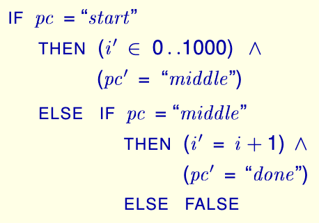

其中，对于变量 `i`，它的下一个状态表示为 `i'`，这是 TLA+ 中定义变量状态转换的方式。`i' ∈ 0..1000` 代表 `i` 在下一个状态的值是 0 到 1000 之间的一个数，也就是 `someNumber()`，`0..1000` 代表集合 `{0,1,...,1000}`。`∧` 是布尔逻辑中的逻辑与，可以认为意为"并且"。最终程序运行完成，不会再有下一个状态，因此表示为 `FALSE`。

在 TLA+ 中，我们编写的是一个个状态。因此，并非是"因为 `pc = start` 所以 `i' ∈ 0..1000`"，事实上两者的关系是并列的：**在这个状态中，`pc` 的值是 `start` 并且 `i` 下一个状态的值 `∈ 0..1000`**。有了这样的思想，我们可以将上面的抽象改写为：

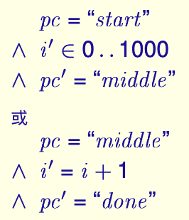

在其中用到了"或"连接两个状态，我们可以用布尔逻辑中的逻辑或 `∨` 来表示。这样，我们就可以清晰地表示出程序的状态转换关系了。为了美观，在 TLA+ 中，首句前也可以补上相同的布尔逻辑符号：

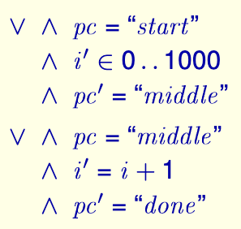

我们最终得到了这个简单程序在初始状态后的两个状态，下面我们将初始状态补全，并按照 TLA+ 语言的要求补全整个 specification：

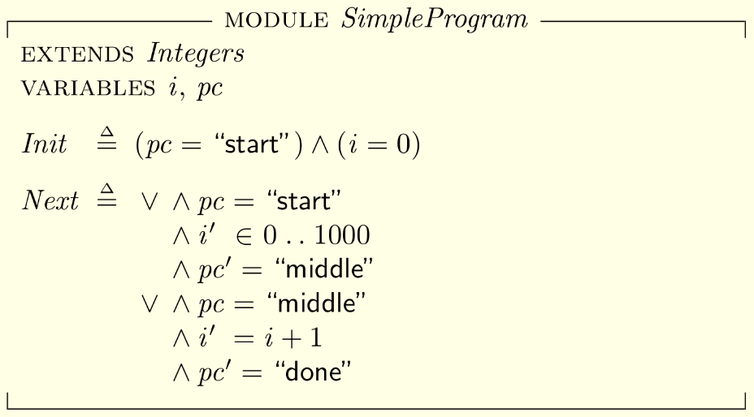

- EXTENDS 用于引入其他 specification 中定义的 module，这里引入了标准库中的 Integers，主要用在 i' ∈ 0..1000 上。
- VARIABLES 用于定义变量，这里定义了 i 和 pc。
- Init 用于定义初始状态，这里定义了 i = 0 和 pc = "start"。
- Next 用于定义状态转换关系。

EXTENDS 用于引入其他 specification 中定义的 module，这里引入了标准库中的 Integers，主要用在 i' ∈ 0..1000 上。

VARIABLES 用于定义变量，这里定义了 i 和 pc。
Init 用于定义初始状态，这里定义了 i = 0 和 pc = "start"。
Next 用于定义状态转换关系。

## Two-Phase Commit

> 二阶段提交（英语：Two-phase Commit）是指在计算机网络以及数据库领域内，为了使基于分布式系统架构下的所有节点在进行事务提交时保持一致性而设计的一种算法。通常，二阶段提交也被称为是一种协议（Protocol）。在分布式系统中，每个节点虽然可以知晓自己的操作时成功或者失败，却无法知道其他节点的操作的成功或失败。当一个事务跨越多个节点时，为了保持事务的 ACID 特性，需要引入一个作为协调者的组件来统一掌控所有节点（称作参与者）的操作结果并最终指示这些节点是否要把操作结果进行真正的提交（比如将更新后的数据写入磁盘等等）。因此，二阶段提交的算法思路可以概括为：参与者将操作成败通知协调者，再由协调者根据所有参与者的反馈情报决定各参与者是否要提交操作还是中止操作。—— **Two-Phase Commit (Wikipedia)**

在 **Leslie Lamport's The TLA+ Video Course** 中，Lamport 以这样的方式类比解释 Two-Phase Commit：

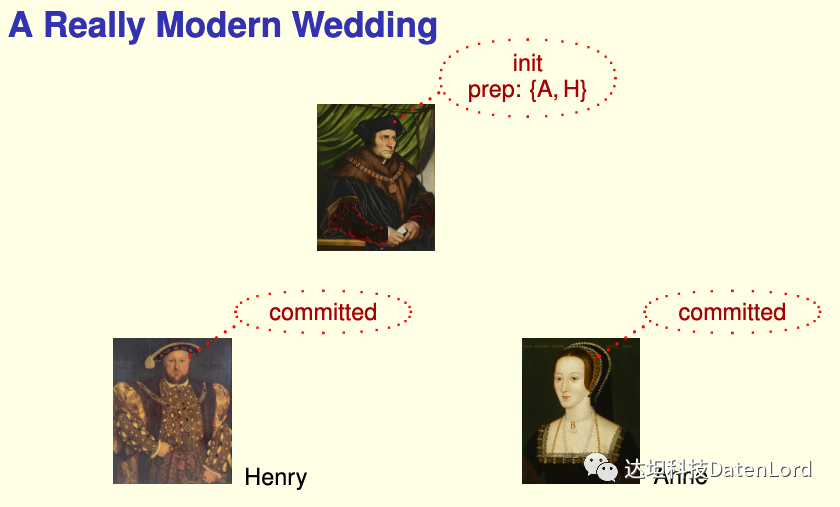

在婚礼上，牧师是协调者，新郎和新娘是参与者。当新郎和新娘都同意婚事时，牧师才会正式宣布婚事。如果有一方不同意，牧师就会中止婚事：

1. 牧师问新郎：你是否同意这件婚事？
2. 新郎回答：我同意（prepared）。
3. 牧师问新娘：你是否同意这件婚事？
4. 新娘回答：我同意（prepared）。
5. 牧师宣布：婚事正式成立（committed）。

如果其中有一方不同意，牧师就会中止（abort）婚事。

在数据库中，Transaction Manager 是协调者（牧师）。当 Transaction Manager 询问所有参与者 Resource Managers （新郎 / 新娘）时，如果所有 Resource Managers 都同意提交事务，Transaction Manager 就会把事务提交。如果有一方不同意，Transaction Manager 就会中止事务。

Two-Phase Commit 的详细介绍与流程可以在 `Wikipedia` 上找到。

首先我们来定义一些常量与变量以及其初始状态：

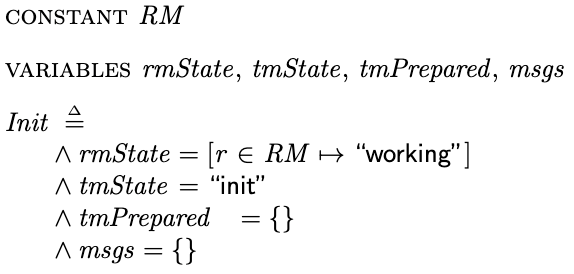

- 常量 `RM` 是所有 Resource Manager 标识的集合，例如可以设为集合 `{"r1", "r2", "r3"}`。
- 变量 `rmState` 用于记录每个 Resource Manager 的状态，用 `rmState[r]` 表示 `r` 的状态，有 `working`、`prepared`、`committed`、`aborted` 四种状态，每个 `RM` 的初始状态均为 `working`。
- 变量 `tmState` 用于记录 Transaction Manager 的状态，有 `init`、`committed`、`aborted` 三种状态，初始状态为 `init`。
- 变量 `tmPrepared` 用于记录已经准备好（处于 `prepared` 状态）的 Resource Manager，初始值是一个空集。
- 变量 `msgs` 作为消息池，用于记录所有正在传输的消息，初始值是一个空集。

下面我们来定义系统做可能发生的动作。

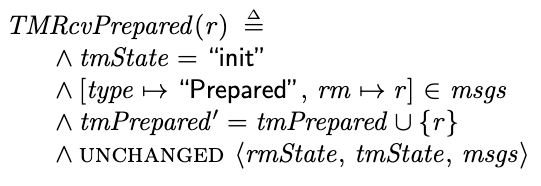

- TLA+ 中可以用上述方式定义类似于其它编程语言中"函数"概念的表达式，这样就无需对每一个 Resource Manager 都定义一个表达式了。
- `[type → "prepare", rm → r]` 是一个 TLA+ 中的 record，类似于其它编程语言中的 struct。
- `UNCHANGED ⟨rmState, tmState, msgs⟩` 表示这个动作不会改变 `rmState`、`tmState`、`msgs` 这三个变量的值。在 TLA+ 中，每一个变量的值是否改变都需要显式地声明。

当 `TM` 的状态为 `init`，且在消息池中存在来自 `r` 的 `Prepared` 消息，`tmPrepared` 在下一个状态的值会是 `tmPrepared` 和 `{r}` 的并集。

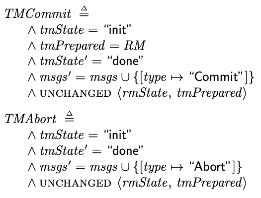

上面的两个动作分别是 Transaction Manager 进行 Commit 与 Abort。

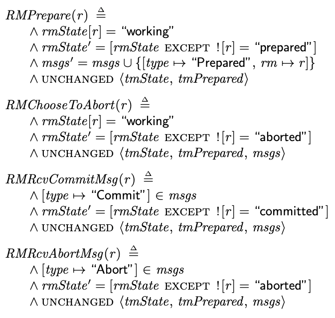

上述 4 个 Resource Manager 动作分别是 Resource Manager 选择 Prepare 与 Abort，以及处理由 Transaction Manager 决定的 Commit 与 Abort。

其中，存在语法如 `rmState' = [rmState except ![r] = "prepared"]`，意为"在下一个状态中，`rmState[r]` 的值变为 `prepared`，其它部分不变"。

如果我们用形如 `rmState[r]' = "prepared"` 的形式来表示，我们并没有显式地说明 `rmState` 的其它部分在下一个状态的值，因此是不正确的。

TLA+ 与我们通常编写的程序不同，是数学。在编程中，我们会使用到数组，而在 TLA+ 中，我们使用函数来表达类似的概念，数组的下标组成的集合就是函数的定义域。

编写完系统可能存在的所有动作后，我们就可以开始归纳系统的状态转换了：

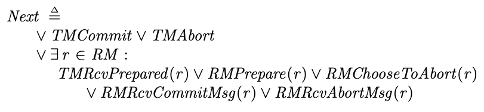

其中，我们使用存在量词 `∃r ∈ RM` 来表示"对于集合 `RM` 的任意元素 `r`，都存在这种行为"。TLA+ 的状态转换是原子的，因此在一个状态中这个"或"分支内只会有一个 `r` 被选择，这可以类比为编程语言中的 `for r in RM`，但在本质上不同。

至此，对系统的建模就完成了。下面我们需要编写系统的约束条件：

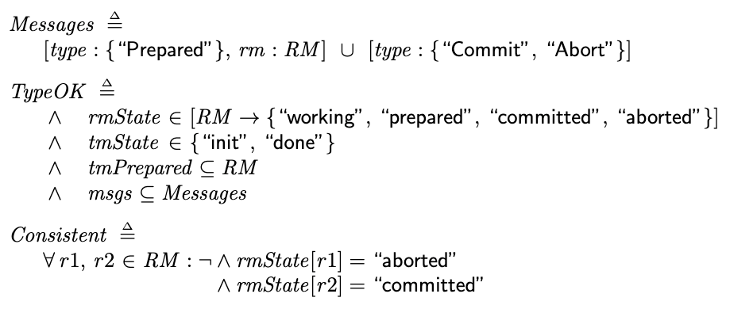

在约束条件 TypeOK 中，我们将每个变量的可能值都进行了限制。其中的 `[RM → {"working", "prepared", "committed", "aborted"}]` 是类似于将集合 `RM` 与集合 `{"working", "prepared", "committed", "aborted"}` 做笛卡尔积的操作，但得到的是一个由 record 组成的集合：

```bash
{
    [r1 |-> "working", r2 |-> "working"],
    [r1 |-> "working", r2 |-> "prepared"],
    [r1 |-> "working", r2 |-> "committed"],
    ...
    [r1 |-> "aborted", r2 |-> "committed"],
    [r1 |-> "aborted", r2 |-> "aborted"]
}
```

在 `TypeOK` 中我们用到了上面定义的集合 `Messages`。定义 `Messages` 时，我们使用了语法：`[type: {"Prepared"}, rm: RM]`。这种语法也是对 `{"Prepared"}` 与 `RM` 做类似笛卡尔积的操作，但得到的也是一个 record 集合：

```bash
{
    [type |-> "Prepared", rm |-> r1],
    [type |-> "Prepared", rm |-> r2],
    ...
}
```

最后的约束条件 `Consistent` 用于保证系统的一致性：在任意时刻，系统中不可能存在两个 Resource Managers 分别处于 `committed` 和 `abort` 状态。

最终，我们将约束条件作为不变量，与系统模型一起交给 TLC Model Checker 进行验证，就可以证明系统的正确性。

## 总结

通过上面的两个例子，我们初步了解形式化方法的思想。TLA+ 是为了验证分布式系统而设计的，但其思想可以应用到的领域远不止分布式系统。在编写程序时，如果我们能够不仅仅考虑代码层面的内容，而是从更高的层面，从数学角度去思考，就能够写出更加健壮的程序。

如果你对 TLA+ 感兴趣，可以参考 **Leslie Lamport's The TLA+ Video Course - YouTube** 与 **Learn TLA+**。

## 我们的项目：Xline

TLA+被广泛用于分布式系统算法的研究和开发中。在我们的项目 Xline 中，TLA+被用来在设计阶段验证共识算法的正确性。

Xline 是一个用于元数据管理的分布式 KV 存储。我们在 Xline 中使用 CURP 协议（https://www.usenix.org/system/files/nsdi19-park.pdf)的修改版作为共识协议，TLA+将被用于其正确性验证中。

如果你想了解更多关于 Xline 的信息，请参考我们的 Github：https://github.com/datenlord/Xline
