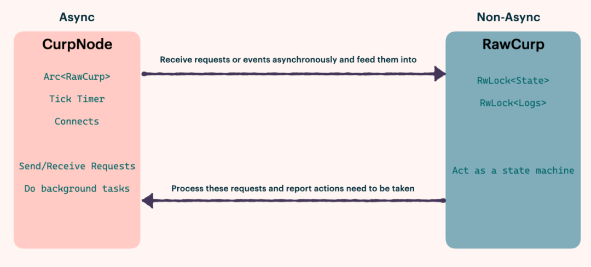

## 概 要

很多使用过 Async Rust 的人都可能有过被其要求的约束所困扰的经历，例如，`spawned task` 有`'static` 的要求，`MutexGuard` 不能跨越`.await`，等等。克服这些约束需要仔细地设计代码结构，很可能会导致晦涩和嵌套的代码，这对开发人员和审查人员都是一种挑战。在这篇文章中，我将首先列出我在编写 async Rust 代码时的一些痛点。然后，我将指出我们真正需要异步代码的场景，并讨论为什么我们应该把异步和非异步代码分开。最后，我将展示我是如何在最近的一次 Curp 重构中实践这一原则的。

## 痛 点

### Spawned Task 必须是'static

在 spawn 一个新的 async task 的时候，编译器并不知道该 task 会被执行多久，可能很短暂，也可能会一直执行至程序运行结束。所以，编译器会要求该 task 所含的所有类型都拥有`'static` 的生命周期。

这样的限制使得我们常常能在 spawn 前看到不少的 clone 代码。当然，这些代码从某种角度来讲可以帮助程序员更好地理清哪些变量的所有权是要被移交给新的 task 的，但同时，也会使得代码看上去很啰嗦，不够简洁。

```rust
let a_arc = Arc::clone(&a);
let b_arc = Arc::clone(&b);
tokio::spawn(async move {
    // ...
});
```

### 非 Send 的变量的持有不可以跨越.await 点

这点限制背后的原因 tokio 的 task 并不是固定在一个线程上执行的，空闲线程会主动“偷取”忙碌线程的 task，这就需要 task 可以被 `Send`。

请看下面一段代码：

```rust
let mut log_l = log.lock();
log_l.append(new_entry.clone());
broadcast(new_entry).await;
```

尝试编译后，会发现报错：`log_l` 不能跨越`.await` 点持有。

自然，为了使得拿着锁的 critical section 尽量地短，我们不需要拿着锁过`.await` 点，所以我们在其中加一行放锁的代码：

```rust
let mut log_l = log.lock();
log_l.append(new_entry.clone());
drop(log_l);
broadcast(new_entry).await;
```

很可惜，还是不能通过编译，这是因为编译器目前只能通过计算代码 Scope 的方式来判断一个 task 是否可以被 `Send`。如果说上一个痛点还有一定的好处，那么这个问题就纯粹来源于编译器的限制了。所以我们必须把代码改成这个样子：

```rust
{
    let mut log_w = log.write();
    log_w.append(new_entry.clone());
}
broadcast(new_entry).await;
```

如果一个函数中有需要拿多把锁，又有很多的异步调用，代码就会嵌套起来，变得复杂晦涩。Side Note: 我们知道 tokio 自己有个异步的锁 `tokio::sync::Mutex`，它是可以被 hold 过`.await` 的。但要注意的是，大多数情况下，我们并不会需要异步锁，因为异步锁通常意味着拿着锁的 critical section 是会非常长的。所以，如果我们需要在异步代码中拿锁，不要不加思索地使用异步锁，事实上，在 tokio 官方文档中，也是更加建议使用同步锁的。

## 使用异步 Rust 的场景和组织方式

如果我们经常在项目开发中遇到上述问题，自然就会开始思考其产生的原因以及该怎样避免。我认为一个很重要的因素就是没有把 async 和非 async 的代码给分开，或者说，更本质的原因是我们没有在设计项目架构的时候将需要 async 的部分和不需要 async 的部分分开。所以接下来，我将梳理我们什么时候才能真正地用到 Async Rust？

### I/O

当我们进行比较耗时的 I/O 操作，我们不想让这些操作 block 住我们当前的线程。所以我们用异步 I/O，当运行到 await 的时候，I/O 就可以到后台去做，让其它的 task 执行。

```rust
// .await will enable other scheduled tasks to progress
let mut file = File::create(“foo.txt”).await?;

file.write(b"some bytes").await?;
```

### 后台任务

后台任务的 task 通常会伴随着一个 channel 的接收端出现。

```rust
tokio::spawn(async move {
    while let Some(job) = rx.recv().await {
        // ...
    }
};
```

### 并发任务

并发地 spawn 多个 task 可以更高效地利用多核处理器。

```rust
let chunks = data.chunks(data.len() / N_TASKS);
for chunk in chunks {
  tokio::spawn(work_on(chunk));
}
```

### 依赖等待

使用`.await` 等待依赖。这种使用相对较少一些。

```rust
// wait for some event
event.listen().await;

// barrier
barrier.wait().await;
```

可以看到，使用 Async 代码的地方，主要集中在 I/O、并发与后台任务。在开发之前，我们也不妨有意识地去分离项目中的 async 与 sync 部分：缩小 Async 部分的函数，将处理逻辑移动至普通函数中。将这两部分分离，不仅可以缓解文章开头所说的痛点，更可以帮我理清代码结构。

```rust
{
    let mut log_w = log.write();
    log_w.append(new_entry.clone());
    // ...
}
broadcast(new_entry).await;

// move the logic to another function instead

fn update_log(log: &mut Log, new_entry: Entry) {
    log.append(new_entry);
    // ...
}

update_log(&mut log.write(), new_entry.clone());
broadcast(new_entry).await;
```

## 关于 Curp 的一次大型重构

在重构之前，由于一次次的迭代，代码的可读性和结构变得越来越差。具体来说，由于我们有若干个带锁结构需要在 curp server 的各个部分中共享，而 curp server 的大部分函数又是 async 的，async 和拿锁的代码混杂在一起，就导致了我们常常在开发过程中遇到上述痛点。

所以，我们重新调整了 curp server 的结构，将其分为了 async 部分的 `CurpNode` 和非 async 部分的 `RawCurp`：`CurpNode` 包括了异步 IO（接收，发送网络请求，数据持久化），后台任务（定时检查 leader 活性，leader 在每个节点上复制数据、校准各 follower）；`RawCurp` 可被视为一个状态机，它接收来自 `CurpNode` 的调用，并更新状态。如果 `RawCurp` 想要做一些异步操作（比如广播心跳），它就可以通过返回值让 `CurpNode` 去替它发请求。



举一个 tick task 的例子，在未 refactor 之前，由于我们不能 `LockGuard` 不能过`.await` 点，以及有多逻辑分支的限制，不得不将代码组织成这样的一个形式:

```rust
loop {
    let _now = ticker.tick().await;
    let task = {
        let state_c = Arc::clone(&state);
        let state_r = state.upgradable_read();
        if state_r.is_leader() {
            if state_r.needs_hb
            {
                let resps = bcast_heartbeats(connects.clone(), state_r, rpc_timeout);
                Either::Left(handle_heartbeat_responses(
                    resps,
                    state_c,
                    Arc::clone(&timeout),
                ))
            } else {
                continue;
            }
        } else {
            let mut state_w = RwLockUgradableReadGuard::upgrade(state_r);
            // ...
            let resps = bcast_votes(connects.clone(), state_r, rpc_timeout);
            Either::Right(handle_vote_responses(resps, state_c))
        }
    };
    task.await;
}
```

在 refactor 之后，处理逻辑都被放在了 `RawCurp` 中，`CurpNode` 中的代码就清晰多了：

```rust
loop {
    let _now = ticker.tick().await;
    let action = curp.tick();
    match action {
        TickAction::Heartbeat(hbs) => {
            Self::bcast_heartbeats(Arc::clone(&curp), &connects, hbs).await;
        }
        TickAction::Votes(votes) => {
            Self::bcast_votes(Arc::clone(&curp), &connects, votes).await;
        }
        TickAction::Nothing => {}
    }
}
```

## 我们的项目：Xline

**Xline 是一个用于元数据管理的分布式 KV 存储。**以上为对 Xline 中使用的 Curp 共识协议的重构总结。

如果你想了解更多关于Xline的信息，请参考我们的Github：  
https://github.com/datenlord/Xline