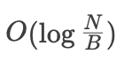
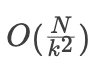

## 引言

在 Xline 早期的原型阶段，我们采用了基于内存的存储来实现数据的持久化。这虽然简化了 Xline 原型设计的复杂度，提高了项目的开发和迭代速度，但带来的影响也是显著的：由于数据都存储在内存当中，因此一旦当进程 crash 后，节点的数据恢复需要依赖于从其他正常节点上拉取全量数据，这就需要较长的恢复时间。

基于此方面的考虑，**Xline 在最新发布的版本 v0.3.0 中引入了一个 Persistent Storage Layer**，来将数据持久化到磁盘当中，同时向上层调用方屏蔽掉无关的底层细节。

##　存储引擎选型

目前业界主流的存储引擎基本可分为基于 B+ Tree 的存储引擎和基于 LSM Tree 的存储引擎。他们有着各自的优势与劣势。

### B+ Tree 读写放大分析

B+ Tree 在读取数据时，需要先沿着根节点，逐步向下层索引，直到最后访问到最底层的叶子结点，每层访问对应了一次磁盘 IO。而写入数据时，同样也沿着根节点向下搜索，找到对应的叶子结点后写入数据。

为了方便分析，我们进行相关约定，B+ Tree 的 block size 为 B，故每个内部节点包含 O(B)个子节点，叶子节点包含 O(B)条数据，假设数据集大小为 N，  
则 B+ Tree 的高度为  


写放大：B+ Tree 的每次 insert 都会在叶子节点写入数据，不论数据实际大小是多少，每次都需要写入大小为 B 的数据块，因此写放大是 O(B)

读放大：B+ Tree 的一次查询需要从根节点一路查到具体的某个叶子节点，所以需要等于层数大小的 I/O，  
也就是  


, 即读放大为  


### LSM Tree 读写放大分析

LSM Tree 在数据写入时，先以文件追加的形式写入一个内存文件 memtable（Level 0），当 memtable 达到固定大小时，将其转换成 immutable memtable，并合并到下一个 level 中。而对于数据的读取，则需要先在 memtable 中进行查找，当查找失败时，则向下逐层查找，直到找到该元素为止。LSM Tree 常采用 Bloom Filter 来优化读取操作，过滤掉那些不存在于数据库中的元素。

假设数据集大小为 N，放大因子为 k，最小层一个文件大小为 B，每层文件的单个文件大小相同都为 B，不过每层文件个数不同。

写放大：假设写入一个 record，在本层写满 k 次后会被 compact 到下一层。因此平均单层写放  
大应为  


。  
一共有  


层，故写放大为  


读放大：最坏的情况下，数据被 compact 到最后一层，需要依次在每一层进行二分查找，直到在最后一层找到.

对于最高层  
  
，数据大小为 O(N), 需要进行二分查找，需要  
  
次磁盘读操作

对于次高层  
  
, 数据大小为  
  
, 需要进行  
  
 次磁盘读操作

对于  
  
, 数据大小为  
  
，需要进行  
  
 次磁盘读操作

……

以此类推，最终读放大为 R =  
  
。

### 总结


从读写放大的复杂度分析来看，基于 B+ Tree 的存储引擎更加适合读多写少的场景，而基于 LSM Tree 的存储引擎则更加适合写多读少的场景。

Xline 作为一款由 Rust 编写的开源分布式 KV 存储软件，在选择持久化存储引擎方面，需要有如下的考虑：

1. **从性能方面**：对于存储引擎而言，往往容易成为系统的性能瓶颈之一，因此必须选择高性能的存储引擎。而高性能的存储引擎必然要由高性能的语言来编写，同时要优先考虑异步实现。优先考虑 Rust 语言，其次是 C/C++ 语言。
2. **从开发的角度**：优先考虑 Rust 语言实现，这样能够在当前阶段减少一些额外的开发工作。
3. **从维护的角度**：

- 考虑引擎的背后支持者：优先考虑大型商业公司，开源社区
- 业界需要有广泛使用，以便于在后期 debug、tuning 过程中能够有更多借鉴经验
- 知名度和受欢迎程度(github star)应当较高，以便于吸引优秀的贡献者参与

4. **从功能角度**：需要存储引擎提供事务语义，支持基本的 KV 相关操作，支持批处理操作等。

需求的优先级排列为：功能 > 维护 >= 性能 > 开发

我们主要调研了 Sled、ForestDB、RocksDB，bbolt 和 badger 等多个开源嵌入式数据库。其中，能够同时满足我们前面提到的四点要求的只有 RocksDB。RocksDB 由 Facebook 实现并开源，目前在业界有着良好的应用生产实践，同时版本依然保持着稳定的发布速度，在功能上也可以完美地覆盖我们的需求。

Xline 主要服务于跨云数据中心的一致性元数据管理，其工作场景主要是读多写少的场景。有些读者可能会有疑问，RocksDB 不是基于 LSM Tree 的存储引擎吗？而基于 LSM Tree 的存储引擎应当更加适合写多读少的应用场景，那为什么还要选择使用 RocksDB 呢？

的确，从理论上讲，最合适的存储引擎应当是基于 B+ Tree 的存储引擎。但考虑到像 Sled、ForestDB 等基于 B+ Tree 的嵌入式数据库缺少大型应用生产的实践，同时版本维护也处于停滞状态。经过了取舍后，我们选择了 RocksDB 作为 Xline 的存储后端。同时为了考虑到未来可能会有更加合适的存储引擎可供替换，我们在 Persistent Storage Layer 的设计上做了良好的接口分离与封装，可以最大程度地降低后期更换存储引擎的成本。

## 持久化存储层设计与实现

在开始讨论持久化存储层的设计与实现之前，我们需要先明确我们对持久化存储的需求预期：

1. 正如前面所说，在做出相应的 trade-off 后，我们采用了 RocksDB 作为 Xline 的后端存储引擎。因此，我们不能排除未来会替换这一存储引擎的可能，StorageEnginne 的设计必须符合 OCP 原则，满足可配置，易替换的原则。
2. 我们需要为上层使用者，提供基础的 KV 接口
3. 要实现一套完备的 Recover 机制。

### 整体架构与写入流程

我们先来看看 Xline 当前的整体架构，如下图所示：


从上到下，Xline 的整体架构可以被划分为 访问层，共识模块，业务逻辑模块，存储 API 层和存储引擎层。其中存储 API 层主要负责分别向业务模块和共识模块提供业务相关的 StorageApi，同时屏蔽底层的 Engine 的实现细节。而存储引擎层则负责实际数据的落盘操作。

我们以一次 PUT 请求为例，来看看数据的写入过程。当 client 向 Xline Server 发起一次 Put 请求时，会发生如下事情：

1. KvServer 接收到用户发送来的 PutRequest 后，会先对请求进行合法性检查，检查通过后，通过自身 CurpClient 向 Curp Server 发起一次 propose 的 rpc 请求
2. Curp Server 接收到 Propose 请求后，会先进入到 fast path 流程中。它会将请求中的 cmd 保存到 Speculative Executed Pool (aka. spec_pool)中，来判断是否与当前 spec_pool 中的命令是否冲突，冲突则返回 ProposeError::KeyConflict，并等待 slow path 完成，否则继续走当前的 fast_path
3. 在 fast_path 中，一个命令如果既不冲突，又不重复，则会通过特定的 channel 通知后台的 cmd_worker 去执行。cmd_worker 一旦开始执行，会将对应的命令保存到 CommandBoard 中，以便 track 命令的执行情况。
4. 当集群中的多个节点达成了共识后，则会提交状态机日志，并将这条日志持久化到 CurpStore 中，最后 apply 这条日志。在 apply 的过程中，会调用对应的 CommandExecutor，也就是业务模块中，各个 server 对应的 store 模块，将实际的数据通过 DB 持久化到后端数据库中。

### 接口设计

下图是 StorageApi 和 StorageEngine 两个 trait 以及相应的数据结构之间的相互关系


#### Storage Engine Layer

Storage Engine Layer 主要定义了 StorageEngine trait 以及相关的错误。
StorageEngine Trait 定义（engine/src/engine_api.rs）：

```rust
/// Write operation
#[non_exhaustive]
#[derive(Debug)]
pub enum WriteOperation<'a> {
    /// Put operation
    Put {  table: &'a str, key: Vec<u8>, value: Vec<u8> }
    /// Delete operation
    Delete { table: &'a str, key: &'a [u8] },
    /// Delete range operation, it will remove the database entries in the range [from, to)
    DeleteRange { table: &'a str, from: &'a [u8], to: &'a [u8] },
}

/// The StorageEngine trait
pub trait StorageEngine: Send + Sync + 'static + std::fmt::Debug {
    /// Get the value associated with a key value and the given table
    ///
    /// # Errors
    /// Return EngineError::TableNotFound if the given table does not exist
    /// Return EngineError if met some errors
    fn get(&self, table: &str, key: impl AsRef<[u8]>) -> Result<Option<Vec<u8>>, EngineError>;

    /// Get the values associated with the given keys
    ///
    /// # Errors
    /// Return EngineError::TableNotFound if the given table does not exist
    /// Return EngineError if met some errors
    fn get_multi(
        &self,
        table: &str,
        keys: &[impl AsRef<[u8]>],
    ) -> Result<Vec<Option<Vec<u8>>>, EngineError>;

    /// Get all the values of the given table
    /// # Errors
    /// Return EngineError::TableNotFound if the given table does not exist
    /// Return EngineError if met some errors
    #[allow(clippy::type_complexity)] // it's clear that (Vec<u8>, Vec<u8>) is a key-value pair
    fn get_all(&self, table: &str) -> Result<Vec<(Vec<u8>, Vec<u8>)>, EngineError>;

    /// Commit a batch of write operations
    /// If sync is true, the write will be flushed from the operating system
    /// buffer cache before the write is considered complete. If this
    /// flag is true, writes will be slower.
    ///
    /// # Errors
    /// Return EngineError::TableNotFound if the given table does not exist
    /// Return EngineError if met some errors
    fn write_batch(&self, wr_ops: Vec<WriteOperation<'_>>, sync: bool) -> Result<(), EngineError>;
}
```

相关的错误定义

```rust
#[non_exhaustive]
#[derive(Error, Debug)]
pub enum EngineError {
    /// Met I/O Error during persisting data
    #[error("I/O Error: {0}")]
    IoError(#[from] std::io::Error),
    /// Table Not Found
    #[error("Table {0} Not Found")]
    TableNotFound(String),
    /// DB File Corrupted
    #[error("DB File {0} Corrupted")]
    Corruption(String),
    /// Invalid Argument Error
    #[error("Invalid Argument: {0}")]
    InvalidArgument(String),
    /// The Underlying Database Error
    #[error("The Underlying Database Error: {0}")]
    UnderlyingError(String),
}
```

MemoryEngine(engine/src/memory_engine.rs) 和 RocksEngine(engine/src/rocksdb_engine.rs) 则实现了 StorageEngine trait。其中 MemoryEngine 主要用于测试，而 RocksEngine 的定义如下：

```rust
/// RocksDB Storage Engine
#[derive(Debug, Clone)]
pub struct RocksEngine {
    /// The inner storage engine of RocksDB
    inner: Arc<rocksdb::DB>,
}

/// Translate a RocksError into an EngineError
impl From<RocksError> for EngineError {
    #[inline]
    fn from(err: RocksError) -> Self {
        let err = err.into_string();
        if let Some((err_kind, err_msg)) = err.split_once(':') {
            match err_kind {
                "Corruption" => EngineError::Corruption(err_msg.to_owned()),
                "Invalid argument" => {
                    if let Some(table_name) = err_msg.strip_prefix(" Column family not found: ") {
                        EngineError::TableNotFound(table_name.to_owned())
                    } else {
                        EngineError::InvalidArgument(err_msg.to_owned())
                    }
                }
                "IO error" => EngineError::IoError(IoError::new(Other, err_msg)),
                _ => EngineError::UnderlyingError(err_msg.to_owned()),
            }
        } else {
            EngineError::UnderlyingError(err)
        }
    }
}

impl StorageEngine for RocksEngine {
    /// omit some code
}
```

#### StorageApi Layer

##### 业务模块

业务模块的 StorageApi 定义

```rust
/// The Stable Storage Api
pub trait StorageApi: Send + Sync + 'static + std::fmt::Debug {
    /// Get values by keys from storage
    fn get_values<K>(&self, table: &'static str, keys: &[K]) -> Result<Vec<Option<Vec<u8>>>, ExecuteError>
    where
        K: AsRef<[u8]> + std::fmt::Debug;

    /// Get values by keys from storage
    fn get_value<K>(&self, table: &'static str, key: K) -> Result<Option<Vec<u8>>, ExecuteError>
    where
        K: AsRef<[u8]> + std::fmt::Debug;

    /// Get all values of the given table from the storage
    fn get_all(&self, table: &'static str) -> Result<Vec<(Vec<u8>, Vec<u8>)>, ExecuteError>;

    /// Reset the storage
    fn reset(&self) -> Result<(), ExecuteError>;

    /// Flush the operations to storage
    fn flush_ops(&self, ops: Vec<WriteOp>) -> Result<(), ExecuteError>;
}
```

在业务模块，DB(xline/src/storage/db.rs) 负责将 StorageEngine 转换成为 StorageApi 供上层调用，它的定义如下：

```rust
/// Database to store revision to kv mapping
#[derive(Debug)]
pub struct DB<S: StorageEngine> {
    /// internal storage of DB
    engine: Arc<S>,
}

impl<S> StorageApi for DB<S>
where
    S: StorageEngine
{
    /// omit some code
}
```

在业务模块中的不同 Server 拥有自己的 Store 后端，其核心数据结构正是 StorageApi Layer 中的 DB。

##### 共识模块

Curp 模块的 StorageApi 定义(curp/src/server/storage/mod.rs)

```rust
/// Curp storage api
#[async_trait]
pub(super) trait StorageApi: Send + Sync {
    /// Command
    type Command: Command;

    /// Put voted_for in storage, must be flushed on disk before returning
    async fn flush_voted_for(&self, term: u64, voted_for: ServerId) -> Result<(), StorageError>;

    /// Put log entries in the storage
    async fn put_log_entry(&self, entry: LogEntry<Self::Command>) -> Result<(), StorageError>;

    /// Recover from persisted storage
    /// Return voted_for and all log entries
    async fn recover(
        &self,
    ) -> Result<(Option<(u64, ServerId)>, Vec<LogEntry<Self::Command>>), StorageError>;
}
```

而 RocksDBStorage(curp/src/server/storage/rocksdb.rs) 就是前面架构图中提到的 CurpStore，负责将 StorageApi 转换成底层的 RocksEngine 操作。

```rust
/// RocksDB storage implementation
pub(in crate::server) struct RocksDBStorage<C> {
    /// DB handle
    db: RocksEngine,
    /// Phantom
    phantom: PhantomData<C>,
}

#[async_trait]
impl<C: 'static + Command> StorageApi for RocksDBStorage<C> {
    /// Command
    type Command = C;
    /// omit some code
}
```

### 实现相关

#### 数据视图

在引入了 Persistent Storage Layer，Xline 中通过逻辑表 table 来分割不同的命名空间，目前它对应了底层的 Rocksdb 中的 Column Family。

当前有如下几张表：

1. curp：存储 curp 相关的持久化信息，包括了 log entries，以及 voted_for 和对应的 term 信息
2. lease: 保存了已授予的 lease 信息
3. kv: 保存 kv 信息
4. auth: 保存了当前 Xline 的 auth enable 情况以及相应的 enable revision
5. user: 保存了 Xline 中添加的 user 信
6. role: 保存了 Xline 中添加的 role 信息
7. meta: 保存了当前被 applied 的 log index

##### 可扩展性

Xline 之所以将存储相关操作，拆分成了 StorageEngine 和 StorageApi 两个不同的 trait 并分散到两个不同的层级上，是为了隔离变化。StorageEngine trait 提供机制，StorageApi 则由上层的模块来定义，不同的模块可以有自己的定义，实现特定的存储策略。而 StorageApi 层的 CurpStore 和 DB 则负责实现这两个 trait 之间的转换。由于上层调用者不直接依赖于底层的 Storage Engine 相关内容，因此后面即便更换存储引擎也不会导致上层模块的代码需要做出大量的修改。

##### Recover 过程

对于 Recover 过程而言，重要不过两件事情，第一是 recover 哪些数据，第二是什么时候做 recover？我们先来看不同模块之间 recover 所涉及到的数据。

#### 共识模块

在共识模块中，由于 RocksDBStorage 是专属于 Curp Server 使用的，因此可以直接将 recover 加入到相应的 StorageApi trait 中。具体实现如下：

```rust
#[async_trait]
impl<C: 'static + Command> StorageApi for RocksDBStorage<C> {
    /// Command
    type Command = C;
    /// omit some code
    async fn recover(
        &self,
    ) -> Result<(Option<(u64, ServerId)>, Vec<LogEntry<Self::Command>>), StorageError> {
        let voted_for = self
            .db
            .get(CF, VOTE_FOR)?
            .map(|bytes| bincode::deserialize::<(u64, ServerId)>(&bytes))
            .transpose()?;

        let mut entries = vec![];
        let mut prev_index = 0;
        for (k, v) in self.db.get_all(CF)? {
            // we can identify whether a kv is a state or entry by the key length
            if k.len() == VOTE_FOR.len() {
                continue;
            }
            let entry: LogEntry<C> = bincode::deserialize(&v)?;
            #[allow(clippy::integer_arithmetic)] // won't overflow
            if entry.index != prev_index + 1 {
                // break when logs are no longer consistent
                break;
            }
            prev_index = entry.index;
            entries.push(entry);
        }

        Ok((voted_for, entries))
    }
}
```

对于共识模块而言，在 recover 过程中，会先从底层的 db 中加载 voted_for 以及相应的 term，这是处于共识算法的安全性保证，为了避免在同一个 term 内投出两次票。随后加载对应的 log entries。

#### 业务模块

对于业务模块而言，不同的 Server 会拥有不同的 Store，它们共同依赖于底层 DB 所提供的机制。因此，对应的 recover 并不定义在 StorageApi 这个 trait，而是以独立的方法存在于 LeaseStore(xline/src/storage/lease_store/mod.rs)、AuthStore(xline/src/storage/auth_store/store.rs) 和 KvStore(xline/src/storage/kv_store.rs) 当中。

```rust
/// Lease store
#[derive(Debug)]
pub(crate) struct LeaseStore<DB>
where
    DB: StorageApi,
{
    /// Lease store Backend
    inner: Arc<LeaseStoreBackend<DB>>,
}

impl<DB> LeaseStoreBackend<DB>
where
    DB: StorageApi,
{
    /// omit some code
    /// Recover data form persistent storage
    fn recover_from_current_db(&self) -> Result<(), ExecuteError> {
        let leases = self.get_all()?;
        for lease in leases {
            let _ignore = self
                .lease_collection
                .write()
                .grant(lease.id, lease.ttl, false);
        }
        Ok(())
    }
}

impl<S> AuthStore<S>
where
    S: StorageApi,
{
    /// Recover data from persistent storage
    pub(crate) fn recover(&self) -> Result<(), ExecuteError> {
        let enabled = self.backend.get_enable()?;
        if enabled {
            self.enabled.store(true, AtomicOrdering::Relaxed);
        }
        let revision = self.backend.get_revision()?;
        self.revision.set(revision);
        self.create_permission_cache()?;
        Ok(())
    }
}
```

其中，LeaseStore 和 AuthStore 的 recover 逻辑较为简单，这里不过多展开讨论，我们重点讨论 KvStore 的 recover 过程，其流程图如下


##### Recover 的时机

Xline 的 recover 时机主要位于系统的启动初期，会优先执行业务模块的 recover，随后是共识模块的 recover。其中由于 KvStore 的 recover 依赖于 LeaseStore 的 recover，因此 LeaseStore 的 recover 需要位于 KvStore 的 recover 之前，对应代码(xline/src/server/xline_server.rs)如下：

```rust
impl<S> XlineServer<S>
where
    S: StorageApi,
{
    /// Start XlineServer
    #[inline]
    pub async fn start(&self, addr: SocketAddr) -> Result<()> {
        // lease storage must recover before kv storage
        self.lease_storage.recover()?;
        self.kv_storage.recover().await?;
        self.auth_storage.recover()?;
        let (kv_server, lock_server, lease_server, auth_server, watch_server, curp_server) =
            self.init_servers().await;
        Ok(Server::builder()
            .add_service(RpcLockServer::new(lock_server))
            .add_service(RpcKvServer::new(kv_server))
            .add_service(RpcLeaseServer::from_arc(lease_server))
            .add_service(RpcAuthServer::new(auth_server))
            .add_service(RpcWatchServer::new(watch_server))
            .add_service(ProtocolServer::new(curp_server))
            .serve(addr)
            .await?)
    }
```

共识模块的 recover 过程(curp/src/server/curp_node.rs)如下，其函数调用链为：XlineServer::start -> XlineServer::init_servers -> CurpServer::new -> CurpNode::new

```rust
// utils
impl<C: 'static + Command> CurpNode<C> {
    /// Create a new server instance
    #[inline]
    pub(super) async fn new<CE: CommandExecutor<C> + 'static>(
        id: ServerId,
        is_leader: bool,
        others: HashMap<ServerId, String>,
        cmd_executor: CE,
        curp_cfg: Arc<CurpConfig>,
        tx_filter: Option<Box<dyn TxFilter>>,
    ) -> Result<Self, CurpError> {
        // omit some code
        // create curp state machine
        let (voted_for, entries) = storage.recover().await?;
        let curp = if voted_for.is_none() && entries.is_empty() {
            Arc::new(RawCurp::new(
                id,
                others.keys().cloned().collect(),
                is_leader,
                Arc::clone(&cmd_board),
                Arc::clone(&spec_pool),
                uncommitted_pool,
                curp_cfg,
                Box::new(exe_tx),
                sync_tx,
                calibrate_tx,
                log_tx,
            ))
        } else {
            info!(
                "{} recovered voted_for({voted_for:?}), entries from {:?} to {:?}",
                id,
                entries.first(),
                entries.last()
            );
            Arc::new(RawCurp::recover_from(
                id,
                others.keys().cloned().collect(),
                is_leader,
                Arc::clone(&cmd_board),
                Arc::clone(&spec_pool),
                uncommitted_pool,
                curp_cfg,
                Box::new(exe_tx),
                sync_tx,
                calibrate_tx,
                log_tx,
                voted_for,
                entries,
                last_applied.numeric_cast(),
            ))
        };
        // omit some code
        Ok(Self {
            curp,
            spec_pool,
            cmd_board,
            shutdown_trigger,
            storage,
        })
    }
```

## 性能评估

在 v0.3.0 的新版本中，我们除了引入了 Persistent Storage Layer 以外，还对 CURP 的部分内容做了一些大型的重构。在重构完毕，添加新功能后，前不久通过了 validation test 和 Integration test。性能部分的测试信息，已经在 Xlinev0.4.0  中释放出来。

性能报告请参考链接：

https://github.com/datenlord/Xline/blob/master/img/xline-key-perf.png
