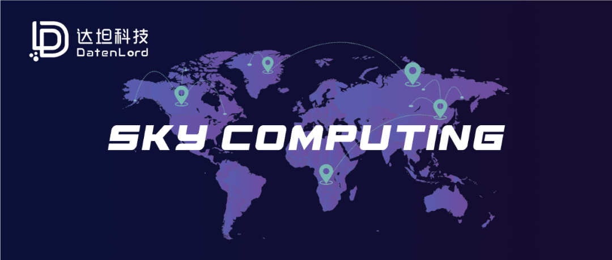

2021 年，UC Berkeley 的 Ion Stoica 和 Scott Shenker，在运行系统热点话题的研讨会上，发布了“从云计算到天空计算”的论文。不同于我们都熟知的 **Cloud Computing(“云计算”)，Sky Computing (“天空计算”)**，是云计算的未来，是指天空中有很多的云，如何解决跨云的问题，打破不同云之间的隔阂，最大化地利用跨云数据。

达坦科技的使命正如同论文中描述的“天空计算”的愿景：**打造下一代云计算平台，让云之间没有隔阂**。为此，我们翻译了这篇论文，分两期发布。如下是“从云计算到天空计算”的第二部分，欲了解上半部分的内容，请点击从[云计算到天空计算（一）](https://mp.weixin.qq.com/s/nCmkp6_3VfrhYp1yi6pbUA)

## 跨云层

兼容层是实现天空计算你的第一步，虽然兼容层让用户可以在不同的云平台上运行应用程序而不需要修改，但是用户仍然需要自己选择云平台。这就好比让英特网用户自己选择路由路径，这个任务过于繁琐，所以实用性不好。要解决这个问题，英特网使用 BGP 来做 AS-level 的路由选择，终端用户完全感知不到路由过程。天空计算也应该提供一个跨云层，该层将云平台供应商完全隐藏，用户应该完全不知道应用程序运行在哪个云平台上。跨云层应该是现在兼容层之上。

跨云层应该让用户能够定制策略，这些策略会决定应用程序的运行地点——哪一个云平台，并且这些策略不应该太底层，否则用户的决策负担过重。相反，这些策略应该体现用户的偏好，例如在性能，稳定性和费用间进行取舍。不仅如此，这些策略也应该考虑到有些用户不希望应用程序运行在竞争对手的云平台上，或者处于法律条款限制必须运行在某些特定的国家境内。举一个具体的例子，一个用户可以确定自己的 TensorFlow 应用必须运行在德国境内，并且要在未来两个小时内运行结束，同时保证费用不高于某个设定阈值。

跨云层也有可能让应用程序的可靠性和安全性变得更好，毕竟多个云平台同时出现故障的概率非常低。并且最近有一些提议将不同的云平台当做不同的信任域，这样就可以为更多的应用程序提供高效的安全解决方案。

我们相信要实现跨云层并不存在技术上的限制，这也不难理解，因为在云之间迁移任务和在数据中心内部迁移任务是类似的。一旦一个应用考虑了多云场景，剩下的问题就由下列的三个功能来完成：

1. 为 OSS 服务提供同意的**命名规范**。
2. 一个**检索注册服务**，每个云提供商在上面注册服务，每一个用户在上面依据偏好选择服务。
3. 一个跨云的**计费服务**。

我们现在分别讨论这三个功能。

**首先是命名规范。** 为了能够准确地找到某个服务的运行实例，我们需要一个全局唯一的名字来命名它。有很多中方法可以达到这个目的，例如可以使用 DNS 服务来给出命名，这里并不展开讨论。我们还需要将一些元数据和这些实例关联起来，元数据包含如何启动这些实例，供应商的名字，地点，API 版本和硬件类型等等。我们也有可能需要附加一些动态变化的信息，例如价格，负载和当前是否可以被使用等等。

**其次是检索注册服务。** 每个应用都需要找到适合自己的服务实例，这就需要这么一个检索注册服务。每个云提供商将在该服务上发布自己服务的名字和元数据，并且云提供商也应该定期地更新动态数据，例如负载和价格等。同样的，应用也应该根据自己的偏好发出请求。当然细节的调度算法不在本文的讨论范围内。

**最后是付费系统。** 在天空计算的场景下，用户的应用程序能够在一个云平台或者多个云平台上运行，但是付费需要分别计算。如果付费操作是每个平台独立完成，那么用户需要在这些平台上都创建账户，显然不太方便。另外一个解决方案是，将计费服务交给第三方服务商，该服务商有所有云平台的账号，这样用户只需要付费一次，剩下的工作由该服务提供商解决。

基于上述讨论，实现跨云层没有显著的技术壁垒，当然还有许多细节需要进一步确定。有了这个跨云层的设想，下一个问题是市场会不会自然孕育出一个产品。

## 云提供商之间的协作

跨云层被设计来帮助用户能够在多个云平台上按需运行任务，如果该任务涉及到大量的数据，那么数据搬运将会是不可避免的。如今，绝大多数的云提供商的数据迁入的费用远低于数据迁出的费用。比如将数据导入 AWS 平台是免费的，但是从 AWS 迁出数据的费用是每 GB 0.05 到 0.09 美元，等价的费用可以用来存储这些数据几个月。这些费用比那些头部 CDN 厂商要高许多，CDN 的报价一般是每 GB 0.009 到 0.02 美元。

我们将这种形式的定价策略称为 **“数据引力”定价策略**，这样的定价策略会促使用户更愿意在本数据中心处理数据而非迁出。当然对于那些计算特别贵的任务，将数据迁出是很划算的事情，毕竟在这种任务中数据的费用占比很小。例如，在 ImageNet 的训练任务中要处理一个 150GB 大小的数据集，将这么多数据迁出大概需要花费 13 美元，在 AWS 完成相关训练任务需要超过 40 美元，相同的任务如果在 Azure 上运行仅仅需要大约 20 美元。基于上述数据我们不难发现将数据迁出处理会更加便宜。由此不难发现，即使有数据引力的存在，有时迁移数据仍然是更加经济的选择。

不仅如此，对于一些静态数据，我们可以将其存储在一个云平台的归档服务中，该服务非常便宜，在有需求的时候再迁移到需要处理的 Blob 存储中。相比上述方法，长期存储在某个云平台的 Blob 存储中费用更加昂贵。

据我们所知，现在数据迁出的费用是一致的，即无论我们的数据目的地是哪里，费用都一样。对于云平台而言一个可能的选择是互相之间签署合作协议，互相之间进行数据传输不收取费用，并且搭建更加快速的传输链路。这样一来数据传输就是免费，并且非常快速，在签署协议的云平台间的数据引力作用也降低了。

## 对未来的推测

基于上述的讨论，做一个兼容层的技术难度并不大，但是这会使得云计算供应商的服务变成普通商品——可被替代，因此可以预见云计算提供商会消极对待兼容层。好消息是和其他领域不一样，兼容层的标准化并不需要全局的协商，即使云计算提供商不愿意，也会有越来越多的软件可以运行在多个平台上。那么兼容层即使无法得到官方支持，也会被越来越多的用户使用，以达到更容易迁移的目的。

虽然大的云计算提供商不喜欢兼容层，但是对于小型云服务商使用这套兼容标准有利于拓展自己的市场份额，因此他们会更加愿意兼容这套标准。我们已经在市场上看到了这种场景，Google 发布了 Anthos——一个基于 K8S 的应用管理平台——号称能够“只写一次，随时随地运行”。Anthos 已经在 Google Cloud 和 AWS 上运行，马上 Azure 也会采用。

当一个兼容层被广泛接受，那么跨云层就可以开始发展了。当然现在都只是推测和畅想，短期内还看不到这两层完全准备好。

当上述两层都已就绪，云计算提供商就只剩下两个选择了：要么坚持使用自己的私有 API，将用户锁死在自己的平台，要么兼容上述两层，提供兼容的服务。前者往往体量比较大，能够提供足够的资源的私有协议。选择后者的云计算提供商就会成为天空计算的一部分，共同组成天空计算，在一个兼容的体系内共存和竞争。

为什么我们坚信天空计算会发生呢？我们可以简单分析一下，在一个充分竞争的市场中，坚持私有协议的提供商需要和其他的类似提供商竞争，还需要和整个天空计算体系竞争，为了保持竞争力，他们需要花更多的资源来创新，以保证自己私有 API 的竞争性。但是相反，处在天空计算内的提供商的边界更加低，不需要花更多的力气去维护所有的领域，只需要专注于自己的比较窄的领域进行创新。举个例子，Oracle 可以提供一个专注 DB 的云，像 EMC 的公司可以提供一个专注存储的云。硬件厂商也能够参与到云计算中来，比如 Samsung 也许可以提供最具性价比的云存储，Nvidia 可以提供硬件辅助的 ML 服务。没有天空计算的情况下，上述的这些厂商只有两种选择，要么将自己的硬件或者服务部署到某一个（几个）云平台提供商的机房，要么自己搭建一套完整的云计算基础设施。显然这两个都不是最好的选择。

显然，上述的那种便利性基于一个假设，就是用户能够找到这些特有的便利服务，并且能够及时得到信息更新。为了实现这些，就需要上述的三层：兼容层，跨云层和提供商间的协作。

当然，我们并不是说私有的云平台会消失，在很长时间内两种模式都会存在。私有协议云平台会适合那些需要更多辅助的用户，他们对性价比不太关注。但是一旦触及到大规模的使用，天空计算的性价比就体现出来了，成为了不二之选。

## 结论

在这篇文章中，我们描述了想要实现天空计算面临的挑战。有些挑战是纯技术的，看起来并不难实现。然而想要让整个金融系统运转起来，天空计算需要一批云计算提供商能够相互协作，让应用在上面流动起来。

## 往期推荐

[从云计算到天空计算（一）](https://mp.weixin.qq.com/s?__biz=MzkwNTMzOTE2MA==&mid=2247485145&idx=1&sn=1bda8f7762acfdde553ee359a94df69e&chksm=c0f80eaef78f87b8aa21bcbe5ad7fa3aaa76e2295f3773061fd68822c98d99c4a9a63ccaba65&scene=21#wechat_redirect)

[Xline v0.4.0: 一个用于元数据管理的分布式 KV 存储](https://mp.weixin.qq.com/s?__biz=MzkwNTMzOTE2MA==&mid=2247485505&idx=1&sn=dd84dad26f117a1fbcd54420da3c961a&chksm=c0f80036f78f8920039903effe465908a031a23ad0e5486374b779415460cde264265745b4e1&scene=21#wechat_redirect)
