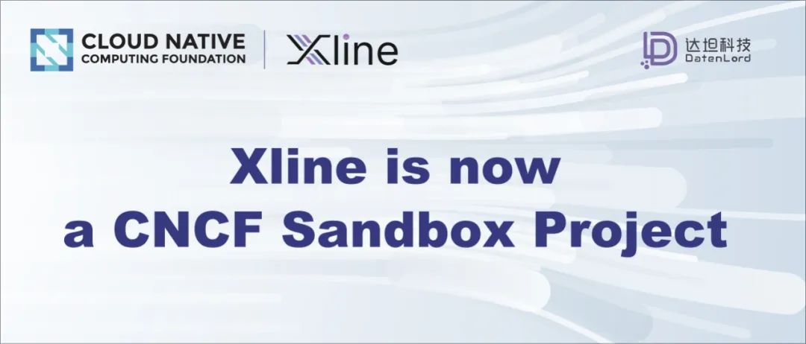
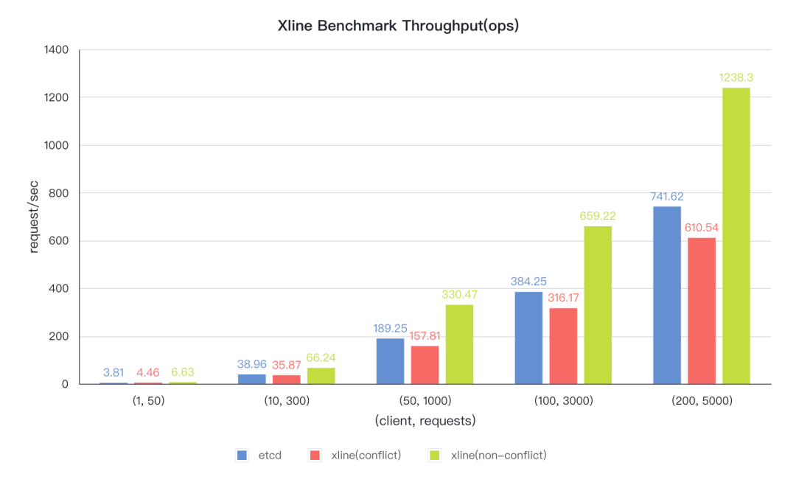

**2023 年 6 月 13 日，云原生计算基金会（CNCF）宣布 Xline 正式被纳入 CNCF 沙箱(Sandbox）项目。** Xline 是由达坦科技（DatenLord）于 2022 年年底推出的开源项目，是一个用 Rust 语言写就的，用于元数据管理的分布式 KV 存储。

**Xline 是 CNCF 首个跨云元数据 KV 存储项目。** Xline 进入 CNCF 沙箱项目充分表明，在跨云领域，**达坦科技（DatenLord）的开源技术被全球顶级开源基金会所认可。** 而 Xline 作为一个开源中立的项目，将与 CNCF 社区共同发展，助力云原生生态体系稳步迈入跨云时代。

## Birth Xline 的诞生

在单数据中心场景下，元数据的管理已经有很多成熟的解决方案，etcd 就是其中的佼佼者，但是在多数据中心场景下，etcd 的性能受 Raft 共识协议的限制，它的性能和稳定性都大打折扣。随着互联网和云计算的业务规模越来越大，单个数据中心已经无法满足业务的需求，业务系统从单数据中心向多数据中心发展，多地多中心多活部署的需求也越来越普遍。

多数据中心架构最大的挑战是，如何保证数据跨数据中心访问的一致性和性能。比如索引、权限、配置等这类需要跨数据中心共享访问的元数据，如何在多中心竞争修改的场景下，仍然能保持一致性，并且保证访问性能。Xline 由此应运而生。**Xline 是一个开源的分布式的 KV 存储，用来管理少量的关键性数据，并在跨云跨数据中心的场景下仍然保证高性能和数据强一致性。**

## Feature Xline 的特点

- **一个分布式多集群 KV 存储引擎**：在多集群场景下实现统一数据管理，使相互访问、发现和修改变得简单和方便。
- **一个统一的元数据管理系统**：通过在内存中缓存热数据实现跨云数据访问，并通过提供统一的数据管理来实现自动数据迁移和备份。
- **一个高性能的多数据中心共识协议**：它是第一个基于广域网共识协议的跨数据中心一致性管理服务器，解决了跨云融合和一致性的挑战。
- **兼容 etcd 接口**：提供 KV 接口，多版本并发控制，同时与 K8S 兼容，让用户使用和迁移更加流畅。

## Core Curp 共识协议

CURP 共识协议（ [Curp 共识协议的重新思考](http://mp.weixin.qq.com/s?__biz=MzkwNTMzOTE2MA==&mid=2247484411&idx=1&sn=ea75ac5e8dd0e7b0275a8fefc87e06ad&chksm=c0f80b8cf78f829ade62d72086b6bac2232650cf46f8cd35e790703c686657526f9d62e53657&scene=21#wechat_redirect) ）的优势是将非冲突的 proposal 达成共识所需要的 RTT 从 2 个降为 1，对于冲突的 proposal 仍然需要两个 RTT，而 etcd 等主流分布式系统采用的 Raft 协议在任何情况下都需要两个 RTT。

尽管 Raft 很稳定，也很易于实现，但从客户的角度来看，它需要 2 个 RTT 来完成一个共识请求。一个 RTT 发生在客户端和领导者服务器之间，而领导者服务器需要另一个 RTT 将消息广播给跟随者服务器。在广域网下的高延迟环境中，一个 RTT 的运行时间从几十到几百毫秒不等，两个 RTT 将是两个费时的过程。

两个 RTT 降为一个 RTT 所带来的性能提升在单数据中心场景下体现的并不明显，但是在多数据中心或者跨云场景下，RTT 一般在几十到几百 ms 的数量级上，这时一个 RTT 的性能提升则相当明显。

## Growth 版本持续迭代

2023 年 5-6 月刚发布的新版本实现如下改进：

- 通过引入批处理机制提高网络带宽利用率；
- 为 CURP 共识协议实现快照功能；
- 实现快照相关 API，且与 etcdctl 兼容。其余 etcdctl 维护中的 API 会在未来实现。
- 添加 watch 进度通知机制

在对 Xline 做 benchmark 测试中，我们将 Xline 运行在多个 docker 镜像中，并通过 tc 来设置不同节点之间的网络延迟，模拟真实世界下广域网的延迟情况，具体的网络拓扑及 latency 大小可参考 Xline 测试网络拓扑。

基准测试报告也显示，Xline 在高网络延迟的场景下，针对无冲突的并发 PUT 请求，Xline 在吞吐量接近 etcd 的两倍，而在完全冲突的情况下，Xline 的吞吐量则略低于 etcd。这足以证明 Xline 在高延迟的广域网环境下能够比 etcd 有更好的性能表现。目前 Xline 还处在开发的早期阶段，我们也会在接下来的开发过程中，不断完善 benchmark 的测试用例，并提升 Xline 在冲突状态下的性能。

**在下一个版本 v0.5.0 当中，我们计划增加如下特性：**

- 开始提供第一个基于 rust 版本 cmd line tool
- 为 Xline 提供 k8s operator 来使其融入到 K8S 的生态当中
- 提升 Xline 相关 TXN 操作的性能

---

## Together We Grow!

在此感谢每一位参与的社区伙伴对 Xline 的帮助和支持，也欢迎更多使用者和开发者参与体验和使用 Xline。我们希望得到你的参与和支持，你可以：

- 加入 Xline Discord:  
  https://discord.gg/XyFXGpSfvb
- 在 GitHub 上点颗星：  
  https://github.com/datenlord/Xline
- 作为贡献者加入 Xline:  
  https://github.com/datenlord/Xline/blob/master/CONTRIBUTING.m
- 去 Xline 官网，阅读更多的技术干货：  
  www.xline.cloud
