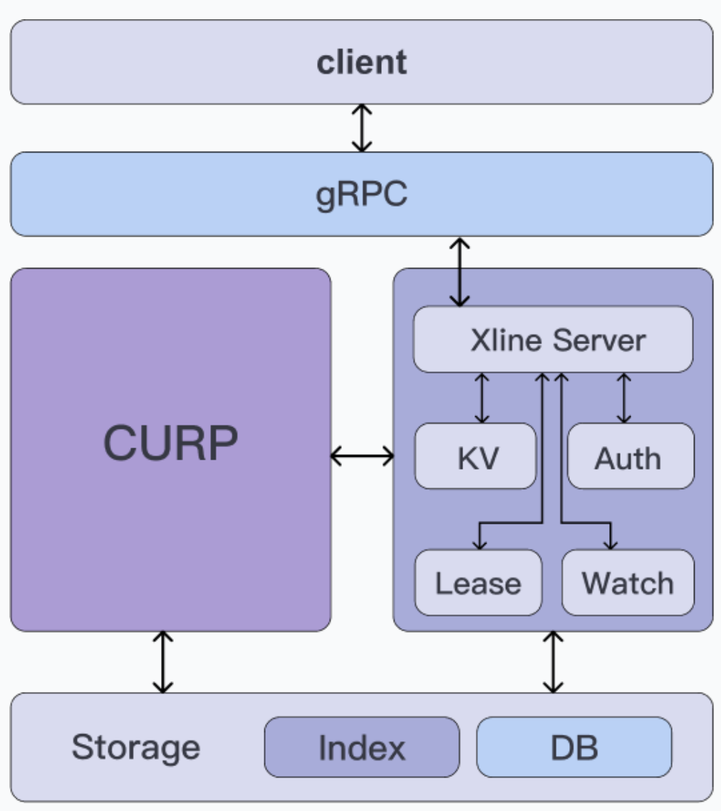
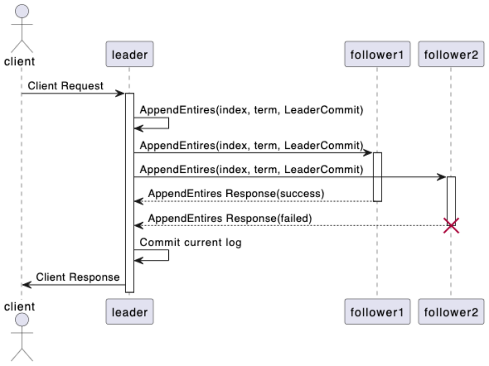
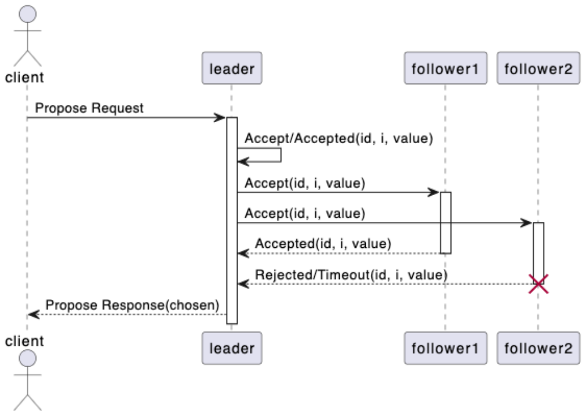
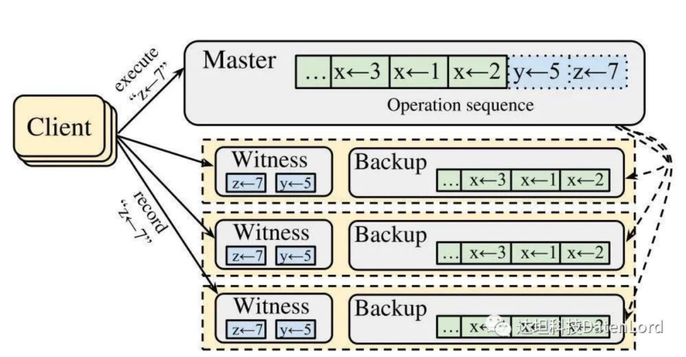

## Xline 是什么

Xline 是一款开源的分布式 KV 存储引擎，其核心目的是实现高性能的跨数据中心强一致性，提供跨数据中心的 meatdata 管理。那么 Xline 是怎么实现这种高性能的跨数据中心强一致性的呢？这篇文章就将带领大家一起来一探究竟。

## Xline 的整体架构

我们先来看看 Xline 的整体架构，如下图所示：

从上至下，Xline 可以大致分为三层，分别是

- 接入层：采用 gRPC 框架实现，负责接收来自客户端的请求。
- 中间层：可以分为 CURP 共识模块（左）和业务 Server 模块（右），其中：
  - CURP 共识模块：实现了 CURP 共识算法，代码上则对应了 Xline 中的 curp 这个 crate，相应的 rpc 服务定义在 curp/proto 中。
  - 业务 Server 模块：负责实现 Xline 的上层业务逻辑，如负责 KV 相关请求的 Kv Server 以及负责认证请求的 AuthServer 等。代码上则对应了 xline 这个 crate，相应的 rpc 服务定义文件保存在 xlineapi 这个 crate 中。
- 存储层：负责持久化相关的工作，向上层提供抽象接口，代码上对应了 engine 这个 crate

## CURP 协议简介

### CURP 是什么？

Xline 中所使用的共识协议，即非 Paxos 而非 Raft，而是一种新的名为 Curp 的共识协议，其全称为 “Consistent Unordered Replication Protocol”。CURP 协议来自于 NSDI 2019 的一篇 Paper 《Exploiting Commutativity For Practical Fast Replication》，其作者是来自斯坦福的博士生 Seo Jin Park 和 John Ousterhout 教授，John Ousterhout 教授同时也是 raft 算法的作者。

### 为什么选择 CURP 协议

那为什么 Xline 要使用 CURP 这样一种新的协议，而非 Raft 或者 Multi-Paxos 来作为底层的共识协议呢？为了说明这个问题，我们不妨先来看看 Raft 以及 Multi-Paxos 都存在什么样的问题？

下图是 Raft 协议达成共识的一个时序流程：

在这个时序图中，我们可以了解到 Raft 协议达成共识的流程：

1. client 需要向 leader 发起一个提案请求。
2. leader 接收到来自 client 的提案请求后，将其追加到自身状态机日志当中，并向集群中的其他 follower 广播 AppendEntries 请求。
3. follower 接收到来自 leader 的 AppendEntries 请求后，对其进行日志一致性检查，判断是否可以将其添加到自身的状态机日志当中，是则返回成功响应，否则返回失败响应。
4. leader 统计所收到的成功响应的数量，如果超过集群节点数量的一半以上，则认为共识已达成，提案成功，否则认为提案失败，并将结果返回给 client。

下图是 Multi-Paxos 协议达成共识的一个时序流程：

在这个时序图中，我们可以了解到 Multi-Paxos 协议达成共识的流程：

1. client 向 leader 发起一个提案请求。
2. leader 先在自己的状态机日志上找到第一个没有被批准的日志条目索引，然后执行 Basic Paxos 算法，对 index 位置的日志用 client 请求的提案值进行提案。
3. follower 接收到来自 leader 发起的提案值后进行决议，接受该提案值则返回成功响应，否则返回失败。
4. leader 统计所收到的成功响应的数量，如果超过集群节点数量的一半以上，则认为共识已达成，提案成功，否则认为提案失败，并将结果返回给 client。

从上述时序流程来看，不论是 Multi-Paxos 还是 Raft，要达成共识都必然需要经历两次 RTT。之所以是经历两次，是因为它们都基于一个核心假设，命令批准/日志提交后都需要同时满足持久化存储、有序，状态机就能直接执行批准后的命令/应用提交后的日志。但由于网络本身是异步的，无法保证有序性，因此需要 leader 先来执行，以确保不同命令的执行顺序（日志索引），并通过广播获得过半数节点的复制来确保持久化，这无法在一个 RTT 内完成。

而这也是导致 Xline 不选择 Raft 或者 Multi-Paxos 作为底层共识算法的根本原因。Xline 在设计之初便立足于跨数据中心的元数据管理。我们都知道，对于单数据中心而言，其内网的延迟往往都非常的小，只有几毫秒甚至小于 1ms，而对于跨数据中心的广域网下，其网络延迟往往可以达到几十甚至上百毫秒。传统共识算法，例如 Raft 或者 Multi-Paxos，无论在何种状态下，达成共识所需要都需要经过 2 个 RTT。在这种高延迟的网络环境中，传统的共识算法往往会导致严重的性能瓶颈。这不禁引起了我们的思考：任何情况下，两次及以上的 RTT 是否是达成共识的必要条件吗？

而 CURP 算法是一种无序复制算法，它将达成共识的场景细分成了以下两类：  
**fast path：** 在无冲突的场景下，在满足持久化存储的前提下，放松对共识的有序性要求并不影响最终的共识的达成。由于 fast path 只要求持久化存储，因此只需要 1 个 RTT 就可以达成共识。我们将 fast path 称之为协议的前端
**slow path：** 在有冲突的场景下，则需要同时保证并发请求的有序性，及持久化存储这两个前提条件，因此需要 2 个 RTT 来达成共识，我们将 slow path 称之为协议的后端

那读者可能就会有疑问了，这里面的冲突究竟指的是什么呢？让我们用简单的 KV 操作来举个例子。在分布式系统的节点上，我们对状态机所做的操作无非就是读和写，在考虑对状态机的并发操作的情况下，总共可以有读后读，读后写，写后读，写后写四种场景。显然，对于读后读这种无副作用的只读操作而言，任何情况下都不存在冲突，无论是先读还是后读，最终读出来的结果总是一致的。当操作不同的 Key 时，例如 PUT A=1， PUT B=2，那么对于状态机的最终状态而言，不论是先执行 PUT A=1，再执行 PUT B=2，还是反过来，最终从状态机上读出来的结果都是 A=1，B=2。读写混合的场景也是同理，因此当对状态机并发执行的多个操作之间的 key 不存在交集时，我们称这些操作都是无冲突的。反之，如果并发多个操作之间包含了至少一个写操作，同时其操作的 Key 存在交集，这些操作都是冲突的。

### fast path 与 slow path

那么 CURP 是如何实现 fast path 和 slow path 的呢？下图是 CURP 算法中集群拓扑的一个简图

让我们先来看看这张图中都有哪些内容：

1. Client：向集群发起请求的 client。
2. Master：对应了集群中的 leader 节点。Master 节点中保存了状态机的日志，其中绿色部分代表的是已经持久化到磁盘当中的日志，而蓝色部分则代表的是保存在内存当中的日志。
3. Follower 节点：对应了上图中黄色虚线框的部分，每个 follower 都包含了一下两个部分  
   a. Witness：本质上可以近似地看成是一个基于内存的 HashMap，一方面负责记录当前集群中处在 fast path 流程中的请求，另一方面，CURP 也会通过 Witness 来判断当前的请求是否存在冲突。Witness 中所保存的所有记录都是无序的。  
   b. Backup：保存持久化到磁盘中的状态机日志。

接着，让我们以图中的例子 PUT z=7 为例，来看看 fast path 的执行流程：

1. client 向集群中所有节点广播 PUT z=7 的请求；
2. 集群当中的节点接受到该请求后，根据角色的不同会执行不同的逻辑：  
   a. leader 接收到请求后，会立刻将数据 z = 7 写入到本地（也就是状态机日志中的蓝色部分）然后立刻返回 OK。  
   b. follower 接收到请求后，会通过 witness 判断请求是否冲突。由于此次 z = 7 并不和 witness 中仅有的 y = 5 冲突，因此 follower 会将 z = 7 保存到 witness 中，并向 client 返回 OK。
3. client 收集并统计所接收到的成功响应的数量。对于一个节点数量为 2f + 1 的集群，当接收到的成功响应达到 f+f/2+1 个时，则确认该操作已经持久化到集群当中，整个过程耗时 1 个 RTT。

接下来，在前面 fast path 例子的基础上，让我们以 PUT z = 9 为例，来看看 slow path 的执行流程。由于 z = 9 和前面的 z = 7 相冲突，因此 client 所发起的 fast path 会以失败告终，并最终执行 slow path，流程如下：

1. client 向集群中所有节点广播 PUT z=9 的请求；
2. 集群当中的节点接受到该请求后，根据角色的不同会执行不同的逻辑：  
   a. leader 接收到请求后，将 z = 9 写入到状态机日志中。由于 z = 9 与 z = 7 相冲突，向 client 返回 KeyConflict 响应，并异步发起 AppendEntries 请求将状态机日志同步到集群的其他节点上。  
   b. follower 接收到请求后，由于 z = 9 与 witness 中的 z = 7 相冲突，因此会拒绝保存这个提案。
3. client 收集并统计所接收到的成功响应的数量，由于接收到的拒绝响应的数量超过了 f/2，client 需要等待 slow path 的完成。
4. 当步骤 2 中 AppendEntries 执行成功，follower 将 leader 的三条状态机日志（y = 5, z = 7, z=9）都追加到 Backup 后，将 witness 中的相关记录移除，并向 leader 返回成功响应。
5. leader 统计所收到的成功响应的数量，如果超过集群节点数量的一半以上，则认为共识已达成，提案成功，否则认为提案失败，并将结果返回给 client。

## Summary

Xline 是一款提供跨数据中心强一致性的分布式 KV 存储，其核心问题之一便是如何在跨数据中心这种高延迟的广域网环境中提供高性能的强一致性保证。传统的分布式共识算法，如 Raft 和 Multi-Paxos，通过让所有操作都满足持久化存储和有序性前提来保证状态机一致性。而 CURP 协议则是对达成共识的场景做了更细粒度的划分，将协议分割成了前端（fast path）和后端（slow path），前端只保证了提案会被持久化到集群当中，而后端不仅保证了持久化，也保证了所有保存了该提案的节点会按照相同的顺序执行命令，保证了状态机的一致性。

关于 CURP 协议的简介就到这里，更多的细节欢迎参考我们的其他文章和分享，如下：  
[Curp 共识协议的重新思考](https://mp.weixin.qq.com/s?__biz=MzkwNTMzOTE2MA==&mid=2247484411&idx=1&sn=ea75ac5e8dd0e7b0275a8fefc87e06ad&chksm=c0f80b8cf78f829ade62d72086b6bac2232650cf46f8cd35e790703c686657526f9d62e53657&scene=21#wechat_redirect)

[DatenLord | Xline Geo-distributed KV Storage](https://mp.weixin.qq.com/s?__biz=MzkwNTMzOTE2MA==&mid=2247484541&idx=1&sn=a7606b6f899a8fe6fddd8e9d77caa027&chksm=c0f80c0af78f851cb8699105225749da05526dfef676a244f53d7154c0f35399b30e5984f123&scene=21#wechat_redirect)
