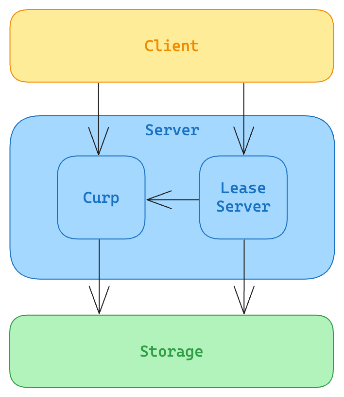
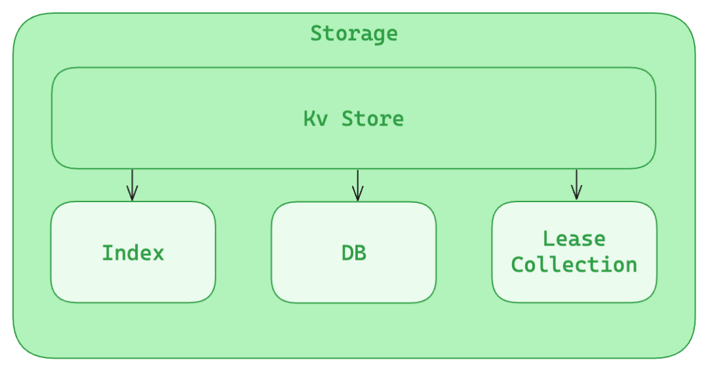
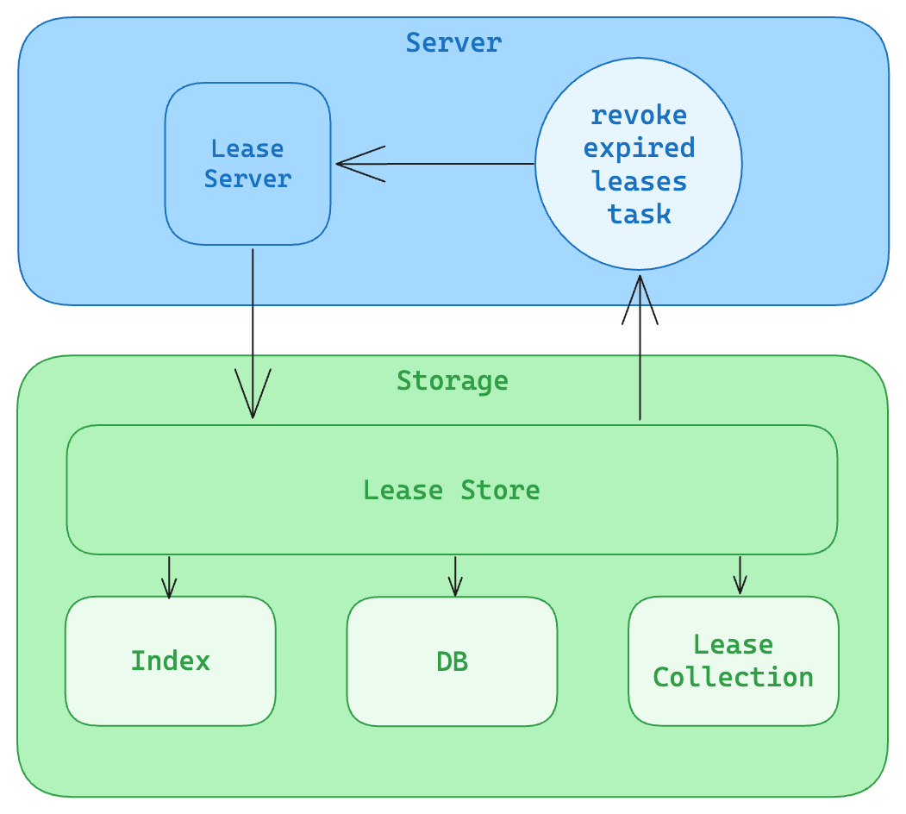

## 简介

**Xline 是一款开源的分布式 KV 存储引擎，用于管理少量的关键性数据，其核心目标是实现高性能的数据访问，以及保证跨数据中心场景下的强一致性。** Xline 对外提供了一系列兼容 etcd 的访问接口，比如 KV、Watch、Lease 等等。本文将会着重介绍一下其中的 **Lease 接口**。

Lease 是一种客户端和服务端之间的租约机制。类似于我们现实生活中的租车服务，当我们需要使用一辆车时，我们可以向租车公司申请一个 lease，租车公司会给我们分配一辆车，并且保证在我们和租车公司约定的有效期内不会把这辆车分配给其他人，如果我们想要延长使用时间，我们可以向租车公司续租，如果我们不再需要使用这辆车，我们可以主动归还并取消，或者等待 lease 过期后自动归还。

在 Xline 中对 lease 的使用和现实生活中的租车服务很相似，客户端可以向服务点申请一个 lease，服务端会保证在 lease 的有效期内不会删除这个 lease，客户端也可以通过相应的接口提前结束或者延长 lease 的时间，与现实中租车不同的是，我们可以在这个 lease 上绑定一些 key-value，这些 key-value 会随着 lease 的过期被删除。

根据以上介绍的 lease 的能力，我们可以在很多场景下使用 lease 来实现我们的目的，以下是几个常见的 lease 应用场景：

- **分布式锁：** 分布式锁是通过多个机制一同实现的，lease 在分布式锁中起到避免死锁的作用。客户端在请求分布式锁的时候，会创建一个 lease 并不断续租，并且写入 key-value 并附加该 lease，这个 key-value 代表分布式锁的占用状态，如果占用该锁的客户端因故障无法主动释放锁，lease 机制也会保证在 lease 过期后自动删除对应的 key-value 来释放当前锁。
- **服务注册中心：** 注册新服务时创建 lease，并写入服务相关信息的 key-value 附加该 lease，在服务存活期间，对应服务会一直对其 lease 续租，服务故障后无法自动续租，对应 key-value 自动删除，相应的服务就会在注册中心中注销。
- **分布式系统中的授权管理：** 客户端通过申请 lease 来获取资源的访问权限，如果客户端失去与服务端的连接，或者由于故障没有及时续租，导致 lease 过期，该客户端就会失去相应的权限

## 架构



上图是一个 lease 实现的简单架构图，外部 Client 可以通过两种方式向 Xline 集群发送请求，一种是直接通过 `Curp` 协议向集群内所有节点广播请求，`Curp` 模块达成共识后，会把这个请求应用到状态机，也就是将其写入存储层；另一种发送请求的方式就是 Client 直接将请求发送到集群中一个节点的 `LeaseServer`，这也是与 etcd 兼容的请求方式，请求到达 `LeaseServer` 后，会有两条不同的处理路径，多数请求会通过 Server 端绑定的 Curp client 广播给集群中所有节点，剩下的少部分请求可能只有部分节点能够处理，这些请求就会被转发到这些节点的 `LeaseServer`，然后应用到状态机。

## 源码分析

### 源码组织

Lease 相关的源码主要保存在以下文件中，大致分为三个部分：

1. RPC 定义：
   - xlineapi/proto/rpc.proto：Xline 内各 Server 的 rpc 接口定义，包括 LeaseServer 接口定义。
   - xlineapi/proto/lease.proto：lease 的 rpc message 定义。
2. LeaseServer 实现：
   - xline/src/server/lease_server.rs：负责提供 Lease RPC service 的具体实现，主要目的是提供 etcd 兼容接口，如果使用外部的 curp client 直接发送 propose 可以不经过此接口，但也有部分不经过共识协议的请求必须通过 LeaseServer 处理。
3. LeaseStore 实现：
   - xline/src/storage/lease_store/lease.rs：定义了 Lease 数据结构，用于保存 Lease 相关的信息，比如 Lease 上绑定的所有 Key， Lease 的过期时间，Lease 的剩余 TTL 长度等。并为其实现了一些实用的方法。
   - xline/src/storage/lease_store/lease_queue.rs：定义了 LeaseQueue 和相关的方法，LeaseQueue 是一个由 lease id 以及 lease 过期时间组成的优先队列，一个后台常驻 task 会定时通过此结构获取所有过期 lease 的 id。
   - xline/src/storage/lease_store/lease_collection.rs：定义了 LeaseCollection 和相关的方法，LeasCollection 是 lease 核心数据结构的集合，提供 lease 机制的核心能力。结构内部主要包含三个部分，lease_map 保存所有 lease 结构；item_map 缓存 key 到 lease id 映射；expired_queue 管理 lease 过期时间，expired_queue 只在 leader 节点上有意义，其它节点上为空。
   - xline/src/storage/lease_store/mod.rs：LeaseStore 的定义及方法实现。负责提供 lease 的存储层抽象，对外提供所有 lease 相关操作的存储层接口。其内部包含 LeaseCollection 以及和 KvStore 共享的一些数据结构。

### Lease 的创建

想要使用 lease，首先就要创建一个 lease，创建 lease 时需要使用 `LeaseServer` 提供的 `LeaseGrant` `接口。LeaseServer` 中对 `LeaseGrant` 的处理很简单，就是分配一个 lease id，然后通过 propose 把请求交给共识协议处理，达成共识后，请求会在 `LeaseStore` 中被执行。

`LeaseStore` 会在 `LeaseCollection` 中创建并插入一个新的 Lease，其核心代码逻辑如下：

```rust
...
if is_leader {
    let expiry = lease.refresh(Duration::ZERO);
    let _ignore = inner.expired_queue.insert(lease_id, expiry);
} else {
    lease.forever();
}
let _ignore = inner.lease_map.insert(lease_id, lease.clone());
...
```

需要注意的是，如果当前节点是 leader 节点的话，还需要承担管理 lease 过期时间的任务，所以需要通过 `refresh` 方法计算 `Lease` 的过期时间，并将其插入到 `expired_queue` 中。其他节点则不需要这一步处理，只需要将新的 `Lease` 插入到 `lease_map` 中。计算过期时间使用的 refresh 定义如下：

Lease 创建完成后，服务端会给客户端返回一个包含 lease id 的响应。

### Lease 的使用



获取到 lease id 后，客户端就可以通过 lease id 来使用这个 lease，在 Put 一对 key value 时可以附加 lease id，这个 Put 请求被应用到状态机时，除了直接在 KvStore 的 Index 和 DB 中写入 key-value 以外，还会通过 LeaseCollection 提供的 detach 方法分离当前 key 和旧的 lease ，并通过 attach 将需要 put 的 key 附加到新的 lease id 上。

```rust
pub(crate) fn attach(&self, lease_id: i64, key: Vec<u8>) -> Result<(), ExecuteError> {
    let mut inner = self.inner.write();
    let Some(lease) = inner.lease_map.get_mut(&lease_id) else {
        return  Err(ExecuteError::lease_not_found(lease_id));
    };
    lease.insert_key(key.clone());
    let _ignore = inner.item_map.insert(key, lease_id);
    Ok(())
}
```

`attach` 的具体实现就是通过 `lease id` 找到对应的 `Lease`，并将 key 附加到 `Lease` 上，以及在 `item_map` 中添加 key 到 lease id 的映射关系。`detach` 的实现与 `attach` 的相反，它会移除 `attach` 时插入的内容。

经过以上的过程，我们已经成功将 key 和 lease id 关联在一起，此时如果这个 `Lease` 被主动 revoke 或者超时，那么这个 `Lease` 以及它关联的所有 key，都会被删除。

### Lease 的主动删除

删除一个 lease 需要调用 `LeaseRevoke` 接口，这个接口在 `LeaseServer` 中的处理与 `LeaseGrant` 基本相同，都是将请求交给共识协议处理，唯一的不同是 `LeaseRevoke` 不需要分配 lease id。

```rust
let del_keys = match self.lease_collection.look_up(req.id) {
    Some(l) => l.keys(),
    None => return Err(ExecuteError::lease_not_found(req.id)),
};
if del_keys.is_empty() {
    let _ignore = self.lease_collection.revoke(req.id);
    return Ok(Vec::new());
}

// delete keys ...

let _ignore = self.lease_collection.revoke(req.id);
```

`LeaseRevoke` 被执行时，首先会尝试查找 `Lease` 是否有关联的 key，如果没有，那么就可以直接通过 `LeaseCollection` 上的 `revoke` 方法将 `Lease` 删除，如果有关联的 key 的话那么就需要将关联的所有 key 从 `KvStore` 中删除，并清理 `LeaseCollection` 中这些 key 和 lease id 的关系，然后才能从 `LeaseCollection` 中 `reovke` 这个 `Lease`。

### Lease 的过期



Lease 过期时的处理流程如上图所示，此处省略了共识的部分，在初始化 `LeaseServer` 时，会创建一个后台常驻的 `revoke_expired_leases_task`，这个 task 的主体代码如下：

```rust
loop {
    // only leader will check expired lease
    if lease_server.lease_storage.is_primary() {
        for id in lease_server.lease_storage.find_expired_leases() {
            let _handle = tokio::spawn({
                let s = Arc::clone(&lease_server);
                async move {
                    let  request = tonic::Request::new(LeaseRevokeRequest { id });
                    if let Err(e) = s.lease_revoke(request).await {
                        warn!("Failed to revoke expired leases: {}", e);
                    }
                }
            });
        }
    }
    time::sleep(DEFAULT_LEASE_REQUEST_TIME).await;
}
```

在负责管理 `Lease` 过期时间节点上，这个 task 会定时通过 `find_expired_leases` 获取已经过期的所有 lease id， 然后调用 lease server 上的 `lease_revoke` 接口来删除过期的 `Lease`，这个接口和客户度主动删除 `Lease` 时使用的是同一个接口。

`find_expired_leases` 是 `LeaseCollection` 上一个核心方法，具体实现如下：

```rust
pub(crate) fn find_expired_leases(&self) -> Vec<i64> {
    let mut expired_leases = vec![];
    let mut inner = self.inner.write();
    while let Some(expiry) = inner.expired_queue.peek() {
        if *expiry <= Instant::now() {
            #[allow(clippy::unwrap_used)] // queue.peek() returns Some
            let id = inner.expired_queue.pop().unwrap();
            if inner.lease_map.contains_key(&id) {
                expired_leases.push(id);
            }
        } else {
            break;
        }
    }
    expired_leases
}
```

在创建 `Lease` 时，我们已经计算过了 `Lease` 过期的时间并将其插入了 `expired_queue` ，调用 `find_expired_queue` 时会一直尝试从优先队列队头拿出已经过期的 `Lease` ，直到遇到第一个不过期的 `Lease` 后停止尝试，然后将拿到的所有 lease id 返回。

### Lease 的续租

如果想要让创建的 `Lease` 能够持续更长时间，那就需要在客户端和服务端之间维护一条 stream，客户端定时向服务端发送 `LeaseKeepAlive` 请求。和前面提到的请求不同，`LeaseKeepAlive` 请求不需要经过共识协议，因为这个请求依赖只存在于 leader 节点上的 `Lease` 过期时间，因此只有 leader 节点能够处理 LeaseKeepAlive 请求，follower 节点会把请求转发至 leader 节点上处理。具体的转发逻辑可以参考 `lease_server.rs` 内的源码。

在 leader 和 client 建立起 stream 后，每当 leader 从 stream 中收到 lease id，都会为这个 lease 续租，最终续租的逻辑是通过 `LeaseCollection` 提供的 `renew` 方法实现的。该方法定义如下：

```rust
pub(crate) fn renew(&self, lease_id: i64) -> Result<i64, ExecuteError> {
    let mut inner = self.inner.write();
    let (expiry, ttl) = {
        let Some(lease) = inner.lease_map.get_mut(&lease_id) else {
            return Err(ExecuteError::lease_not_found(lease_id));
        };
        if lease.expired() {
            return Err(ExecuteError::lease_expired(lease_id));
        }
        let expiry = lease.refresh(Duration::default());
        let ttl = lease.ttl().as_secs().cast();
        (expiry, ttl)
    };
    let _ignore = inner.expired_queue.update(lease_id, expiry);
    Ok(ttl)
}
```

Renew 会先检查对应 `Lease` 是否已经过期，没有过期的话就会重新计算过期时间，然后更新它在 `expired_queue` 中的顺序。

只要 client 和 server 之间的连接不中断，client 就会一直通过 stream 向服务端发送 `LeaseKeepAlive` 请求，这个 lease 也就不会超时，前文提到的 lease 主要的应用场景中，几乎都用到了这个特性来判断客户端是否在正常运行。

### Lease 信息的读取

Lease 有两个读取接口，一个是 `LeaseTimeToLive`，这个接口会读取一个 lease 的详细信息，包括它的过期时间，和 `LeaseKeepAlive` 一样，因为过期时间只存在于 leader 节点，因此该请求需要转发只 leader 处理；另一个读取接口是 `LeaseLeases`，这个接口会列出系统中所有的 lease id，这个接口不需要 lease 过期时间的信息，因此可以直接交给共识协议处理，所以在 `LeaseServer` 中的处理和 `LeaseGrant` 、`LeaseRevoke` 相似。此处不再赘述。

`LeaseTimeToLive` 和 `LeaseLeases` 读取信息的能力最终由 `LeaseCollection` 实现，源码如下：

```rust
pub(crate) fn look_up(&self, lease_id: i64) -> Option<Lease> {
    self.inner.read().lease_map.get(&lease_id).cloned()
}

pub(crate) fn leases(&self) -> Vec<Lease> {
    let mut leases = self
        .inner
        .read()
        .lease_map
        .values()
        .cloned()
        .collect::<Vec<_>>();
    leases.sort_by_key(Lease::remaining);
    leases
}
```

## 总结

本文介绍了 Xline 下的一个重要接口 Lease，用户可以通过 Lease 实现一组 key 的定时过期，并且能够通过 KeepAlive 接口为 Lease 续租，服务端也能够根据此特性探测客户端是否在正常运作。依赖于 Lease 机制的这些特点，也诞生出了很多典型的应用场景，比如本文介绍过的分布式锁、服务注册中心，授权管理等等。

文章中也讲解了 Lease 的用户使用 Lease 过程，以及该过程中一些关键能力是如何实现的，如果想要了解更加详细的代码，也可以参考我们的开源仓库：https://github.com/xline-kv/Xline 。
