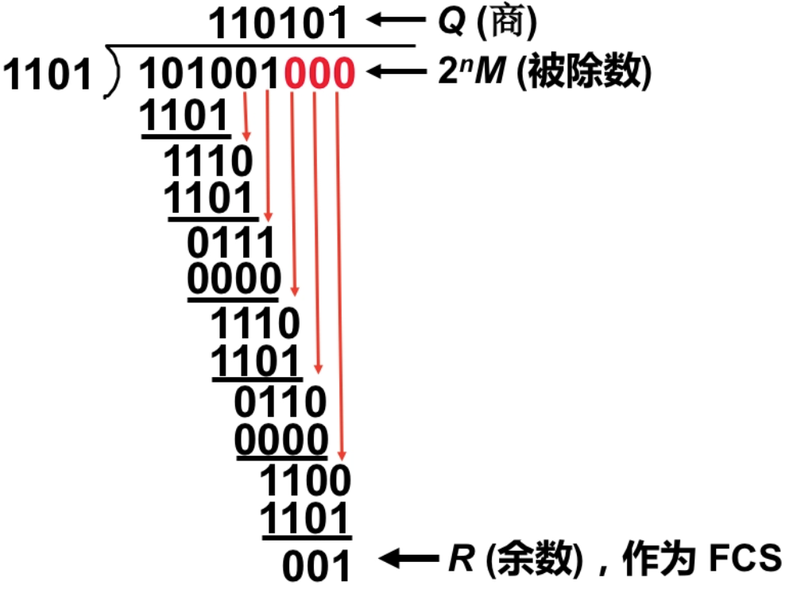
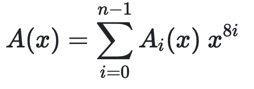
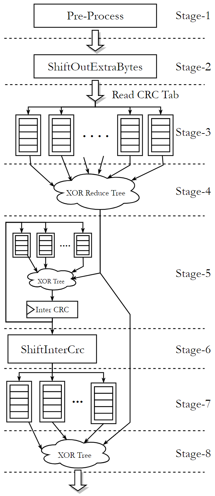
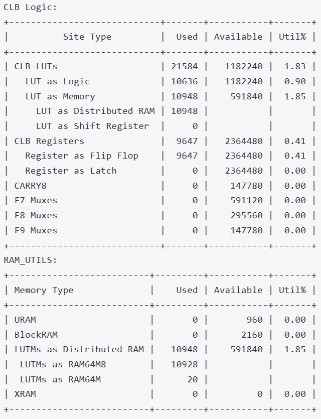
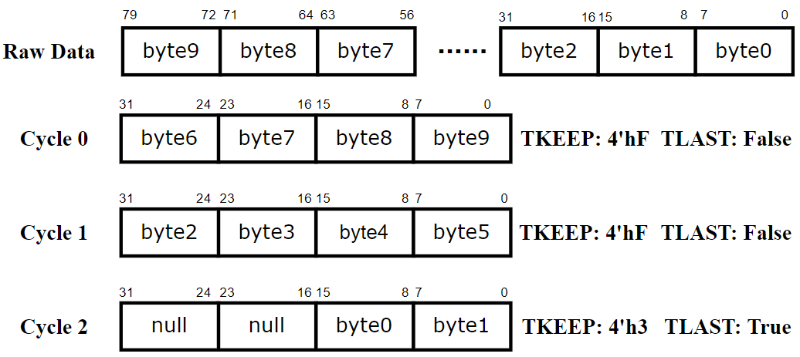

## 引 言

循环冗余校验码，即 Cyclic Redundancy Check (CRC), 是一种在各种通信系统中广泛应用的检错机制。CRC 算法的工作原理和哈希函数类似，具体来说，其对任意长度的数据计算出一段唯一的标识（校验和）, 然后根据这个标识来判断该数据在传输过程中是否发生变化。CRC 检错码在实际生活中有着广泛的应用，诸如网络通信，存储系统等场景下都需要 CRC 来保证数据传输的正确性。而不同的应用场景往往需要采用不同的 CRC 配置参数，同时对计算的性能也有不同的需求。例如，在基于 Ethernet 协议的网络传输中需要采用 IEEE802-3 协议所规定的 CRC 参数，同时需要高吞吐率的 CRC 实现以和网络带宽相匹配。

对于一个具体的通信系统，CRC 既可以通过软件编程也可以硬件电路的形态来实现。相较于网络上丰富的软件库，开源的 CRC 硬件实现却相对落后，尤其是面向高性能的应用场景。例如，下述链接都提供了参数可配置的 CRC 硬件电路生成器，但这些实现方式都是直接将 CRC 算法映射到组合逻辑电路上，这往往会导致较长的组合逻辑延时进而降低电路的整体工作频率，无法满足高吞吐率的需求。

- Easics: http://www.easics.com/webtools/crctool
- Outputlogic: http://outputlogic.com/
- SpinalCrypto: https://github.com/SpinalHDL/SpinalCrypto

而另外一些开源的电路实现虽然引入了流水线技术对时序进行优化，但其实现只针对某一特定的 CRC 配置参数，应用场景相对有限：

- Pipelined Implementation:  
   https://bitbucket.org/spandeygit/crc32_verilog/src/master/

针对现有 CRC 开源硬件实现的不足，blue-crc 项目基于 Bluespec SystemVerilog 硬件描述语言实现了一个参数可配置同时满足高吞吐率需求的 CRC 硬件电路生成器。blue-crc 在架构和功能上的具体特点包括:

- 支持完整的 CRC 配置参数包括：polynominal (生成多项式)，initial_value (初始 CRC 值)，finalXor (与输出 CRC 值异或)， reverseInput (是否翻转每个输入字节的比特顺序)，reverseOutput (是否翻转输出 CRC 结果的比特顺序);
- 标准 I/O 接口: 输入端支持 AxiStream 协议 (位宽可配置), 输出端基于 valid-ready 握手机制传输 CRC 校验和;
- 并行计算+流水线: 每个周期可处理多个字节数据，在 Xilinx xcvu9p FPGA 上可达到 500MHz 的运行频率;
- 高吞吐率: 在 256-bit 输入数据总线的配置下吞吐率可达 128Gb/s;
- 计算模式: 支持发送端 CRC 生成和接收 CRC 检测两种不同的计算模式

下文将分别从算法和架构两个方面介绍 blue-crc 背后的实现原理及其具体的使用方式。

## 算法原理

### CRC 计算的定义

生成 CRC 校验和本质上是在计算基于多项式的模 2 除法。将原始数据每个比特所确定的多项式除以一个通信双方规定好的生成多项式，得到的余数即为校验和。生成 CRC 校验值算法的详细定义如下:对于 m-bit 原始数据


可以表示为如下多项式:


若需要生成 n-bit 的 CRC 校验值, 则通信双方需要规定一个 (n+1)-bit 的生成多项式:


则原始数据的 CRC 校验值为多项式 A(x)乘上 x^n 后除以 G(x)得到的余数，具体表达式为：


生成的 CRC 校验值附加在原始数据的尾部后传输至接收端, 即实际发出的数据为


基于 CRC 的生成原理，数据接收端可以采用两种不同的方式完成校验:

1. 提取出附加在发送数据尾部的校验值后生成新的 CRC 校验值，将该值与提取出的进行比较，如果二者相同则表明数据在传输过程中没有出错；
2. 由于校验值为除法运算中得到的余数，这就意味着附加上检验值后的发送数据可被生成多项式整除，因此也可以直接对接收数据进行模 2 除法，若得到的余数为 0 则表明数据传输成功。

在基于多项式的模 2 算术运算中，变量的取值范围只有 0 和 1，且运算过程不存在进位或借位。因此，加减法都可以视为异或运算, 而乘除法可以由加减法构成，因此实际上也等同于一系列的异或运算。下图展示了一个具体的模 2 除法取余数计算 CRC 校验和的例子，其中原始数据为 101001，生成多项式为 1101。由该例子可见，模 2 除法的运算法则和普通的除法类似，不同点在于模 2 除法用异或操作替换了减法且不存在借位。



从另外一个角度理解，模二除法取余数的过程实际上是逐位地对原始数据进行缩减: 当输入数据的最高位为 1 时，原始数据和除数左对齐异或后移除最高位，得到下一轮缩减的输入；当最高位为 0 时，直接移除最高位得到下一轮缩减的输入。不断重复上述缩减步骤直至输入数据的位宽小于除数位宽，该输入值即为所求余数。根据上述取模步骤，可以很容易地将 CRC 算法映射到基于线性负反馈移位寄存器 (LFSR) 结构的硬件上，一种具体的实现如下图所示, 其对应的生成多项式为 11011。原始数据从最高位开始逐位从 Din 输入，当所有数据都传入后，寄存器中的值即为所要求的校验和。


上图展示的电路结构是一种非常经典的 CRC 算法的硬件实现方式，其可以用极小的面积和功耗生成校验值，但由于每个周期只能处理 1-bit 输入数据，其很难达到较高的吞吐率。为了提升 CRC 校验电路的计算性能，很多面向硬件的 CRC 并行算法被提出。blue-crc 项目的实现主要参考了论文[1]和[2]中提出的并行算法和电路架构, 并在此基础上进一步优化流水线结构以提升工作频率，同时提供了参数可配置的设计以及标准的输入输出接口。

###　并行算法

blue-crc 项目所采用的并行算法主要是建立在模 2 除法(取余)运算的两个定理之上，这两个定理分别是（备注:下文所列公式中的算术运算都是在模 2 域下完成，即加减法都等同于异或运算）:

1. 若多项式


则


2. 

由定理 1 可知, 对于任意长度的输入数据, 都可以将其拆分成若干小段，每小段数据的 CRC 校验值可以独立地并行计算，然后通过异或操作将所有校验值累加在一起，即可得到完整数据对应的 CRC 校验值。在 blue-crc 的实现中，每小段数据 Ai(x)的长度为 8-bit, 设原始数据 A(x)的总长度为 8n-bit, 则:



根据定理 1，我们可以并行地计算每个输入字节 Ai(x)的校验值


，然后将每个字节对应的校验和累加在一起就可得到完整数据的校验和，即


对于每个输入字节的 CRC 校验和的计算，除了依照算法实现对应的硬件电路， 另一种更加高效的方式是: 提前计算好 8-bit 数所有可能值对应的 CRC 输出并制作成硬件查找表，当电路运行时，以输入数据为地址从查找表中取出对应的表项即可得到校验和。若输入原始数据有 n 个字节，则需要制作 n 张长度为


的查找表，其中第图片张查找表的第


个表项的值即为


的 CRC 校验和。

虽然有了定理 1 我们可以在一个周期内并行处理多个字节数据，但基于此还不能够完成 CRC 的硬件实现。在实际电路中数据总线的位宽是有限的，对于较长的输入数据，需要根据总线位宽将其分成多个帧并分配到多个周期进行传输。因此，我们还需要基于定理 2 累加不同周期计算得到的 CRC 校验值进而获得最终结果。在 blue-crc 的实现中，数据以大端字节序进行传输，即高位数据先传入进行处理, 假设输入数据总线位宽为 256-bit, 当前周期输入数据对应的多项式为 A(x), 该周期之前已经输入的数据为 A'(x), 每个周期我们除了计算 CRC[A(x)]，还需要将该值累加到已经计算好的中间校验和 CRC[A'(x)]上，得到数据


的校验和。根据定理 1 和 2，可以推导出累加的计算公式如下:


即需要将中间校验和 CRC[A'(x)]左移 256-bit，对其再次计算 CRC 校验值后和 CRC[A(x)]相加。同样我们可以通过硬件查找表的方式完成这里校验和的计算。

实际 CRC 的计算中原始数据的长度并不一定都是 256-bit 的整数倍，因此在处理最后一帧输入时不能直接使用上面的公式进行累加。我们需要动态地计算每个数据包最后一帧的有效数据的宽度，设宽度为 m, 则可以采用如下公式进行累加:


## 电路架构与性能

### 架构设计

基于上述并行算法，CRC 硬件电路的架构设计如下图所示。为了提升吞吐率，电路设计时将 CRC 算法需要的组合逻辑实现划分成了八级单向传递的流水线, 其中前五级流水线计算每个周期输入数据的 CRC 校验和并累加到 CRC 中间值上，后三级流水线用于处理最后一帧数据非对齐（数据位宽非总线位宽的整数倍）情况下 CRC 校验值的累加。每一级流水线的完成的具体功能如下:

- Stage-1: 对 AXI-Stream 总线输入数据进行预处理，包括大小端转换、根据 CRC 配置参数 reverse_input 调换比特顺序、根据 AXI-Stream 总线 tkeep 字段计算数据总线上有效的字节数（用于处理数据长度非总线位宽整数倍的情况）；
- Stage-2: 对于数据长度非总线位宽整数倍的情况，需要对最后一帧数据进行移位和下一级的查找表对齐；
- Stage-3: 从查找表中取出输入数据每个字节对应的 CRC 校验值；
- Stage-4: 通过树状结构将各个字节的 CRC 值进行异或合并得到该周期输入数据对应的 CRC 校验和；
- Stage-5: 根据上文提到的定理 2，将输入数据 CRC 校验和累加到中间校验和之上。最后一帧输入数据（有效数据位宽可能小于总线位宽）需要特殊的处理，因此不在该流水级直接进行累加，需要将中间 CRC 值和上一级传来的 CRC 校验和传递到后续流水级进行处理;
- Stage-6: 根据 Stage-1 中计算的最后一帧数据的实际有效位宽对中间 CRC 值进行移位和下一级的查找表对齐;
- Stage-7: 从查找表中取出中间 CRC 值移位后对应的校验和;
- Stage-8: 将上一级的查找表输出和 Stage-5 传递来的最后一帧输入数据的 CRC 校验和通过树状结构进行异或合并得到全部数据的校验和



### 性能与面积

CRC 硬件电路的实际性能和资源开销与具体的配置参数有关。大部分情况下，硬件电路的吞吐率随输入总线数据位宽增大而提升，硬件资源开销则同时和总线宽度以及 CRC 校验和宽度有关。以 IEEE 802-3 协议规定的 32 位 CRC 校验和为例，其在 256 位输入总线位宽的配置下，可在 Xilinx xcvu9p FPGA 器件上达到 500MHz 的工作频率，总吞吐率达 128Gb/s，实际的硬件资源开销如下。



相较于其他硬件实现方式，blue-crc 主要关注于计算性能上的提升，因此在硬件资源上的开销相对较大。其中最主要的开销来源于用于实现 CRC 计算的查找表，其容量大小随数据总线位宽以及校验和位宽的增大而增大，具体的查找表容量的计算方式如下（设总线字节宽度为 m, CRC 校验和字节宽度为 n）:


对于上文提到的 IEEE 802-3 协议规定的 32-bit CRC 校验，在 256-bit 输入总线位宽的配置下，理论上所需的查找表容量为 36KB.

## 使用指南

本文的最后一部分将介绍 blue-crc 项目的使用指南，包括 CRC 电路的配置参数、输入输出接口、面向 BlueSpec SystemVerilog 的使用接口，以及面向 Verilog 的使用接口。

### 配置参数

在 blue-crc 中，CRC 硬件电路完整的配置参数如下表所示:

| 名称            | 含义                                                        | 限制                                                                                                                                                            |
| --------------- | ----------------------------------------------------------- | --------------------------------------------------------------------------------------------------------------------------------------------------------------- |
| crc_width       | CRC 校验和的宽度                                            | 目前只支持 8-bit 整数倍的校验和宽度                                                                                                                             |
| axi_keep_width  | AXI-Stream 总线 tkeep 字段宽度, 即数据字段 tdata 的字节宽度 | /                                                                                                                                                               |
| polynomial      | CRC 生成多项式                                              | 不能超过 crc_width 决定的取值范围                                                                                                                               |
| init_value      | CRC 初始值                                                  | 不能超过 crc_width 决定的取值范围                                                                                                                               |
| final_xor       | 与输出校验和相异或的值                                      | 不能超过 crc_width 决定的取值范围                                                                                                                               |
| reverse_input   | 是否翻转每个输入字节的比特顺序                              | 两种取值: 翻转/不翻转                                                                                                                                           |
| reverse_output  | 是否翻转输出 CRC 校验值的比特顺序                           | 两种取值: 翻转/不翻转                                                                                                                                           |
| mem_file_prefix | 查找表文件名前缀                                            | /                                                                                                                                                               |
| crc_mode        | CRC 计算模式                                                | 两种可选模式: (1) SEND:自动在输入原始数据尾部补零后进行除法取余, 通常用于发送端生成 CRC 校验和; (2)RECV:直接计算输入原始数据除法取余的结果，通常用于接收端校验; |

### 输入输出接口

在 blue-crc 项目中，CRC 硬件电路基于 AXI-Stream 总线协议接收上游模块传入的数据，校验和输出端口采用 valid-ready 握手机制和下游模块进行交互。电路顶层模块生成的 Verilog 端口如下:

```rust
module mkCrcRawAxiStreamCustom(
    input CLK,
    input RST_N,

    input s_axis_tvalid,
    input s_axis_tdata,
    input s_axis_tkeep,
    input s_axis_tlast,
    input s_axis_tuser,
    output s_axis_tready,

    output m_crc_stream_data,
    output m_crc_stream_valid,
    input  m_crc_stream_ready
);
```

发起 CRC 计算时原始数据需要按照大端字节序进行传输，即高位字节需要优先传输。假设 CRC 电路输入 AXI-Stream 总线数据位宽为 32-bit (4-byte), 若要传输 80-bit (10-byte)的数据，那么每一帧需要传输的内容如下图所示:



### BSV 使用接口

blue-crc 项目基于 Bluespec SystemVerilog 硬件描述语言实现，因此对于使用 BSV 的设计者，可以直接通过实例化的方式使用 CRC 模块。详细的使用步骤如下:

1. 获取 blue-crc 源码: blue-crc 使用了 blue-wrapper 项目提供的 AXI-Stream 接口，克隆时需要加上--recursive 选项获得这部分代码:

```bash
git clone --recursive https://github.com/datenlord/blue-crc.git
```

2. 在代码中导入所需模块:

```rust
import CrcDefines :: *;
import CrcAxiStream :: *;
import AxiStreamTypes :: *;
```

3. 确定 CRC 配置参数:CrcConfig 结构体封装了电路的各项配置参数, CrcConfig 结构体的定义如下, 其中每个字段的具体含义可参考前文列出的表格。其中，revInput 和 revOutput 字段为 IsReverseBitOrder 枚举类型，可选取值包括 BIT_ORDER_REVERSE 和 BIT_ORDER_NOT_REVERSE; crcMode 字段为 CrcMode 枚举类型, 可选取值包括 CRC_MODE_RECV 和 CRC_MODE_SEND。

```rust
typedef struct {
    Bit#(crcWidth) polynominal;
    Bit#(crcWidth) initVal;
    Bit#(crcWidth) finalXor;
    IsReverseBitOrder revInput;
    IsReverseBitOrder revOutput;
    String memFilePrefix;
    CrcMode crcMode;
} CrcConfig#(numeric type crcWidth) deriving(Eq, FShow);

typedef enum {
    CRC_MODE_RECV,
    CRC_MODE_SEND
} CrcMode deriving(Eq, FShow);

typedef enum {
    BIT_ORDER_REVERSE,
    BIT_ORDER_NOT_REVERSE
} IsReverseBitOrder deriving(Eq, FShow);
```

4. 实例化 mkCrcAxiStream 模块: 顶层模块接口 CrcAxiStream 的定义如下，数据的输入和输出分别由 Get 和 Put 接口实现

```rust
typedef Bit#(width) CrcResult#(numeric type width);
typedef Get#(CrcResult#(crcWidth)) CrcResultGet#(numeric type crcWidth);
typedef Put#(AxiStream#(keepWidth, AXIS_USER_WIDTH)) AxiStreamPut#(numeric type keepWidth);

interface CrcAxiStream#(numeric type crcWidth, numeric type axiKeepWidth);
    interface AxiStreamPut#(axiKeepWidth) crcReq;
    interface CrcResultGet#(crcWidth) crcResp;
endinterface
```

以 IEEE 802-3 协议中规定的 32-bit CRC 为例，若要实现输入位宽为 256-bit 的 CRC 校验值生成电路，则实例化码如下:

```rust
CrcConfig#(32) conf = CrcConfig {
    polynominal: 32'h04C11DB7,
    initVal    : 32'hFFFFFFFF,
    finalXor   : 32'hFFFFFFFF,
    revInput   : BIT_ORDER_REVERSE,
    revOutput  : BIT_ORDER_REVERSE,
    memFilePrefix: "mem_tab",
    crcMode: CRC_MODE_SEND
};
CrcAxiStream#(32, 256) crc <- mkCrcAxiStream(conf);
```

5. 生成查找表文件: 查找表文件的生成脚本为 scripts/gen_crc_tab.py, 使用该脚本前需要先配置.json 格式的 CRC 配置文件，该文件的内容需要和 BSV 代码中的配置一致:

```json
{
  "crc_width": 32,
  "axi_keep_width": 32,
  "polynomial": "0x04C11DB7",
  "init_value": "0xFFFFFFFF",
  "final_xor": "0xFFFFFFFF",
  "reverse_input": true,
  "reverse_output": true,
  "mem_file_prefix": "crc_tab",
  "crc_mode": "CRC_MODE_SEND"
}
```

配置好.json 文件后，使用 python 执行该脚本（需要传入.json 配置文件路径和输出文件路径）:

```bash
python3 gen_crc_tab.py JSON文件路径 文件输出路径
```

6. 编译项目时需要在编译选项中加入 blue-crc 源代码的路径, 假设 blue-crc 的根目录为$(ROOT), 则需要在编译选项中加上:

```bash
bsc -p +:$(BLUE_CRC)/src:$(ROOT)/lib/blue-wrapper/src
```

### Verilog 使用接口

虽然 blue-crc 项目基于 BSV 实现，但同时也提供了生成可配的 Verilog 代码的脚本 scripts/gen_crc.py。该脚本需要在 blue-crc 项目的根目录下执行，同时需要传入.json 格式的 CRC 配置文件（具体文件格式见上文）:

```bash
python3 scripts/gen_crc.py JSON配置文件 [Verilog生成路径] [查找表生成路径]
```

若在执行脚本时没有配置 Verilog 代码和查找表文件生成路径，那么这些文件会默认生成到根目录下的 verilog 文件夹。生成 Verilog 代码需要使用到 BSV 编译器，因此在执行脚本前还需要保证已经安装并配置好该编译工具。

欢迎大家关注和支持 blue-crc 项目，GitHub 仓库地址：  
https://github.com/datenlord/blue-crc

## 引用和链接

[1] Y. Sun and M. S. Kim, "A Table-Based Algorithm for Pipelined CRC Calculation," 2010 IEEE International Conference on Communications, Cape Town, South Africa, 2010, pp. 1-5, doi: 10.1109/ICC.2010.5501903.

[2] Sun Y, Kim M S. A pipelined CRC calculation using lookup tables[C]//2010 7th IEEE Consumer Communications and Networking Conference. IEEE, 2010: 1-2.

