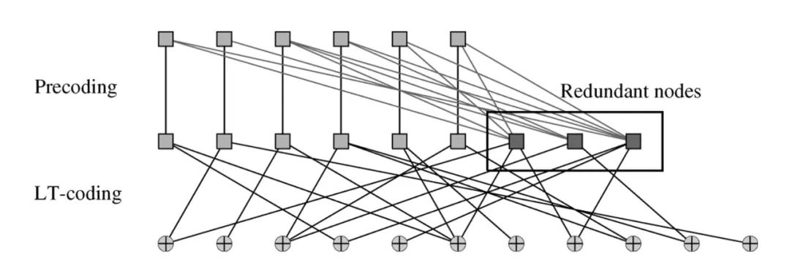
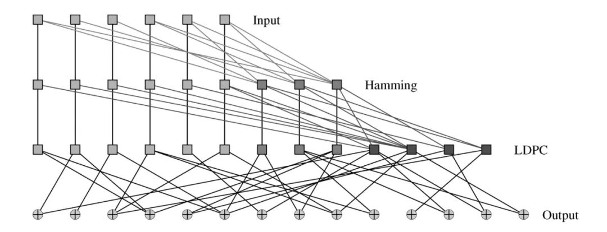

## 喷泉码简介

**喷泉码（Fountain Code）**是一种在无线通信、数据传输和网络编码领域中使用的错误纠正技术。它与传统的纠错码和编码方法有所不同，喷泉码被设计用于在不确定信道条件下的高效数据传输。

传统的纠错码（如海明码、RS 码等）通常需要在发送方对数据进行编码，接收方则使用相同的编码进行解码和纠错。这些方法一般具有固定的码率（Code Rate），即针对一定长度的原始数据，编码后的长度是固定的，这些方法在面对不稳定的信道或严重的信道丢失时可能效果不佳。相比之下，喷泉码通过在发送方生成随机的冗余数据，然后将其注入到原始数据中，以创造出一个“喷泉”流——相应的码率也也就不固定了。接收方可以从这个流中采样任意数量的数据包，并将它们合并以恢复原始数据。

喷泉码的一种常见应用是在无线传感器网络中，其中网络节点之间的通信可能受到弱信号、干扰和多径传播等因素的影响。通过使用喷泉码，节点可以在较差的通信条件下实现可靠的数据传输。

喷泉码另外一个常用的场景是大量文件或者数据的广播，这种时候每位接受者的丢包率是不确定的，因此固定码率的编码就不适用，喷泉码却可以解决该场景下的问题——丢包率高的接受者多收一些包，丢包率少的接受者则少收一些包。

本文会介绍最常见的两种喷泉码实现，**LT 编码 和 Raptor 编码**。通过这两种编码的介绍和比较可以比较好的了解喷泉码的特性和基本的实现原理。

## LT 编码

LT 编码 是第一个被实现的具有实用价值的喷泉码，该编码在 2002 年被提出，实现记的基本原理也非常简单，即位运算中的 xor 操作。Xor 操作有如下的特性：

1. 两个相同的数据块 M，它们 Xor 的结果是 0。即 M ^ M = 0。
2. 对一块数据块 M，Xor 两次相同的数据块 N，最终结果仍然为 M。即 M ^ N ^ N = M。
3. 假设两个等长的数据块 M 和 N，M ^ N = L。那么 L ^ M = N 并且 L ^ N = M。

基于上述的特性，LT 编码的方式就可以描述为下列的步骤：

1. 对于长度为 N 的等宽数据块序列，随机选取一个 degree (d)，1 ≤ d ≤ N。
2. 从上述的数据块中选取随机 d 个数据块，将所有选取的数据块进行 xor 操作，最终得到一个编码的数据块。
3. 重复上述步骤 1 和 2，我们可以得到源源不断的编码数据块，好像“喷泉”一样水流不断。

编码过程很简单，唯一需要注意一下的问题是如何获得等款的数据块。如果总数长度不能够恰巧分成 N 等分，我们可以通过在后续加 padding 的方式来实现可以 N 等分。

解码相对比较复杂， 描述如下：

1. 已经接受过的重复的编码块丢弃。
2. 如果接收的数据块 d > 1, 将其和 所有已知和该编码块相关的 d = 1 的原始数据块进行 xor 操作，没操作一次 d 减一，如果知道最后 d > 1，则将结果暂存到队列中，否则将最终得到的原始数据块记录下来。
3. 每当发现一个新的 d = 1 的原始数据块，将该数据块和所有等待数据块中相关的数据块进行 xor 操作，以期待发现更多的 d = 1 的原始数据块。
4. 重复上述操作，直到所有的原始数据块被恢复出来。

该过程中的编码数据块一般还是会携带 metadata 信息，包含原始数据块的位置信息，例如告知该编码块由 第 1 和 第 3 个原始数据块 xor 而来。

LT 编码有其局限性，如果我们想保证编码块的数量 m 和原始数据块数量 k 非常接近，且恢复的成功率较高，那么平均每个编码块的生成需要进行 O(log(k)) 次 Xor 操作，需要消耗非常多的计算资源。相反，如果 degree 比较低，虽然每个编码块的操作数减少了，但是我们会需要更多的编码块来恢复出全部数据。

上述所说的局限性是受到信息论的约束的，无法进一步降低。那么我们有没有办法实现一种方式来降低计算资源的消耗呢？比如我们如果不需要恢复出全部的原始数据呢？受到这个思路的启发 Raptor 算法应运而生。

## Raptor 算法

Raptor 本质上是一类混合编码方式，结合 LT 编码和 LDPC 编码，同时获取了两种编码的好处。如下图所示：

Raptor 编码首先通过 LDPC 编码进行一次固定码率编码，形成一个中间编码层，然后再对该编码层进行 LT 编码，生成最终的编码数据块。当然 Raptor 编码也会有其他变种，不过原理大同小异，例如下图所示：

该编码具有**三层结构**，中间编码结果经过了两层固定码率编码，分别是 **Hamming 编码**和 **LDPC 编码**，然后再进行 **LT 编码**生成最终的编码块。

针对 Raptor 编码的解码方式一般有两种。第一种和编码方式完全相反，首先利用 LT 编码的解码方式恢复出部分的中间编码块，然后利用固定编码的解码方式恢复出原始的数据块。第二种方式则是将上述所有的多层编码方式都变成一种矩阵运算，针对收到数据后利用矩阵的高斯消元方法解出原始的数据块。

现有为人所熟知的 Raptor 编码主要有 RFC 5053 和 RFC 6330 RaptorQ 编码。两者的实现细节有诸多区别，但是内在的思路和上述的方法是类似的，有兴趣的读者可以进一步进行阅读和学习。

## 总结

喷泉码是一种无固定码率的编码方式，其中比较著名的有 LT 编码和 Raptor 编码。LT 编码算法简单，实现也简单，但是算法效率不高。Raptor 算法结合了 LT 编码和一些固定码率编码，利用混合编码的方式实现了高效的喷泉码。
