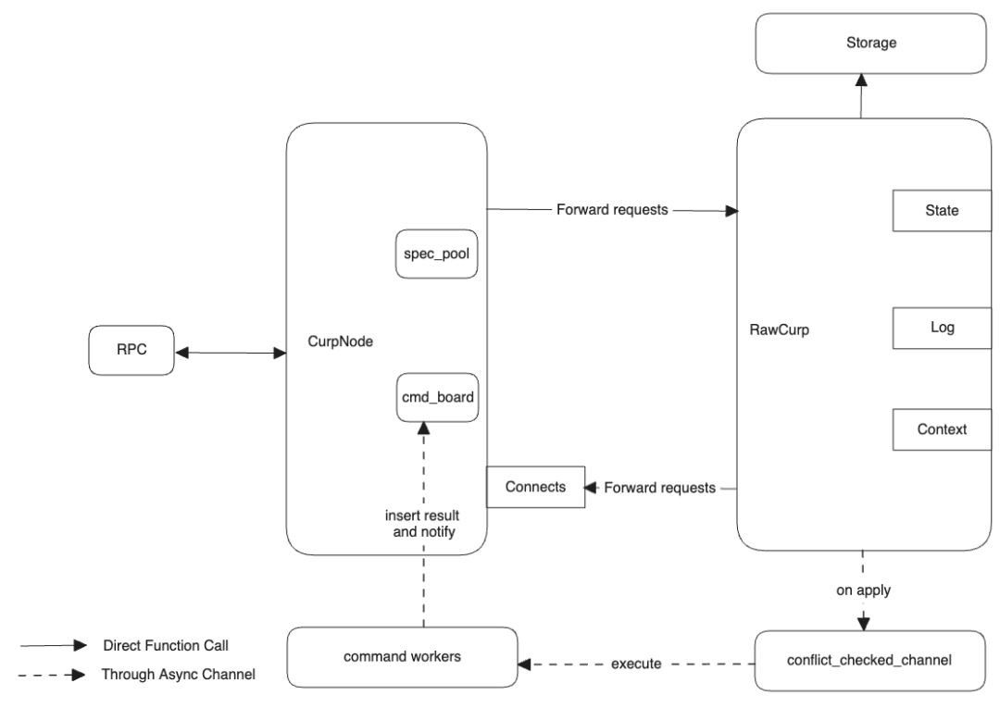
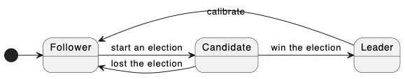
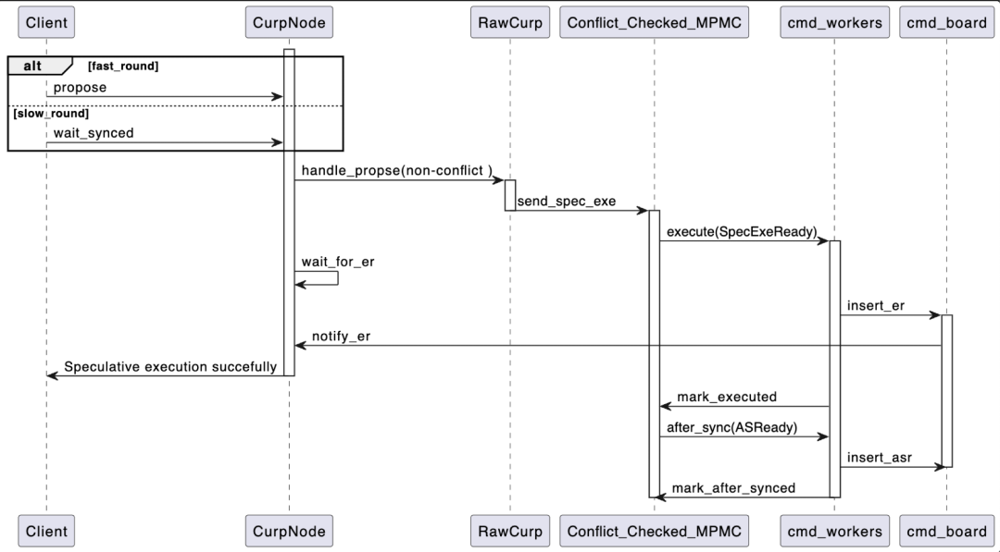

在上一篇文章 [Xline 源码解读（一） —— 初识 CURP 协议](</#/blogs/2023-07-13-Interpretation-of-Xline-source-code-(1)%E2%80%94%E2%80%94Introduction-to-CURP-protocol>)当中，我们对 CURP Protocol 进行了一个初步的介绍。接下来，就让我们话接上回，来一起看看 CURP Server 的内部实现吧。

## 01 Curp Crate 的源码组织

现在，让我们把目光集中在 curp 共识模块上。在 Xline 中，curp 模块是一个独立的 crate，其所有的源代码都保存在 curp 目录下，curp 目录中有以下组织：

- curp/proto: 保存 curp 协议相关的 rpc 接口与 message 的定义
- curp/tla+: 存放 curp 协议的 tla+ specification 相关内容
- curp/tests：集成测试
- curp/src：CURP 协议的主体实现代码，可分为：
  - client.rs：CURP client 端实现
  - cmd.rs：定义了与外部 mod 交互的关键 trait
  - log_entry.rs：状态机日志条目
  - rpc/：CURP server 相关 rpc 方法的实现
  - server/：CURP server 端的具体实现，包括了
- 关键数据结构定义：cmd_board.rs、spec_pool.rs
- 关键后台任务：cmd_worker/、gc.rs
- CURP server 前后端实现：curp_node.rs、raw_curp/
- storage/：实现了持久化层的接口定义，用来和存储层交互

## 02 Curp Server 的架构与任务切分

在了解了 CurpServer 所提供的 rpc 服务和相应的 trait 之后，我们来看看 Curp Server 的架构与启动流程。整个 Curp Server 架构如下图示：



从架构上分，我们可以将整个 Curp Server 划分为前端 CurpNode 以及后端 RawCurp。之所以是这样的设计，其核心原因在于对同步异步代码的分割。对于 Rust 的异步代码实现而言，有两个通电：

- 对于 tokio 所 spawn 出来的 task 而言，由于编译器本身并不知道这个 task 究竟会运行多久，因此需要强制要求所有 task 其生命周期参数都必须满足 ‘static，这种限制往往需要我们对其某些引用数据结构执行 clone 操作
- Non-Send 的变量，例如 MutexGuard, 不允许跨越 .await 语句。在这种情况下，如果同步代码与异步代码混合在一起，就会导致我们需要在 await 之前，手动地去以某种形式（代码块或者显示的 drop ）来释放这个 MutexGuard，这就造成了代码结构上的一些嵌套，增加阅读负担。而通过 CurpNode 和 RawCurp 的前后分离，由 CurpNode 来处理同步请求，而让 RawCurp 处理异步请求，能够更加清晰地划分代码边界，提高代码的可读性。

关于如何优雅组织 Rust 项目中的异步代码，可以参考另一篇文章: [如何优雅地组织 Rust 项目中的异步代码](/#/blogs/2023-04-20-How-to-elegantly-organize-asynchronous-code-in-a-Rust-project)

在 CurpNode 结构当中，包含了 spec_pool 和 cmd_board 两个结构。其中 spec_pool 对应了 CURP 论文中的 witness 结构，其作用是保存那些在 fast path 当中执行的命令，而 cmd_board 则是用来保存命令的执行结果。CurpNode 可以向 cmd_board 中注册一个监听器，当后端的 RawCurp 异步执行完命令后，便会将命令的执行结果插入到 cmd_board 中，并通过监听器通知 CurpNode 向用户返回命令执行结果。而当 RawCurp 接收到 Curp Node 的请求时，会将命令插入到冲突检测队列 —— conflict_checked_channel 当中。顾名思义，conflict_checked_channel 本质上是一个 mpmc channel，能够并发地接受来自 CurpNode 的 cmd，并动态地维护不同的 cmd 之间的冲突关系，以确保 command worker 从 channel 拿到的命令永远都会与当前执行的命令冲突。而 command worker 则是命令的执行实体。conflict_checked_channel 只关心不同命令之间的关系，而 command worker 则只关心命令如何执行。当 command worker 执行完命令并获得执行结果后，它会将执行的结果插入到 cmd_board 中，并触发监听器，通知 CurpNode 命令已经执行完毕。

## 03 Curp Server 如何与业务 Server 交互

从前面的架构图当中我们可以看出， Curp 共识模块提供了一个 CurpServer，用于对外提供 rpc 服务。在 Xline 中，业务 Server 会通过 rpc 调用向 CurpServer 发起请求，而 CurpServer 则会在请求处理完毕后，通过相应的 trait 通知业务 Server。

### 服务的定义

那么，让我们先来看看 CurpServer 都定义了哪些的服务:

```
service Protocol {
    rpc Propose (ProposeRequest) returns (ProposeResponse);
    rpc WaitSynced (WaitSyncedRequest) returns (WaitSyncedResponse);
    rpc AppendEntries (AppendEntriesRequest) returns (AppendEntriesResponse);
    rpc Vote (VoteRequest) returns (VoteResponse);
    rpc FetchLeader (FetchLeaderRequest) returns (FetchLeaderResponse);
    rpc InstallSnapshot (stream InstallSnapshotRequest) returns (InstallSnapshotResponse);
}
```

这些服务的作用如下：

- Propose：用来向 Curp 集群发起一次提案请求
- WaitSynced：等待 Curp 集群完成 after sync 阶段的请求
- AppendEntries：向 Curp 集群发起追加状态机日志的请求
- Vote：当一个 Curp Server 发起选举后，它会将自身的角色转变为 Candidate，并调用此接口向其他的 Curp Server 发送投票请求，当获得过半数成功响应后则变成 leader，否则退回 follower
- FetchLeader：获取当前 Curp 集群的 leader 节点
- InstallSnapshot：当一个 Curp Server 的状态机日志落后 leader 太多时，可以通过此接口向 leader 请求一个快照，用来追赶 leader 的状态机日志

其中，除了 Propose 和 FetchLeader 以外的 Service 则主要用于 CurpServer 内部，而业务 Server 则通过 FetchLeader 获取集群当前的 leader 信息，通过 Propose 向 Curp 集群发起提案。

### 接口的定义

接下来，让我们来看看 Curp 模块都定义了哪些 trait 呢？从设计目的来看，Curp 中定义的 trait 一共可以分为两类：

1. 与命令相关：当 Curp 模块针对特定的命令达成共识后，需要通过相关的 trait 来通知业务 Server 执行相应的命令
2. 与角色相关：当 Curp 节点的 Role 发生变化时，需要通过相关的 trait 来通知对应的业务组件，例如 Lessor，Compactor 等。

#### 命令相关的 Trait

Curp 模块中定义的命令相关的 trait 主要包括了 Command， ConflictCheck 和 CommandExecutor 三个。让我们先来看看 Command 和 ConflictCheck 这两个 trait，它们的定义如下：

```rust
pub trait ConflictCheck {
    fn is_conflict(&self, other: &Self) -> bool;
}

#[async_trait]
pub trait Command{
    /// omit some code...

    #[inline]
    fn prepare<E>(&self, e: &E, index: LogIndex) -> Result<Self::PR, E::Error>
    where
        E: CommandExecutor<Self> + Send + Sync,
    {
        <E as CommandExecutor<Self>>::prepare(e, self, index)
    }

    #[inline]
    async fn execute<E>(&self, e: &E, index: LogIndex) -> Result<Self::ER, E::Error>
    where
        E: CommandExecutor<Self> + Send + Sync,
    {
        <E as CommandExecutor<Self>>::execute(e, self, index).await
    }

    #[inline]
    async fn after_sync<E>(
        &self,
        e: &E,
        index: LogIndex,
        prepare_res: Self::PR,
    ) -> Result<Self::ASR, E::Error>
    where
        E: CommandExecutor<Self> + Send + Sync,
    {
        <E as CommandExecutor<Self>>::after_sync(e, self, index, prepare_res).await
    }
}
```

Command trait 描述了一个可以被业务 Server 执行的命令实体，而 ConflictCheck 用来检测多个命令之间是否存在冲突，冲突的判定条件则为两个不同的命令的 key 之间是否存在交集。

Command 定义了 4 个关联类型(K, PR, ER 和 ASR)，其中，K 代表了命令所对应的 Key，而 ER 和 ASR 则对应了 Curp 协议中命令在 execute 阶段和 after_sync 阶段的执行结果。那么 PR 又代表了什么呢？这里，PR 代表的是命令 在 prepare 阶段的执行结果。读者可能会好奇，curp 协议中只定义了命令的两个阶段，并没有关于 prepare 阶段的说明，这里又为什么需要 prepare 阶段呢？

为了说明这个问题，让我们来看一个例子。由于 Xline 采用了 MVCC 机制对保存其中的 key-value pair 做了多版本管理，因此会为每个 key 分配相应的 revision。假设一个 client 向 Xline 先后发送了两个命令: PUT A=1 和 PUT B=1，记为 cmd1 和 cmd2，预期对应的 revision 分别为 3 和 4。由于这两个命令之间不存在冲突，Xline 可以对这两个命令并发乱序执行。命令的开始执行顺序虽然为先 PUT A = 1 再执行 PUT B=1，但是它们之间结束的顺序是不确定的，因此 after_sync 执行顺序可能先执行 cmd2 再执行 cmd1。又因为 revision 需要等到 after sync 阶段才能确定，因此就会出现 cmd2 的 revision 为 3，cmd1 的 revision 为 4 的情况，这就产生了错误。
为了解决这个问题，我们为 Command 引入了一个 prepare 阶段。Curp 保证了 prepare 阶段的执行是串行化的，并且总是执行在 execute 阶段之前。Xline 将 revision 的计算从 after_sync 阶段提前到了 prepare 阶段，既保证了 revision 的产生顺序与用户请求到达 Xline 的顺序一致，同时又保证了互不冲突的命令之间能够并发乱序执行，不影响性能。

接下来，我们再来看看 CommandExecutor trait 的定义：

```rust
#[async_trait]
pub trait CommandExecutor<C: Command>{
    fn prepare(&self, cmd: &C, index: LogIndex) -> Result<C::PR>;

    async fn execute(&self, cmd: &C, index: LogIndex) -> Result<C::ER>;

    async fn after_sync(
        &self,
        cmd: &C,
        index: LogIndex,
        prepare_res: C::PR,
    ) -> Result<C::ASR>;

    /// omit some code ...
}
```

CommandExecutor 则描述了命令的执行实体，Curp 模块通过它通知业务 Server 执行相关的命令。

这三个 trait 之间的关系是：ConflictCheck 描述的是不同命令之间的关系，Curp Server 并不关心命令如何执行，它只关心命令之间是否冲突，而 CommandExecutor 则描述了命令怎么执行，并不关心命令之间的关系，它们分离了各自的关注点。它们之间的依赖关系为 CommandExecutor <--> Command --> ConflictCheck

#### 角色变化的 Trait

Curp 中定义的角色相关的 trait 便是 RoleChange， 其定义如下：

```rust
/// Callback when the leadership changes
pub trait RoleChange {
    fn on_election_win(&self);

    fn on_calibrate(&self);
}
```

因为，Xline 的 Curp 模块中，协议的后端采用的是 Raft 协议。这里所谓的后端，是指当冲突发生时，Curp 模块会自动 fallback 到 Raft 协议，此情况下达成共识所产生的 latency 和 Raft 协议相同，均为 2 RTT。我们知道，在原始的 Raft 论文中，为 Raft 集群中的节点定义了以下三种角色：Leader、Follower 和 Candidate，他们之间的转换关系如下：



初始时刻，一个节点为 Follwer，在 election_timeout 时间内没有收到来自当前集群 Leader 的任何消息，包括 heartbeat 或者 AppendEntries 请求，则会发起 election 操作，将自身转变为 Candidate。当赢得选举时，则该节点由 Candidate 转变为 Leader，若失败则回到 Follower。现在假设集群出现了网络分区，则可能会出现两个 Leader，当网络分区消失后，term 较小的 Leader 在接收到来自 term 较大的 Leader 的任何消息时，会自动进行 calibrate，更新自己的 term 后转变自身角色为 Follower。

那为什么 Xline 需要定义 RoleChange 这样的 trait 呢？这是在 Xline 的一些业务场景中，一些组件，例如 LeaseServer 和 LeaseStore 在 Leader 节点和非 Leader 节点上所执行的操作是不同的，因此需要在节点角色发生变化时通知到对应的组件。目前，由于 Lease 相关组件只区分 Leader 和非 Leader 节点，因此，定义的 callback 只覆盖了 election_win 和 calibrate 两种事件。未来如果业务存在需要更细粒度的区分节点角色的需求，则会增加更多的 callback 方法来进行需求覆盖。

## 04 Curp Server 是如何处理请求的

现在让我们假设有两个 PutRequest ，分别为 PUT A=1 和 PUT A = 2，我们来看看 curp server 是如何处理这两个冲突请求的。正如前面所提到的，用户需要先通过 Curp Client 的 propose 方法，向 Curp Server 发起一个提案，我们先来看看 propose 的伪代码实现。

```rust
/// Propose the request to servers
#[inline]
pub async fn propose(&self, cmd: C) -> Result<C::ER, ProposeError> {
    // create two futures
    let fast_round = self.fast_round(cmd);
    let slow_round = self.slow_round(cmd);

    // Wait for the fast and slow round at the same time
    match which_one_complete_first(fast_round, slow_round).await {
        fast_round returns fast_result => {
            let (fast_er, success) = fast_result?;
            if success {
                Ok(fast_er.unwrap())
            } else {
                let (_asr, er) = wait for slow_round to finish;
                Ok(er)
            }
        }
       slow_round returns slow_result => match slow_result {
            Ok((_asr, er)) => Ok(er),
            Err(e) => {
                if let Ok((Some(er), true)) = wait for fast_round to finish {
                    return Ok(er);
                }
                Err(e)
            }
        },
    }
}
```

如代码所示，当 Client 调用 propose 时，会同时启动两个不同的 future，分别是 fast_round 和 slow_round ，对应了 Curp 协议中的 fast path 和 slow path，并等待其中的某一个 future 完成。显然，当第一个请求到来时是不会和其他请求冲突的，因此可以想象，这个请求能够在 fast round 过程当中被处理完毕。我们先来看看 fast_round 的实现。

### Curp 共识流程 —— Fast Round

fast_round 的代码定义在 curp/src/client 中，对应了 Curp 协议中的前端过程。

```rust
/// The fast round of Curp protocol
/// It broadcasts the requests to all the curp servers.
async fn fast_round(
    &self,
    cmd_arc: Arc<C>,
) -> Result<(Option<<C as Command>::ER>, bool), ProposeError> {
    let request = create a new ProposeRequest;
    let mut rpcs = broadcast request to each node and put responses into a stream;

    let mut ok_cnt: usize = 0;
    let mut execute_result: Option<C::ER> = None;
    let superquorum = superquorum(self.connects.len());

    while let Some(resp_result) = rpcs.next().await {
        let resp = match resp_result {
            Ok(resp) => resp.into_inner(),
            Err(e) => {
                warn!("Propose error: {}", e);
                continue;
            }
        };

        update_state(resp.term, resp.leader_id);

        resp.map_or_else::<C, _, _, _>(
            |er| {
                if let Some(er) = er {
                    execute_result = Some(er);
                }
                ok_cnt += 1;
                Ok(())
            },
            |err| {
                if let ProposeError::ExecutionError(_) = err {
                    return Err(err);
                }
                Ok(())
            },
        )??;
        if (ok_cnt >= superquorum) && execute_result.is_some() {
            return Ok((execute_result, true));
        }
    }
    Ok((execute_result, false))
}
```

总体上来讲，fast_round 逻辑可以分为三步：

1. 将 Command 包装成对应的 ProposeRequest；
2. 将 ProposeRequest 广播给 Curp 集群中的所有节点；
3. 统计结果，如果当前 Command 与其他命令没有发生冲突，则会得到执行成功的结果。当接收到的成功的 ProposeResponse 的数量超过 super quorum （约集群节点数的 3/4 左右）的数量时，这认为命令执行成功，否则失败。

有些读者可能就要发问了，同样一个节点个数为 2f + 1 的分布式集群中， 为什么像 Raft 或者 Paxos 中达成共识只需要 f+1 个节点返回成功响应， 而 Curp 在 fast path 路径中却需要超过 f + f / 2 + 1 个节点返回成功响应呢？其中 f 为集群的故障容忍度。为了说明这个问题，不妨让我们来看看，如果 Curp 协议也采用 f+1 为 fast path 成功的判断依据，那么会发生什么样的问题？

假设现在 Client_A 向 2f + 1 个节点广播了 ProposeRequest（标记为 A） 并接收到了 f + 1 个成功响应，则其中必定有一个节点为 leader，而剩下的 f 个节点为 follower。假设，现在包含 leader 在内的 f 个节点 crash 了，并且这 f 个节点中都包含了 A 请求，则剩下的 f+1 个节点中仅有一个 follower 在内存的 spec_pool 保存了 A 请求。接着，Client 向集群中的所有节点广播了 ProposeRequest(标记为 B，并且 B 与 A 冲突)。由于每个节点均通过自身内存中的 spec_pool 来判断新来的请求是否与旧的 speculatively executed 请求冲突，因此，尽管 Client_B 不会获得请求执行成功的结果，但是 B 请求仍然会保存在剩下的 节点的 f 个节点中。假设此时 leader 节点恢复，在加载完持久化的状态机日志后，需要 replay 所有节点上保存在 spec_pool 上的全部请求来恢复状态机，我们将这个过程称为 recover。显然，原来先被执行的 A 请求在当前的集群中反而成为了少数派（1 个节点），而没有被成功执行的 B 请求却摇身一变成了多数派（f 个节点），这会导致 leader recover 过程出错。

而当 Curp 协议也采用 f + f / 2 + 1 为 fast path 成功的判断依据时，即便包含 A 请求的 f 个节点全部 crash，则至少在剩下的 f + 1 个节点中依然有超过半数 f / 2 + 1 个节点保留了该请求，因此保证了不会出现后来的冲突请求在数量上压过了原来成功执行的请求的情况。

现在，让我们回到前面的例子中，由于 CurpServer 在处理请求 PUT A=1 时并未发生冲突，因此在 fast_round 能够顺利完成。对于 Leader 阶段而言，请求会经过 CurpNode，到 RawCurp，到冲突检测队列 Conflict_Checked_MPMC 中，并最后交由 cmd_worker 来执行。当 cmd_worker 执行完 PUT A=1 后，会将对应的结果插入到 cmd_board 中，并通知 CurpNode 向 Client 返回命令已执行的响应。下图为 fast_round 过程所对应的时序图：



### Curp 共识流程 —— Slow Round

当 Client 向 Curp Server 发送 PUT A=2 的请求时，由前面的 propose 方法可知，Client 会同时启动 fast_round 和 slow_round 两个 future。显然，由于 PUT A=2 和前一个请求 PUT A=1 明显冲突，因此 fast_round 无法成功执行，进而会等待 slow_round 的执行完毕。slow_round 的代码定义在 curp/src/client 中，对应了 Curp 协议中的后端过程，即 wait_synced 过程。

```rust
/// The slow round of Curp protocol
async fn slow_round(
    &self,
    cmd: Arc<C>,
) -> Result<(<C as Command>::ASR, <C as Command>::ER), ProposeError> {
    loop {
        let leader_id = self.get_leader_id().await;

        let resp = match call wait_synced from leader node {
            Ok(resp) => resp.into_inner(),
            Err(e) => {
                wait for retry_timeout to retry propose again;
                continue;
            }
        };

        match resp? {
            SyncResult::Success { er, asr } => {
                return Ok((asr, er));
            }
            SyncResult::Error(Redirect(new_leader, term)) => {
                let new_leader = new_leader.and_then(|id| {
                        update_state(new_leader, term)
                    })
                });
                self.resend_propose(Arc::clone(&cmd), new_leader).await?; // resend the propose to the new leader
            }
            SyncResult::Error(Timeout) => {
                return Err(ProposeError::SyncedError("wait sync timeout".to_owned()));
            }
            SyncResult::Error(e) => {
                return Err(ProposeError::SyncedError(format!("{e:?}")));
            }
        }
    }
}
```

总体上来讲，slow_round 逻辑也可以分为两步：

1. 获得集群当前的 leader，并向其发送一个 WaitSyncedRequest
2. 等待 leader 返回 WaitSyncedRequest 的执行结果，失败则等待 retry_timeout 后重试。

由于在 Client 的 propose 方法中，由于 fast_round 在判断新到的请求与之前 speculatively execute 的请求存在冲突，因此 RawCurp 会先将该 Command 保存到状态机日志当中，并向集群发起 AppendEntries 请求，完成后会向 Client 返回 ProposeError::KeyConflict 错误，进而等待 slow_round 的结束。当 Leader 向集群中的 Follower 完成了 AppendEntries 的操作后，便会执行 apply 操作，将日志应用到状态机上。也正是在这个过程中，leader 会将 Command 发送到冲突检测队列 Conflict_Checked_MPMC 中。只有当 cmd_worker 执行完所有和 PUT A=2 相冲突的命令后，才能从冲突检测队列中弹出 PUT A=2 这个命令来执行。与 fast_round 不同的是，在 slow_round 过程中，命令在执行完毕，并将执行结果保存到 cmd_board 中后，并不会直接返回，而是会将命令重新放回到冲突检测队列中，直到命令执行完 after_sync 操作后，并将对应的结果保存到 cmd_board 中后，才会向 CurpNode 返回，最后向 Client 返回对应的 ProposeResponse。整个 slow_round 操作的时序图如下：


## 05 Summary

在今天的文章中，我们讨论了 Xline 中 Curp Server 是如何与业务 Server 是如何进行交互的。其中业务 Server 通过 Curp Server 所定义好的 RPC 接口来向 Curp Server 发起请求。而 CurpServer 则通过 2 类不同的 trait 来通知业务 Server。其中命令相关的 Trait，如 Command,ConflictCheck 和 CommandExecutor 等，主要负责在命令达成共识后通知业务 Server，而角色变化的 Trait，如 RoleChange, 则主要是负责在集群节点角色变化后通知业务 Server。

Xline 中将 Curp Server 拆分成了前端 CurpNode 和后端 RawCurp 两个部分，其中 CurpNode 主要负责接收同步的 RPC 调用请求，并将请求转发给 RawCurp，由 RawCurp 来异步执行。RawCurp 将命令投递到 conflict_checked_channel 当中，并由 command worker 来负责执行，执行完毕后将执行结果插入到 cmd_board 中，并通知 CurpNode 返回执行结果。
