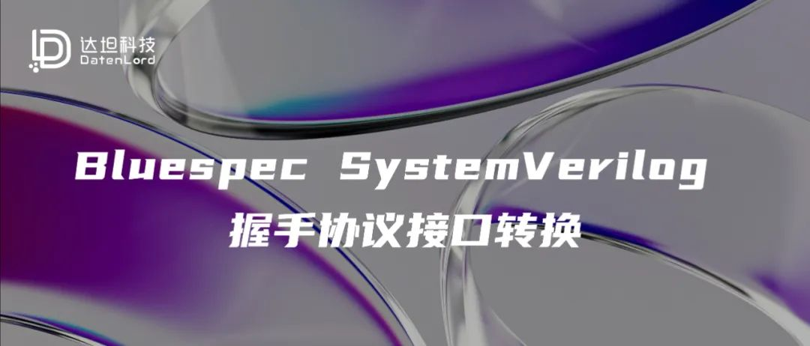
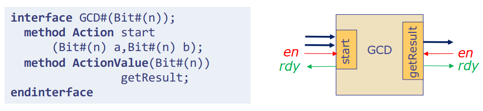
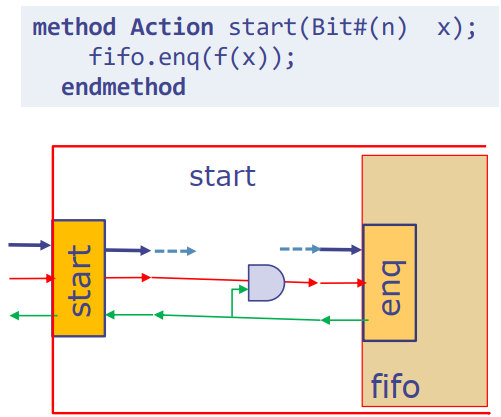
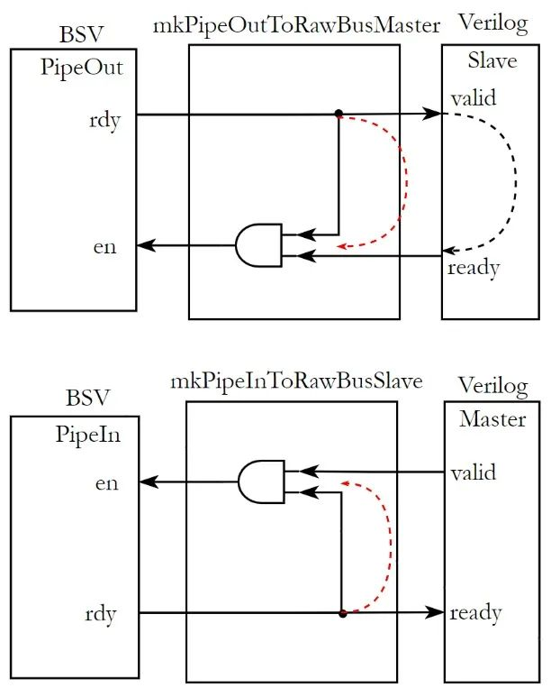
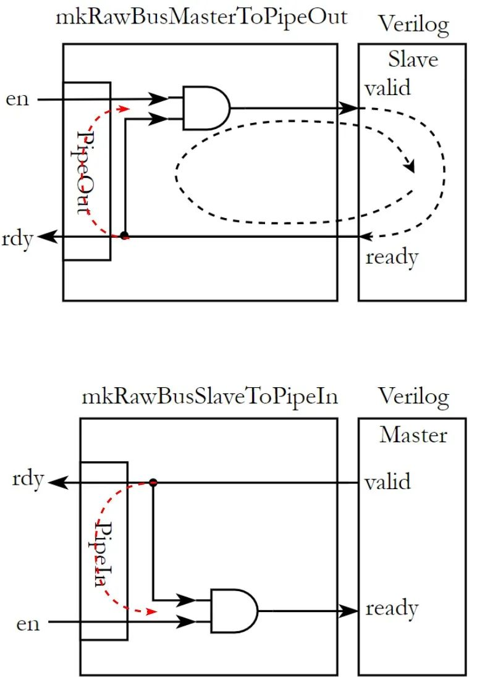

## 引言

由于接口控制信号上的差异，要实现 Bluespec SystemVerilog(BSV)生成的代码和外部 Verilog 代码之间的正确交互是一件比较麻烦同时容易出错的事情。在 BSV 中, 模块之间的交互都是基于 Action 或 ActionValue 这两类 method 完成。下图展示了使用 BSV 设计的某一模块的接口定义及其实际生成的硬件端口。由图可见，除了被显式地定义为函数输入参数或返回类型的数据信号外，每个 method 都隐含着一对控制信号，即 en 和 rdy。



其中，rdy 信号指示该方法已经准备好被调用，而当外部模块调用该方法时会拉高对应的 en 信号。en-rdy 控制信号和 AXI 总线中 valid-ready 信号的作用类似，这两对信号都保证了当通信双方都准备好时才能完成一拍数据的传输。虽然完成的功能相同，但这两对信号在具体的实现机制上仍存在一定差异:

首先，en-rdy 和 valid-ready 并不是一一对应的关系。对于某个模块，en 永远是输入信号，而 rdy 永远是输出信号。而在 valid-ready 握手协议中，master 端输出 valid 接收 ready，而 slave 端输出 ready 接收 valid。因此，这两对信号有如下表所示的对应关系：

# Todo

其次，是控制信号之间依赖关系的差异。在 BSV 中，method 的 en 信号依赖于 rdy 信号，具体来说一个 method 只有在其准备好(rdy 为高)时才能被调用。下图展示了这一依赖关系在硬件上的具体实现，即输入的 en 信号需要和输出的 rdy 信号相与后传递给下一级。而在 AXI 协议中，为了避免产生死锁(通信双方都等待对方准备好后再响应)，其明确规定：master 输出的 valid 信号不能依赖于 ready 信号，即不能等待 slave 侧准备好后再发起请求；相反，slave 端输出的 ready 信号可以依赖于输入的 valid，即可以等待 master 发起请求后再作响应。



在大部分使用 Verilog 实现的电路中，我们都会基于 valid-ready 握手协议实现模块之间的交互。如果在一个项目中，我们需要将 BSV 生成的代码和基于 Verilog 的设计进行交互，通常还需要实现一个转换模块，来处理 valid-ready 和 en-rdy 控制信号之间的交互。

除了控制信号的差异外，BSV 生成的 Verilog 代码还存在如下问题：如果在 BSV 中将多个相关的输入/输出信号封装在一个结构体，那么在生成的 Verilog 接口中所有封装在一起的字段都会合并成单个信号。例如，在 BSV 中使用 AXI-Stream 总线时，为了方便信号传递，通常会将总线上的信号封装成一个结构体后在方法之间传递:

```rust
typedef struct {
    Bit#(TMul#(keepWidth, 8)) tData;
    Bit#(keepWidth) tKeep;
    Bit#(usrWidth) tUser;
    Bool tLast;
} AxiStream#(numeric type keepWidth, numeric type usrWidth) deriving(Bits);

interface AxiStreamExample;
    interface Put#(AxiStream#(8, 1)) axiStreamSlave;
    interface Get#(AxiStream#(8, 1)) axiStreamMaster;
endinterface
```

而在生成的 Verilog 代码中，结构体里定义的所有字段都合并到了**axiStreamSlave_put/axiStreamMaster_get**信号里:

```rust
module mkAxiStreamExample(
    CLK,
    RST_N,

    axiStreamSlave_put,
    EN_axiStreamSlave_put,
    RDY_axiStreamSlave_put,

    EN_axiStreamMaster_get,
    axiStreamMaster_get,
    RDY_axiStreamMaster_get
);
```

如果我们要将上述代码与其他 Verilog 模块交互，需要添加一个额外的模块对生成的 mkAxiStreamExample 进行封装。该模块需要完成两件事：

1）将合并的信号解析成每个独立的信号，

2）将 en-rdy 转换为 valid-ready 握手协议。

以 Master 端信号的封装为例，具体的实现代码如下：

```rust
module mkAxiStreamExampleWrapper(
    input clk,
    input reset_n,

    output m_axis_tvalid,
    input  m_axis_tready,
    output m_axis_tlast,
    output m_axis_tuser,
    output [63:0] m_axis_tdata,
    output [ 7:0] m_axis_tkeep,
);

mkAxiStreamExample axiStreamExampleInst (
    .CLK   (    clk),
    .RST_N (reset_n),

    .RDY_axiStreamMaster_get (m_axis_tvalid),
    .EN_axiStreamMaster_get  (m_axis_tvalid & m_axis_tready),
    .axiStreamMaster_get (
        {m_axis_tdata, m_axis_tkeep, m_axis_tuser, m_axis_tlast}
     )
 );
endmodule
```

虽然上面展示的 Verilog 封装模块可以保证模块间正确的交互，但仍存在一些缺陷。首先，解析打包信号的方式与 BSV 中结构体的定义相关，如果结构的内容发生更改，封装模块解析出的结果就可能出错。其次，手动地处理 en-rdy 和 valid-ready 信号对之间的转换也容易出错。这些问题都降低了 BSV 项目的可维护性。

为了方便 BSV 和 Verilog 之间的交互，我们实现了  
blue-wrapper 项目并提供了等同于上述 Verilog 封装的 BSV 实现，使得经过封装的 BSV 模块所生成的代码能够直接和其他 Verilog 模块进行交互。下文将介绍  
blue-wrapper 的具体实现及其使用方式，主要包括三部分内容:

- **PipeOut/PipeIn**接口的定义，对应代码实现见  
  src/SemiFifo.bsv

- 基于**PipeOut/PipeIn**和**Get/Put**接口实现握手控制信号转换, 详细代码实现可见  
  src/BusConversion.bsv;

- 在**控制信号转换**的基础上，还需要对完成对数据信号的解析，blue-wrapper 中分别提供了对  
  AXI-Stream，  
  AXI4-Lite 和  
  AXI4-Full 等协议的支持;

下文将结合实际代码分别介绍这三部分的具体实现。

## PipeOut/PipeIn 接口

在基于 valid-ready 控制信号对的数据交互场景下，交互双方可分为 Master 和 Slave。其中，Master 端发起数据传输，可对应 BSV 中常用的**Get**接口，而 Slave 负责接收数据，因此可以对应 BSV 中的**Put**接口。除了**Get/Put**外，为了方便实现握手控制信号的转换，blue-wrapper 中还额外定义了**PipeOut/PipeIn**接口，这两个接口分别封装了**FIFOF**接口出队侧(deq)和入队(enq)侧的方法，具体定义如下:

```rust
interface PipeIn#(type dType);
    method Action enq(dType data);
    method Bool   notFull();
endinterface

interface PipeOut#(type dType);
    method dType  first();
    method Action deq();
    method Bool   notEmpty();
endinterface
```

从实现功能的角度上看，**PipeOut/PipeIn**和**Get/Put**接口类似，都可分别实现数据的输出/输入。但对于**Get/Put**接口，其**get/put**方法所隐含的**en-rdy**控制信号在 BSV 中是无法访问的。而对于**PipeOut/PipeIn**接口，其将**deq\*\***/enq**方法对应的**rdy**信号分别通过**notEmpty/notFull\*\*方法暴露出来，使得我们可以直接在 BSV 中对其进行访问，而这一点将极大地方便握手控制信号的转换。

## 握手控制信号转换

### 显式定义 valid-ready 信号

实现接口转换的第一步需要在 interface 中定义 valid 和 ready 信号对应的 method，一方面使得生成的 Verilog 代码直接包含 valid-ready 信号对，另一方面方便我们在 BSV 中操纵这两个信号实现握手协议转换。在 BSV 中，一个方法的返回值对应 Verilog 的输出端口，而方法的输入参数对应输入端口，基于该原则，valid-ready 协议的 Master/Slave 侧接口的 BSV 定义如下:

```rust
(* always_ready, always_enabled )
interface RawBusMaster#(type dType);
    ( result = "data" ) method dType  data;
    ( result = "valid"*) method Bool   valid;
    (* prefix = "" ) method Action ready(( port = "ready" ) Bool rdy);
endinterface

( always_ready, always_enabled )
interface RawBusSlave#(type dType);
    ( prefix = "" ) method Action validData(
        ( port = "valid"   ) Bool valid,
        ( port = "data"    ) dType data
    );
    ( result = "ready" *) method Bool ready;
endinterface
```

上述代码中，编译属性“always_ready”和“always_enabled”消除了每个 method 隐含的 en-rdy 控制信号对。同时，我们可以通过设置输出 method 的“result”属性和每个输入参数的“port”属性来指定生成的 Verilog 中每个端口的具体名称。

### en-rdy 和 valid-ready 之间的转换

在定义好包含 valid-ready 控制信号的 interface 后，下一步需要完成 en-rdy 到 valid-ready 握手控制信号的转换。blue-wrapper 项目分别提供了两种不同的转换思路：

1. 将需要封装的**PipeOut/PipeIn**接口作为参数传入转换模块供**valid/ready**信号对应的 method 调用;

2. 将**RawBusMaster/\*\***Slave**接口分别封装成**PipeIn/PipeOut\*\*接口供其他 BSV 模块调用;

基于第一种思路实现的转换模块包括: mkPipeOutToRawBusMaster/mkPipeInToRawBusSlave，以及 mkGetToRawBusMaster 和 mkPutToRawBusSlave。以 mkPipeOutToRawBusMaster 为例，该模块接收**PipeOut**接口作为输入参数，并返回**RawBusMaster**接口，其中各个 method 的实现思路和具体代码如下:

- **valid:**  
  对于 Master 端，其 valid 信号对应 BSV 中的 rdy 信号，而 PipeOut 接口通过 notEmpty 方法暴露出了 deq 方法对应的 rdy，因此 valid 方法直接返回 notEmpty 的值；

- **data:**  
  对应 PipeOut 接口的 first 方法；

- **ready:**  
  作为方法输入参数传递的 ready 信号对应 BSV 中的 en 控制信号，该值为真时需要调用 PipeOut 接口的 deq 方法。由于在 BSV 中调用任意 method，编译器都会自动保证上文提到的 en-rdy 的依赖关系，因此在调用 deq 方法时不需要额外检查其 rdy 信号来保证握手成功。

```rust
module mkPipeOutToRawBusMaster#(
    PipeOut#(dType) pipe
)(RawBusMaster#(dType));
    RWire#(dType) dataW <- mkRWire;
    Wire#(Bool) readyW <- mkBypassWire;

    rule passWire if (pipe.notEmpty);
        dataW.wset(pipe.first);
    endrule

    rule passReady if (readyW);
        pipe.deq;
    endrule

    method Bool valid = pipe.notEmpty;
    method dType data = fromMaybe(?, dataW.wget);
    method Action ready(Bool rdy);
        readyW <= rdy;
    endmethod
endmodule
```

对于 PipeIn 到 RawBusSlave 的转换，其实现的原理和 Master 端类似，具体代码如下:

```rust
module mkPipeInToRawBusSlave#(
    PipeIn#(dType) pipe
)(RawBusSlave#(dType));
    Wire#(Bool)  validW <- mkBypassWire;
    Wire#(dType) dataW <- mkBypassWire;

    rule passData if (validW);
        pipe.enq(dataW);
    endrule

    method Action validData(Bool valid, dType data);
        validW <= valid;
        dataW <= data;
    endmethod
    method Bool ready = pipe.notFull;
endmodule
```

对于**Get/Put**接口，由于在 BSV 中无法直接访问**get/put**方法的 rdy 信号，直接进行转换无法提取出 master 输出的 valid 信号以及 slave 输出的 ready 信号。因此，在 blue-wrapper 的实现中我们通过添加一个额外的 FIFOF 模块作为媒介，将 Get/Put 接口转换成 PipeOut/PipeIn 接口后，调用上面展示的两个模块实现控制信号的转换，以 Get 接口为例，具体的代码实现如下:

```rust
module mkGetToRawBusMaster#(
    Get#(dType) get
)(RawBusMaster#(dType));
    FIFOF#(dType) fifo <- mkFIFOF;

    mkConnection(get, toPut(fifo));
    let rawBus <- mkPipeOutToRawBusMaster(
        convertFifoToPipeOut(fifo)
    );
    return rawBus;
endmodule
```

第二种实现思路对应代码中的：**mkRawBusMasterToPut/mkRawBusMasterToGet**，以及**mkRawBusMasterToPipeIn/mkRawBusMasterToPipeOut**四个模块。这种转换方式分别用**PipeIn/PipeOut**或**Put/Get**接口封装**RawBusMaster/RawBusSlave**接口**。**对于其他 BSV 模块，可以通过**PipeIn/Put**接口将数据传入转换模块然后从**RawBusMaster**发送出去，同时可以通过**PipeOut/Get**接口获取从**RawBusSlave**上接收到的数据。这种实现方式和 BSV 提供的**BVI**接口类似。以 master 侧为例，具体的转换实现如下:

首先，我们需要定义**RawBusMasterToPipeIn**接口，其由两个子接口**RawBusMaster**和**PipeIn**组成，其中**PipeIn**用于封装**RawBusMaster**使其可供其他 BSV 模块调用。

对于**RawBusMaster**接口，其实现代码主要是在进行信号的传递, 从**validData**中取出 valid 和 data 方法的返回值，并将 ready 方法的输入参数传递给**readyW**。

对于**PipeIn**接口, **notFull**方法返回**readyW**的值，**enq**方法将传入的参数写入**validData。**同时为了保证握手成功，**enq**方法需要被**readyW**所守卫(guarded), 即当输入的 ready 信号为高时，才可调用 enq 方法传入数据。

```rust
interface RawBusMasterToPipeIn#(type dType);
    interface RawBusMaster#(dType) rawBus;
    interface PipeIn#(dType) pipe;
endinterface

module mkRawBusMasterToPipeIn(RawBusMasterToPipeIn#(dType));
    RWire#(dType) validData <- mkRWire;
    Wire#(Bool) readyW <- mkBypassWire;

    interface RawBusMaster rawBus;
        method Bool valid = isValid(validData.wget);
        method dType data = fromMaybe(?, validData.wget);
        method Action ready(Bool rdy);
            readyW <= rdy;
        endmethod
    endinterface

    interface PipeIn pipe;
        method Bool notFull = readyW;
        method Action enq(dType data) if (readyW);
            validData.wset(data);
        endmethod
    endinterface
endmodule
```

对于**Get/Put**接口，也可以使用上述方法对**RawBusSlave/RawBusMaster**接口进行封装，其实现的关键点都是要为 get 和 put 方法设置正确的守卫信号以保证握手成功。

### 死锁问题

为了避免 master 和 slave 之间互相等待而产生死锁，AXI 文档中规定 master 不能等待 slave 侧拉高 ready 后再输出有效的 valid 和 data，但允许 slave 侧在 master 拉高 valid 之后再置 ready 为高。在 BSV 中对于每个 method，en 只有在 rdy 信号拉高后才能拉高。由于 en-rdy 和 valid-ready 不同的依赖关系，在交互的过程中就有可能导致双方产生死锁。下文将主要针对上面提到的两种封装方法，分析其是否会引入死锁问题。

- 第一种封装方式相当于是在转换模块中调用传入的**PipeOut/PipeIn**接口的方法。在 BSV 中调用任何方法，编译器都会自动地为 en 添加对于 rdy 的依赖，具体的 en-rdy 和 valid-ready 间的交互可以由下图所示。其中，en-rdy 之间的依赖关系如红色虚线所示。当 Slave 侧为 Verilog 实现时，valid 和 ready 之间可能存在如黑色虚线所示的依赖关系。由图可知，这两种依赖关系同向因此不会产生死锁。



- 第二种封装方式类似于 BSV 提供的**BVI**接口，其将 Verilog 信号封装成 BSV 中的 method 供其他模块调用。同样的，对于这些 method，BSV 会给 en 信号添加对 rdy 的依赖，如下图红色虚线所示。而基于 Verilog 实现的 Slave 端口，其 valid-ready 之间可能存在如黑色虚线所示的依赖关系。由图可见，en-rdy 和 valid-ready 之间正好形成了一个死锁环路，即 master 端等待 ready 拉高后输出有效的 valid，而 slave 等待 master 输出有效 valid 后再拉高 ready。因此，在使用 mkRawBusMasterToPipeOut 转换模块时需要保证所对接的 slave 侧 Verilog 实现中不存在 ready 对 valid 的依赖。



## 信号解析

完成控制信号的转换后，我们已经实现了可生成 valid-ready 控制信号的**RawBusMaster#(dType)**和**RawBusSlave#(dType)**接口**。**但是，如果**dType**是用户定义的**struct**结构体，则生成的 Verilog 会将**struct**中的所有字段打包到一个信号中。因此，我们仍然需要在 BSV 中将结构体的每个字段解析为单独的信号，以生成直接可用的 Verilog 代码。blue-wrapper 分别提供了针对 AXI-Stream, AXI4-Lite 以及 AXI4-Full 三种总线协议的信号解析实现。以 Master 端的 AXI-Stream 接口为例，其信号解析代码如下:

```rust
(*always_ready, always_enabled*)
interface RawAxiStreamMaster#(numeric type dataWidth, numeric type usrWidth);
    (* result = "tvalid" *) method Bool tValid;
    (* result = "tdata"  *) method Bit#(dataWidth) tData;
    (* result = "tkeep"  *) method Bit#(keepWidth) tKeep;
    (* result = "tlast"  *) method Bool tLast;
    (* result = "tuser"  *) method Bit#(usrWidth) tUser;
    (* always_enabled, prefix = "" *)
    method Action tReady((* port="tready" *) Bool ready);
endinterface

module mkPipeOutToRawAxiStreamMaster#(
    PipeOut#(AxiStream#(dataWidth, usrWidth)) pipe
)(RawAxiStreamMaster#(dataWidth, usrWidth));

    let rawBus <- mkPipeOutToRawBusMaster(pipe);
    return convertRawBusToRawAxiStreamMaster(rawBus);

    interface RawAxiStreamMaster;
        method Bool tValid = rawBus.valid;
        method Bit#(dataWidth) tData = rawBus.data.tData;
        method Bit#(keepWidth) tKeep = rawBus.data.tKeep;
        method Bool tLast = rawBus.data.tLast;
        method Bit#(usrWidth) tUser = rawBus.data.tUser;
        method Action tReady(Bool rdy);
            rawBus.ready(rdy);
        endmethod
    endinterface
endmodule
```

除了使用 blue-wrapper 中提供的三种常用总线接口的转换模块外，用户也可以仿照上述代码为自定义的接口实现对应的转换模块，具体的实现步骤如下:

- 首先，需要实现自定义 Verilog 接口对应的 BSV 接口。其中，每个输出信号都需要独立定义成一个 method，每个输入信号都需定义成 Action 方法的一个输入参数;
- 使用使用上文的介绍的握手控制信号转换模块将**Get/Put**或**PipeOut/PipeIn**转换成**RawBusMaster/RawBusSlave**;
- 在得到**RawBusMaster/RawBusSlave**后将结构体中的字段和对应的 method 相连。

## 总结

对于 BSV 生成的硬件代码，其接口通常是基于 en-rdy 控制信号进行交互，而使用 Verilog 设计时，我们通常采用 valid-ready 信号对实现模块之间的交互。由于控制信号上的差异，将 BSV 生成的代码和 Verilog 设计进行交互通常需要额外的转换模块。针对该问题，blue-wrapper 项目为 BSV 代码实现了相应的封装模块，使得封装后生成的 Verilog 代码能够直接和外部的 Verilog 代码进行交互。本文主要介绍了 blue-wrapper 背后的实现原理，具体包括: 定义 PipeOut/PipeIn 接口以提取出 rdy 信号；两种不同的握手控制信号转换的思路；以及解析 struct 结构体为每个字段生成独立的信号等三部分内容。

## 相关链接

**Flute:**

https://github.com/bluespec/Flute/tree/master/src_Testbench/Fabrics/AXI4_Lite

**Blue-AXI:**

https://github.com/esa-tu-darmstadt/BlueAXI

**bsc-contrib:**

https://github.com/B-Lang-org/bsc-contrib/tree/main

欢迎大家关注和支持 blue-crc 项目，GitHub 仓库地址：

https://github.com/datenlord/blue-crc
