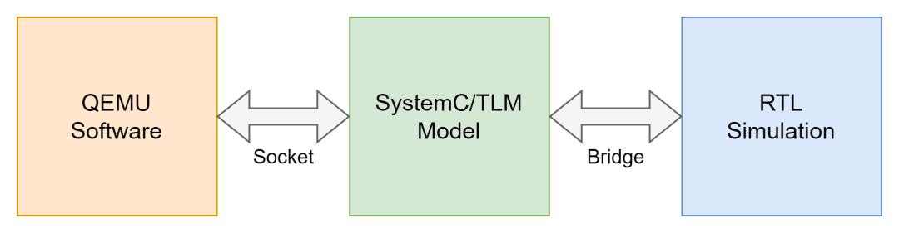
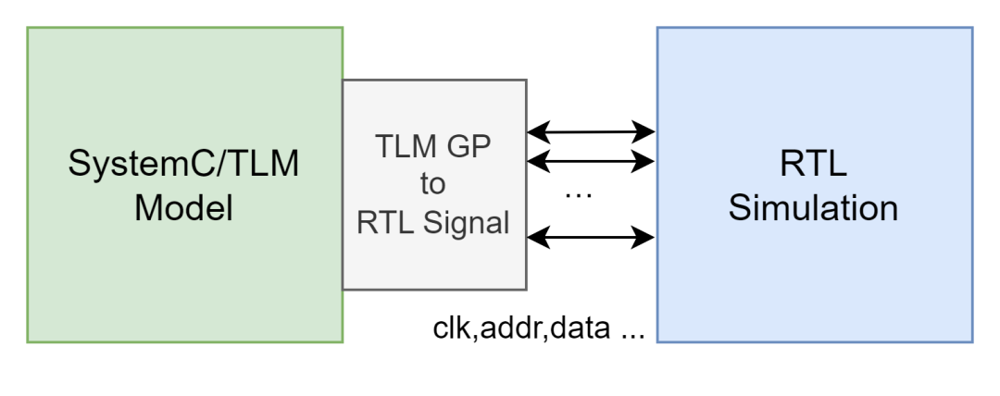

软硬件联合仿真在确保高效云解决方案的质量、降低风险、节省时间和成本方面发挥着关键作用。达坦科技致力于打通云间壁垒、实现数据高效跨云访问，为云上应用提供高性能安全存储支持。在研发过程中，软硬件联合仿真显得尤为重要。这一综合仿真方法有助于验证系统的一致性，分析和修复潜在故障，评估性能并优化资源分配。同时，它也用于评估系统的安全性，确保数据在跨云环境中得到充分的保护。我们将这一理论与实践心得集结成：**软硬件协同仿真系列**。本文是该系列的第一篇文章，着重介绍**原理及概述各部分的主要概念**。

## 为什么要仿真

在芯片设计领域，仿真验证是保证设计正确的关键步骤。芯片生产成本高昂，因此需要在生产前尽可能对其进行仿真验证以确保其功能和性能符合预期。另外，在芯片上运行的软件也需要与芯片同步进行设计和测试，以缩短整个系统的生产和迭代周期，因此其载体只能是仿真的芯片。

## 硬件仿真方法

### 软件仿真

传统的仿真方法包括基于软件的仿真和基于硬件的仿真。基于软件的仿真利用软件仿真电路逻辑。例如，QEMU 可以模拟真实 CPU 的指令执行，两者在执行同一条指令后寄存器发生同样的变化，运行在 CPU 上的软件不会分辨出其差别。这种使用高级语言编写的模拟硬件行为的软件一般也被用作硬件实现的参考模型，两者可交叉验证。

此外，描述硬件逻辑的 RTL（Register Transfer Level）代码也可以转化高级软件语言代码，并最终生成可执行的仿真程序。这赋予了设计者在不需要真实硬件的情况下快速验证硬件逻辑的能力。

### 硬件仿真

基于硬件的仿真则使用可编程的硬件平台来模拟硬件逻辑。常见的如 FPGA(Field Programmable Gate Array)板卡，其内部为可编程的硬件结构，允许设计者将电路逻辑烧录进去，成为一个接近真实芯片的硬件原型，可实时模拟并观察硬件逻辑的运行状态。

相比于基于软件的仿真，基于硬件的仿真速度更快，可以提供更接近真实硬件的性能，但在调试和修改时的灵活性较低。其能模拟的硬件规模受自身规模限制，仿真成本随规模上升速度也远高于软件方法。

## 软硬件协同仿真

软硬件协同仿真指同时模拟硬件和软件集成在一起的整个系统。其中硬件的仿真可能是在硬件仿真器中，或由软件模拟。软件模拟又可分为直接由 RTL 转译，或是另外开发的事务级参考模型，亦或是两者的结合。

例如，当我们仿真验证一块采用 PCIe 接口的网卡时，在使用软件仿真时，可以将 PCIe 部分的硬件逻辑由软件模型代替，将网卡的 RTL 代码转译为可执行程序进行仿真，再将两者结合后接入到运行网卡驱动程序的 QEMU 虚拟机中，即完成了整个系统的仿真。

以上例子中，PCIe 部分不是我们的验证重点，因此用事务级软件模型仿真。由于省略了对具体电路行为的仿真，提高了仿真抽象水平，软件模型相较由 RTL 转译的仿真程序执行速度更快。使用硬件仿真时，PCIe 部分逻辑可由硬核实现，网卡逻辑烧录在可编程门阵列中，以提高仿真速度，降低仿真器占用。QEMU 中的应用软件和驱动程序可不感知以上硬件仿真的具体实现。

软硬件协同仿真试图结合软件仿真和硬件仿真，使开发者可以同时验证和调试系统的软件和硬件部分。对硬件逻辑实现复杂的、非验证重点的部分使用事务级模型仿真，对性能有要求或需要重点验证的部分则采用基于硬件的仿真，亦可结合对成本和工期的要求进行配置。通过这种混合仿真的方式，设计者可以以较低的成本和较高的性能验证整个系统。

## 主要组成部分

软硬件协同仿真涉及多个关键组件和工具，其中最核心的有 QEMU、SystemC/TLM、RTL Simulation 和 Bridge。在此简要介绍一下组件的基本概念和它们之间的关系。

### QEMU

QEMU 是一个广泛应用的开源机器模拟器和虚拟化工具。QEMU 能够模拟整个系统级别的操作，如模拟一台计算机，包括硬件部件操作系统以及驱动等。其可以模拟任意硬件，或为硬件提供一个真实的软件运行环境。

### SystemC/TLM

SystemC 是用于系统级建模的开源 C++库，而 TLM（Transaction Level Modeling）是一个在 SystemC 环境下描述与仿真硬件行为的模型。相比于传统的 RTL 设计，TLM 能够更高层次地描述硬件行为，从而提供更快的仿真速度。使用 SystemC/TLM 构建的模型通常作为“胶水”连接 QEMU 和 RTL。例如，在上述网卡仿真例子中，PCIe 部分由一个事务级的 TLM 模型描述，两端分别连接软件和仿真的硬件。

### RTL Simulation

RTL 仿真可以基于软件或硬件进行。软件如 Verilator，一个开源的 Verilog 仿真器，它可以将 Verilog 代码转换为 C++模型，然后通过 C++进行快速仿真。硬件如 FPGA，其中包含可编程的硬件逻辑，可用于仿真硬件原型。

### Bridge

要将软件与硬件集成，还需要各类桥接器连接软硬件逻辑。例如 TLM 到 PCIe 等各类硬件接口到软件接口互联桥。这部分需要根据具体的软硬件平台开发，或使用开源项目 LibSystemCTLM-SoC 提供的常见接口转换桥。

下图展示了一种组件之间的连接关系。假设我们模拟一个 PCIe 设备（如网卡），QEMU 模拟了一台计算机，承载操作系统和设备驱动程序。TLM 模型和 RTL 仿真共同实现了设备逻辑，并通过 Socket 连接到 QEMU 中，表现为一个 PCIe 设备。



下图展示了 TLM 级仿真和 RTL 级仿真的桥接细节。其中 TLM GP（Generic Payload）指一个一般的总线读/写操作。Bridge 的作用就是将 TLM 事务级的操作转化为 RTL 级的信号。例如，TLM 的一个读事务可能会被转换为在 RTL 级别的一个地址信号、一个读使能信号等。由于 TLM 模型通常是与时间无关的或粗粒度的，所以在转换为 RTL 信号时，桥必须考虑时序问题。这可能涉及到模型之间的时间同步，以确保所有事务和信号都在正确的模拟时间内发生。



## 仿真案例

下面以一个例子介绍 SystemC/TLM 软件模型与仿真的硬件设备的对接流程和实现原理。

在 Xilinx 的 libsystemctlm-soc 仓库中包含一个 AXI4 从设备与 SystemC/TLM 模型交互的样例程序（example-rtl-axi4）。其中 axifull_dev_s00_AXI.v 是由 Xilinx IP Integrator 自动生成的 Verilog 模块，其功能是一块可通过 AXI4 总线读写的存储器。axifull_dev.v 对其进行了一层封装，并预留了用户增加额外逻辑的空间。以上即为硬件部分。

在 example-rtl-axi4.cc 中描述了 TLM 模型与 AXI 设备的连接和交互逻辑。主要包括将 axifull_dev 设备实例化为 DUT（Device Under Test），并通过软件生成的仿真测试激励，对硬件进行读写操作测试。

如下是 example-rtl-axi4.cc 部分代码。首先是通过 TrafficDesc transactions 定义了一组要在仿真环境中执行的事务，分别是写，读，以及期望读到的值。TrafficDesc 在此用于简化生成 TLM GP 的操作。激励生成器 (TLMTrafficGenerator tg) 根据 transactions 对事务的描述生成 TLM GP。再通过 TLM 到 AXI 的桥接器 (tlm2axi_bridge bridge) 被转换为 AXI 信号，最后由被测设备 (Vaxifull_dev dut) 处理。

```rust
TrafficDesc transactions(merge({
    // 写数据到地址8
    Write(8, DATA(0x1, 0x2, 0x3, 0x4)),
    // 读回并判断读到的是否是预期数据
    Read(8, 4),
    Expect(DATA(0x1, 0x2, 0x3, 0x4), 4)
}));

SC_MODULE(Top)
{
    sc_clock clk;
    sc_signal<bool> rst_n; // Active low.

    TLMTrafficGenerator tg;
    AXISignals<10, 128 > signals;
    tlm2axi_bridge<10, 128 > bridge;
    AXIProtocolChecker<10, 128 > checker;
    // dut即为RTL AXI设备
    Vaxifull_dev dut;

    Top(sc_module_name name) :
        clk("clk", sc_time(1, SC_US)),
        rst_n("rst_n"),
        tg("traffic_generator"),
        signals("signals"),
        bridge("bridge"),
        checker("checker", checker_config()),
        dut("dut")
    {
        // 添加预定义的事务
        tg.addTransfers(transactions);
        // 连接 TLM 套接字
        tg.socket.bind(bridge.tgt_socket);
        // 将桥与信号连接
        signals.connect(bridge);
        // 将DUT与信号连接，进而与桥连接
        dut.s00_axi_awvalid(signals.awvalid);
        ···
    }
};
```

TLM GP 定义了一个总线读写事务的抽象，包括读写命令、响应状态、地址和数据相关信息。以下截取了定义的一部分，完整代码可见 tlm_gp.h。当然，TLM GP 只包含最一般的信息，没有携带与 AXI 协议相关的一些具体概念。为了建模此类与硬件总线协议相关的具体行为，库中还包含了可选的拓展属性 Generic Attributes，用以更细致地建模，在此就不展开了。

```rust
class SC_API tlm_generic_payload {
···
private:
    /* --------------------------------------------------------------------- */
    /* Generic Payload attributes:                                           */
    /* --------------------------------------------------------------------- */
    /* - m_command         : Type of transaction. Three values supported:    */
    /*                       - TLM_WRITE_COMMAND                             */
    /*                       - TLM_READ_COMMAND                              */
    /*                       - TLM_IGNORE_COMMAND                            */
    /* - m_address         : Transaction base address (byte-addressing).     */
    /* - m_data            : When m_command = TLM_WRITE_COMMAND contains a   */
    /*                       pointer to the data to be written in the target.*/
    /*                       When m_command = TLM_READ_COMMAND contains a    */
    /*                       pointer where to copy the data read from the    */
    /*                       target.                                         */
    /* - m_length          : Total number of bytes of the transaction.       */
    /* - m_response_status : This attribute indicates whether an error has   */
    /*                       occurred during the transaction.                */
    sc_dt::uint64        m_address;
    tlm_command          m_command;
    unsigned char*       m_data;
    unsigned int         m_length;
    tlm_response_status  m_response_status;
    ···
}
```

从 TLM GP 到 AXI 信号的转换逻辑在 Bridge 中完成，具体实现在文件 tlm2axi_bridge.h 中。概括其内容，就是根据总线协议手册，将 TLM GP 对一个事务的抽象描述翻译为一个时间序列上硬件信号线上的高低电平。以写数据的实现为例，如下是截取的一个代码片段，描述的内容是将 wready 位置高，等待 wvalid 变为高，遇到 reset 信号则需要等到其被释放，然后是向一组 wdata 信号线填充数据位等等。

```rust
void write_data_phase()
{
    while (true) {
        ···
        wready.write(true);
        wait_abort_on_reset(wvalid);
        if (reset_asserted()) {
            wait_for_reset_release();
            continue;
        }
        ···
    }
    wt->FillData(wdata, wstrb);
    ···
}
```

在软件仿真环境中，如 SystemC 和 Verilator，软件定义的信号状态会周期性地更新同步到仿真的硬件描述语言中的信号线上。由于硬件被仿真器转译为软件，因此信号间的同步实质是软件变量间的赋值。

在硬件仿真环境下，软件定义的信号到硬件信号的映射需要更多桥接工作。例如当采用 PCIe 接口的 FPGA 进行仿真时，上述 DUT 运行在 FPGA 上，TLM 模型在 CPU 中运行，PCIe 作为通信媒介。TLM 模型需要通过 PCIe，间接控制 FPGA 上的 AXI 设备。这中间涉及到对 PCIe 设备的控制，以及 PCIe 到 AXI 的映射等桥接工作，libsystemctlm-soc 也封装了此硬件桥，如 tlm2axi_hw_bridge。在这些桥接工具库的帮助下，开发者可以方便地在纯软件和软硬件混合的仿真平台之间切换，而不用对程序做大幅修改。

以上例子只是简单地展示了 SystemC/TLM 部分与硬件的连接方法，并使用两个简单的事务对硬件进行了测试。在此基础上，我们可以使用软件高级语言如 C++模拟任意硬件行为，构建高抽象水平的模型，并通过 SystemC 提供的工具库赋予模型与硬件逻辑交互的能力。软件模型又可以通过 Socket 接入到 QEMU，由 QEMU 中的应用软件生成测试激励，以完成从应用、驱动、到设备的整个软硬件系统的集成测试。

## 总结

本文介绍了软硬件协同仿真的原因，概念和方法。通过结合软硬件仿真，TLM 级仿真和 RTL 级仿真的优势，降低仿真成本，提高仿真速度。使得开发者可以在流片前验证从硬件到软件的整个系统，确保软硬件设计的正确性和性能满足预期要求，缩短迭代周期。

软硬件协同仿真的技术链条长，涉及多个技术组件和工具，混合了不同抽象级别的软硬件系统。本文受篇幅所限，只概述了其主要组成部分，后续在“软硬件协同仿真”系列里将结合实例，为大家分享链路每个环节背后的实现原理。

## 参考资料

https://xilinx-wiki.atlassian.net/wiki/spaces/A/pages/862421112/Co-simulation  
https://github.com/Xilinx/libsystemctlm-soc/tree/master  
https://github.com/Xilinx/pcie-model/tree/master
