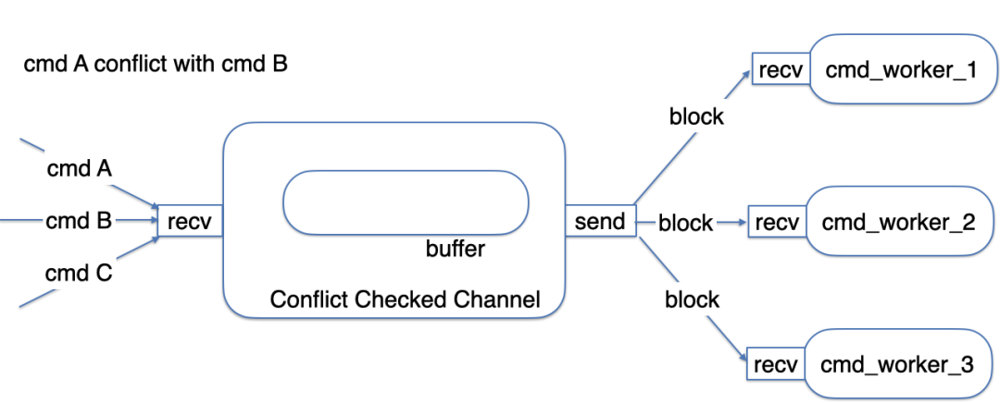
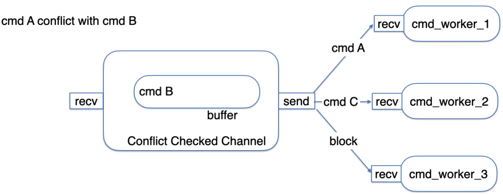
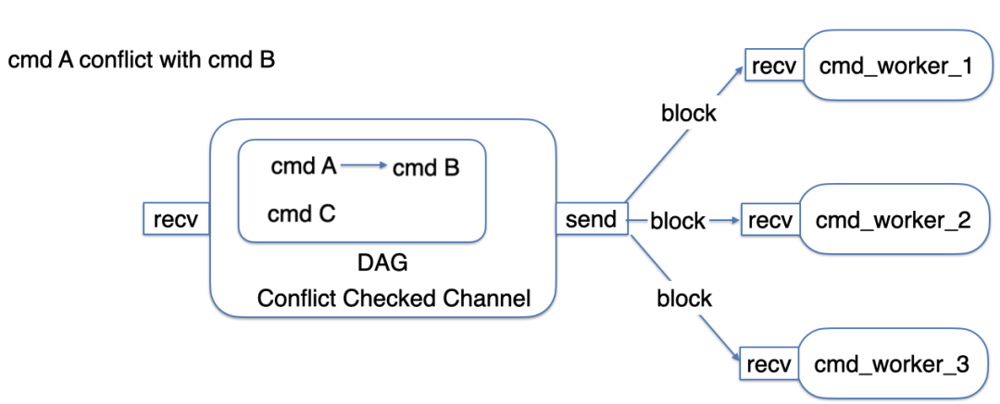
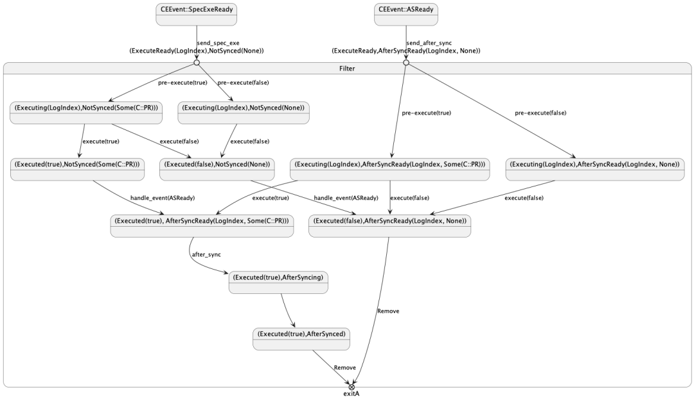

在上一篇源码解读的文章（  
[Xline 源码解读（三） —— CURP Server 的实现](http://mp.weixin.qq.com/s?__biz=MzkwNTMzOTE2MA==&mid=2247486019&idx=1&sn=6ac39ec48c025bb2d06dabd714a8cd95&chksm=c0f80234f78f8b2243f20a8b64a64b07f5831e106c9e00e718844e2b2c83472cb454d2f99b73&scene=21#wechat_redirect)

）中，我们简单阐述了 Xline 的 Curp Server 是如何实现的。接下来，就让我们话接上回，继续深入地来了解 Curp Server 中的一些核心的数据结构，特别是 conflict_checked_channel 和 command worker，它们相互协作，共同推动着 CURP Server 内部状态机状态转换。

## 为什么我们需要冲突检测队列？

冲突检测队列本质是一个多生产者多消费者的 channel，其核心职责是维护动态变化的冲突关系，保证在同一时间内，所有的 receiver 都不会接收到冲突的命令。receiver 接收到的命令的顺序（后面称之为冲突序），满足以下两点：

1. 如果 cmd A 与 cmd B 存在冲突，并且 A 先于 B 被压入队列当中，则 A 会先从队列中弹出。而 B 只有当 A 执行完毕后，才能从队列中弹出。
2. 如果 cmd A 与 cmd B 不存在冲突，且 A 先于 B 被压入队列，则按照 FIFO 顺序，即 A 会先从队列中弹出，B 后弹出。

单看文字的话可能有些抽象，不过没有关系，让我们来看一个简单的例子：假设我们现在有 A、B、C 三个 command，进入冲突检测队列的顺序依次为 A，B，C。其中 A 与 B 冲突，而 C 与 A 和 B 均不产生冲突，则冲突检测队列的初始状态如下：

当 A、B、C 都进入到队列当中后，3 个不同的 cmd_worker 分别从 channel 获取 command，由于 cmd_worker_1 会先接收到 A。B 则会因为与 A 产生冲突而被缓存在队列当中。C 由于没有任何命令与其冲突，因此可以被 cmd_worker_2 接收。而 B 只有在 A 被执行并且 drop 之后，才会从队列当中弹出。如下图所示：



可能有些读者会产生疑问：既然 spec_pool 的职责就是判断 fast path 中是否存在冲突，对应了 CURP paper 中的 witness，那为什么还要引入一个冲突检测队列呢？主要原因有二：

1. 任何命令，不管走的是 fast path 还是 slow path, 最终都必须要在 leader 上得到执行。因此，leader 必须在这些混合的命令中，找到一个合理的执行顺序，来保证命令的执行不会打破 CURP 对命令执行顺序的假设。而 spec_pool 中只保存了可以在 fast path 被执行的命令，并不涉及 slow path 中的命令
2. 在达成共识的过程当中，我们必须先判断命令是否存在于 spec_pool 当中。这是一个同步的操作，如果将复杂冲突序的计算工作放到 spec_pool 当中，那会很容易形成 bottleneck。因此，我们将判断是否有冲突和计算出冲突序这两个职责进行拆分，将前者放到同步的 spec_pool 当中，而将后者放到异步的冲突检测队列当中执行。

## 冲突检测队列是如何工作的？

要理解冲突检测队列的工作原理，离不开下面两个问题的探讨：

1. 我们应当如何对冲突关系进行建模？
2. 面对会动态变化的冲突关系，我们如何快速地找到所有没有冲突的命令？

针对第一个问题，我们可以将所有的命令都看成是一张有向无环图中的顶点，而将冲突关系视为图中顶点之间的有向边。假设命令 A 和命令 B 之间存在冲突（命令的抵达顺序为先 A 后 B），我们便可将冲突关系看成是 A 和 B 之间的一条弧<A, B>，其中弧头总是指向后进来的顶点（这一顺序性就保证了图中不会出现环形冲突）。

一旦我们将冲突关系定义为一个有向无环的非连通图中的一条边，那么执行某个命令时所需要计算的冲突顺序问题，就转换成了一个求有向无环图中，该命令所在的连通分量的拓扑排序问题。针对每个命令，successors（也就是后继） 保存了哪些 cmd 与当前 cmd 冲突，successors 的长度就是该 顶点的出度。而 predecessor_cnt （前驱数）则代表了这个 cmd 与之前的多少个 cmd 存在冲突，也就是该顶点元素的入度。

同样回到我们前面所提到的 A、B、C 的例子当中，当我们使用 DAG 来描述命令的冲突关系，其情况如下图所示。



当 cmd_worker 从 channel 当中接收命令时，channel 只需要遍历这个有向无环图中的每一个连通分量，并找到第一个入度为 0 的顶点即可。只有当 command 执行完毕后，channel 才会更新 B 的 predecessor_cnt，以解决 A 与 B 之间的冲突关系。

## 状态机引擎的架构

正如我们在文章开头所说的那样，冲突检测队列和 command worker 共同组成了 Curp Server 的状态机引擎。冲突检测队列向 command worker 提供无冲突的命令，而 command worker 则负责执行这些命令，并根据结果推动更新冲突检测队列当中的冲突关系。

从结构上来看，Curp Server 状态机引擎是由三对 channel 和一个 filter 构成，其中这三对 channel 分别为：(send_tx，filter_rx)、(filter_tx, recv_rx) 以及 （done_tx, done_rx）具体的结构可以参考下图。


其数据流方向为：send_tx -> filter_rx -> filter -> filter_tx -> recv_rx -> done_tx -> done_rx

其中，send_tx 为 RawCurp 对象所拥有，负责在 propose（对应了 curp 的 fast path）、以及应用日志 apply（对应了 curp 的 slow path） 时向冲突检测队列投递对应的 CEEvent。冲突检测队列则会在计算出冲突顺序后，将 CEEvent 转换成为 Task 并通过 (filter_tx, recv_rx) 投递到 command worker 当中执行。command worker 在执行完 Task 后将结果通过 (done_tx, done_rx) 反馈到冲突检测队列中，并更新队列中依赖图中的顶点信息。

## 状态是如何转换的

要理解一个状态机的工作原理，我们需要理解以下两个问题：

1. 状态机提供了哪些事件以及哪些状态
2. 哪些事件会导致状态发生转移 让我们先来看看 Curp Server 的状态机引擎都提供了哪些事件。

```rust
/// Event for command executor
enum CEEvent<C> {
    /// The cmd is ready for speculative execution
    SpecExeReady(Arc<LogEntry<C>>),
    /// The cmd is ready for after sync
    ASReady(Arc<LogEntry<C>>),
    /// omit some code...
}

/// CE task
struct Task<C: Command> {
    /// Corresponding vertex id
    vid: u64,
    /// Task type
    inner: TaskType<C>,
}

/// Task Type
enum TaskType<C: Command> {
    /// Execute a cmd
    SpecExe(Arc<LogEntry<C>>, Option<C::Error>),
    /// After sync a cmd
    AS(Arc<LogEntry<C>>, C::PR),
    /// omit some code...
}
```

从前面的描述中我们可以看出，Curp Server 的状态机引擎主要的事件可以分为两类，一类是  CEEvent  
，它描述了命令本身的信息，包括了命令的来源，其中  SpecExeReady  
  表明这个命令是来自于 fast path, 而  ASReadey   
则表明这个命令来自于 slow path。而另一类则是  Task  
，它描述命令在依赖图中的顶点 id，以及当前命令所需要执行的操作。

Curp Server 的状态机引擎也定义了如下的状态：

```rust
/// Execute state of a cmd
enum ExeState {
    /// Is ready to execute
    ExecuteReady,
    /// Executing
    Executing,
    /// Has been executed, and the result
    Executed(bool),
}

/// After sync state of a cmd
enum AsState<C: Command> {
    /// Not Synced yet
    NotSynced(Option<C::PR>),
    /// Is ready to do after sync
    AfterSyncReady(Option<C::PR>),
    /// Is doing after syncing
    AfterSyncing,
    /// Has been after synced
    AfterSynced,
}
```

其中，ExeState   
代表命令的执行状态，而  AsState   
则代表了命令是否执行完了  after_sync  
  阶段。Curp Server 通过组合  ExeState  
  和  AsState   
两种状态来代表命令执行过程中的不同状态。不同的状态所代表的语义如下：

- (ExecuteReady, NotSynced(None)  
  : 代表命令已经可以准备执行 execute  
    阶段，并且该命令属于 fast path,无需等待  after_sync  
    结束即可向用户返回结果。此状态也是 fast path 路径下，状态机引擎的初始状态。
- (ExecuteReady,AfterSyncRead(None))  
  : 代表命令已经可以准备执行  execute  
    阶段，并且该命令属于 slow path，需要等到 after_sync  
  结束才能向用户返回结果。此状态也是 slow path 路径下，状态机引擎的初始状态。
- (Executeing,NotSynced(Some(C::PR)))  
  : 代表命令执行  pre_execute  
    成功，并拿到了  pre_execute   
  的执行结果  Some(C::PR)  
  , 同时命令也进入了执行状态。
- (Executeing,NotSynced(None))  
  ：代表命令  pre_execute  
    执行失败
- (Executed(true),NotSynced(Some(C::PR)))  
  : 代表命令执行成功
- (Executed(false),NotSynced(None))  
  : 代表 fast path 中的命令执行失败
- (Executed(true),AfterSyncRead(LogIndex, Some(C::PR)))  
  : 代表命令执行完毕，开始准备执行  after_sync
- (Executed(true),AfterSyncing)  
  ：代表命令执行完毕，正在执行  after_sync  
    阶段
- (Executed(true),AfterSynced)  
  : 代表命令执行成功，且  after_sync  
    也执行成功
- (Executeing,AfterSyncReady(Some(C::PR)))  
  : 代表命令正在执行，并准备执行  after_sync  
    阶段
- (Executeing,AfterSyncReady(None))  
  :代表命令的  pre_execute   
  阶段失败
- (Executed(false),AfterSyncReady(None))  
  : 代表 slow path 中的命令执行失败。

各种状态之间的转换关系如下：



## Summary

在 Xline 中，不论是来自于 fast path 的命令，还是来自 slow path 的命令，这些命令最终都会在 leader 节点上得到执行。在这个过程当中，仅凭  spec_pool  
  来判断命令是否冲突是显然不够的。因为  spec_pool   
只能判断新的命令是否与正在  execute   
但还没有  after_sync  
  的命令冲突，但它不能起到动态维护命令冲突关系的作用。为了解决冲突关系的动态维护，我们引入了冲突检测队列，并通过冲突检测队列和 command worker 共同构造 Curp Server 的状态机引擎。通过 command worker 的执行，使得来自不同路径(fast path 和 slow path)的命令能够根据自身的状态，进行状态转移，并向用户返回相应的结果。
