## 数据流式编程的思想

### 数据流式编程思想简介

数据流式编程（Dataflow Programming）是一种存在已久的程序设计范式，可以追溯到 19 世纪 60 年代，由 MIT 的 Jack Dennis 教授开创。


图 1 信号处理领域的数据流框图  
图片来源：https://www.electronics-tutorials.ws/wp-content/uploads/2018/05/systems-sys22.gif

数据流的前身是信号流，如上图 1 所示，在信号与系统相关的领域中，使用信号流框图来表示模拟信号在一个系统中的处理过程。随着计算机技术的发展，越来越多的模拟系统被数字系统所取代，连续的信号也变为了离散的数据。

### 软件开发中的数据流式编程思想

在介绍硬件中的数据流式编程思想之前，先来看一下软件中的数据流式编程，并了解数据流式编程中的几个基本元素的概念。

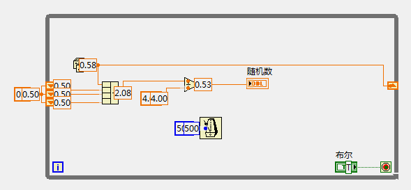

图 2 一段 LabView 编写的流式数据处理软件程序  
图片来源：https://bbs.elecfans.com/jishu_949080_1_1.html

在软件开发领域，数据流式程序的开发已经得到了广泛的应用。其中颇具代表性的是 NI 公司的 LabView 软件以及 Mathworks 公司的 Simulink。如上图 2 所示，该图为 LabView 可视化开发环境中，采用图形化编程的方式编写的一个简易数据处理程序。观察图 2，可以得到数据流式程序具有的一些要素：

- Node：数据处理节点，代表着实际的数据处理步骤（如上图中骰子节点、节拍器节点、4 输入加法器节点、除法节点等）
- Port：分为 In 和 Out 两种类型，一个 Node 可以具有多个 In 和 Out 端口（如除法器就是 2 输入 1 输出）
- Source：数据源，待处理输入通过数据源进入到程序中（例如上述的骰子节点，会生成随机数输出，即为一个可以输出动态数据的 Source，而图中蓝色的 500、绿色的布尔节点则可以视为产生静态常量的 Source）。
- Sink：数据出口，经过处理的数据经过出口输出（例如上述节拍器节点、右下角的红色停止条件节点，它们都只有输入没有输出，即接收最终数据结果）。
- Edge：连接 Port 与 Port 的边，代表数据流通的管道

同样，通过观察图 2，还可以发现流式程序的执行一些特点：

- 当一个 Node 的 In 端口满足触发条件（例如任意输入端口有数据，或所有端口都有数据），并且其 Out 端口不阻塞时（下游 Node 可以可以接收数据），该 Node 开始执行自己的处理逻辑，并将输出数据投递到对应的输出端口。
- 反压的思想贯穿了整个程序的执行流程，当下游节点无法处理新数据时，上游节点的处理过程将被阻塞。
- 并发性：每个 Node 独立处理自己的逻辑，Node 之间是并发的
- 层次性：可以将多个 Node 组成的子系统看做一个黑箱，子系统的 Sink 和 Source 作为该黑箱的 Port，这样就可以把子系统看做上层系统的一个 Node，从而形成层级结构。

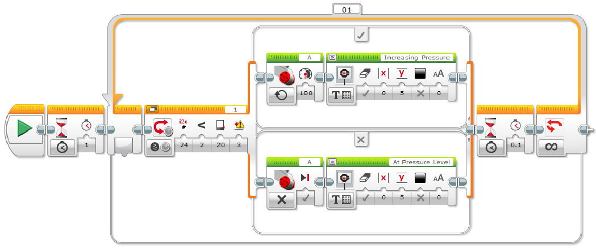

图 3 带有循环、条件分支结构的数据流式程序  
图片来源：https://softroboticstoolkit.com/soft-robotics-kids/fabrication/sample-program

近些年以来，为了实现敏捷化开发而逐步流行的图形化拖拽编程、低代码编程等敏捷开发方式中，通常都可以看到数据流式编程的影子。与 DSP 领域中的简单数据流思想不同，在软件开发领域的数据流程序中，通常可以看到条件分支结构和循环执行结构。**因此，数据流的编程模式是图灵完备的，不仅可以用于表示简单的数据计算流程，还可以表达复杂的控制流。**

如上图 3 所示即为一款儿童编程软件的示意图，读者可以尝试在上面的图中找出 Source、Sink、Node、Port、Edge 这些概念。

### 软件数据流 vs 硬件数据流

#### 软件实现：

数据流系统都需要一套调度框架，所有节点之间的并行执行都是软件虚拟出来的，节点是否可以激活的判断需要框架进行额外的计算，因此性能开销不能忽略。

#### 硬件实现:

硬件天然具有并发的特性。端口、连线、层级结构、反压、并发执行这些概念与硬件设计有着完美的对应关系。事实上，Verilog、VHDL 等语言本身也可以被算作是和 LabView、Simulink 一样的数据流式程序的开发语言[1]。

### 数据流思想与状态机思想的对比

在很多场景下，如果使用状态机的思想对硬件行为进行建模，则需要考虑很多状态之间的转换关系，容易造成状态爆炸。而是用数据流的编程思想，只需要考虑数据在两个节点之间的传输关系以及各个节点自己要做的事情，每个节点各司其职，可以有效降低程序的复杂度。

下面以 AXI4 协议的写通道握手为例，写地址通道和写数据通道之间没有明确的先后依赖顺序。

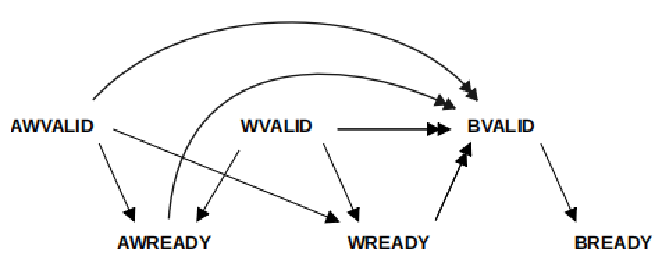

图 4 AXI 握手协议的顺序关系

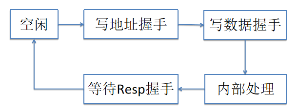

图 5 一个最简单的状态机握手模型，忽略了其他状态

如果以状态机的思路来实现，是上述图 5 这样的，它是一种顺序化执行的思维模式，依次进行各个通道上的握手，难以描述并行发生的事件。如果强行使用状态机来描述并发场景下各种可能的先后顺序，则容易导致状态爆炸，维护成本高，不够敏捷。

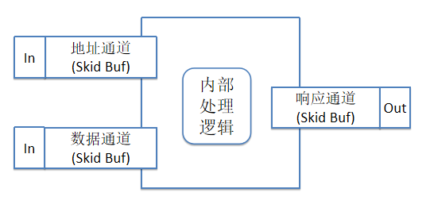

图 6 基于数据流思想的握手模型

如果以数据流的思想来实现，则如上述图 6 所示，4 个环节之间各自独立运行，各司其职，两个输入通道以及一个输出通道是独立模块，各自可以并行的完成自己的握手，模块与模块之间通过 Skid Buf(FIFO)进行解耦。可以灵活应对各种握手信号到达的先后顺序，可以写出易于维护且吞吐量高的代码。

## Bluespec 语言及其流式编程框架 PAClib

### Bluespec SystemVerilog(BSV)和 PAClib 简介

Bluespec SystemVerilog 是一种高级的函数式硬件描述语言，由 MIT 的 Arvind 教授开发，最初以商业授权形式发布，并于 2020 年正式开源。

该语言将硬件行为抽象成多个可以并发运行的 Rule，Rule 由触发逻辑来控制其运行时机，Rule 之间、Module 之间可以通过 FIFO 进行通信建模，编译器会自动生成 Module 之间的握手和反压信号（即 Rule 的触发逻辑），从而降低了描述复杂并行系统的难度,使得它非常适合使用数据流的思想进行开发。

PAClib 是 Pipelined Architecture Composers library 的缩写，是 BSV 提供的一个官方库，可以方便的开发出基于数据流思想设计的硬件逻辑。

与 DSP 领域的流式处理相比，PAClib 提供了诸如 If-Else-Then、While Loop、For Loop、Fork、Join 等操作，因此 PAClib 所提供的数据流式编程框架是图灵完备的，不仅可以用于对复杂数据流逻辑的描述，也可以用于对复杂控制流的描述。

### PAClib 中的基础开发组件

PACLib 中的基础组件可以看做是流式编程中的各个节点，为了使用流式编程，需要首先了解各个节点的功能，然后才能将这些节点连接起来，从而形成完整的程序。下面首先介绍这些节点的通用形式，即 PAClib 中定义的 PipeOut 接口以及 Pipe 类型，其定义如下：

```rust
interface PipeOut #(type a);
    method a first ();
    method Action deq ();
    method Bool notEmpty ();
endinterface
```

```rust
typedef (function Module #(PipeOut #(b)) mkPipeComponent (PipeOut #(a) ifc))
    Pipe#(type a, type b);
```

上述 PipeOut 接口的形式类似于一个 FIFO，即为一条数据通道的出口端。Pipe 类型本质是一个函数，用来把一个 PipeOut 类型的输入转换为另一个 PipeOut 类型的输出模块，因此 Pipe 类型表示了一个连接并转换的概念。


图 7 Pipe 类型的图形化示意

上述图 7 可以帮助大家更形象的理解 Pipe 类型和 PipeOut 接口，其中整个节点可以看做是一个 Pipe，数据从左侧流入，从右侧流出，并在流经节点的过程中被处理（处理的过程在下文介绍）。其中右侧突出的部分是用于和下一个节点（也就是下一段 Pipe）连接的接口，即 PipeOut。Pipe 和 PipeOut 类型提供了数据流程序中各个节点的统一接口规范，所有基于 PAClib 开发的处理逻辑都要用这两个概念进行包装，从而使得各个节点之间具有一定的互换性，为架构提供了很强的灵活性。

#### 将函数包装为 Pipe

Pipe 类型只是定义了数据流经过一个节点前后的数据类型，因此还需要具体的逻辑来实现从类型 A 到类型 B 的转换。由于函数的本质就是做映射，因此使用函数来表达对数据的加工过程再合适不过了。mkFn_to_Pipe_buffered 是一个工具函数，提供了将一个函数封装为一个 Pipe 的能力，其定义如下：

```rust
function Pipe #(ta, tb) mkFn_to_Pipe_buffered (Bool paramPre,
                                               tb fn (ta x),
                                               Bool paramPost);
```

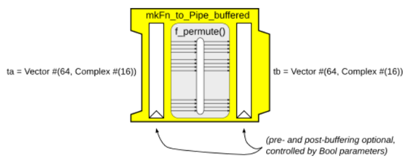

图 8 mkFn_to_Pipe_buffered 工具函数所生成的 Pipe 节点示意图

这里的用法也体现出了 BSV 函数式编程语言的特性，函数是语言中的一等公民。事实上，PAClib 中对数据流模式中各个节点之间的“连线”也是通过高阶函数的嵌套来实现的。

两个 Bool 类型的参数可以选择是否在函数的前后加入 FIFO 队列进行缓冲。如果前后两个 FIFO 都不开启，则该节点表现出组合逻辑的性质。开启 FIFO 后，则表现出了流水线的性质。通过 FIFO 实现前后级节点之间的反压逻辑，自动适应不同的数据流速。

#### Map 操作

map 是函数式编程中必不可少的一个功能，PAClib 中也提供了不同形式的 map 功能：

- `mkMap` 用于将 Vector 中的每一个元素并行地进行处理。
- `mkMap_indexed` 则在 `mkMap` 的基础之上，额外提供了元素对应的索引信息，从而使得用于 map 的函数可以获得关于被处理数据的位置信息。这两个函数的定义如下：

```rust
function Pipe #(Vector #(n, a),
                Vector #(n, b))
         mkMap (Pipe #(a, b) mkP);
```

```rust
function Pipe #(Vector #(n, a),
                Vector #(n, b))
         mkMap_indexed (Pipe #(Tuple2 #(a, UInt #(logn)), b) mkP);
```

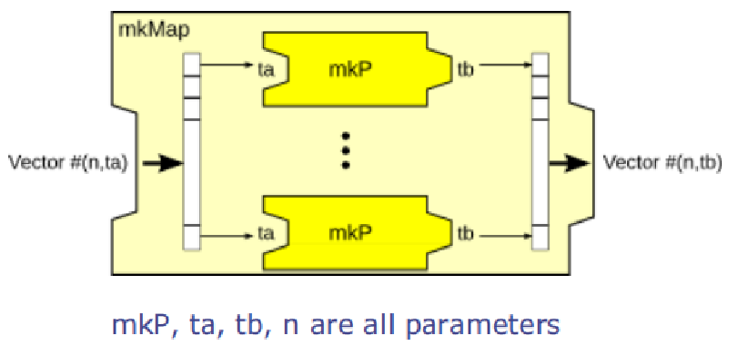

图 9 mkMap 节点的图形化示意

如上图 9 所示，展示了 `mkMap` 节点的示意图，可以看到图中用深浅两种颜色表示了嵌套的 `Pipe` 类型，图中不同 Pipe 类型的嵌套表示了 Node 之间的层级关系，本质上是通过高阶函数实现了简单逻辑的组合。

由于 BSV 静态展开的原因，如果 Vector 长度较大，则会产生出很多个 mkP 的实例（mkP 实例的数量与输入向量的长度相同），占用大量面积。为了减少面积占同，用时间换空间，则可以使用接下来要介绍的节点。

#### 分批 Map 操作

PAClib 中提供了 `mkMap_with_funnel_indexed` 函数来创建支持分批 Map 操作的处理节点，从而可以在面积和吞吐率之间进行取舍，其定定义如下：

```rust
function Pipe #(Vector #(nm, a),
                Vector #(nm, b))
         mkMap_with_funnel_indexed (UInt #(m) dummy_m,
                                    Pipe #(Tuple2 #(a, UInt #(lognm)), b) mkP,
                                    Bool param_buf_unfunnel)
         provisos (...);
```


图 10 mkMap_with_funnel_indexed 工具函数所创建的处理流程

`mkMap_with_funnel_indexed` 函数实际上是一个工具函数，该工具函数帮助用户创建了 3 个 `Pipe` 的组合，其中 mkMap 节点已经介绍过了，另外两个节点分别是 `mkFunnel_Indexed` 和 `mkUnfunnel`，其定义如下：

```rust
function Pipe #(Vector #(nm, a),
                Vector #(m, Tuple2 #(a, UInt #(lognm))))
         mkFunnel_Indexed
         provisos (...);
```

```rust
function Pipe #(Vector #(m, a),
                Vector #(nm, a))
         mkUnfunnel (Bool state_if_k_is_1)
         provisos (...);
```

上述两个节点的作用，第一个是将一个较长的向量输入以指定的长度进行切分，从而产生多个批次的输出。而第二个是接收多个批次较短的输入，然后产生一个较长的输出，即把之前切分的批次重新拼接回来。 mkMap_with_funnel_indexed 函数通过上述 3 个节点的组合，其实现的最终功能为：

- 指定一个参数 m，输入的 Vector 会被自动切分为多段，每段的长度为 m，然后以 m 长度的切片为单位进行 map 操作。
- 在实际设计中，只需要调整参数 m 的值就可以很方便的在面积和吞吐率之间进行平衡。串并转换功能由框架自动完成，开发者只需要把精力放在核心的 mkP 节点即可。

#### 节点的串联

上述的 `mkMap_with_funnel_indexed` 函数将 3 个特定的节点进行了串联，从而实现了更加复杂的逻辑。将简单节点进行串联是流式编程中必不可少的操作，为了将任意节点进行串联，可以使用 `mkCompose` 和 `mkLinearPipe` 这两个函数实现，其定义如下：

```rust
function Pipe #(a, c) mkCompose (Pipe #(a, b) mkP,
                                 Pipe #(b, c) mkQ);
```

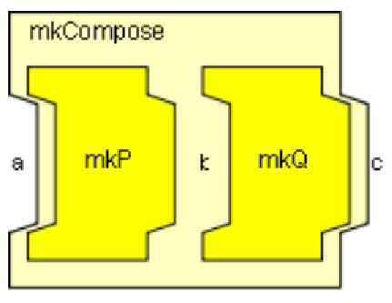

图 11 mkCompose 节点示意图

```rust
function Pipe #(a, a)
         mkLinearPipe_S (Integer n,
                         function Pipe #(a,a) mkStage (UInt #(logn) j));
```

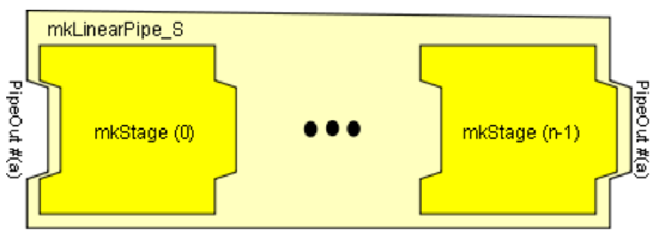

图 12 mkLinearPipe 节点示意图

可以看到，`mkCompose` 的作用是将两个不同的 Pipe 进行串接，多个 `mkCompose` 嵌套使用则可以实现多级的串接。而 `mkLinearPipe_S` 是将同一个函数进行多次调用，但每次调用时会传入不同的参数，从而使得这个函数可以在不同的调用位置上表现出不同的行为。

#### Fork 和 Join 操作

上述介绍的节点都是对数据进行线性操作的节点，如果只有这样的节点是无法实现图灵完备的数据流式程序的，接下来介绍的几个非线性操作节点可以使得程序变得图灵完备。下面从 `mkFork` 和 `mkJoin` 两个函数开始介绍：

```rust
module mkFork #(function Tuple2 #(b, c) fork_fn (a va),
                PipeOut #(a) poa)
       (Tuple2 #(PipeOut #(b), PipeOut #(c)));
```

```rust
module mkJoin #(function c join_fn (a va, b vb),
                PipeOut #(a)       poa,
                PipeOut #(b)       pob )
       (PipeOut #(c));
```


图 13 mkFork 与 mkJoin 节点的示意图

`mkFork` 和 `mkJoin` 可以创建简单的并行结构，通过用户自己提供的函数 fork_fn 和 join_fn，由用户决定如何将一个输入数据流拆分成 2 个输出数据流，以及如何把两个输入数据流合并为一个输出数据流。对于 Join 操作而言，要求两个输入端口上均存在数据时，该 Node 才可以执行操作，如果两条路径上处理数据所需的时钟周期数不一致，则 Join 节点会进行等待，直到两个输入都有数据为止。此外，PAClib 中还提供了多种 Fork 节点的变种实现，可以自行了解。

#### 条件分支操作

使用 `mkIfThenElse` 可以创建条件分支，其定义及示意图如下：

```rust
module [Module] mkIfThenElse #(Integer                        latency,
                               Pipe #(a,b)                    pipeT,
                               Pipe #(a,b)                    pipeF,
                               PipeOut #(Tuple2 #(a, Bool))   poa)
                (PipeOut #(b));
```

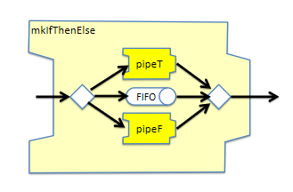

图 14 mkIfThenElse 节点示意图

`mkIfThenElse` 可以实现分支逻辑。输入数据是一个 `Tuple2#(a, Bool)`类型，该节点会根据 Bool 类型的取值将数据包路由到 `pipeT` 或者 `pipeF` 子节点。其内部具有一个 FIFO 结构用于存储 Token，从而实现在 pipeT 和 pipeF 两个节点所需处理周期不一致时起到保序的作用。

此外，PAClib 中还提供了 `mkIfThenElse_unordered` 变种实现，当对输入和输出之间的数据没有严格的顺序要求时，可以使用这个变种来简化设计。For 循环 使用 `mkForLoop` 可以创建条件分支，其定义及示意图如下：

```rust
module [Module] mkForLoop #(Integer                            n_iters,
                            Pipe #(Tuple2 #(a, UInt #(wj)),
                                   Tuple2 #(a, UInt #(wj)))    mkLoopBody,
                            Pipe #(a,b)                        mkFinal,
                            PipeOut #(a)                       po_in)
                (PipeOut #(b))
                provisos (Bits #(a, sa));
```

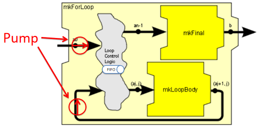

图 15 mkForLoop 节点示意图

`mkForLoop` 需要通过 `n_iters` 参数传入循环次数。在实现逻辑上，Loop Control Logic 内部有一个共享队列，外部进入的新数据和经过循环体执行过一次处理的数据，都会被放到这个队列中。每个新进入的数据都会被打上一个 Tag，Tag 的值为循环次数，这个 Tag 伴随着数据在循环中流动，每流动一次，Tag 减一，Loop Control Logic 在从共享队列中取出数据时，会根据 Tag 的计数值决定将其送入 `mkLoopBody` 节点还是 `mkFinal` 节点。内部有两条 Rule，分别独立负责把新数据和正在循环的数据放入 FIFO 中，为循环提供了内在动力（图中 Pump 标注路径）。

注意，由于 `mkLoopBody` 也可能是一个需要多拍才能完成的节点，因此可以有多个数据包同时在流水线中进行循环。

#### While 循环

在理解了 For 循环的实现原理之后，理解 While 循环的实现就没有太大困难了。其定义和示意图如下：

```rust
module [Module] mkWhileLoop #(Pipe #(a,Tuple2 #(b, Bool))  mkPreTest,
                              Pipe #(b,a)                  mkPostTest,
                              Pipe #(b,c)                  mkFinal,
                              PipeOut #(a) po_in)
                (PipeOut #(c))
        provisos (Bits #(a, sa));
```

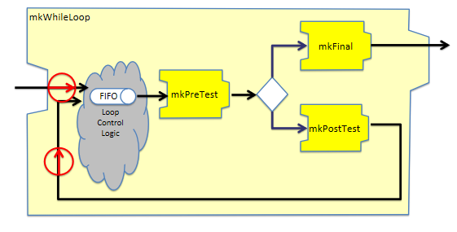

图 16 mkWhileLoop 节点示意图

while 循环的实现需要用户提供 3 个处理节点：

- mkPreTest 子节点用于执行循环终止条件的判断
- mkPostTest 子节点是循环体要做的处理逻辑
- mkFinal 子节点是循环体退出前对数据再进行一次修改的机会 其实现逻辑与 For 循环类似，都是通过内部共享一个队列来实现的，同时通过两条 Rule 来为循环提供动力。

## IFFT 应用实例

### 需求背景


图 17 一个 IFFT 数据处理流程

以上述图 17 中的 IFFT 变换为例，该流程中有很多平铺重复的结构，对于不同的应用场景，需要在面积、吞吐量之间进行平衡，例如：

- 组合逻辑实现？还是流水线实现？
- 几个不同的 stage 之间是否可以 fold 以减少面积？
- 每个 stage 内部的 f_radix4 实例是否可以减少？

### 代码实现

使用 PAClib 提供的数据流式开发框架，只需要调整少量参数就可以快速调整系统的计算结构。下面先给出整体代码，再对其中的各个部分进行解析，可以看到，整体框架的代码量小于 40 行（仅包含用于调度数据流的框架代码，不包含具体的运算逻辑以及注释）：

```rust
module [Module] mkIFFT (Server#(IFFTData, IFFTData));
    Bool param_linear_not_looped = False;
    Integer jmax = 2;
    FIFO#(IFFTData) tf <- mkFIFO;

    function Tuple2#(IFFTData, UInt#(6)) stage_d(Tuple2#(IFFTData, UInt#(6)) a);
        return a;
    endfunction

    let mkStage_D = mkFn_to_Pipe (stage_d);

    let s <- mkPipe_to_Server
                ( param_linear_not_looped
                    ? mkLinearPipe_S (3, mkStage_S)
                    : mkForLoop (jmax, mkStage_D, mkFn_to_Pipe (id)));
    return s;
endmodule

function Pipe #(IFFTData, IFFTData) mkStage_S (UInt#(2) stagenum);
    UInt#(1) param_dummy_m = ?;
    Bool param_buf_permuter_output = True;
    Bool param_buf_unfunnel = True;

    function f_radix4(UInt#(2) stagenum,
                                    Tuple2#(Vector#(4, ComplexSample), UInt#(4)) element);
        return tpl_1(element);
    endfunction

    // ---- Group 64-vector into 16-vector of 4-vectors
    let grouper = mkFn_to_Pipe (group);
    // ---- Map f_radix4 over the 16-vec
    let mapper = mkMap_fn_with_funnel_indexed ( param_dummy_m,
                                                f_radix4 (stagenum),
                                                param_buf_unfunnel);
    // ---- Ungroup 16-vector of 4-vectors into a 64-vector
    let ungrouper = mkFn_to_Pipe (ungroup);
    // ---- Permute it
    let permuter = mkFn_to_Pipe_Buffered (False, f_permute,
                                            param_buf_permuter_output);
    return mkCompose (grouper,
                        mkCompose (mapper,
                                    mkCompose (ungrouper, permuter)));
endfunction
```

下面来依次解析代码，首先下面看这一段：

```rust
    let s <- mkPipe_to_Server
                ( param_linear_not_looped
                    ? mkLinearPipe_S (3, mkStage_S)
                    : mkForLoop (jmax, mkStage_D, mkFn_to_Pipe (id)));
```

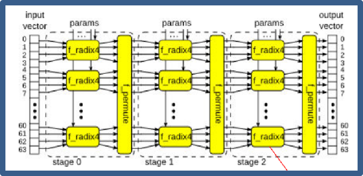

图 18 平铺结构的 IFFT 计算架构

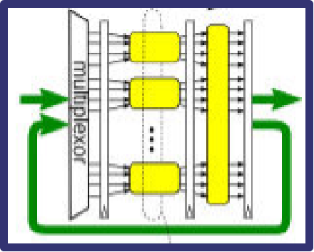

如上图 18 和 19 所示，只需要修改代码中的 `param_linear_not_looped` 变量，即可以在两种截然不同的计算架构之间进行切换。通过选择 `mkLinerPipe_S` 或者 `mkForLoop` 来选择 stage 之间是流水线平铺的方式来实现，还是通过 Fold 的方式来实现。

```rust
    let mapper = mkMap_fn_with_funnel_indexed ( param_dummy_m,
                                                f_radix4 (stagenum),
                                                param_buf_unfunnel);
```

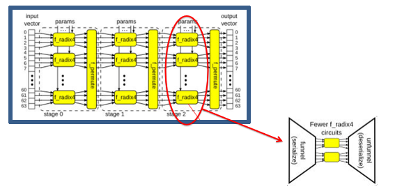

如上述代码片段和图 20 所示，通过 `mkMap_fn_with_funnel_indexed` 函数的第一个参数来决定实例化多少个 `f_radix4` 计算单元，从而改变计算的并行度。

```rust
    let permuter = mkFn_to_Pipe_Buffered (False, f_permute,
                                            param_buf_permuter_output);
```

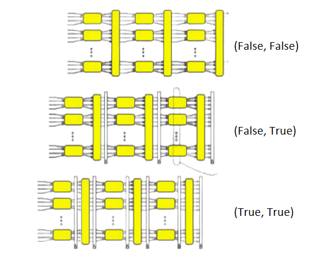

图 21 在不同位置插入流水线寄存器

如上述代码片段和图 21 所示，通过 `mkFn_to_Pipe_Buffered` 函数的两个输入参数来控制是否加入 FIFO，从而实现在流水线或组合逻辑之间的切换，使得程序可以在时序上做出简单的调整。

```rust
return mkCompose (grouper,
                        mkCompose (mapper,
                                    mkCompose (ungrouper, permuter)));
```


图 22 节点的串联

如上述代码片段和图 22 所示，通过 `mkCompose` 可以实现多个 Node 之间的顺序连接。

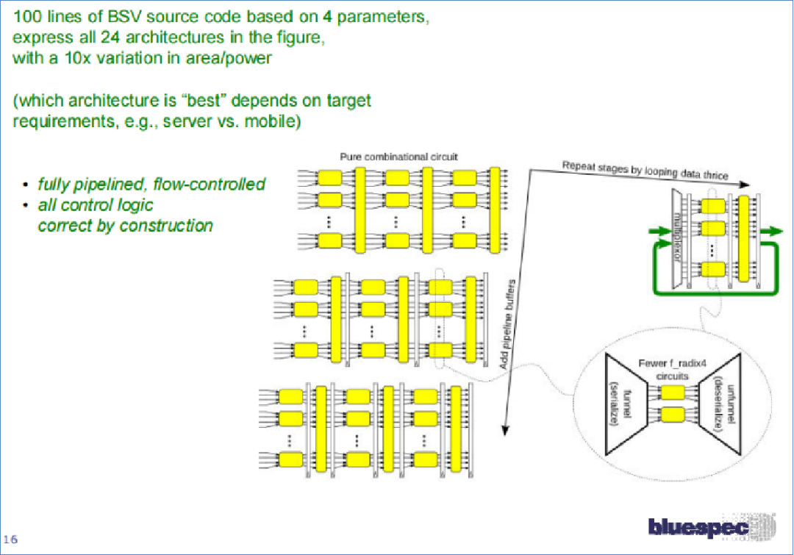

图 23 使用 PAClib 实现的各种 IFFT 计算架构  
图片来源：http://www.cs.ox.ac.uk/ralf.hinze/WG2.8/27/slides/rishiyur2.pdf

在最终效果部分，直接引用 Bluespec 原始介绍 PPT[2]中的一个页面来进行说明，使用不超过 100 行代码，仅需要调整 4 个参数，即可实现在 24 种不同的计算架构之间进行切换，这 24 中计算架构在面积和功耗上的差异可以达到 10 倍以上，用户可以根据自己的使用场景灵活的选择实现方案。

## 写在最后

从上述示例可以看到数据流式的编程思想可以为硬件设计引入极大的灵活性和可维护性。同时，由于分支节点、条件节点、循环节点的存在，这种数据流式的编程模式是图灵完备的，因此数据流的开发思想可以用于简化复杂的控制通路设计。

目前达坦科技正在我们的开源 RDMA 网卡中探索并应用数据流式编程模型，希望对此感兴趣的同学可以继续深入交流：https://github.com/datenlord/open-rdma/

参考资料：

[1] https://en.wikipedia.org/wiki/Dataflow_programming

[2] Rishiyur S. Nikhil. Two uses of FP techniques in HW design[EB/OL]. 2010[].

http://www.cs.ox.ac.uk/ralf.hinze/WG2.8/27/slides/rishiyur2.pdf.
