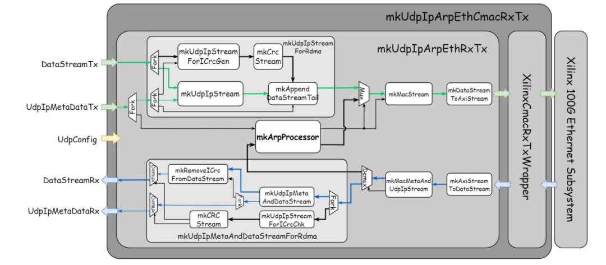
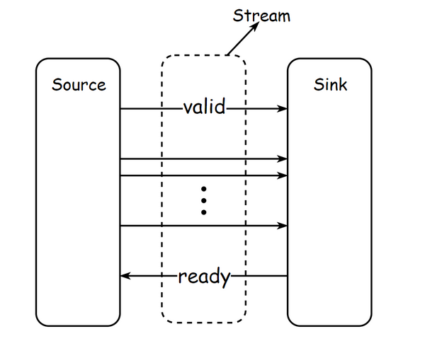
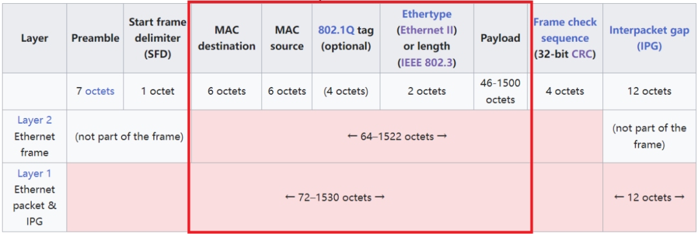
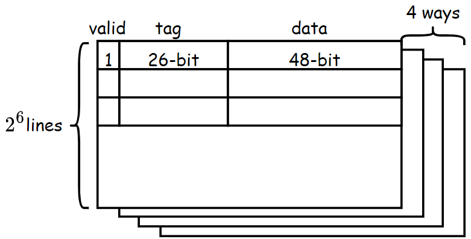
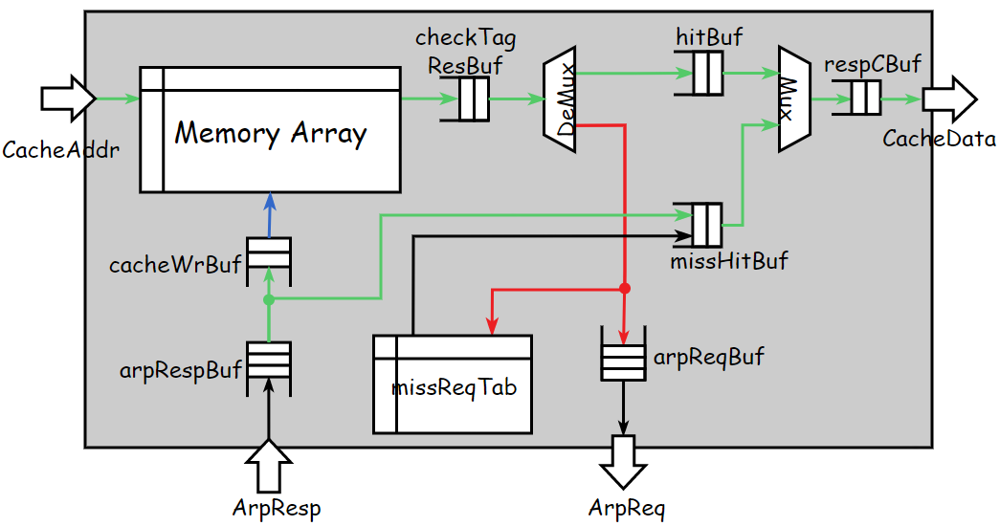
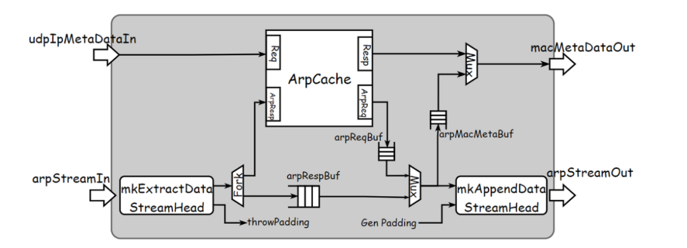
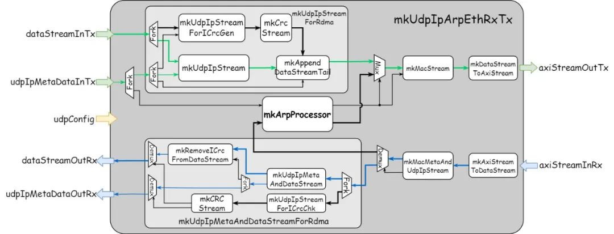
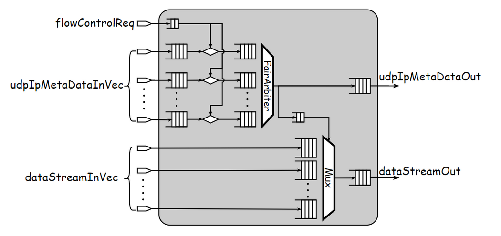
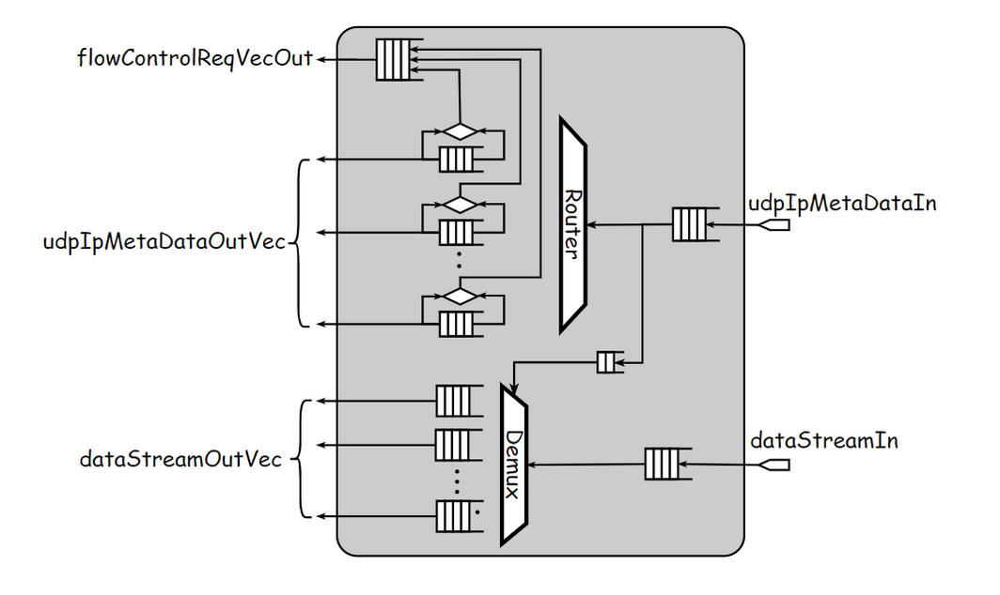

## 简介

blue-ethernet 项目使用 Bluespec SystemVerilog(BSV)硬件描述语言实现了一系列在 FPGA 上加速网络数据包处理的硬件模块。具体来说，其提供了用于生成和解析 Ethernet/IP/UDP 网络报文的硬件模块。此外，还提供了一个具有非阻塞高速缓存的 APR 报文处理单元，用于自动解析设备的物理 MAC 地址。

除了构建标准的 UDP/IP/Ethernet 协议栈，blue-ethernet 还增加了对 RoCE(RDMA over Converged Ethernet)协议的支持，具体包括：

1）在 UDP/IP 报文处理流程中集成 ICRC 校验码的生成和验证功能；

2）提供对 Priority Flow Control(PFC)协议的支持，实现无损网络传输。

最后，本项目还实现了与 Xilinx 100G 以太网子系统(CMAC)进行交互的单元。



## 文件目录概览

本项目关键目录的介绍如下：

```bash
├── lib               # 外部库
│   ├── blue-crc      # 高性能CRC硬件实现
│   └── blue-wrapper  # BSV接口封装模块
├── scripts           # 脚本
├── src               # 设计源文件
│   └── includes
├── syn               # 综合脚本
└── test              # 测试源文件
    ├── bluesim       # 基于bluesim的测试源文件
    ├── cocotb        # 基于python的测试源文件
    └── vivado        # 和CMAC IP进行联合仿真的测试文件
```

以下是部分源文件的介绍：

```bash
./src
├── ArpCache.bsv               # Cache implementation storing MAC addresses got from ARP
├── ArpProcessor.bsv           # processing unit handling ARP requests and responses
├── includes
│   ├── CompletionBuf.bsv
│   ├── ContentAddressMem.bsv
│   ├── EthernetTypes.bsv      # numeric and struct types about protocol definition
│   ├── PortConversion.bsv     # interface conversion modules used to generate ready-to-use Verilog
│   ├── Ports.bsv              # numeric and struct types about in/output ports of modules
│   ├── RFile.bsv
│   ├── StreamHandler.bsv      # modules implemented for manipulating data stream
│   └── Utils.bsv              # utility functions and modules
├── MacLayer.bsv               # generator and parser for Ethernet packet
├── PfcUdpIpArpEthRxTx.bsv     # generator and parser for UDP/IP/Ethernet packet with PFC
├── PriorityFlowControl.bsv    # modules handling PFC
├── UdpIpArpEthRxTx.bsv        # generator and parser for UDP/IP/Ethernet packet
├── UdpIpEthRx.bsv             # parser for UDP/IP/Ethernet packet
├── UdpIpEthTx.bsv             # generator for UDP/IP/Ethernet packet
├── UdpIpLayer.bsv             # parser and generator for UDP/IP packet
├── UdpIpLayerForRdma.bsv      # parser and generator for UDP/IP packet with support for RoCE
└── XilinxCmacRxTxWrapper.bsv  # bridge modules between parser/generator and Xilinx CMAC
```

## 组件

本节将详细介绍 blue-ethernet 实现的一些重要组件，包括其功能、接口定义和硬件架构等内容。

### 数据流处理模块

硬件网络报文处理本质上是对数据流的各种操作。报文生成模块实际上是将报头数据流插入发送内容数据流的头部，以生成完整的报文数据流。相反，解析模块则是从报文数据流中提取出报头数据流和发送信息数据流。为报文添加校验和，则是先将报文数据流传入 CRC 计算单元，然后将输出的 CRC 校验值附加到报文流的尾部。这里提到的数据流，其对应的硬件实体是由 valid-ready 握手信号控制的一组数据信号。在基于 valid-ready 握手的交互协议下，valid 信号表示主端(Source)发起了数据传输请求，ready 信号则表示从端(Sink)准备好接收来自主端的数据。只有当 valid 和 ready 同时为高电平时，即主从双方同时准备好后，才成功完成一次传输。如果需要传输的数据量大于一次传输的容量，则需要对数据进行分段，并通过多次握手传递。在对数据流的处理中最棘手以及最容易出错的部分是多个数据流交互时如何处理不同流的 valid-ready 控制信号。在 BSV 中，控制信号的处理由编译器实现，在语法层面上是不可见的，这更有助于设计人员专注于不同数据流之间的交互逻辑，而不用处理底层复杂的控制信号。



blue-ethernet 提供的用于数据流处理的模块包括：

- DataStream 结构体定义了 blue-ethernet 中基本的数据流格式，其包括 256 位数据信号、32 位字节使能信号和两个布尔信号 isFirst 和 isLast，分别表示本次传输是否是数据包的最早/后一帧。

```rust
typedef 256 DATA_BUS_WIDTH;
typedef TDiv#(DATA_BUS_WIDTH, 8) DATA_BUS_BYTE_WIDTH;
typedef Bit#(DATA_BUS_WIDTH) Data;
typedef Bit#(DATA_BUS_BYTE_WIDTH) ByteEn;
typedef struct {
    Data data;
    ByteEn byteEn;
    Bool isFirst;
    Bool isLast;
} DataStream deriving(Bits, Bounded, Eq, FShow);
```

- mkAppendDataStreamHead 模块将 appendDataIn 数据流附加到 dataStreamIn 数据流的头部。通过设置 swapDataStream 和 swapAppendData 参数，可以分别转换这两个数据流的字节序。该模块可用于合并报头流和发送数据流，生成完整的报文流。

```rust
module mkAppendDataStreamHead#(
    IsSwapEndian swapDataStream,
    IsSwapEndian swapAppendData,
    PipeOut#(DataStream) dataStreamIn,
    PipeOut#(dType) appendDataIn
)(PipeOut#(DataStream));
```

- mkAppendDataStreamTail 模块将 appendDataIn 数据流附加到 dataStreamIn 数据流的尾部。在合并前，它还需要接收一个携带数据流长度的输入信号 streamLengthIn。

```rust
module mkAppendDataStreamTail#(
    IsSwapEndian swapDataStream,
    IsSwapEndian swapAppendData,
    PipeOut#(DataStream) dataStreamIn,
    PipeOut#(dType) appendDataIn,
    PipeOut#(Bit#(streamLenWidth)) streamLengthIn
)(PipeOut#(DataStream));
```

- mkExtractDataStreamHead 模块提取出数据流 dataStreamIn 的头部并通过 extractDataOut 输出，dataStreamOut 接口输出剩余部分的数据。

```rust
interface ExtractDataStream#(type dType);
    interface PipeOut#(dType) extractDataOut;
    interface PipeOut#(DataStream) dataStreamOut;
endinterface
module mkExtractDataStreamHead#(
    PipeOut#(DataStream) dataStreamIn
)(ExtractDataStream#(dType));
```

- mkAxiStream512ToDataStream 模块将 512 位 AXI-Stream 总线接口转换为 blue-ethernet 中定义的 256 位数据传输格式 DataStream。
- mkDataStreamToAxiStream512 模块将 256 位 DataStream 数据转换为 512 位 AXI-Stream 总线。

### UdpIpLayer

UdpIpLayer 包中的定义的模块用于生成和解析基于 UDP/IP 协议的报文:

- UdpIpMetaData 结构体封装了每次生成 UDP 和 IP 报文时需要动态更新的信息，具体包括:

```rust
typedef struct {
    UdpLength  dataLen;   # The Length of payload data
    IpAddr     ipAddr;    # Desitnation IP address
    IpDscp     ipDscp;    # DSCP field used for PFC
    IpEcn      ipEcn;     # ECN field
    UdpPort    dstPort;   # Destination port number
    UdpPort    srcPort;   # Source port number
} UdpIpMetaData;
```

- UdpConfig 结构体封装了 UDP/IP 报文的某些字段，包括源 MAC/IP 地址、子网掩码和网关，这些字段在一段时间内都是固定的，通过一次统一的配置即可，而不需要每次生成报文时都动态地更新。

```rust
typedef struct {
    EthMacAddr macAddr;  # Source MAC address
    IpAddr     ipAddr;   # Source IP address
    IpNetMask  netMask;  # IP netmask
    IpGateWay  gateWay;  # IP gateway
} UdpConfig;
```

- mkUdpIpStream 模块负责生成完整的 UDP/IP 报文流。实例化该模块时需要指定一个报头生成函数 genHeader，该函数的输入包括 UdpIpMetaData 和 UdpConfig 结构体以及 IpID 字段，输出完整的 UDP/IP 报头。在模块开始工作前，需要先通过 udpConfig 接口配置源 MAC/IP 地址等静态信息。每次生成报文的详细流程如下: 1)从 udpIpMetaDataIn 接口获得报头信息并通过 genHeader 函数生成完整的报头数据流；2)计算 IP 报头的校验和并更新到报头流中；3) 将报头流插入到发送信息数据流 dataStreamIn 的头部后输出完整报文流。

```rust
module mkUdpIpStream#(
    UdpConfig udpConfig,
    PipeOut#(DataStream) dataStreamIn,
    PipeOut#(UdpIpMetaData) udpIpMetaDataIn,
    function UdpIpHeader genHeader(UdpIpMetaData meta, UdpConfig udpConfig, IpID ipId)
)(PipeOut#(DataStream));
```

- mkUdpIpMetaDataAndDataStream 模块负责解析 UDP/IP 报文流。该模块的具体工作流程为:1)从报文流 udpIpStreamIn 中提取出报头流和信息数据流；2) 检查报头的地址信息以及 IP 校验和是否匹配; 3)若校验出错，丢弃提取出的报头和信息流；4)若校验通过， 则由 dataStreamOut 输出信息数据流，并根据 extractMetaData 函数从报头结构体中提取出相关报头信息后通过 udpIpMetaDataOut 接口输出。在模块开始工作前，同样需要先通过 udpConfig 接口配置源 MAC/IP 地址等静态信息。

```rust
interface UdpIpMetaDataAndDataStream;
    interface PipeOut#(UdpIpMetaData) udpIpMetaDataOut;
    interface PipeOut#(DataStream) dataStreamOut;
endinterface
module mkUdpIpMetaDataAndDataStream#(
    UdpConfig udpConfig,
    PipeOut#(DataStream) udpIpStreamIn,
    function UdpIpMetaData extractMetaData(UdpIpHeader hdr)
)(UdpIpMetaDataAndDataStream);
```

### UdpIpLayerForRdma

UdpIpLayerForRdma 包在 UdpIpLayer 的基础上提供了对 RoCE(RDMA over Converged Ethernet)协议的支持。为支持 RoCE 协议，需要在报文生成和解析模块中分别添加生成和检查 RoCE 数据包 ICRC 校验和的功能。RoCE 数据包的格式定义如下，和标准的 UDP/IP 协议相比，RoCE 协议需要额外计算整个 IP 报文的 CRC 校验和并附加到尾部。


功能模块详解:

- mkUdpIpStreamForRdma 模块提供与 mkUdpIpStream 相同的接口和功能。主要区别在于，它在输出报文流的尾部附加了额外的 ICRC 校验和，以生成符合 RoCE 协议的 UDP/IP 报文。为实现这一功能，该模块在 mkUdpIpStream 的基础上又集成了另外三个组件：(1) mkUdpIpStreamForICrcGen 生成用于计算 ICRC 的报文流；(2) mkCrcStream 模块由 blue-crc 提供，用于计算 CRC 校验和；(3) mkAppendDataStreamTail 将 CRC 校验和附加到原 UDP/IP 报文流的尾部；


- mkUdpIpMetaDataAndDataStreamForRdma 模块在 mkUdpIpMetaDataAndDataStream 的基础上提供了校验 RoCE 协议定义的 ICRC 的功能。为实现这一附加功能，输入报文流需要经过 mkUdpIpStreamForICrcChk 模块生成用于 ICRC 计算的报文流，然后传递到 mkCrcStream 模块进行 ICRC 校验和的计算。如果验证失败，mkUdpIpMetaDataAndDataStream 模块提取出的信息流和报头流将被丢弃。如果验证通过，提取出的信息流还需要通过 mkRemoveICrcFromDataStream 模块，移除尾部附加的 ICRC 后输出。


## MacLayer

MacLayer 中提供的模块用于生成和解析链路层的 Ethernet 报文: 生成以太网数据包需要的报头信息被定义在 MacMetaData 结构体中，包括目标物理地址 macAddr 和报文类型 ethType:

```rust
typedef struct {
    EthMacAddr macAddr; # Destination MAC address
    EthType    ethType; # Type of Ethernet frame
} MacMetaData deriving(Bits, Eq, FShow);
```

需要注意的是，在目前的实现中，MacLayer 处理的 Ethernet 报文只包括下图中红色矩形框内的字段。其他字段由 Xilinx 提供的 CMAC 模块处理。



- mkMacStream 模块负责生成 Ethernet 报文流。其基于以太网报头信息 macMetaDataIn 生成 Ethernet 报头数据流(包括 MAC destination/source 和 EtherType 字段)，然后将报头流插入 UDP/IP 报文流的头部生成完整的 Ethernet 报文流。在生成报文前，需要通过 udpConfig 配置源 MAC 地址等信息。

```rust
module mkMacStream#(
    PipeOut#(DataStream)  udpIpStreamIn,
    PipeOut#(MacMetaData) macMetaDataIn,
    UdpConfig udpConfig
)(PipeOut#(DataStream));
```

- mkMacMetaDataAndUdpIpStream 模块从 Ethernet 报文流 macStreamIn 中提取出报头流和 UDP/IP 报文流，进行地址匹配的检查后，从报头流中提取出 MacMetaData 结构体并从 macMetaDataOut 接口输出，而 UDP/IP 报文流从 udpIpStreamOut 接口输出。

```rust
interface MacMetaDataAndUdpIpStream;
    interface PipeOut#(MacMetaData) macMetaDataOut;
    interface PipeOut#(DataStream)  udpIpStreamOut;
endinterface

module mkMacMetaDataAndUdpIpStream#(
    PipeOut#(DataStream) macStreamIn,
    UdpConfig udpConfig
)(MacMetaDataAndUdpIpStream);
```

### ARP Processor

地址解析协议(ARP)用于解析给定 IP 地址对应的 MAC 物理地址。在 blue-ethernet 中，mkArpProcessor 模块负责 ARP 协议的处理，其集成了 ARP 报文生成器、解析器以及缓存 MAC 地址信息的 mkArpCache 等模块。

#### mkArpCache

mkArpCache 模块用于缓存解析得到的 MAC 物理地址。在 ARP 的应用场景下，缓存地址为 32-bit 的 IP 地址，缓存数据为 48-bit 的 MAC 物理地址。mkArpCache 存储阵列的组织形式为 4 路组相联，每路包含 64 行，每行包括 1-bit 有效位、26-bit 标记位以及 48-bit 数据。在该默认配置下存储容量的总大小约为 1.2KB，同时设计也支持改变行数和路数进一步提升缓存空间。在此内存阵列的基础上，缓存还支持 outstanding 模式以及伪 LRU(Least Frequently Used)行替换算法。



mkArpCache 模块的接口定义和结构图如下所示。ArpCache 可以分成两个子接口：cacheServer 接口与 Ethernet 报文生成模块进行交互，接收并响应其发起的 MAC 地址检索请求；arpClient 接口与 ARP 报文生成和解析模块交互，处理缓存未命中的情况。mkArpCache 模块的工作流程如下：

当收到 Ethernet 报文生成模块检索 MAC 地址的请求后，首先根据给定 IP 地址搜索缓存阵列，检查所需的 MAC 地址是否已经存储在缓存阵列中。如果缓存命中，则将获取的 MAC 地址发送到 hitBuf。若未命中，则将 IP 地址发送到 arpReqBuf 以向外发起 ARP 请求。当 ARP 响应返回时，将解析得到的 MAC 地址同时写入 cacheWrBuf 和 missHitBuf，更新缓存阵列内的数据，同时响应 Ethernet 报文生成器检索 MAC 地址的请求。

```rust
interface ArpCache;    interface Server#(CacheAddr, CacheData) cacheServer;    interface Client#(CacheAddr,   ArpResp) arpClient;endinterface
```



#### mkArpProcessor

mkArpProcessor 集成了 MAC 地址信息缓存单元 mkArpCache 以及对 ARP 报文的解析和生成模块。在处理 ARP 请求和响应时，mkArpProcessor 既可作为请求端，在 Cache Miss 时发出 ARP 请求报文并接收从目标设备返回的 ARP 响应报文。同时也可作为被请求端，接收其他设备发出的 ARP 请求报文并将自己的 MAC 地址信息通过 ARP 响应返回给请求端。



```rust
interface ArpProcessor;
    interface PipeOut#(DataStream) arpStreamOut;
    interface PipeOut#(MacMetaData) macMetaDataOut;
    interface Put#(UdpConfig) udpConfig;
endinterface

module mkArpProcessor#(
    PipeOut#(DataStream) arpStreamIn,
    PipeOut#(UdpIpMetaData) udpIpMetaDataIn
)(ArpProcessor);
```

---

### UdpIpEthRx

UdpIpEthRx 包提供的模块用于接收并解析 UDP/IP/Ethernet 报文流:

- mkGenericUdpIpEthRx 模块从 UDP/IP/Ethernet 报文数据流 axiStreamIn 中提取出 Ethernet 报头信息流 macMetaDataOut、UDP/IP 报头数据流 udpIpMetaDataOut 和有效信息数据流 dataStreamOut。在开始接收并解析报文前，需要先通过 udpConfig 接口配置源 IP/MAC 地址等信息。模块参数 isSupportRdma 指定是否提供对 RoCE 协议的支持。下图展示了该模块在开启对 RoCE 协议的支持后对应的电路结构。如果禁用对 RoCE 协议的支持，整个 mkUdpIpMetaDataAndDataStreamForRdma 模块将由 mkUdpIpMetaDataAndDataStream 所替代。

```rust
interface UdpIpEthRx;
    interface Put#(UdpConfig) udpConfig;

    interface Put#(AxiStream512) axiStreamIn;

    interface PipeOut#(MacMetaData) macMetaDataOut;
    interface PipeOut#(UdpIpMetaData) udpIpMetaDataOut;
    interface PipeOut#(DataStream)  dataStreamOut;
endinterface

module mkGenericUdpIpEthRx#(Bool isSupportRdma)(UdpIpEthRx)
```


- mkGenericRawUdpIpEthRx 模块使用 blue-wrapper 中提供的组件对 mkGenericUdpIpEthRx 进行封装，目的是为了在生成的 Verilog 代码里提供直接可用的接口。

### UdpIpEthTx

UdpIpEthTx 包提供的模块用于生成并输出 UDP/IP/Ethernet 报文流。

- mkGenericUdpIpEthTx 模块接收 Ethernet 报头信息数据流 macMetaDataOut、UDP/IP 报头信息数据流 udpIpMetaDataOut，以及发送信息数据流 dataStreamOut，生成完整的 UDP/IP/Ethernet 报文流并通过 axiStreamOut 接口输出。模块的配置参数 isSupportRdma 指定在报文处理过程中是否支持 RoCE 协议。下图展示了启用对 RoCE 协议的支持后模块的整体结构:

```rust
interface UdpIpEthTx;
    interface Put#(UdpConfig) udpConfig;
    interface Put#(UdpIpMetaData) udpIpMetaDataIn;
    interface Put#(MacMetaData) macMetaDataIn;
    interface Put#(DataStream) dataStreamIn;
    interface AxiStream512PipeOut axiStreamOut;
endinterface

module mkGenericUdpIpEthTx#(Bool isSupportRdma)(UdpIpEthTx);
```


- mkGenericRawUdpIpEthTx 基于 blue-wrapper 仓库提供的组件对 mkGenericUdpIpEthTx 模块进行封装，以在生成的 Verilog 代码中提供直接可用的接口。

### UdpIpArpEthRxTx

UdpIpArpEthRxTx 包中的模块集成了生成和解析 UDP/IP/Ethernet 报文，以及处理 ARP 请求和响应等功能，提供对 UDP/IP/Ethernet 协议栈完整的支持:

- mkGenericUdpIpArpEthRxTx 模块可划分为两个方向相反的数据流通路，分别是发送通路和接收通路。对于发送通路，其接收发送信息数据流 dataStreamInTx 和 UDP/IP 报头流 udpIpMetaDataIn，生成并输出 UDP/IP/Ethernet 报文流 axiStreamOutTx。对于接收通路，其工作方式正好相反，从 UDP/IP/Ethernet 报文流 axiStreamInRx 中提取出发送信息数据流 dataStreamOutRx 和 UDP/IP 报头流 udpIpMetaDataOutRx。模块配置参数 isSupportRdma 指定该模块是否支持 RoCE 协议。下图展示了启用对 RoCE 协议的支持后硬件电路的整体结构。

```rust
interface UdpIpEthTx;
    interface Put#(UdpConfig) udpConfig;
    interface Put#(UdpIpMetaData) udpIpMetaDataIn;
    interface Put#(MacMetaData) macMetaDataIn;
    interface Put#(DataStream) dataStreamIn;
    interface AxiStream512PipeOut axiStreamOut;
endinterface

module mkGenericUdpIpEthTx#(Bool isSupportRdma)(UdpIpEthTx);
```



- mkGenericRawUdpIpArpEthRxTx 模块使用 blue-wrapper 中提供的组件对 mkGenericUdpIpArpEthRxTx 进行封装，从而生成方便对接的 Verilog 接口。

### PriorityFlowContro

PriorityFlowControl 包中的模块用于实现 PFC 协议，以确保无损网络数据传输。

- mkPriorityFlowControlTx 负责报文发送端的 PFC 控制，其接收八路发送数据流 dataStreamInVec 和八路报头信息流 udpIpMetaDataInVec，对这两组八路数据流进行仲裁后分别通过 udpIpMetaDataOut 和 dataStreamOut 接口输出仲裁结果。仲裁采用 Round Robin 策略，给予八个通道相同的优先级。同时，该模块还负责根据 PFC 报文中提供的流控信息 flowControlReqVecIn，暂停或恢复每个通道的数据发送。

```rust
interface PriorityFlowControlTx;
    interface Get#(UdpIpMetaData) udpIpMetaDataOut;
    interface Get#(DataStream) dataStreamOut;
endinterface

module mkPriorityFlowControlTx#(
    PipeOut#(FlowControlReqVec) flowControlReqVecIn,
    Vector#(VIRTUAL_CHANNEL_NUM, DataStreamPipeOut) dataStreamInVec,
    Vector#(VIRTUAL_CHANNEL_NUM, UdpIpMetaDataPipeOut) udpIpMetaDataInVec
)(PriorityFlowControlTx);
```



- mkPriorityFlowControlRx 负责报文接收端的 PFC 控制。其接收报头信息流 udpIpMetaDataIn 和发送信息数据流 dataStreamIn，然后根据报头信息中包含的通道索引值分别路由至 udpIpMetaDataOutVec 和 dataStreamOutVec 中的某个输出通道。此外，该模块需要监控每个通道的中间缓冲区中存储的报文数量。当某个通道缓冲区内的报文数量达到阈值 pfcThreshold 时，就会发送 PFC 报文至发送端以暂停该通道的报文传输。

```rust
interface PriorityFlowControlRx#(
    numeric type bufPacketNum,
    numeric type maxPacketFrameNum,
    numeric type pfcThreshold
);
    interface PipeOut#(FlowControlReqVec) flowControlReqVecOut;
    interface Vector#(VIRTUAL_CHANNEL_NUM, Get#(DataStream)) dataStreamOutVec;
    interface Vector#(VIRTUAL_CHANNEL_NUM, Get#(UdpIpMetaData)) udpIpMetaDataOutVec;
endinterface

module mkPriorityFlowControlRx#(
    DataStreamPipeOut dataStreamIn,
    UdpIpMetaDataPipeOut udpIpMetaDataIn
)(PriorityFlowControlRx#(bufPacketNum, maxPacketFrameNum, pfcThreshold));
```



## 性能和面积

基于 Xilinx xcvu9p FPGA，使用 Vivado 对 blue-ethernet 中的主要模块 mkGenericUdpIpArpEthRxTx 进行综合和实现。结果表明，电路的工作频率可达 500MHz，峰值吞吐量为 128Gbps。硬件资源使用情况如下：

```bash
CLB Logic
+----------------------------+-------+-------+------------+-----------+-------+
|          Site Type         |  Used | Fixed | Prohibited | Available | Util% |
+----------------------------+-------+-------+------------+-----------+-------+
| CLB LUTs                   | 63886 |     0 |          0 |   1182240 |  5.40 |
|   LUT as Logic             | 41242 |     0 |          0 |   1182240 |  3.49 |
|   LUT as Memory            | 22644 |     0 |          0 |    591840 |  3.83 |
|     LUT as Distributed RAM | 22644 |     0 |            |           |       |
|     LUT as Shift Register  |     0 |     0 |            |           |       |
| CLB Registers              | 44099 |     0 |          0 |   2364480 |  1.87 |
|   Register as Flip Flop    | 44099 |     0 |          0 |   2364480 |  1.87 |
|   Register as Latch        |     0 |     0 |          0 |   2364480 |  0.00 |
| CARRY8                     |    73 |     0 |          0 |    147780 |  0.05 |
| F7 Muxes                   |   194 |     0 |          0 |    591120 |  0.03 |
| F8 Muxes                   |    28 |     0 |          0 |    295560 | <0.01 |
| F9 Muxes                   |     0 |     0 |          0 |    147780 |  0.00 |
+----------------------------+-------+-------+------------+-----------+-------+

BLOCKRAM
+-------------------+------+-------+------------+-----------+-------+
|     Site Type     | Used | Fixed | Prohibited | Available | Util% |
+-------------------+------+-------+------------+-----------+-------+
| Block RAM Tile    |  4.5 |     0 |          0 |      2160 |  0.21 |
|   RAMB36/FIFO*    |    4 |     0 |          0 |      2160 |  0.19 |
|     RAMB36E2 only |    4 |       |            |           |       |
|   RAMB18          |    1 |     0 |          0 |      4320 |  0.02 |
|     RAMB18E2 only |    1 |       |            |           |       |
| URAM              |    0 |     0 |          0 |       960 |  0.00 |
+-------------------+------+-------+------------+-----------+-------+
```

## 入门教程

本节将介绍如何开始使用此项目。在进行其他步骤前，首先需要参照根目录下的 setup.sh 脚本配置开发环境。以下列出了开发环境依赖的软件包：

- Bluespec 编译器
- Docker
- Vivado
- Python 软件包：cocotb、cocotb-test、netifaces、scapy、cocotbext-axi
- 硬件模拟器：iverilog/verilator 环境配置好后，将 blue-ethernet 仓库克隆到某一目录。这里我们将该目录统一称为 BLUE_ETH：

```bash
git clone --recursive https://github.com/wengwz/blue-ethernet.git $(BLUE_ETH)
```

### 仿真测试

blue-ethernet 提供了三种不同级别的测试平台：

- 子模块级：该级别测试平台代码位于$(BLUE_ETH)/test/bluesim，主要提供了一些重要子模块的功能验证，如 ArpCache、CompletionBuf 和 AppendDataStreamTail。要运行仿真，可参考以下命令：

```bash
# Specify TARGET to the name of target component
cd $(BLUE_ETH)/test/bluesim
make TARGET=ArpCache
```

- 系统级：该级别测试平台的代码位于$BLUE_ETH/test/cocotb，基于 Cocotb 使用 Python 实现。模块 UdpIpEthRx 和 UdpIpEthTx 的功能验证使用 scapy 构建参考模型。模块 UdpIpArpEthRxTx 在 docker 构建的虚拟网络上进行测试。

```bash
# Run tests of UdpIpEthRx/Tx
# Enable/Disable support for RDMA by setting SUPPORT_RDAM to True/False
cd $(BLUE_ETH)/test/cocotb
make cocotb TARGET=UdpIpEthTx SUPPORT_RDMA=TRUE

# Run simulation on virtual network
# Change NET_IFC in run_docker_net_test.sh to the name of your network card
cd $(BLUE_ETH)/test/cocotb
docker build -f ./build_docker/Dockerfile -t ethernet-test ./build_docker
./run_docker_net_test.sh
```

- 与 CMAC 进行联合仿真：在 Vivado 中与 CMAC IP 联合仿真的脚本位于目录$(BLUE_ETH)/test/vivado。

```bash
# Available TARGET includes UdpIpArpEthCmacRxTx/PfcUdpIpArpEthCmacRxTx
# Enable/Disable support for RDMA by setting SUPPORT_RDAM to True/False
cd $(BLUE_ETH)/test/vivado
make sim TARGET=UdpIpArpEthCmacRxTx SUPPORT_RDMA=False
```

**综合与物理实现**

在 Vivado 下运行综合和物理实现的脚本位于目录$(BLUE_ETH)/syn。

```bash
# TARGET specifies the top module to be synthsized or implemented
# SUPPORT_RDMA specifies whether modules supports RoCE packet processing
# ONLYSYNTH decides whether or not run implemetation after synthesis
cd $(BLUE_ETH)/syn
make vivado TARGET=UdpIpArpEthRxTx SUPPORT_RDMA=False ONLYSYNTH=0
```

### 使用方法

- Verilog 用户：本仓库提供的 BSV 设计可生成 Verilog 代码并集成到其他项目中。本仓库已经基于 blue-wrapper 提供的组件对 mkRawUdpIpArpEthRxTx、mkRawUdpIpEthRx/Tx 等模块进行封装，以在生成的 Verilog 中提供方便的接口。对于其他模块，您也可以根据需要对它们进行封装。若要生成 Verilog 代码，可参考以下命令，生成的代码位于目录$(BLUE_ETH)/test/cocotb/verilog 中。

```bash
# TARGET specifies the name of top module to be generated
# Specify SUPPORT_RDMA if needed
cd $(BLUE_ETH)/test/cocotb
make verilog TARGET=UdpIpEthTx SUPPORT_RDMA=TRUE
```

- BSV 用户：对于使用 BSV 的设计人员来说，可以更加方便地将 blue-ethernet 仓库中提供的模块集成到自己的项目中。只需在代码中导入使用到的包，并在编译选项中添加本仓库源文件夹的路径即可：

```bash
bsc -p +:$(BLUE_ETH)/src:$(BLUE_ETH)/src/includes ...
```

06

## 相关链接

blue-ethernet 使用到的外部仓库包括：

- blue-crc: https://github.com/datenlord/blue-crc.git
- blue-wrapper: https://github.com/wengwz/blue-wrapper

关于项目更多的详细信息可关注链接:

https://github.com/wengwz/blue-ethernet
