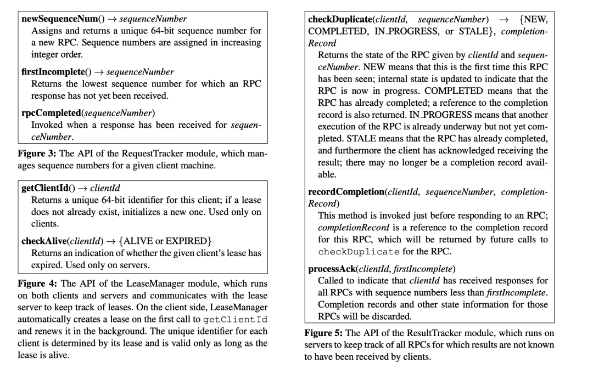

## 为什么要对 command 去重？

在一个接收外部 command 的系统中，通常一个 command 至少要执行一次，我们称其为 at-least-once semantics。如果一个 command 执行失败，系统内部经常会实现一套重试结构来尝试恢复这个问题，这就会引出一个问题：重复命令的提交可能会对系统的状态造成影响。

例如要实现 linearizable semantics (用户的每个操作外部看来是立即执行的、恰好执行一次、在它发起调用和返回之间的某一个时间点执行)，我们就需要对 command 去重。在没有 command 去重的 Raft 实现中，一个 command 可能会被执行多次，leader 可能在 commit 之后返回给 client 期间崩溃，client 如果向一个新的 leader 重试相同的 command ，最后就会导致一个 command 被执行了两次。

解决这个问题可以有两种方案：一种是类似 etcd 的方法，区分出可以重试的命令和不可以重试的命令，将不可以重试的命令的错误结果返回给用户，并不提供任何保证，即使这个命令可能已经被系统执行了。另一种方案是实现一套 command 的 track 机制，检查系统中执行了的命令来实现 command 的去重，当系统实现了这种去重机制，可以实现 command 执行的 exactly-once semantics，进而实现更高级别的一致性保证。

Etcd 中的 gRPC client interceptor，重试的实现

```rust

// unaryClientInterceptor returns a new retrying unary client interceptor.
//
// The default configuration of the interceptor is to not retry *at all*. This behaviour can be
// changed through options (e.g. WithMax) on creation of the interceptor or on call (through grpc.CallOptions).
func (c *Client) unaryClientInterceptor(optFuncs ...retryOption) grpc.UnaryClientInterceptor {
    intOpts := reuseOrNewWithCallOptions(defaultOptions, optFuncs)
    return func(ctx context.Context, method string, req, reply interface{}, cc *grpc.ClientConn, invoker grpc.UnaryInvoker, opts ...grpc.CallOption) error {
       ctx = withVersion(ctx)
       grpcOpts, retryOpts := filterCallOptions(opts)
       callOpts := reuseOrNewWithCallOptions(intOpts, retryOpts)
       ...
       var lastErr error
       for attempt := uint(0); attempt < callOpts.max; attempt++ {
          if err := waitRetryBackoff(ctx, attempt, callOpts); err != nil {
             return err
          }

          ...

          lastErr = invoker(ctx, method, req, reply, cc, grpcOpts...)
          if lastErr == nil {
             return nil
          }

          ...

          // 在这里基于 callOpts 和 lastErr 判断是否可以重试
          if !isSafeRetry(c, lastErr, callOpts) {
             return lastErr
          }
       }
       return lastErr
    }
}
```

## 去重在什么阶段完成？

首先要清楚去重的目的是什么：防止重复 command 对状态机造成影响。那么就会有两个阶段可以对 command 进行去重，一是接收到 command 的阶段，另一个是在应用到状态机时对 command 去重。

无论是哪个方法，我们都需要一个数据结构来追踪已接收并执行的 command 的进度，这样才可以对客户端发来的 command 去重处理。

在应用到状态机阶段时进行 command 的去重处理，自然可以利用状态机的后端存储来获取到之前执行的 command （例如 Log::get_cmd_ids 可以获取 log 中所有的 command id），利用这个 command id set 可以对即将应用到状态机的 command 进行去重处理。

在接收到 command 阶段进行去重处理，就需要额外维护一套数据结构进行处理，通常这套数据结构需要维护在内存中保证高效的读写速度，所以要求这套数据结构不能占用非常大的空间，可能要具备 GC 的机制。

对于第一种方案，首要的问题是 log compaction 机制会让去重机制失效。在 raft 系统中，大家都会实现 log compaction 来避免 log 占用过多内存，如果一个 command log 已经被 compact，那么下次接受到相同的 command 就无法去重了。其次的问题是重复的 command 会在发送到状态机之前还会进行 prepare，speculative execute 处理，消耗额外的 CPU，最后的问题就是读状态机的操作是昂贵的，这种去重手段的性能损耗会很大。

综上，我们可以确定在接受到 command 的阶段就进行去重处理，尽早地拒绝重复 command 的提交。

## 目前的 command 去重设计的缺陷

Xline curp 内的 command 是一个靠外部实现的 trait，我们没有像 etcd 一样区别对待一些 command 的重试行为，所以我们没有在 command trait 中定义是否具有重试的特征。

目前 curp client 中对所有的 command 都会有重试，所以我们在 curp server 处实现了一套简单的去重机制：

CommandBoard 中有一个 IndexSet，用于记录之前已经执行过的 command 的 ID

```rust

 /// Command board is a buffer to track cmd states and store notifiers for requests that need to wait for a cmd
#[derive(Debug)]
pub(super) struct CommandBoard<C: Command> {
    ...
    /// The cmd has been received before, this is used for dedup
    pub(super) sync: IndexSet<ProposeId>,
    ...
}
```

于是我们可以在 O(1) 的开销下在 propose 阶段对命令进行去重

```rust

pub(super) fn handle_propose(
        &self,
        cmd: Arc<C>,
    ) -> Result<((Option<ServerId>, u64), Result<bool, ProposeError>), CurpError> {
        ...
        if !self.ctx.cb.map_write(|mut cb_w| cb_w.sync.insert(id)) {
            return Ok((info, Err(ProposeError::Duplicated)));
        }
        ...
    }
```

为了保证 CURP 在发生 leadership transfer 时不会丢失当前正在的执行的 command 的 ID，我们在恢复 Speculative Pool 中也会恢复这个结构

```rust
/// Recover from all voter's spec pools
fn recover_from_spec_pools(
        &self,
        st: &mut State,
        log: &mut Log<C>,
        spec_pools: HashMap<ServerId, Vec<PoolEntry<C>>>,
) {
        ...
        for cmd in recovered_cmds {
            let _ig_sync = cb_w.sync.insert(cmd.id()); // may have been inserted before
            ...
        }
    }
```

最后为了避免这个 IndexSet 占用过多内存，之前在 Xline 源码解读文章中提到的 GC 机制会定时清理这个结构。

不过，在极端的网络条件下，client 在发起 command 和收到返回之间的间隔超过了 GC 的间隔，IndexSet 中记录的 ProposeId 被 GC 清理了，client 重试这个命令会导致这个命令的去重失效。

我们在 madsim 的测试中发现了这种极端情况（由于 madsim 的时钟的流速比现实快很多，最后触发了这种问题），需要提出一个新的去重结构来解决问题。本文的后半部分将介绍 RIFL(Reusable Infrastructure for Linearizability) 的工作原理，后续的文章中我们将详细介绍如何在 Xline 中实现 RIFL。

## RIFL 介绍

RIFL (Reusable Infrastructure for Linearizability), 是一种在大规模集群中保证 RPC(command) exactly-once semantics 的一套基础设施。为了将 RIFL 的术语和 Xline 系统的术语的统一，本篇章中 RPC 和 Command 具有相同的语义。

### RIFL 简介

在 RIFL 中，首先要给每一个 RPC 分配一个 unique identifier，它由一个 64-bit 的 client_id 和在这个 client_id 下分配的 64-bit 的递增 sequence_number 组成。

client_id 需要由一个 system-wide 的结构生成，在 RIFL 中使用了一个全局的 Lease Manager 模块实现，Lease Manager 会为每个 client 分配一个 client_id，并创建一个与之对应的 lease，client 需要不断 keep alive 这个 lease，server 则需要检查这个 lease 来判断 client 是否崩溃。

其次，RIFL 需要一个 RPC 的完成记录和追踪信息持久化，然后，RIFL 在系统迁移时，RPC 的完成记录也需要一并迁移，这样可以保证 RIFL 在系统迁移过程中也能保证 RPC 不会重复执行，重复执行的 RPC 将会直接取出之前的完成记录。

最后 RPC 的完成记录需要在 Client 确认下清除（或者 Client 的奔溃后清除），这样可以安全地清理掉一些不必要的存储。

### RIFL 具体组件及功能

下面是 RIFL 中的一些主要组件以及对应的功能：

1. Request Tracker: 在 client 端追踪发送出去的命令  
   a. newSequenceNum(): 为一个 RPC 生成一个递增的序列号  
   b. firstIncomplete(): 获取当前最小的还未收到 RPC 回复的序列号  
   c. rpcComplete(sequenceNumber): 标记当前 sequenceNumber 为收到，后续用于更新 firstIncomplete

2. Lease Manager: 一个统一的 Lease Manager 模块，client 使用它为 client_id 续租, server 使用它检查 client_id 的租约是否到期
   a. getClientId(): client 获取自己的 client_id，如果不存在的话就询问 lease server 创建一个
   b. checkAlive(clientId): server 检查这个 client_id 的租约是否到期来判断该 client 是否存活

3. Result Tracker: 在 server 端追踪接收到的命令，以及 client 确认的进度
   a. checkDuplicate(clientId, sequenceNumber): 根据完成记录来判断这个 RPC 是否重复
   b. recordCompletion(clientId, sequenceNumber, completionRecord): 在返回给 client 之前标记这个 RPC 为已执行，并存储 completionRecord
   c. processAck(clientId, firstIncomplete): 为这个 client 回收 firstIncomplete 之前的所有 RPC 的完成记录。



当 Server 收到一个 RPC(client_id, seq_num, first_incomplete) 时，会根据 checkDuplicate 来检查这个 RPC 的状态：

1. NEW: 一个新的 RPC，按照正常的逻辑处理请求
2. COMPLETED: 一个已经执行完成的 RPC，返回执行完成的记录
3. IN_PROGRESS: 一个正在执行的 RPC，返回 IN_PROGRESS 错误
4. STALE: 一个已经被 client 确认回收的 RPC，返回 STALE 错误

其次，Server 会根据传来的 RPC 中 first_incomplete 字段来调用 proccessAck，回收掉已经被确认的 RPC 的完成记录。最后，当这个 RPC 执行完成，返回给 Client 之前，会调用 recordCompletion 来将完成记录持久化，并标记这个 RPC 为 COMPLETED。

除此之外，Server 会检查 client_id 的租约是否还有效来判断一个 client 是否还存活，如果失效，则回收掉这个 client_id 下的所有的完成记录

## RIFL 性能分析

在 RIFL 的结构中，很容易发现一处开销来自于 client 和 server 与 Lease Manager 之间通信的开销，RIFL paper 中提到了 server 可以缓存某个 client_id lease 的过期时间，在即将过期时查询 Lease Manager，这样可以省去一些的网络通信。

在上述的过程中 checkDuplicate 或者 proccessAck 中至少会有一个 O(n) 复杂度的操作（按 sequenceNumber 顺序记录进行 checkDuplicate 或者无序记录 sequnceNumber 但需要遍历过滤小于 first_incomplete 进行 processAck），和之前使用 IndexSet 方案的 O(1) 复杂度相比，RIFL 会在这里会有一部分开销。我们可以将 processAck 单独作为一个 RPC 用于通知 server 回收完成记录来优化一些性能。

最后，由于回收的第一种机制仅是检查 first_incomplete，这可能会遇到某个耗时很长的 RPC 阻塞了回收后续 RPC 的完成记录，最后可能导致 server 内存占用过多。RIFL paper 中提到了可以为某个 client 设置最大 inflight RPC 的数量，过多的 RPC 将会被拒绝，另外，也可以考虑提前回收后续的 RPC 完成记录，这样可能会使 RIFL 更加复杂。

### 小结

以上是 RIFL 为 unary RPC 维护 exactly-once semantics 的机制，paper 中 §6 Implementing Transactions with RIFL 中描述了 RIFL 对多个对象的 transactions 维护 exactly-once semantics 的机制，由于 Xline 系统的 transaction 会作为一个单一 command 发送给 server，所以不需要单独处理，感兴趣的读者可以看看，这里就不展开赘述了。

## Summary

本文前半部分从 command 去重机制的契机开始，介绍了去重的必要性以及目前 Xline 的去重机制存在的一些问题。后半部分详细讲解了 RIFL(Reusable Infrastructure for Linearizability) 的工作原理，并对其进行了一些性能分析。后续的文章中将继续介绍我们是如何将 RIFL 应用到我们的 Xline 当中，以及对 RIFL 做了哪些必要的更改与优化。
