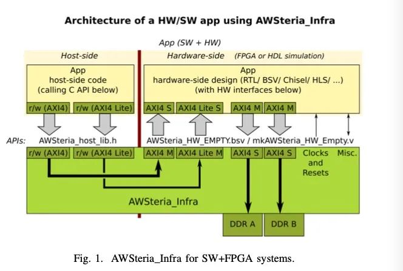

这篇介绍Bluespec以及设计示例的文章，是在2021年ICCAD（International Conference On Computer-Aided Design）发布的论文。**达坦科技的open-rdma项目和推广的MIT体系结构学习社区都用到Bluespec**，因此将此论文翻译成中文，以便大家了解2020年Bluespec开源后相关的开源项目。

Science Technology

**摘要：** bsc编译器是一个商业可用的编译器，在过去的二十年中被广泛使用，于2020年1月作为免费开源工具发布。本文简要介绍了bsc及其流程，提供了可用的教程材料，并介绍了多个可重用的开源设计案例，其中许多设计聚焦在RISC-V上（覆盖了从嵌入式到支持Linux的CPU和系统），所有设计均可部署在FPGA上。

## I. 引言

自2000年以来，bsc编译器及其库就一直在作为一款商业软件被开发。二十余年来，它曾是Bluespec公司的一款授权产品，尽管学术和研究许可证一直以来都是免费提供的。几家顶级半导体供应商和一家主要的搜索公司曾使用bsc来设计最新ASIC SoCs中复杂的IP。它被许多公司用于基于FPGA的原型开发，并且在许多大学里用于构建体系结构和复杂IP的研究。

2020年1月，Bluespec公司以BSD 3-Clause许可证的形式免费开源了编译器、库以及一个图形用户界面。这些可以在以下网址找到：  
https://github.com/B-Lang-org/bsc  
https://github.com/B-Lang-org/bsc-contrib  
https://github.com/B-Lang-org/bdw  
bsc编译器接受以高级硬件描述语言BSV和BH（如下所述）编写的设计作为输入，并生成可用于标准RTL工具（仿真、综合、形式分析等）处理的Verilog代码。

本文将简要介绍BSV和BH、bsc及其流程，以及使用BSV/BH编写的几个免费开源设计。其中，许多设计都是RISC-V设计（包括CPU、IP和系统），并且这些设计都是高度可复用的，并可在FPGA上运行。

## II. BSV和BH高级硬件设计语言的背景

BSV和BH起源于20世纪90年代在麻省理工学院的研究中[10]，当时James Hoe和Arvind确认了将并发原子事务表达的行为编译高质量Verilog的可行性。这是很有吸引力的，因为它给对复杂并发系统进行形式化规范说明和分析的行为模型（例如，TLA+ [11]，Event-B [12]，UNITY [7]）提供了一种选择。由于能够将这样的形式化规范说明编译成高质量的硬件，它可以成为自动化实现形式规范说明到实际硬件之间的桥梁。

启用组合形式验证一直是BSV/BH的核心动机和特性（例如，请参见MIT的Kami项目，网址为https://github.com/mit-plv/kami）。原子事务语义还能够在日常的非形式化验证中帮助工程师增强系统的正确性。

在2000年，Lennart Augustsson在一种新的语言BH（Bluespec Haskell）中实现了这些想法，该语言使用Haskell的语法和语义，包括具有多态和类型类的类型系统、单子和高阶函数，从而使其具有静态展开能力和非常强大的类型抽象和类型检查能力[2]，[14]。

在2004-2005年，我们创建了BSV，它只是一种新的，类似于SystemVerilog的前端语法[6]，但在其他方面保留了BH的类似于Haskell的表达能力。

在2005年，我们引入了对多个时钟和复位域的支持。强类型检查确保不可能将时钟和复位信号与普通信号混合在一起。通过bsc的静态检查保证了正确的时钟域规范。

### A. HLS与RTL、Chisel和其他硬件描述语言的比较

BSV/BH、VHDL、Verilog、SystemVerilog和Chisel[3]都是硬件描述语言（HDL）：设计者直接描述架构和微架构。在这方面，它们与所谓的“HLS”（高级综合）[9]完全不同，HLS工具会自动生成架构和微架构（这可能是在设计者的高级指导下进行的）。但这并不意味着HDL必须是低级的：强大的抽象和组合机制允许像描述低级微架构一样流畅地描述高级参数化架构[14]。BSV/BH通过模仿Haskell实现了这一点，而Chisel则通过嵌入到Scala中实现了这一点。

BSV和BH与像Lava[5]这样侧重于强大的、正确的电路结构组合机制，而不关注行为的语言有所不同。与其他直接表达架构的HDL一样，BSV/BH是通用的，不针对任何特定的应用领域。BSV/BH与所有其他HDL之间最基本、最具广泛和最重大的区别可能在于选择并发原子事务作为其表达行为的中心（也是唯一）方式。

## III. BSV和BH设计、bsc编译器和流程

与其他硬件描述语言（HDL）类似，BSV/BH设计是模块实例化的层次结构，但相比其他HDL，由于受到Haskell语言语义启发而具有更强大的静态阐释能力。

与其他HDL不同的是，在BSV/BH中，行为是通过规则来表示的，这些规则是全局原子事务。在其他HDL中，行为通常是通过同步时钟过程来表示的。

与其他HDL不同的是，BSV/BH中的模块间通信是通过从规则（或从其他方法）中调用方法的概念来表达的，而不是基于输入和输出信号线路来表达的。方法调用的概念将规则的原子事务语义扩展为可以跨越模块边界的，即当设计扩展时，原子性会进行组合。模块的接口方法构成了一种一等公民的接口类型。

与SystemVerilog类似，模块、接口和类型可以根据功能划分为称为包的源文件。bsc接受BSV或BH源文件（包）并生成可综合的Verilog代码，这就意味着可以直接使用现有的FPGA和ASIC综合工具。bsc通过单独的包编译实现了大型系统的快速增量重建。

由bsc生成的Verilog代码可以在大多数知名的仿真器上运行，包括开源仿真器（Icarus、Verilator、CVC等）和商业仿真器（Synopsys、Cadence、Mentor、Xilinx）。它可以由大多数著名的综合工具（Design Compiler、Vivado、Quartus以及其他FPGA供应商的工具）进行综合。

### A. 与现有RTL和C语言的互操作性

由BSV/BH中的bsc生成的Verilog可以被实例化在现有的VHDL/Verilog/SystemVerilog模块中。相反地，BSV/BH具有导入机制，可以在BSV/BH设计内实例化现有的Verilog模块。因此，可以在现有的流程中自由混合和匹配BSV/BH与现有的RTL。对于仿真，BSV/BH还具有DPI机制，可以导入任意的C代码。

### B. bsc内部实现和可选的图形用户界面

尽管BSV/BH在语义和类型方面广泛借鉴了Haskell的思想，但它并不是现有Haskell编译器或系统内的DSL。bsc是一个完全独立的、专为此目的而构建的编译器（但它恰好是用Haskell编写的）。bsc与其他HDL编译器（如Verilator和Chisel）的一个核心区别在于规则调度，即生成同步的，带有时钟和控制逻辑的verilog代码，且这些代码保留了原子事务行为语义。bsc使用开源SAT解算器分析规则条件之间的关系，从而产生优化的控制逻辑。

除了生成Verilog代码外，bsc还可以生成C代码，并将其编译为独立的可执行仿真器（Bluesim），它与RTL仿真可以达到时钟周期级别的完全一致，并能够生成VCD文件。

可以使用API中查询和控制编译器生成的中间对象文件。这个API有一个Tcl的Binding实现（bluetcl）；实际上，Bluesim也只是一个Tcl脚本，这个脚本封装并在内部利用了这些API。

尽管所有BSV/BH的开发都可以通过命令行完成，但Bluespec开发工作站（BDW）（https://github.com/B-Lang-org/bdw）提供了一个GUI界面，用户可以从中探索源代码层次结构，进行编译、构建和运行模拟，并在外部的VCD查看器（如GtkWave）上观察波形。BDW可以配置GtkWave以显示BSV源代码级别的波形类型（枚举、结构体、联合体、向量），而不是Verilog的扁平信号总线。BDW还提供了规则调度的图形显示，以帮助理解bsc如何将原子事务规则映射到时钟逻辑中。

## IV. 教程和书籍

有多种免费和开源的教程资源可供学习BSV/BH和使用相关工具。https://github.com/BSVLang/Main 包含了Bluespec公司提供的BSV/BH免费开放培训课程，以及BSV by Example书籍的免费PDF副本 [15]。在参考文献[16]中，我们提供了"使用开源BH设计硬件系统和加速器"这个教程的教材链接和视频录像。此教程是在2020年国际函数式编程大会上进行的。麻省理工学院（美国）、卡内基梅隆大学（美国）、剑桥大学（英国）、首尔国立大学（韩国）、印度马德拉斯理工学院（印度）和达姆施塔特工业大学（德国）多年来一直在本科和研究生课程中使用BSV进行教学；其中一些教材可以在他们各自的公共网站上获取。在接下来的章节中列出的开源设计也是学习BSV/BH的丰富示例资源。

## V. BSV和BH示例设计

多年来，许多公司都在产品ASIC SoCs中使用BSV和BH来开发复杂的IP子系统。这些包括用于机顶盒的一对多高速视频数据传输器，用于手持设备的显示控制器以及AI芯片加速器。许多公司利用BSV强大的抽象机制和类型系统，加速在FPGA上的原型设计以及后续的ASIC设计。虽然这些示例展示了BSV/BH和bsc的强大、可扩展和成熟性，但它们并不以开源的形式提供。

然而，Bluespec公司和一些领先的大学提供了许多采用自由开源许可的设计；下面介绍其中的一些样例。其中大多数设计都相当庞大，并且可能非常具有吸引力。尽管这些设计是用BSV编写的，但bsc可以将它们编译成Verilog，并且它们可以作为IP在其他采用RTL设计的项目中使用（参见上文的"互操作性"）。

### A. 开源RISC-V处理器（Bluespec, Inc.）

Bluespec公司开源了一系列的RISC-V处理器设计，从非常小型的（用于嵌入式和微控制器应用）到非常大型和复杂的。它们都可以在https://github.com/bluespec下面的Apache License, Version 2.0下获取。

- Piccolo: 3级顺序流水线，独立的I和D通道。
- Flute: 5级顺序流水线，具有分支预测，独立的I和D通道。
- Toooba: MIT的RISCY-OOO中的一个软件包[20]：乱序执行，超标量，深度流水线，分支预测，独立的具备缓存一致性的I和D通道，多核，缓存一致性。

Piccolo和Flute可以参数化为构建标准的RISC-V非特权ISA选项的任意组合：RV32或RV64，I（整数），M（整数乘法/除法），A（原子操作），C（16位压缩指令）和FD（单精度和双精度IEEE浮点）。它们还可以选择为特权ISA级别M（机器），S（监管者）和U（用户）进行配置。对于S，它们支持标准的Sv32和Sv39虚拟内存方案。因此，它们都支持Linux。此外，这些处理器可以参数化为由简单到复杂的一系列不同内存系统实现：TCM（紧密耦合内存），仅L1（写回或写直通），以及具有缓存一致性的I-L1 + D-L1 + 共享L2。

Toooba中的MIT RISCY-OOO处理器可以根据核心数量、超标量性、投机程度、重排序缓冲区和分支预测的大小和组织形式、MMU和缓存的大小及其组织形式等进行参数化。

### B. RISC-V系统的开源IP（Bluespec，Inc.）

以下IP可以在https://github.com/bluespec下面的Apache License, Version 2.0下获取：

- 调试模块：与RISC-V处理器相邻的符合RISC-V规范的硬件模块，用于远程GDB控制。
- PLIC（平台级中断控制器）：符合RISC-V规范的中断控制器，用于将外部设备的中断分配给一个或多个RISC-V核心。
- AXI4和AXI4 Lite接口的实现，以及它们的互联实现。
- 前面部分描述的内存系统（紧密耦合内存，带或不带缓存一致性的L1和L2缓存）也可以作为其他RISC-V设计中的IP进行重用。

### C. AWSteria用于主机+FPGA系统的 Infra和Connectal

AWSteria Infra是一个使用BSV编写的系统，用于简化由主机计算机上的软件与FPGA上的硬件进行通信的应用程序的设计。图1显示了AWSteria Infra和一个应用程序的结构。主机上的C代码和FPGA上的BSV代码为应用程序提供了简单的接口（AXI4和AXI4 Lite）。FPGA上的BSV代码还提供了对FPGA板上DDR内存的简单接口（AXI4）。这些接口类似于亚马逊的aws-fpga开发工具包中提供的所谓“shell”，但可用于更广泛的平台。

AWSteria Infra实现可用于RTL模拟（使用TCP/IP进行通信），以及用于Xilinx VCU118和AWS F1 FPGA系统（两者都使用PCIe进行通信）。未来将支持更多平台。它可在Apache License 2.0下的https://github.com/bluespec/AWSteria Infra获取。

Connectal也是使用BSV编写的，具有相同的整体目标，但提供了主机-FPGA通信的“远程方法”模型，可在双向上进行通信。它支持更广泛的平台，可在 MIT 许可下从 https://github.com/cambridgehackers/connectal获取。

### D. AWSteria-RISCV-Virtio (Bluespec, Inc.)

 AWSteria-RISCV-Virtio是在FPGA上运行的RISC-V系统，可以启动多用户FreeBSD（它也支持Linux，但尚未测试）。它可以访问网络和块存储设备，甚至在没有（可访问的）内置网络或存储设备的云FPGA板上也可以做到这一点。它使用了一种名为"Virtio"的开放标准[18]，该标准最初用于虚拟化领域，旨在为横跨多个主机的虚拟机监视器的客户操作系统提供可移植的设备服务。

图2显示了AWSteria-RISCV-Virtio中的组件。FPGA端是一个带有BSV CPU（Flute, Toooba）、调试模块、PLIC、DDR内存、UART和用于Virtio的MMIO-to-host系统。主机端代码为RISC-V CPU提供了控制台TTY I/O、RISC-V CPU的GDB控制以及向RISC-V CPU上的操作系统提供Virtio设备服务（网络、块存储等）。主机端的Virtio设备由TinyEMU提供，这是Fabrice Bellard的用于RISC-V的开源系统仿真器[4]（一个较小且较简单的版本的QEMU）。主机可以对FPGA DDR进行具有高速缓存一致性的访问，这是Virtio所需的。

该系统构建在AWSteria Infra（第V-C节）之上，因此可以直接在任何受支持的平台上使用（当前支持RTL仿真、亚马逊AWS F1和Xilinx VCU118板）。AWSteria-RISCV-Virtio可在https://github.com/GaloisInc/BESSPIN-CloudGFE/tree/rsn3/AWSteria RISCV Virtio获取（将很快移至https://github.com/GaloisInc/BESSPIN-CloudGFE）。

### E. 安全RISC-V (剑桥大学)

剑桥大学多年来一直在研究CHERI：能力型硬件增强的RISC指令。指令和内存系统被增强为具有“能力”，以实现安全计算，即消除传统设计中的安全漏洞[19]。这些设计是用BSV编写的，可在https://github.com/CTSRD-CHERI获得，采用基于Apache License 2.0的许可证。

### F. Shakti RISC-V 处理器(马德拉斯理工学院)

印度理工学院马德拉斯分校的Shakti计划正在构建一系列基于RISC-V的生产级处理器、SoCs、开发板和软件平台。这些处理器和SoCs是使用BSV语言编写的，并可在https://gitlab.com/shaktiproject上根据BSD 3-Clause许可证进行获取。

### G. 片上网络生成器（卡内基梅隆大学）

CMU的Papamichael和Hoe开发了CONNECT，这是一个适用于FPGA的任意拓扑结构的多节点NoC（片上网络）生成器[17]。CONNECT是他们在MEMOCODE 2011硬件/软件协同设计竞赛中获奖作品的基础。最近，CONNECT已以BSD 3-Clause许可证的形式在https://github.com/crossroadsfpga/connect上开源。

### H. BlueCheck 通用硬件测试平台 (剑桥大学)

BlueCheck是在BSV中实现的Haskell的QuickCheck [8]，利用BSV包含的与QuickCheck使用相同的Haskell特性：多态类型和类型类、单子和高阶函数。就像QuickCheck一样，它具有以下特点：

- 从接口类型自动生成测试序列，支持覆盖默认值；
- 迭代加深：生成更长的测试序列；
- 收缩：在找到失败时自动缩短测试序列；
- 完全可综合化（以BSV编写）：Trstbench可以在FPGA上以DUT的速度运行。它可在https://github.com/CTSRD-CHERI/bluecheck上获取，遵循BERI硬件-软件许可证第1.0版。

**原文链接：**
https://woset-workshop.github.io/PDFs/2021/a02.pdf