**摘要：**  
领域特定架构已成为计算机发展的一种趋势。在提供更高效算力的同时，它也给底层硬件的开发带来了更大的挑战。传统的芯片设计和验证技术已越来越无法应对这些新的要求和挑战。在芯片设计上，本文将介绍如何使用SpinalHDL，一种基于Scala的新型硬件描述语言（HDL），或者更准确地说是硬件构造语言，提高硬件设计的效率和质量。对于SpinalHDL，本文还介绍了如何利用Scala的类型系统高效地进行复杂硬件的设计。对于验证，本文将介绍基于Python的验证环境Cocotb，以及如何利用Python简洁高效的语言特性及其繁荣的开源社区，提升芯片验证的效率。

## 引言

### 1.1 背景

近年来，计算需求不断演进并且多样化。就高性能计算而言，过去二十年间，互联网的迅速扩张产生了大量的数据，而深度学习等技术提供了许多有效利用这些数据的方法。然而，这些技术的实现对大规模高性能计算能力有着强烈的需求。例如，深度神经网络发展中的一个里程碑AlexNet的实现，很大程度上依赖于Nivida GPU的使用，后者为运行这一模型提供了足够的计算能力。与此同时，在工业应用中，提供节能型硬件以降低成本同时提供高计算能力也是相当重要的。在低功耗计算方面，随着物联网的快速发展，芯片的应用场景变得多样化，我们希望为每种场景选择最适合的芯片，这提出了多样化的芯片开发需求。

随着摩尔定律和丹纳德缩放的减速，简单地通过提高CPU或GPU性能来实现这种计算能力的增长已经不能满足需求。而且，简单地将低功耗CPU部署到边缘场景无法满足低功耗和定制功能的需求。因此，许多特定领域架构设计任务出现了，其中大部分呈现出软硬件协同设计的范式。硬件架构的研究和设计成为业界和学术界的热门话题，毫无疑问，当前正处于架构创新的黄金时代。这也是硬件描述语言（HDL）创新最好的时代，因为HDL是描述计算机架构最直接的方式，我们需要更高效的HDL来加快我们的架构设计实现。

与这些新兴的设计需求相比，目前业界主流的设计工具远远落后。Verilog和VHDL已经超过30年历史了，而SystemVerilog在设计方面只是对Verilog进行了一些小修改。与C等经典语言不同，Verilog/VHDL并没有通过多个版本的迭代演进，也没有发展大量的第三方库来补充语言，因此在很大程度上，我们使用Verilog/HDL时仍然像它们最初发布时一样。

### 1.2 HDL的演变

**1.2.1 主流HDL的历史**

传统HDL的历史可追溯到20世纪60年代，其中在20世纪80年代发布的Verilog和VHDL是最受欢迎的两种语言。Verilog和VHDL被认为是HDL的黄金标准，因为几乎所有电子设计自动化（EDA）工具都广泛支持它们。

最初，Verilog和VHDL用于记录和模拟以其他形式捕获和描述的电路设计，比如原理图文件。换句话说，它们并不是为了描述数字同步集成电路（IC）的RTL级模型而设计的。Verilog和VHDL的“读者”被认为是一个模拟器，而不是一个综合工具或工程师。在实践中，逻辑综合为HDL的引入将HDL从后台推到了数字硬件设计的前台，为此添加了“可综合”规则，但这些规则从未成为语言标准的一部分。

21世纪的第一个十年见证了SystemVerilog的出现，它是Verilog的超集。在验证方面，SystemVerilog借鉴了许多高级语言的特性，例如面向对象、更丰富的类型系统等。然而，在设计方面，它只是添加了一些功能，例如：  
- 增强的类型系统，包括枚举、联合等。
- 带有接口的强度输入/输出描述。
- 通过引入新的always comb、always ff和always -latch关键字，限制对敏感性列表的使用。

尽管如此，这些新引入的SystemVerilog设计功能直到现在也没有得到EDA供应商的全面支持，因此单独这些变化并不能使其具备处理复杂的软硬件协同设计任务的能力。

**1.2.2 其他HDL的历史**

与Verilog/VHDL不同，功能型HDL可以追溯到上世纪70年代，最早用于硬件形式化。众所周知，最早用于描述硬件的记号系统可以追溯到约翰·李的著作《计算机语义学》。与早期不同的是，自上世纪90年代以来，开发新的用于数字硬件设计的HDL有两个主要趋势：首先，鉴于Verilog和VHDL是主流EDA的事实标准，为了避免构建新的特定于某种语言的工具链，开发者选择首先生成Verilog/VHDL代码，然后使用生成的代码进行后续流程，包括综合和实现。在这种情况下，Verilog/VHDL的作用类似于汇编语言或新HDL与现有工具链之间的接口层。更精确地说，这些新的HDL，如Spinal、Chisel和Clash，通常被定义或称为HCL（HCL：Hardware Construction Language）。在本文中提到的HCL仍然是HDL的一部分，因为它们可以执行HDL的所有功能。这意味着单个HCL的内容必须是Verilog/VHDL核心部分的超集。

其次，与从头开始不同，大多数这些新的HDL都嵌入到流行的高级编程语言中，或更准确地说，它们可以被视为高级程序语言的库。因此，它们可以重用现有成熟语言的基础设施，包括它们的编译器、测试系统、包管理系统、IDE（IDE：集成开发环境），以及最重要的是它们的社区。这种策略降低了学习的难度，并使这些新的HDL非常可扩展。例如，Lava（及其方言）和Clash嵌入到Haskell中，Chisel和SpinalHDL嵌入到Scala中，MyHDL嵌入到Python中。

## SpinalHDL

### 2.1 SpinalHDL简介

正如上面提到的，SpinalHDL[3]是基于Scala的HCL，或更准确地说，是Scala中的一个包，专用于数字芯片设计。与Chisel类似，SpinalHDL也是基于Scala的，并且主要用于RISC-V CPU设计。在Spinal中设计硬件的过程主要可以分为三个步骤：1）使用Scala和SpinalHDL包来描述硬件设计的结构和逻辑；2）编译和执行Scala程序，生成对应的SystemVerilog/VHDL代码，该代码与Scala代码描述的结构相同；3）使用任何类型的模拟器，如Iverilog、Verilator或Synopsys VCS，进行硬件模拟和验证。SpinalHDL基于传统的Verilog或VHDL进行硬件设计过程。Scala程序不能直接用于硬件模拟，而是需要首先执行以生成Verilog或VHDL代码，这意味着现有丰富的基于Verilog的设计工具链，包括模拟器、综合器和FPGA开发套件，可以在整个设计过程中使用。

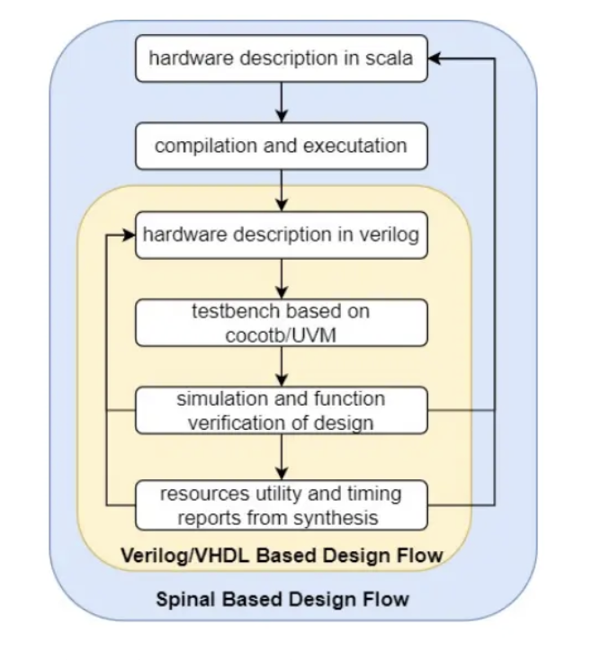

图1：基于SpinalHDL的设计流程

### 2.2 与传统HDL相同的描述粒度

与软件开发相比，SpinalHDL对于以Verilog为代表的传统HDL来说就像Java、C/C++和Python等高级编程语言对汇编语言的作用一样。显然，高级语言比汇编语言更具表达力和生产力，并大大降低了开发复杂软件系统（如操作系统）的难度。尽管高级编程语言提高了软件开发的效率，但与汇编语言相比，程序的性能也受到了很大的牺牲。类似地，与传统HDL相比，SpinalHDL具有各种优势，并提高了设计数字硬件的效率。然而，与高级语言不同的是，它不会牺牲生成的硬件的性能和资源利用率，而是简化和加速设计过程。SpinalHDL与传统HDL（如Verilog或VHDL）几乎具有相同的描述精度或粒度。它可以精细控制寄存器的数量和寄存器之间的逻辑路径的长度。关于近似描述粒度的最佳证明是，对于Verilog/VHDL中的所有RTL级语法元素，SpinalHDL都有对应的对应元素。为了明确起见，我们在图2中显示了RTL级描述的所有基本元素，并在表1中列出了从SpinalHDL到Verilog的映射。如图2所示，RTL级描述是具有一个或多个时钟域的同步数字系统的形式化定义，基本上由以下五个部分组成：

- 时钟域。
- 组合部分在图2中表示为f(x)。
- 顺序部分，通常是寄存器和存储器，在图2中表示为DFF。
- 信号和连接，在图1中块之间表示为线（信号）。
- 输入/输出（接口）。

图2：RTL级别描述中的元素。

对于这五个部分中的每一个，SpinalHDL提供了完整的相同描述能力，列在表1中。对于最坏情况，尤其是对于初学者来说，您可以使用SpinalHDL作为带有不同关键字集的Verilog/VHDL。因此，对于因语义失真而导致性能损失的担忧是不必要的。

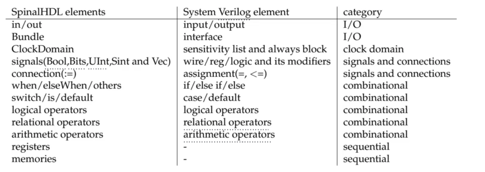

表1：从SpinalHDL到Verilog的映射。

### 2.3 SpinalHDL相比传统HDL的优势

**2.3.1 可靠性**

使用SpinalHDL可以大大提高程序的可靠性，减少错误的可能性，从而减少验证和调试所花费的时间，加快项目开发的速度。SpinalHDL生成的代码的可靠性来自于以下方面：更精确的模型：对于表1中的时序类别，包括寄存器和内存，在Verilog中没有直接的语法元素。实际上，对于Verilog而言，寄存器的实现要求综合工具根据always关键字的敏感性列表中信号的行为推断出时序部分。这一思想，请见图3所示。

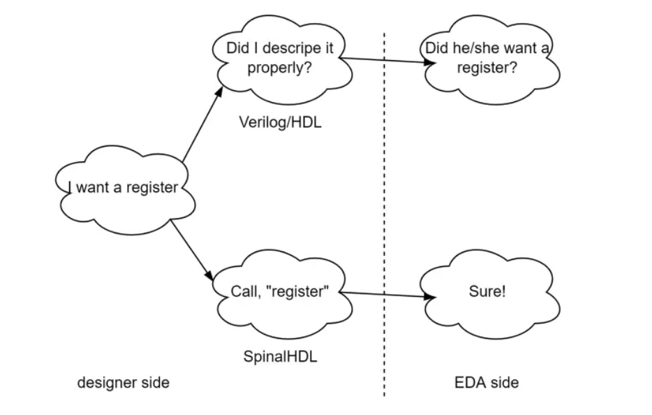

图三：在 Verilog/VHDL 中设计寄存器的笨拙流程

在实践中，Verilog的用户有时会通过将寄存器和内存封装在模块中并实例化它们来确保正确的描述。但是在SpinalHDL中，这些已经在语言层面上实现。为了避免使用令人困惑的always块和敏感性列表，SpinalHDL还直接描述了时钟域和时序元素。与此同时，Verilog中的阻塞和非阻塞赋值已经不再必要，可以在SpinalHDL代码的任何地方应用相同的赋值方法“:=”（我们更愿意称其为“连接”或“驱动”）。

此外，SpinalHDL为信号提供了更丰富的类型系统，通过这些更具体的定义，将类型与其行为绑定在一起。信号不仅可以通过Verilog中的“wire”或“reg”进行定义，还可以通过Spinal中的“Bits”、“Bool”、“UInt”、“SInt”和“Vec”进行定义，并且通过这些更具体的定义具有更明确的语义。例如，“Bits”和“UInt”都表示具有多位的信号，但是只能在“UInt”类型中应用算术运算，不允许对“Bits”进行计算。

更早的设计规约检查：有了更精确的模型，可以在设计流程的早期阶段检查更多的设计规约，包括：
1. 类型系统可以发现的语义问题，例如Spinal中的“Bits”类型不能参与算术运算；
2. 由隐式宽度扩展或缩小引入的问题；
3. 在生成Verilog/VHDL代码之前可以发现锁存器。因为您已经“绘制”了描述元素及其连接的图表。

分离设计元素和仿真元素：鉴于Verilog和VHDL最初是为仿真和文档编写而开发的，一些语法元素必须在设计和仿真中发挥双重作用。出于向后兼容性考虑，类似SystemVerilog的Verilog更新无法解决这个问题。尤其对于初学者来说，很容易混淆可综合和不可综合的Verilog语法。

一个例子是对'if/else'的使用。在Verilog中，它们被用于模拟软件条件和硬件复用器，这有时会引起混淆。在SpinalHDL中，我们使用'when/elseWhen/others'来模拟硬件复用器，因此可以“自由”地使用'if/else'来表示软件条件。

一般来说，SpinalHDL中没有“可综合”这样的概念，只要代码可以执行并生成Verilog代码，它就自然“可综合”。唯一的例外是内存的行为可能不是“可综合”的，这取决于FPGA架构或提供给ASIC的工艺库。

总结来说，通过以上特性，Verilog/VHDL编码的许多设计规则成为了语言本身的内置特点。因此，设计者不需要刻意记住和遵循这些规则，从而能够产生更可靠的代码。

**2.3.2 更强的表达能力**

在参数设计方面，SpinalHDL的表达能力优势主要体现在以下几个方面：在Verilog/VHDL中，通过使用参数/泛型来实现参数化（因此是广义的）设计，但是对于复杂的参数化要求，仅在原始的Verilog/VHDL源代码中“替换”一系列参数是不够的。另外，时不时地实例化复杂设计可能会非常令人沮丧。一个典型的例子是Xilinx DSP48E2模块的实例化模板，其中有50多个参数，构成了一个巨大的参数空间，但其中只有几个是有意义的。一方面，仅通过列出这些参数来定义设计是耗时且费力的。另一方面，由于参数之间的关系没有受到内置方法的约束（Xilinx有数百页的文档来描述约束），因此容易出错。

Xilinx提供了几个带有相应初始化模板的IP，以帮助用户配置DSP功能，并在IP生成过程中使用高级语言并提供GUI界面。如果一开始就使用类似于SpinalHDL这样的生成器语言来描述模块，则可以节省额外的GUI程序，并且可以以更紧凑的方式实现整个项目，避免引入黑盒（IPs）。具体来说，我们可以在SpinalHDL中设计一个配置类来管理各个配置项及其之间的约束关系。

软硬件协同设计的能力：软硬件协同设计适用于复杂算法的硬件实现。复杂的软硬件协同设计需要根据算法的需求灵活实现硬件。我们简要总结这种协同工作为以下几种情况：如图4所示，在最简单的情况下，算法决定硬件参数的生成方式。

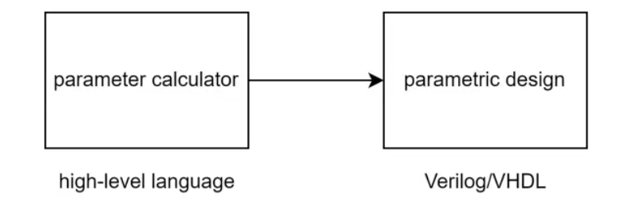

图4：软硬件协同设计的最简单情况。

在更复杂的情况下，许多硬件设计本身无法直接描述，但可以通过算法来描述。例如各种网络拓扑、并行算法等。算法不仅确定了硬件的参数，还确定了硬件应包含的部分、不应包含的部分以及如何进行结构和路由。这要求我们的硬件描述语言也能够容纳更复杂的算法。仅通过带有参数的Verilog无法实现这种程度的协同工作。

另外，硬件设计的另一个考虑因素是并行性。如果我们的应用程序有一个高效的并行算法，往往可以将算法重写为硬件生成算法，这将大大减少设计时间并提高设计可靠性。在SpinalHDL中，可以通过来自您组织或第三方库的可靠Scala/Java算法来实现这一点。

强大的生成能力：SpinalHDL通过使用Scala语言的特性来实现算法的复杂硬件生成，包括：
1. 使用集合方法对信号进行简洁准确的“信号批处理”。
2. 使用复杂条件和递归来处理不同大小的问题。
3. 重用现有的Scala甚至Java代码，以减少开发时间并增强设计可靠性。

图5：Benes网络硬件：开关、路由和控制字ROM。

在图5中，我们以Benes网络的硬件结构为例，说明了这些特性带来的好处：在此硬件的设计中，上述每种语言特性的特定应用被指定：

1. 在描述网络拓扑块时，我们使用Scala中的“Seq”集合类型及其方法，如“map”、“zip”和“foreach”，以简洁的方式描述连接。
2. 通过递归，我们提供了生成任意大小网络的方法。
3. 生成Benes网络控制字的过程是解决一系列二着色问题的过程，我们直接将JGraphT (一种Java图论库)中的贪婪着色算法“org.jgrapht.alg.color.GreedyColoring”，集成到我们的SpinalHDL代码中解决这个问题。

使用Verilog/VHDL几乎不可能完成这个设计。但是通过HCL来完成是很常见的，因为实际上，设计者是使用高级语言作为Verilog生成器而不是直接描述硬件结构。

近年来，领域特定的加速器设计已成为一个重要的课题。这些任务基本上以“将算法实现映射到硬件”形式表达。由于SpinalHDL的便利性，这些特性变得越来越重要，能够更好地实现复杂算法的实现。

**2.3.3 可重用性：**

与传统的硬件描述语言相比，SpinalHDL具有更好的可重用性，可以极大地提高开发效率。具体而言，通过SpinalHDL的更好可重用性，你可以更方便地在现有的高质量代码的基础上构建自己的设计。同时，通过逐步建立自己的代码库，你可以积累自己的能力和经验。随着时间的推移，你在重复性工作上花费的时间越来越少，更多的精力可以用来解决有价值的问题。只有在低成本的代码重用情况下，才能形成和发展一个开源硬件社区。SpinalHDL的可重用性主要来自以下几个方面：

一些基本设计元素的良好封装：SpinalHDL本身为我们提供了一些基本且频繁使用的元素的良好封装，例如StateMachine、Stream、Flow和多种类型的总线。通过使用这些良好封装，你不必从头开始构建设计，这可以提高效率并减少错误的可能性。

例如，SpinalHDL提供了方便的控制路径和数据路径的抽象，通过将它们建模为Stream，你可以将控制路径和数据路径视为从SoC输入端口到输出端口的一个或多个流：（1）每个模块的数据路径是将其输入流的有效负载数据转换并再次作为流发送到其输出端口；（2）对于控制路径，通过SpinalHDL对流模型提供的丰富功能，例如暂停/阻塞、继续、丢弃、分叉、合并等，可以非常容易地操作模块的输入流，例如具有背压/流量控制的流水线，再定时等。Stream是Scala提供的一个类，控制路径的不同操作被封装为类的方法。

这里以Stream的m2sPipe()方法为例，它帮助用户更轻松地处理流水线中易出错的valid和ready信号的操作。通过使用m2sPipe，你可以更容易地实现带有背压的流水线，以解决时序问题。m2sPipe()生成的相应硬件结构如图6所示：

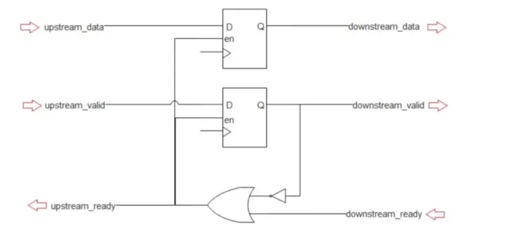

图6：带有背压的流水线

另一个例子是SpinalHDL为许多总线提供了非常好的封装，例如AXI、APB等。特别是AXI非常流行且难以实现。SpinalHDL基于前面提到的流模型实现了AXI接口，并提供了许多有用的与总线相关的功能，例如交叉开关、带/不带事务锁的总线仲裁器、总线解复用器、控制寄存器的总线驱动器等等。最重要的是，SpinalHDL提供的总线接口是防错的，因为SpinalHDL可以检查信号类型、信号宽度匹配、输入/输出方向、时钟域跨界等。通过SpinalHDL提供的这些方便的组件，它极大地促进了SoC的集成。

Scala语言特性带来的可重用性：硬件设计所面临的问题通常是高度定制的。但是通过参数/泛型在Verilog/VHDL中提供的定制能力是不足的，而Verilog的代码很难应对许多情况。同时，Verilog/VHDL的自解释性很差，在许多情况下，即使有源代码可用，很难理解和使用其他人开发的源代码。传统HDL中代码难以理解的主要原因有两点：1）Verilog/VHDL中的描述是过于底层；2）不同团队使用的设计规则不一致。

从语言特性的角度来看，Scala更高级和更复杂的功能使得设计能够支持更复杂的生成模式，从而具有更大的通用性，更容易为多种场景设计通用设计。此外，Scala的面向对象和类型系统的特性允许开发人员以更高的层次描述设计，提高程序的自解释能力。例如，通过SpinalHDL，我们可以使用“.”来索引类的方法，并扩展自定义类型来定义各种概念，如卷积编码的格雷码。从社区和工具的角度来看，如GitHub等已建立的社区提供了自然的协作和讨论环境。而Scala的库分发和包管理系统使得代码获取和部署非常容易，例如pypi-pip和maven-sbt。

除了代码的重用，项目团队内部的另一个重用现象是设计规则/协议的重用。SpinalHDL可以为这种重用提供以下内容：
1. 面向对象系统通过继承扩展设计能力；
2. Scala的隐式允许设计规则以全局、透明的方式存在，而不是另一种方式；
3. 支持远程开发的更好的IDE也增强了这种重用。

总之，SpinalHDL提供的可重用性不仅通过语言特性实现，还通过包括IDE工具链在内的完整社区环境和高级主机语言实现。

## 基于元语言构建数字逻辑电路

### 3.1 元语言的概念

硬件构建语言（如SpinalHDL、Chisel、Migen和Clash）可以被视为电路之上的元语言层，与直接描述电路的传统HDL形成对比。元语言层使得硬件设计师能够更专注于电路的语义，而不是具体的结构，使得程序和人类更容易推理设计的正确性。

传统的硬件设计结构方法的问题在于它与电路的功能规格不匹配。例如，为了将乘法功能高效地添加到经过优化的FPGA经典五阶段RISC流水线中（如图7所示），对应的逻辑必须在Decode、Execute、Memory和Writeback阶段分别实现，因为FPGA上的硬件乘法器通常具有超过1个周期的延迟。如图8所示，VexRiscv项目在SpinalHDL中展示了一种更好的抽象：通过插件方法将语义指定的函数与流水线结构解耦，其中函数在其自己的Scala模块中实现，并在净表生成过程中将自己插入到流水线中。

嵌入式深度和嵌入式浅度的硬件构造语言：硬件构造语言有两类：嵌入式深度和嵌入式浅度。广泛使用的浅度嵌入式HCL包括SpinalHDL、Chisel和Migen，而Clash是一种领先的深度嵌入式HCL。

### 3.2 硬件设计中的高级类型系统

传统的硬件描述语言（如Verilog、SystemVerilog和VHDL）的类型系统在表达能力和约束强度方面非常有限：
- 只有普通的产品类型，对类型构造器的使用没有约束，也没有支持和类型的。
- 对多态只有轻微的支持。
- 没有高阶类型。

与此同时，大多数现代硬件构造语言都可以访问具有和类型、参数化多态和高阶类型的先进类型系统。

**和类型、产品类型和私有类型构造器：** 产品类型（在大多数编程语言中称为struct）是一种保存不同类型的零个或多个值的数据结构。在SpinalHDL中，产品类型用于表示信号的“Bundle”，例如：

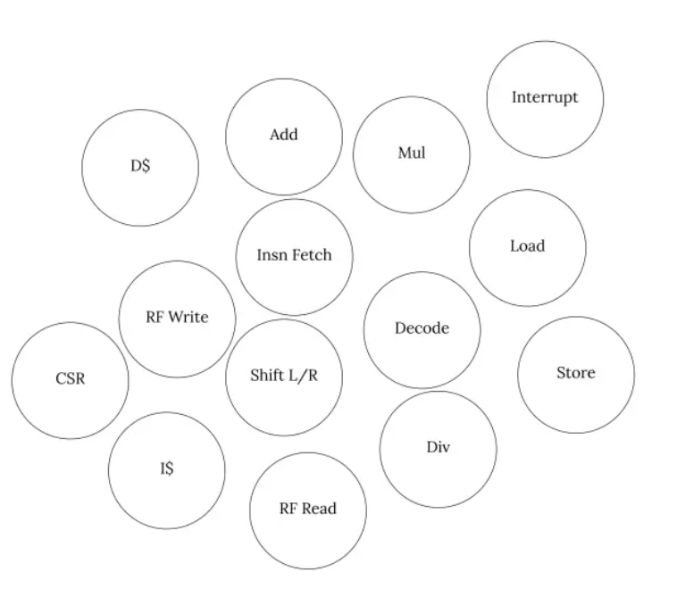

图8：从语义角度看，经典的RISC流水线由寄存器文件访问、缓存访问、指令获取/解码、算术运算和其他功能组成。

和类型，也称为标记联合，是一种可以容纳来自固定数量的不同类型之一的单个值并保留所容纳值的类型的数据结构。虽然Verilog和传统软件编程语言如C都没有直接支持和类型，但我们可以在C中模拟其行为：

一个简单但广为人知的和类型的例子是'Option'类型：

表2：从SpinalHDL到Verilog的映射。

当存在和类型和产品类型时，可以对可表示值的集合施加约束。例如，在深度嵌入式HCL中，由“VALID”信号门控的数据信号可以使用“Option”类型表示，这样在检查“VALID”是否为“高”之前，无法读取该值。

在浅度嵌入式HCL中，和类型只能用于电路结构而不能用于数据，但我们仍然可以使用新类型模式模拟“Option[T]”的行为。我们创建一个函数：

根据值选择onSome或onNone。由于DynamicOption类型构造器是私有的，所以只需要保护值免受未经意访问的影响而不必检查VALID。

子类型和参数化多态：子类型（最常见的形式是继承）是一种构建类型层级结构的机制。参数化多态，也称为泛型，是一种编写以类型为输入并以单态类型或函数为输出的类型级别函数的机制。

### 3.3 SpinalHDL之外

SpinalHDL成功地利用了Scala中的许多构造来提高硬件设计过程的效率，但是在从硬件中抽象出属性并在编译时进行验证方面还有更多的可能性。在本节中，我们介绍了来自不同软件编程语言的各种方法，我们认为这些方法也可以使硬件设计受益。

**类型级自然数：** 众所周知，自然数可以编码为类型，并且可以对其进行计算。例如，如图9所示，具有m个分支因子的n级仲裁树可以使用以下Clash类型描述：

泛型参数隐含地是约束“forall”，要求实现对所有的“n”和“m”值有效。未能满足类型签名的实现几乎总是不正确的，并报告为编译时错误。

隐式的 “forall” 对类型级自然数等泛型参数的约束的一个主要好处是防止常量的混淆，这些常量“无意中”具有相同的值。如图10所示，一个例子是将缓冲区中的所有条目与大小为“m”的另外“n”个缓冲区进行匹配：

让我们考虑n = m的配置族。对于不支持类型级自然数的硬件构造语言（如SpinalHDL），在设计中的n和m的混淆不会被报告为编译或Verilog生成中的错误，但逻辑将默默不正确。但对于Clash，类型级自然数被广泛地集成到硬件原语（如Vec和BitVector）中，编译器将确保逻辑通过类型检查对于n和m的所有值，而不仅仅是在配置中定义的值。

图9：一个8路3级仲裁树。n = 3，m = 2。

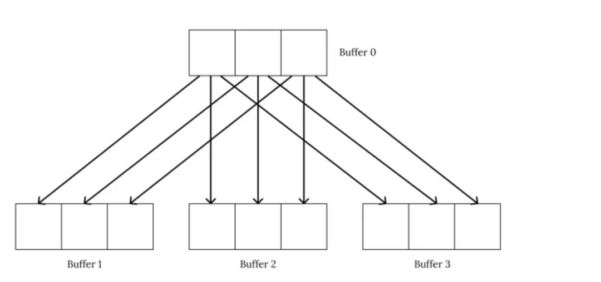

图10：匹配缓冲区中的所有条目与另外“n”个大小为“m”的缓冲区。

**细化类型：** 细化类型是带有谓词的类型，指定原始类型的哪些值应该是细化类型的元素。对于硬件设计，细化类型可用于传递信号的属性。一个例子是固定点算术单元。在某些情况下，我们希望限制输入端信号的范围（例如将8位信号的值限制在0-200之间），并验证输出信号满足某些约束（例如，将范围在0-200之间的输入经过乘以2的电路应该具有0-400的取值范围）。使用细化类型，我们能够使用显式范围对输入类型进行细化，并使用SMT求解器检查输出信号的属性。

### 3.4 HCL的编译流程

将以硬件构造语言编码的数字设计编译为可合成的电路描述。由于所有主要的商业和开源综合工具链都支持Verilog作为一流的源语言，因此对于HCL来说，使用Verilog作为编译目标并将后端处理委托给综合工具链是一种自然的选择。如图10所示，对于浅嵌入式HCL，编译流程包括以下三个步骤：
1. 类型检查和软件编译。
2. 生成IR。
3. 生成IR到Verilog代码。

深度嵌入式HCL的编译流程略有不同：
1. 类型检查和IR编译。
2. 生成IR到Verilog代码。（一些深度嵌入式HCL，如Clash，也可以通过面向软件的编译器编译为模拟电路行为的可执行程序）。

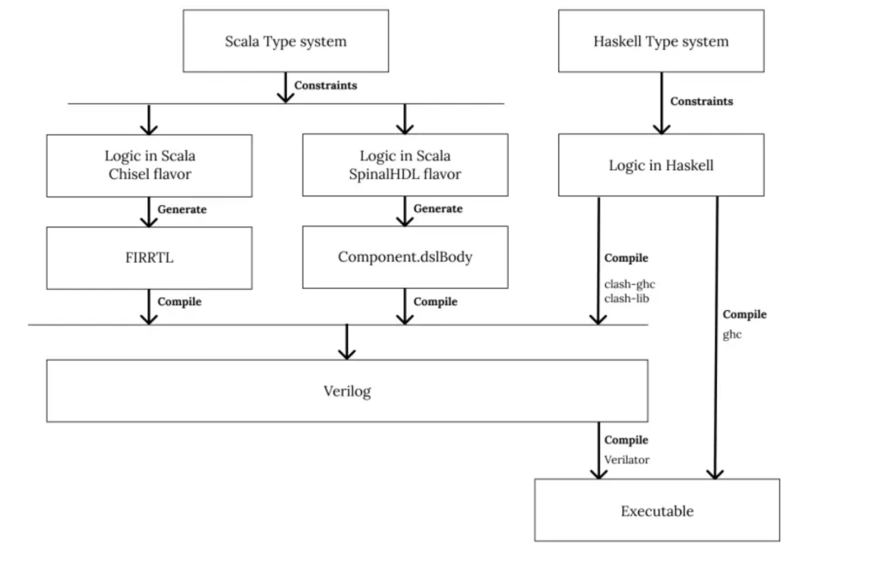

图11：基于Scala的浅嵌入式HCL需要，而基于Haskell的深嵌入式HCL Clash

## 基于Cocotb的验证

### 4.1 Cocotb简介

Cocotb是一个基于Python的测试平台环境，用于验证VHDL、Verilog和SystemVerilogRTL设计[5]。

Cocotb的验证框架分为两个主要部分：一个基于Python的测试平台，用于向DUT（Design Under Test）的输入端提供刺激并监控输出端口，以及用于模拟硬件设计的模拟器。Python测试平台通过模拟器的标准VPI（Verilog Procedural Interface）、VHPI（VHDL Procedural Interface）或FLI（Foreign Language Interface）与DUT在仿真中进行交互。根据其工作原理，Cocotb可以与任何实现了行业标准VPI、VHPI或FLI接口的模拟器一起使用，这意味着Cocotb可以支持从商业到开源的大多数现有模拟器，包括Iverilog、Verilator、Synopsys VCS、Mentor ModelSim等。

### 4.2 基于Cocotb硬件验证的优势

除了支持不同类型的模拟器外，Cocotb相对于使用Verilog、System Verilog或VHDL进行验证具有各种优势，这些优势可以加速整个硬件设计过程。以下是Cocotb的一些显著优势：

**4.2.1 简洁高效的语言特性**

比传统的用于验证的语言如Verilog、VHDL和System Verilog更高效、更具表现力和更简洁。与使用这些传统语言编码相比，使用Python来实现复杂功能需要更少的代码。

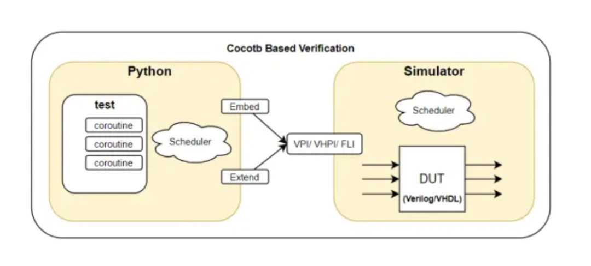

图12: 基于Cocotb的验证框架

与此同时，Python拥有简单的语法和丰富的在线学习资料，使初学者更容易掌握。此外，Python是一种高级编程语言，具有诸多高级特性，如面向对象编程，可以帮助程序员编写更可重用的代码。

在大多数硬件验证的情况下，C/C++被用于构建DUT的参考模型，参考模型的代码通过DPI集成到SV(System Verilog)的测试代码中。Python比其他语言（如C/C++）在构建参考模型方面更高效的一个编程场景是涉及超过64位的大整数的算术运算。密码学算法如ECC和RSA以及哈希函数通常涉及128位到2048位范围内宽度的大整数运算。C/C++中的原始类型仅支持最大64位的数字。如果使用C/C++构建您的参考模型，处理这些大整数将会很麻烦。下面的C程序实现了两个超过64位宽度的大整数的加法运算：

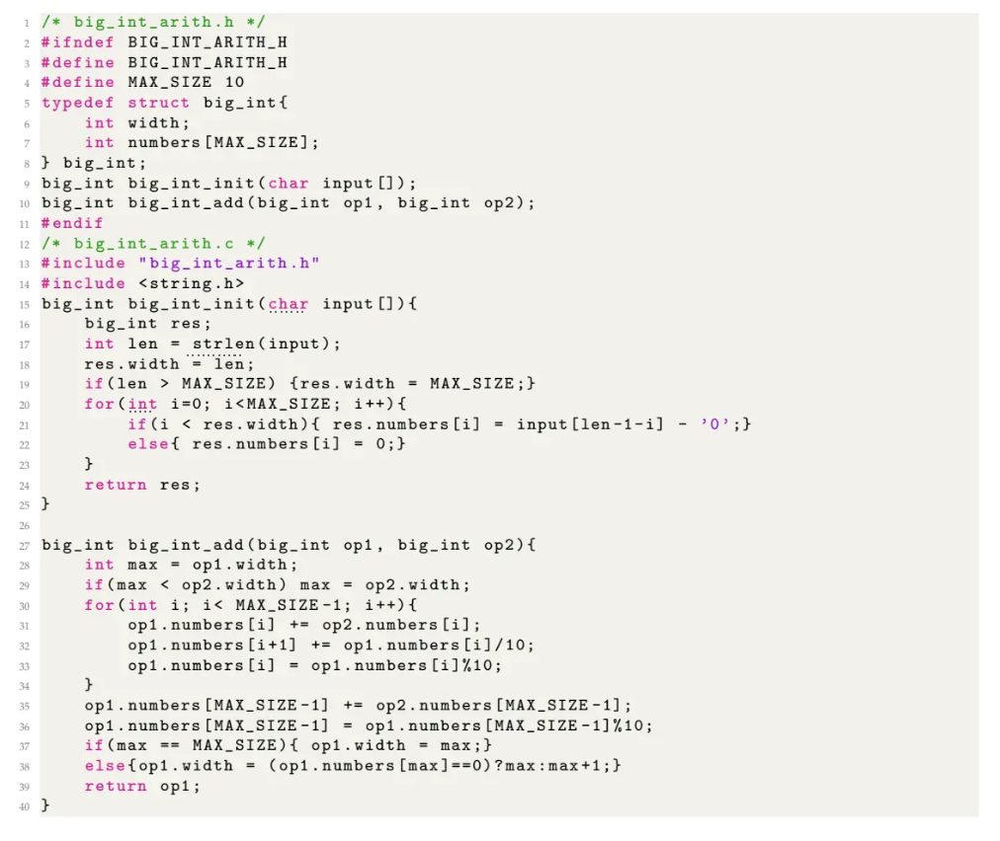

对任意位宽整数的加法操作的Python实现：

在C程序中，超过64位宽度的整数以数组的格式存储，对这些数字进行加法和乘法等运算需要对数组的每个元素进行操作。然而，Python中的整数支持任意位宽，并且可以使用算术符号直接计算这些大整数的算术运算，而无需额外的代码。还有许多其他情况下，Python可以加速构建参考模型并减少错误的可能性。尽管Python在性能方面可能略逊于C/C++，但在硬件验证中，准确性和效率更为重要。

**4.2.2 繁荣的开源社区**

Python在许多编程场景中被广泛应用，并且具有多种类型的库或包。使用Cocotb，将这些现有的基于Python的算法或模型实现作为硬件设计的黄金模型进行重用是非常直接的。或者基于现有的Python库或包来构建参考模型也更加方便。例如，在设计深度学习加速器时，可以将Pytorch、Tensorflow和Caffe等Python库与Cocotb测试平台轻松结合。对于一些用于SoC集成的复杂总线协议（如AXI、PCIe等）的验证，Cocotb提供了相应的开源库。通过重用现有的Python库来构建黄金模型有两个显著的优势：
1. 条件黄金模型的正确性或降低错误的可能性。
2. 避免从零开始构建每个验证组件，大大减少工作量。

图13: Cocotb验证中使用的不同包

除了便于构建参考模型外，还有许多开源的Python库和包可以帮助我们编写、组织和执行验证代码。在芯片验证过程中，与模拟器进行交互并在其上执行测试台是不可避免的。Cocotb自身提供了一个Makefile模板，帮助开发人员在不使用特定的Linux命令的情况下与模拟器进行交互。编写和执行Makefile以使代码在模拟器上运行仍然有点麻烦。但是，cocotb-test包封装了对模拟器的操作，并将其作为Python函数提供给开发人员。使用cocotb-test包，用户只需要调用一个Python函数并指定其参数即可启动模拟，为cocotb提供了标准的Python单元测试功能。

基于使用cocotb-test包，您可以使用pytest更高效地编写和管理测试程序，pytest是一个实现了完整功能的成熟Python测试工具的Python包。此外，您还可以使用pytest-xdist或pytest-parallel包在多核处理器上并行运行您的验证代码，这有助于充分利用计算能力以减少执行时间。同时，pyuvm包已经实现了UVM（通用验证方法学）的主要部分，UVM是业界最广泛使用的验证框架。基于cocotb和pyuvm，开发人员可以使用Python而不是SystemVerilog来应用UVM方法学进行验证。

验证是整个芯片开发过程中不可或缺且至关重要的一部分，尤其在工业领域，它占据了芯片项目的大部分工作量。因此，已经有许多尝试来提高硬件验证的效率和速度。Cocotb试图提供一个用于验证的Python环境或平台。基于这个平台，您可以享受Python简洁语法和繁荣的社区带来的便利，从而大大加速验证过程。

### 4.3 基于Cocotb的验证示例

在本部分中，我们介绍了一种基于Cocotb的验证的具体示例，被测试的设计是用System Verilog实现的矩阵乘法器。DUT的参数和接口分别列在表3和表4中：

表3：被测试矩阵乘法器的参数

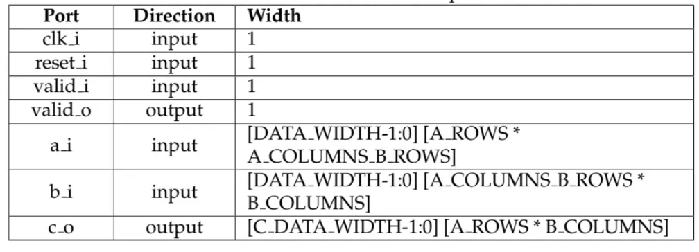

表4：被测试矩阵乘法器的接口

**4.3.1 构建参考模型**

矩阵乘法器的参考模型可以基于numpy实现，它是一个广泛应用的Python包，提供了丰富的矩阵运算功能。利用numpy，可以直接使用方法“matmul”来实现矩阵乘法，无需使用循环语法。参考模型的具体Python实现如下：

**4.3.2 搭建验证平台**

基于Cocotb构建的简单验证平台结构如下图所示。验证平台主要包括四个部分：1）驱动器；2）监控器；3）参考模型；4）缓冲区。驱动器使用Python包random生成随机的输入信号，包括“valid i”、“a i”和“b i”。当“valid i”为高电平时，生成的“a i”和“b i”被发送到参考模型，并获取相应的参考输出。参考输出通过Python包Queue实现的缓冲区存储，一旦输出信号“valid o”为高电平，监控器会抓取DUT的输出端口，并将其值与从缓冲区中取出的参考输出进行比较。驱动器和监控器的功能都是通过Python的协程实现的，类似于多线程，并且可以并行执行。

图14：基于Cocotb的验证平台结构

### 4.3.3 启动仿真

基于Cocotb的验证代码可以通过Makefile在仿真器上启动，而无需直接与仿真器进行交互。此外，使用cocotb-test包中提供的“simulator.run”方法，可以直接在Python函数中启动验证过程。然后可以直接运行该函数，或者使用pytest，一个成熟的Python测试框架，来管理所有测试的执行。

一些pytest命令来管理测试单元的执行：

## 结论

本文主要讨论了基于新兴的开源工具SpinalHDL和Cocotb的数字硬件设计和验证，我们相信这些工具可以改变传统芯片开发过程。硬件设计的需求越来越多样化，但设计语言和工具并未明显改进。SpinalHDL和Cocotb试图将一些先进和高效的软件设计概念和方法引入到硬件开发流程中。与基于System Verilog或VHDL的传统设计和验证方法相比，SpinalHDL和Cocotb可以显著提高硬件开发的效率和质量。

值得注意的是，SpinalHDL不是一种新的高级综合（HLS）工具，而是与Verilog或VHDL具有相同的描述层次。结合我们使用Spinal的开发经验，总结了它相对于Verilog和VHDL的三个主要优势，包括可靠性、表达性和可重用性。关于可靠性，Spinal可以提供更精确的基本电路元素抽象，在编译过程中提前检查一些设计规则，并分离设计和仿真元素。在表达性方面，SpinalHDL建立在Scala上，这是一种高级编程语言。基于Scala的特性，包括面向对象、函数式编程、递归和丰富的集合类型，更容易让硬件开发人员实现和参数化他们的设计。在可重用性方面，SpinalHDL本身提供了对常用电路元素的丰富封装来实现重用。对于设计师来说，使用Scala及其相关工具链更容易生成更具可重用性的代码和构建自己的代码库。

至于Cocotb，它相对于传统的验证工具有两个主要优势。与Scala类似，Python是一种具有简洁语法、高度表达能力和一些先进语言特性的高级编程语言，极大地便利了硬件设计的验证。更重要的是，Python在许多编程案例中广泛应用，并拥有强大而繁荣的社区。基于现有丰富的Python包和库构建验证更加方便。

## 参考文章

[1] J. Bachrach, H. Vo, B. Richards, Y. Lee, A. Waterman, R. Aviˇzienis, J. Wawrzynek, and K. Asanovi´c, “Chisel: Constructing hardware in a scala embedded language,” in DAC Design Automation Con-ference 2012, 2012, pp. 1212–1221.
[2] A. Krizhevsky, I. Sutskever, and G. E. Hinton, “Imagenet classification with deep convolutional neural networks,” in Advances in Neural Information Processing Systems, F. Pereira, C. J. C. Burges,L. Bottou, and K. Q. Weinberger, Eds., vol. 25. Curran Associates, Inc., 2012.
[3] SpinalHDL, 
“https://github.com/spinalhdl/spinalhdl.”
[4] B. J. Rosser, 
“Cocotb: a python-based digital logic verification framework,” 2018.
[5] Cocotb, 
“https://github.com/cocotb/cocotb.” 