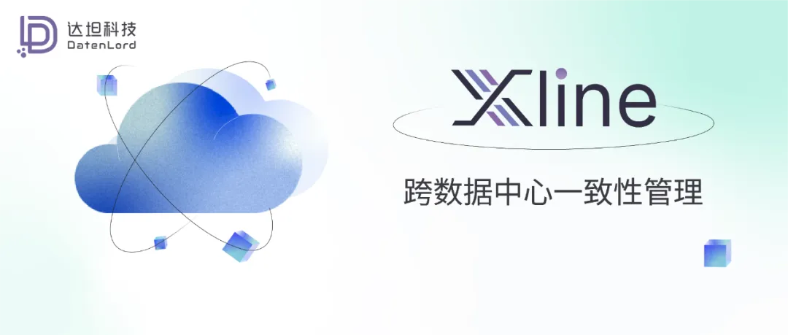

## 摘要

在本篇文章中, 我们主要会介绍 Jepsen 在测试分布式 KV 存储 Xline 中的应用。 包括对混沌工程框架 Jepsen 的介绍, 对分布式系统一致性模型的讨论, 以及对有关测试结果的分析。

## 背景介绍

首先我们先来了解一下 Xline 以及 Jepsen 测试框架的大致背景。

### Xline

Xline 是一个分布式的 KV 存储, 现在是 CNCF 的 sandbox 项目。Xline 和 etcd 类似, 提供了一个一致性的的 kv 存储, 以及其他例如 watch, 分布式锁的功能。

Xline 提供了 etcd 兼容的 API, 但它和 etcd 最主要的区别是共识协议上的。Xline 使用了 CURP 作为共识协议, 这使它能够在多数情况下都能够仅在 1-RTT(Round Trip Time)内就达成共识, 而 RAFT 达成共识至少需要 2-RTT。 因此 Xline 在高延迟环境下能够达到更好的性能。

### Jepsen

Jepsen 是一个用于分布式系统的验证的框架, 属于混沌工程的范畴。 它提供了一致性检查以及错误注入(fault injection)的功能。具体来说, Jepsen 进行的是一项黑盒测试, 在测试中它会模拟真实部署环境, 在这个环境下生成一系列对于数据库的操作, 在测试结束后使用一致性检查器对于操作的结果进行检查, 检验结果满足这个数据库的一致性保证。

#### Checkers

Jepsen 使用 checkers 来对执行结果进行一致性检查。Jepsen 目前有两种 checkers, 一个是 Knossos, 另外一个是 Elle。Knossos 用来检查结果是否是线性一致的(Linearizable), 而 Elle 是用来检查数据库事务的一致性的(Transactional Consistency)。注意这些 checker 并不能保证检测出所有不一致的情况, 因为判定结果是否是线性一致, 以及事务一致性中的可串行化检查(Serializability Checking)都是 NP 完全问题[1][2]。Jepsen 的 checkers 会限定计算的规模以在较短时间内完成测试。

#### Nemesis

Jepsen 中 fault injection 的组件叫做 nemesis。Jepsen 有一些内置的 nemesis:

- kill, 可以 kill 掉某些节点上数据库的进程
- pause, 可以 pause 某些节点上数据库的进程
- partition, 制造网络分区, 可以是任意两个节点之间, 例如我们可以分区多数/少数节点
- clock, 可以打乱某些节点上的时钟

这些组件可以模拟在分布式系统部署环境中常见的软硬件错误。 同时, Jepsen 作为一个非常灵活的框架, 它支持用户自定义自己的 nemesis, 例如, 对于 etcd 来说, 我们可以让集群成员变更也成为一个 nemesis, 达到在测试中定时地增加/删除节点的目的。因此 nemesis 不仅仅可以用作 fault injection, 它也可以用来触发系统中可能出现的一些事件。

## Jepsen 测试设计

接下来我会对 etcd Jepsen 测试设计进行详细的分析, 以及介绍我们是如何在 Xline 上应用 Jepsen 的测试。

### 数据一致性

首先我先简单介绍一下三种一致性模型作为下面测试分析的背景, 它们分别是 Serializability, Linearizability 以及 Strict Serializability。 这些一致性模型在 Jepsen 官方网站中有更为详细的介绍[3]。

#### Serializability

Serializability 是一个事务模型, 它是多个对象而言的(例如在 etcd 中就是多个 keys), 并且每一个事务的操作都是原子的。同时它具有几个特性:

- 内部一致性(Internal Consistency)即一个事务的一个读操作可以观测到前面所有写操作的结果
- 外部一致性(External Consistency)即一个事务 T1 中的读观测到另外一个事务 T0 中的写, 我们称之为 T0 对于 T1 可见(Visible), 这样就构成一个可见关系
- 全序可见性(Total visibility)即所有的可见关系构成一个全序关系, 这其实说明了有一些事务之间是没有这个关系的, 对于所有事务加上这个可见关系构成了一个偏序集

#### Linearizability

Linearizability 是对单个对象而言的, 并且每个操作也是 atomic 的。 它的所有操作形成一个实时的顺序(Real-Time Ordering)。这里的实时顺序就是指的是这些操作结果的顺序是反映出操作完成时的具体时间的。

#### Strict Serializability

Strict Serializability 则是最强的一致性保证。它可以是看作是 Serializability 和 Linearizability 的结合, 即在多个对象上的 Linearizablity。那么其实也就是说我们这时候不仅仅是保证全序可见性了, 而是所有的事务都排成了一个实时的顺序。

### Jepsen etcd test

首先我来简单介绍一下 Jepsen 官方对于 etcd 的测试设计。etcd 使用的是严格可序列化模型(Strict Serializability Model). Jepsen 为 etcd 编写了以下测试:

#### Registers

Register 是 Knossos 为了检查线性一致性内建的模型, 因为线性一致性是对单个对象而言的, 所以它将单个对象具体化成为一个 register, 这个 register 支持 read/write/compare-and-set 这三种操作, Knossos 会检验对 regsiter 所有操作的结果是否是线性一致的。

#### Sets

Sets 测试用来检测 stale reads。etcd 支持设置允许 stale reads 来达到更好的读性能, 但默认情况下是不允许的。Sets 测试只有一个操作 compare-and-set, 它对单一的 key 进行多次操作, 最后检查结果是否是可串行化的, 即检查每个 CAS 操作都是原子地发生的。

#### Append

Append 测试用来检查严格可序列化, 它有两种操作 read/append。Append 的意思就是把存储中 key 的 value 作为一个 list。其中 append 操作是向这个 list 中 append 一个元素。实现 append 的方式就是先从 etcd 中读出一个 key 的值, 然后在一个事务中检查值是否有改变, 如果没有改变就写入 append 过后的新值。

在这个测试中, 不仅所有的事务都要按照原子地方式进行, 而且 Jepsen 会同时检查这些事务是否是按照真实时间顺序发生的。

#### WR

WR 测试使用事务向多个 key 进行 read/write, 它同样是检查严格可序列化。

### Jepsen Xline test

Jepsen 测试框架主要分为四个部分: DB, Client, Checkers 和 Nemesis 每一个部分都是一个单独的接口可以供用户进行实现。由于 Xline 实现了 etcd 兼容的 API, 所以我们在编写测试的时候直接复用了 Jepsen 对于 etcd 的测试。在此测试的基础上, 我们实现了 Jepsen 中 Xline 的 DB 的接口。同时 Xline 也有自己使用 CURP 共识的 client SDK, 我们同样也对此也实现了 Jepsen 中 client 的接口。所以测试实际上是分为对 etcd client 的兼容测试, 以及 Xline native 的 client 的测试(目前还未完成此项测试)。

## 测试结果分析

接下来我会详细讲解 Xline Jepsen 测试结果以及我们找到的问题。

### 测试结果

在最初的测试中, 我们遇到的问题可以说是比较多的, 其中问题最多的是和 Xline 中对于事务操作的部分, 其中有一些问题是很细微的 bug, 另外一些则是设计上存在的漏洞。这些问题都花费了大量时间进行调试和识别。

其中我会详细解释两类主要的问题, 分别是异步落盘的问题和 revision 生成中的问题。

### 异步落盘

etcd 落盘都是同步的, 及当一个节点拿到 log 的时候, 它会同步地把 log 持久化到储存设备上, 然后再去执行 log 中的命令, 在执行完成后再把执行结果同步的持久化到储存设备, 这样做的好处就是集群可以容忍超过多数节点同时关闭/断电而不影响正确性。

有别于 etcd 的假设, Xline 的假设是集群始终存在大多数节点, 而不考虑所有节点都失效的情况, 这也和一些基于内存的 Raft 实现类似。这给了我们一些优化空间, Xline 初始的设计是所有落盘操作都是异步的。

但是这么做会有几个问题:

- 执行的顺序更难推断  
  由于最后落盘执行结果是异步进行的, 所以我们并不能准确知道 logs 的执行顺序。在 Xline 的 Read State 实现中(在 follower 本地读, 用于减少 leader 负载), 一个 follower 受到一个只读操作后, 它会向 leader 要一些信息:
  步骤一: 如果当前还有未执行完成的 commands, 那么拿到他们的 ids
  步骤二: 如果所有 command 已经执行完了, 那么拿到当前已经执行完成后的 log index
  接下来 follower 会在本地等待这些信息代表的系统状态达成后再进行这个读操作。
- 这时, 我们之前所述的不确定的执行顺序就引入了不少的复杂性, 导致最开始的实现存在 bug:
  - 没有等待这个 index 之前的所有 index 代表的 log 都执行完就去执行了读操作。
  - 实际上步骤一中仅仅拿到 command id 还不够, 因为 log index 可能比 command id 代表的系统状态还要新, 因为我们 log 的执行是异步的, 没法推断出他们的顺序!
- 会出现 log 存储和 KV 存储不一致的情况  
  考虑这样的情况: 因为 log 持久化和 KV 持久化是异步进行的, 那么在某个节点上 KV 持久化可能比 log 持久化先完成, 那么这时候如果节点因为某种原因重启了, 它读出的是没有持久化之前的 log, 这会导致在恢复过程中, 同一条 log 被执行了两次, 而并不是所有的操作都是幂等的, 例如在同一条带有条件的事务(Predicate-Based Trasaction)执行两次是不幂等的. 这也说明了 KV 持久化必须是在 log 持久化之后才能进行的。

从以上问题可以得出结论, 异步持久化会带来很多额外的状态需要考虑, 使得系统状态难以推断和分析, 并且潜在的对性能带来一定影响。我们现在正在考虑使用同步的方案来代替异步落盘来简化系统实现, 尽管这可能会牺牲一部分性能, 但是性能始终应该是在正确性之后才需考虑的。

### Revision 生成

在最开始的设计中, 我们希望 Xline 能够在兼容 etcd 的同时, 也能够保持 1-RTT 达到共识的性能。etcd 中有 revision 这一概念, 表示当前的系统修改的次数, 对于每个 kv 请求, 都需要返回一个 revision。因此我们最开始是(错误的)实现了 1-RTT 生成 revision 的方法。而最终事实证明, 在 1-RTT 中生成 revision 是不可行的。这一实现也导致 Jepsen 中涉及 revision 的测试(具体来说是 append)无法通过。

下面我来介绍我们旧的实现是怎么样的, 以及这个实现为什么是错误的, 最后讨论 1-RTT 生成 revision 为什么不可行。

#### 背景

首先我们需要有一些 CURP 共识[4]的背景。CURP 实现 1-RTT 的原理是它在每个节点上有一个 witness, 在 command 执行前, client 需要把 command 记录到大多数 witness 上, 接下来直接在 leader 执行完不需要复制到 follower 上即可返回给 client, 因为 command 的信息以及记录在了 witness 上面, 及时集群少数节点崩溃也能够从 witness 上恢复出原来的 command。而 witness 上记录的 command 有两个特点:

1. command 之间都是 commute 的
2. command 之间没有顺序

这其实就是和 Generalized Paxos[5]的实现非常接近, 都是利用 commands 之间的 commutativity 来优化请求的时延。而 commutativity 这一特性也就决定了上述的 witness 中 command 的两个特点。因为 commutativity 的意思就是两个 commands 之间修改的 key 不能有交集, 不 commute 的 commands 必然是串行执行的。而 commute 的 commands 之间是可以并发执行的, 这就表示它们之间没有顺序。

#### 旧的实现分析

旧的实现中, 每个节点都在本地给每个命令分配 revision, 这时候就要保证对于所有 commands, revision 分配的顺序必须相同。在每个节点的执行阶段前, 我们就会按照 log index 的顺序给每个节点分配 revision。这乍一看可能是正确的, 既然按照 log index 的顺序分配, 那么我们也不就在各个节点上分配 revision 的顺序也相同了吗? 但是, 我们忽略了一件事情, 在 witness 上可能还记录了 commands 的一些信息! 如果某个节点 crash 了从 witness 上恢复的时候, 它并不知道恢复的 commands 之间的顺序, 这样就会导致 revision 分配在不同节点上出现不同的顺序。

#### 1-RTT 生成 revision 为什么不可行?

Revision 的想法对于 Raft 是很自然的, 就是将整个分布式系统抽象为一个状态机, revision 的数值就表示当前状态机所在的状态。这表明对于系统的所有的修改操作, 它们是有一个全局的顺序的。

对于 CURP 共识协议来说, 由于记录在 witness 上的 commands 是无序的(由于 client 的请求是并发的), 想要进行排序那么就必须额外地引入另外一个 RTT 来在各个 witness 上进行同步. 这样记录和排序的两步过程至少需要两个 RTT。

和 Generalized Paxos 相同, CURP 使用的 commutativity 就使得 commands 之间可能是没有顺序的, 那么所有 commands 形成的是一个偏序关系, 称为 command history[5]。在这种情况下, revision 的想法就不太适用了。

Generalized Consensus and Paxos 论文中, 作者其实也证明了在 Generalized Consensus 下想要确定任意两个命令之间的顺序是需要至少两个 message delays 的(Learning is impossible in fewer than 2 message delays), 下面是作者的证明[5]:
Suppose l learns a value proposed by p in one message delay.
Then it is possible that every message sent by p was lost except for ones
received by l. If all messages from p and l to other processes are lost, then
there is nothing to prevent another learner from learning a different value
proposed by another proposer, violating consistency.

#### iv.Xline 中的修复

1. etcd 兼容性
2. 经过以上讨论, Xline 其实是没办法在兼容 etcd revision 的情况下依然保持 1-RTT 的高性能的. 所以在 etcd 的兼容层中, 我们需要等待每一个 command 都 commit 之后再给它分配 revison, 这样和 etcd 相同需要两个 RTT。
3. Append 测试
4. Append 测试中的事务测试使用了 Revision 来确保事务的原子性。Append 测试要求的是严格可系列化。在之前的讨论中, CURP 共识对于所有 commands 来说并没有一个全局的顺序, 所以这其实是违反了严格可序列化的要求的, CURP 的偏序关系事实上是只保证了可序列化。因此, 在 Xline 的测试中(非 etcd 兼容), 我们不能直接使用 Append 测试。或者说编写 Xline 的 Jepsen 测试应当将一致性模型更改为更弱的可序列化模型。

## References

[1]  
P. B. Gibbons and E. Korach, “Testing shared memories,” Siam journal on computing, vol. 26, no. 4, pp. 1208–1244, 1997.  
[2]  
C. H. Papadimitriou, “The serializability of concurrent database updates,” Journal of the acm (jacm), vol. 26, no. 4, pp. 631–653, 1979.  
[3]  
“Jepsen consistency.” Available:  
https://jepsen.io/consistency
[4]  
S. J. Park and J. Ousterhout, “Exploiting commutativity for practical fast replication,” in 16th usenix symposium on networked systems design and implementation (nsdi 19), Boston, MA: USENIX Association, Feb. 2019, pp. 47–64. Available:  
https://www.usenix.org/conference/nsdi19/presentation/park  
[5]  
L. Lamport, “Generalized consensus and paxos,” 2005.
