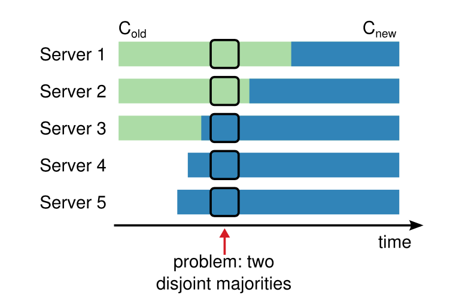
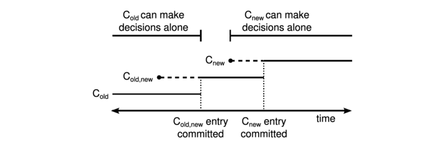
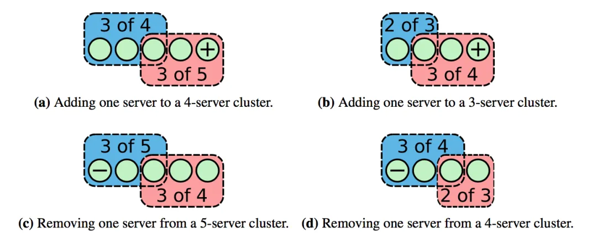
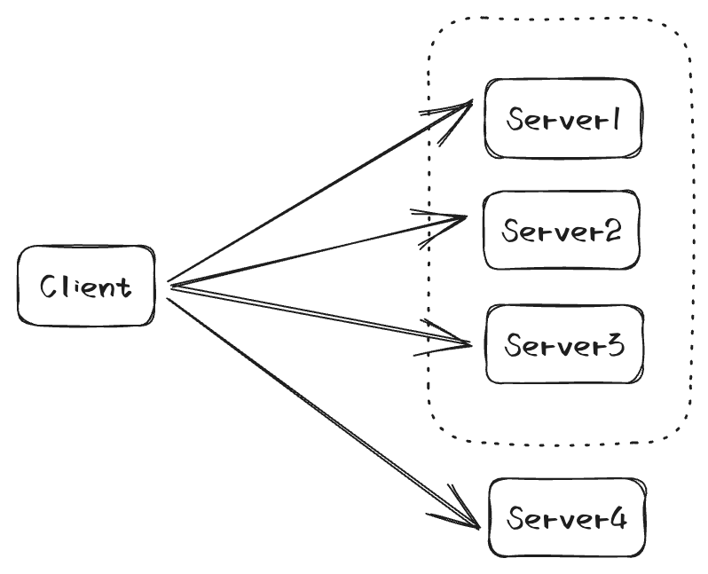

## 背景

在分布式系统的应用场景中，难免会出现增删节点或者替换节点的需求，最简单的解决方式就是临时关闭集群，然后直接修改配置文件添加新的节点，完成后再将集群重新启动，这样的方式的确能达成我们的目的，但是其存在的问题也很明显，变更期间集群是不可用的状态，这对需要高可用性的系统来说是无法接受的，并且手动操作的过程还可能引发其他的错误，这也会降低系统的稳定性。因此，如何才能高效且安全的完成集群成员变更，也就成为了分布式系统开发过程中的关键问题。对于 Xline 来说，不仅要处理常规的变更流程，还要将其与 Curp 协议相结合，保证引入集群成员变更不会导致前端协议出错。

## 动态成员变更的问题以及解决方案

由于 Xline 使用 Raft 作为后端协议，因此想要为 Xline 添加动态变更成员的能力，就需要解决 Raft 协议自身会遇到的问题。Raft 协议能够正常工作的一个重要前提是，同一时间只能有一个 Leader，如果不加任何限制，直接向集群添加节点，那么就有可能破坏这个前提，具体情况如下图所示：



由于网络延迟等原因，无法保证各节点从 $$C_{old}$$ 切换到 $$C_{new}$$ 的时间相同，就有可能出现图中的情况，假设此时 Server 1 和 Server 5 同时开始选举，Server 1 获得了 Server 2 的投票，满足 $$C_{old}$$ 中的 quorum 需求，成为 Leader，Server 5 获得了 Server 3 和 Server 4 的投票，满足 $$C_{new}$$ 中的 quorum 需求，Server 5 也成为 Leader，此时集群就会同时有两个 Leader，产生一致性问题。

为了解决这个问题，Raft 的作者提供了两种解决思路。

1. Joint Consensus
2. 单步成员变更

### Joint Consensus

Joint Consensus 本质上就是在成员变更过程中添加一个中间状态。



Leader 收到成员变更请求时，会创建一条一个 $$C_{old,new}$$ 配置并通过 AppendEntries 同步到 Follower，收到 $$C_{old,new}$$ 的节点会同时使用两个配置做决策，也就是选举等操作需要 $$C_{old}$$ 和 $$C_{new}$$ 都同意才视为成功 ，等到 $$C_{old,new}$$ commit 之后，Leader 会再创建 $$C_{new}$$ 配置并同步给 Follower。

在这种方案下，集群成员变更的中间状态有以下几种可能：

1.  $$C_{old,new}$$ 创建之后提交之前，这个阶段集群中可能同时存在 $$C_{old}$$，$$C_{old,new}$$ 两种配置，在此阶段内任意节点想要成为 Leader 都需要 $$C_{old}$$ 配置同意，因此不会出现两个 Leader。
2.  $$C_{old,new}$$ 提交之后，$$C_{old,new}$$ 创建之前，这个阶段集群中可能同时存在 $$C_{old}$$, $$C_{old,new}$$ 两种配置，但只有使用 $$C_{old,new}$$ 的节点才能够成为 Leader，因为此阶段 $$C_{old}$$ 中的多数节点已经切换到了 $$C_{old,new}$$ 配置，剩余还未切换的节点不足以选出新 Leader。
3.  $$C_{new}$$ 创建之后提交之前，这个阶段集群中可能同时存在 $$C_{old}$$ $$C_{old,new}$$ $$C_{new}$$ 三种配置，其中 图片 配置无法选出 Leader，原因如上，$$C_{old,new}$$ 和 $$C_{new}$$ 中要选出 Leader，就需要 $$C_{new}$$ 同意，此情况也不会出现两个 Leader。
4.  $$C_{new}$$ commit 之后，由 $$C_{new}$$ 独立决策，不会出现两个 Leader。

### 单步节点变更

除了 Joint Consensus 以外，还有一种方法可以安全的完成集群成员变更，那就是单步节点变更。该方法每次只会增加或减少一个节点，这种情况下，新旧配置的 majority 中必然有重叠节点，重叠的节点只能给一个节点投票，这样就保证了不会同时存在两个 Leader。复杂的变更行为就需要转换成多次单步节点变更来完成。



这种方案没有中间状态，只需要一步操作就可以完成变更，逻辑上比 Joint Consensus 更加简洁，没有那么多复杂的中间状态，实现起来也会简单一点，当然它的功能也没有 Joint Consensus 强大

Xline 目前采用的方法就是单步成员变更，未来我们也会添加对 Joint Consensus 的支持。

## Curp 协议的融合

Membership change 的主要流程，只通过后端的 Raft 就能够完成，但是这个过程可能会扰乱前端 Curp 协议的流程。正常处理时，Curp client 会向集群中所有节点广播 Propose 请求，并根据成功相应的数量是否大于当前集群成员数量的 superquorum 来判断本次 propose 是否在 curp 中 commit，实现 membership change 以前，所有成员都在创建 client 时确定，但是引入了 membership change 之后，就需要有一种机制能够保证 Client 在使用旧的配置时，也能够探测到服务端使用的新配置，并且使用新配置重试当前的请求，否则可能导致 Curp 协议无法正常工作。



如图所示，假设 Client 向一个三节点集群广播 Propose，那么 Client 收到 3（3 节点的 superquorum） 个成功响应后就会认为这一次 Propose 已经在 Curp 中 commit，在此次 Propose 过程中，集群成员发生了变更，Server4 加入了集群，然而 4 节点的 superquorum 是 4，也就是说刚刚在 3 节点集群中被 curp commit 的请求，在成员变更之后就不再满足 Curp 的 commit 条件了，这可能会导致已经返回给 Client 的请求丢失。

为了解决这个问题，我们为外部 client 发送的请求引入了一个新的字段 cluster_version ，这个字段表示集群当前使用配置的版本，每次执行成员变更，都会增加这个值，这样 Server 端就能够通过这个字段来判断发送请求的 Client 是否在使用最新配置，并且直接拒绝使用旧配置的请求，Client 探测到 cluster_version 不一致后，就会主动拉取 Server 端的最新配置，并以最新配置发起新一轮的请求。在上述实例中，Propose 和成员变更同时发生时，Server1、2、3 中一定有节点已经在使用新配置了，那么该节点就会使用更大的 cluster_version 拒绝本次 Propose，Client 检测到更大的 cluster_version 后，会重新向集群拉取当前的成员配置，然后以新配置重试整个请求。

## 源码解读

### Leader 发起成员变更

开始变更成员的第一步，就是向 Leader 发送 ProposeConfChangeRequest，这个请求包含了本次 propose 要变更的节点信息和一些其他的辅助字段。

Server 端收到该请求后，首先会检查请求携带的 cluster_version 是否和集群当前 cluster_version 匹配，不匹配的请求直接拒绝，然后才会进入 Server 端的处理逻辑:

```rust
    /// Handle propose_conf_change request
    pub(super) fn handle_propose_conf_change(
        &self,
        propose_id: ProposeId,
        conf_changes: Vec<ConfChange>,
    ) -> Result<(), CurpError> {
        // ...
        self.check_new_config(&conf_changes)?;
        let entry = log_w.push(st_r.term, propose_id, conf_changes.clone())?;
        debug!("{} gets new log[{}]", self.id(), entry.index);
        let (addrs, name, is_learner) = self.apply_conf_change(conf_changes);
        self.ctx
            .last_conf_change_idx
            .store(entry.index, Ordering::Release);
        let _ig = log_w.fallback_contexts.insert(
            entry.index,
            FallbackContext::new(Arc::clone(&entry), addrs, name, is_learner),
        );
        // ...
    }
```

Leader 节点在处理时，会通过 check_new_config 方法检查本次 conf change 的有效性，提前拒绝一些无法处理的变更，比如插入一个已经存在的节点或者移除一个不存在的节点。检查通过之后，就会进入和常规请求相同的流程，通过共识将其同步到所有 Follower 上，除了这部分相同流程以外， conf change 还需要做一些特殊处理，在其插入 log 之后，就会立刻应用新配置，并且记录用于回退配置的上下文。这里和 Raft 论文中提到的方式相同，在节点拥有这条日志之后，不需要等待它 commit，就让它立刻生效，在 Raft 中没有 commit 的日志是有被覆盖的可能的，因此才需要记录上下文，如果日志被覆盖，就能够通过这个上下文来回退本次修改。

### Follower 处理成员变更

对于 Follower 节点，成员变革的主要逻辑发生在 handle_append_entries 中，这个方法被用来处理 Leader 发送的日志，其中就包括 conf change

```rust
    pub(super) fn handle_append_entries(
        &self,
        term: u64,
        leader_id: ServerId,
        prev_log_index: LogIndex,
        prev_log_term: u64,
        entries: Vec<LogEntry<C>>,
        leader_commit: LogIndex,
    ) -> Result<u64, (u64, LogIndex)> {
        // ...
        // append log entries
        let mut log_w = self.log.write();
        let (cc_entries, fallback_indexes) = log_w
            .try_append_entries(entries, prev_log_index, prev_log_term)
            .map_err(|_ig| (term, log_w.commit_index + 1))?;
        // fallback overwritten conf change entries
        for idx in fallback_indexes.iter().sorted().rev() {
            let info = log_w.fallback_contexts.remove(idx).unwrap_or_else(|| {
                unreachable!("fall_back_infos should contain the entry need to fallback")
            });
            let EntryData::ConfChange(ref conf_change) = info.origin_entry.entry_data else {
                unreachable!("the entry in the fallback_info should be conf change entry");
            };
            let changes = conf_change.clone();
            self.fallback_conf_change(changes, info.addrs, info.name, info.is_learner);
        }
        // apply conf change entries
        for e in cc_entries {
            let EntryData::ConfChange(ref cc) = e.entry_data else {
                unreachable!("cc_entry should be conf change entry");
            };
            let (addrs, name, is_learner) = self.apply_conf_change(cc.clone());
            let _ig = log_w.fallback_contexts.insert(
                e.index,
                FallbackContext::new(Arc::clone(&e), addrs, name, is_learner),
            );
        }
        // ...
    }
```

对于常规日志的处理此处直接省略，不再赘述。Follower 在尝试追加 Leader 发来的日志时，会判断当前节点上有哪些新的 conf change 日志，以及哪些没有被 commit 的 conf change 会被覆盖，然后通过预先记录的上下文，将被覆盖的变更逆序回退，并且应用新的变更，在应用新变更时，也需要在此处记录新变更的上下文。

### 成员变更日志的 commit

```rust
async fn worker_as<C: Command, CE: CommandExecutor<C>, RC: RoleChange>(
    entry: Arc<LogEntry<C>>,
    prepare: Option<C::PR>,
    ce: &CE,
    curp: &RawCurp<C, RC>,
) -> bool {
    // ...
    let success = match entry.entry_data {
        EntryData::ConfChange(ref conf_change) => {
            // ...
            let shutdown_self =
                change.change_type() == ConfChangeType::Remove && change.node_id == id;
            // ...
            if shutdown_self {
                curp.shutdown_trigger().self_shutdown();
            }
            true
        }
        _ => // ...
    };
    ce.trigger(entry.inflight_id(), entry.index);
    success
}
```

在 Conf change 被 commit 之后的 after sync 阶段，除了一些常规操作以外，还需要判断被 commit 的 conf change 是否将当前节点 remove，如果这个节点被 remove 的话，就需要在此处开始 shutdown 当前节点，一般只有 leader 节点会执行到此处并将 remove 自身的日志 commit，在其 shutdown 自身后，剩余节点会选出一个拥有最新日志的 leader。

### New Node 加入集群

为了区分创建新集群运行的节点，和新启动的需要加入现有集群的节点，需要在启动时传入一个新的参数 `InitialClusterState`，这是一个枚举类型，只有两个成员， `InitialClusterState::New` 表示本次启动的节点是新启动集群的成员之一；`InitialClusterState::Existing` 表示本次启动的节点是要加入已有集群的新节点。

```rust
let cluster_info = match *cluster_config.initial_cluster_state() {
    InitialClusterState::New => init_cluster_info,
    InitialClusterState::Existing => get_cluster_info_from_remote(
        &init_cluster_info,
        server_addr_str,
        &name,
        Duration::from_secs(3),
    )
    .await
    .ok_or_else(|| anyhow!("Failed to get cluster info from remote"))?,
    _ => unreachable!("xline only supports two initial cluster states: new, existing"),
};
```

这两种方式的本质区别在于，新建集群是各节点初始的集群成员是相同的，可以直接通过这部分初始信息各自计算出一个全局统一的节点 ID，保证每个节点都有一个唯一 ID，而加入现有集群时，新节点不能自己计算节点的 ID，需要通过 get_cluster_info_from_remote 方法去拉取现有集群的信息，直接继承现有集群正在使用的 ID 和其他信息，以保证集群内 ID 和节点的对应关系，避免出现 ID 重复或一个节点有多个 ID 的情况。

为保证与 etcd 接口的兼容，新节点开始运行前时没有 name 的，etcdctl 中会根据 name 是否为空来判断相应节点是否已启动，在新节点启动并加入集群后，会向 Leader 发送一个 Publish Rpc，用来在集群内发布自己的 name。

### Node remove

假设我们在 remove 一个节点之后，不将其关闭，那么它将会选举超时并向其余节点发送 Vote 请求，浪费其他节点的网络和 CPU 资源，想要解决这个问题，首先能想到的有两个办法：

1. 在节点应用会 remove 自身的新配置后，立刻关闭自身节点。很明显，这种方案一定是不可行的，因为在应用新配置时，这一条日志还没有被 commit，还有被回退的可能，如果在此处关闭自身，那假如配置变更发生了回退，被 remove 的这个节点就已经被关闭无法直接回复了，这不是我们想看到的结果。

2. 在节点 commit 会 remove 自身的日志后，立刻关闭自身节点。因为已经被 commit，所以这种方法时没有上述问题的，但是据此实现后就会发现，被 remove 的节点有时还是不能自动关闭。因为被 remove 的节点可能根本不会 commit 新配置，假设我们要 remove 一个 Follower 节点，Leader 讲这一条 remove 记录添加到自己的日志之后，立刻开始使用新日志，此时 Leader 已经不会向这个 Follower 发送任何请求了，Follower 自然也不可能 commit 这条日志并关闭自身。这个问题在 Leader 上是不存在的，Leader 将会临时管理不包含自己的集群，直到日志被 commit。

最直接的方法都不能使用，那被 remove 的节点应该如何关闭自身呢？假设我们不添加这里的关闭逻辑，会发生什么事？Leader 向集群同步 conf change 日志，新集群的所有成员都会正常处理并 commit 这条日志，被 remove 的节点会在自己不知情的请款下离开原集群，收不到 Leader 的心跳，这个节点就会超时并开始选举，这里也就是我们最终我们决定修改的位置。

```rust
pub(super) fn handle_pre_vote(
    &self,
    term: u64,
    candidate_id: ServerId,
    last_log_index: LogIndex,
    last_log_term: u64,
) -> Result<(u64, Vec<PoolEntry<C>>), Option<u64>> {
    // ...
    let contains_candidate = self.cluster().contains(candidate_id);
    let remove_candidate_is_not_committed =
        log_r
            .fallback_contexts
            .iter()
            .any(|(_, ctx)| match ctx.origin_entry.entry_data {
                EntryData::ConfChange(ref cc) => cc.iter().any(|c| {
                    matches!(c.change_type(), ConfChangeType::Remove)
                        && c.node_id == candidate_id
                }),
                _ => false,
            });
    // extra check to shutdown removed node
    if !contains_candidate && !remove_candidate_is_not_committed {
        return Err(None);
    }
    // ...
}
```

我们在 ProVote 阶段加入了额外的检查逻辑，收到 pre-vote 的节点会检查 candidate 是否已经被 Remove，假设 candidate 不在当前节点的配置中，并且可能会进行的回退操作，也不会让这个节点重新加入集群，那就说明这是一个已经被 Remove 的 candidate，此时处理请求的节点将会给 Follower 回复一个带有 shutdown_candidate 字段的特殊 VoteResponse。Candidate 在收到该响应后，会判断 shutdown_candidate 是否为 true，为 true 则开始关闭自身，不为 true 则继续选举流程。

## 总结

本篇文章我们深入探讨了在分布式系统中如何进行集群成员变更，简单介绍了两种主要的解决方案：Joint Consensus 和单步成员变更，Joint Consensus 通过引入中间状态来保证变更期间不会出现两个 Leader，单步集群变更则是牺牲了一定的功能，通过逐个变更节点来简化实现逻辑。并且对 Xline 目前使用的单步成员变更方案进行了源码级的分析，展示了 Leader 和 Follower 都是如何处理变更的，以及引入集群变更之后，会有哪些新逻辑需要处理。

目前 Xline 对集群成员变更的处理仅使用了单步集群变更这一种方法，提供了基本的变更能力，未来我们还会尝试支持 Joint Consensus，增强 Xline 的功能。

关于 Xline 的 Membership change 就介绍到这里，如果对更多实现细节感兴趣，欢迎大家直接参考我们的开源仓库：https://github.com/xline-kv/Xline ，也可以在 Xline 的官网上了解更多信息：https://xline.cloud
```
