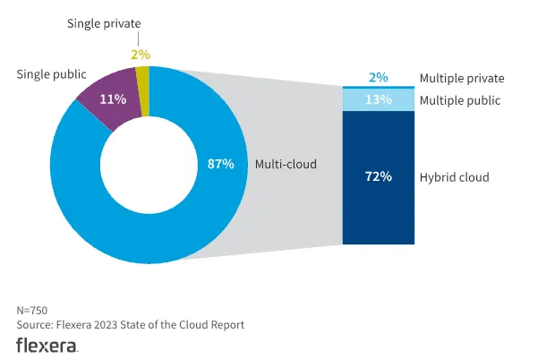
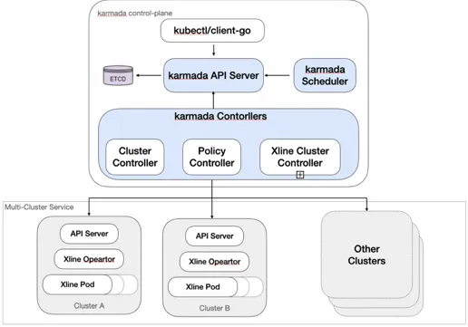
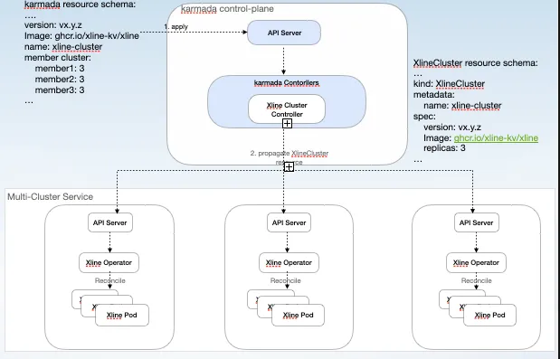
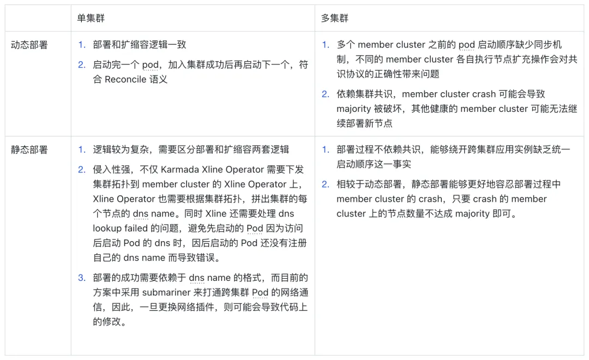
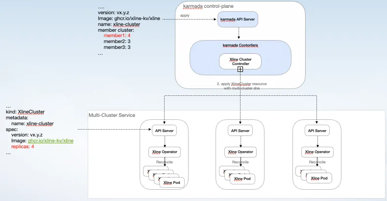
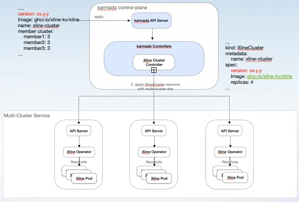

## 背景与动机

目前随着云原生技术和云市场的不断成熟，越来越多的 IT 厂商开始投入到跨云多集群的怀抱当中。以下是 flexera 在 2023 年中关于云原生市场对多云多集群管理的接受程度的调查报告（info.flexera.com）

从 flexera 的报告中可以看出，目前在整个云原生市场中已经有超过 87% 的企业正在同时使用多个云厂商的服务，其中使用单一公有云和单一私有云的仅占 13%。而其中使用了多云部署的厂商中则有 15% 的用户选择了多公有云或多私有云部署，而采用了混合云部署的用户比例则达到了 72%。这些统计数据都从侧面反映了云原生技术和云市场的不断成熟，未来将会是编程式多云管理服务的时代。

除了外部趋势以外，单一集群下的局限性也成为了推动用户拥抱多云多集群管理的一个内在动力。单集群部署的局限性包括但不限于：

- 单点故障，难以容忍集群级别的故障，小的集群联邦优于大的 K8s 集群
- 单集群的边界限制，例如一个 Node 默认只有 110 个 Pod，一个集群最多容纳 5000 个 Node
- 业务层面上的发展需要，例如 Xline 本身作为一款跨集群的分布式键值存储
- ....

Karmada 作为一款开源的多集群管理工具，已经被 Shopee、DaoCloud 等公司应用在了生产环境中。但由于 Karmada 目前缺少对有状态应用管理的支持，因此应用实践上主要还是以无状态应用的管理为主。

为了更好地应对未来多云多集群管理的趋势，在多云多集群场景下更好地管理有状态应用，Xline 和 Karmada 社区成立了工作小组，共同推进 Karmada 对有状态应用管理的支持。

## Karmada 管理有状态应用存在哪些挑战？

要理解 Karmada 在多集群下管理有状态应用之前，我们需要先回顾一下 K8s 在单集群下管理有状态应用的实现。

早在 2012 年的时候，Randy Bias 就 “开放和可扩展云架构”进行了有影响力的演讲。在那次演讲中，他提出了 “宠物模式”与 “家畜模式”。

这两种模式分别对应了应用的无状态和有状态。其中，对于家畜模式而言，他们不需要有特定的名字，个体与个体之间也不存在本质的区别，因此，当其中的某个个体出现问题时，我们往往可以直接使用另外一个个体来代替它。而对于宠物模式来讲，每个个体都需要有一个特定的名字（标识符），每个个体都是独一无二的，因此当其中的某个个体出现了问题时，你需要进行特殊的照顾，以便帮助它恢复健康。

而 K8s 在 1.5 版本中首次引入了 StatefulSet 这一 API 对象，并在 1.9 版本中稳定可用的状态。目前已经被广泛应用于运行有状态应用。它为所管理的 Pod 提供了固定的 Pod 身份标识，每个 Pod 的持久化存储以及 Pod 之间严格的启停顺序。

那么问题来了，有状态的应用到底有哪些状态，而 K8s 的 StatefulSet 又是如何初步解决有状态应用的状态问题？

而在 Karmada 多集群场景下，有状态的应用则带来了如下的问题：

1. 如何保证跨集群的多个应用实例能够有一个全局统一的启停顺序，这对一些应用实例的 scale in/out 和滚动更新会带来影响。对于一个基于共识协议的分布式 KV 存储来讲，scale 的过程需要经过 membership change，其中会涉及到集群中 majority 修改的判定。如果缺少全局统一的顺序保证，多个 member cluster 同时进行 scale out，则会对共识协议达成共识的行为带来正确性上的影响
2. 如何保证跨集群的所有应用都有全局唯一的实例标识，一个自然的解决方案便是将 member cluster id 一起纳入到实例标识当中
3. 如何解决跨集群的应用通信问题，以及提供全局统一的网络标识。目前，在我们的尝试和实践当中，我们通过 submariner 来打通多个 member cluster 之间的网络通信。目前的实现方式上依赖了某个具体的网络插件
4. 如何解决跨集群的有状态应用的更新、以及扩缩容等常见的功能，提供更细粒度的更新策略，例如在 member cluster 中实现如 Partition Update 的功能

为了更好地解决上述提到的问题，需要在 Karmada 上引入新的 Workload 来实现跨集群版本的 “StatefulSet”。

## Xline 的一些早期尝试

由于目前 Karmada 社区对新 API 的很多实现细节还没有讨论清楚的前提下，我们对 Xline 在 karmada 下的部署，扩缩容和更新做了一些简单的探索与尝试。方案整体的架构如下：

在整体架构上，目前采用的是一个双层 Operator 的方式，在 Karmada 的控制面上，我们部署了一个 Karmada Xline Operator，由它来负责对定义在 Karmada 上的一些 Xline 资源进行解释和拆分，并将其下发到 member cluster 上。而 member cluster 上的 Xline Operator 在监测到对应的资源被创建出来之后，则会进入到相应的 Reconcile 过程，从而完成相应的操作。

### 部署

让我们先来看看在单集群下，分布式应用集群的常见部署方法（以 etcd operator 部署 etcd 集群为例）。etcd-operator 部署 etcd 集群可以分为两个阶段：

1. Bootstrap: 创建一个 etcd 的种子节点，种子节点的 initial-cluster-state 为 new，并制定了唯一的 initial-clsuter-token
2. Scale out：在种子集群上执行 member add，更新集群网络拓扑，然后启动新的 etcd 节点，新节点中的 initial-cluster 为更新后的网络拓扑，并且 initial-cluster-state 为 existing

然而，在跨集群场景下，由于不同的 member cluster 中的 pod 启动顺序缺少全局统一的启动顺序，不同 member cluster 下的 Xline Operator 会并发执行集群扩充操作，这会对共识协议的成员变更过程带来不利的影响。而为了绕开上述问题，Xline 采用了静态部署的方式，具体过程如下图：

首先，用户需要先在 karmada 上定义好相应的资源来描述跨集群的 Xline 集群的集群拓扑。Karmada Xline Opeartor 在监测到资源被 apply 后，会对资源进行解释和拆分，将其转换为 member cluster 上的 XlineCluster 这个 CR 并下发。XlineCluster 这个 CR 当中会包含当前 member cluster 应当创建的 replica 数量，同时也会包含其他集群的 member cluster id 以及对应的 replica 数量。而 member cluster 上的 Xline Operator 在监测到 CR 的创建后，会进入 Reconcile 的过程，利用下发的集群拓扑结构，生成整个 Xline 集群中其他节点的 dns name，并启动 Xline 的 Pod。

在探索的早期，静态部署的方式由于在部署过程中不涉及 membership change，从而绕开了 Karmada 多集群下应用实例缺乏全局统一启动顺序的问题。但软件行业没有银弹，静态部署也是如此，它有如下的一些 trade off。下表是针对动态部署和静态部署在单集群与多集群场景下特点的对比：

### 扩缩容

在 Karmada 下对有状态应用进行 scale in/out 具体可分为两种：

- 水平 scale in/out —— 移除/增加一个 member cluster，并在其上 scale in/out 节点
- 垂直 scale in/out —— 在原有的 member cluster 上进行 scale in/out

#### 水平 scale out

如上图所示，整体的过程如下：

1. 创建好对应的 member cluster，配置好 submariner 网络，并将其加入到 Karmada 中进行管理
2. 修改 Karmada 上的 Xline 资源，在 member cluster 字段中添加新的记录 member4: 4 表示，要在 member4 上扩充 4 个 Xline 的 Pod
3. Karmada Xline Operator 会将资源进行拆分解释，并下发到 member4 上
4. member4 上的 Xline Operator 在接收到相应资源后，进入对应的 Reconcile 过程，调用 Xline client 执行 member add，达成共识后，将新的 Xline Pod 启动起来，重复上述过程，直到 member4 上 Xline 的 replicas 达到指定数量

#### 垂直 scale out

对于垂直 scale out，其大致过程也如上图所示：

1. 修改 Karmada 上的 Xline 资源，例如指定 member1 中的 Xline 的 Pod 从 3 扩充到 4
2. Karmada Xline Operator 会将资源进行拆分解释，并下发到 member1 上
3. member1 上的 Xline Operator 在接收到资源修改通知后，进入对应的 Reconcile 过程，调用 Xline client 执行 member add，达成共识后，将新的 Xline Pod 启动起来，重复上述过程，直到 member1 上 Xline 的 replicas 达到指定数量

目前，由于 scale in/out 不可避免地会涉及到 membership change 的过程，而在 Karmada 下不同 member cluster 之间缺少必要的同步机制，因此，scale 的过程还是存在局限性：一次水平 scale out 只能扩容一个集群，一次垂直扩容也只能在某个指定的 member cluster 上进行。

### 滚动更新

对于滚动更新而言，大致的过程如上图所示：

1. 用户修改 Karmada 上的 Xline 资源，修改其中的 xline 镜像版本
2. Karmada Xline Operator 会将资源进行拆分解释，并下发到 member cluster 上
3. member cluster 上的 Xline Operator 在监测到资源发生变化后，会进入相应的 Reconcile 流程，执行滚动更新操作。member cluster 上的更新流程和单集群上的更新没有区别。

目前主要支持的更新方式为默认的滚动更新，但从实际的应用场景来看，至少需要考虑以下两个问题：

1. 更新的过程当中会涉及旧 Xline 节点的停止和新 Xline 节点的启动，需要有额外的机制来保证更新过程不会产生不可用的问题
2. 需要支持更多细粒度的更新策略，例如 Partition Update。在多个 member cluster 中，应当优先更新只有 follower 存在的集群，并且在更新 leader 所在的 member cluster 时，还应当将 leader 转移到更新好了的 member cluster 上，以避免极端情况下，leader 因为 Rolling update 而导致频繁下台的情况

## 总结

鉴于多云多集群管理的发展趋势以及 Xline 本身业务上的特性，Karmada 社区和 Xline 社区目前成立了工作小组，共同推动有状态应用在 Karmada 多集群下的管理。为了更优雅地解决 Karmada 多集群管理有状态应用的问题，我们需要引入新的 Karmada workload。目前，由于 Karmada 社区对于新的 workload 的实现细节还没有达成共识，因此，在早期的尝试阶段，Xline 采用了两层的 Operator 方式，通过 Karmada Xline Operator 对顶层资源进行解释和拆分，并下发至 member cluster，再由 member cluster 上的 Xline Operator 来对资源进行调谐。

通过这样的方式，我们对在 Karmada 上部署 Xline 以及滚动更新做了一些早期的尝试与探索，为未来新的 Karmada StatefulSet workload 的开发与设计做了一些前期的铺垫。

## Xline 社区会议

为了更全面地向大家介绍 Xline 的进展，同时促进 Xline 社区的发展，我们将于 **2024 年 3 月 29 日北京时间晚上 11:00** 召开 **Xline 社区会议**。

欢迎您届时登陆 zoom 观看直播，或点击“**阅读原文**”链接加入会议：  
**会议号**: 813 0547 8985  
**密码**: 520159  
**会议链接：**  
https://zoom.us/j/81305478985?pwd=PsnbMGQy1ZqxYyd67cAkaGROfnIoQa.1
