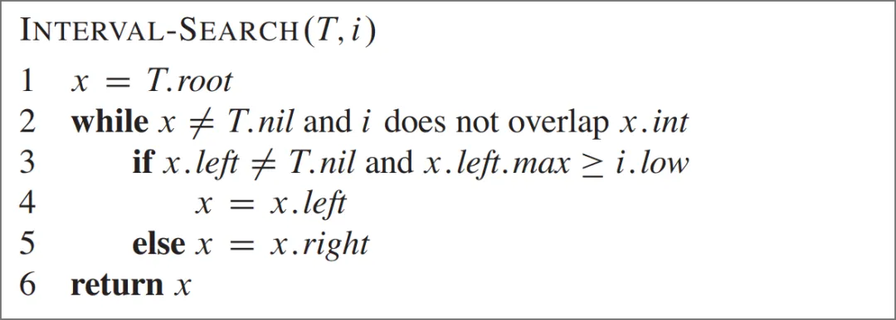

## 实现区间树的起因

在 Xline 最近的一次重构中， 我们发现有两个在关键路径上的数据结构 Speculative Pool 和 Uncommitted Pool 导致了性能瓶颈。这两个数据结构用于在 CURP 中进行冲突检测。具体来说， 由于 CURP 协议的要求， 对于每个处理的 command， 需要在已经接收的 commands 中找到所有与当前 command 相冲突的 commands。

例如对于 KV 操作 put/get_range/delete_range， 我们需要考虑这些操作之间可能的冲突情况。由于每个 KV 操作都会有一个 key 的范围， 所以问题就转化为要查询某一个 key 范围和某个 Pool 中所有 key 范围的集合是否有相交。采用朴素遍历整个集合的方法会导致每次查询的时间复杂度为 O(n)，从而降低效率并导致性能瓶颈。

为了解决这一问题， 我们需要引入区间树这一数据结构。区间树能够高效支持重叠区间的插入，删除和查询操作， 这三种操作都可以在 O(log(n)) 的时间内完成。因此， 我们可以利用区间树维护 key 范围的集合， 从而解决性能瓶颈的问题。

## 区间树实现简介

Xline 中的区间树是基于 Introduction to Algorithms (3rd ed.) 实现的， 它是由二叉平衡树扩展而来。

区间树以一颗二叉平衡树为基础(例如使用红黑树实现)， 将区间本身作为平衡树的 key。对于区间 [low, high] ， 我们首先按照 low 值进行排序， 如果 low 值相同， 再按照 high 值进行排序， 这样对区间集合能够定义一个全序的关系(如果不处理重复区间则不需要对 high 排序)。同时， 对于平衡树的每一个节点， 我们在这个节点上记录以这个节点为根的子树中 high 的最大值， 记为 max 。

### 插入/删除

与红黑树的插入/删除相同， 最坏时间复杂度为 O(log(n))

### 查询重叠操作

给出一个区间 i ， 我们需要查询当前树中是否有区间和 i 重合。在 Introduction to Algorithms 中给出的伪代码如下



有了 max 的定义， 解决这个问题的思路就非常简单了: 对于以 x 为根的子树 T_x ， 如果 i 不和 x_i 相交， 那么 i 一定是在 x_i 的左侧或者右侧。

1. 如果 i 在 x_i 的左侧这时可以直接排除右子树， 因为这时 i.high 比 x_i.low 还要小
2. 如果 i 在 x_i 的右侧在这种情况下， 我们无法直接排除左子树， 因为左子树中的节点区间仍然可能和 i 相交。这时候 max 值就派上用场了:

- 如果 x 的左子树中 high 的最大值仍然小于 i.low 的话， 那么可以直接排除 x 的左子树。
- 如果 x 的左子树中 high 的最大值大于或等于 i.low 的话， 那么左子树中一定存在和 i 相交的区间， 因为 x 左子树中所有的 low 都小于 x_i.low ， 而 i 在 x_i 的右侧， 所以 x 左子树中所有的 low 也小于 i.low ， 因此一定有相交。

通过以上两点可以验证上述伪代码的正确性， 并且从代码可以看出查询的最坏时间复杂度为 O(log(n)) 。

## 使用 Safe Rust 实现区间树

### 困难点

为了构建区间树， 我们首先需要实现一个红黑树。在红黑树中， 每个树节点需要指向父节点， 这就要求一个节点实例存在多个所有权。

### Rc<RefCell<T>>

最初我尝试使用了 Rust 最常见的多所有权的实现 Rc<RefCell<T>> ， 树节点结构类似于以下的代码:

```rust
struct Node<T, V> {
    left: Option<NodeRef<T, V>>,
    right: Option<NodeRef<T, V>>,
    parent: Option<NodeRef<T, V>>,
    ...
}

struct NodeRef<T, V>(Rc<RefCell<Node<T, V>>>);
```

从数据结构定义上看起来还算清晰， 但是实际使用起来相当繁琐， 因为 RefCell 要求用户明确地调用 borrow ， 或者 borrow_mut ， 我不得不构建很多 helper functions 来简化实现， 下面是一些例子:

```rust
impl<T, V> NodeRef<T, V> {
    fn left<F, R>(&self, op: F) -> R
    where
        F: FnOnce(&NodeRef<T, V>) -> R,
    {
        op(self.borrow().left())
    }

    fn parent<F, R>(&self, op: F) -> R
    where
        F: FnOnce(&NodeRef<T, V>) -> R,
    {
        op(self.borrow().parent())
    }

    fn set_right(&self, node: NodeRef<T, V>) {
        let _ignore = self.borrow_mut().right.replace(node);
    }

    fn set_max(&self, max: T) {
        let _ignore = self.borrow_mut().max.replace(max);
    }
    ...
}
```

RefCell 使用上不符合人体工程学是一点， 更糟糕的是我们在代码中需要使用大量的 Rc::clone ， 因为在自上而下遍历树节点时， 我们需要持有一个节点的 owned type， 而不是一个引用。例如在之前提到的 INTERVAL-SEARCH 操作中， 每次 x = x.left 或者 x = x.right ， 首先需要 borrow x 本身， 再赋值给 x。因此需要先取得左(或右)节点的 owned type， 再更新 x 到新值。这样导致大量的节点计数开销。

具体开销到底有多大?我尝试对于我们上面的实现进行 benchmark， 使用随机数据插入和删除。我本机环境为 Intel 13600KF 和 DDR4 内存。

```bash
test bench_interval_tree_insert_100           ... bench:       9,821 ns/iter (+/- 263)
test bench_interval_tree_insert_1000          ... bench:     215,362 ns/iter (+/- 6,536)
test bench_interval_tree_insert_10000         ... bench:   2,999,694 ns/iter (+/- 134,979)
test bench_interval_tree_insert_remove_100    ... bench:      18,395 ns/iter (+/- 750)
test bench_interval_tree_insert_remove_1000   ... bench:     385,858 ns/iter (+/- 7,659)
test bench_interval_tree_insert_remove_10000  ... bench:   5,465,355 ns/iter (+/- 114,735)
```

使用相同数据和环境， 和 etcd 的 golang 区间树实现进行对比:

```bash
BenchmarkIntervalTreeInsert100-20                 123747             12250 ns/op
BenchmarkIntervalTreeInsert1000-20                  7119            189613 ns/op
BenchmarkIntervalTreeInsert10_000-20                 340           3237907 ns/op
BenchmarkIntervalTreeInsertRemove100-20            24584             45579 ns/op
BenchmarkIntervalTreeInsertRemove1000-20             344           3462977 ns/op
BenchmarkIntervalTreeInsertRemove10_000-20             3         358284695 ns/op
```

可以看到我们的 Rust 实现并无优势， 甚至有时插入操作还会更慢。(注: 这里的 etcd 的节点删除实现似乎有问题， 观察节点数量从 1000->10000 时耗时的增长， 复杂度可能不是 O(log(n)))

#### 线程安全问题

即使我们勉强接受以上的性能， 一个更严重的问题浮出水面: Rc<RefCell<T>> 无法在多线程环境下使用! 由于 Xline 是在 Rust 的 Tokio runtime 之上构建， 需要在多个线程间共享一个区间树实例。可惜的是， Rc 本身是 !Send ， 因为 Rc 内部的引用计数是以非原子的方式递增/减的。那么这就导致整个区间树的数据结构无法发送到其他线程。除非我们采用一个专用线程， 并且通过 channel 与这个线程进行通信， 我们无法在多线程环境下使用。

### 其他智能指针

于是我们需要考虑其他智能指针来解决这个问题。一个自然的想法是使用 Arc<RefCell<T>> 。然而， RefCell 本身是 !Sync ， 因为 RefCell 的 borrow checking 只能在单线程下使用， 无法同时由多个线程共享， 并且 Arc<T> 是 Send 当且仅当 T 是 Sync ， 因为 Arc 本身允许克隆。

#### Arc<Mutex<T>>?

那么在多线程环境多所有权似乎只能够使用 Arc<mutex<T>> 了。但是显然这对于我们的用例来说是一个 anti-pattern， 因为这样我们就需要对每一个节点都加上一把锁， 而树中可能有数十万乃至几百万的节点， 这是不可接受的。

#### QCell

在使用常规方法无果后， 我们尝试使用了 qcell 这个 crate， 其中 QCell 作为 RefCell 的多线程替代品。作者非常巧妙地解决了多所有权下借用检查的问题。

**QCell 设计**

由于 qcell 的设计在 GhostCell 的论文中有正式的证明， 这里我就介绍介绍一下 GhostCell 论文中的设计:

在 Rust 中， 对于数据操作的权限和数据本身是绑定在一起的， 也就是说， 你首先要拥有一个数据， 才能修改它的状态。具体一点， 想要修改数据 T ， 你要么有一个 T 本身， 要么有一个 &mut T 。

GhostCell 的设计概念是将对数据操作的权限和数据本身分开， 那么对于一种数据， 数据 T 本身是一个类型， 而它的权限同样也是是一个具体的类型， 记为 P_t 。这种设计相比与 Rust 现有设计就更加灵活， 因为可以让一个权限类型的实例拥有对一个数据集合的权限， 即一个 P_t 拥有多个 T 。在这种设计下， 只要权限类型实例本身是线程安全的， 它所管理的这一个数据集合也是线程安全的。

在 qcell 中使用方法如下， 首先需要创建一个 QCellOwner 代表前述的权限， QCell<T> 则表示储存的数据。

```rust
let mut owner = QCellOwner::new();
let item = Arc::new(QCell::new(&owner, Vec::<u8>::new()));
owner.rw(&item).push(0);
```

QCellOwner 拥有注册到它这里的 QCell 的读写权限(通过 QCellOwner::rw 或者 QCellOwner::ro )， 所以只要 QCellOwner 是线程安全， QCell 中的数据也是线程安全的。在这里 QCellOwner 本身是 Send + Sync ， QCell 也可以是 Send + Sync 只要 T 满足:

```rust
impl<T: ?Sized + Send> Send for QCell<T>
impl<T: ?Sized + Send + Sync> Sync for QCell<T>
```

**使用 QCell**

得益于它的设计， QCell 本身开销非常小(这里的具体的开销不展开讲了)， 因为它借助于 Rust 类型系统使得 borrow checking 是在编译期检查的， 而 RefCell 相比之下则是在运行时检查， 因此使用 QCell 不仅能在多线程环境下使用， 还能够提升一部分性能。

接下来就是应用 QCell 到我们的树实现上了。由于 QCell 只提供内部可变性， 要能够使用多重所有权， 我们还需要有 Arc ， 结构大致看起来如下:

```rust
pub struct IntervalTree {
    node_owner: QCellOwner,
    ...
}

struct NodeRef<T, V>(Arc<QCell<Node<T, V>>>);
```

看起来不错， 那么性能如何呢?

```bash
test bench_interval_tree_insert_100           ... bench:      41,486 ns/iter (+/- 71)
test bench_interval_tree_insert_1000          ... bench:     586,854 ns/iter (+/- 13,947)
test bench_interval_tree_insert_10000         ... bench:   7,726,849 ns/iter (+/- 102,820)
test bench_interval_tree_insert_remove_100    ... bench:      75,569 ns/iter (+/- 325)
test bench_interval_tree_insert_remove_1000   ... bench:   1,135,232 ns/iter (+/- 7,539)
test bench_interval_tree_insert_remove_10000  ... bench:  15,686,474 ns/iter (+/- 194,385)
```

比较之前的测试结果， 性能竟然下降了 1-3 倍。这说明最大的开销不是 Cell， 而是引用计数， 在我们的区间树用例中， 使用 Arc 比 Rc 慢了非常多。

一个不使用 Arc 的方法是使用 arena 分配， 即一次性对所有对象分配内存， 并且销毁也是一次性的， 但是这在树的数据结构中并不适用， 因为我们需要动态地分配和销毁节点的内存。

### 数组模拟指针

性能测试反映出我们的智能指针尝试是失败的。在 Rust 所有权模型下， 使用智能指针来实现树结构是非常糟糕的。

那么我们可不可以不使用指针来实现呢? 一个自然的想法是使用数组来模拟指针。

于是我们的树结构重新设计如下:

```rust
pub struct IntervalTree {
    nodes: Vec<Node>,
    ...
}

pub struct Node {
    left: Option<u32>,
    right: Option<u32>,
    parent: Option<u32>,
    ...
}
```

可以看出在 Rust 中数组模拟指针的优势是不需要某个节点的所有权， 只需要记录下某个节点在 Vec 中的位置即可。每次插入新节点即向 nodes 后面 push 一个节点， 它的模拟指针就是 nodes.len() - 1 。

对于插入操作非常简单， 但是如果我们需要删除节点呢? 如果使用朴素的删除方法: 更新树节点的指针后直接将 Vec 中的对应的节点置为空， 那么这样就会在我们的 Vec 中留下一个“空洞”。这样的话我们需要再额外维护一个链表结构来记录这个“空洞”的位置， 以便在下一次插入的时候能重新使用。而且这种方法会导致 nodes 这个 Vec 的空间难以回收， 即使大部分节点已经被删除。

那么如何解决这个问题呢? 接下来我参照了 petgraph 中的方法， 在删除一个节点时， 将这个节点与 Vec 中最后一个节点交换再移除， 这样就解决了之前的内存回收的问题。需要注意的是， 我们需要同时更新与最后一个节点有关节点的指针， 因为它的位置发生了变化。在 petgraph 的图实现中， 这个操作可能是很耗时的， 因为一个节点可能会连接多条边， 但是在我们的树用例中， 我们只需要更新这个节点的父亲/左孩子/右孩子总共 3 个节点， 因此这个操作是 O(1) 的， 这样就非常高效的解决了节点删除的问题。

我们再来对我们的新实现进行 benchmark:

```bash
test bench_interval_tree_insert_100           ... bench:       3,333 ns/iter (+/- 87)
test bench_interval_tree_insert_1000          ... bench:      85,477 ns/iter (+/- 3,552)
test bench_interval_tree_insert_10000         ... bench:   1,406,707 ns/iter (+/- 20,796)
test bench_interval_tree_insert_remove_100    ... bench:       7,157 ns/iter (+/- 69)
test bench_interval_tree_insert_remove_1000   ... bench:     189,277 ns/iter (+/- 3,014)
test bench_interval_tree_insert_remove_10000  ... bench:   3,060,029 ns/iter (+/- 50,829)
```

从结构来看这次的性能提升非常之大， 对比之前的 Rc<RefCell<Node>> 或者是 etcd 的 golang 的实现大约快了 1-2 倍。

使用数组模拟指针不仅轻松解决了所有权的问题， 并且由于数组内存的连续性使其对于缓存更加友好， 比纯指针性能甚至会更高。

## 总结

至此， 我们成功完美解决了使用 safe Rust 实现区间树的问题。从之前所述的多种尝试来看， 在 Rust 中使用引用计数智能指针来实现树或者图的数据结构是失败的， 因为这些智能指针并不适用于大量的内存操作。将来如果需要使用 safe Rust 实现指针类数据结构， 我会优先考虑使用数组而不是智能指针。
