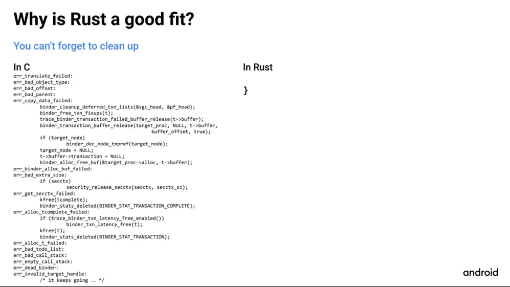
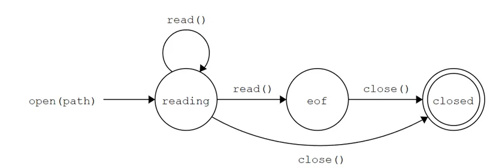

本文提供了一个设计模式的综合概述，涵盖了设计模式的必要性，基本原则以及 23 种常见模式的概括性描述。结合 Rust 语言自身的特性，重点阐述了 Rust 中 Builder，Combinator，RAII,Typestate(state machine), Command, Strategy 和 Visitor 七种设计模式的应用。本文前半部分主要在阐述设计模式的思想和具体实例，如果读者已经很熟悉这一部分，可以自行跳转到第二小节。

## 速览设计模式

### 为什么需要设计模式

- **减小代码的耦合程度**

低耦合度的系统更易于管理和扩展，同时降低了修改一个组件时影响其他组件的风险。具体来说，低耦合的系统能够更方便添加新的功能，也有益于单元测试的划分。

- **良好的编程范式有利于避免一些逻辑错误**

设计模式提供了一套经过验证的最佳实践，帮助程序员遵循良好的编程原则，如单一责任原则和开闭原则等。这些原则和模式指导开发者如何正确地组织代码结构和逻辑，从而减少编程中可能出现的逻辑错误。例如，在状态机模式中，使用者不能调用非当前状态的方法；在 RAII 模式中，资源会在变量被释放时自动释放。

- **有利于代码复用**

设计模式鼓励使用通用的方法来解决相似问题。这种方式使得核心算法的设计得以复用，而具体的步骤可以根据不同的需求进行调整和重用。

### 设计模式中的基本原则

设计模式中著名的 SOLID 原则概括了面向对象设计的五个基本法则，帮助开发者构建更健壮、灵活的系统。在设计代码架构时，开发者不应仅限于应用常见的设计模式，而应深入理解并实践 SOLID 的核心思想。

- **单一职责 (Single Responsibility Principle, SRP)**

每个类应只有一个引起变化的原因，即一个类应只负责一项任务或功能。

- **开闭原则 (Open/Closed Principle, OCP)**

软件实体（如类、模块、函数等）应对扩展开放，对修改关闭。这通常通过使用接口或抽象类实现，允许通过添加新的子类来扩展功能，而不需修改现有代码。

- **里氏替换 (Liskov Substitution Principle, LSP)**

子类对象应能够替换它们的父类对象而不破坏程序的正确性。设计子类时，应保证能够替代父类功能，不引入额外异常行为或削弱原有功能。

- **接口隔离 (Interface Segregation Principle, ISP)**

应将大接口（提供多功能的接口）拆分为更小、更具体的接口，使实现接口的类只需关心它们真正需要的方法。

- **依赖倒置(Dependency Inversion Principle, DIP)**

高层模块不应依赖于低层模块，两者都应依赖于抽象。抽象不应依赖于细节，细节应依赖于抽象。

- **迪米特法则（Law of Demeter）**

除此以外，GoF 一书还提到了迪米特法则（Law of Demeter），也称为最少知识原则。如果两个实体不需要直接通信，就不应发生直接调用。例如，使用 a.Method()而非 a.b.Method()可以减少系统耦合，增强可修改性和扩展性。

### 常见设计模式

介绍设计模式及其应用的博客在互联网上已经有很多，本文不打算再进行重复，而是试图用简短的语句向读者概括一下设计模式及其使用的场景。如果读者不了解设计模式，可以搜索对应的关键词查看其他博客。

下面简单介绍了各种模式的含义和常用场景。

#### 建造型

- **工厂模式 Factory**

定义一个创建对象的接口，让子类决定实例化哪一个类，使得类的实例化延迟到子类中。  
当类的初始化需要依赖于具体情况和配置时，往往会用这种方式

- **抽象工厂 Abstract Factory**

定义一个接口来创建几种不同种类的类，其中每个种类可能有若干相互依赖的组件。用户无需指定需要用哪些特定的组件。  
当需要创建一组相关或依赖的对象时，会使用这种方式。

- **建造者 Builder**

定义一个接口，允许用户指定对象的步骤和过程；核心是分离的构造和表示两个步骤。  
主要用于创建复杂的对象，或者希望用相同的创建过程可以创建不同的表示。

- **原型 Prototype**

通过复制的方式创建对象。  
使用于构造表示比较复杂的对象。

- **单例 Singleton**

确保一个类只能有一个示例，并提供一个全局访问点来获取这个实例的设计模式  
当全局只需要一个实例时常用这种模式（例如线程池）

#### 结构型

- **适配器 Adapter**

创建一个中间层，使得已有接口和新接口能交互。  
一般已有接口是不可变或不方便修改的，例如 glibc 库等等

- **组合 Composite**

将对象组合为树形结构，上层对象会对用下层方法完成某个操作。这使得对单个对象和组合对象的使用具有一致性。  
一般在需要同时处理复杂对象和简单对象时，这种模式比较常用

- **桥接 Birdge**

将抽象部分和实现部分通过组合的方式分离（组合替代继承）  
很多时候都会用到这个模式，例如拆分庞大功能的类。

- **代理 Proxy**

通过一个对象管理资源的访问  
当访问资源开销较大，或需要权限检查等额外功能时，会使用这个模式

- **装饰器 Decorator**

定义函数的接口与被覆盖函数的接口相同，用户可以无感调用拓展功能的接口  
适合在原接口上无感拓展新的功能。

- **享元 Flywight**

当有大量结构体共享一部分相同的数据时，将这部分数据独立出来，所有结构体共享这部分数据。  
适用于不可变状态较多时节省内存。

- **外观 Facade**

将许多抽象的小接口汇聚为一个对象，对象内部不对接口做任何处理  
主要用于向外部提供统一接口

#### 行为型

- **职责链 Chiain of responsibility**

让请求以链式的形式逐一被处理。  
解耦发送者和执行者时常用

- **命令 Command**

将操作抽象为对象（通过函数指针等形式），从而允许使用不同的请求、队列或日志来参数化其他对象。  
常用于参数化对象或者排队执行一些操作。

- **策略 Strategy**

通过不同的上下文执行不同的算法变体，分离业务逻辑和具体的算法实现细节  
通常用来抽象做一件事的多种方式。

- **迭代器 Iterator**

隐藏迭代的细节，简化用户访问某个数据结构的代码  
访问各种数据结构时都可用

- **状态 State**

将不同的状态设计为不同的类  
当涉及到状态控制和转移的时候常用

- **备忘录 Memento**

将数据结构的状态保存一份，用于后续恢复状态  
常用于做 snapshot 等恢复状态的操作。

- **模板 Template**

在父类定义一个算法框架，子类实现算法的特定部分。  
常用于一些有固定执行逻辑的算法。

- **观察者 Observer**

订阅监听模式，使用一个对象维护事件和对象间的一对多关系，当被监听事件产生时，会通知每个监听的对象  
常用于需要处理事件，绑定回调函数的场景

- **访问者 Visitor**

将算法与其作用的对象结构分离，通过在被访问的对象中添加一个接受方法来接受访问者，从而实现在不修改这些对象的类的情况下定义新的操作。  
通常访问异构数据结构（例如树型）时常用

- **中介者 Mediator**

引入一个中心对象来简化多个对象间的通信，从而减少这些对象之间的直接引用  
通常用于解耦数据结构的的相互引用

- **解释器 interprete**

定义了一种语法用于特定的问题，并通过一个解释器来解释语言中的句子，用于实现语言的语法或表达式的解析和执行。
当特定问题有特定的写法时，常用 interpreter 来解决。

## Rust 中设计模式的应用

Rust 设计之初就在语言嵌入了很多优雅的模式，例如模式匹配，所有权机制，零成本抽象等等。下面，我们以 Rust 语言为例，介绍如何结合语言特性更好地利用设计模式。

### Builder

Builder 可能是 Rust 中应用最多的设计模式。  
定义一个函数的接口不总是那么简单，尤其是当你遇到下面的情况时：

- 有大量参数
- 有多个可选参数
- 只有某些参数的组合是有效的

加之 Rust 语言设计没有类似 Python 的关键字参数等特性，且不支持直接的函数重载，让我们处理复杂的接口定义更加棘手。

> Rust 并不是没有重载，相反，trait 中可以定义一个和类型实现中同名的方法，这就是一种重载。可以参考这篇文章：  
> Abstraction without overhead: traits in Rust  
> https://blog.rust-lang.org/2015/05/11/traits.html

例如，我们需要一个函数来处理打开文件的选项。

```rust
fn set_flag(
    is_read: bool,is_write: bool,is_append: bool,is_truncate: bool,is_create: bool,
) -> u32 {
    let mut flag = 0;
    if is_read {
        flag |= 0x0001;
    }
    // ....
    flag
}

fn main(){
    let flag = set_flag(true, true, false, false, false);
}
```

这种写法可读性很差，非常有可能导致你传错参数。

一种做法是将上面的参数组合为一个结构体，然后在结构体中实现约束。作为一个特殊的例子，我们可以直接用 bitflag 去抽象上面的参数。

另一种做法是使用 builder。std 中的 fs::OpenOptions 就使用了这种写法。

以用读/写权限打开 foo.txt 为例：

```rust
use std::fs::OpenOptions;
let file = OpenOptions::new()
    .read(true)
    .write(true)
    .open("foo.txt");
```

这种写法就十分的清晰。让我们来看看 std 中这个结构体的实现：

```rust
// unix OpenOptions: library/std/src/sys/pal/unix/fs.rs
// library/std/src/fs.rs
pub struct OpenOptions(OpenOptions);
impl OpenOptions {
    pub fn read(&mut self, read: bool) -> &mut Self {
        self.0.read(read);
        self
    }
    pub fn write(&mut self, write: bool) -> &mut Self {
        self.0.write(write);
        self
    }
    pub fn open<P: AsRef<Path>>(&self, path: P) -> io::Result<File> {
        // self._open调用了对应操作系统抽象层的open函数
        self._open(path.as_ref())
    }
}
```

可以看到，在设置完参数 flag(read/write)后，会返回 builder 自己的可修改引用，这样就能使用链式调用了。

Builder 这个设计模式的写法是相对比较固定的，因此有人开发了 derive_builder 这个 crate，你可以通过添加 attribute 的形式快速为一个结构体添加它的 builder。

```rust
#[derive(Default, Builder, Debug)]
#[builder(setter(into))]
struct Channel {
    token: i32,
    special_info: i32,
}
fn main() {
    let ch = ChannelBuilder::default()
        .special_info(42u8)
        .token(19124)
        .build()
        .unwrap();
    println!("{:?}", ch);
}
```

这样生成出来的 Builder 模式是比较固定的，读者自己参照这个模式去实现。如果需要定制化地实现一个建造者，可以阅读 Rust API 指南中的几个 tips 后再进行实现。

### Combinator

Combinator 是一个函数式编程的概念，但如今也在许多函数是一等公民的语言中。Combinator 指的是一个函数仅通过其他函数的组合来完成工作。在 Rust 中，最常见的应用是在异常处理中（Option and Result）。当然，上面的 builder 也是 combinator 一个特化形式。Option 和 Result 提供了大量 combinator 函数供用户转换和处理异常，同时提供了?语法糖简化常见的 match 语句。下面以 option 的 API 为例，简单介绍如何写出 combinator 风格的错误处理。Option 提供了一系列 Transform 高阶函数，例如：

- `Option  -> Result :  Option::ok_or, Option::ok_or_else`
- `Option<T>  ->  Option<T>  : Filter`
- `Option<Option<T>>  -> Option<T> : flatten`
- `Option<T> -> Option<U>  : map,map_or, map_or_else`
- `Option<T>  -> Option<(T,U)> : zip, zip_with, unzip.`

```rust
let maybe_some_string = Some(String::from("Hello, World!"));

let maybe_some_len = maybe_some_string.map(|s| s.len());
assert_eq!(maybe_some_len, Some(13));

let x: Option<&str> = None;
assert_eq!(x.map(|s| s.len()), None);
```

此外，我们可以对 Option 做 bool 操作。例如调用 Option::and。如果调用的 Option 不为空，且传入的 Option 也不为空，则返回 Option。我们也可以传入一个函数。Option::and_then()传入一个函数，该函数接收一个 Option 内部的类型。如果 Option 非空，则执行这个函数。and_then 能帮助你更好地处理异常。Rust example 上有这样一个例子。例如，有下面两种结构体，Food 和 Day。

```rust
#[derive(Debug)] enum Food { CordonBleu, Steak, Sushi }
#[derive(Debug)] enum Day { Monday, Tuesday, Wednesday }
```

当 Food 为 Sushi 时，have_ingredients 返回一个 None，表示没有原料；当 Food 为 CordonBleu，have_recipe 返回一个 None，表示没有菜谱。

```rust
fn have_ingredients(food: Food) -> Option<Food> {
    match food {
        Food::Sushi => None,
        _           => Some(food),
    }
}

fn have_recipe(food: Food) -> Option<Food> {
    match food {
        Food::CordonBleu => None,
        _                => Some(food),
    }
}
```

接下来要实现一个 cookable 函数，表示一个食物既有菜谱，又有原料，如果使用 match 语句就会显得有点冗长。我们可以使用 option 中的 and_then 将其转化为 combinator。

```rust
fn cookable(food: Food) -> Option<Food> {
    have_recipe(food).and_then(have_ingredients)
}
```

如果 have_recipe 返回 None，那么这个函数也会返回 None。否则，它会执行 have_ingredients 再去检查。事实上，and_then 内部也是一个 match 语句。虽然这样写编译的产物没有发生很大变化，但是使用 combinator 后整体的逻辑变得更加清晰，同时也有利于编译器做优化。

```rust
    pub fn and_then<U, F>(self, f: F) -> Option<U>
    where
        F: FnOnce(T) -> Option<U>,
    {
        match self {
            Some(x) => f(x),
            None => None,
        }
    }
```

### RAII

RAII 指的是 Resource Acquisition Is Initialization，意思是资源初始化在对象的构造器中完成，最终化（资源释放）在析构器中完成。RAII 可以简化类似 C 中复杂的异常处理，同时又可以避免程序员一些逻辑错误导致资源没有释放。



利用 RAII 的思想，可以设计一类 Guard 结构体，它们提供对资源访问的唯一安全接口。Rust 中 Mutex 等锁就利用了这一思想。

一个 C 风格的锁如下面的代码所示：

```rust
struct Mutex<T> {
    data: UnsafeCell<T>,
    system_mutex: SystemMutex,
}

impl<T> Mutex<T> {
    pub fn new(t: T) -> Self { /* .. */}
    pub fn lock(&self) -> &mut T {
        self.system_mutex.lock();
        unsafe { &mut *self.data.get() }
    }
     pub fn unlock(&self) {
        self.system_mutex.unlock();
    }
}
```

用户需要调用 unlock 来解锁。这么写可能有个问题：

- 调用者调用 lock 后，忘记 unlcok 了，导致死锁，这种情形在多出口的 while 循环中很常见。

在标准库中，调用 Mutex::lock 后，不会返回对资源的直接引用，而是一个被 MutexGuard 保护的资源的引用：

```rust
pub struct MutexGuard<'a, T: ?Sized + 'a> {
    lock: &'a Mutex<T>,
}

impl<'a, T> MutexGuard<'a, T> {
    fn new(lock: &'a Mutex<T>) -> Self {
        lock.system_mutex.lock();
        MutexGuard { lock }
    }

     fn get(&mut self) -> &mut T {
        &mut *self.lock.get_mut()
    }
}
```

调用者可以调用 guard 的 get 方法来获取内部引用。  
同时，Guard 还实现了 drop 特性：

```rust
impl<'a, T:?Sized> Drop for MutexGuard<'a, T> {
    fn drop(&mut self) {
        self.lock.system_mutex.unlock();
    }
}
```

当 Guard 离开作用域时，就会自动调用 unlock 方法解锁。除了使用 Guard 的方式保护内部变量，还可以提供回调接口的方式进行保护。比如

```rust
impl<T> Mutex<T> {
    pub fn lock_closure(&self, mut f: impl FnMut(&mut T)) {
        self.system_mutex.lock();
        f(self.get_mut());
        self.system_mutex.unlock();
    }
}
```

- Guard 保护的一般是完整的结构体，如果想要用户只能访问结构体内部的某些字段，除了可以用多个锁的方案，可以尝试 parking_lot 中的 try_map 方法。

Guard 最场景的用途是在锁资源的保护中，但并不意味着这种模式只能用于锁，当我们需要实现一些延迟访问或者批量处理的操作也可以用这个模式。

### Typestate

typestate 是 Rust 中另一个经典的模式。传统的状态模式用一个枚举值来表示状态，而 Rust 中你可以利用 enum 的特性来实现使用基于类型的状态管理。这个模式被称为 Typestate，也有称为 session type。Typestate 相较于传统的枚举值有很多好处：

- 防止用户从非开始状态进入
- 防止发生错误的转换
- 特别地,Rust 的所有权机制可以消耗掉状态，使得用户手上的状态发生转换后就不会存在。

下面以一个文件打开、读取操作为例，简单介绍 typestate 模式。



一个文件的读写操作可能涉及到上面的状态转移图。我们可以用 Rust 抽象这一过程。完整的代码见此：

https://play.rust-lang.org/?version=stable&mode=debug&edition=2021&gist=46e1d2efa6954acfd7a5b028c70f4612

我们定义一个保存读取内容和 fd 的结构体：

```rust
pub struct File {
    fd: libc::c_int,
    buf: Vec<u8>,
}
```

调用和封装 C FFI 的 open 和 read：

```rust
use std::ffi::CString;
impl File {
    pub fn open(path: String) -> Result<File, String> {
        let fd = unsafe { libc::open(CString::new(path).unwrap().as_ptr(), 0) };// 调用c ffi
        // 返回结果..
    }
    pub fn read(mut self, bytes: usize) -> Result<usize, String> {
        let bytes_read =
            unsafe { libc::read(self.fd, self.buf.as_mut_ptr() as *mut libc::c_void, bytes) };
        if bytes_read == -1 {return Err(std::io::Error::last_os_error().to_string());} // 处理异常
        unsafe{self.buf.set_len(self.buf.len() + bytes_read as usize)};
        Ok(bytes_read as usize)
    }
}
```

注意到上面的代码中，如果 read 进入到 eof 状态时，它返回 bytes_read 小于期望读取的字符数，但是这里并没有做特殊的处理；同时，进入 eof 状态后，我们并不希望调用者再去调用 read 函数了。我们可以将 EOF 状态和正常状态分为两个结构体：

```rust
struct FileEof(i32);
pub enum ReadResult {
    File(File),
    FileEof(FileEof),
    Error(String),
}
```

然后，在 read 方法中，针对 c ffi 中 read 的不同结果返回不同类型：

- 如果 read 返回-1, 那么返回 ReadResult::Error
- 如果 read 返回小于要求的字节数，说明到达 EOF 状态，返回 ReadResult::FileEof
- 否则，返回 ReadResult::File 状态

```rust
impl File {
    pub fn open(path: String) -> Result<File, String> {// same as before}

    pub fn read(mut self, bytes: usize) -> ReadResult {
        // same as before
        // bytes_read是read读取的字节数
        if (bytes_read as usize) < bytes {
            ReadResult::FileEof(FileEof(self.fd))
        } else {
            ReadResult::File(self)
        }
    }
}
```

当 Read 返回时，除了异常状态，它可能返回的是一个正常的 File，也可能是一个 FileEof 结构体。对于前者，调用者仍然可以继续调用 read 读取；然而后者则没有实现 read 方法。这样，我们就从类型的层面隔离了两种状态。同时，用户也可以通过 match 等方法判断是否出现了文件读取 EOF 的情形。

我们还没实现 close 方法。close 方法无论是普通状态还是 EOF 状态都有。这样，我们就不得不分别为两个结构体实现一个相同的方法，这并不优雅。

注意到类似 C 语言中使用枚举值表示状态的写法，只需要写一个结构体，并且为该结构体实现方法。有没有办法既利用 Rust 的类型系统隔离两种类型，又只需要写一个结构体呢？Rust 的泛型和零成本抽象可以帮助我们解决这个问题。

```rust
use std::marker::PhantomData;

pub struct Reading;
pub struct Eof;

pub struct File<S> {
  fd: libc::c_int,
  buf: Vec<u8>,
  closed : bool,
  _marker: PhantomData<S>,
}

pub enum ReadResult { File(File<Reading>), FileEof(File<Eof>), Error(String) }
```

区分不同类型的枚举值仍然是类型，与之前不同的是，我们将类型作为 File 结构体的参数传入。例如，普通状态的 File 结构体是 File，而读取结束的 File 结构体则是 File。

然后，我们可以为 File 特化实现一个 Read 方法：

```rust
mpl File<Reading> {
    pub fn open(path: String) -> Result<File<Reading>, String> {
       // same as before
    }

     pub fn read(mut self, bytes: usize) -> ReadResult {
       // same as before
    }
}
```

然后再为 File<Reading>和 File<Eof>同时实现一个 close 方法：

```rust
impl<S> File<S> {
    pub fn close(mut self) -> Result<(), String> {
        if unsafe{libc::close(self.fd)} == -1 {
            Err(std::io::Error::last_os_error().to_string())
        } else {
            Ok(())
        }
    }
}
```

当然，我们还应该将 close 实现为 drop trait，而不只是一个方法

```rust
impl<S> Drop for File<S> {
  fn drop(&mut self) {
    if !self.closed {
      unsafe { libc::close(self.fd); }
    }
  }
}
```

许多开源项目都使用了 typestate 这种设计模式，例如

> hyper 中实现 http2 协议的部分代码如下
> https://github.com/hyperium/hyper/blob/master/src/proto/h2/server.rs#L92

```rust
enum State<T, B>
where
    B: Body,
{
    Handshaking {
        ping_config: ping::Config,
        hs: Handshake<Compat<T>, SendBuf<B::Data>>,
    },
    Serving(Serving<T, B>),
    Closed,
}
```

这里的 state 表示服务器的三个状态。Handshaking 表示在进行握手阶段，例如在建立连接时的初始握手。Serving 表示服务器已经成功握手并正在服务请求。它包含了一个 Serving 结构体，其中具体实现了请求的处理逻辑。.Closed 表示连接已经关闭，不携带任何额外数据。在 poll 函数中，hyper 实现了不同状态的转换。

Handshaking 状态:

- 当服务器处于 Handshaking 状态时，它尝试完成握手过程。
- 使用 poll 方法检查底层握手（hs）是否准备好继续进行。如果 hs 没有准备好，这将返回 Poll::Pending 并将当前任务注册到要通知的 Waker。
- 如果握手完成，它检查是否需要配置 Ping 功能（基于 ping_config）。如果需要，它设置与 ping 相关的逻辑。
- 状态转变为 Serving，这意味着服务器准备开始服务请求。

Serving 状态:

- 在 Serving 状态中，服务器开始处理传入的请求。
- poll_server 被调用以继续处理或完成请求。这可能涉及读取网络数据，执行应用程序逻辑，以及发送响应。
- 如果服务器完成了所有的服务工作，它会返回 Poll::Ready(Ok(Dispatched::Shutdown))，表示服务器准备关闭。

Closed 状态:

- 如果服务器在完成握手前已经被标记为关闭（Closed），则直接返回 Poll::Ready(Ok(Dispatched::Shutdown))。

```rust
impl<T, S, B, E> Future for Server<T, S, B, E>
where
    T: Read + Write + Unpin,
    S: HttpService<IncomingBody, ResBody = B>,
    S::Error: Into<Box<dyn StdError + Send + Sync>>,
    B: Body + 'static,
    E: Http2ServerConnExec<S::Future, B>,
{
    type Output = crate::Result<Dispatched>;
    fn poll(mut self: Pin<&mut Self>, cx: &mut Context<'_>) -> Poll<Self::Output> {
        let me = &mut *self;
        loop {
            let next = match me.state {
                State::Handshaking {ref mut hs,ref ping_config} => {
                   // 处理握手状态
                }
                State::Serving(ref mut srv) => {
                  // 处理连接状态
                }
                State::Closed => {
                  // 优雅关闭
                }
            };
            me.state = next;
        }
    }
}
```

通过利用 typestate 机制，hyper 实现了一个编译期就能进行检查状态管理安全性的 Server 结构。

### Command

命令模式的基本思想是将操作分离为对象，并将它们作为参数传递。在 Rust 中，主要有以下两种种方式可以绑定

- Trait 对象
- 函数指针

例如，我们要针对一个窗体执行一系列的 GUI 命令，有 open,close 等等.如果使用 Trait 的话，我们可以定义如下：

```rust
pub trait Command {
    fn execute(&self) -> &str;
}
```

我们分别实现一个 Open 和 Close Command:

```rust
pub struct Open;
impl Command for Open {
    fn execute(&self) -> &str {
        "open"
    }
}

pub struct Close;
impl Command for Close {
    fn execute(&self) -> &str {
        "close"
    }
}
```

最后定义一个 Executor，逐一取出容器内的命令执行即可。

```rust
struct Executor {
    commands: Vec<Box<dyn Command>>,
}

impl Executor {
    fn execute(&self) -> Vec<&str> {
        self.commands.iter().map(|cmd| cmd.execute()).collect()
    }
}
```

如果命令本身比较简单，也可以直接将函数指针传入

```rust
type FnPtr = fn() -> &'static str;
pub struct Command{
    execute : FnPtr,
}
struct Executor; // same as before

impl Executor {
    fn add_command(&mut self, command: FnPtr) {
        self.commands.push(Command { execute: command });
    }
    fn execute(&self) -> Vec<&str> {
        self.commands.iter().map(|cmd| (cmd.execute)()).collect()
    }
}
```

但是这种形式的 command 没有类型上的隔离，可读性不如上一种。此外，我们可能在 Command 中存有其他的上下文或者变量。如果你的命令本身比较复杂的话，第一种方式会是更好的选择。

### Strategy

策略模式和命令模式十分类似，但是策略模式更注重表达“做一件事的不同方式"。

例如，我们希望实现一个 Serializate 特定数据结构的类。

```rust
struct Point{
    x : f32,
    y : f32
}
```

我们希望能将他转为以下两种形式：

- 普通的字符串，形如"{x},{y}"
- Json 字符串

我们可以实现一个 Trait，这个 trait 接受一个 Point 结构体，然后将其放入到字符串中

```rust
trait Serialize {
    fn serialize(&self, data: &Point, buf: &mut String);
}
```

然后，分别为两种策略实现 serialize 方法

```rust
struct NormalSerializer;

impl Serialize for NormalSerializer{
    fn serialize(&self, data: &Point, buf: &mut String) {
        buf.push_str(&format!("{},{}", data.x, data.y));
    }
}

struct JsonSerializer;
impl Serialize for JsonSerializer{
    fn serialize(&self, data: &Point, buf: &mut String) {
        buf.push_str(&format!("{{\"x\":{}, \"y\":{}}}", data.x, data.y));
    }
}
```

使用时，首先构建想要序列化的方法的结构体，然后调用其序列化方法即可。

```rust
fn main() {
    let point = Point { x: 1.0, y: 2.0 };
    let mut buf = String::new();
    let normal_serializer = NormalSerializer;
    normal_serializer.serialize(&point, &mut buf);
    println!("{}", buf);
}
```

### Visitor

Visitor 模式可以将对多种对象数据的行为单独放在一个类中，可以视为是 Command 的加强版。一般而言，在解析异构数据（例如树结构）时我们常常会用到 Visitor。Visitor 可以分离解析数据和操作数据两件事情。

在 Rust 中，常用 Visitor 的场景主要在遍历 AST 树和进行反序列化。

考虑上面 strategy 的例子，如果我们需要写一个反序列化器，从文本转为 Point。我们可以采用类似的思路

```rust
impl Deserialize<&str> for Point {
    type Error = PointDeserializationError;

     fn deserialize(input: &str) -> Result<Self, Self::Error> {
        let split = input.split(",").collect::<Vec<_>>();
        Ok(Point {
            x: split[0].parse().map_err(|_| PointDeserializationError)?,
            y: split[1].parse().map_err(|_| PointDeserializationError)?,
        })
    }
}
```

同样，如果要从 Json 形式转为 Point，可以用 newtype 封装一下 json

```rust
struct Json(String);

impl Deserialize<Json> for Point {
    type Error = PointDeserializationError;

     fn deserialize(input: Json) -> Result<Self, Self::Error> {
        todo!()
    }
}
```

如果此时，你需要又要从 Hashmap 转为 Point。这个操作很简单。但是你可能突然想到，上面 Json 转为 Point，似乎也可以先从 Json 转为 Hashmap，再从 Hashmap 转为具体的数据结构。进一步来说，如果我有 M 种要反序列化的结构体，有 N 种目标结构体，使用一一对应的方式我们就需要实现 M*N 种方式，而且这其中有许多代码是可以被复用的。而假如我们添加一个中间层，提供 X 种方式（X 是一个相对小的数），那么这样就只需要实现 M*X + X\*N 种方式了。Serde 的反序列化器定义类似下面的结构

```rust
trait Visitor<'de> {
    type Value;
    fn visit_map<M>(self, map: M) -> Result<Self::Value, M:: Error>
    where
        M: MapAccess<'de>;
}

trait Deserializer<'de> {
    type Error;
    fn deserialize_struct<V>(self, visitor: V) -> Result<V::Value, Self::Error>
    where
        V: Visitor<'de>;
}
```

Deserializer 中除了定义 deserialize_struct 还定义了其他反序列化方法，visitor 也是一样，这里仅列出两个本例中所提到的方法。

我们就可以将一个 Json 的反序列化实现为下面的形式。

首先我们需要定义一个 JsonDeserializer。这个结构体负责将 Json 格式的字符串转化为一个中间表示 MapAccess。

> MapAccess 是 Serde 中提供给 Visitor 的参数之一。读者可以阅读 Serde 文档了解更多关于 MapAccess 的信息，这里不再展开
> https://docs.rs/serde/latest/serde/de/trait.MapAccess.html

类似地，当你再写其他更多的序列化器时，就可以专注于解析成特定的中间表示，而不是将这些功能都放在一个类中。

```rust
struct JsonDeserializer {//...}
impl<> JsonDeserializer {
    // 假设这里实现了解析Json的功能，并返回了一个MapAccess
    fn parse_map(&self) -> Result<Box<dyn MapAccess>, JsonError> {todo!()}
}
struct JsonError;
```

接下来为 JsonDeserializer 实现 Deserializer Trait。这里我们调用 JsonDeserializer 的解析方法，然后将它传给一个实现了 visit_map 方法的 Visitor。Visitor 将会决定我们反序列化的结果是什么。

```rust
impl<'de> Deserializer<'de> for JsonDeserializer {
    type Error = JsonError;
    fn deserialize_struct<V>(self, visitor: V) -> Result<V::Value, Self::Error>
    where
        V: Visitor<'de>
    {
        let map = self.parse_map().map_err(|_| JsonError)?;
        visitor.visit_map(map).map_err(|_| JsonError)
    }
 }
```

我们还需要实现一个 Visitor,这个 visitor 接受一个 MapAccess 结构体作为参数，返回一个目标结构体——这里就是我们的 Point 结构体。

```rust
struct PointVisitor;
impl<'de> Visitor<'de> for PointVisitor{
    type Value = Point;

    fn visit_map<M>(self, mut access: MapAccess<'de>) -> Result<Self::Value, M::Error>
    {
        let x = access.next_value()?
        let y = access.next_value()?
        Ok(Point{x,y})
    }
}
```

如果此时，你接到了新的需求，需要将输出改为一个元组。这时你只需要简单的实现一个新的 Visitor 即可。

我们将这样的形式称为”双分派“。Visitor 只处理确定形式的结构体，例如 MapAccess 等等，由于 Rust 中没有直接的重载，调用者需要显式的调用”visit_map“。我们称这个操作为”分派“(dispatch)。在其他语言例如 C++，这里可以直接调用 visit 函数，由于其参数的类型是编译期就知道的，所以会产生一个静态的分派。

上面第一部分的 Deserializer 结构体对应的是是 Serde 文档中的 Implementing a Deserializer，而第二部分的 Visitor 则对应的是 Serde 文档中的 Implementing deserialize。读者可以进一步阅读这两个文档。

Visitor 模式可以很好的解耦数据解析和数据处理两个操作，在 Serde 中的反序列化被大量使用。

## 参考

1. https://refactoringguru.cn/design-patterns/catalog
2. https://fomalhauthmj.github.io/patterns/
3. https://towardsdatascience.com/nine-rules-for-elegant-rust-library-apis-9b986a465247
4. https://rust-lang.github.io/api-guidelines/about.html
5. https://willcrichton.net/rust-api-type-patterns/
6. https://deterministic.space/elegant-apis-in-rust.html
7. https://docs.rs/derive_builder/latest/derive_builder/
8. https://doc.rust-lang.org/rust-by-example/error/option_unwrap/and_then.html
9. https://stanford-cs242.github.io/f19/lectures/08-2-typestate#sharing-state-methods
10. https://jelenkovic.xyz/posts/serde-visitor/
