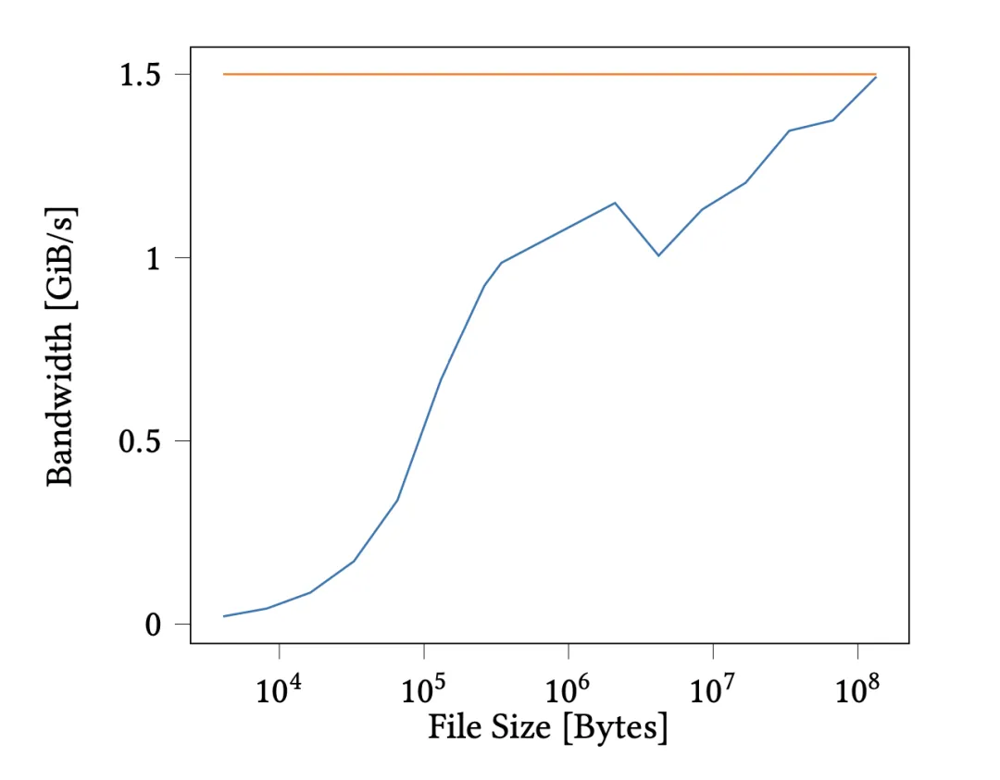
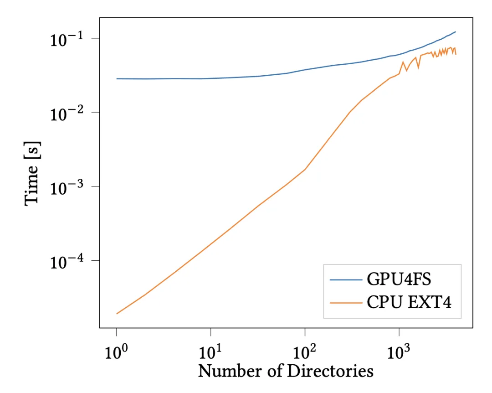

## 摘要

现代高性能计算和人工智能计算解决方案经常使用 GPU 作为其主要计算能力来源。这就为 GPU 应用程序的存储操作造成了严重的不平衡，因为每一个此类存储操作都必须向 CPU 发出信号并由 CPU 处理。在 GPU4FS 中，我们针对这种不平衡提出了一个彻底的解决方案：将文件系统的实现转移到应用程序中，并在 GPU 上运行完整的文件系统。这需要对从实际存储布局到文件系统接口的整个文件系统栈进行多次更改。此外，这种方法还能将 CPU 从文件系统管理任务中解放出来，从而更有效地利用 CPU。在我们的预极限实现中，我们展示了在 GPU 上运行一个功能齐全的文件系统是可能的，只需与 CPU 进行最少的交互，根据底层存储介质的不同，带宽甚至具有竞争力。

## 关键词

文件系统、GPU、直接存储访问、GPU 加速、GPU 卸载

注：本文为翻译文章，原文为：Full-Scale File System Acceleration on GPU  
原文作者：(All from Karlsruhe Institute of Technology Germany)  
Peter Maucher  
Gregor Lucka  
Lennard Kittner  
Lukas Werling  
Nico Rath  
Yussuf Khalil  
Thorsten Gröninger  
Frank Bellosa

## 引言

图形处理器（GPU）为数据并行应用提供了大规模并行性。这些数据需要以某种方式加载到 GPU 内存中。目前，数据管理主要由 CPU 处理，GPU 只向 CPU 发送进度信号。假设这些数据来自存储器，则请求必须通过互联总线到达 CPU。在 CPU 实际开始处理该请求后，CPU 必须通过文件系统 (FS) 实现，直到到达存储设备，并在收到响应后向 GPU 发出完成信号。其中有些延迟是不可避免的，尤其是存储延迟，但如果 GPU 直接访问存储设备，则可以避免很多延迟。即使是 CPU 文件系统，Volos 等人[26]认为，最初为硬盘设计的旧式 FS 接口也会增加一些开销。

在本文中，我们将会介绍 GPU4FS。这是一种功能齐全的现代 GPU 端 FS，旨在解决 FS 接口以及通过互连线路所引起的延迟问题。GPU4FS 在 GPU 上运行，与实际的 GPU 端应用程序并行，从而实现了应用程序与 FS 之间的低延迟访问和共享内存通信。由于 GPU 上缺乏系统调用指令，这种通信是通过共享显存（VRAM），利用并行工作队列实现的。我们还将工作队列放在 DRAM 中，这样 CPU 端应用就能快速、并行地访问 FS 的用户空间。

我们设计的文件系统具有紧跟现代文件系统的功能集，因为文件系统接口已被程序员广泛使用并熟知。我们不必对每个应用程序进行移植，而是将实现细节完全隐藏起来，不让未感知的应用程序看到，但让 CPU 端应用程序能够选择从更改的语义中获益。在 GPU 上，应用程序需要针对任何类型的存储访问进行修改。Silberstein 等人[24]利用 GPUfs 证明，为 CPU FS 提供库接口可简化 GPU 程序员对存储的访问，但 GPUfs 只能调用 CPU 端文件系统。GPU4FS 提供与 GPUfs 类似的接口，但在 GPU 上运行文件系统。

在我们的初步实现中，我们展示了 GPU 对英特尔 Optane 持久内存（PMem）[19] 的访问，并表明我们的写带宽与同时代的 Optane 文件系统相比具有竞争力。我们还演示了 GPU 优化文件夹结构的实现方法和 RAID 实现方法。我们认为这表明了全功能的 GPU 端文件系统是有用的，而且可以运行得很好。

## 方法

GPU4FS 是一个新颖的想法，它试图将实现从 CPU 转移到 GPU 上，因此在实现过程中，GPU4FS 显示出与当代文件系统的重大差异。为了与现有的 CPU 端应用程序兼容，同时也为了让新的 GPU 端应用程序熟悉 GPU4FS，这些差异需要被 GPU4FS 的界面所隐藏。

### 接口

在兼容性方面，最令人感兴趣的是文件系统接口。在 POSIX [17]中，访问通常使用系统调用（syscalls）来处理，而这在 GPU4FS 中是不可行的，原因有以下几点：GPU 上没有经典的系统调用指令，即使有这样的指令，CPU 也肯定无法使用。相反，我们选择了使用共享内存缓冲区进行通信的常见方法（如 FUSE [6]）。请求进程将为每个预定的文件系统操作插入一条命令，而 GPU4FS 进程则可以解析这些信息并处理请求。

GPU4FS 计划提供两套命令：一套与 POSIX 接口紧密结合，另一套是高级接口，旨在减少请求数量，从而减少延迟并增加带宽。Volos 等人[26]的研究表明，通过减少交互次数可以实现重大改进：使用 POSIX 接口将单个文件读入内存需要 5 次操作系统交互：调用 open() 获取文件描述符，调用 fstatat() 获取文件长度，然后调用 malloc() 分配内存，接着调用一次或多次 read() 获取实际数据，最后调用 close() 释放文件描述符。使用 mmap()后，这种情况并没有明显改善，因为唯一不需要调用的就是 malloc()。在 read() 和 mmap() 两种情况下，由于其他任务可能会随时更改文件内容和长度等元数据，因此处理过程本身就比较复杂。相反，我们提供了一个加载完整文件的接口，并在命令处理程序中为加载的文件分配内存。结果数据被写入共享缓冲区，并返回指针/长度对。这样，操作可以原子方式处理，只需要一个请求。我们希望在 GPU 应用中混合使用这两种接口：对于文件夹的并行读取，可以使用 POSIX 接口，这样每个项目只需加载一次，但每个文件都可以使用原子请求加载。尽管如此，POSIX 接口仍是兼容性所必需的。

考虑兼容应用程序的一个重要原因是因为其支持 mmap()。在 Linux 中，可以使用私有映射或共享映射，这两种映射有两个独立的特性：共享映射意味着修改后的内存会写回磁盘，但也允许与其他进程共享内存通信。我们假定，大多数应用程序使用共享映射来持久化它们的更改，而不是进行共享内存通信。在只有 CPU 和 DRAM 页面缓存的文件系统中，实现这两种功能相对容易，但如果多个设备都有自己的内存，就会增加复杂性，而且数据必须保存在 DRAM 中，以便所有设备都能访问。为了实现高带宽的 VRAM 侧 mmap，我们增加了一个附加的回写模式，只有在未映射时才将数据刷新到磁盘。此外，这还能让我们避免代价高昂的页表更改。我们希望这种模式能广泛应用于与其他文件系统不兼容的 GPU 端应用。

### GPU 实现

概括地说，运行 GPU4FS 的系统至少有两个相应的进程在运行：一个负责处理整个文件系统的 GPU 端 GPU4FS 主进程，另一个是负责设置 GPU 进程和建立通信的 CPU 端进程。此外，CPU 和 GPU 上还可能运行着多个额外进程，与两个 GPU4FS 进程对接。在本节中，我们将介绍 GPU 侧的实现，它负责使用上述共享命令缓冲区与请求进程通信，并与存储后端通信。垃圾回收和碎片整理等文件系统管理任务也由 GPU 控制和运行。

对文件系统的请求总是通过其中一个命令缓冲区发出，或者通过另一个 GPU 端进程发出的 VRAM 中的缓冲区，或者通过 DRAM 中的缓冲区发出任何其他请求。此类请求通常会导致对磁盘或 PMem 的访问，无论是加载还是存储。此外，即使是数据加载请求也会导致存储介质上的数据变化，因为元数据需要更新。

**读取请求。** 首先，我们描述一个没有任何数据变化的读取请求：请求解析后，GPU 会尝试从其缓存（VRAM 或 DRAM）中加载数据。我们同时采用了这两种缓存级别，因为 VRAM 通常要小得多，而 DRAM 比 NVMe 和 PMem 等当代存储设备要快得多，而且早期的一篇论文也指出了 Compute Express Link (CXL) 实现的相同行为[25]。如果请求的数据没有缓存，则会从存储中获取数据。GPU4FS 的主要目标是绕过 CPU 进行存储访问：PMem 直接映射到 GPU，而 NVMe 内存则通过点对点 DMA（P2PDMA）进行访问，正如 Qureshi 等人[21] 为其 BaM 系统架构所建议的那样。数据获取后，可能会根据应用提示进行缓存。我们添加了缓存提示，因为有些应用只需要文件一次，这样就可以释放缓存容量，用于重复访问。除了在共享 mmap 映射中，我们还会在共享内存区域为结果分配空间，并将获取的数据存储在那里。为了发出完成信号，我们会将数据指针和长度存储到初始命令结构中，并通过原子存储完成标志结束交互。

**写入请求。** 与此相反，当需要写入数据时，还需要几个步骤来保证数据的一致性并为新文件分配空间。尽管减少 GPU 端应用的延迟是 GPU4FS 的主要目标，但 CPU 端应用的总体延迟预计会增加。这将增加飞行中的数据量，从而增加一致性系统的压力。我们打算结合使用日志结构化（log-structuring）[23] 和日志（journaling）[20] 来解决这个问题：数据写入采用日志结构化方式，元数据更新则采用日志方式。因此，日志是一个主要的争议点。为了解决这个问题，我们为日志预留了一大块持久存储空间，并为每个独立的 GPU 工作组分配了这一大块存储空间中的一个较小的子区域。为避免同一对象出现多个冲突的日志条目，我们限制每个文件系统对象在运行时最多只能被一个工作组使用。日志条目大小固定，并通过一个原子存储分配给一个标志变量。另一个原子存储标志着日志条目设置的完成。这样，一旦发生崩溃，就能扫描整个日志区域，并验证操作是否完成。要提交数据写入，需要修改 inode 结构，以添加指向新文件系统块的指针。与块设备上的文件系统相比，PMem 只允许较小粒度的数据持久性，这意味着我们无法原子式地就地更改 inode。相反，即使我们使用就地修改，日志也允许恢复新旧状态。

GPU4FS 旨在提供两套命令：其中一套与 POSIX 接口紧密结合，另一套则是高级接口，旨在减少请求数量，从而减少延迟并增加带宽。Volos 等人[26]的研究表明，通过减少交互次数可以实现重大改进：使用 POSIX 接口将单个文件读入内存需要 5 次操作系统交互：调用 open() 获取文件描述符，调用 fstatat() 获取文件长度，然后调用 malloc() 分配内存，接着调用一次或多次 read() 获取实际数据，最后调用 close() 释放文件描述符。使用 mmap()后，这种情况并没有明显改善，因为唯一不需要调用的就是 malloc()。在 read() 和 mmap() 两种情况下，由于其他任务可能会随时更改文件内容和长度等元数据，因此处理过程本身就比较复杂。相反，我们提供了一个加载完整文件的接口，并在命令处理程序中为加载的文件分配内存。结果数据被写入共享缓冲区，并返回指针/长度对。这样，操作可以原子方式处理，只需要一个请求。我们希望在 GPU 应用中混合使用这两种接口：对于文件夹的并行读取，可以使用 POSIX 接口，这样每个项目只需加载一次，但每个文件都可以使用原子请求加载。尽管如此，POSIX 接口仍是兼容性所必需的。

GPU4FS 从一开始就是为具有良好随机存取性能的现代存储设备和 PMem 直接映射功能而设计的。WineFS [11] 显示了使用 hugepages 进行直接映射的优势，相比之下，只有 4 kB 的页面。GPU4FS 在设计中融入了这一点，并结合了扩展（extents）这一多个文件系统的常见功能 [7, 22]。我们使用 64 位指针（其中两位用于标志位）来区分对齐的 4 KiB、2 MiB 和 1 GiB 页面以及 256 字节 inodes。这不仅允许直接映射，还减少了块指针的数量。在 GPU 上，减少块指针的另一个好处是减少指针分歧，这意味着 GPU 的内存管理单元可以整合更多的访问。与 WineFS 类似，Alo-cator 也会为每种大小的对齐页面维护自由列表，并根据需要将其拆分成更小的区块。GPU4FS 假设地址空间是平面的，不会为 inodes、目录或用块指针填充的间接块保留特殊区域。这意味着逐步碎片化是一个主要问题，我们主要通过重复使用收集的垃圾空间和在需要时进行部分碎片整理来解决这个问题。

**附加功能。** 此外，GPU4FS 还实现了 BTRFS [22] 和 ZFS [2] 等现代文件系统中的功能，即校验和、重复数据删除和多驱动器存储分配（RAID）[18]。我们可以使用校验和来通知应用程序数据是否被修改，从而避免错误数据传播到应用程序中。不仅如此，如果存储了相同的数据块，校验和还能通过重复数据删除来增加可用存储区域，并提高映射回写性能。通过 RAID 实现，我们可以将多个驱动器的存储容量结合起来，以处理更大的数据集。此外，结合校验和，我们可以利用 RAID 中的冗余信息来恢复校验和错误。校验和与 RAID 都需要并行计算，这非常适合 GPU。

对于校验和功能，我们选择 BLAKE3 [15] 作为哈希函数，因为它是为并行计算而设计的，但仍具有 128 位的抗碰撞能力，非常安全。为了进一步提高可利用的并行性，我们对每个数据块进行单独校验。为了区分校验和与数据相比发生的变化，我们还为每个存储校验和的数据块计算哈希值。我们进一步利用它们来避免重复存储相同的数据。在运行时，校验和有助于 mmap 的实现：如果我们在 VRAM 中使用 mmap，缓冲区就会被映射为读/写，以避免修改页表，但修改时不会发生分页错误。为了在写回磁盘时检测变化，与其比较每个字节并提前获取它们，我们可以只比较校验和，从而提高性能并减少存储延迟。

我们实现的另一个重要功能是软件 RAID：GPU4FS 从 BTRFS 卷中汲取了大量灵感，同样利用卷提供了运行时可配置的 RAID 级别。支持直接映射的设计目标会导致奇偶校验信息的困难，因此直接映射是按文件启用的。我们将每个区块指针标记为物理或虚拟，物理指针编码磁盘和偏移量，而虚拟指针则通过受 BTRFS 启发的卷树转换为磁盘上的区块（可能是多个区块）。这种灵活性甚至允许对文件的不同部分采用不同的 RAID 级别。

### CPU 实现

在 GPU4FS 中，GPU 主要负责文件系统。然而，CPU 端 GPU4FS 实现在为 GPU 端和 CPU 端客户端建立与文件系统的通信方面扮演着重要角色，CPU 端应用程序能够访问 GPU 上的文件系统。

连接始终在 CPU 上建立，因为程序的某些部分需要更改页表，因此需要内核权限。因此，如果 GPU 端客户端希望与 GPU4FS 接口，其管理 GPU 端客户端的 CPU 端进程将负责初始化通信。提出请求的 CPU 端进程首先会向 GPU4FS CPU 端进程发送一条进程间通信（IPC）消息，其中包括 GPU4FS 通信缓冲区所需的大小。CPU 端 GPU4FS 进程为 GPU4FS 分配一部分 VRAM，用于共享内存缓冲区、缓存和内部数据，剩余的 VRAM 由实际应用程序使用。同样，CPU 端 GPU4FS 进程控制 DRAM 中的共享内存缓冲区，供 CPU 端 FS 客户端使用。请求发出后，GPU4FS 会在其 VRAM 区域或 DRAM 中分配一些空间用于通信，并将其映射为请求进程中的缓冲区。这里需要修改页表，因此这部分需要在 CPU 上运行。由于 GPU 控制着文件系统，因此在完全建立通信之前，需要通知 GPU 端 GPU4FS。CPU 端和 GPU 端 GPU4FS 进程通过与其他进程相同的共享内存接口进行通信，唯一的区别是存在一些权限较高的命令。在这里，CPU 端进程使用其中一条高级权限命令通知 GPU 新连接和新分配的缓冲区。然后，GPU 初始化缓冲区和通信所需的其他数据结构，并向 GPU4FS CPU 端进程发出完成信号。完成初始化后，CPU 端进程会向请求 GPU4FS 的 CPU 端进程发送带有新缓冲区地址的响应，CPU 端进程就可以开始使用 GPU4FS 了。CPU 端 GPU4FS 客户端与 GPU 端 GPU4FS 客户端的唯一区别是，在 GPU 的情况下，需要初始化两个缓冲区，一个在 DRAM 中，一个在 VRAM 中，CPU 端请求进程将缓冲区地址交给 GPU 进程。

如上所述，在通信设置过程中，需要对请求进程的页表进行某些更改。此外，在共享 mmap 的情况下也需要进行这种操作。这种操作在用户空间通常是禁止的，只能在内核中实现。按照 Aerie 的设计[26]，我们在内核中添加了一个小修改，允许 CPU 端实现对其他进程中的页面进行映射。在正常运行时，文件系统的访问完全绕过内核，这使得 GPU4FS 成为用户空间文件系统，为提高性能提供了可能。图 1 显示了命令流的完整设置，包括内核为共享 mmap 进行的页表修改。

### 初步结果

我们实施了一个演示程序，为全面的 GPU4FS 实施建立案例。与没有文件系统开销的简单 GPU 访问存储相比，我们主要关注文件系统的带宽和延迟。我们的演示程序使用 Vulkan [9] 作为编程接口，在 Linux 上的 RADV [5] 驱动程序上运行。我们的实现为 Optane PMem 添加了一个简单的写入路径，并使用受 EXT 启发的 H-Tree 方法[7]和 RAID 地址转换开销对目录创建进行了评估。由于采用了 Vulkan 实现，我们必须在每次测试中重新启动文件系统，启动延迟为 12 毫秒。所有测试均使用英特尔 Optane 作为存储介质，具体规格见表 1。我们确保 GPU 无需通过处理器间互连即可访问 Optane。

使用我们的配置，一个 Optane DIMM 的最大带宽可达 1.5 GB s-1。尽管 CPU 的写入速度可达 2 GB s-1，但我们仍将 GPU 带宽作为评估基准。同样，即使文件系统什么都没发生，我们也需要等待大约 12 毫秒 GPU 才能响应我们的命令。我们认为这是因为我们必须重新初始化大型缓冲区，而这在驱动程序所优化的视频游戏应用中似乎并不常见。在我们的完整实现中，我们希望所有存储介质的带宽都能与 CPU 相等，而且如果 GPU4FS 已经在运行，而不是必须启动，我们希望延迟能减少到几微秒。

第一个文件系统测试是在文件夹中插入单个文件，以验证在文件足够大的情况下是否会达到上述带宽限制。在图 2 所示的曲线图中，当文件大小为 128 MiB 时，我们的带宽达到了 1.49 GB s-1 的最大值。这意味着文件系统不会在每次复制操作中增加固有开销。该图包括 12 毫秒的启动延迟，以表明即使包括较高的延迟，我们的带宽也是有竞争力的。

图 1: 全规模 GPU4FS 设计。DRAM 或 VRAM 中的进程向 GPU 发出请求，由 GPU 访问存储空间。可选择将共享 mmap 移交给内核进行页表修改。

我们还单独评估了元数据操作，但这里减去了延迟，因为元数据操作的运行时间与启动延迟类似。作为元数据操作，我们创建了一个深目录链，类似于调用 mkdir -p a/b/c/d/.... 在 GPU 上，我们只需发出一条命令，这也显示了我们更通用接口的优势，而在 CPU 上，我们必须重复调用 mkdirat()，这就产生了重复的系统调用开销。我们将 GPU4FS 与 EXT4 进行了比较，因为 GPU4FS 使用的是受 EXT4 启发的 H 树。结果见图 3。对于足够大的请求，GPU4FS 比 CPU 稍慢，但我们预计元数据操作会很少，延迟会被其他操作掩盖。此外，我们还希望将来能减少额外的延迟。我们得到的主要启示是，即使是依赖很少的元数据的操作，也能在 GPU 上高效执行

### 讨论

可以从次优带宽和延迟上看出来，我们目前的实现还没有完全优化。造成延迟问题的主要原因可能是，目前我们使用的 RADV 驱动程序是为视频游戏而设计的，而不是为计算而设计的。今后，我们打算使用 AMD 的 ROCm 栈 [1]，一个真正以计算为重点的应用程序接口（API），并根据这一新的实现方式对我们的代码进行优化，以适应所使用的硬件。这也将使 GPU4FS 以守护进程的方式运行，而不必启动系统并产生其他减速，如 TLB 未命中或缓存未命中。我们预计，当从 GPU 发出请求时，以及当文件系统作为守护进程运行而不是每次运行都要设置 GPU 时，延迟会进一步降低。我们还预计带宽会随着进一步优化而增加。尽管如此，即使在使用 CPU 访问 GPU 的测试中，以及在产生额外延迟的情况下，GPU 端的实现肯定会接近 CPU 端的实现。以上结果展示了全面实施的无限潜力。

图 2：不同大小文件的 GPU 写入 Intel Optane 的带宽。带宽增加到测量的最大值 1.5GBs-1。

## 相关工作

在本节中，我们将 GPU4FS 与其他文件系统和 GPU 项目进行比较。

### 文件系统

**内核文件系统。** 文件系统一直是操作系统的重要组成部分，是可移植操作系统接口（POSIX）[17]的一部分。POSIX 建议在内核中实现文件系统，从而为大多数操作执行系统调用。在 Linux 中，系统调用是已定义的接口。POSIX 还列出了可为文件系统对象请求的元数据。符合 POSIX 标准的文件系统主要有用于简单文件系统的 EXT 系列文件系统[7]，以及像 ZFS [2] 和 BTRFS [22] 这样具有 RAID、全数据校验和、重复数据删除和加密等更多功能的文件系统。为了实现传统应用程序符合 POSIX 标准的目标，我们从上述文件系统的功能和数据布局中汲取了灵感。

最近的一个比较是 PMem 文件系统：在 NOVA [27]中，文件系统使用直接指针代替数据结构中的索引，以适应现代存储介质，并对数据和元数据使用不同的日志策略，与 GPU4FS 类似。与 NOVA 相比，GPU4FS 将元数据日志改为经典日志，以方便访问，并将并行化点从文件系统对象转移到工作组。WineFS [11] 激发了我们对页面进行分层分配的灵感，但我们也将页面用作 extents 的轻量级实现，从而保持较小的间接树。

图 3：每个目录树深度的目录创建时间。在大约 1000 个目录深度时，GPU 和 CPU 的性能接近。

**用户空间文件系统。** 与完全或大部分在内核中实现的文件系统相比，Aerie [26] 展示了用户空间文件系统的优势，尤其是在 PMem 存储方面。为了支持 POSIX，他们添加了一个小型内核模块来实现所需的语义。Strata [13] 和 EvFS [28] 展示了分层存储和用户空间文件系统内多层缓存的使用。然而，这些文件系统都是在 CPU 上运行的。GPU 对随机跳转和指针追逐的优化程度要低得多，而随机跳转和指针追逐是这些文件系统的共同特征。相比之下，我们在保持用户空间文件系统优势的同时，尽可能多地优化文件系统的并行性。

"用户空间文件系统"（FUSE）[6]是内核空间和用户空间文件系统之间一个有趣的混合体。FUSE 允许在保留内核接口的同时，在用户空间实施文件系统，方法是每当应用程序调用内核时，从内核向上调用到用户空间的 FUSE 驱动程序。FUSE 也是使用用户和内核之间的共享内存缓冲区实现的，与 GPU4FS 类似，但这些缓冲区位于 DRAM 中，而不是 VRAM 或其他设备的内存中。

### GPUs

在 GPU 上运行的应用包括图形[4]、高性能计算应用[14]和人工智能应用[8]，这些应用都需要频繁访问数据，或者目前受到 VRAM 容量的限制。这些应用都能从 GPU4FS 中获益。

GPU 端文件系统。GPU 文件系统的主要比较点是 GPUfs [24]，它通过允许 GPU 访问 CPU 端文件系统，展示了文件系统接口在 GPU 上的使用。在 GPU4FS 中，我们在 GPU 上运行完整的文件系统，让 CPU 访问文件系统。文献[21]和[16]显示了 GPU 直接存储访问的有效性，但它们从未将其用于完整的文件系统。

之前的工作已经在加速器上实现了文件系统的几个部分，例如 RAID [3, 12] 或校验和 [15] 或加密 [10]，但这些部分从未集成到一个文件系统中。

## 结论

总而言之，我们在本文中提出了 GPU4FS 的设计方案，这是一种新型的 GPU 端文件系统，其接口既可用于 CPU，也可用于 GPU。我们还利用我们的初步实现建立了完整的实现案例，证明带宽限制不是由文件系统实现造成的，而是由存储带宽造成的。

有了这一结果，我们打算首先完成向新的 ROCm [1] 平台的移植，并利用它来提高性能。下一步是实现一致性模式，因为它的复杂性很高，而且是设计的核心部分。接下来，我们将重点关注分配和垃圾回收，并在此基础上集成 RAID、校验和内核通信等其余功能。

## Reference

[1] Advanced Micro Devices, Inc. 2021. AMD ROCmTM documentation. https://rocmdocs.amd.com/en/latest/index.html

[2] Jeff Bonwick, Matt Ahrens, Val Henson, Mark Maybee, and Mark Shellenbaum. 2002. The Zettabyte File System. https://www.cs.hmc.edu/~rhodes/courses/cs134/fa20/readings/

The%20Zettabyte%20File%20System.pdf

[3] Matthew L. Curry, H. Lee Ward, Anthony Skjellum, and Ron
Brightwell. 2010. A Lightweight, GPU-Based Software RAID System. In 2010 39th International Conference on Parallel Processing. 565–572. https://doi.org/10.1109/ICPP.2010.64

[4] Blender Developers. 2022. blender. https://www.blender.org/

[5] Freedesktop Developers. 2022. RADV

RADV is a Vulkan driver for AMD GCN/RDNA GPUs. https://docs. mesa3d.org/drivers/radv.html

[6] FUSE Developers. May 06, 2022. Filesystem in Userspace. https:
//github.com/libfuse/libfuse

[7] Linux Kernel Developers. September 20, 2016. EXT4 Linux kernel wiki.

https://ext4.wiki.kernel.org/index.php/Main_Page

[8] TensorFlow Developers. 2022. TensorFlow. Zenodo (2022).

[9] Khronos® Group. 2022. Khronos Vulkan Registry. https://registry.
khronos.org/vulkan/

[10] Keisuke Iwai, Naoki Nishikawa, and Takakazu Kurokawa. 2012. Ac-
celeration of AES encryption on CUDA GPU. International Journal of
Networking and Computing 2, 1 (2012), 131–145.

[11] Rohan Kadekodi, Saurabh Kadekodi, Soujanya Ponnapalli, Harshad
Shirwadkar, Gregory R. Ganger, Aasheesh Kolli, and Vijay Chi- dambaram. 2021. WineFS: a hugepage-aware file system for persistent memory that ages gracefully. In Proceedings of the ACM SIGOPS 28th Symposium on Operating Systems Principles (Virtual Event, Germany) (SOSP ’21). Association for Computing Machinery, New York, NY, USA, 804–818. https://doi.org/10.1145/3477132.3483567

[12] Aleksandr Khasymski, M. Mustafa Rafique, Ali R. Butt, Sudharshan S. Vazhkudai, and Dimitrios S. Nikolopoulos. 2012. On the Use of GPUs in Realizing Cost-Effective Distributed RAID. In 2012 IEEE 20th Inter- national Symposium on Modeling, Analysis and Simulation of Computer and Telecommunication Systems. 469–478. https://doi.org/10.1109/ MASCOTS.2012.59

[13] Youngjin Kwon, Henrique Fingler, Tyler Hunt, Simon Peter, Emmett Witchel, and Thomas Anderson. 2017. Strata: A Cross Media File System. In Proceedings of the 26th Symposium on Operating Systems Principles (Shanghai, China) (SOSP ’17). Association for Computing Machinery, New York, NY, USA, 460–477. https://doi.org/10.1145/ 3132747.3132770

[14] Christoph A Niedermeier, Christian F Janßen, and Thomas Indinger. 2018. Massively-parallel multi-GPU simulations for fast and accurate automotive aerodynamics. In Proceedings of the 7th European Confer- ence on Computational Fluid Dynamics, Glasgow, Scotland, UK, Vol. 6. 2018.

[15] Jack O’Connor, Jean-Philippe Aumasson, Samuel Neves, and Zooko Wilcox-O’Hearn. 2021. BLAKE3 - One function, fast everywhere. https: //github.com/BLAKE3-team/BLAKE3-specs/blob/master/blake3.pdf

[16] Shweta Pandey, Aditya K Kamath, and Arkaprava Basu. 2022. GPM: leveraging persistent memory from a GPU. In Proceedings of the 27th ACM International Conference on Architectural Support for Program- ming Languages and Operating Systems (Lausanne, Switzerland) (ASP- LOS ’22). Association for Computing Machinery, New York, NY, USA, 142–156. https://doi.org/10.1145/3503222.3507758

[17] PASC.2018.TheOpenGroupBaseSpecificationsIssue7,2018edition. https://pubs.opengroup.org/onlinepubs/9699919799/

[18] DavidA.Patterson,GarthGibson,andRandyH.Katz.1988.ACasefor Redundant Arrays of Inexpensive Disks (RAID). In Proceedings of the 1988 ACM SIGMOD International Conference on Management of Data (Chicago, Illinois, USA) (SIGMOD ’88). Association for Computing Machinery, New York, NY, USA, 109–116. https://doi.org/10.1145/ 50202.50214

[19] Ivy B. Peng, Maya B. Gokhale, and Eric W. Green. 2019. System Evalu- ation of the Intel Optane Byte-Addressable NVM. In Proceedings of the International Symposium on Memory Systems (Washington, District of Columbia, USA) (MEMSYS ’19). Association for Computing Machin- ery, New York, NY, USA, 304–315. https://doi.org/10.1145/3357526. 3357568

[20] Vijayan Prabhakaran, Andrea C Arpaci-Dusseau, and Remzi H Arpaci- Dusseau. 2005. Analysis and Evolution of Journaling File Systems.. In USENIX Annual Technical Conference, General Track, Vol. 194. 196–215.

[21] Zaid Qureshi, Vikram Sharma Mailthody, Isaac Gelado, Seungwon Min, Amna Masood, Jeongmin Park, Jinjun Xiong, C. J. Newburn, Dmitri Vainbrand, I-Hsin Chung, Michael Garland, William Dally, and Wen- mei Hwu. 2023. GPU-Initiated On-Demand High-Throughput Storage Access in the BaM System Architecture. In Proceedings of the 28th ACM International Conference on Architectural Support for Programming Languages and Operating Systems, Volume 2 (Vancouver, BC, Canada) (ASPLOS 2023). Association for Computing Machinery, New York, NY, USA, 325–339. https://doi.org/10.1145/3575693.3575748

[22] Ohad Rodeh, Josef Bacik, and Chris Mason. 2013. BTRFS: The Linux B- Tree Filesystem. ACM Trans. Storage 9, 3, Article 9 (aug 2013), 32 pages. https://doi.org/10.1145/2501620.2501623

[23] Mendel Rosenblum and John K. Ousterhout. 1992. The Design and Implementation of a Log-Structured File System. ACM Trans. Comput. Syst. 10, 1 (feb 1992), 26–52. https://doi.org/10.1145/146941.146943

[24] Mark Silberstein, Bryan Ford, Idit Keidar, and Emmett Witchel. 2013. GPUfs: Integrating a File System with GPUs. SIGARCH Comput. Archit. News 41, 1 (mar 2013), 485–498. https://doi.org/10.1145/2490301. 2451169

[25] Yan Sun, Yifan Yuan, Zeduo Yu, Reese Kuper, Ipoom Jeong, Ren Wang, and Nam Sung Kim.

2023. Demystifying CXL Memory with Genuine CXL-Ready Systems and Devices. arXiv:2303.15375 [cs.PF] https: //doi.org/10.48550/arXiv.2303.15375

[26] Haris Volos, Sanketh Nalli, Sankarlingam Panneerselvam, Venkatanathan Varadarajan, Prashant Saxena, and Michael M. Swift. 2014. Aerie: Flexible File-System Interfaces to Storage-Class Memory. In Proceedings of the Ninth European Conference on Computer Systems (Amsterdam, The Netherlands) (EuroSys ’14). Association for Computing Machinery, New York, NY, USA, Article 14, 14 pages. https://doi.org/10.1145/2592798.2592810

[27] Jian Xu and Steven Swanson. 2016. NOVA: A Log-structured File Sys- tem for Hybrid Volatile/Non-volatile Main Memories. In 14th USENIX Conference on File and Storage Technologies (FAST 16). USENIX Associ- ation, Santa Clara, CA, 323–338. https://www.usenix.org/conference/ fast16/technical- sessions/presentation/xu

[28] Takeshi Yoshimura, Tatsuhiro Chiba, and Hiroshi Horii. 2019. EvFS: User-Level, Event-Driven File System for Non-Volatile Memory. In Proceedings of the 11th USENIX Conference on Hot Topics in Storage and File Systems (Renton, WA, USA) (HotStorage’19). USENIX Association, USA,16. https://dl.acm.org/doi/10.5555/3357062.3357083
