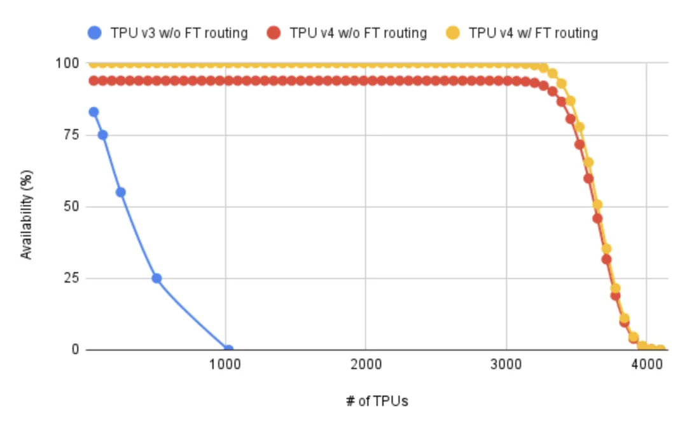
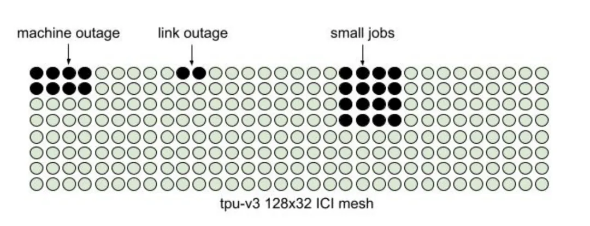
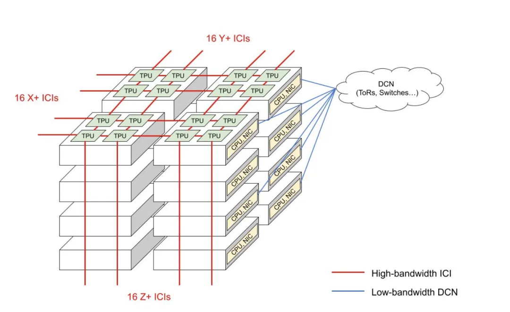
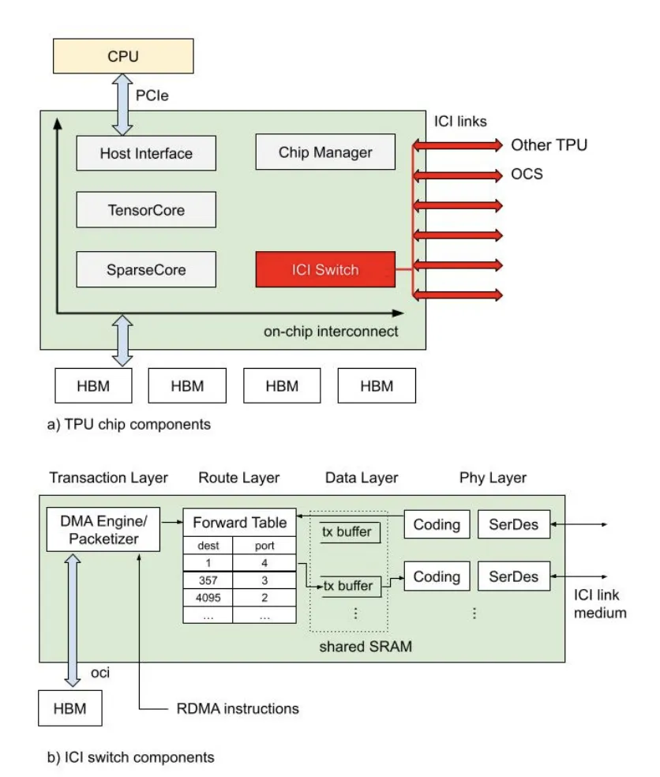
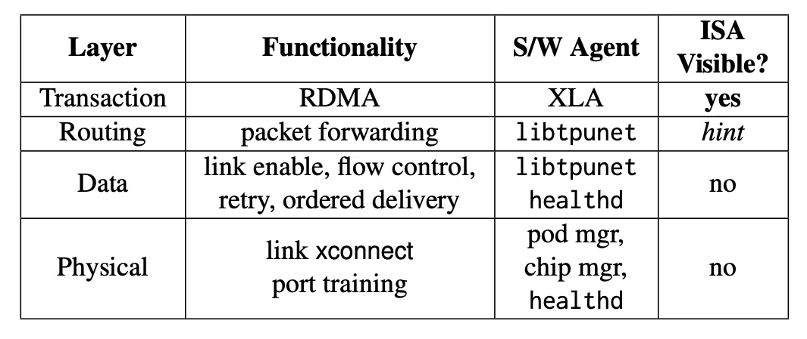
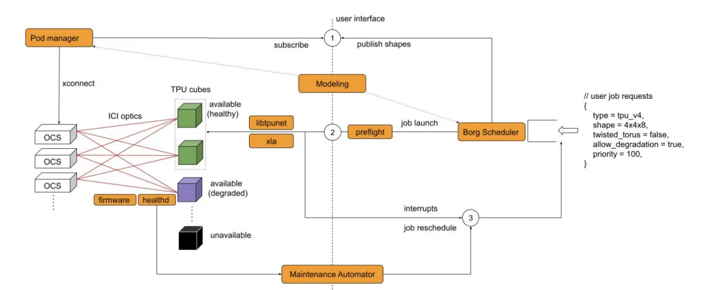
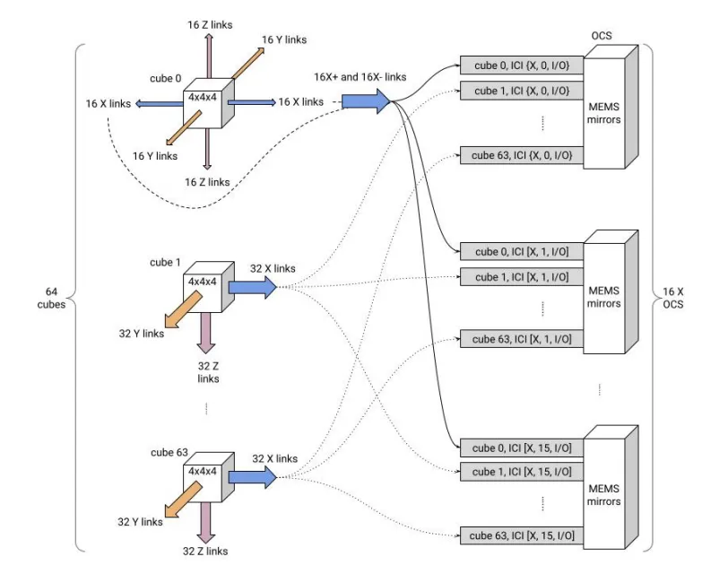
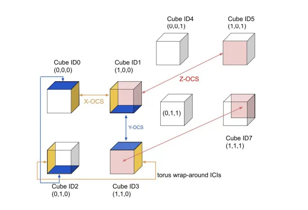

TPUv4（张量处理单元）是谷歌用于机器学习训练的第三代加速器，采用定制的三维环形互连，部署为 4096 节点的超级计算机。在本文中，我们将介绍设计和运行软件基础设施的经验，这些软件基础设施使 
TPUv4 超级计算机能够大规模运行，包括自动故障恢复和硬件恢复功能。
我们采用软件定义网络（SDN）方法来管理 TPUv4 的高带宽芯片间互连（ICI）结构，利用光路交换来动态配置路由，以应对机器、芯片和链路故障。我们的基础设施可检测故障并自动触发重新配置，以最大限
度地减少对运行工作负载的干扰，同时启动受影响组件的补救和修复工作流程。类似的技术还可与硬件和软件的维护和升级工作流程对接。我们的动态重新配置方法使我们的 TPUv4 超级计算机实现了 99.98% 
的系统可用性，能够从容应对约 1% 的训练任务所遇到的硬件中断。

##  引言

机器学习（ML）模型的规模和复杂性不断增长[9, 24]，这得益于异构超级计算机的大规模计算能力，其中 CPU 负责运行时任务协调和 I/O，而 TPU [18-20] 和 GPU 等加速器则提供模型训练所需的计算性
能。扩大超级计算机的节点数能使模型功能更强，因为训练过程可以在批次、张量和流水线维度上有效地并行化[17, 33]。

大规模 ML 超级计算机的硬件/软件生态系统面临两个挑战：第一，有效并行化模型训练工作负载；第二，也是本文的重点--保持计算资源的高可用性，从而为 ML 训练工作提供高产出。近年来，后者变得越来
越困难，因为

- 松耦合分布式应用（如 Map-Reduce[12]）可以有效地容忍动态变化的资源分配，而 ML 训练作业则不同，它更多地使用静态（编译时）分片策略和帮派式计划执行，要求所有计算资源同时处于健康状态；

- 现代 ML 模型（如大型语言模型 (LLM)）需要前所未有的大量硬件（传统计算、加速器、网络和存储）[2]，从而将预期 MTBF 降至数小时甚至数分钟[15]；

- 在云或共享集群环境中，许多用户都在争夺超级计算机资源的不同子集，这使得能够随着时间的推移重新配置或重新平衡资源分配变得格外重要。

谷歌的 TPUv4 机器学习超级计算基础设施旨在应对这些挑战。它包括以下硬件和软件组件：

- 多个cubes：一个cube是一个硬件单元，包含 64 个 TPU 芯片，以 4x4x4 的三维网格排列；每个超级计算机或 pod 有 64 个cube，共计 4096 个 TPU。

- 专有的芯片间互联（ICI）：这是一种高速网络结构，可直接与 TPU 互联，从而实现设备与设备之间的直接通信（即 RDMA），而无需涉及 CPU。

- 光路交换机（OCSes）[25]：用于动态交叉连接（xconnect）不同cube的 ICI，以形成用户要求的环形拓扑结构。

Borg [31]：集群管理服务，用于受理、调度和管理 TPUv4 作业（及其他作业）。

Pod 管理器：集群级软件服务，根据 Borg 的调度决定启动 OCS xconnect 设置，从而管理多cube连接。

##  可重构的 ML 超级计算机系统架构

TPUv4 可重构超级计算机是专为可扩展性、可用性、弹性和成本而设计的[18]。它的核心是一个可重新配置的 ICI 结构拓扑，连接不同的 TPUv4 芯片，每个 pod 都有一组可编程的 OCS。如果没有 TPUv4 基于 OCS 的可重构性，随着计算资源规模的扩大，作业可用性会迅速下降。图 1 利用已部署的 TPUv3 静态 pod 和 TPUv4 可重构 pod 的测量数据显示了这种效果。

对于像 TPUv3 [19]这样计算资源静态互连的传统超级计算机，当所需计算资源增加到 1024 个芯片时，作业的整体可用性会急剧下降。这是因为在静态 pod 中，一组连续节点中的所有资源必须同时处于健康状态，才能分配给用户，而随着系统规模的扩大，这种可能性越来越小。利用 TPUv4 的cube级可配置性，可用性可保持在 94% 左右的高水平，相当于约 50 个cube或 3200 个 TPUv4 芯片。

之后可用性下降的原因是不同cube之间偶尔会出现机器故障和 ICI 链路故障。正如我们将在第 4 节中展示的那样，利用容错路由来容忍偶尔发生的 OCS 故障或维护事件，可将可用性进一步提高到 99.98%，因为即使在这些罕见的事件中，用户仍可访问各个cube。

###  静态 pod 架构的经验教训

在 TPUv4 ML 超级计算机之前，最先进的是 TPUv2 和 TPUv3 静态 pod [19]--“静态 ”是因为它们具有不可重新配置的固定 ICI 网格。TPUv2 pod 有 256 个 TPU，连接在一个 16x16 ICI 环上，而 TPVv3 有 1024 个 TPU，连接在一个 32x32 环上。TPUv3 还有一个扩展变体，它将 4 个 pod 组合成一个 128x32 网格，但 ICI 路由能力有限。这种所谓的多节点版本是与应用集体模式共同设计的，用于探索大型模型的扩展策略[21]。

图 1 和图 2 介绍了随着模型规模在静态 pod 中扩大，可用性面临的挑战。要训练一个模型，所有 TPU 进程必须同时启动，通过 ICI 集体同步更新权重。一个失败或中断的进程将中断整个训练过程。

为用户的工作寻找合适的计算资源面临着以下挑战：

1. 硬件中断：在 ICI 链路、TPU 芯片和 CPU 主机层面对硬件、固件和软件进行定期计划维护，会从可调度池中移除资源[22]。对于拥有数千个 TPU 的超级计算机来说，影响任何一个组件的事件都会相对频繁地发生，因此很难找到可用的资源集。此外，随着系统和应用规模和复杂性的增加，意外故障发生的频率也会增加。如果没有可重新配置性，要为一项需要 1024 台主机的工作提供良好的可用性，就意味着每台主机都必须保持 99.9% 的可用性；而引入可重新配置的 OCS 后，主机可用性要求将降至 99%。

2. 工作负载碎片整理：许多工作争夺 pod 可调度资源的不同子集是很常见的。由于这些工作来来去去的时间无法预测，有时 Borg 必须移动（抢占）较小的工作，以腾出连续的 TPU，用于等待较大的训练工作。当用户优先级混合在一起时，调度的复杂性就会增加。有了基于 OCS 的可重构性，Borg 就不需要担心 TPU 资源的物理连续性。相反，任何一组空闲的cube都可以通过 OCS 交叉连接，供用户作业使用。

3. 部署准备时间：由于计算和网络资源的紧密耦合性，静态 pod 在所有硬件安装完毕之前无法使用。有了可重新配置的 pod，一旦 OCS 的足迹安装完毕，cube就可以立即部署和使用。

上述挑战促使我们对 TPUv4 pod 架构进行重新思考。

### TPUv4：基于 OCS 的可重构性

TPUv4 采用可重构架构，利用 Palomar 光路开关（OCS）[25] 解决静态系统的问题。通过采用这种架构，我们能够有效地扩展到 4096 个 TPU 节点，并支持按任务选择三维环形或三维扭曲环形拓扑结构[7]。

OCS 是一种可动态配置的 N ×N 交换机，基于微机电系统 (MEMS) 镜阵列，可在毫秒内完成切换。每个 OCS 允许在交换机（逻辑）北侧的任意一对端口与（逻辑）南侧的任意一对端口之间创建可编程的交叉连接（xconnect）。一旦在 Ni 端口与 Sj 端口之间建立了连接，就会建立一个专用的 ICI 链路连接，这样 Ni 端口的光信号就只能路由到 Sj 端口，反之亦然，直到这些端口被重新配置成不同的排列方式。

图 3：4x4x4 cube由 16 台 TPUv4 机器组成，每台机器以 2x2x1 网格组织 4 个 TPU。cube中的 TPU 沿着 X/Y/Z 维度通过 ICI 相互连接，每个cube面有 16 个用于 OCS xconnect 的光链路。

TPUv4 的计算资源以多机器cube的粒度组织。每个 TPU 机器都有一个 CPU 盘和一个 TPU 盘，通过 PCIe 链接。每个 TPU 托盘有 4 个 TPUv4 芯片，以 2x2x1 ICI 网格排列；16 台 TPU 机器组合成一个数据中心机架；机架内的 ICI 链接通过 ICI 互联，形成 4x4x4 网格。这个组合就是一个cube。

光交换机将多个cube互连起来，形成更大的 ICI 拓扑形状，在三个维度中的每个维度都有一个或多个cube。每个三维cube在 X/Y/Z 维的每个面上都有 16 个 ICI 接口，每个cube共有 96 个 ICI 接口。TPUv4 超级计算机由 64 个cube组成，共有 6144 个光 ICI 链路连接到 48 个不同的光路交换机。带宽较低的 CPU 端数据中心网络单独管理 [25, 29]。

TPUv4 的 OCS 可配置性大大提高了可用性。训练任务可以使用任何cube，即使这些cube在物理上并不毗连，这就减少了竞争任务造成的资源碎片。硬件故障会将受影响的cube从资源池中移除，但允许使用健康的cube继续运行。选择 16 台机器的容错粒度是为了兼顾便利性（每个机架的部署、电源和网络），同时在发生故障时保留相对较小的爆炸半径。

可重构性由配套的软件基础设施管理。根据所需的拓扑结构和cube选择，每次任务启动都会诱导软件建立独特的 OCS xconnect。大量的芯片、链路和交换机也需要自动故障诊断、恢复、作业重新安排和容错 ICI 路由。

使用 OCS 可以以较低的成本扩展 TPUv4 pod：OCS 和光纤成本小于 TPUv4 pod 总资本成本的 5%，其运行功率小于 pod 总功率的 3%。TPUv4 OCS 超级计算机的资本和运营成本大大低于使用 Infiniband 等分组交换机的替代方案[18]。
### 可编程 ICI 协议
TPUv4 的 ICI 协议设计为可编程，这样软件就能解决可重新配置性和弹性等操作复杂性问题。一个 TPUv4 pod 就是一个 ICI 域，其中任何一对 TPU 都可以相互进行 RDMA。每个 ICI 链路可承载 50GBps 的单向带宽。TPUv4 采用三维 ICI 网络拓扑结构，可实现高分段吞吐量、大系统规模和低延迟，同时保持低成本，并通过集合支持工作负载并行化。

图 4：TPUv4 的 ICI 交换机实现了分层的可编程 ICI 协议。

如图 4 所示，每个 TPUv4 芯片都有一些计算、一些高带宽内存和一个实现各种 ICI 协议层的 ICI 交换机。ICI 协议有利于按任务进行网络分区，为每个任务设置连接、寻址、路由和流量控制，用户会话不会跨越任务边界。这样，每个任务都能独占其使用的所有链路，从而提高了安全性，并消除了网络共享和拥塞控制所带来的额外系统复杂性。表 1 显示了协议层及其相应的软件代理。从下往上依次为:

表1: ICP协议层

- 物理层：SERDES、PCS 和链路自动建立模块建立高速链路，尽管不可避免地存在传输错误。Pod 管理器通过旋转 OCS MEMS 镜像控制物理通道的 xconnect，片上管理器自动初始化和配置物理链路。在每个 TPU 机器的 Linux 系统容器中运行的 healthd 守护进程会持续读取链路质量和连接信号，以跟踪硬件健康状况。

- 可靠的数据层：当数据在物理层丢失时，数据包按顺序传送，并自动重新传输，从而隐藏了物理层的不可靠特性。执行链路级基于信用的流量控制。启用数据层表示 ICI 用户会话已准备就绪；在准备就绪之前，系统会清除所有数据缓冲区，以确保消除先前 ICI 会话的任何架构状态污染。如果启用数据层的一端出现故障，我们会自动关闭链路的另一端，以确保会话正常运行。libtpunet 会发出会话启动/停止命令，并调整最佳流量控制缓冲区大小。权限为健康机器守护进程（healthd machine daemon）可以明确禁用数据层链路，禁止任何用户会话在链路在线恢复时使用该链路（§3.6.3）。

- 路由层： 数据包转发表由 libtpunet 编程，具有全局负载平衡功能。RDMA 指令中的每个数据包从源 TPU 到目标 TPU，按目标芯片 ID 索引到每个芯片中的转发表。尽管 libtpunet 库可以向编译器提供提示，帮助指导程序优化，但详细的路由策略是隐藏在 ISA 抽象之外的。

- 事务层： 编译器生成的 RDMA 指令会启动以硬件为媒介的传输，从内存读取数据并馈送到 ICI 交换机。跨越一组单独 RDMA 的事务构成一个集体通信操作。

使用软件可编程 ICI 协议栈，我们可以灵活应对 4096 节点超级计算机的复杂性，同时允许硬件处理链路的实时控制，并提供高带宽、低延迟的数据传输。
## 超级计算机管理自动化

在下文中，我们将简单介绍端到端软件基础架构，该基础架构用于启动 TPUv4 ML 训练作业，并随后监控和管理其生命周期（总结另见图 5）。

图 5：TPUv4 作业的生命周期：Pod 管理器与 Borg 调度器合作，要求 OCS xconnect cube，然后运行 healthd 预检，libtpunet 建立 ICI 网络。XLA 采用分布式共享内存系统抽象编译程序。一旦检测到故障，运行中的工作会自动中断并重新调度。

### 概述

当用户希望在 TPUv4 超级计算机上启动大型作业1 时，他们会以 (4x,4y,4z) 的形式指定所需的三维切片拓扑结构以及其他元数据。博格集群调度程序[31]会接收所有此类请求，并将其排成队列，等待资源分配。一旦作业符合调度条件，Borg 将选择一组预期的cube，然后发布 xconnect 请求。

Pod 管理器会定期轮询 Borg，以了解任何待处理的 xconnect 请求。对于每个请求，它都会指示相关的 OCS 交换机旋转其 MEMS 镜像，以建立光 ICI 物理通道。假设所有 OCS xconnects 都正确完成，Pod 管理器就会向 Borg 发送确认信息。经 Pod 管理器批准后，Borg 将任务二进制文件分派到选定的一组 TPU 机器上。首先要进行预检，以确保每个 TPU 机器的硬件完全健康（任何故障都会导致 Borg 重新安排到不同的立方体上）。随后，libtpunet 将建立 ICI 网络（即验证物理层和链路层，并编制转发表）。

XLA TPU 编译器[3]采用 libtpunet 建立的切片拓扑抽象，为分布式训练生成自动并行化的 TPU 程序。在每台机器上，编译好的 TPU 二进制程序将通过 PCIe 发送到 TPU，然后即可执行。上述工作流程适用于所有 ML 框架，包括 TensorFlow [4]、Jax [1] 和 Pathways [5]。

在训练过程中，机群维护服务会持续监控所有 TPU 机器的硬件和软件健康状况。任何检测到的异常都会向 Borg 发出通知，Borg 会反过来通知任何受影响的运行作业，以便它们能写入最新的模型检查点（如果可能）。作业一旦被重新安排，就会从最新的模型检查点重新开始。有故障的硬件会被识别出来，并被发送到维修工作流中进行诊断和维修。

下文将详细介绍这一软件基础设施。

### 超级计算机建模
超级计算机软件栈的基础是数据中心模型[23]，它反映了 TPUv4 机器和所有相关组件。该模型存储在一个专用数据库中，其模式允许我们表示包括机架、交换机、RPC 端点等在内的实体图。为支持 TPUv4 超级计算机，一些关键实体包括 TPUv4 立方体（即 16 台机器及其托盘、芯片和静态 ICI 互联拓扑），以及从cube到 OCS 的 ICI 布线和附加光学元数据。一旦构建完成，模型就会为cube部署、作业调度、OCS xconnect、网络设置和健康检查设置意图。该模型由 Borg 和 Pod Manager 使用，作为每个特定超级计算机配置的真实来源。

TPUv4 拓扑的静态建模最大可达cube大小，因为更大的形状需要动态cube xconnect。例如，一台机器是 2x2x1，两台相邻的机器可以组合成 2x2x2，依此类推，直到 4x4x4。
### 集群调度
Borg 集群调度程序[31]负责为每个 TPUv4 作业分配合适的机器。在谷歌遍布全球的数据中心中有许多 Borg 单元，每个单元可能包括多台 TPUv4 超级计算机。每个单元由 N 个复制的 Borg 服务实例管理，这些服务实例组合起来提供一个逻辑 Borg 实例，我们称之为 Borg Prime，其中包括一个群集调度器。

集群调度器将预期配置（来自数据中心模型）与当前的实际状态相结合，将其负责的所有 TPUv4 资源组织到可调度的机器组中。用户通常会选择一个单元来启动他们的工作，并指明使用哪种三维拓扑来训练他们的模型。Borg 会将每个用户请求与一组可行（可用）的机器相匹配，并创建建议分配。如果是多cube作业，Borg会将建议的立方体集发布给 Pod 管理器，并等待它发出 xconnect 成功的信号，然后再继续作业。

每台 TPU 机器都运行一个 borglet 守护进程，与 Borg Prime 合作处理作业生命周期管理。经 Pod 管理器批准后，Borg Prime 会指示指定cube中的每个 borglet 创建一个任务容器，并在任务容器中公开机器的 TPUv4 设备2。然后，borglet 在容器中启动一系列二进制文件，从预检查程序开始，到用户二进制文件结束。

Borg Prime 和 borglet 共同管理对计划维护（如固件或软件升级）或突发硬件故障等事件的响应。这些事件由不同来源汇总，例如，borglet 会收到 healthd 守护进程发出的有关本地机器重大故障的通知，并将详情传递给 Borg Prime；Pod 管理器同样会转发有关任何重大 OCS 问题的详情。

Borg Prime 还会收到来自修复自动化系统和软件包管理器的非关键事件通知。在所有情况下，受影响的 TPU 机器都会被标记为不可用，在发出通知后驱逐任何正在运行的作业，并禁止接受新的等待执行的任务，直到问题得到解决。Borg Prime 实现了优先级调度（针对优先级较高和较低的作业）。为了帮助解决碎片化问题，Borg Prime 还可以选择抢先处理正在运行的工作负载（例如，将多个子cube工作负载迁移到更少的cube中，或将多cube工作负载迁移到不同的 pod 中，以便容纳非常大的工作负载）。这将以可控的方式进行，确保作业受到最小和公平的影响。

图 6：64 个cube中的每个cube都有两个光 ICI 链路，分别从一个环的两个相对侧连接到 48 个 OCS 中的每个 OCS。每个维度需要 16 个 OCS。
### 光点管理器
Pod 管理器是对 TPUv4 系统至关重要的高可用性服务。它运行在独立于 Borg 的专用网络控制服务器上，并通过谷歌控制平面网络与 Borg 和 OCS 交换机等客户端进行交互。Pod 管理器有两个主要功能：创建 OCS xconnects 以配置用户要求的 TPU 拓扑，以及实时监控 Pod 的健康状况。

Pod 管理器完全依赖模型数据（第 3.2 节）来配置其服务。它会定期轮询网络模型服务，获取其服务的特定 TPUv4 的最新信息，如 OCS 端点和计划部署的机器。每个任务的 OCS xconnect 计划和持续健康检查都来自模型。使用模型驱动的 Pod 管理器设计，可以逐步部署完整的 TPUv4 超级计算机，同时在早期向客户提供一部分cube。

Pod 管理器通过复制实现高可用性：一个主实例为外部请求提供服务，其余实例以热备用模式运行，以便在必要时迅速选出一个主实例。我们的备用方案依赖于每个跟随者持续接收检查点副本（也从外部持久化），这意味着故障切换通常非常快。我们依靠这一点进行无中断软件升级，并容忍硬件和软件崩溃。

Pod 管理器还是 TPUv4 超级计算机健康监控的中心枢纽。该服务通过 RPC 查询 OCS 硬件，定期检查所有光交换机的硬件健康状况。这些遥测数据被导出到谷歌的全机群健康管理系统（§3.6），并实时用于指导容错 ICI 路由优化（§4.2）。

图 7：8 cube 8x8x8 环形的 xconnect。每个 OCS 需要配对 16 个南北向 OCS 端口。颜色相同的cube面相互连接，形成多cube环形拓扑结构。
#### 环形 xconnect
每个三维cube在 X、Y、Z 三个维度的 6 个面上各有 16 个光学 ICI，共计 96 个 ICI 链接。Pod 管理器为每个链路分配一个唯一标识符 {cube_id,dim,index,polarity}，其中 cube_id 是 Google 范围内的立方体 UID，index 范围为 0-15，表示cube面内的位置，polarity 可以是 in 或 out。48 个 OCS 用于 xconnect 这些 ICI，每个维度 16 个。Pod 管理器为每个 OCS 赋予与 ICI 光缆匹配的唯一标识符 {dim,index}。

图 6 展示了这种光缆连接方案。每个 OCS 提供 128 个端口，用于从cube连接 ICI 光缆，允许所有 64 个cube的单个端口完全连接。这种方案允许形成任何 (4x,4y,4z) TPU 拓扑形状，包括 4x4x4 单cube全环形。需要注意的是，由于连接的 ICI 和 OCS 具有相同的 {dim,index} 参数，如果一个 OCS 不可用，每个cube都会观察到一个具有相同 {dim,index} 参数的 ICI 链接断开。

为了执行任务的cube xconnect，Pod 管理器会利用其对光 ICI 和 OCS 的内部表示。图 7 展示了 8x8x8 环形的流程：

- 步骤1：Borg 发布一组 UID 和所需拓扑。Pod 管理器根据拓扑结构为每个cube分配一个 3D 坐标；由于 Pod 管理器可以指示交换机应用任意端口-端口 xconnect，因此可以为任何坐标选择任何cube。对于每个（4x、4y、4z）形状，都有 x - y -z cube坐标。

- 步骤2：Pod 管理器根据分配的坐标计算cube之间的相邻信息；例如，（0,0,0）沿 Xout 和 Xin 与（1,0,0）相邻。

- 步骤3：Pod 管理器告诉 OCS 在每对相邻cube之间 xconnect ICI {cubeA,dim,index,in} 和 {cubeB,dim,index,out} 。对于任何拓扑结构，所有 48 个 OCS 都需要执行 xconnect ICI 链路的命令，因为所有 16 个 ICI 端口都必须沿着所有 3 个维度和极性连接到它们的远程邻居。根据拓扑结构的不同，每个 OCS 可执行的命令数量也不同，但单个维度的 OCS 总是执行相同数量的命令。以 8x8x8 为例，共有 8 个cube，沿 x、y、z 维度的每个 OCS 必须连接 8 对端口才能形成环（每个cube一个）。

- 步骤4：将所需连接与当前配置（缓存在 Pod 管理器中）进行比较，然后过滤掉保持不变的连接。发送 RPC 以 xconnect 新连接。

在上述任何步骤中，如果 Pod 管理器确定任何端口连接不可行（例如，由于硬件问题），Pod 管理器将向 Borg 说明，并拒绝接受分派给他的cube集合。然后，Borg 可以为用户的工作提出一组新的cube。
]
图 8：(a) 2 Cube 4x4x8 扭合-torus 的 xconnect 和 (b) 4 Cube 4x8x8 扭合-torus 的 xconnect。具有相同颜色的Cube面通过 OCS 相互连接，形成扭曲的环形 ICI。扭曲尺寸的环尺寸总是相较更短的。

#### 扭转环 xconnect
除了常规的环形拓扑结构外，如果用户提出要求，我们还支持使用扭曲环形拓扑结构 [7]。在 TPUv4 扭转环形拓扑中[18]，环绕链路会根据作业的整体形状以矢量偏移的方式移动。TPUv4 支持两个系列的扭角拓扑：(4k,4k,8k) 和 (4k,8k,8k)。图 8 展示了它们的构建过程。

对于（4k,4k,8k）形状，不对称沿 Z 维增长，X 维和 Y 维尺寸相同（即 Z 维的一半）。X 和 Y 环绕链接通过 (0,0,4k) 矢量偏移进行移动。

对于 (4k,4k,8k)，不对称沿 Y 和 Z 两个维度增长，而 X 维度的尺寸较小（即 Y 和 Z 维度的一半）。X 环绕链接的偏移量为 (0,4k,4k)。

规则环和扭曲环的Cube坐标是相同的，但扭曲环会改变相邻的cube面，最终导致 Pod 管理器指示每个 OCS xconnect 不同的南北端口。
### libtpunet
xconnect 完成后，一旦 ICI 物理通道稳定下来，Borg 就会向主机发送作业二进制文件。libtpunet 库在用户作业中运行，以建立 ICI 网络（数据层和路由层）。

第一步是拓扑发现。发现是一个自下而上的过程，它扫描每个 TPU 的本地邻居 ICI 连接信息，并运行广度优先搜索，以确保配置的全局拓扑与用户请求相匹配。在此过程中，任务中的每个 TPU 都会被分配一个唯一的芯片 ID；该 ID 将作为 RDMA 指令 ISA 接口的一部分公开。发现过程还能识别可能需要绕过的故障，或在系统抽象中暴露给用户的故障。拓扑发现是对网络意图驱动建模的补充。

libtpunet 会根据拓扑发现过程中收集到的信息，计算每个 TPU 的转发表并对其进行编程。转发表是作业的全局优化路由解决方案的一部分（更多详情见第 4 节）。

除了 ICI 路由编程，libtpunet 还根据链路 RTT 的比例设置链路层流量控制缓冲区的大小。时钟配置使用最小生成树生成，并将任何 ICI 路径的最长 RTT 考虑在内。使用一致的时钟可以为性能跟踪和调试提供精确的时间戳。

最后，libtpunet 会启动 ICI 会话，允许使用各种编译器生成的 RDMA 集体操作。这是通过同步启用每个 ICI 链接两端的数据层来实现的。ICI 握手会在硬件中进行，以确认可靠的数据链路启用请求是从链路两端发起的。

libtpunet 会在作业生命周期内保持激活状态，以监控 ICI 会话的健康状况。如果任何 TPU 发现错误、链路层瘫痪或驱动程序崩溃，就会向 libtpunet 发出 PCIe MSI-X 中断，由 libtpunet 通知 Borg 启动重新安排。
### 硬件维护和恢复
在全球范围内，破坏性维护事件（如硬件维修或更换，或关键软件/固件升级）发生的频率相对较高。为了最大限度地提高整体维护效率，谷歌运行了一个机队自动化系统。其职责包括硬件故障诊断、硬件恢复工作流程和系统软件包安装（如主机内核或设备固件）。

由机群维护自动化系统生成的事件会向 Borg 发送通知，以驱逐受影响机器上正在运行的作业；任何被驱逐的作业都会排队等待重新安排。如果出现疑似故障，受影响的硬件将被发送到维修工作流程，该流程将自动诊断与技术人员的必要输入相结合。硬件恢复后，在重新加入资源池之前，会经过自动质量保证流程。对于 TPUv4 超级计算机，我们通过持续的 TPU 硬件健康状况遥测、作业启动前的明确预检以及在线 ICI 链路修复方案对该系统进行了扩展。

#### healthd
我们在每台 TPUv4 机器上都添加了一个 healthd 守护进程，对硬件部分进行实时监控，包括 24 个单向 ICI 链路、TPU 和 CPU 之间的 PCIe 通道以及 4 个 TPU ASIC 本身。healthd 使用与 Pod Manager 相同的模型，后者提供了有关监控端点、固件和 ICI 线缆元数据的必要详细信息。

对于每个 ICI 链路，将根据建模值和一组预定义阈值持续检查电缆连接和相关链路质量。任何检测到的症状都会按其严重程度进行排序，症状严重时，healthd 会通知 Borg 驱逐并重新安排受影响的作业。
#### 预检
每个用户作业前都会进行预检，以确保硬件健康。我们目前有两种不同的检查器：端到端检查器通过运行一个小型样本工作负载来验证 TPU 硬件，而意图驱动检查器则根据一组 “符合规格 ”的黄金阈值来验证物理级硬件指标。前者广泛覆盖硬件和软件组件，包括与底层芯片和 ICI 交互的 TPU 驱动程序、固件和 libtpunet；后者可检测不太明显的问题，如不达标的链路质量指标。如果预检查失败，borglet 会向 Borg Prime 指示应重新安排任务。
#### 在线 ICI 链路修复
对于 TPUv4，可在线进行 ICI 链路修复，在链路两端自动协调，以便可靠地验证恢复情况。两个端点可以跨越两台不同的机器，或一台机器和一台 OCS 交换机。Pod 管理器通过 ICI 链路耗尽来协调所有 ICI 网络维护。虽然 TPU 计算资源不会受到影响（也就是说，只要不使用损坏的 ICI，作业仍可在 TPU 机器上执行），但 ICI 链接耗尽时，用户应用程序将自动被排除在外。