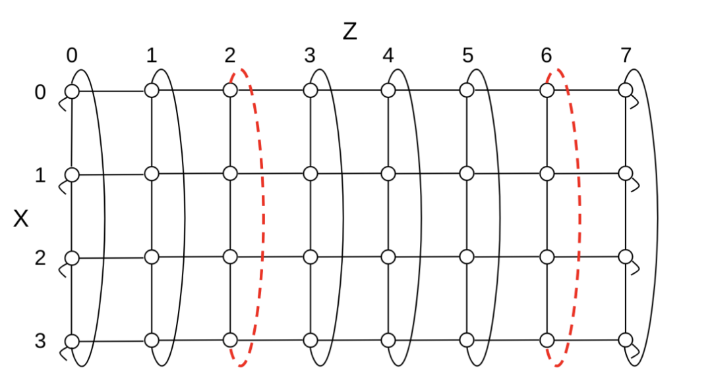
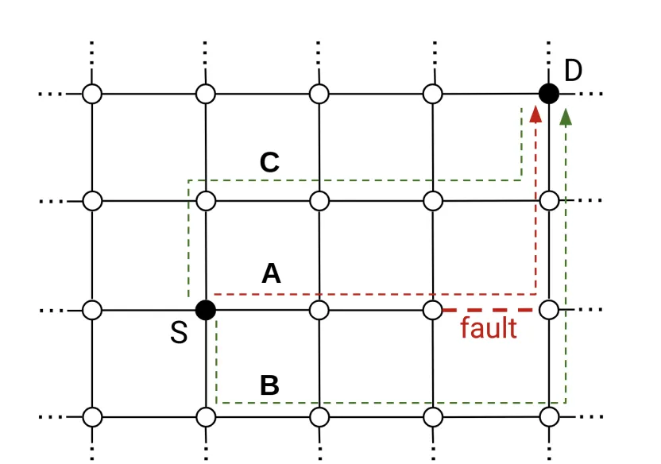
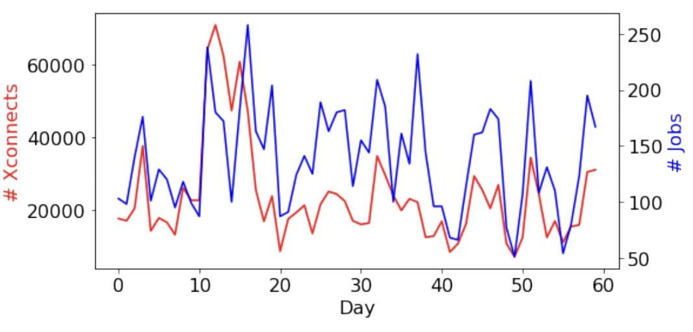

由于字数过长，文章分为两期发布，本片涵盖原文后半部分4～9节，前三章节请参考文章：规模弹性：管理谷歌的TPUv4机器学习超级计算机

## ICI 路由
我们在高带宽 ICI 链路上使用多跳数据包路由，以提供快速的 TPU RDMA 和集合。ICI 路由允许在 pod 中任意一对 TPU 之间发送 RDMA 数据包，并能绕过某些 ICI 故障。libtpunet 会在作业启动时对 ICI 转发表进行一次编程，并在作业生命周期内保持不变。每个源-目的配对会沿着 ICI 拓扑中的一条预定路径发送数据包。

这种方法虽然简单，但足以在 ML 模型并行分解过程中出现的典型集体通信模式（如all-gather, reduce-scatter, all-reduce, all-to-all）上实现高性能[33]。

在本节描述的两种情况下，libtpunet 必须在多个候选路径中谨慎地选择一条路径，以满足 ICI 转发表的约束条件：平局破译和容错 wild-first路由。我们使用整数线性规划方法进行离线路径选择，并将优化结果缓存起来。这样，libtpunet 就能在 ICI 网络设置过程中快速加载预先计算出的解决方案。

图 10：沿 4x4x8 环形的 X 维不可用 OCS 影响 ICI 链路的示例。不可用的 OCS 导致环的一个 XZ 平面上有两个 X 链路不可用，其他 XZ 平面则不受影响。不可用链接用红色虚线标出。OCS 的连通性产生了周期性故障模式，即沿 Z 每 4 跳重复出现不可用链接。

###  无故障路由

为常规环形拓扑配置时，ICI 使用维序路由（DOR）[11]：所有数据包按照环形中从源点到目的地的最短路径，以固定顺序（如先 X 后 Y 再 Z）一次路由一个维度。如 [8] 所述，选择的维度顺序是环中较长的维度先路由。DOR 足以平衡 ML 作业常见流量模式的负载。只需两个虚拟通道[10]，它就能实现无死锁，因此实施成本很低。

当数据包需要在一个维度上走完全部路程时，就会出现一个复杂问题，因为在这种情况下，有两条最短路径可供选择。例如，在一个 8x8x8 的环中，将一个数据包从源点（x = 1，y = 0，z = 0）路由到目的地（x = 5，y = 0，z = 0），在 X + 或 X - 方向上可以走 4 跳。

我们通过算法来处理这种平局的情况：当相关源节点坐标沿该维度为偶数时，数据包会沿正向移动，否则会沿负向移动。在我们的例子中，源节点（x = 1，y = 0，z = 0）的 X 坐标为奇数，因此断线选择 X -。这种方案可以平衡常见的全对全流量模式的负载。

扭转环中的路由也使用 DOR，并通过两个虚拟通道实现无死锁。不过，在扭曲环中打破平局更为复杂，因为其维度不像常规环那样可分离：图 9 使用两个维度进行了简单说明。我们决定将处理扭曲环形中的平分问题纳入一个更通用的整数线性编程框架，该框架还能处理容错路由（第 4.3 节）。这样就无需在这种情况下开发明确的平局打破算法。
###  容错路由
由于具有动态cube选择能力，可重新配置的 ICI 架构本身就能抵御机器故障。在 libtpunet 中，通过支持容错路由，可进一步抵御 OCS 不可用事件。如果 OCS 不可用，一组稀疏的链接也会变得不可用。如图 10 所示，由于cube与 OCS 的连通性，不可用链接的模式与cube粒度高度对称。只需少量路由灵活性，数据包就能避开断开的链接。我们针对这些情况离线优化路由算法。

通过维序路由（DOR）选择的源-目的地对之间的路径，如果穿过不可用的链路，就会变得不可用。在这种情况下，可使用 wild-first路由（WFR）创建替代路径。在 WFR 中，允许数据包沿每个维度最多进行一次容错跳转，然后再返回到使用 DOR 的目的地。

图 11：源 S 和目的地 D 之间的路由示例（虚线路径）。XY 维顺序路由（A）与不可用链路（红色虚线）交叉，因此无法使用。两条可能的 yXY wild-first 路由（B 和 C）先在 Y 方向走一跳，然后再继续走 XY DOR，从而避免了故障。

图 11 显示了一个在二维环中的 WFR 路由示例。在这个例子中，维度顺序是先 X 后 Y，只有沿 Y（Y + 或 Y -）的任意跳才有助于避免不可用链接。我们使用简称 yXY 来表示 wild-first路由算法，即在继续 XY 维顺序路由之前，先沿着 Y 进行一次容错跳转。yXY 算法可以避开 X 维上的任何一条不可用链路。

有一条 “三明治 ”规则体现了 WFR 的容错性：要避免一个维度上的故障，路由算法中必须在其前后出现另一个维度上的跳转。同样，xYX算法可以避免 Y 维的故障。扩展到三维，xyZY X 算法可以避免 Y 维和 Z 维的单一故障。

WFR 的开发受到 ICI 交换机微体系结构的影响。虽然超出了本文的讨论范围，但 WFR 可以通过两个虚拟通道实现无死锁，但有一个限制条件：野跳顺序必须与维度顺序相反。例如，xyZY X 在两个虚拟通道下无死锁，但 yxZY X 则不然。
### 离线路由优化

前几节介绍了由于平局或 wild-first路由算法而产生多条候选路径的情况。而 ICI 交换机的实现使用的是静态转发表，它为每个源-目的配对设定了一条路径。如前所述，我们将路径选择编程为整数线性程序（ILP），离线计算解决方案，并将其缓存起来，供运行时使用。

ILP 的目标是通过解决最大并发流量问题，最大化预定义流量模式的吞吐量[27]。通常选择 All-to-all 作为流量模式，并通过补充约束确保其他集合（如 all-reduce）性能良好。为了遵守静态路由约束，每个路径变量都被限制为布尔值，每个源-目的对只有一条路径。

在无故障和容错情况下，ILP 的设计都是为了利用平移对称性来减少变量数量 [30]。这使得为实际网络规模寻找最优解变得容易。环面和扭曲环面都是顶点对称的，因此可以对一个典型源使用单组路径变量，然后将其转换为所有其他源。如图 10 所示，当 OCS 不可用时，故障模式是周期性的，粒度为cube。虽然由此产生的拓扑结构不如无故障情况下那么对称，但 ILP 仍然可以限制在一组典型源上。这也使得单个典型案例可以离线求解和缓存。典型故障模式可从实际故障模式转化而来，并在网络设置过程中初始化。

表 2：在 (a) 所有 OCS 均正常和 (b) 一个 OCS 不可用的情况下测得的全对全吞吐量。最后一列显示了单故障情况与健康情况下的吞吐量。

表 2 比较了使用这种方法优化转发表时，在无故障和单 OCS 故障情况下测得的全对全吞吐量。对于常规环形网络，单个不可用的 OCS 会将理想的全对全性能降低到无故障网络的 15/16 ≈ 93.4%。这相当于在连接 OCS 的 4x4x4 cube的一个面上失去了 16 个链路中的一个。有趣的是，扭曲环显示出更好的恢复能力，在出现不可用 OCS 的情况下，4x4x8 的性能略有提高。这是因为平分所提供的灵活性：通过平衡不同的平分路径，流量可以从一个维度转移到另一个维度。这种平衡在普通环中是不可能实现的。4x4x8 情况下的微小改进很好地说明了 ILP 方案只能代表实际性能。
## 机群统计数据

在本节中，我们将介绍谷歌在过去两年中运行 TPUv4 超级计算机的机队经验。我们将重点关注软件堆栈对 OCS xconnect、故障和整体系统可用性的自动管理。

### Cube重新配置

每天都有成千上万的训练任务提交给谷歌的 TPUv4 超级计算机。图 13 显示了一台超级计算机在两个月内的 OCS xconnect 操作样本，与该 pod 接受的作业数量相关。由于 Pod 管理器会在每个作业到达时更新 ICI 端口 xconnect，因此作业数量越多，OCS xconnect 变化也就越多。当有大型和/或长时间运行的培训作业时，我们也会看到 OCS xconnect 的变化，因为这些作业需要重新安排时间来处理维护和故障。总体而言，TPUv4 超级计算机在每个 pod 每天进行数万次 OCS xconnect 更改的情况下仍能可靠运行。
]
图 13：TPUv4 超级计算机在两个抽样月中的 OCS xconnect 操作和接受的作业。
###  硬件维护自动化
TPUv4 的可重构性和容错路由允许对机器和 OCS 故障进行恢复。图 12 显示了每台超级计算机不同硬件组件的平均故障率。

TPUv4 的计算资源以多机器cube的粒度组织。每个 TPU 机器都有一个 CPU 盘和一个 TPU 盘，通过 PCIe 链接。每个 TPU 托盘有 4 个 TPUv4 芯片，以 2x2x1 ICI 网格排列；16 台 TPU 机器组合成一个数据中心机架；机架内的 ICI 链接通过 ICI 互联，形成 4x4x4 网格。这个组合就是一个cube。

图 12：超级计算机硬件故障和恢复的每周统计，包括 TPU 机器、ICI 电缆和 OCS。

故障在 TPU 机器、ICI 链路和 OCS 层面进行诊断。Pod 管理器和 healthd 自动执行修复和恢复过程。在一台普通超级计算机中，每天会有 0.08% 的 TPU 机器、0.005% 的 ICI 电缆和 0.04% 的 OCS 出现故障。虽然这些数值很小，但由于每台超级计算机都有大量的机器、ICI 和 OCS，因此受硬件故障影响的工作数量并不少。通过重新配置作业以使用备用的健康cube，可以自动容忍机器和 ICI 中断。OCS 中断的影响半径更大，因为它会影响超级计算机中的所有cube。容错 ICI 路由允许我们容忍 OCS 中断，但会对性能造成一定影响；与其他组件相比，我们优先考虑 OCS 组件的恢复时间，以尽量减少这种影响。
### 容错工作
根据我们迄今为止的经验，95% 的 TPUv4 训练任务都选择了容错 ICI 路由，这样它们就能抵御 OCS 中断；其余的任务则选择了退出，以排除不同路由策略造成的性能不确定性。图 14 显示了在为期 8 个月的样本期间，整个舰队所有正在运行的容错路由作业的比例。一般来说，任何时候都只有不到 2% 的工作在运行容错路由。这一比例与 OCS 维护事件和每次事件的恢复时间高度相关。第 60 天左右的峰值是由于计划对整个机队的 OCS 部件进行升级，以提高可靠性。

图 14：8 个月内使用容错路由（OCS 故障恢复能力）的作业百分比。

容错 ICI 路由会带来性能损失，因为故障链路周围的流量会更加拥挤。负载不平衡会影响包括 allto-all 和 all-reduce 在内的集体操作。我们测量了一系列关键 Google 工作负载对性能的影响，包括推荐模型 (RM)、大型语言模型 (LLM) 和基于 BERT [13] 的模型。表 3 总结了我们的结果。

表 3：容错 ICI 路由对性能的影响。

对于全对全的繁重工作负载，步进时间的下降并不明显，因为离线路由优化器已经将全对全性能降至最低，甚至有所提高。这一点对于重嵌入的扭弦图形尤为明显。全还原工作负载会受到更高的性能影响，因为最近邻通信模式会受到 50% 吞吐量的影响。通过更智能的计算和通信重叠，可以改善对全还原操作的影响。总体而言，所有工作负载的步进时间都略有减慢。

## 相关工作
文献[18]讨论了 TPUv4 使用 OCS 的架构决策，文献[20]和[19]评估了上一代静态 TPU pod 的设计。本文介绍了 TPUv4 的软件生态系统及其如何实现大规模弹性。文献[25]介绍了 OCS 在生产规模数据中心网络中的应用，讨论了可扩展性、成本和拓扑工程方面的注意事项。本文重点讨论 OCS 在 TPUv4 超级计算机中的应用。

之前的工作涉及超级计算机的电路交换 [28]，并提出了用于 ML 训练的拓扑工程 [32]。Nvidia 在 NVlink 上使用基于 NVswitch 的两层胖树网络，用于 GPU 之间的集群。这代表了与我们不同的设计点：与引入分组交换机相比，OCS 简化了 ICI 网络设计，因为它建立了专用物理通道，无需控制共享流量，同时较低的采购价格和待机功率也降低了运营成本[20]。

扭曲环是由文献[6, 26]提出的；TPUv4 支持的具体（4k,4k,8k）和（4k,8k,8k）扭曲环形状与文献[7]一致。最后，软件定义的数据中心网络在文献中已有大量描述（如 [14, 16, 25, 29]）。据我们所知，我们是第一个为超大规模超级计算机描述这种方法的人。

## 未来工作
我们的短期工作重点是提高 TPU pod 的性能和恢复开销：ML 超级计算硬件的需求量很大，每一点帮助都很重要。今后，除了支持提高 ICI 链路的线路速率外，我们还计划为 ICI 交换机引入随机路由功能，以便在出现故障时更好地平衡环形拓扑和扭曲环形拓扑的负载，特别是最近邻通信模式。

我们还计划将基于 OCS 的可配置性与工作负载重新配置更紧密地结合起来，让工作在大部分情况下不受故障影响地继续进行。我们的方法是针对故障事件提供热备用cube，并直接将加速器状态迁移到新的 TPU，而无需写入持久检查点。这项工作涉及对 Borg 调度器（按需调配）、libtpunet（动态调整已构建的 ICI 会话）和 Pathways ML 运行时[5]（管理状态转移）的更改。

## 结论
TPUv4 超级计算机是一个超大规模的 4096 芯片计算系统，可应对快速发展的 ML 模型在可用性和可扩展性方面的挑战。TPUv4 的性能约为上一代产品的 2.1 倍，还具有基于光路交换的cube级可重构性，并使用容错 ICI 路由，以便在交换机发生故障时仍能运行。

本文介绍了 TPUv4 的端到端软件基础设施，为拓扑、路由、调度、中断、监控和硬件健康管理提供了灵活性。TPUv4 的软件定义 ICI 网络方法可在大规模机器和交换机故障时提供强大的故障恢复能力。自2020年以来，该软件一直在生产中运行，为谷歌云计算集群和内部用户运行TPUv4超级计算机，并保持99.98%的系统可用性。
## 致谢
我们要感谢我们的合作者：董翔宇、萨巴斯蒂安-穆加赞比 (Sabastian Mugazambi)、萨迈尔-库马尔 (Sameer Kumar)、安迪-科赫 (Andy Koch)、刘建桥参与了项目的启动，赵文博、李宏基、拉金德拉-戈蒂帕蒂 (Rajendra Gottipati)、潘越超、段晧辰、彼得-加文 (Peter Gavin) 在持续测量和监控方面做出了贡献。我们还要感谢 Kais Belgaied 和 Varinder Singh 在软件基础设施的设计和开发过程中提供的支持。最后，特别感谢罗伯特-亨特（Robert Hundt）、诺姆-尤比（Norm Jouppi）、阿默-马哈茂德（Aamer Mahmood）和匿名 NSDI 评审员对本文提出的反馈和建议。