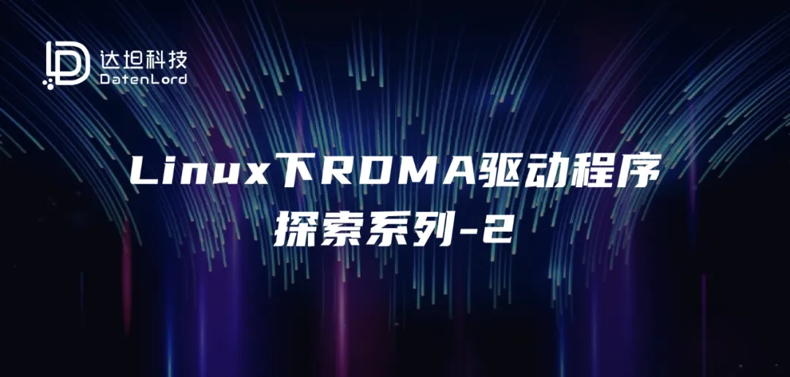

本系列文章将带领读者逐步了解Linux操作系统下的RDMA子系统。本篇文章作为系列的第二篇，将深入内核态驱动程序的代码，主要介绍如下内容：

Driver的初始化流程

几个重要verbs回调函数的简介
## Kernel Driver的初始化流程
由于不同厂商的驱动程序千差万别，在此不以具体厂商的驱动程序进行介绍，而是以Kernel中核心的API调用为锚点进行介绍。读者在阅读完本篇文章后，可以在自己感兴趣的厂商驱动代码中搜索这些API，从而快速梳理出这些驱动程序的框架。

### 驱动的加载与激活
作为一个Linux Kernel Driver，其入口点的位置和普通的Driver程序一样，都是通过module_init来指定一个函数作为入口点。


由于基本上所有RDMA网卡都是PCIe设备，因此在驱动程序入口执行后，首先要做的是初始化PCIe设备相关的操作，典型的就是调用pci_register_driver向Kernel注册自己所感兴趣的PCIe设备，提供probe回调函数，这样kernel在匹配到驱动所对应的硬件后，就会调用probe函数。所以，从某种角度上来说，PCIe设备的probe回调函数才是绝大多数RDMA驱动的主入口，因为如果没有硬件插入主板的话，驱动可以处于静默状态，只有检测到PCIe硬件以后，整个驱动才开始活跃起来。（当然，上述流程是针对RDMA硬件设备的驱动而言的，对于一些例外情况，例如Linux在drivers/infiniband/sw目录中提供的rxe驱动等，是通过软件来模拟硬件行为的，不涉及到真实的硬件，则初始化流程必然会有所差异）。
### RDMA设备注册
驱动程序的核心部分被激活以后，接下来的操作就主要是在Kernel的RDMA框架下进行工作了。该框架提供了一系列以ib_开头的系统调用，在接下的文章中将介绍为了让操作系统可以识别到一个RDMA设备所需要的最少的ib_API调用。


首先，我们需要调用ib_alloc_device来申请一个用来描述RDMA设备的结构体，一个例子如下：
```
struct dtld_dev {
    struct ib_device ib_dev;
    // Other custom fields
};

struct dtld_dev *dtld = NULL;

dtld = ib_alloc_device(dtld_dev, ib_dev);
```
不出意外的，上述代码中使用了Kernel中经典的通过结构体嵌套和container_of来实现类似“面向对象”风格变成的写法。其中dtld_dev结构体是用来表述一块RDMA网卡的顶层结构，其中必须放入一个ib_device类型的成员，从而使得该结构体可以被Kernel的RDMA框架所识别。这个结构体定义好之后，就可以调用ib_alloc_device来申请一块Kernel中的内存用于存放这个设备的描述符了。


拿到设备描述符以后，接下来要调用的是ib_set_device_ops，这个API需要传入一个ib_device_ops类型的结构体，该结构体中定义了RDMA设备可以支持的各种回调函数，一个简单的例子如下所示：
```
static const struct ib_device_ops dtld_dev_ops = {
    .owner = THIS_MODULE,
    .driver_id = RDMA_DRIVER_UNKNOWN,
    .uverbs_abi_ver = DTLD_UVERBS_ABI_VERSION,
    
    // all kinds of callback functions
    .alloc_ucontext = dtld_alloc_ucontext,
    .get_port_immutable = dtld_port_immutable,
    .query_port = dtld_query_port,
    .query_device = dtld_query_device,
    .dealloc_ucontext = dtld_dealloc_ucontext,
    .get_link_layer = dtld_get_link_layer,
    .mmap = dtld_mmap,
    .mmap_free = dtld_mmap_free
    // a lot more callbacks, not listed here
};
```
可以看到这个结构体的前三个字段定义了一些元信息，此后的数十个字段都是Kernel中RDMA框架所支持的各种回调函数的挂载点。上述列出的是一些必要的回调函数，有了这些回调函数的支持，上层应用便可以通过API函数查询到一个可用的RDMA设备了（虽然这个设备现在还只是一个空壳子）。具体这些回调函数的作用，将在下一小节中进行介绍。


上述两个API的调用都是正式将RDMA设备注册给操作系统之前的准备工作。打个比方，就像去一些单位线下办理业务，在正式办理之前需要填好各种申请表格，上面第一个API的作用类似于找人要一张申请表（分配一块内存给设备描述符），第二个API的作用相当于把申请表填好（准备好各种回调函数），接下来的这个API是真正办理业务的API了（向操作系统正式注册这个RDMA设备）：ib_register_device。


在调用ib_register_device以后，如果上层用户态驱动安装正常，则可以通过rdma link show命令行指令观察到一块可以使用RDMA网卡出现在列表中，说明操作系统已经接受了上面的注册申请。
## 几个重要verbs回调函数的简介
在上面第二步填写申请表的操作中，最重要的就是那些回调函数了，很多用户态的管理类API操作，都会最终调用到这些回调函数上来。接下来我们来看几个重要的回调函数，这些回调函数支撑了用户态的rdma link show命令行指令。
### query_device 回调
该回调的主要作用是返回设备的必要信息，原型如下：
```
static int dtld_query_device(
    struct ib_device *dev, 
    struct ib_device_attr *attr,
    struct ib_udata *uhw);
```
从原型声明中可以看到，核心是要通过*attr将设备的各种属性信息返回给Kernel的RDMA框架。这个ib_device_attr类型的结构体是一个拥有40多个字段的结构体，其中主要包含了设备所支持的各种极限参数，例如最大的QP数量、最大的MR数量、最大的PD数量等等这些东西。

### query_port 回调
这个回调的作用是返回端口的必要信息，原型如下：
```
static int dtld_query_port(
    struct ib_device *dev, 
    u32 port_num,
    struct ib_port_attr *attr);
```
从名字就可以看出，这个回调的作用和query_device回调是很类似的，只不过这个要返回端口的属性，而不是设备的属性。其中的ib_port_attr结构体主要包含了端口的速率信息、链路是否通常、MTU配置等，对于一个空壳驱动程序而言，可以通过直接返回如下的属性来让上层应用看到一个可用的接口：
```
attr->state = IB_PORT_ACTIVE;
attr->phys_state = IB_PORT_PHYS_STATE_LINK_UP;
```
### dtld_get_link_layer回调
该函数主要用于返回链路层的类型，例如对于一个RoCE设备，则该回调需要返回IB_LINK_LAYER_ETHERNET
### alloc_ucontext回调
这个回调函数会在上层应用打开设备时被调用，可以在这里完成一些对设备使用前的一些初始化工作，例如将下发WQE的环形缓冲区地址映射到用户态等操作，都可以在这个回调中完成。


提到内存地址的映射，由于RDMA的使用过程中需要很多用户态跳过内核直接操作硬件的操作，因此将硬件上的CSR或Buffer映射到用户态是一个常见的操作。RDMA框架也为此提供了一套映射机制。关于这套映射机制的介绍，我们将在后面单独列出一篇文章进行介绍。对于前文中提到的mmap回调函数的使用，我们也将放到这篇文章中一同进行介绍，敬请期待。

