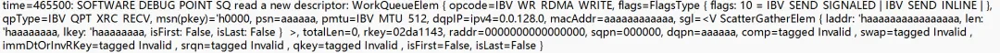
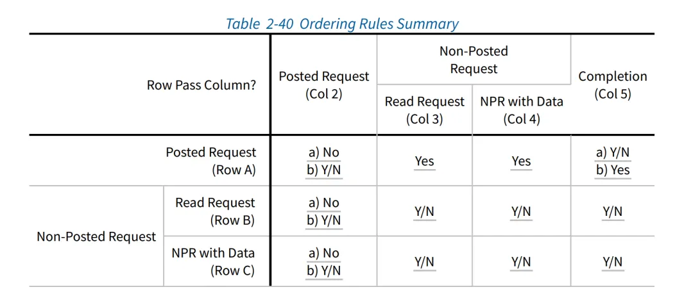

在达坦科技实习期间，笔者开发了一个RDMA用户态驱动，用于与达坦科技自研的BlueRDMA进行交互。整个驱动分为内核态和用户态两个部分，内核部分做的仅仅是将必要的内存空间暴露给用户态，例如将bar空间上的csr(control status register)寄存器映射到了用户态，主要的操作由用户态驱动执行。用户态驱动申请了4个巨页，并分别指定这几个巨页为与硬件交互的Ringbuf。当用户态驱动需要向硬件发送信息（即描述符）时，只需要在内存上写入若干个描述符，然后修改csr寄存器中队列头指针的值。当硬件发现Ringbuf队列非空时，就会向对应的内存区域发起DMA请求，获取描述符，执行相应的操作。
## 背景

在达坦科技实习期间，笔者开发了一个RDMA用户态驱动，用于与达坦科技自研的BlueRDMA进行交互。整个驱动分为内核态和用户态两个部分，内核部分做的仅仅是将必要的内存空间暴露给用户态，例如将bar空间上的csr(control status register)寄存器映射到了用户态，主要的操作由用户态驱动执行。用户态驱动申请了4个巨页，并分别指定这几个巨页为与硬件交互的Ringbuf。当用户态驱动需要向硬件发送信息（即描述符）时，只需要在内存上写入若干个描述符，然后修改csr寄存器中队列头指针的值。当硬件发现Ringbuf队列非空时，就会向对应的内存区域发起DMA请求，获取描述符，执行相应的操作。


BlueRDMA基于BlueSim提供了一个可以在软件上进行模拟的仿真器。通过BlueRDMA中的脚本，软件能够与硬件仿真器交互测试功能。通过这个仿真器，软件能够与硬件代码协同测试。但是由于是全软件模拟硬件，仿真器的速度很慢，不适合跑较大规模的测试。通常是在仿真器上验证行为后，后续在硬件上运行更大规模的测试。小规模的测试往往不够充分，也留下了一些潜在的软件bug。笔者在仿真器上跑了一些测试，一切都工作正常，直到准备在硬件上进行性能测试。


具体的现象是，当关闭日志时，硬件有很大概率会出现丢包的问题。例如，当发送方写入了若干个描述符，但接收方并没有收到全部的包，只收到了一系列连续的报文，但未能收到期望的全部包。


由于与日志打印相关，笔者的第一反应是内存问题。在之前调试一些C/C++项目时，曾遇到过开启打印能消除“segment fault”的神奇bug。虽然这是一个Rust项目，内存安全性相对较好一些，但在涉及到Ringbuf相关内存申请时，不可避免会引入一些unsafe。经过反复检查各个unsafe和写入操作，感觉问题不在这上面。


会不会是发送速度的问题呢？开启打印日志不可避免会带来锁等开销，由于目前的程序在每个描述符下发到硬件上时都加上了一个日志，用于判断描述符是否正常写入，因此相当于每次描述符写入都要上锁。这操作相对较慢。关闭日志后，发送速度变快了。但是为什么变快了会导致发送数据不完整呢？
## cache一致性的问题
与此同时，还遇到了另外一个bug，这主要与cache一致性相关。硬件向软件上报描述符时，同样是通过Ringbuf实现的。硬件会首先将描述符拷贝到Ringbuf上，然后修改Ringbuf的头指针，表示有新的描述符产生。软件会轮询Ringbuf的头指针，一旦头指针发生变化，就会从对应的内存区域读走描述符，同时修改尾指针，表示软件已读取。在实际测试中，这个机制一直工作得很好，但有时软件会读取到一些“全0”描述符。这种描述符的特征在于，即使你给DMA buffer提前填充了一些别的数据（例如全部填1），读取描述符时的数据仍然是0。


笔者一开始怀疑是硬件上报了“全0”描述符。在经过沟通和一些试验后，发现如果不立即读取这个新的描述符，而是稍等一会再去读取，就能读取到其内容。这可能与cache一致性相关。上文提到，用户态驱动使用了巨页作为与硬件交互的Ringbuf，巨页本身能提供超过4K的连续物理内存，但巨页本身并不具有DMA cache coherence。也就是说，可能存在内存上发生了DMA拷贝，但用户态程序读取的仍然是之前的cache内容。


会不会上面“丢包”的问题也是cache一致性导致的呢？毕竟如果写入描述符的速度变快了，很可能cache没有同步到物理内存上，然后就发生了连续丢包。在mentor的建议下，笔者决定先从cache一致性入手，或许解决cache一致性的问题，上面的丢包问题也能一并解决。


在阅读了erdma等项目mr注册部分的实现后，发现只需要使用dma_alloc_coherent接口就能拿到一块物理内存连续且设备读/写都能马上与CPU同步的内存。同样地，用户态驱动只需要通过mmap就能将这块Ringbuf挂载在自己的虚拟内存上。完成这一部分工作后，读取到“0描述符”的bug已经消失了，但发送方丢包的问题仍然存在。


经过再次检查写入Ringbuf的代码，并阅读内核中其他驱动读写bar空间的代码后，笔者发现用户态可能还缺少了volatile读/写操作。尝试使用Rust标准库提供的volatile_read/volatile_write，并在写入Buffer时加上fence，然而该问题依然未得到解决。
## 从单独的模块入手
为了进一步确定丢包的原因，笔者决定做一些实验进行探究。


上述的硬件测试是在两台机器上进行的。两台机器各有一张FPGA卡，连接两个FPGA卡的网口的是一台交换机。交换机上有网口收包和发包计数，可以从计数得到一些线索。在做了一些测试后，笔者发现几个特点：

发包的个数等于收包的个数，但二者都小于期望发包的数量。


发包的数量刚好是描述符的倍数。例如，每个描述符让硬件发送256个包，软件写入了96个描述符，期望发出8192个包，但实际上只发出了576个包，即54个描述符。


硬件发出的包是连续的，即发出54个软件描述符的报文的序号（PSN）都是连续的。硬件是在某个时刻停止处理描述符，而不是少发了一些描述符。


会不会是软件写入了过多描述符，但硬件处理不过来呢？与mentor沟通后，他将硬件读取描述符的操作单独提取出来。硬件读取到描述符后，会将它们马上写入到另一个Ringbuf中。软件应当能够从中读取到一样的描述符。将软件部分写入描述符的模块也单独提取出来，只测试写入描述符和收到的描述符。


实验中构造了一批完全不同的描述符，每次随机写入0-128个描述符（128是缓冲区的最大容量）后，在另一侧等待读取写入的描述符。在多次实验后，读取到的描述符都是相同的。


前文提到，硬件会在第48个或第54个软件描述符时停下。那么有没有可能在这个时候硬件进入了一种不可恢复状态，卡死了呢？于是笔者尝试软件在下发192个描述符后，等待一会，打印出硬件csr寄存器上tail指针的值。再下发24个描述符，检查硬件csr寄存器上tail指针是否有移动；另外，还测试了在另一组Ringbuf上下发描述符，同样查看其tail指针是否有移动。两个实验的结论都表明，硬件不知何故进入了一种卡死状态。似乎硬件真的在软件高速下发描述符时，就会卡死。

## 回到仿真器
笔者想到mentor之前很早就提出的，尝试先测试一些小的buffer情况，如果能稳定复现，再到仿真器上运行，说不定会有新的发现。因为仿真器完全用软件模拟硬件逻辑，运行速度比较慢，做一次2M的DMA传输需要花费一个小时，而硬件上测试用的都是64M、128M大小的buffer，所以之前测试用的都是数百K大小的buffer。这就导致很多情况在之前仿真器测试中没测到。


经过实验，笔者找到了一组2M buffer下能够稳定复现上述bug的参数。将其在仿真器上进行实验，从日志中看到了一个诡异的现象：明明软件日志下发的数据是有效的，但仿真器中打印的日志表明，描述符的数据不对。图中有一部分数据的值为0xaaaaaaa，在BlueSpec中，没有初始化的数据为被默认设置为1010交错的数据。难道真的是硬件有问题吗？

笔者又仔细查看了一遍软件打印的日志，突然意识到另一个问题。为什么仿真器的处理速度这么慢，但软件写入却基本上不停下呢？于是马上打印出了写入csr寄存器的head和tail指针，突然发现tail指针和head指针的差值居然超过了128，也就是最大的队列容量。但代码中明明检查了tail指针和head指针的差值，而且写了测试，怎么会超过缓冲区的长度呢？


再回头去仔细看代码，发现写错了一个掩码：
```
const HARDWARE_IDX_MASK: usize = DEPTH * 2 - 1;
const MEMORY_VALID_IDX_MASK: usize = DEPTH - 1;
const _IS_DEPTH_POWER_OF_2: () = assert!(_is_power_of_2(DEPTH), "invalid ringbuf depth");

// 初始时,self.tail = 0，只有当第一次写满时，才会更新self.tail

let idx = (*self.head + self.written_cnt) & MEMORY_VALID_IDX_MASK; // **这里写错了**
// 如果发现队列满了
if is_full_helper(idx, *self.tail) {
    // 写回当前的idx,并轮询当前的tail指针，直到有多余的空位写新的描述符
    let _: Result<(), DeviceError> = self.advance();
    loop {
        let new_tail = self.proxy.read_tail()?;
        if is_full_helper(idx, new_tail as usize) {
            *self.tail = new_tail as usize;
            break;
        }
        if timeout_in_millis > 0 && start.elapsed().as_millis() > timeout_in_millis {
            return Err(DeviceError::Timeout);
        }
        std::thread::sleep(std::time::Duration::from_millis(1));
    }
}
// 计算Ringbuf上描述符的偏移量
let offset = idx * ELEM_SIZE; 
```
为什么要使用两组掩码呢？起初设计的时候，使用的是一个0-127长度的两个值作为head和tail指针，当head指针和tail指针在环中相差为127时，认为队列满了。后来沟通后发现，硬件上csr寄存器指针的值实际上是8个bit。使用8个bit可以用一种比较巧妙的方式判断队列是否已满：当最高bit不同，但剩余7个bit相同时，队列已满。由于是直接通过csr寄存器写入数据，如果软件和硬件使用的队列指针不同的话，就会出现硬件的队列指针异常的现象。因此这里软件必须与硬件采用相同位长的队列指针。
````
const HARDWARE_IDX_MASK: usize = DEPTH * 2 - 1;
const HARDWARE_IDX_GUARD_MASK: usize = DEPTH;
const MEMORY_VALID_IDX_MASK: usize = DEPTH - 1;
fn is_full_helper(head: usize, tail: usize) -> bool {
    // Since the highest bit stands for two times of the DEPTH in bineary, if the head and tail have different highest bit and the rest bits are the same,
    // it means the ringbuf is full.
    
    // In hardware we use like (head.idx == tail.idx) && (head.guard != tail.guard)
    
    let head_guard = head & HARDWARE_IDX_GUARD_MASK;
    let tail_guard = tail & HARDWARE_IDX_GUARD_MASK;
    let head_low = head & MEMORY_VALID_IDX_MASK;
    let tail_low = tail & MEMORY_VALID_IDX_MASK;
    (head_guard != tail_guard) && (head_low == tail_low)
}
````
在那次修改中，idx的计算使用的仍然是0-127的掩码，而不是0-255的掩码，这导致要写入的区间永远在0-127之间。而self.tail即尾指针只有在队列已满才会尝试轮询获取，初始值为0。因此head和tail的差值永远在0-127之间，队列也不会满。这导致软件写入的速度不受控制。


在之前的测试包括实验中，虽然测试了写入跨越127、255这种边界的情况，但笔者潜意识认为软件不能一次写入超过128个描述符，因此在测试或实验中，都会在写入128个描述符后检查数据是否正确。这导致一直没有发现这个问题。

## 番外：全0描述符的问题
上文提到的“全0描述符”问题实际上并没有被完全解决。在后续测试中，笔者发现仍然在零星的情况下会出现读取到全0描述符，其症状和之前所述完全一样。但是Ringbuf已经被完全替换为了一块DMA cache coherence的内存了，每次读取时我都使用的是rust提供的volatile_read。


与mentor沟通后，推测可能是由于PCIE csr读写和memory写不保序带来的问题。


接收队列读取一个描述符的过程是这样的：硬件在有新的需要上报的描述符时，会发起一次DMA写操作，将描述符数据写到位于主存的Ringbuf上面，等到收到TLP请求发起的通知后，更新接收队列上head指针寄存器；与此同时，CPU会轮询位于bar空间上的csr head指针，当发现csr head指针相对大于tail指针时，读取并解析位于主存上的描述符。整个过程，一共有两种PCIE transaction。CPU读csr寄存器使用的是MemRd请求，硬件写描述符是MemWr请求。MemRd是一个non-posted的请求，会在设备端产生一个Completion响应；硬件发起DMA写请求时，产生的是一个Posted的请求。根据PCIE spec，在Posted Request和Completion的情形下，两种包是不保证到达顺序的：可能读响应比写请求先到，也可能写请求比读响应先到。

A5a A Posted Request is permitted to pass a Completion, but is not required to be able to pass Completions unless A5b applies.

A5b Inside a PCI Express to PCI/PCI-X Bridge whose PCI/PCI-X bus segment is operating in conventional PCI mode, for transactions traveling in the PCI Express to PCI direction, a Posted Request must be able to pass Completions to avoid deadlock.
也就是说，CPU可能发起了一次MemRd请求，硬件修改的值马上被读取回来了，而硬件DMA写描述符的请求已经发起，但是MemWr包还未被写入主存。此时软件就会看到尚未写入数据的描述符。


解决这个问题的方法有很多。例如，可以将csr head/tail指针从bar空间移动到主存上。当硬件需要读写队列的指针时，通过MemWr请求去修改。例如，当硬件要上报描述符时，首先通过一个DMA请求，产生一个MemWr包；然后再做一次DMA操作，修改主存上的head指针的位置，产生一个MemWr包。根据Table 2-40，两个MemWr操作的到达是保证顺序的：

即可解决这个问题。
## 对调试的反思
这次调试暴露了测试并不够完备。以这个bug为例，在编写代码时，我实际上意识到可能会有硬件消费不过来的问题，但测试中，我做了软件一次只能写入不超过128个的假设，导致没有测出这种情况。在后续的测试编写中，除了正常路径的完备性，边界条件和异常情况更需要仔细考虑。另外，使用随机化测试或者fuzzy test去测试接口是很有必要的。普通的测试常常会带着编写者的一些“假设”，如果真实情况不满足这样的假设，或者外部环境没有约束这样的假设，就容易产生一些奇怪的bug。


代码结构和设计模式也是一个问题。上述出现问题的代码中同时存在了多个掩码，或者说多个Magic Number，但是又缺乏良好的封装。在调用中，每次使用到掩码时都是直接引用这个常量，在当时修改此处代码时，独立地修改了每个位置的掩码。由于其掩码的名字取得又比较相似，在阅读该部分代码时甚至没有想到这个问题。加之测试通过了，当时就认为这个地方没问题了，这样埋下了大坑。


调试时一定要找到一个好的调试思路。事实上，我在刚开始就意识到可能与“发送速率过快，硬件消费不过来”有关系。但一开始由于其他bug的干扰，我一直没有确定问题根本的原因是什么。调试的过程是一个设计实验验证猜想的过程，而且最好多种实验交叉验证一个猜测，避免由于实验设计问题得到错误结论。另一方面，在验证和调试过程中，尽量从小的问题出发。如果从一开始就把问题规模缩小，使得能够在仿真器上运行，或许就不会花这么多时间做其他实验了。


和硬件联合调试还是比较困难的。传统调试软件的方法包括print大法，gdb断点调试，assert等等，但是在实际与硬件联调时，断点这样的手段无法获取到足够的信息，只能从日志中去找到一些蛛丝马迹。事实上，硬件是提供了一些调试手段的，但是其成本较高。一种是直接使用vivado提供的硬件探针读取某些信号，这种方法最直观，类似gdb watch硬件信号的功能，但是每次都要重新综合硬件，每次综合往往需要数个小时，无法快速验证调试的想法。另一种是在硬件上添加调试寄存器，