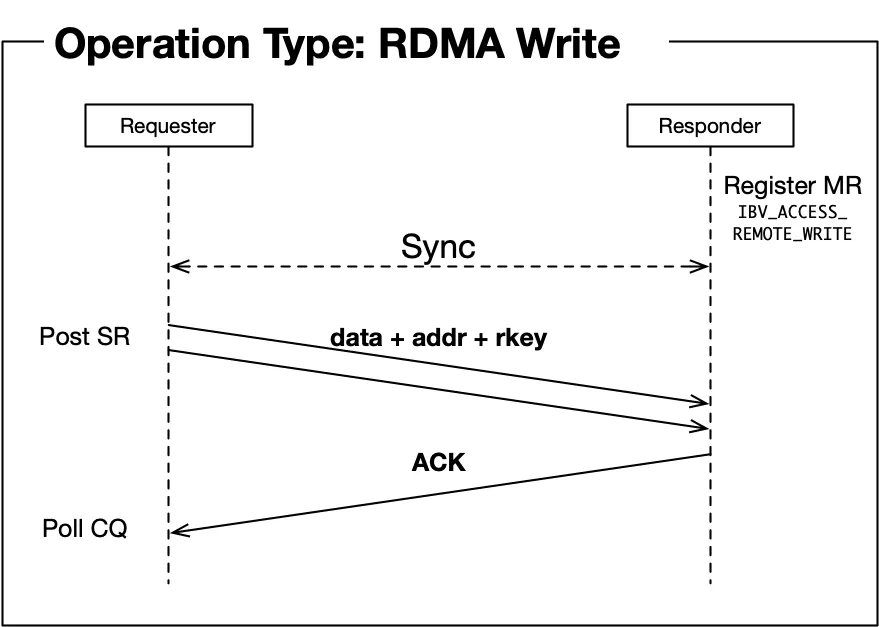

InfiniBand是一种高性能网络技术，其数据包格式设计对实现高效可靠的网络传输至关重要。本文将详细介绍InfiniBand数据包的头部结构，分析它们在实际应用中的作用和实现机制。并且我们会讨论可靠连接(RC)服务类型下的传输头格式，以及RDMA WRITE等典型操作场景，以及它们在ibverbs接口中的对应关系。


Table of Contents:

1. 两类包头格式

2. Routing Headers

    2.1.源码分析

3. Transport Headers

    3.1. Reliable Connection简介

    3.2. InfiniBand如何保证Reliable Connection?

    3.3. RDMA WRITE

    3.4. RDMA WRITE如何实现操作完成通知？

    3.5. BTH (Base Transport Header)

    3.6. ETH (Extended Transport Header)

        3.6.1. RETH (RDMA EXTENDED TRANSPORT HEADER)

        3.6.2. AETH (ACK EXTENDED TRANSPORT HEADER)

    3.7. ACK COALESCING机制

    3.8. 代码示例分析

4. 总结

## 两类包头格式
对于InfiniBand中的数据包，它的包头主要分为两类，一类是Routing Header，另外一类是Transport Header。我们可以通过以下的图示了解包头的结构：

如图所示，对于Routing Header又分为两种，分别是LRH(Local Route Header)和GRH(Global Route Header)。对于Transport Header也分为两种，分别是BTH(Base Transport Header)和ETH(Extended Transport Header)，其中ETH也可以分为几类，稍后我们会详细介绍。
## Routing Headers
对于InfiniBand包的传输，通常会存在多个节点之间的传输，这就要求我们需要在数据包上储存路由信息，使得交换机能够路由数据包到正确的节点。Routing Header就用于指定数据包的路由信息，分为LRH和GRH：

LRH (Local Route Header)

LRH是InfiniBand数据包的本地路由头，负责子网内的数据包传输，包含本地寻址、服务质量控制和包长度等基本路由信息。


GRH (Global Route Header)

GRH用于跨子网通信，采用IPv6格式提供全局路由能力，包含全局寻址、流量控制和跨网络传输所需的路由信息。


InfiniBand采用LID和GID两级寻址机制，其中LID用于子网内路由转发，GID则用于跨子网路由，数据包在子网内通过交换机查询LID转发表进行传输，到达子网边界时则使用GID进行路由。二者分别存储于LRH和GRH中。


LID是一个16-bit的ID，在一个subnet中必须是全局唯一的。它由一个中心化的Subnet Manager进行分配。和MAC地址类似，它也分为unicast和multicast，一个unicast的LID只能对应一个节点，而multicast的LID可以对应一个或多个节点，具体的映射关系取决于Subnet Manager的配置。


GID在InfiniBand中直接使用了128-bit的ipv6地址作为ID。对于IPv4地址，则是使用了IPv4映射到IPv6地址，使用GID最后四个字节存储地址信息。


源码分析

下面我们可以通过对于Linux RDMA代码定义来具体分析GRH和LRH在实际实现中是如何指定的。在RDMA实现中，我们需要对于每个Queue Pair指定对应的路由信息。这一路由信息由Address Handle存储，具体的结构体名称是 ibv_ah_attr 。这个结构体就包含了LRH和GRH相关的信息，代码如下：
````
struct ibv_ah_attr {
        struct ibv_global_route        grh;
        uint16_t                dlid;
        uint8_t                        sl;
        uint8_t                        src_path_bits;
        uint8_t                        static_rate;
        uint8_t                        is_global;
        uint8_t                        port_num;
};

struct ibv_global_route {
      union ibv_gid                dgid;
      uint32_t                flow_label;
      uint8_t                        sgid_index;
      uint8_t                        hop_limit;
      uint8_t                        traffic_class;
};
````
可以看到GRH对应的全局路由信息被封装在单独的 ibv_global_route 结构体中。其中源GID(sgid)使用索引形式存储，这是因为每个RDMA设备端口都会分配一个或多个GID。RDMA设备维护一个GID表，通过索引就能快速查找到对应的源GID。


LRH对应的本地路由相关的信息则直接存储在 ibv_ah_attr 结构体中。每个端口(port_num)都对应一个源LID(slid)。为了支持多路径传输，InfiniBand引入了LID Mask Control机制:通过 src_path_bits 字段，可以在基础LID(base_lid)的基础上，计算出实际使用的LID。此外， static_rate 字段用于静态速率控制，确保发送方的传输速率不会超过接收方的处理能力。这些参数都由Subnet Manager统一管理和配置。
## Transport Headers
InfiniBand的Transport Headers是IB网络协议中的关键组成部分。它包含了数据包的基本信息，包括寻址，确保可靠传输、网络分区管理、以及QoS等控制信息。这些信息是支持InfiniBand支持可靠和非可靠传输等多种服务类型的基石。下面我会介绍几种常见的Transport Header和它们的用途。由于篇幅关系，我们只介绍RC(Reliable Connection)服务类型中所使用的包头信息。


Reliable Connection简介

首先我们需要了解RDMA中的服务类型。InfiniBand提供了RC、UC、RD和UD等传输服务类型。RC提供可靠的点对点连接;UC提供不可靠的点对点连接;RD提供可靠的数据报服务，支持多播;UD支持不可靠的数据报服务，同样支持多播。RC因其完整的功能支持和可靠性保证而使用最广泛，和TCP类似，它设计的目的就是确保数据可靠传输以简化应用层的处理逻辑，即数据被按顺序处理并且只交付一次。因此对于RC来说，InfiniBand设备需要追踪每一个数据包和它们之间的顺序。在RC中，我们需要显式地建立连接，需要在进行数据传输前显式建立连接。每个连接由一对Queue Pair(QP)组成，分别位于通信的两端。


InfiniBand如何保证Reliable Connection?

InfiniBand网络通常是部署在单个数据中心中，并且节点间通过高质量的线缆进行连接，但即便如此，在InfiniBand网络中仍然可能 出现丢包和乱序的问题，例如因为硬件故障或者网络拥塞导致交换机缓冲区溢出。这就需要我们引入其他机制来确保Reliable Connection。和TCP类似，InfiniBand引入了ACK(Acknowledgment)机制使得接收端向发送端确认收到的数据包。


在InfiniBand中，ACK机制的工作方式如下:

1. 发送端为每个发出的包分配一个序列号(PSN， Packet Sequence Number)

2. 接收端按序接收数据包，丢弃PSN重复的包，并通过发送ACK包来确认收到的最大连续序列号

3. 如果发送端在超时时间内没有收到某个包的ACK，会重传该数据包


同时，InfiniBand还实现了NAK(Negative Acknowledgment)机制，即接收端如果发现收到的包序列号不连续，会发送NAK(Negative Acknowledgment)通知发送端重传丢失的包，以加速重传的性能。


这样基于序列号和确认的机制可以有效地检测和恢复丢包，并且保证数据包按顺序到达，并且避免重复。


RDMA WRITE

使用RDMA的目的之一就是能够直接操作远端节点的内存实现零拷贝。RDMA WRITE操作就是实现这一目的的基础。对于一次WRITE操作，InfiniBand设备(HCA)会直接从本地应用程序注册的内存区域(Memory Region)中读取数据，然后通过网络将数据传输并直接写入到远端节点预先指定的内存位置。这个过程完全绕过了操作系统和CPU的参与，避免了内存拷贝。为了实现这种直接内存访问，WRITE操作需要以下关键要素:

本地端的源数据内存地址和长度

远端节点的目标内存地址

远端内存区域的访问权限


当应用程序发起WRITE请求时，这些信息会被封装在工作请求(Work Request)中提交给HCA，HCA硬件接管后续所有操作。

RDMA WRITE如何实现操作完成通知？

RDMA WRITE会直接将数据写入远端内存，绕过了操作系统和CPU，然而我们要使得这一操作真正有用，就必须通过某种机制通知用户操作已经完成了，否则用户就无法知道这片内存区域的数据是否完整。因此在InfiniBand中实现了两种通知机制，一种是接收端HCA通知用户程序一个WRITE操作已经成功接收(WRITE_WITH_IMM)，另外一种是发送端HCA通知用户程序一个WRITE操作已经成功发送(SEND_SIGNALED)。这两种机制使得发送端和接收端用户程序能够及时获知操作的完成情况。

WRITE_WITH_IMM

当用户需要一个WRITE操作在接收端产生完成事件时，就需要使用WRITE_WITH_IMM操作。IMM指的是一个可选的4bytes的值，会一并包括在完成事件中，它的内容可以用户自定义的各类元数据，方便应用层处理。


SEND_SIGNALED

当用户需要在发送端产生一个完成事件时，就需要设置 IBV_SEND_SIGNALED 这一个flag。对于向HCA下发的每一个Work Request，用户需要指定一个ID(wr_id)，当操作完成时，HCA会产生一个完成事件(Completion Event)，完成事件中包括这个ID帮助用户识别具体完成的操作。


BTH (Base Transport Header)

了解了RC服务类型和RDMA WRITE操作的背景，我们可以进一步解析传输头的细节。首先我会介绍BTH传输头， 顾名思义，BTH包含了数据包最基本的信息，对于所有InfiniBand数据包都存在BTH(RAW数据包除外)。BTH中基础的几个字段包括：

Opcode: 用于指定RDMA操作的类型，例如前面所述的RDMA WRITE操作，除了之前介绍的WRITE/WRITE_WITH_IMM操作以外，还包括READ/SEND/RECV等，每个操作都对应不同的Opcode，使得HCA能够分别进行处理。

Solicited Event: 控制数据包接收端是否应该产生一个完成通知，用于我们所述的WRITE_WITH_IMM操作。

FECN/BECN (Forward ECN/Backward ECN): ECN标识。如果置为1，则表示通知对端发生了网络拥塞。

Destination QP: 用于区分数据包不同的目的Queue Pair。

Acknowledge Request: 一个flag表示接收端是否需要对这个数据包立即返回一个ACK，用于SEND_SIGNALED机制，因为在发送端的完成事件中，仅当操作中所有发送的数据被ACK后才能够认为该操作已经完成。

Packet Sequence Number: 表示当前包的编号，用于我们刚才介绍的数据包顺序追踪。


ETH (Extended Transport Header)

除了BTH之外，InfiniBand还定义了不同种类的数据包用来实现不同的功能，对于这些不同的数据包的基础信息，就作为扩展储存在ETH中。下面我主要介绍RETH和AETH两种不同的扩展包头。


RETH (RDMA EXTENDED TRANSPORT HEADER)

回顾我们之前介绍的RDMA WRITE操作，需要有几个要素，这几个要素就对应了RETH扩展包头的字段，用于通知接收端硬件进行相关的写入操作，包括：

Virtual Address: 目标写入地址

Remote Key: 访问的Key，标识访问权限

DMA Length: 写入的长度


其中源数据地址仅由本地硬件处理，不包含在传输头中。这样通过RETH扩展传输头的引入，InfiniBand实现了RDMA WRITE操作的支持。这体现了InfiniBand架构的可扩展性设计理念， 新功能的实现只需定义接收端必要的字段信息，并将其封装在相应的扩展传输头中即可。


AETH (ACK EXTENDED TRANSPORT HEADER)

在我们之前的讨论中，InfiniBand为了实现可靠传输，使用了ACK的机制，而AETH就专门用于ACK包的包头。ACK包不包含payload，它作为控制数据包仅作为通知机制使用。它包括以下字段:

Syndrome: 标识是ACK还是NAK，并且携带用于流量控制相关的信息。

Message Sequence Number: 表示最后一个完成接收的Message对应的序号。这样发送端如果收到这样一个MSN，它就能够认为之前所有的MSN都已经被成功接收。


ACK COALESCING机制

在前面我们介绍了RDMA WRITE操作和SEND_SIGNALED机制，我们可以考虑以下问题：如果用户发送了很多WRITE操作，并且每个操作都需要知道操作已经完成了，那应该怎么做？


一个显而易见的方法是我们对于所有WRITE操作都加上一个SEND_SIGNALED的标志，这样我们可以知道所有操作的完成情况。然而，这会造成额外的资源占用，主要包括两点：

接收端需要对每个操作都回复对应的ACK包，占用网络带宽

发送端需要对于每个操作都产生一个完成事件，占用硬件资源


当我们发送大量数据时，这显然会带来巨大的开销。那么InfiniBand是如何解决这个问题的呢?


InfiniBand通过ACK Coalesing 机制来优化这一过程。具体来说，用户可以将多个WRITE操作标记为unsignaled(即普通的WRITE)，然后标记最后一个操作是signaled(设置SEND_SIGNALED)。这样，只有最后一个操作会要求接收端返回ACK，并且产生完成事件。由于在RC中，所有的数据都是有序处理的，因此当发送端收到这个ACK时，就可以认为之前所有的unsignaled操作也都已经成功完成。


然而，需要注意的是，使用这个机制时用户程序必须确保定期发送signaled的操作，用于HCA清除发送队列。否则，如果发送队列被unsignaled的操作占满， 而没有任何完成事件产生， 用户无法发送新的signaled的操作清除发送队列， 就会导致发送队列无法继续使用。
## 代码示例分析
我们可以通过分析一段RDMA用户程序代码将前面介绍的概念具象化。这段代码展示了如何构造一个RDMA WRITE请求，以及这些字段是如何对应到传输头中的。这是来自libibverbs库的API使用示例，libibverbs是用户态程序访问RDMA设备的标准接口。


首先列出主要的数据结构:

````
// 描述要发送的数据缓冲区
struct ibv_sge {
    uint64_t addr;    // 本地内存地址
    uint32_t length;  // 数据长度
    uint32_t lkey;    // 本地内存区域的访问密钥
};

// 描述一个RDMA操作请求
struct ibv_send_wr {
    uint64_t wr_id;      // 用户定义的请求ID
    struct ibv_sge *sg_list;  // scatter/gather列表，对于单个WRITE请求，我们只使用一个列表元素
    int num_sge;         // sg_list中的元素数量
    enum ibv_wr_opcode opcode;  // 操作类型(WRITE/READ等)
    int send_flags;     // 操作标志位
    union {
        struct {
            uint64_t remote_addr;  // 远程内存地址
            uint32_t rkey;         // 远程内存区域的访问密钥
        } rdma;                    // RDMA操作特有字段
    } wr;                         
};
````

下面是构造一个WRITE请求的示例:

````
struct ibv_send_wr wr = {};
struct ibv_sge sge = {};

// 设置本地数据缓冲区信息
sge.addr = (uint64_t)local_buffer;  // 本地数据源地址
sge.length = 4096;                  // 传输4KB数据
sge.lkey = mr->lkey;               // 本地内存区域的访问密钥

// 配置WRITE操作请求
wr.wr_id = 0x1234;                 // 用于标识这个请求
wr.opcode = IBV_WR_RDMA_WRITE;     // 指定为WRITE操作
wr.sg_list = &sge;                 // 指定数据源
wr.num_sge = 1;                    
wr.send_flags = IBV_SEND_SIGNALED; // 设置完成通知标志位
wr.wr.rdma.remote_addr = remote_addr; // 目标地址
wr.wr.rdma.rkey = remote_key;        // 远程内存区域的访问密钥
````

这些字段会被HCA硬件转换为对应的传输头:

1. BTH (Base Transport Header):

opcode字段会被设置为RDMA WRITE

send_flags中的IBV_SEND_SIGNALED会设置Acknowledge Request位

PSN会由HCA自动分配


2. RETH (RDMA Extended Transport Header):

remote_addr会被填入Virtual Address字段

rkey会被填入Remote Key字段

length会被填入DMA Length字段


当这个请求被提交给HCA后，HCA会:

从local_buffer读取4KB数据

构造包含BTH和RETH的数据包

通过网络发送给接收节点

接收节点HCA向本地 remote_addr 中写入对应的数据，并返回ACK

发送节点等待接收节点节点的ACK (因为设置了IBV_SEND_SIGNALED)

收到ACK后生成完成事件


这样就完成了一次RDMA WRITE操作。我们可以看到用户程序只需要通过API调用来使用RDMA功能，而复杂的传输头处理都由硬件自动完成。

## 总结
InfiniBand传输头的设计体现了其作为高性能网络的特点。通过包头的分层设计，既保证了基础功能的稳定性，又提供了良好的扩展性。深入理解这些机制有助于RDMA编程实践，也能够启发我们在设计分布式系统时如何权衡各种技术选择。对这个主题感兴趣的读者可以参考IBTA规范以及Linux源码获取更多细节。

## 关于作者
作者是达坦科技的RDMA软件工程师，目前负责Blue RDMA驱动的开发和维护工作。欢迎通过Github(@bsbds)与我交流。
