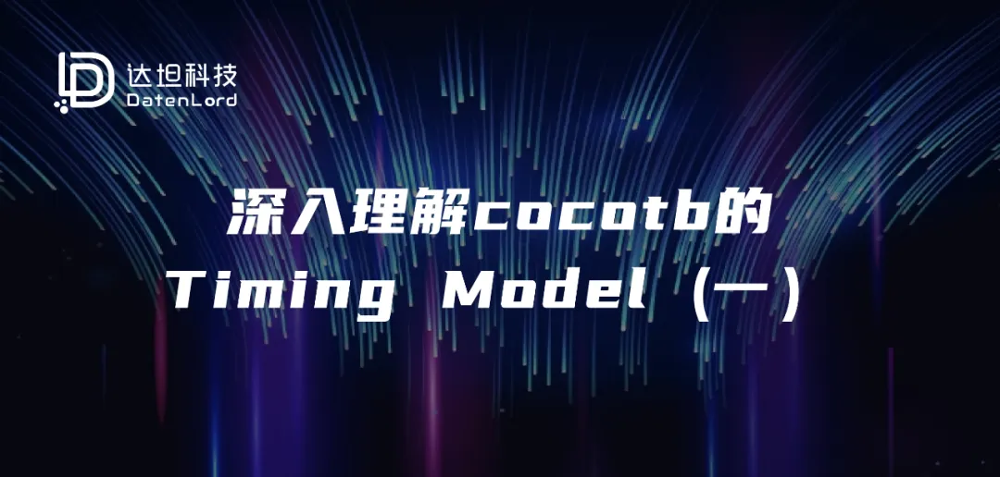
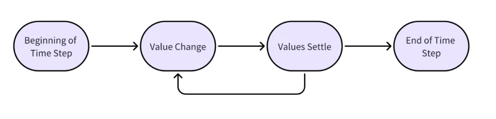

## 写在前面
达坦科技即将开源的100G RDMA RTL代码采用cocotb对其功能进行验证。因此，本文预先介绍一些cocotb验证框架相关的内容，希望以此抛砖引玉，引起大家对基于cocotb的敏捷验证的相关讨论交流。


关于Cocotb的话题，会有一系列文章进行讨论，本篇是此系列的第一篇，欢迎大家关注达坦科技公众号，第一时间阅读最新文章。

## 抛出问题
在使用cocotb编写测试脚本时，大家肯定对类似await RisingEdge(clk)这样的写法非常熟悉。根据cocotb的官方文档，我们可以知道RisingEdge是一种触发器(Trigger)，这一行代码的含义是等到下一个时钟信号的上升沿，信号的上升沿是一个事件，我们在等待这个事件的发生。


然而，在这种事件驱动形式代码的背后，有一套复杂的Timing Model机制。Timing Model通过触发器来和用户逻辑进行交互，或者说触发器是Timing Model提供出来的接口，通过这套接口，验证开发人员可以控制仿真器中仿真时间是如何推进的。


通常情况下，常用的触发器(例如RisingEdge)即可满足大多数应用场景的要求，但是在某些特定场景下，用户需要对仿真时序有更精确的控制，此时，只有深入理解了这套机制，才能写出正确的验证代码。此外，如果用户不了解cocotb的Timing Model，只是将其当做黑箱来使用，那么在遇到一些时序相关的corner case时，就可能出现验证脚本的执行逻辑可能和用户预期不符的情况，导致一些匪夷所思的问题。因此，为了能够正确编写可靠的验证逻辑，理解cocotb的Timing Model是很重要的。


可能是cocotb的作者希望尽量给用户留下简洁易用的印象，Timing Model相关的内容并没有放在cocotb的官方文档里，而是将其放在了GitHub仓库的Wiki页面中。本篇文章可以看做是一个对官方Wiki中Timing Model介绍的细致讲解。在开始正文之前，我们再给出两个问题，大家可以带着这些问题来阅读这篇文章，而这两个问题的答案，将在下一篇文章中进行回答:

问题1:如果读者细致的阅读过cocotb的文档，会发现在Trigger分类下面，还有ReadWrite、ReadOnly两个触发器，那么这两个触发器的作用是什么呢？

问题2:假设有如下的一个DUT，是一个非常简单的寄存器实现：
````
`timescale 1us/1us
module dff (input logic clk, d, output logic q);
    always @(posedge clk) begin
        q <= d;
    end
endmodule
````

然后用如下的cocotb代码来对其进行测试：

````
@cocotb.test()
async def dff_simple_test(dut):
    dut.d.value = 0              # 设置初始值，防止出现x值
    await RisingEdge(dut.clk)    # 等到下一个时钟沿，确保q端输出是 0

    dut.d.value = 1              # 在当前时钟周期将输入d设置为 1
    await RisingEdge(dut.clk)    # 等到下一个时钟沿
    assert dut.q.value == 1      # 期待在新的一拍中，q端的值应该为 1， 但是...
````
按照我们对寄存器行为正常的建模来说，第8行的断言应该成立，但实际上，此处读到的q端输出值依然是0，这是为什么呢？

## 仿真器的工作原理
仿真器的时间观

在仿真器的世界中，时间是以step进行推进的，也就是说，对于仿真器而言，时间是离散的，其最小时间间隔是一个step。所谓step,指的就是在仿真时间不断向前推进的过程中，有事件发生的那些时间点。


什么是事件呢？比如某个时钟信号的上升沿，就是一个事件。比如在一个DUT中，有多个时钟信号，那么每一个时钟信号的上升沿都会对应一个事件。假设一个时钟的频率是1Hz，另一个时钟的频率是3Hz，在0时刻都是时钟的上升沿，那么就会有如下的事件：

0.000s，1Hz时钟出现上升沿（事件A），3Hz时钟出现上升沿（事件B）

0.167s，3Hz时钟出现下降沿（事件C）

0.333s，3Hz时钟出现上升沿（事件D）

0.500s，1Hz时钟出现下降沿（事件E），3Hz时钟出现上升沿（事件F）


可以看到，在同一个step里面可以出现多个事件。仿真器工作的基本原理，就是将上一个step的状态（比如IO引脚的状态、内部寄存器的状态）作为输入，根据RTL代码中给定的规则对状态进行更新，从而得到当前step的状态，如此周而复始。从仿真器使用者的视角来看，就会看到仿真时间在不断的向前推进。


所以，从“时间”的角度来理解仿真器的工作，那么step就是一个原子单位，不能再往更细节的粒度去拆分。事实上，从仿真器用户的角度来说，这种对时间的离散建模可以很好的和真实物理世界的时间概念相对应，便于使用者理解。绝大多数开发者在编写RTL或验证脚本时，也都是以这种时间的概念进行思考的。


然而，当我们更深入的了解仿真器时，会发现在step这个原子单位的内部，还有更精细的结构，就像科学家们发现原子实际上是由夸克组成的一样。


Delta Cycles

如果深入了解仿真器的内部运作原理，可以知道在一个step之内，仿真器需要通过迭代的方式对整个DUT中的各种信号进行更新操作，即当仿真代码中有某些信号的值发生变化时，可能导致相关联的其他信号也发生变化，而这些相关信号的变化又可能进一步引起其他信号的变化，如此往复，形成一个连锁反应。


当然，通常情况下，这个连锁反应是收敛的，也就是说经过若干轮的迭代更新以后，最终会使得所有信号的值都稳定下来。当没有新的信号发生变化时，就代表着当前的step已经完成，可以进入到下一个step中。当然，也可能出现一种情况，就是RTL代码书写的有问题，从而导致这个连锁更新过程永不停止，最终的表现就是仿真器卡死。


这里需要强调的一个重点概念是：在一个step中，Delta Cycles的迭代更新可能会执行很多轮（这就是cycles的含义，有很多资料将Delta Cycles直译为增量周期，我认为是非常不准确的。笔者认为翻译成“变更迭代”更恰当），但是无论执行多少轮迭代计算，仿真时间都是没有前进的。

## Cocotb对Timing Model的抽象
Cocotb Trigger的本质

在Cocotb中，Trigger是一种用来在测试脚本和仿真器之间同步时间点的一种机制，通过Trigger，可以单方向的将仿真时间向前推进（言外之意，就是不能让时间倒流）。


对于不熟悉Python异步编程的读者，对Cocotb的认知可能是使用await关键字可以等待到下一个事件发生，而对于熟悉Python异步编程的读者，则会知道await关键字并不是Cocotb特有的，而是Python语言本身就支持的一种异步编程语法，只不过Cocotb很巧妙的将Python语言所支持的这种语法，和仿真器的执行控制关联到了一起。而连接Python异步编程机制和仿真器的桥梁，就是Cocotb中提供的各种Trigger。

注意：以下内容涉及到Python异步机制底层原理。笔者会尽量使用简单的语言来介绍，但对于一些没有异步软件开发背景的读者而言，可能仍会感到困惑。如有必要，可以先阅读与Python异步编程原理相关的文章后再来阅读本文。
在使用Cocotb进行验证时，可以认为同时存在两个程序，一个是仿真器，一个是Python脚本的执行器。在这两个程序中，仿真器是主程序，Python脚本的执行器是一个子程序，二者之间通过仿真器提供的接口（如VPI）进行通信。


既然仿真器是主程序，所以仿真器时间（step）的推进是由仿真器来完成的。但是，子程序（Python代码）可以向主程序注册若干回调函数，主程序会在某些特定的时刻调用子程序提供的回调函数。当主程序调用子程序的回调函数时，主程序的执行就会暂停，一直等待子程序执行完毕，再返回主程序。而Python的asyncio异步编程机制，恰好是基于回调函数进行驱动的，于是Cocotb就可以非常优雅的将仿真器的控制与Python的异步编程语法结合到一起。


在Python的异步编程机制中，await关键字表示将当前任务的执行过程暂停，将任务的执行权限转移给其他任务，当外界的某些条件满足时（通常是有外部回调函数被执行时）再从await所在的位置继续恢复向下执行。这也就是说，两个await语句之间的代码是连续执行的，不会被打断，在这些代码执行的过程中，仿真器（主程序）是一直暂停的，直到Python代码中执行到下一个await点的时候，仿真器才有可能继续向下执行。


在Cocotb中，Trigger是一种可以被await的对象，当await一个Trigger对象时，实际上发生了以下几件事情：


1. Python脚本（子程序）通过程序接口向仿真器（主程序）注册一个事件，要求仿真器在未来这个事件发生时，调用Python脚本提供的一个回调函数（这个回调函数是Cocotb框架提供的，作为用户我们并不需要编写这个回调函数）。

   a. 不同类型的Trigger对应了不同的仿真器事件，也就是说，不同类型的Trigger实际上是在要求仿真器在未来不同的时间点（Trigger要求的条件满足时）产生回调。


2. Python脚本中的当前任务主动放弃执行权，等待未来事件的发生。

   a. 需要注意的是，当前任务主动放弃执行权以后，并不意味着执行权会马上回到仿真器。因为在Python代码中可能有多个任务等待执行（例如通过cocotb.start()和cocotb.start_soon()启动的任务），当一个Python任务暂停执行后，可能其他的任务会被继续唤醒执行。当目前没有可以执行的Python任务时，执行权才会最终回到仿真器。

   b. 在同一个step中，可以有多个任务需要调度执行。这些任务的执行顺序是不可预估的，因此在使用Cocotb编写脚本时，不能假设两个任务的执行顺序。如果确实需要同步两个任务的执行顺序，则需要使用额外的同步原语。


3. 当未来的事件发生时，仿真器调用Cocotb提供的回调函数，Cocotb内部的调度器重新恢复之前暂停任务的执行。从Python代码的视角来看，就是程序从一个await语句所在的位置开始继续向下执行。


Delta cycles的抽象

不同厂商的仿真器在实现Delta Cycles时是有细微差别的，Cocotb为了能够适配多种不同的仿真器，提供了一套自己的Timing Model。在Cocotb的Timing Model中，一个step被进一步划分为了4个状态，在一个step内部进行多个Delta Cycles的迭代更新时，仿真器会在这4个状态之间不断切换：

Beginning of Time Step

Value Change

Values Settle

End of Time Step


其状态转换关系如下图所示，在一个step中，Beginning of Time Step和End of Time Step状态只会进入一次，而Value Change和Values Settle状态可以进入多次，在这个Timing Model中，delta cycles主要体现在Value Change和Values Settle两个状态的交替上。



在每个状态中，Cocotb都会检查是否有对应的Trigger等待被触发，即在每一个状态中，都可能有一些之前主动让出执行权的Python任务被恢复执行。

在这里，读者需要清晰的认识到这是一个双层的调度机制：

第一层调度，是仿真器（主程序）通过回调函数来调度Cocotb仿真框架（子程序）在上述4个状态之间切换。

第二层调度，是Cocotb仿真框架在进入每一个新的状态后，都要检查是否有之前挂起的Python任务需要被恢复执行，需要被恢复执行的Python任务可能有多个，那么Cocotb框架会依次恢复所有等待执行的任务，直到当前状态下所有待执行任务都结束后，第二层调度工作完成，第一层调度可以继续进入下一个状态。


下面介绍这四个状态的含义：

1. Beginning of Time Step：代表进入一个新的step,由于是刚刚进入一个新的step，在这个新的step中还没有任何信号的迭代更新（还没有进入真正的delta cycles），所以，如果有Python任务在此状态中被恢复执行，此时读取到的信号值是上一个step结束时的值；如果在这个阶段尝试写入一个信号的值，则这个写入操作并不会立即生效，而是会被暂时搁置，等到后面的Values Settle状态才会被真正更新。


2. Value Change：这个状态可以在一个step中循环进入0次或多次，从Python任务的视角来看，当一个任务在此状态下被恢复执行时，是无法区分出究竟在当前step的哪一次循环中进入了这个状态；当然，也没有任何的API函数可以在Python代码中指定进入到某个特定循环。在这个状态中被恢复执行的Python任务可以读写任何信号，和Beginning of Time Step状态类似，在这个状态中的写操作都会被暂时搁置。而在这个阶段的读信号，有以下两种情况。

如果是在当前step第一次进入这个状态（即从Beginning of Time Step进入这个状态），则读到的结果和Beginning of Time Step状态的结果是一样的。

如果是从Values Settle状态进入这个状态，则可以读到在上一个Values Settle状态中更新之后的信号。


3. Values Settle：这里是信号写入实际发生的一个状态。当进入这个状态时，Cocotb框架会首先将之前状态中积攒的信号更新请求全部完成，之后才会开始调度在这个状态中等待继续执行的Python任务。在这个状态中，如果某些信号的更新导致了另外一些信号的变化，那么将会引发下一轮的状态更新，也就是会在当前step中引入一个新的delta cycle。在一个step中可能会多次进入这个状态，但是每次进入状态前，一定都是先进入了Value Change状态。Value Change与Values Settle是一一对应的。同理，当一个Python任务被恢复执行时，它还是无法确切的知道自己是在哪一个delta cycle中被恢复执行的。在这个状态中，Python任务可以读写任何信号，具体说明如下：

对于读操作而言，上文已经提到在所有Python任务被恢复执行前，信号的值已经被统一更新，因此在这个状态中可以读到前面状态对信号写入的最新值。

对于这个状态下的写操作，是会立即被写入，还是会被搁置到下一个delta cycle才更新,官方文档也没有给出明确的定义，有兴趣的读者可以尝试自己探索。


4. End of Time Step：这个状态与当前step的最后一个Values Settle状态很像，最大的区别是在这个状态中只能读取信号的值，而不能更新信号的值。这也就意味着，这个状态是当前step的最后一个状态，因为在这个step中不会再有信号发生变化了。


由于篇幅限制，本系列文章的第一篇到此结束。在下一篇文章中，将会介绍各种Trigger是如何帮助Python程序的编写者在不同的state之间进行变换；解答本文开篇提出的两个问题；以及讨论目前Cocotb v1.x版本中API机制存在的一些缺陷，以及在Cocotb 2.x版本中会进行的改进。