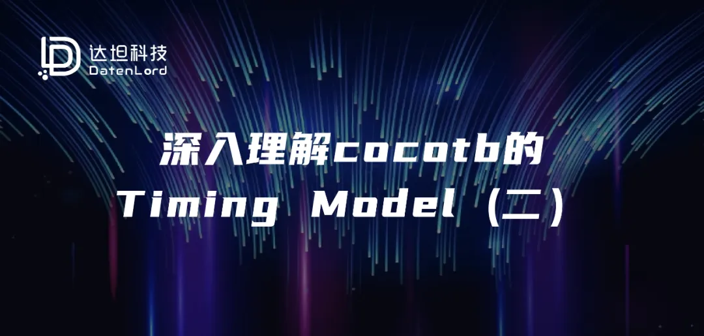
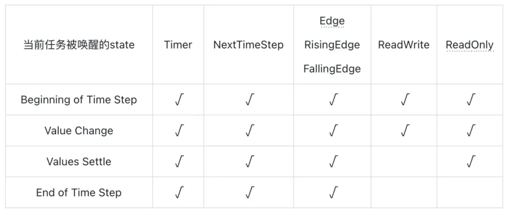

## 写在前面
达坦科技即将开源的100G RDMA RTL代码采用cocotb对其功能进行验证。因此，本文预先介绍一些cocotb验证框架相关的内容，希望以此抛砖引玉，引起大家对基于cocotb的敏捷验证的相关讨论交流。


关于Cocotb的话题，会有一系列文章进行讨论，本篇是此系列的第二篇，欢迎大家关注达坦科技公众号，第一时间阅读最新文章。


书接上文，本文将会介绍各种Trigger是如何帮助Python程序的编写者在不同的state之间进行变换；解答本文开篇提出的两个问题；以及讨论目前Cocotb v1.x版本中API机制存在的一些缺陷，以及在Cocotb 2.x版本中会进行的改进。

## Trigger与Delta Cycle State之间的转换
在Cocotb中提供了若干与仿真器相关的Trigger，首先，在此介绍一下所有Trigger的共同点，即Trigger的作用是帮助用户将当前任务的时间跳转到未来的某一个时间点。这里有几个需要注意的细节：

Trigger本质上就是在两级调度器中注册一个未来将会执行的回调函数，随后让当前Python任务进入休眠状态。等到仿真器执行到对应的时间点后，会对Cocotb的仿真框架发起回调，随后Cocotb的调度器会转换到不同的state，并恢复Python任务的执行。

不是Trigger推进了仿真器时间向前执行，而是仿真器向前执行后，在对应的时间点重新唤醒Trigger所在的任务。

Trigger只能跳转到未来的时间，不可以向前跳转。

Trigger只会让当前任务暂停，并在未来恢复执行。系统中通常存在多个任务并发执行，不同任务通过各自的Trigger来控制自己的执行进度。


接下来介绍一下不同Trigger各自的区别。最重要的区别是不同的Trigger会让Python任务在不同的state中被恢复执行，具体的区别如下：


Timer

- 帮助用户实现跳转到未来任意时间点的功能，并且让任务在未来指定step的Beginning of Time Step状态下唤醒。


NextTimeStep

- 类似Timer的作用，只不过跳转到的时间点是当前step的下一个step，同样的，也是让任务在下一个step的Beginning of Time Step状态下唤醒。


Edge / RisingEdge / FallingEdge

- 帮助用户跳转到某个信号下一次变化的时间点。用户任务会在Value Change状态下被唤醒。


ReadWrite

- 帮助用户的代码跳转到对应的Values Settle状态。此处可以理解为跳转到距离当前状态最近的下一个Values Settle状态。换而言之，就是让时间跳转到当前delta cycle的结束状态。


ReadOnly

- 帮助用户的代码跳转到当前step的End of Time Step状态。在这个状态中，用户可以看到当前step结束前最终稳定的信号状态。注意，在这个state中，仿真时间还没有向后推进，也就是说仿真时间仍然还处于当前step


## 不同Trigger在使用上的约束
Timer

- 该触发器只能用于在step之间进行跳转，而不能在更细粒度的state之间进行跳转。

- 不建议使用Timer(0)这样的写法，由于历史遗留问题，在旧版本的Cocotb中这个写法是允许的，但在当前本本中会产生Warning。


NextTimeStep

- 下一个step有可能是不存在的，这将会导致一个Python任务永远等待。用户需要自己保证一定会有下一个step出现。


Edge / RisingEdge / FallingEdge

- 跳转到的时间点，可以是在当前step的另一个delta cycle中，也可能是在其它的step中，甚至永远不会发生，所以用户同样需要确保该Trigger是否还会被触发。

- 在一个永远不会变化的信号上使用此类Trigger会导致未定义的行为。


ReadWrite

- 在该状态中又等待一个新的ReadWrite触发器，会导致未定义的行为。在当前版本的Cocotb中，这会导致未定义的行为，而在Cocotb 2.x版本中，将会变为Exception。


ReadOnly

- 在该状态中又等待一个新的ReadWrite或ReadOnly触发器，会导致未定义的行为。在当前版本的Cocotb中，这会导致未定义的行为，而在Cocotb 2.x版本中，将会变为Exception。


上面介绍了不同Trigger的一些约束，下面列出的表格则总结了不同state中可以使用的Trigger类型。即当一个Python任务在不同的state中被唤醒时，它可以等待的下一个Trigger类型是有限制的。具体表格如下：



## 当前API所存在的问题
通过上面的介绍，可以看到对于ReadWrite和ReadOnly两个Trigger的使用是存在条件限制的，如果在程序代码中不知道当前任务是在哪个state上下文中被唤醒的，则贸然使用这两个Trigger将会导致问题。


通常情况下，如果是写一个流水账式的Python脚本，则所有的await some_trigger逻辑从上至下依次排列，似乎并不会引入什么问题，因为脚本的编写者可以清楚的知道上一个Trigger是什么，从而知道当前恢复执行的state是哪一个。


不过，当需要编写较为复杂的验证框架时，可能会希望将某些功能封装为函数，然后在多个不同的地方进行调用，此时就会遇到麻烦，因为在函数内部的代码无法感知到这个函数是在哪个state中被调用的。在Cocotb 1.x的代码中，没有相关的API可以获得当前的state是什么。


这个问题，目前已经被Cocotb社区所注意到，并且在尚未正式发布的2.x版本中做出了调整。相关的进展可以跟踪参考资料[2]和[3]中相关的进展。

## 关于上一篇文章中问题的解答
上一篇文章中，第一个问题是关于ReadWrite、ReadOnly两个触发器作用的，相信读者在阅读完本文后，已经对此有了完整的理解，所以接下来我们主要解决前一篇文章提出的第二个问题。为了方便阅读，在这里把问题重复一遍：


问题2:假设有如下的一个DUT，是一个非常简单的寄存器实现：

````
timescale 1us/1us
module dff (input logic clk, d, output logic q);
    always @(posedge clk) begin
        q <= d;
    end
endmodule
````

然后用如下的cocotb代码来对其进行测试：
````
@cocotb.test()
async def dff_simple_test(dut):
    dut.d.value = 0              # 设置初始值，防止出现x值
    await RisingEdge(dut.clk)    # 等到下一个时钟沿，确保q端输出是 0

    dut.d.value = 1              # 在当前时钟周期将输入d设置为 1
    await RisingEdge(dut.clk)    # 等到下一个时钟沿
    assert dut.q.value == 1      # 期待在新的一拍中，q端的值应该为 1， 但是...
````

按照我们对寄存器行为正常的建模来说，第8行的断言应该成立，但实际上，此处读到的q端输出值依然是0，这是为什么呢？


现在，经过上述文章的介绍，可以知道在上述Python代码的第7行，使用await RisingEdge(dut.clk)进行等待后，第8行代码会在一个新的step的第一个Value Change状态下执行，而在这个状态中，clk信号的值已经变为了1，但verilog代码中的q <= d语句所引入的写操作还处于被搁置的状态，需要等到下一个Value Settle状态才会被真是写入。


通过之前的介绍，读者应该已经知道可以把state推进到Value Settle状态的Trigger是ReadWrite，所以修复上面代码的方式应该是在Python脚本的第7行和第8行之间插入一条await ReadWrite()语句，从而使assert dut.q.value == 1这条语句在Value Settle状态下执行。


本篇文章至此结束，在Cocotb系列的下一篇文章中，将会介绍如何使用Cocotb来搭建一个对接Bluespec代码的测试框架。达坦科技的开源RDMA AI网络加速卡方案，使用Bluespec作为开发语言。对达坦科技开源RDMA AI加速卡感兴趣，希望参与到其社区开发或二次定制开发的同学，可以继续关注本系列文章，了解Cocotb在该开源项目中的应用。


参考资料

[1]https://github.com/cocotb/cocotb/wiki/Timing-Model

[2]https://github.com/cocotb/cocotb/issues/4259

[3]https://github.com/cocotb/cocotb/issues/4268

