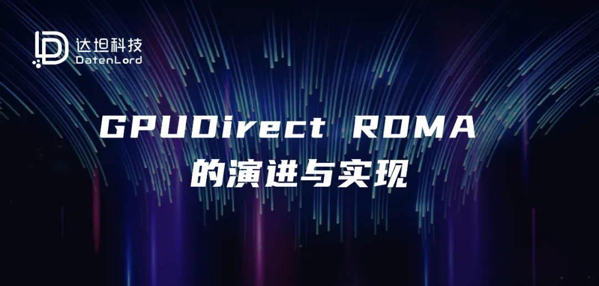
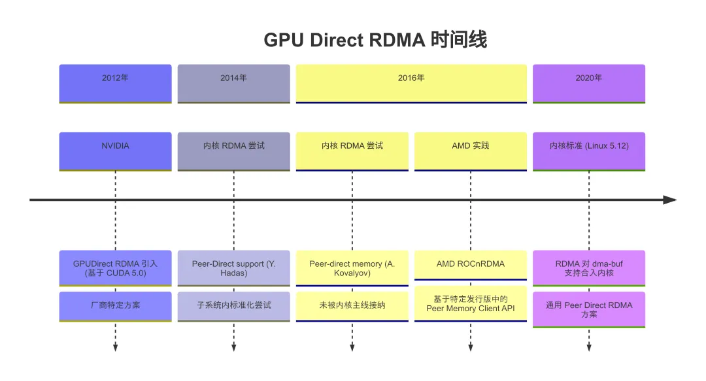
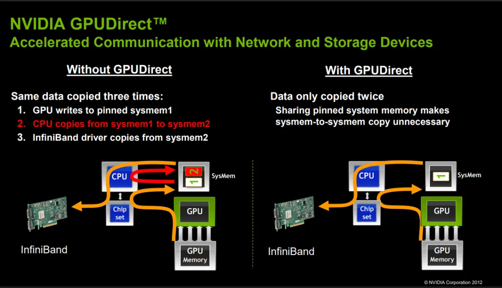
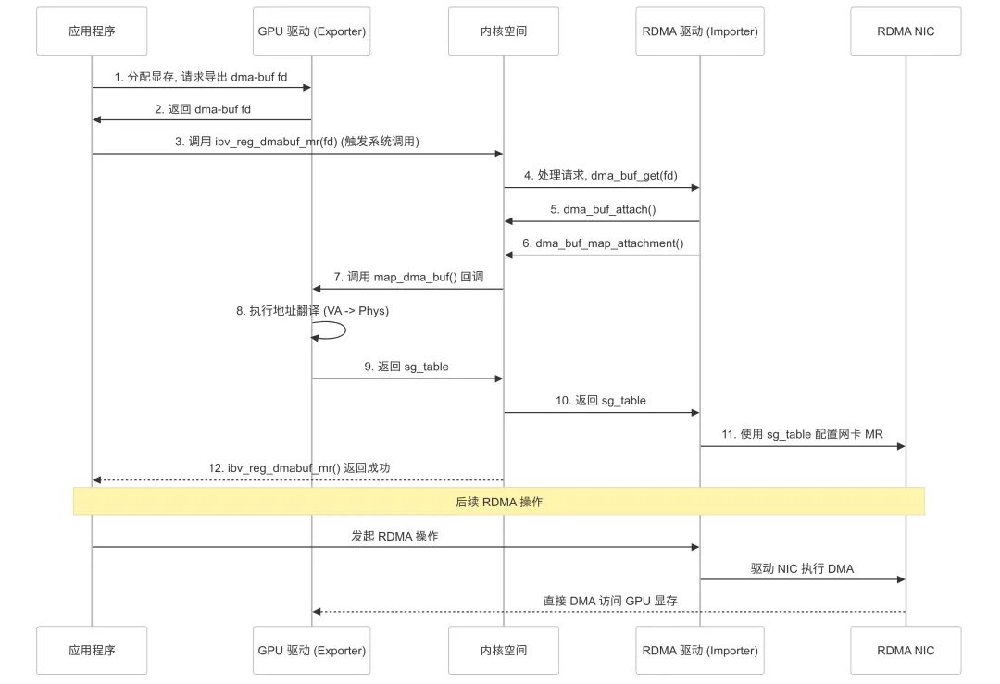

## 引言
随着高性能计算、人工智能和机器学习等领域的飞速发展，GPU 已然成为关键的计算加速器。这些应用通常涉及处理海量数据集，数据需要在网络节点之间高效传输，而在节点的内部网卡和 GPU 显存之间也需要高效的数据传输。在传统的架构中，数据从网络到达网卡后，通常需要先传输到主机 CPU 控制的系统内存(RAM)当中，然后再由 CPU 调度传输到 GPU 显存中进行计算；反之，计算结果从 GPU 传回网络也需要经过系统内存的中转。这种数据路径涉及到多次内存拷贝以及 CPU 的深度参与，导致了显著的延迟增加、有效带宽降低以及 CPU 资源的浪费，成为系统性能的主要瓶颈。


远程直接内存访问(Remote Direct Memory Access, RDMA)是一种先进的网络通信技术，它允许网卡绕过主机的 CPU 和操作系统内核，直接在本地应用程序内存与远程应用程序内存之间传输数据。通过硬件卸载数据传输协议（如 InfiniBand 或 RoCE - RDMA over Converged Ethernet），RDMA 显著降低了通信延迟、提高了网络带宽利用率，并减少了主机的 CPU 负载，这使其成为高性能计算领域不可或缺的技术。


不过 RDMA 技术主要设计用于访问系统内存(RAM). 当 RDMA 网卡准备进行数据传输时，操作的内存缓冲区（通常由应用程序指定）需要被注册和固定(pinning)在物理内存中，并且其对应的物理地址列表会被提供给 RDMA 网卡中的 DMA 引擎，从而使得 RDMA 网卡可以用这些物理地址来直接读写内存。


然而，对于位于独立 PCIe 设备上的内存，情况则更为复杂。以 GPU 为例，GPU 拥有自己独立的内存空间（显存）和地址管理机制，其物理地址对主机系统或标准 RDMA 网卡中的 DMA 引擎来说并非是直接可见或可访问的。因此即便系统配备了 RDMA 网卡，想要通过标准 RDMA 流程将网络数据传输到 GPU 时，仍旧需要先通过 RDMA 传输到主机系统内存，再由 CPU 协调，通过 PCIe 总线在系统内存和 GPU 显存之间进行显式拷贝。反之亦然。


这种涉及 CPU 协调和额外内存拷贝的数据路径(RDMA 网卡 <-> 系统内存 <-> GPU 显存)，即使在使用了 RDMA 技术优化网络传输部分之后，依然会引入显著的延迟、限制了端到端的有效带宽，成为 GPU 加速应用中的一个关键性能瓶颈。


为了解决这一数据传输效率低下的问题，实现网络与 GPU 之间真正的高速、低延迟直连通道，GPUDirect RDMA 技术应运而生。该技术的核心目标是使 RDMA 网卡能够直接、安全地访问本地或远程 GPU 的显存，完全绕过主机 CPU 和系统内存。通过建立这样一个直接的数据通路，GPUDirect RDMA 能够最大程度地发挥 RDMA 网卡和 GPU 并行计算的潜力，极大地减少数据移动开销，提升整体应用的性能。


接下来本文将依据时间线的顺序，介绍 GPUDirect RDMA 技术的演进与发展。



## GPUDirect RDMA 的诞生

在认识到 CPU 中转和内存拷贝是 GPU 加速计算的主要性能障碍后，作为 GPU 技术的领导者，NVIDIA 公司率先着手解决这一问题。为了充分发挥其 GPU 在高性能计算和数据密集型应用中的潜力，NVIDIA 启动了 GPUDirect[^1] 技术项目，旨在优化 GPU 与系统中其他设备（包括其他 GPU 或 I/O 设备）之间的数据传输路径。


GPUDirect 技术经历了一个演进过程。早期版本的 GPUDirect 主要关注同一主机内部多个 GPU 之间的直接内存访问，或是 GPU 与其他 PCIe 设备（如视频采集卡）之间的通信，允许数据在这些设备的内存间传输时，在某些情况下能够绕过系统内存，但数据流的启动和管理通常仍需 CPU 介入。然而，对于越来越重要的网络 I/O 场景，尤其是与 RDMA 网络的结合，这种优化还不够彻底。



在早期版本的 GPUDirect[^2]当中，数据依然需要在 RDMA 网卡和 GPU 显存之间经由系统内存进行中转（如图右侧所示）。认识到这一局限性后，NVIDIA 进一步发展了该技术，推出了 GPUDirect RDMA[^3]，伴随着 CUDA Toolkit 5.0 及后续版本的发布而逐渐成熟。


GPUDirect RDMA 的核心目标是：使用 PCI Express 的标准特性，为 GPU 与第三方对等设备（如 RDMA 网卡）之间的数据交换提供一条直接路径，从而彻底消除数据传输路径中对主机 CPU 和系统内存的依赖。


为了实现这一目标，关键在于让 RDMA 网卡的 DMA 引擎能够理解并访问 GPU 的物理内存地址，因为 GPU 拥有独立的内存管理单元和地址空间。NVIDIA 的解决方案核心在于其 GPU 驱动程序与 RDMA 驱动程序之间的紧密协作。这一协作机制的实现细节也体现在应用程序的使用方式上：


1. 应用程序层面分配与注册：开发者首先使用 CUDA API（如 cudaMalloc()）在 GPU 上分配所需的显存缓冲区。随后，在进行 RDMA 操作准备时，调用标准的 RDMA 内存注册函数（例如 ibv_reg_mr()），直接将 cudaMalloc 返回的 GPU 设备指针传递给该函数。


在深入探讨驱动如何处理这个 GPU 指针之前，理解它与普通 CPU 可访问的虚拟地址指针的根本不同至关重要。


cudaMalloc() 返回的指针是一个 GPU 设备虚拟地址，它仅在 GPU 的上下文中有效。CPU 不能直接解引用这个指针来读写数据。下面的代码片段阐明了这一点：

````
#include <cuda_runtime.h>
#include <stdio.h>
#include <stdlib.h>
int main() {
    float *gpu_ptr = NULL, *cpu_ptr = NULL;
    // 在 GPU 和 CPU 上各分配一块内存
    cudaMalloc(&gpu_ptr, sizeof(float));
    cpu_ptr = (float*)malloc(sizeof(float));
    printf("GPU 指针 (设备虚拟地址): %p\n", (void*)gpu_ptr);
    printf("CPU 指针 (主机虚拟地址): %p\n", (void*)cpu_ptr);
    // CPU 可以直接访问 cpu_ptr 指向的内存:
    *cpu_ptr = 1.0f; // OK
    // CPU 不能直接访问 gpu_ptr 指向的内存:
    // *gpu_ptr = 2.0f; // 非法地址访问，段错误 (SEGFAULT)
    cudaFree(gpu_ptr);
    free(cpu_ptr);
    return 0;
}
````

型，但它们指向完全不同的内存地址空间。CPU 代码不能像操作 cpu_ptr 那样直接操作 gpu_ptr 指向的内存。因此，当应用程序将 gpu_ptr 传递给 ibv_reg_mr() 时，底层的 RDMA 驱动程序也不能简单地将这个地址视为普通的 CPU 虚拟地址来进行地址翻译。


2. 驱动层协作与地址翻译：当支持 GPUDirect RDMA 的 RDMA 驱动程序（在 ibv_reg_mr() 调用内部）接收到这个 GPU 设备指针(gpu_ptr)，它并不能直接通过查询页表来获取相应的一组物理地址。此时，RDMA 驱动会触发与 NVIDIA GPU 驱动的交互。NVIDIA GPU 驱动程序为此暴露了一套特定的内部接口（如 nvidia_p2p_get_pages）。RDMA 驱动通过调用此接口，向 NVIDIA 驱动查询该 GPU 虚拟地址段所对应的底层物理页面信息（即一组物理地址或总线地址）。NVIDIA 驱动负责执行其内部复杂的地址转换（GPU VA -> GPU PA/Bus Address）并将结果返回给 RDMA 驱动。


3. 配置 RDMA 网卡以进行直接访问：获取到 GPU 显存的物理地址列表后，RDMA 驱动程序使用这些信息来创建 RDMA 内存区域（Memory Region, MR），并将这些物理地址信息编程到 RDMA 网卡的 DMA 引擎和地址转换相关寄存器中。这样，RDMA 网卡就具备了直接访问这块 GPU 物理内存的能力。


4. 应用程序进行 RDMA 操作：一旦 ibv_reg_mr() 成功返回有效的 MR 句柄，应用程序就可以像操作普通系统内存一样，使用此 MR 发起 RDMA 读/写/发送/接收操作（如 ibv_post_send(), ibv_post_recv()）。得益于之前的准备工作，此时 RDMA 网卡根据之前得到的物理地址信息，能够通过 PCIe 直接访问 GPU 显存执行数据传输，完全绕过主机 CPU 和系统内存。


通过这种驱动层面的深度整合和地址转换机制，NVIDIA GPUDirect RDMA 成功打通了 RDMA 网卡与 GPU 显存之间的直接数据通道。这显著降低了端到端通信延迟，提高了有效传输带宽，减轻了 CPU 的负担，为大规模分布式 GPU 计算、AI 训练和需要密集数据交换的应用场景带来了显著的性能提升。


然而，需要注意的是，NVIDIA 的初始 GPUDirect RDMA 实现是厂商特定的。它强依赖于 NVIDIA 的 GPU、NVIDIA 的驱动程序以及支持该机制的特定 RDMA 驱动程序（主要是 Mellanox 网卡）。这种紧耦合的方式虽然高效，但也限制了其通用性，并促使 Linux 内核社区开始探索更标准化的 P2P DMA 解决方案。

## 内核标准化 P2P 内存访问的探索：Peer Memory Client

NVIDIA GPUDirect RDMA 的成功证明了 P2P DMA 技术在提升性能方面的巨大潜力，但也凸显了其厂商特定实现的局限性。这种依赖特定硬件和闭源驱动的模式，与 Linux 内核推崇开放、通用和标准化的理念相悖。


在这个背景下，内核社区进行了早期的标准化尝试，目标是让不同厂商的设备（如不同品牌的 GPU 和 RDMA 网卡）能够以一种统一的方式进行 P2P 数据传输。


其中一个较早且具体的标准化尝试源自内核 RDMA 子系统内部。Mellanox 的开发者提出了一些基于 Peer Memory Client API 的提案，比如 Peer-Direct support[^4] 和 Peer-direct memory[^5].


这些提案的核心思想是：


1. 建立一个注册机制：管理 P2P 可访问内存的设备驱动（如 GPU 驱动）可以通过 ib_core 提供的 ib_register_peer_memory_client API，将自身注册成为一个 Peer Memory Client。


2. 提供地址翻译回调: 这些 Peer Memory Client 的实现需要提供一组回调函数。其中一个关键的回调函数 get_pages, 使得 RDMA 驱动在需要访问对等内存（如 GPU 显存）时，能将传入的设备虚拟地址翻译成为该地址对应的、可供 RDMA 网卡 DMA 使用的物理地址列表。


这些提案旨在 RDMA 框架内解决 P2P 内存注册的核心问题：地址翻译。这种设计直接解决了在 ibv_reg_mr 流程中处理非系统内存的痛点，对 RDMA 开发者来说是很友好的。


然而，这套在 RDMA 子系统 ib_core 内部提供 Peer Memory Client API 的方案却最终未能合并到 Linux 内核主线，最主要的原因在于其缺乏通用性。P2P DMA 的需求并不仅限于 RDMA，图形（DRM）、视频（V4L2）、存储等其他子系统同样存在设备间直接内存共享的需求。将 P2P DMA 解决方案深度绑定在 ib_core 中不仅使得该机制难以被其他子系统复用，也被认为是在系统架构中放置在了错误的层次——P2P 内存管理更像是一个底层的驱动模型或内存管理问题，而非特定 I/O 子系统的内部事务。

## AMD 的实践：基于 Peer Memory Client 的 ROCnRDMA

上一节提到，Linux 内核主线最终拒绝了在 RDMA 子系统 ib_core 内实现的 Peer Memory Client API.  然而，这并未消除 GPU 与 RDMA 网卡间高效 P2P 通信的强烈需求。更为关键的是，尽管未能成为内核标准，这套 API 框架实际上已通过特定的 RDMA 发行版（例如某些 OFED 版本）得以应用，使其在实践中是可用的。


为了给 ROCm (Radeon Open Compute platform) 计算平台提供类似 NVIDIA GPUDirect RDMA 的功能，以便在高性能计算场景下与 RDMA 网络高效配合。AMD 基于这套 Peer Memory Client API 实现了 ROCnRDMA[^6] (后来合入 ROCK 项目[^7] 并集成在 amdkfd 驱动中的 P2P 支持当中)。通过实现 Peer Memory Client 接口，AMD 的软件栈能够与 RDMA 子系统对接，使得 RDMA 子系统能够查询并获取 GPU 显存的物理地址信息，进而用以配置 RDMA 网卡进行直接 DMA 操作。


其实现机制与应用程序的使用方式紧密结合，可以分解为以下几个关键步骤：


1. 应用程序层面分配与注册（类似 NVIDIA）：开发者首先使用 ROCm 的内存分配 API，通常是 hipMalloc()（HIP 是 AMD 提供的类似 CUDA 的编程接口），在 AMD GPU 上分配所需的显存缓冲区。与 NVIDIA 平台类似，关键步骤在于随后调用标准的 RDMA 内存注册函数（如 ibv_reg_mr()）时，直接将 hipMalloc() 返回的 GPU 设备指针传递给该函数。需要明确的是，这个 GPU 设备指针同样指向 GPU 的独立虚拟地址空间，CPU 不能直接访问，也无法通过标准的内核内存管理机制（如 get_user_pages）进行翻译。


2. ib_core 识别并调用 Peer Memory Client：当 RDMA 核心层 (ib_core) 在 ibv_reg_mr() 流程中接收到这个来自 AMD GPU 的指针时，它会检查是否有已注册的 Peer Memory Client 能处理此地址。由 ROCnRDMA 提供的模块会注册一个 Peer Memory Client，这样 ib_core 会调用模块提供的 Peer Memory Client API 回调函数，例如 acquire 和 get_pages 来取得一组物理地址。


3. 配置 RDMA 网卡以进行直接访问：ib_core 随后将这些物理地址信息传递给底层的 RDMA 网卡驱动（例如 mlx5）。RDMA 网卡驱动使用这些 GPU 物理地址来创建内存区域 (MR) 并配置网卡硬件的 DMA 引擎，使其能够直接定位到正确的 GPU 显存位置。


4. 应用程序进行 RDMA 操作：一旦 ibv_reg_mr() 成功返回，表明内存注册和网卡配置完成。此时，应用程序就可以使用返回的 MR 句柄发起 RDMA 读/写操作。RDMA 网卡将根据预设的物理地址，直接通过 PCIe 总线访问 AMD GPU 显存，完成数据传输，无需 CPU 和系统内存的介入。


通过这种方式，AMD 的 ROCnRDMA 通过实现 Peer Memory Client API，使得 RDMA 子系统能够与 AMD GPU 驱动协作，成功打通了 P2P 数据通路，为 AMD 平台带来了重要的性能提升。ROCnRDMA 的实践不仅证明了 Peer Memory Client 设计思想的可行性，也体现了该 API 设计的一个显著优点：它将处理对等内存的复杂性主要封装在了 Peer Memory Client 实现和提供内存的设备驱动（如 GPU 驱动）中。对于底层的 RDMA 网卡驱动而言，它们主要与 ib_core 交互，处理的是标准的物理地址列表，无需为每种新的对等设备类型进行大量适配。这种对硬件驱动的透明性是 Peer Memory Client API 的一个重要设计目标。

## 内核的选择：基于 dma-buf 的 P2P DMA

经过对 Peer Memory Client 等特定子系统内方案的探索和讨论，Linux 内核社区最终将目光投向了一个已有的、更为通用的框架——dma-buf[^8]，将其作为实现 RDMA 网卡和设备（包括 GPU）之间 P2P DMA的标准机制。这份提案[^9]最终在 Linux 5.12 版本加入[^10].


DMA-BUF 简介

dma-buf 机制本身并非为 RDMA P2P DMA 而生，它在 Linux 3.3 版本中被引入，旨在提供一个通用的、基于文件描述符（File Descriptor, fd）的框架，用于在不同的设备驱动程序之间高效共享内存缓冲区，避免不必要的数据拷贝。它最初广泛应用于图形和多媒体，例如在 GPU、显示控制器、摄像头和视频编解码器之间共享帧数据。


其核心工作模式基于“导出器”（Exporter）和“导入器”（Importer）：


- 导出器 (Exporter)：拥有内存缓冲区的设备驱动（如 GPU 驱动）可以将这块内存导出为一个 dma-buf 对象，并生成一个用户空间可见的文件描述符(fd)作为句柄。导出器需要实现一套 dma_buf_ops 回调函数。


- 导入器 (Importer)：需要访问该缓冲区的另一个设备驱动（如 RDMA 网卡驱动）可以通过这个 fd 导入该 dma-buf对象，并调用导出器实现的 dma_buf_ops 来操作缓冲区。


- 关键操作 (map_dma_buf): dma_buf_ops 中最关键的操作之一是 map_dma_buf。当导入器调用它时，导出器负责提供将该缓冲区映射到导入器设备地址空间所需的信息，通常是以 struct sg_table（包含物理地址或总线地址列表）的形式。


为何选择 dma-buf 用于 RDMA P2P DMA？

在经历了 Peer Memory Client 等特定子系统方案的探索后，dma-buf 最终脱颖而出，成为内核 RDMA P2P 的标准化方案。这主要得益于其自身的诸多优势，完美契合了 P2P DMA 的需求。


1. 真正的通用性与标准化: dma-buf 是独立于特定子系统的内核标准框架，已被 GPU、多媒体等多个驱动广泛采用。将其用于 RDMA P2P 符合内核寻求通用解决方案的理念，避免了 Peer Memory Client 方案绑定 ib_core 的问题。


2. 无需 struct page 依赖: dma-buf通过 map_dma_buf 操作允许导出器直接提供 sg_table，无需依赖与普通系统内存关联的 struct page结构。


3. 用户空间友好: 基于 fd 的接口便于用户空间应用程序管理和传递缓冲区句柄。


4. 解耦与灵活性: RDMA 驱动与 GPU 驱动通过标准接口交互，降低耦合度。dma_buf_ops提供了足够的灵活性，允许导出器根据其内存特性实现具体逻辑。


基于dma-buf实现 GPUDirect RDMA 的流程

内核合入的 dma-buf 支持方案为 RDMA 子系统增加了作为导入器的能力。其典型工作流程如下：



1. GPU 端导出: 应用程序使用 GPU 厂商提供的 API（如 CUDA 中 cuMemAlloc()、ROCm 中 hipMalloc()）分配 GPU 显存，并调用相应的 API（例如 CUDA 中的 cuMemGetHandleForAddressRange() 或 ROCm 中的 hsa_amd_portable_export_dmabuf()）将这块显存导出为一个 dma-buf 文件描述符 fd。底层的 GPU 驱动负责创建 dma-buf 对象并实现相应的 dma_buf_ops。


2. 用户空间传递 dma-buf fd: 应用程序通过 RDMA 用户库提供的新接口ibv_reg_dmabuf_mr()将获取到的dma-buf fd传递给内核。


3. 内核 RDMA 驱动处理 dma-buf fd: 用户库接口会通过系统调用触发内核中 RDMA 驱动实现的 reg_user_mr_dmabuf ，并将 dmabuf_fd 传递进去。


4. 内核 RDMA 驱动映射:

- RDMA 驱动接收到 dma-buf fd，调用 dma_buf_get() 将其转换为内核 struct dma_buf *。

- 调用 dma_buf_attach() 将设备 attach 到 dma-buf。

- 调用 dma_buf_map_attachment()。这个调用会触发导出器（GPU 驱动）实现的 map_dma_buf 回调函数。

- GPU 驱动在其 map_dma_buf 实现中，执行内部的地址翻译（GPU VA -> 物理/总线地址），并将结果以 struct sg_table 的形式返回给 RDMA 驱动。

- RDMA 驱动使用这个 sg_table 来创建内存区域 (MR) 并配置 RDMA 网卡的 DMA 引擎。


5. 执行 P2P RDMA 操作: MR 创建成功后，应用程序即可使用此 MR 发起 RDMA 操作，网卡将直接访问 GPU 显存。


总而言之，dma-buf 为 Linux 内核中的 GPUDirect RDMA 提供了一条标准化的实现路径。它通过通用的缓冲区共享机制，使得不同厂商的 GPU 和 RDMA 网卡能够以统一的方式协同工作，实现了绕过 CPU 和系统内存的直接数据传输。

## 总结
本文深入探讨了 GPUDirect RDMA 技术的演进历程，从其诞生的背景到当前主流的实现方式。我们始于高性能计算与人工智能领域对高效数据传输的迫切需求，阐述了传统 CPU 中转路径（网卡 <-> 系统内存 <-> GPU 显存）所带来的性能瓶颈，进而引出了 GPUDirect RDMA 作为核心解决方案的必要性——即实现 RDMA 网卡与 GPU 显存之间的直接数据访问，彻底绕过主机 CPU 与系统内存。


我们回顾了这一技术的早期发展。NVIDIA 作为先行者，通过其 GPUDirect RDMA 技术率先实现了这一目标。其方案依赖于 NVIDIA GPU 驱动与 RDMA 驱动（特别是 Mellanox OFED）的紧密协作，通过私有的内部接口（如 nvidia_p2p_get_pages）来完成从 CUDA 分配的 GPU 虚拟地址到物理地址的翻译，使得用户可以直接将 GPU 指针传递给 ibv_reg_mr 等 RDMA API。虽然高效，但其厂商特定的性质限制了通用性。


随后，我们考察了 Linux 内核社区为寻求标准化 P2P DMA 解决方案所做的努力。早期的 Peer Memory Client 提案试图在 RDMA 子系统 (ib_core) 内部建立一个通用接口，允许 GPU 等设备驱动注册并提供地址翻译回调（如 get_pages）。AMD 的 ROCnRDMA 实践则是一个基于类似 Peer Memory Client API（在特定 RDMA 发行版中存在）的实现，通过一个适配层连接 ib_core 与其底层 GPU 驱动，验证了该设计思想的可行性，同时也体现了其对非标准 API 的依赖。然而，这些局限于 RDMA 子系统的方案因缺乏足够的通用性而未能被内核主线接纳。


最终，内核社区选择了基于已有的、通用的 dma-buf 框架作为标准化的 P2P DMA 解决方案。dma-buf 利用文件描述符在驱动间共享缓冲区，并通过 dma_buf_ops（特别是 map_dma_buf 回调）允许导出方（GPU 驱动）向导入方（RDMA 驱动）提供物理地址列表 (sg_table)。我们详细描述了基于 dma-buf 的 GPUDirect RDMA 工作流程：从 GPU 导出 dma-buf fd，用户空间传递 dma-buf fd，到 RDMA 驱动导入、映射并最终配置网卡。dma-buf 的标准化、通用性和解耦性是其核心优势。


贯穿整个技术演进的核心挑战始终如一：如何安全、高效地将应用程序层面使用的 GPU 虚拟地址，转换为一组 RDMA 网卡 DMA 引擎能够理解并直接使用的物理地址（或总线地址）。无论是 NVIDIA 的私有接口、Peer Memory Client 的回调机制，还是 dma-buf 的 map_dma_buf 操作，本质上都是在解决这一关键的地址翻译问题。


GPUDirect RDMA 技术是现代加速计算系统不可或缺的一环。它通过消除不必要的数据拷贝和 CPU 干预，极大地降低了通信延迟，提升了有效带宽，使得 GPU 集群能够更高效地协同处理大规模数据密集型任务。随着 P2P 技术的不断发展和优化，以及更多硬件和驱动对 dma-buf 等标准化接口的完善支持，我们可以期待未来在异构计算系统中实现更加无缝、高效的设备间直接通信。


参考链接

[^1]: https://developer.nvidia.com/gpudirect

[^2]: https://developer.download.nvidia.com/devzone/devcenter/cuda/docs/GPUDirect_Technology_Overview.pdf

[^3]: https://docs.nvidia.com/cuda/gpudirect-rdma/index.html

[^4]: https://lore.kernel.org/all/1414065777-21173-1-git-send-email-yishaih@mellanox.com/

[^5]: https://lore.kernel.org/all/1455207177-11949-1-git-send-email-artemyko@mellanox.com/

[^6]: https://github.com/rocmarchive/ROCnRDMA

[^7]: https://github.com/ROCm/ROCK-Kernel-Driver/blob/master/drivers/gpu/drm/amd/amdkfd/kfd_peerdirect.c

[^8]: https://docs.kernel.org/driver-api/dma-buf.html

[^9]: https://lore.kernel.org/linux-rdma/1608067636-98073-1-git-send-email-jianxin.xiong@intel.com/

[^10]: https://kernelnewbies.org/Linux_5.12#:~:text=RDMA%3A%20Add%20dma%2Dbuf%20support

