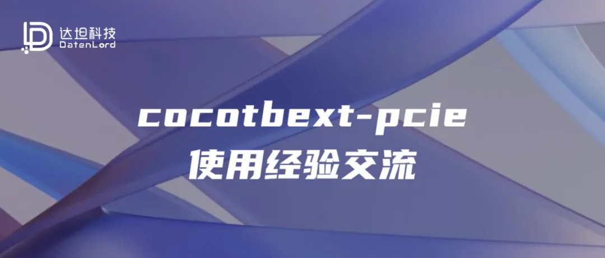

## 写在前面
达坦科技即将开源的100G RDMA RTL代码采用cocotb对其功能进行验证。其中，对于DMA引擎的验证工作使用了开源的cocotbext-pcie框架来进行验证。本文将简要介绍cocotbext-pcie的使用方式，以及在使用中遇到的问题。


对于目前遇到的一些问题，由于需要对cocotbext-pcie本身进行修改，达坦科技计划在暑期安排一系列夏令营活动，邀请在校生加入对cocotbext-pcie的完善工作，具体活动信息将在近期公布。


关于cocotb的话题，会有一系列文章进行讨论，本篇是此系列的第三篇，欢迎大家关注达坦科技公众号，第一时间阅读最新文章。

## cocotbext-pcie项目的介绍
cocotbext-pcie是Alex Forencich基于cocotb开发的一套PCIe仿真框架，其原型诞生于Alex Forencic的另一个知名开源网卡项目corundum，由于corundum中大量使用了PCIe接口进行数据传输，为了对相关功能进行仿真，Alex基于ccootb编写了一套仿真环境，这便是cocotbext-pcie的前身。后来，相关的测试框架代码从corundum的代码库中独立出来，成为了现在的cocotbext-pcie项目。


由于该项目中对PCIe的链路层通信过程进行了非常细致的建模，对于刚接触PCIe协议的初学者而言，在阅读PCIe标准spec的同时，如果能够对照着该项目的Python代码进行对照学习，对于加深对协议的理解会有非常大的帮助。为了帮助读者快速熟悉并阅读项目的代码，下面来介绍一下该项目的代码结构，如下所示。

````
cocotbext
└── pcie
    ├── core
    │   ├── bridge.py
    │   ├── caps
    │   │   ├── aer.py
    │   │   ├── common.py
    │   │   ├── __init__.py
    │   │   ├── msi.py
    │   │   ├── pcie.py
    │   │   ├── pm.py
    │   ├── device.py
    │   ├── dllp.py
    │   ├── endpoint.py
    │   ├── function.py
    │   ├── __init__.py
    │   ├── msi.py
    │   ├── pci.py
    │   ├── port.py
    │   ├── rc.py
    │   ├── region.py
    │   ├── switch.py
    │   ├── tlp.py
    │   ├── utils.py
    │   └── version.py
    ├── intel
    │   ├── ptile
    │   │   ├── __init__.py
    │   │   ├── interface.py
    │   │   └── ptile_model.py
    │   └── s10
    └── xilinx
        └── us
````

从代码的组织结构来看，该项目的代码结构非常清晰易懂，其中core目录为仿真框架的主体部分，而另外的两个目录分别是intel和xilinx两家公司FPGA PCIe IP核的仿真模型。


仿真框架核心

通过仔细观察core目录，可以看到其中包含了用于构建整个PCIe仿真环境的各个组件，通过这些组件，可以非常方便的搭建起一个从RootComplex到FPGA上硬核之间的完整PCIe数据链路，可以支持PCIe设备的上电枚举、Bar空间地址分配、基于Credit机制的流量控制、数据读写请求等等功能的仿真。可以看到，该目录下的文件均与PCIe标准中所定义的内容对应，与具体厂商的硬核实现无关。


下面介绍各几个比较重要的文件：

tlp.py：该文件中定义了TLP的数据格式，以及对TLP的各种操作方法。其中定义的Tlp类是用于连接各个厂商具体PCIe硬核模型的重要桥梁。阅读其代码有助于理解TLP数据包的组装与解析。

region.py：该文件中实现了对一段内存地址的建模，通过该文件所提供的接口，开发者可以模拟PCIe系统中对main memoey的各种操作。

rc.py：该文件提供了对RootComplex的仿真模型，实现了诸如设备枚举等功能的仿真。该模块在实例化的过程中有非常多的初始化参数可以配置，为了了解这些参数的作用，阅读该文件的实现是一个很好的途径。在编写测试脚本的过程中，需要实例化一个RootComplex对象，并将一个特定厂商的Device实现连接到RootComplex上。

dllp.py：该文件描述了DLLP相关的功能，阅读该文件对理解PCIe协议中基于credit的流控机制有很好的帮助。

function.py：该文件中定义的Function类型是众多其他类型的基类，实现了对于PCIe设备配置空间的行为建模，阅读该文件有助于理解PCIe设备配置空间的相关内容。


厂商器件支持

再来看另外两个目录，以intel/ptile目录为例，这是对于Intel的PTile硬核所建立的仿真模型。其中interface.py里面定义了与user logic之间的接口，而ptile_model.py里面则定义了PTile硬核的行为，该文件的重要功能之一就是将上文中tlp.py中所定义的抽象TLP数据结构转换为厂商私有的格式，再通过interface.py与用户编写的DUT模块相连接。


可以看到，目前项目中支持的PCIe硬核只有Intel和Xilinx两家公司的产品，而且型号仅限于4条产品线。达坦科技的400G RDMA网卡方案使用了Intel的RTile硬核来提供PCIe Gen5接口，而目前cocotbext-pcie内置的模型仅支持到PTile，为此，达坦科技尝试为其编写了RTile的器件适配代码；受限于篇幅，将在另一篇文章中展开介绍如何实现对新器件的适配。对于感兴趣的同学，可以先阅读仍处于开发测试阶段的开源代码，待验证稳定后会向上游发起合并：

https://github.com/myrfy001/cocotbext-pcie

## cocotbext-pcie的简单使用方式

通常，基于该框架开发的测试脚本，需要包括以下准备工作：

实例化一个RootComplex对象，作为主机侧的控制入口；实例化一个特定厂商的PCIe硬核模型对象，提供与DUT对接的接口。

配置内存地址相关的参数，对于RootComplex对象而言，需要为其主备一块用于模拟main memory的内存区域，对于厂商PCIe硬核而言，需要为其配置好BAR地址区间。

将DUT的接口与PCIe硬核模型接口进行对接。

将PCIe硬核对象与RootComplex对象连接，并启动enumerate过程。

通过BDF查找到需要操作的device，并对其进行下一步操作


经过上述步骤后，就已经准备好了测试前的基础工作了。接下来可以进行两方面的测试工作：

对BAR内存地址范围内的数据进行读写，模拟CPU侧向device侧发起request，检查device的response。

从device直接发起DMA请求，对main memory进行读写操作，然后检查main memory的值是否符合预期。


基于上述流程，给出如下一段示例代码，展示基本的使用步骤：

````
from cocotbext.pcie.core import RootComplex
from cocotbext.pcie.xilinx.us import UltraScalePlusPcieDevice
from cocotbext.axi import AxiStreamBus

# 实例化RootComplex实例
rc = RootComplex()
rc.max_payload_size = 1
rc.max_read_request_size = 2

# 实例化某厂商的PCIe硬核模型
dev_model = UltraScalePlusPcieDevice(
    # 将dut与PCIe硬核模型通过AXI总线进行连接
    rq_bus=AxiStreamBus.from_prefix(dut, "m_axis_rq"),
    rc_bus=AxiStreamBus.from_prefix(dut, "s_axis_rc"),
    cq_bus=AxiStreamBus.from_prefix(dut, "s_axis_cq"),
    cc_bus=AxiStreamBus.from_prefix(dut, "m_axis_cc"),
    # 省略若干参数...
)

# 在RootComplex侧模拟出一块大小为2MB的Main Memory
main_mem = rc.mem_pool.alloc_region(2*1024*1024)

# 为硬核模型的function 0添加两个BAR地址空间
dev_model.functions[0].configure_bar(0, 16*1024*1024)
dev_model.functions[0].configure_bar(1, 16*1024)

# 连接设备和RootComplex(模拟把卡插到PCIe插槽上)
root_port = rc.make_port()
root_port.connect(dev_model)

# 执行PCIe的枚举过程，由于枚举过程涉及到实际的TLP传输，会推进仿真时间，需要await
await tb.rc.enumerate()

# 通过BDF找到要操作的具体的device，注意这里的device和上面的PCIe硬核模型是不一样的
dev = rc.find_device(dev_model.functions[0].pcie_id)

# 对设备进行配置，需要await
await dev.enable_device()
await dev.set_master()

# 环境初始化完成，下面进行实际的功能验证。
# 下列代码演示了一个通过写入CSR启动DMA传输的例子，展示了如何仿真CPU发起BAR空间访问和设备发起DMA访问。

# 初始化main memory
main_mem[0] = 0xab
main_mem[1] = 0x00

# 获取设备BAR的handle，模拟host侧对device BAR的访问
dev_bar1 = dev.bar_window[1]
# 向BAR空间地址0x100的位置写入Dword数字1，触发硬件DMA传输
await dev_bar1.write(0x100, (1).to_bytes(4, byteorder='little', signed=False))

# 等待DMA传输完成
await Timer(5000, "ns")

# 检查DMA引擎是否工作正常
assert main_mem[1] == 0xab
````

## 目前cocotbext-pcie所存在的一些缺陷
虽然该开源项目为PCIe相关的应用提供了一个简单易用的仿真验证手段，但由于该开源项目脱胎于开源网卡项目，其仿真模型主要覆盖了实现一个普通网卡设备所需要的PCIe功能，故而对PCIe规范中的功能支持并不是完整的，使用过程中仍有一些坑需要避免。以下是达坦科技在使用过程中遇到的一些问题：

不支持原子操作类型，无法用于验证原子操作的正确性。

不支持TLP中AT字段非零的情况。

无法模拟RootComplex侧的访存延迟。

支持的PCIe硬核模型种类较少。

## 达坦科技的开源夏令营计划

针对上述存在的问题，达坦科技希望召集对cocotb验证框架感兴趣的同学，利用暑假实践，参与到达坦科技的开源夏令营活动中，为cocotbext-pcie完善功能，回馈开源社区，同时获取达坦的奖金和实习机会。活动详情会在近期公布，欢迎大家关注达坦科技的微信公众号以获取最新消息。
