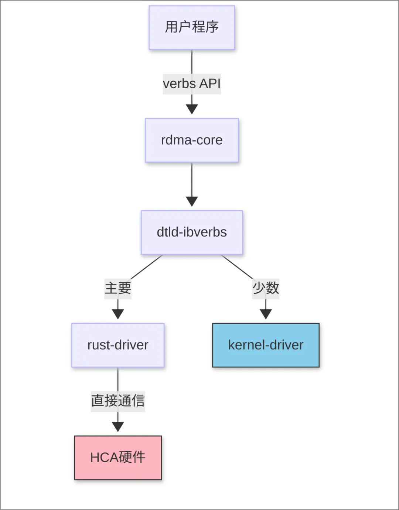

blue-rdma是一个新的RDMA实现。本期内容将主要对 blue-rdma 的软硬件架构及其实现细节进行深入介绍。

## Table of Contents
1. blue-rdma设计思想
2. blue-rdma详细架构
3. blue-rdma硬件组成

    a. 四种环形缓冲区

    b. Send Queue

    c. Meta Report Queue

    d. Cmd Queue

    e. Simple Nic Tx/Rx Queue

4. blue-rdma驱动结构
5. 内存管理

    a. 虚拟地址到物理地址转换

    b. 环形缓冲区内存

    c. 硬件Page Table管理

6. 请求拆分
7. 错误处理系统

    a. 数据包状态追踪

    b. 超时重传

8. 兼容层实现

    a. Queue Pair实现

    b. Completion实现

9. 总结
10. 关于作者
11. 之后的内容

## blue-rdma设计思想
在上篇文章中，我们已就 blue-rdma 的大致架构及其与传统 InfiniBand 的区别进行了概述。简而言之，blue-rdma 的一个显著特点是其主要驱动功能在用户态实现，仅将繁重的数据包处理卸载到硬件，减轻CPU的负担，同时简化硬件的实现。这一设计理念在下图所示的架构方案中得到了直观体现：

## blue-rdma详细架构
blue-rdma 的架构可自上而下划分为几个关键层次：

用户程序

blue-rdma 自定义ibverbs(dtld-ibverbs)

blue-rdma 用户态驱动(rust-driver)

blue-rdma 内核驱动

其中， dtld-ibverbs 实现了 rdma-core 中的 verbs API 接口。其工作机制是利用动态加载（ dlopen ）的方式，将用户程序中的 verbs 调用路由至 rust-driver 进行处理。值得注意的是，对于少数无法路由至用户态的函数（例如 query_gid ），则会转由 blue-rdma 内核驱动负责处理。blue-rdma 的主要逻辑大部分在用户态的 rust-driver 中得以实现。 rust-driver 直接负责与硬件进行沟通，执行配置和数据传输等关键操作。这种设计选择，一部分原因在于 blue-rdma 当前的应用场景通常不涉及多租户共享，而是倾向于单个进程独占使用一张网卡。这一架构的概览，可参考下图所示：

## blue-rdma硬件组成
在深入探讨软件部分之前，本节会首先对 blue-rdma 的硬件架构和核心组件进行介绍。blue-rdma 的硬件设计相对简洁，其主要职责在于处理正常路径上的数据包。复杂的错误处理和用户逻辑则被卸载到用户态驱动进行处理。本节将主要关注硬件面向用户态驱动的逻辑接口，硬件实现的具体细节则暂不作过多阐述。

四种环形缓冲区

blue-rdma 硬件内部配置了四种关键的环形缓冲区，它们分别是：

Send Queue

Meta Report Queue

Cmd Queue

Simple Nic Tx/Rx Queue

这些缓冲区构成了用户态驱动与硬件直接通信的基础。在系统初始化阶段，用户态驱动会申请一片连续的物理内存区域，并通过 BAR 空间将这些缓冲区的物理地址信息写入硬件。

Send Queue

Send Queue 的主要功能是供驱动向硬件提交 RDMA 请求描述符（WQE）。这些描述符包含了若干关键信息，例如：

包相关的元数据，例如是否为 First/Last 包。

具体的操作类型，例如 RDMA Write/Send/Read Response 等。

相关的 QP（Queue Pair）信息。

本地数据源的地址、长度及权限。

目标写入地址、长度及权限。

一旦描述符提交至硬件，硬件便会通过 DMA 读取源地址的数据，并将其拆分为 PMTU（Path MTU）大小的数据包，随后发送至目的 QP。

Meta Report Queue

Meta Report Queue 的作用是硬件向驱动上报数据包相关信息。这些信息主要包括两种类型：

First/Last/Only 包的包头信息。

Ack/Nak（确认/否定确认）信息。

驱动能够根据这些信息判读是否需要进行错误处理和重传。

Cmd Queue

Cmd Queue 位于控制路径上，其主要职能是驱动向硬件下发各类配置参数，具体包括：

硬件参数配置。

QP 配置。

MR（Memory Region）配置。

Simple Nic Tx/Rx Queue

Simple Nic Tx/Rx Queue 专用于原始以太网包的收发。驱动能够构造以太网帧，并通过 Simple Nic Tx Queue 发出。由于是原始以太网包，发送端硬件不会对其进行任何额外处理。而在接收端，硬件会对以太网包进行分类，主要区分为两类：

属于 blue-rdma 协议的包，这些包用户态驱动和硬件均可发送，例如 Ack/Nak 包。

普通以太网包，这类包仅可由用户态驱动发出，接收端的 Simple Nic Rx Queue 中可以收到对应的包。

目前，Simple Nic 主要用于驱动发送 Ack/Nak 信息。未来，其处理普通以太网包的能力将被用于扩展更多的功能。

## blue-rdma驱动结构
在对以上硬件功能有所了解之后，我们可以进一步探究 blue-rdma 用户态驱动的具体实现方式。

blue-rdma 用户态驱动主要涵盖以下几个核心功能：

配置管理： 负责处理用户的各类配置操作，例如 QP、MR 的配置等。

请求发送： 负责将用户提交的请求进行拆分，并构建和提交 WQE（Work Queue Entry）到硬件（通过 Send Queue 环形缓冲区）。

错误处理： 驱动需要依赖硬件上报的元信息，精细地追踪每个消息的发送和接收状态。在操作完成后，它会对上层应用进行必要的通知；而当出现异常情况时，驱动会主动进行错误处理和数据包重传。

RDMA 操作转换： 考虑到 blue-rdma 原生仅支持 RDMA Write 操作，因此需要实现对 RDMA Send/Recv/Read 等其他操作的转换，使其也能通过 Write 操作实现。

鉴于 blue-rdma 在设计上与 InfiniBand 存在根本性的差异，blue-rdma 用户态驱动需要为 ibverbs 实现了一个兼容层。因此对用户而言，所提供的接口在使用上是透明的，无需关注底层实现机制的差异。

## 内存管理
对于运行在用户空间的驱动而言，物理内存管理无疑是一个的挑战。本节将深入探讨 blue-rdma 用户态驱动是如何申请和管理物理内存空间的。

虚拟地址到物理地址转换

在用户空间，通常情况下是无法直接获取虚拟地址对应的物理地址的。那么，blue-rdma 是如何解决这个问题的呢？实际上，Linux 提供了一种有效的方法—— pagemap 机制。通过 pagemap 文件，Linux 会为每个分配的页面维护一个 entry，每个 entry 中都详细记录了该页面对应的物理地址等重要信息，从而实现了用户态对物理地址的查询。

环形缓冲区内存

为了设置一个环形缓冲区，核心要求是申请一片连续的物理内存区域，并将其物理地址配置到硬件。一个直观的思路是使用 mmap 来申请一个页面的内存，因为单个页面内的物理地址一定是连续的，随后再利用 pagemap 将页面的起始虚拟地址转换为物理地址。然而，这一想法存在一个潜在问题：缓存一致性。mmap 分配的内存通常会被操作系统缓存，而 blue-rdma 硬件直接通过 DMA 进行环形缓冲区读写，绕过了 CPU 缓存，这可能导致驱动和硬件之间出现缓存不一致的情况。鉴于 Linux 似乎未提供可靠的显式刷新缓存的方法，blue-rdma 采用了u-dma-buf内核模块来分配内存。该内核模块利用 dma_alloc_coherent 内核 API 分配缓存一致的内存，并将其暴露给用户空间，有效解决了缓存一致性问题。

硬件Page Table管理

由于 RDMA 硬件在执行 DMA 操作时必须使用物理地址，因此当用户注册 MR（Memory Region）时，需要填充 blue-rdma 硬件的页表。blue-rdma 的页表采用二级索引结构：一级页表通过 lkey/rkey 进行索引，二级页表则通过内存地址进行索引。

驱动在此处需要实现以下关键功能：

将虚拟地址转换为物理地址。

“Pin 住” MR 内存，防止其被换出到磁盘，确保DMA操作的连续性。

填充页表，并通过描述符将其下发给硬件。

当硬件接收到一个 RDMA Write 请求时，它会根据页表项将目的地址的虚拟地址转换为对应的物理地址，随后通过 DMA 完成数据写入。Page Table 的结构如下图所示：

## 请求拆分
blue-rdma 用户态驱动具备请求拆分的功能，这是其高效传输的关键之一。在上一期内容中，我们曾简要提及 blue-rdma 会将一个完整的 RDMA 请求拆分为多个块（chunks），随后再下发给硬件。这个拆分过程相对直接：只要知道整个请求的起始地址和总长度，驱动就能够计算出每个 chunk 的起始地址和长度，并为每个 chunk 计算出其起始的 PSN（packet sequence number）。针对每个 chunk，驱动会构建单独的描述符并提交到环形缓冲区。通过这种设计，blue-rdma 避免了频繁提交描述符导致的 PCIe 带宽占用，同时也避免了过大的拆包操作增加硬件的复杂度。一旦硬件接收到 chunk 大小的描述符，它会进一步将其拆分为 MTU（Maximum Transmission Unit）大小的数据包，并发送到网络上。

## 错误处理系统
接下来我们将详细阐述 blue-rdma的错误处理逻辑。错误处理逻辑属于blue-rdma最核心的设计之一，由于blue-rdma硬件复杂度的限制，CPU需要深度参与整个错误流程（用户态驱动）。blue-rdma将大多数数据包处理卸载到硬件，仅在检测到错误时通知到驱动由CPU介入处理，这是由于在大量数据传输的场景下，CPU 对数据包的处理能力往往难以达到期望的速率。因此，blue-rdma需要找到一种方法平衡硬件卸载与硬件复杂度之间的矛盾。

数据包状态追踪

blue-rdma 为每个 Send Queue (SQ) 独立维护一个 PSN（Packet Sequence Number）序列，每次发出数据包时，PSN 的值都会递增。接收端硬件在收到一个数据包后，会标记当前包对应的 PSN 值。然而，由于硬件资源有限，对于较大的消息，它无法记录所有数据包的状态。为此，blue-rdma 硬件为每个 Receive Queue (RQ) 维护了一个 bitmap 窗口。当收到一个 PSN 时，相应位即被置为 1。硬件会定期或在检测到丢包的情况下，通过 Meta Report Queue 将此 bitmap 窗口上报给驱动。在驱动层面，由于没有严格的内存限制，可以根据硬件上报的 bitmap，维护一个全局的收包信息，从而精确判断一个消息是否已完整接收。同时，在发生丢包或超时的情况下，驱动能够及时启动重传机制。

硬件上报的 bitmap 信息主要分为两种：

Ack (确认)： 表示没有丢包，并包含一个 bitmap 窗口。通常情况下，硬件在收到一个 Last 包后，就会上报一个 Ack 信息，驱动随即会将这个 bitmap 合并到自身的全局状态中。

Nak (否定确认)： 表示发生了丢包，包含当前窗口和滑动前的窗口状态。如果硬件发现滑动前的窗口中包含未接收的位，便会判定发生了丢包，并将 Nak 信息发送至消息的发送端。发送端驱动在接收到 Nak 信息后，会针对性地重传那些尚未被接收的包。

对于驱动而言，当一个消息需要产生回复（ ack_req 为 true）时，同样会在以下情况上报 Ack 信息：如果接收端驱动认为消息已完整接收，它便会构造一个 Ack 包发送回发送端硬件，表明消息已成功接收。这会在发送端硬件立即触发一个完成事件。

超时重传

blue-rdma 在超时重传机制上遵循与 InfiniBand 类似的原理。由于在 RC（Reliable Connection）传输模式下，所有的消息都是按顺序发送和到达的，因此 blue-rdma 对每个 SQ 仅维护一个计时器。每当发送一个需要产生回复（即 ack_req 为 true）的消息时，即会启动此计时器。当整个消息收到 Ack 后，计时器便会被重置。如果计时器超时，系统会立刻启动对尚未收到 Ack 的包的重传流程。这样集中式管理计时器设计，简化了软硬件状态管理并且节省了资源占用。

## 兼容层实现
blue-rdma 与 InfiniBand 在设计上存在本质的区别。接下来，我们将探讨 blue-rdma 在 Queue Pair (QP) 和 Completion Queue (CQ) 实现上的异同，并详细解释 blue-rdma 是如何实现与标准 verbs API 的兼容性的。

Queue Pair实现

在 InfiniBand 的 Queue Pair 实现中，HCA 上维护着多个 QP，且这些 QP 的上下文均由硬件直接管理。blue-rdma 则秉持硬件尽量无状态的原则，HCA 仅负责记录少量的必要状态（例如地址信息），而 QP 的大部分上下文信息则储存在驱动中，并由 blue-rdma 驱动进行维护。这种设计消除了与硬件之间额外的环形缓冲区通信需求，并且易于通过单个环形缓冲区实现多路复用机制。因此，对于用户程序调用的 ibv_create_qp/ibv_modify_qp/ibv_destroy_qp/ibv_query_qp 等函数，大部分操作直接在软件层即可完成修改和查询，硬件仅需要记录必要的更新用于数据包的发送。

Completion实现

在 InfiniBand 的 Completion 实现中，HCA 同样负责直接生成 Completion Queue Entry (CQE) 并将其写入 Host Memory，因为所有的消息完成状态都由硬件完成并报告。然而，在 blue-rdma 的设计中，消息的完成状态是由驱动负责维护的。因此，CQE 直接由驱动生成，并被放置到相应的队列中。当用户程序调用 ibv_poll_cq 时，它便会从该队列中取出对应的 CQE。

## 总结
本文深入剖析了 blue-rdma 的软硬件架构与实现细节。从其以用户态驱动为主导的设计思想，到具体的硬件环形缓冲区、内存管理、请求拆分以及错误处理系统，我们探讨了 blue-rdma 如何在保证高性能的同时，通过协议设计来应对硬件复杂度限制。 在之后的文章中，我们会涉及到blue-rdma的性能有关分析和调优等内容，有兴趣的读者可以继续关注之后的文章。

## 关于作者
作者是达坦科技的RDMA软件工程师，目前负责blue-rdma驱动的开发和维护工作。欢迎通过Github(@bsbds)与我交流。
