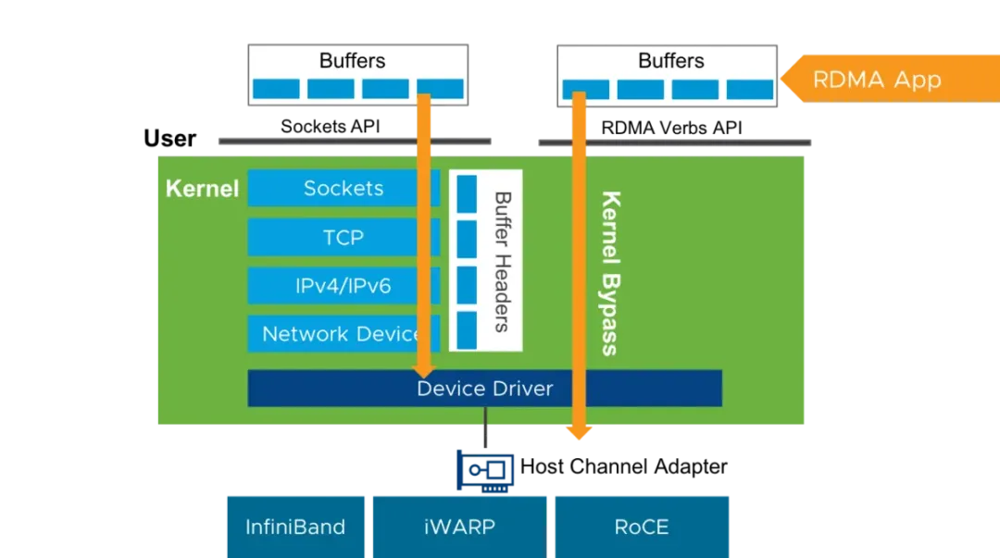

## 导论
在当今数据以前所未有的速度和规模产生、传输和处理的时代，系统性能的每一个环节都面临着极致的考验。从高性能计算集群到大规模分布式存储，从实时金融交易到低延迟的云服务，对高效数据交换的需求日益迫切。然而，传统的网络通信方式，尽管成熟稳定，其固有的处理开销和多次数据拷贝，在这些追求极致性能的场景下，往往成为难以逾越的瓶颈。


1.1 什么是 RDMA？为什么需要它？

RDMA (Remote Direct Memory Access) 是一种允许一台计算机的内存直接被另一台计算机访问的技术，整个过程无需两端操作系统的CPU介入，也无需经过复杂的网络协议栈处理。应用程序可以直接将数据从本地内存写入到远程服务器的内存中，或者从远程服务器内存读取数据到本地，让 CPU 专注于核心的计算任务。



为什么需要 RDMA？

传统网络通信（如基于 TCP/IP 的 Socket 编程）通常涉及以下步骤：

数据拷贝： 数据从用户空间缓冲区拷贝到内核空间缓冲区。

协议处理： 内核协议栈（TCP/IP）对数据进行分段、添加头部、计算校验和等操作。

再次拷贝： 数据从内核空间缓冲区拷贝到网络接口卡 (NIC) 的缓冲区。

接收端进行类似的反向操作。


这些步骤，尤其是多次数据拷贝和CPU密集的协议处理，带来了显著的延迟 (Latency)和CPU 开销 (CPU Overhead)，并可能限制吞吐量 (Throughput)。


RDMA 通过以下关键特性解决了这些问题：

内核旁路 (Kernel Bypass): 用户空间应用程序可以直接向 RDMA 网卡 (称为 HCA - Host Channel Adapter) 提交工作请求，数据传输路径绕过了内核网络协议栈。

零拷贝 (Zero-Copy): 数据可以直接从应用程序的内存发送到远程应用程序的内存，避免了中间的多次内存拷贝。

CPU卸载 (CPU Offload): 许多数据传输的控制逻辑，包括连接管理、可靠性保证、数据校验等，都由HCA硬件来完成，从而将 CPU 资源释放给应用程序。


这些特性共同赋予了RDMA无与伦比的性能优势：

极低的延迟： 通常可以达到微秒级，远低于传统网络的毫秒级。

极高的吞吐量： 能够充分利用现代高速网络链路的带宽（如100Gbps、200Gbps甚至更高）。

显著降低的CPU使用率： 使得CPU能够更高效地执行计算密集型任务。


凭借这些优势，RDMA技术已广泛应用于众多领域：

高性能计算 (HPC)： 作为集群节点间消息传递接口 (MPI) 的高速通道。

大语言模型 (LLMs)： 在大规模 GPU 集群中，RDMA (如 GPUDirect RDMA) 用于高效地在不同节点的 GPU 显存之间直接传输海量训练数据和模型参数，显著缩短模型训练时间，是支撑千亿甚至万亿参数大模型训练的关键网络技术。"

分布式存储系统： 例如NVMe-oF (NVMe over Fabrics)、Ceph、Lustre等，用于实现存储节点间的高效数据共享和访问。

分布式数据库与内存缓存： 加速数据同步、复制和远程查询。

虚拟化与云计算： 提升虚拟机之间的网络I/O性能和存储访问速度。


1.2 Linux 中的 RDMA 支持：内核子系统与 rdma-core

Linux 内核提供了对 RDMA 技术的强大且成熟的支持，主要通过其 RDMA 子系统实现。这个子系统是内核的一部分，为各种 RDMA 硬件（如 InfiniBand HCAs, RoCE NICs, iWARP NICs）提供了一个统一的、硬件无关的编程接口。


Linux RDMA 架构主要包含：

内核 RDMA 子系统 :

核心模块 (ib_core)： 提供核心的数据结构、API 实现和设备管理框架。

硬件驱动 (Hardware Drivers)： 针对特定 HCA 硬件的驱动程序（例如 mlx5_core for Mellanox, i40iw for Intel iWARP）。这些驱动实现了 Verbs API 中与硬件相关的部分，并向核心层注册其设备。

用户空间接口 (ib_uverbs)： 提供了一个字符设备接口（通常是 /dev/infiniband/uverbsX），允许用户空间应用程序或者 rdma-core 库通过 ioctl 调用来访问内核 RDMA 资源和执行操作。

连接管理模块 (e.g., ib_cm, rdma_cm)： 帮助建立和管理 RDMA 连接。


rdma-core 用户空间包:

这是一个重要的用户空间软件包，提供了与内核 RDMA 子系统交互所需的库和工具。

libibverbs：最核心的用户空间库，它封装了通过 uverbs 接口与内核驱动通信的细节，为应用程序提供了标准的 Verbs API。

Provider 库 (e.g., libmlx5.so, librxe.so)： 这些是 libibverbs 根据检测到的硬件动态加载的库，它们包含了针对特定硬件或软件 provider 的特定逻辑，用于将通用的 libibverbs 调用转换为特定于该 provider 的 uverbs 命令。

librdmacm：一个用户空间库，用于简化 RDMA 连接的建立和管理。

实用工具： 如 ibv_devices (列出可用的 RDMA 设备), ibv_devinfo (显示设备属性) 等。


应用程序通常链接 libibverbs 和 librdmacm，通过这些库间接与内核中的 RDMA 驱动进行交互。


1.3 本系列目标：从零开始编写一个最简单的 RDMA 内核驱动

本系列的目标是带领读者踏上一段实践之旅：从零开始编写一个基础的、功能极简的 RDMA 内核驱动程序，并将其成功接入到用户空间的 rdma-core生态系统中。这意味着，当我们的驱动加载后，用户空间工具（如 ibv_devices）应该能够识别出我们“虚拟”的 RDMA 设备，并且我们能够通过 libibverbs 尝试与这个设备进行最基本的交互。


在libibverbs的基础上，我们甚至可以通过操作系统提供的接口，在用户态实现 RDMA 的主要驱动功能。


我们将不会涉及实际的硬件控制，而是专注于：

理解 Linux 内核模块开发的基础。

学习 Linux RDMA 子系统的核心架构和关键数据结构。

掌握如何实现一个最小化的 ib_device，让内核 RDMA 子系统能够识别我们的驱动。

了解如何暴露必要的 uverbs 接口，以便 rdma-core 中的 libibverbs 能够与我们的驱动通信。


通过这个循序渐进的过程，希望读者能学习到 RDMA 驱动开发的基本流程，也能深入理解 Linux 内核与用户空间 RDMA 组件是如何协同工作的。这对于希望深入研究 RDMA、调试现有 RDMA 问题，或者为新型 RDMA 硬件/协议开发驱动的工程师来说，将是一个宝贵的起点。


1.4 读者前提

为了更好地跟上本系列的步伐，建议读者具备以下基础：

C 语言编程经验： 内核模块主要使用 C 语言编写。

基本的 Linux 命令行操作： 包括编译程序、加载/卸载内核模块等。

(建议) 对操作系统基本概念的理解： 如内核空间与用户空间、系统调用、设备驱动程序等。

(可选) 内核模块开发经验： 如果你之前接触过内核模块开发，那会很有帮助，但不是强制性的，我们会从一个简单的 "Hello, World!" 内核模块开始。


你不需要预先具备 RDMA 知识，本系列会逐步介绍相关的概念。


## 环境配置 (Environment Setup)
进行 Linux 内核模块开发，尤其是涉及 RDMA 这样复杂子系统的模块，一个稳定且隔离的开发环境至关重要。直接在主力工作机器上进行内核开发存在使系统不稳定的风险。因此，强烈推荐使用虚拟机 (VM) 进行开发与测试。本章将通过 QEMU/KVM 和 Ubuntu Cloud Image，快速创建一个预配置的 Linux 虚拟机，专门用于 RDMA 内核驱动开发。


本章核心步骤：

在宿主机上安装必要的虚拟化软件包。

下载 Ubuntu Cloud Image 并创建差分镜像。

使用 cloud-init 准备用户数据和元数据以自动化虚拟机配置。

通过 QEMU 命令行启动和配置虚拟机。

在虚拟机内部署开发工具、内核头文件、额外的内核模块 (包含 ib_uverbs) 及 rdma-core。


2.1 宿主机：安装虚拟化及管理工具

首先，在您的 Linux 宿主机上安装 QEMU、KVM 以及用于生成 cloud-init 数据源的工具。


2.1.1 安装软件包

对于基于 Debian/Ubuntu 的宿主机：

````
sudo apt update
sudo apt install qemu-system qemu-utils cloud-image-utils cpu-checker
````

qemu-system, qemu-utils: QEMU 模拟器和相关工具。

cloud-image-utils: 包含 cloud-localds 工具，用于创建 cloud-init 数据源。

cpu-checker: 包含 kvm-ok 工具。

2.1.2 验证 KVM 可用性

````
kvm-ok
````

期望输出包含 "KVM acceleration can be used"。


2.1.3 (推荐) 将用户添加到 kvm 组

这样可以无需 sudo 运行某些 QEMU 操作。

````
sudo usermod -aG kvm $(whoami)
````

重要提示： 可能需要注销并重新登录或者重新连接ssh，用户组的更改才能生效。


2.2 使用 Cloud Image 和 cloud-init 创建虚拟机

Cloud images 是预装好的轻量级操作系统镜像，通常与 cloud-init 配合使用，可以在首次启动时自动完成用户配置、网络设置、软件包安装等任务。


2.2.1 下载 Ubuntu Cloud Image

这里将使用 Ubuntu 24.04 LTS 的 cloud image 作为示例。可以从官方源下载最新的镜像。

````
# 创建工作目录
mkdir -p ~/rdma_vm_setup && cd ~/rdma_vm_setup
# 下载 cloud image (qcow2 格式)
wget https://cloud-images.ubuntu.com/noble/current/noble-server-cloudimg-amd64.img
````

2.2.2 创建差分磁盘镜像 (Backing File)

为了不直接修改原始的 cloud image（便于复用），我们创建一个基于它的差分镜像。对虚拟机的所有磁盘写入将保存在这个新镜像中。

````
qemu-img create -f qcow2 -F qcow2 -b noble-server-cloudimg-amd64.img my-ubuntu.qcow2 40G
````

-f qcow2: 新镜像的格式。

-F qcow2: 后备镜像 (backing file) 的格式。

-b noble-server-cloudimg-amd64.img: 指定后备镜像。

my-ubuntu.qcow2: 新创建的差分镜像文件名。

40G: 差分镜像的最大可增长大小。


2.2.3 准备 cloud-init 用户数据和元数据

cloud-init 使用 user-data 和 meta-data 文件来配置虚拟机。

meta-data.yaml (元数据):

````
cat > meta-data.yaml <<EOF
instance-id: ubuntu-$(date +%s)
local-hostname: ubuntu-vm
EOF
````

这定义了实例ID和虚拟机在网络中可见的主机名。

user-data.yaml (用户数据):
````
# 如果 ~/.ssh/id_rsa.pub 不存在，请先通过 ssh-keygen 生成
if [ ! -f ~/.ssh/id_rsa.pub ]; then ssh-keygen; fi
cat > user-data.yaml <<EOF
#cloud-config
password: ubuntu # 设置用户密码 (可选)
chpasswd: { expire: False } # 密码永不过期
ssh_pwauth: true # 允许密码认证 (可选，推荐使用公钥认证)
ssh_authorized_keys:
    - $(cat ~/.ssh/id_rsa.pub)
EOF
````

2.2.4 创建 cloud-init 数据源镜像 (seed.img)

````
cloud-localds seed.img user-data.yaml meta-data.yaml
````

这将创建一个名为 seed.img 的小镜像，QEMU 会将其作为 CD-ROM 提供给虚拟机，cloud-init 会从中读取配置。


2.3 使用 QEMU 启动和访问虚拟机

现在，我们可以使用 QEMU 启动配置好的虚拟机。


2.3.1 通过 9P (Plan 9 Filesystem Protocol) 配置共享文件夹

QEMU 支持通过 9P 协议在宿主机和虚拟机之间共享文件夹。这对于在宿主机上编辑代码，然后在虚拟机中编译测试非常方便。

````
# 在宿主机上创建一个用于共享的目录
mkdir -p ~/shared_with_vm
````

2.3.2 启动 QEMU 虚拟机

````
qemu-system-x86_64 \
  -enable-kvm \
  -cpu host \
  -smp $(nproc) \
  -m 4G \
  -drive file=my-ubuntu.qcow2,format=qcow2,if=virtio \
  -drive file=seed.img,format=raw,if=virtio \
  -netdev user,id=net0,hostfwd=tcp::2222-:22 \
  -device virtio-net-pci,netdev=net0 \
  -virtfs local,path=$HOME/shared_with_vm,mount_tag=host_share,security_model=passthrough,id=fsdev0 \
  -device virtio-9p-pci,fsdev=fsdev0,mount_tag=host_share \
  -nographic -serial mon:stdio
````

参数解释：

-enable-kvm: 启用 KVM 硬件加速。

-cpu host: 将宿主机的 CPU 透传给虚拟机，通常能获得更好的性能。

-smp $(nproc): 使用的处理器核心数，这里将宿主机的CPU全部用上。

-m 4G: 分配 4GB 内存给虚拟机。

-drive file=my-ubuntu.qcow2,...: 主磁盘镜像。

-drive file=seed.img,...: cloud-init 数据源镜像，作为 virtio 块设备。

-netdev user,id=net0,hostfwd=tcp::2222-:22: 用户模式网络，宿主机 2222 端口转发到虚拟机 22 端口。

-virtfs ... 和 -device virtio-9p-pci...: 配置 9P 文件共享。宿主机的 ~/shared_with_vm 目录将以 host_share 标签共享给虚拟机。

-nographic -serial mon:stdio: 无图形界面启动，并将串行控制台重定向到标准输入/输出。这允许您直接在启动 QEMU 的终端看到内核启动信息和登录提示。


2.3.3 通过 SSH 访问虚拟机

等待 cloud-init 完成后，由于启动 QEMU 时配置了端口转发 (hostfwd=tcp::2222-:22)，现在可以从宿主机通过 SSH 连接到虚拟机的 22 端口，对应宿主机的 2222 端口。并且 user-data.yaml 中配置了 SSH 公钥，可以从宿主机直接免密登录：
````
# 在宿主机上执行 (注意端口是 2222)
ssh ubuntu@localhost -p 2222
````

通过 SSH 操作通常比直接在 QEMU 窗口中输入更方便，尤其是在复制粘贴命令和代码时。


2.4 虚拟机内部：安装开发环境

成功 SSH 登录到虚拟机后，现在我们手动安装 RDMA 开发所需的软件包。


2.4.1 更新系统并安装基础开发工具

````
sudo apt update
sudo apt install build-essential gcc make git linux-headers-$(uname -r) linux-modules-extra-$(uname -r) rdma-core ibverbs-utils
````

build-essential, gcc, make: C 编译环境。

git: 版本控制工具。

linux-headers-$(uname -r): 当前运行内核的头文件，用于编译内核模块。

linux-modules-extra-$(uname -r): 当前运行内核的缺失的部分内核模块，如ib_uverbs, rdma_rxe.

rdma-core: 包含 libibverbs 和 librdmacm 等核心库。

ibverbs-utils: 提供 ibv_devices, ibv_devinfo 等命令行工具。


2.4.2 验证 RDMA 环境
安装完成后，我们可以加载 SoftRoCE (RXE) 模块来创建一个软件模拟的 RDMA 设备，并用 ibv_devinfo 检查，以确认整个 RDMA 软件栈（内核模块、rdma-core库、工具）都已正确安装。

````
# 获取网卡名称
NETDEV=$(ip -o -4 route show to default | awk '{print $5}')
# 加载 RXE 模块并创建一个 rxe 设备
sudo modprobe rdma_rxe
sudo rdma link add rxe0 type rxe netdev $NETDEV
# 查看设备信息
ibv_devinfo
````

如果一切正常，应该能看到类似下面的输出，表明 RDMA 环境正常。

````
hca_id: rxe0
        transport:                      InfiniBand (0)
        fw_ver:                         0.0.0
        node_guid:                      5054:00ff:fe12:3456
        sys_image_guid:                 5054:00ff:fe12:3456
        vendor_id:                      0xffffff
        vendor_part_id:                 0
        hw_ver:                         0x0
        phys_port_cnt:                  1
                port:   1
                        state:                  PORT_ACTIVE (4)
                        max_mtu:                4096 (5)
                        active_mtu:             1024 (3)
                        sm_lid:                 0
                        port_lid:               0
                        port_lmc:               0x00
                        link_layer:             Ethernet
````

2.4.3 挂载和使用 9P 共享目录

在 QEMU 启动命令中我们已经定义了 9P 共享，现在在虚拟机中挂载它：

````
# 在虚拟机内执行
sudo mkdir -p /mnt/host_share
sudo mount -t 9p -o trans=virtio,version=9p2000.L,rw host_share /mnt/host_share
````

host_share 是在 QEMU 命令中指定的 mount_tag。

现在，宿主机的 ~/shared_with_vm 目录的内容应该可以在虚拟机的 /mnt/host_share 下访问了。


(可选) 设置开机自动挂载：

向虚拟机的 /etc/fstab 文件添加一行：
````
echo 'host_share /mnt/host_share 9p trans=virtio,version=9p2000.L,rw,_netdev,nofail 0 0' | sudo tee -a /etc/fstab
````

_netdev 选项建议在网络可用后再挂载，nofail 选项防止因挂载失败导致启动卡住。


至此，我们已经拥有一个健壮的开发环境，为内核模块和 RDMA 驱动开发做好了准备。在下一章中，我们将迈出第一步，编写一个简单的“Hello, World!”内核模块，以熟悉基本机制。

## Linux 内核模块入门

在我们深入研究 RDMA 驱动的复杂性之前，首先需要理解 Linux 内核模块是什么，以及它们是如何工作的。内核模块是允许我们在不重新编译整个内核的情况下，动态地向运行中的内核添加或移除代码片段的机制。这对于设备驱动程序、文件系统、网络协议等功能的开发和维护至关重要。


3.1 什么是内核模块？为什么使用它们？

Linux 内核模块是指能够独立编译，并在运行时动态加载到内核或从内核卸载的代码单元。 它们允许在不重新启动系统或重新编译内核映像的情况下，扩展内核的功能。当系统需要特定功能时（例如，对新硬件的支持或实现新的文件系统），相应的内核模块可以被加载，其代码和数据结构将成为运行中内核的一部分。功能不再需要时，模块也可以被卸载，释放其占用的系统资源。


内核模块的主要特点和优势：

动态扩展性 : 内核模块最核心的特性是其动态加载和卸载的能力。这使得系统管理员和开发者可以在系统运行时添加、移除或更新内核功能，而无需中断服务。

模块化设计 : 该机制促进了内核设计的模块化。复杂的功能被分解为独立的、功能明确的模块，降低了内核的整体复杂性，使得开发、测试和维护更为高效。每个模块可以专注于其特定领域，例如，一个网络接口卡驱动负责控制该硬件，而不必关心其他子系统的实现细节。

保持内核映像精简 : 由于大量非核心功能（如特定于硬件的驱动程序）可以作为模块存在，核心内核镜像（即 /boot/vmlinuz）可以保持相对较小。仅在实际需要时，才会加载特定功能的模块代码。

独立的开发与分发 : 驱动程序和其他内核功能的开发者可以独立于主线内核的发布周期进行开发和分发他们的模块。用户也可以根据自己的需求选择性地安装和加载模块。

潜在的故障隔离 : 模块化的结构有助于问题的定位。不过由于内核模块运行在内核中，一个有 Bug 的模块仍可能导致系统不稳定甚至崩溃。

常见的内核模块类型：

设备驱动程序： 这是内核模块最主要的用途。几乎所有外部硬件设备（如网络适配器、存储控制器、USB 设备、声卡、显卡等）的控制逻辑都是通过内核模块实现的。本系列旨在开发的虚拟 RDMA 驱动，就属于设备驱动程序的一种。

文件系统模块： Linux 支持多种文件系统（如 ext4, XFS, Btrfs 等），它们中的许多是以内核模块的形式提供的。

网络协议模块： 除了核心的网络协议（如 TCP/IP），其他网络协议通常也可以作为模块实现。


3.2 编写第一个内核模块："Hello, World!"

Linux 内核模块是实现操作系统功能动态扩展、保持内核设计清晰以及简化驱动程序开发和管理的关键机制。对于任何希望深入理解和定制 Linux 内核的开发者而言，熟悉内核模块的开发流程是不可或缺的一环。接下来，我们将通过编写一个标准的 out-of-tree "Hello, World!" 示例，它会在加载时向内核日志打印 "Hello, World!"，并在卸载时打印 "Goodbye, World!"。通过这个例子详细介绍内核模块的编写、编译、加载和卸载过程。


3.2.1 源代码

创建一个名为 hello.c 的文件，内容如下：

````
#include <linux/module.h> // 包含了加载模块所需要的所有头文件
#include <linux/kernel.h> // 包含了内核相关的宏定义，如 KERN_INFO
// 模块加载时调用的函数
static int __init hello_init(void)
{
    // printk 是内核的打印函数，类似于用户空间的 printf
    // KERN_INFO 是日志级别，表示“信息性”消息
    printk(KERN_INFO "Hello, World! from the kernel space.\n");
    return 0; // 返回 0 表示模块加载成功
}
// 模块卸载时调用的函数
static void __exit hello_exit(void)
{
    printk(KERN_INFO "Goodbye, World! from the kernel space.\n");
}
// 注册模块的入口和出口函数
module_init(hello_init);
module_exit(hello_exit);
// 模块许可证声明 (非常重要)
// GPL (GNU General Public License) 是最常见的许可证
// 如果没有正确的许可证，模块无法加载或某些内核函数可能无法使用
MODULE_LICENSE("GPL");
// 可选的模块描述
MODULE_DESCRIPTION("A simple Hello World kernel module");
// 可选的模块作者
MODULE_AUTHOR("Your Name");
````

代码解释：

#include <linux/module.h> ：所有内核模块都必须包含此头文件。它定义了 module_init、module_exit 等宏，以及与模块相关的各种结构和函数。

#include <linux/kernel.h> ：包含了内核常用的函数和宏，例如 printk 及其日志级别（如 KERN_INFO, KERN_ALERT 等）。

hello_init(void)：这是模块的入口函数。当模块被加载到内核时（例如通过 insmod 命令），这个函数会被调用。__init 宏告诉内核这个函数只在初始化时使用，一旦初始化完成，内核可以释放这段代码所占用的内存（如果模块是静态编译进内核的；对于可加载模块，这个标记主要用于优化）。

hello_exit(void)：这是模块的出口函数。当模块从内核中卸载时（例如通过 rmmod 命令），这个函数会被调用。__exit 宏告诉内核这个函数只在模块退出时使用。

module_init(hello_init);：这个宏用于注册 hello_init 函数作为模块的初始化入口点。

module_exit(hello_exit);：这个宏用于注册 hello_exit 函数作为模块的卸载出口点。

printk(KERN_INFO "...");：printk 是内核中用于打印消息的函数。它的用法与用户空间的 printf 类似，但输出到内核日志缓冲区。KERN_INFO 是一个日志级别宏，表示这是一条信息性消息。其他级别还有 KERN_ERR (错误), KERN_WARNING (警告), KERN_DEBUG (调试) 等。

MODULE_LICENSE("GPL");：这是模块的许可证声明。Linux 内核本身是 GPL 许可证的，因此大多数内核模块也使用 GPL 兼容的许可证。这是一个强制性声明，缺少它或者使用不兼容的许可证可能会导致内核在加载模块时发出警告，甚至某些内核符号（函数或变量）可能对非 GPL 模块不可用。

MODULE_DESCRIPTION(...) 和 MODULE_AUTHOR(...)：这些是可选的宏，用于提供模块的描述信息和作者信息。可以使用 modinfo 命令查看这些信息。


3.2.2 Makefile

为了编译内核模块，我们需要一个特殊的 Makefile。它利用内核的构建系统来正确编译模块。在 hello.c 相同的目录下，创建一个名为 Makefile 的文件，内容如下：

````
# obj-m 表示我们要编译一个可加载的模块（module）
# 如果是 obj-y，则表示将代码编译进内核本身（静态链接）
obj-m += hello.o
# KDIR 指向你的内核源码树或已安装的内核头文件目录
# 通常，内核头文件位于 /lib/modules/$(shell uname -r)/build
# $(shell uname -r) 会获取当前正在运行的内核版本
KDIR := /lib/modules/$(shell uname -r)/build
# PWD 表示当前目录
PWD := $(shell pwd)
# 默认目标
all:
        $(MAKE) -C $(KDIR) M=$(PWD) modules
# 清理目标
clean:
        $(MAKE) -C $(KDIR) M=$(PWD) clean
# 可选：安装目标 (通常不需要，我们手动 insmod)
# install:
#        $(MAKE) -C $(KDIR) M=$(PWD) modules_install
````

Makefile 解释：

obj-m += hello.o：这行告诉内核构建系统，我们要将 hello.c 编译成一个名为 hello.ko (.ko 是内核对象文件的扩展名) 的模块。如果你的模块由多个源文件组成（例如 file1.c 和 file2.c 编译成 mymodule.ko），你可以这样写：obj-m += mymodule.o 和 mymodule-objs := file1.o file2.o。

KDIR := /lib/modules/$(shell uname -r)/build：这行指定了内核构建系统所需文件的路径。通常，这是指向你当前运行内核的已编译头文件和构建脚本的符号链接。

all:：执行命令调用内核的构建系统来编译内核模块。

$(MAKE) -C $(KDIR) M=$(PWD) modules：

-C $(KDIR)：指示 make 在执行命令前先切换到 $(KDIR) 目录。内核的顶层 Makefile 在那里。

M=$(PWD)：将变量 M 设置为当前目录的路径。内核构建系统会查找这个目录下的 Makefile 和源文件。

modules：这是传递给内核构建系统的一个目标，指示它编译模块。

clean:：这个目标用于清除编译过程中生成的中间文件和最终的模块文件。


3.2.3 编译、加载、查看输出、卸载

现在，我们可以在包含 hello.c 和 Makefile 的目录中执行以下命令：

1. 编译模块：

在终端中运行 make 命令：

````
make
````

如果一切顺利，你会看到一些编译输出，并且当前目录下会生成一个 hello.ko 文件，以及一些中间文件（如 .o, .mod.c 等）。


2. 加载模块：

使用 insmod 命令加载模块。需要有 root 权限：

````
sudo insmod hello.ko
````

如果没有错误消息，模块应该已经加载到内核中了。


3. 查看内核日志输出：

模块加载时，hello_init 函数中的 printk 会将消息输出到内核日志缓冲区。我们可以使用 dmesg 命令查看这些消息：

````
sudo dmesg -T | tail
````
应该能看到"Hello, World! from the kernel space." 的输出。


4. 查看已加载模块：

使用 lsmod 命令可以列出当前加载到内核中的所有模块。可以用 grep 筛选：

````
lsmod | grep hello
````

应该能看到 hello 模块的信息。


5. 查看模块信息：

使用 modinfo 命令可以查看模块的详细信息，包括我们之前设置的许可证、描述和作者：

````
modinfo hello.ko
````

6. 卸载模块：

使用 rmmod 命令卸载模块。同样需要 root 权限：

````
sudo rmmod hello
````

注意，rmmod 后面跟的是模块名（通常是 .ko 文件去掉扩展名），而不是文件名。


7. 再次查看内核日志输出：

模块卸载时，hello_exit 函数中的 printk 也会输出消息：

````
sudo dmesg -T | tail
````

应该能看到类似 "Goodbye, World! from the kernel space." 的输出。

恭喜！你已经成功编写、编译、加载和卸载了你的第一个 Linux 内核模块。


3.3 内核模块基本要素

除了 module_init 和 module_exit，内核模块还有一些其他重要的组成部分：

MODULE_LICENSE()：如前所述，这是必需的，用于声明模块的许可证。常见的有 "GPL", "GPL v2","Dual MIT/GPL", "Dual BSD/GPL" 等。内核非常看重许可证，某些核心功能（导出符号）只对 GPL 兼容模块开放。

MODULE_AUTHOR()：声明模块的作者。

MODULE_DESCRIPTION()：提供模块的简短描述。

MODULE_VERSION()：声明模块的版本号。

MODULE_DEVICE_TABLE()：对于设备驱动程序，这个宏用于声明该驱动支持哪些设备。这使得内核的热插拔系统（如 udev）能够自动为匹配的设备加载驱动。

导出符号 (EXPORT_SYMBOL(), EXPORT_SYMBOL_GPL())：


如果你的模块实现了一些函数或变量，希望被其他内核模块使用，你需要使用这些宏将它们导出。EXPORT_SYMBOL_GPL() 导出的符号只能被声明为 GPL 兼容许可证的模块使用。

## 总结
至此，本系列关于 RDMA 驱动开发的第一阶段——基础构建与环境准备——已圆满结束。回顾本部分内容，我们重点覆盖了：


RDMA 技术概览： 对 RDMA 的基本概念、实现原理及其在高性能网络通信中的关键作用进行了阐述。

虚拟化开发环境的标准化配置： 详细介绍了如何利用 QEMU 和 cloud-init 自动化部署一个用于内核开发的 Ubuntu 虚拟机环境。

内核模块开发基础实践： 通过一个具体的 "Hello, World!" 示例，完成了从源代码编写到模块加载、验证及卸载的完整流程。


掌握这些内容，意味着你已经具备了从用户空间视角向内核空间探索的技术储备。我们不仅理解了为何要使用 RDMA，也掌握了如何在内核中运行自定义代码的基础方法。


在之后的文章中，我们将从通用的内核模块知识过渡到 RDMA 驱动的特定领域。我们将了解 Linux RDMA 子系统的内部架构并将前面了解的通用内核知识应用于 RDMA 子系统的框架上，再通过实际编码，让一个我们自己定义的虚拟 RDMA 设备成功注册到内核中。有兴趣的读者可以继续关注之后的文章。
