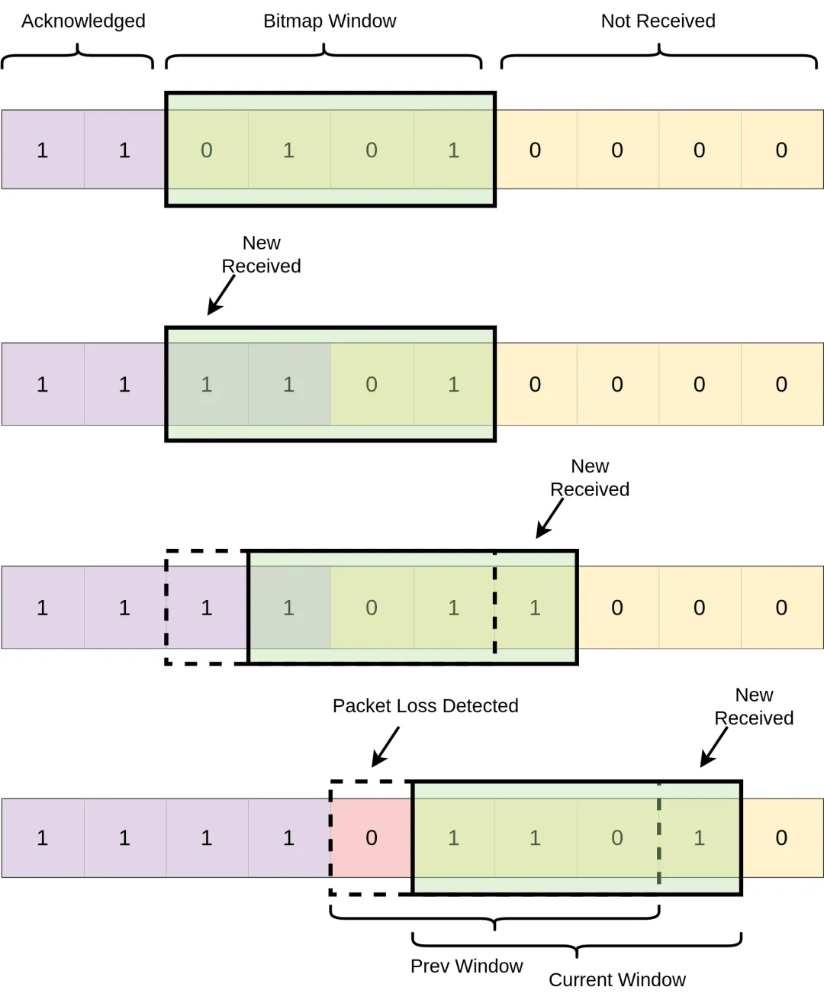
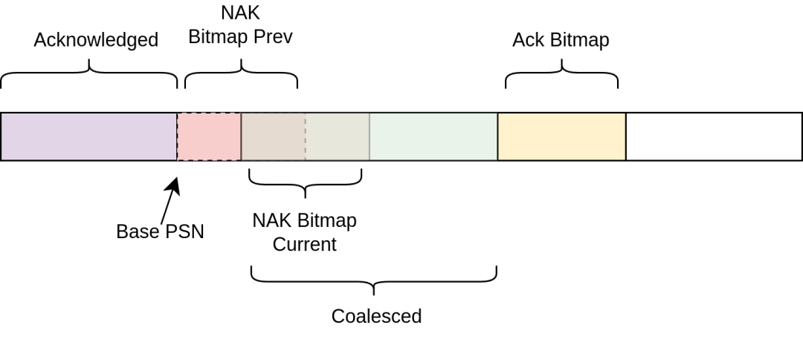

blue-rdma是一个新的RDMA实现。本期内容将主要对 blue-rdma 的丢包处理和重传机制做深入的介绍。

Table of Contents

1. blue-rdma 的数据包处理逻辑

2. Packet Sequnce Number

3. blue-rdma 数据包跟踪机制

4. 硬件bitmap窗口

上报ACK信息

如何检测丢包?

硬件上报对象

5. 驱动维护bitmap信息

NAK消息处理

重传包处理

驱动消息ACK机制

定时重传机制

6. 总结

7. 关于作者

## blue-rdma 的数据包处理逻辑
在InfiniBand的 RC模式下，数据包必须完全按顺序送达，即如果检测到乱序包时，接收端会通过发送NAK请求重传，发送端会重新发送从第一个乱序包开始的所有数据包以保证顺序。blue-rdma采用的是direct placement模式，在这种模式下接收到的数据包会直接写入到指定的最终内存地址，并支持数据包乱序到达。当允许数据包乱序时，我们可能接收到一组不连续的数据包，需要维护其中产生“洞”的位置信息。因此，direct placement模式要求blue-rdma维护更复杂的数据包状态。

## Packet Sequnce Number

blue-rdma 为每个发送队列（Send Queue）维护了一个 PSN（Packet Sequence Number）序列。每个数据包都对应一个唯一的PSN，每生成一个新的数据包，PSN 值会相应递增。在接收端数据包状态管理中，系统会跟踪并记录基于 PSN 的数据包接收情况。

## blue-rdma 数据包跟踪机制

上期我们介绍过，在blue-rdma的设计中，数据包的处理是卸载到HCA硬件上的，而由于硬件资源有限，无法存储所需的完整状态。因此，我们需要软件驱动的参与，维护数据包的接收的全局状态。因此，blue-rdma硬件对于每个发送队列，仅维护一个较小的发送窗口，并且将窗口的内容定期上报至驱动，驱动再负责维护全局的状态。

## 硬件bitmap窗口

blue-rdma硬件使用了滑动窗口的方法，维护了一个长度为128位的窗口，窗口更新的规则如下(假设窗口从左向右移动):

- 每当收到一个PSN在窗口内的包时，将这一位置为1

- 每当收到一个PSN落在窗口之前的包时，丢弃这一个包(重复)

- 当收到一个PSN落在窗口后的包时，滑动窗口使得窗口的右端指向这一个包对应的PSN，并且将这一位设置为1

### 上报ACK信息

当未发生丢包的情况下，硬件会在某些情况下向驱动程序上报ACK消息，ACK中包括了当前窗口的bitmap信息。主要包括两种情况:

- 硬件定时器超时: 在一段固定时间间隔后，强制向驱动发送一个ACK bitmap消息

- 当收到了一个Message的Last包: 目的是立即通知驱动检测整个Message是否已经接收完成，以此降低等待延迟。

### 如何检测丢包?

当一窗口发生滑动时，如果移出的部分存在为0的位，那么就认为产生了丢包。这时硬件会向构造一个NAK消息，并且上报至驱动程序。其中NAK消息包括:

- 滑动前的窗口的bitmap

- 滑动后的窗口的bitmap

硬件维护bitmap窗口的流程如下图所示:

### 硬件上报对象

除了向本地驱动上报上述的ACK和NAK的bitmap信息外，同时硬件也会向数据包的发送端发送bitmap信息，但仅限于发送NAK消息。每当硬件检测到丢包，产生的NAK消息会通过本地环形缓冲区发送到本地驱动，另一份会通过网络以单独的以太网帧发送到对端，对端硬件接收到包含NAK消息的以太网帧后，同样会通过环形缓冲区上报给驱动。这样实现的目的是使发送端驱动能够快速获取丢包信息并进行重传。

## 驱动维护bitmap信息
理解了硬件的行为之后，接下来我们会进一步了解驱动程序中是如何维护全局的bitmap信息，如何维护每个message的完成情况的，并且在何时进行重传。

由于在软件中，有较为宽松的内存限制，因此驱动中维护了一个全局的bitmap，包括:

- base psn: 当前确认的最低位PSN

- global bitmap: 一个全局的bitmap，记录当前接收到的不连续的数据包PSN。没有大小的限制。

在正常没有丢包的情况下，接收端驱动会收到硬件上报的ACK消息，类似的一个ACK消息包括:

- base psn: bitmap最低位

- bitmap: 128bit的bitmap

每当收到一个ACK消息，驱动就会试图将新接收到bitmap合并到当前全局的bitmap中。我们刚刚提到，硬件上报的bitmap不是连续的，而是间隔一定的时间才会上报，所以两个bitmap窗口之间可能并不存在重合。因此blue-rdma设计了bitmap合并的机制，当收到两个连续的ACK bitmap时，则认为当前最新的bitmap之前的所有数据包都接收完成，同时驱动的base psn也会更新。bitmap接收合并示例如下图所示:

### NAK消息处理

根据之前的介绍，每个NAK消息包含两个窗口，一个是窗口滑动前的窗口，另一个是窗口滑动后的窗口，包括两个128bit的bitmap。驱动会将这两个bitmap合并到全局的bitmap中，并且将窗口划出的部分标记为丢包。同样NAK消息的bitmap也遵循合并机制，即两个连续窗口之间的数据包认为是已经接收完成了。示例如下图，如果在一个NAK消息后又接收到了一个ACK消息，那么从ACK Bitmap到NAK Bitmap Current这之间的所有数据包都认为已经接收完成。

### 重传包处理

在NAK消息处理中，窗口划出的部分标记为丢包，并且base psn不会增加，那么这一部分空缺的数据包应该如何填补呢？本文之前提到，硬件在触发NAK时，会向本地和远端都发送一份相同的NAK消息，远端硬件在收到NAK时会触发重传。在blue-rdma中，对于所有的重传包，都会将包头的retry位设置为1，如果硬件检测到重传包，就会直接将这个包的信息上报到驱动，驱动再将接收到的单个数据包的PSN合并至全局的bitmap。

### 驱动消息ACK机制

本文介绍了驱动会在特定情况下构建ACK/NAK消息发送到驱动，使得驱动能够构建出全局的bitmap。读者可以注意到，接收端驱动仅在产生NAK时，才会向发送端复制一份NAK消息，而对于ACK并不会向发送端发送，那么发送端如何获知消息发送的ACK信息呢? 在blue-rdma中，这部分的功能交由驱动实现，即接收端驱动也能够构造ACK/NAK以太网帧，发送到对端，这样极大增加了系统的灵活性，硬件仅仅只需要处理最基础的信息，更复杂的控制则由驱动完成。在blue-rdma驱动中，当一个message接收完成时，即所有包都已经收到(通过global bitmap判断)。驱动会单独构造一个ACK信息，表示message的last包所对应PSN之前的PSN都已经接收完成。发送端驱动接收到这一ACK信息后，同样会更新自己的global bitmap到给定的PSN。

### 定时重传机制

本文之前所述的内容，是在默认大多数情况下都能够保证可靠传输的机制。然而，在少量极端情况下，仍然会出现无法恢复的情况，例如ACK/NAK信息在网络上丢失。因此，blue-rdma还实现了一套超时重传机制，确保没有确认的数据包能最终得到重传。在blue-rdma驱动中，对于每一个Send Queue都维护了一个定时器，每当发送一个需要显式ACK的message时(ack_req为true)，就开启定时器。一段时间后如果此message还未接收完成导致定时器超时，那么就需要重传message中所有还未收到的包(通过global bitmap计算)。用户能够配置重试的上限，当达到最大的重试上限时，Send Queue会进入错误状态。另外，之所以仅对于ack_req位为true的message设置定时器，是因为根据ACK coalescing的机制，即在RC传输模式下一个message的完成能够确认之前所有消息的完成，只需要维护单个定时器即可.

## 总结
本文深入剖析了 blue-rdma 实现数据包跟踪和错误处理的实现细节。之后的文章中，我们会涉及到blue-rdma其他部分的细节讲解，有兴趣的读者可以继续关注。

## 关于作者
作者是达坦科技的RDMA软件工程师，目前负责blue-rdma驱动的开发和维护工作。欢迎通过Github(@bsbds)与我交流。