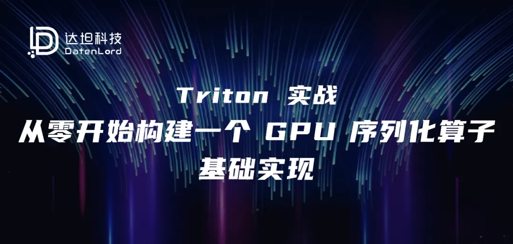

## 前言
在大模型时代，对极致性能的追求永无止境。作为一门为大规模并行计算而生的高性能语言，Triton 正凭借其出色的开发效率和接近硬件极限的性能，受到越来越多AI工程师的关注。在达坦科技，我们也在积极拥抱 Triton，利用它来开发和优化GPU算子，以加速大模型的推理效率。

## 为什么选择 Triton: 在开发效率与极致性能间找到最佳平衡
在 Triton 出现之前，GPU 编程通常面临一个两难的选择：

高层框架（如 PyTorch, TensorFlow）：这类框架抽象层次高，内置了丰富的算子库，让开发者可以像搭积木一样快速构建模型。优点是开发效率极高，但缺点也同样明显——当遇到框架未提供的特定算子，或现有算子无法完全压榨硬件性能时，开发者便会陷入一个两难的境地：要么接受性能上的妥协，要么就必须投身于复杂的底层编程。

底层 API（如 NVIDIA CUDA C++, AMD ROCm HIP）：这是最接近硬件的编程方式，能让开发者对硬件拥有最大的控制力，从而实现无与伦比的性能。然而，其代价是陡峭的学习曲线、复杂的编程模型以及与特定硬件的深度绑定。对于更熟悉 Python 的广大算法研究员来说，是一个不小的门槛。

Triton 的诞生，正是为了打破这一僵局。它巧妙地在开发效率和极致性能之间取得了平衡。

Triton 是一种基于 Python 的领域特定语言（DSL），它提供了一套与 Python 无缝结合的编程接口，让开发者可以用写 Python 的方式来编写高性能的 GPU 算子。其内部实现了一个强大的硬件抽象层和 JIT (Just-In-Time) 编译器。这套组合使得开发者可以从繁琐的底层细节中解放出来，更专注于算法逻辑本身，而编译器则负责将这些高级代码编译成针对特定 GPU（无论是 NVIDIA 还是 AMD）高度优化的机器码。

这种设计带来了两大核心优势：
- 开发友好：沿用 Python 语法，学习成本低，开发周期短。

- 跨平台高性能：一次编写，处处运行。例如，一个用 Triton 编写的矩阵乘法算子，在 AMD GPU 上的性能可以与厂商深度优化的 HIP 库版本相媲美，但开发复杂度却远低于后者。

## 序列化算子：为大模型推理通信“合零为整”

#### 背景与目标
在流水线并行（Pipeline Parallelism）这样的大模型分布式推理场景中，数据需要在不同的计算节点（GPU）之间频繁传输。这些数据往往不是单一的 Tensor，而是由多个 Tensor 组成的集合，例如除了主要的 hidden_state 外，还可能包含一些位置编码、注意力掩码等尺寸各异的小 Tensor。

实践证明，传输一个打包后的大 Tensor，远比依次传输大量离散的小 Tensor 效率更高。频繁的、小规模的数据传输会带来显著的通信开销和 GPU 等待时间，形成气泡，降低了整体的计算效率。

因此，本算子的目标非常明确：

序列化（Serialize）：将多个小 Tensor 高效地合并（打包）成一个连续的大 Tensor Buffer。

反序列化（Deserialize）：在接收端，从这个大的 Buffer 中精确地还原出原始的多个 Tensor。

通过这种“合零为整”的方式，我们旨在减少通信次数，提高 GPU 利用率，并降低端到端的推理延迟。

#### 设计思路：规划 Buffer 内存布局
为了实现这个目标，需要精心设计内存布局。假设我们需要处理五个待传输的 Tensor：四个尺寸各异的小 Tensor（数据类型涵盖 u16, i32, i64, f16）和一个占据绝大部分数据量的二维大 Tensor hidden_state（f16 类型，具有固定的宽度）。

这里的核心思路是，预先分配一个足够大的、u8 类型的 Tensor 作为统一的 Buffer。u8 类型是理想的载体，因为它不涉及任何计算，可以灵活地存储任意数据类型。现在将这个 Buffer 视作一个二维矩阵，其列宽与数据量最大的 hidden_state 的宽度对齐（在本例中为 7168，由于 f16 占 2 字节，所以 Buffer 列宽为 7168 * 2 = 14336 字节）。

Buffer 的内存布局规划如下：

- 第 0 行：元数据区。专门用于存储所有 Tensor 的元信息，例如每个 Tensor 的具体尺寸、数据类型等。这些信息是反序列化时正确解析数据的关键。

- 第 1 至 4 行：小 Tensor 数据区。每个小 Tensor 独占一行。即使 Tensor 的实际大小不足一行，也会用填充（Padding）的方式使其占满整行，以保证后续数据地址的对齐和计算的规整。

- 剩余所有行：大 Tensor 数据区。用于存储 hidden_state 的全部数据，按行依次存放。

## Triton 代码核心逻辑解析
所有 Triton 的 Kernel 函数都需要使用 @triton.jit 装饰器进行修饰。下面来拆解序列化和反序列化两个核心 Kernel 的逻辑。

1. 序列化 (serialize_kernel)：将数据写入 Buffer

输入：五个源 Tensor 的指针、一个记录元数据的指针、目标 Buffer 的指针，以及 Buffer 的行宽（stride）。

核心过程：

写入元数据：首先，将 u8 类型的 Buffer 指针转换为目标类型指针（如 u16），然后将所有元数据一次性写入 Buffer 的第 0 行。

写入小 Tensor：依次处理四个小 Tensor。对于每个 Tensor，这里将 Buffer 指针移动到对应的行，并根据其数据类型转换指针。

并行化写入：Triton 的并行模型非常简洁。这里使用一个 BLOCK_SIZE 作为数据块的处理粒度。

安全读写：通过循环和掩码（Mask）机制，这里以 BLOCK_SIZE 为单位，从源 Tensor 中读取一个数据块，然后写入到 Buffer 的对应位置。掩码的存在至关重要，它能确保在处理行尾不足一个 BLOCK_SIZE 的数据时，不会发生越界访问。

写入大 Tensor：处理完所有小 Tensor 后，采用同样的块读取和掩码写入逻辑，将 hidden_state 的数据高效地写入 Buffer 的剩余行区域。

输出：一个包含了所有元数据和 Tensor 数据的、规整的 Buffer。

2. 反序列化 (deserialize_kernel)：从 Buffer 中还原数据

输入：序列化后的 Buffer 指针、用于接收还原结果的五个目标 Tensor 的指针、一个用于存储读取出的元数据的指针，以及 Buffer 的行宽。

核心过程：这完全是序列化的逆过程。

读取元数据：首先从 Buffer 的第 0 行读取元数据。

还原 Tensor：根据读取到的元数据信息（尤其是各个 Tensor 的尺寸），按顺序从 Buffer 的相应行中，同样以数据块为单位并行地读取数据，并将其写入各自对应的目标 Tensor 中。

输出：五个被完整还原的 Tensor 以及它们的元数据。

## 应用效果
为了验证算子的实际效果，这里模拟了一个四卡 GPU 环状拓扑结构下的数据传输场景。

- 未使用序列化算子：

在这种情况下，需要依次调用通信库传输五个独立的 Tensor。从通信时间线上看，存在大量由小 Tensor 传输引起的气泡，GPU 在这些碎片化的时间内处于等待状态。总通信耗时约为 867 微秒。

- 使用 Triton 序列化算子：

先调用 serialize_kernel 将五个 Tensor 打包成一个大 Buffer，然后仅传输这一个 Buffer，接收端再调用 deserialize_kernel 进行还原。通信时间线显示，之前的小气泡完全消失了，只有一个单一的大块传输，其耗时（约 285 微秒）与之前单独传输最大的 hidden_state 耗时相近。

虽然序列化和反序列化操作本身也需要时间（在本例中约 200 微秒），但在该场景下，总耗时（序列化 + 传输 + 反序列化）显著低于原始方法（约 500+ 微秒 vs 867 微秒）。

## 性能分析与展望
必须承认，当前的实现是一个注重功能正确性的基础版本，尚未进行深度的性能优化。根据硬件的理论带宽（例如 500 GB/s）估算，这里处理的数据量的序列化/反序列化理想耗时应该在 15 微秒左右。这与当前实测的 200 微秒相比，仍有巨大的优化空间。

这同时也意味着，通过后续的性能调优（例如优化内存访问模式以实现合并访问、调整 BLOCK_SIZE 以匹配硬件特性等），此序列化算子有潜力带来显著的性能提升，尤其是在某些通信库对小数据块传输优化不足的环境中。

## 总结
本文从大模型推理的实际痛点出发，介绍了 Triton 语言作为连接开发效率与极致性能的桥梁所具备的优势。并详细讲解并实现了一个用于多 Tensor 序列化/反序列化的基础版 Triton 算子，并通过实验证明了即使是基础版本，它也能在特定场景下有效整合通信，减少开销，缩短端到端延迟。

这只是一个开始。在接下来的分享中，我们会将把重点放在性能优化上，探索如何通过精细的调整，让这里的 Triton 算子性能不断逼近硬件的理论极限。