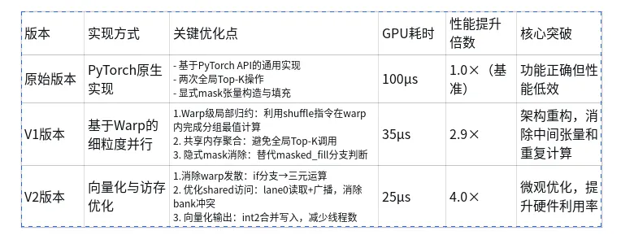

## 引言
混合专家（Mixtureof Experts, MoE）作为大模型高效训练与推理的核心架构，其专家筛选环节的性能瓶颈直接制约整体系统效率。DeepSeek开源的分组式Top-K专家选择逻辑，虽在算法层面实现了专家筛选的合理性，但基于PyTorch的原生实现在通用计算架构下存在显著性能损耗，单次专家筛选操作耗时高达100微秒（μs），成为MoE推理链路的关键性能卡点。


为突破这一瓶颈，本文聚焦于基于ROCm的底层优化路径，对DeepSeek分组专家筛选的核心源码进行重写，深度适配ROCm生态的异构计算特性、优化张量维度变换与掩码操作的底层执行逻辑，并结合海光Z100的硬件架构特性完成算子级定制化调优，最终将该核心操作的耗时从100μs降至22μs，性能提升超4.5倍。这一优化不仅验证了ROCm生态在国产加速卡上适配大模型MoE架构的可行性与优势，也为高吞吐、低延迟的MoE推理系统在国产化硬件上的落地提供了可复用的工程方案与实践参考。


上述 DeepSeek 分组式 Top-K 专家选择逻辑的性能瓶颈，源于其 PyTorch 原生实现的底层执行效率限制。为更清晰地呈现优化对象的核心逻辑，以下先给出该分组专家筛选的原始核心源码，其核心通过张量维度重塑、分组极值 / Top-K 计算及索引扩展完成专家筛选，也是本文后续基于 ROCm 进行底层优化的核心对标对象

## 源码片段

````
import torch

def group_topk_attention(scores, n_groups, topk, bias=None):
    batch_size = scores.size(0)
    seq_len = scores.size(-1)
    group_size = seq_len // n_groups
    scores_view = scores.view(batch_size, *scores.shape[1:-1], group_size, n_groups)
    
    if bias is None:
        group_scores = scores_view.amax(dim=-2)
    else:
        top2_scores, _ = torch.topk(scores_view, k=2, dim=-2)
        group_scores = top2_scores.sum(dim=-2)
    
    _, topk_groups = torch.topk(group_scores, k=topk, dim=-1)
    indices = topk_groups.unsqueeze(-2).expand(-1, -1, group_size).reshape(batch_size, -1)
    
    return indices
````

deepseek源码实现了分组专家系统（Mixtureof Experts）中的「分组筛选+Top-K 专家选择」逻辑：先按组筛选出分数最高的若干组，屏蔽其他组的专家分数，再从剩余专家中选出全局分数最高的Top-K个专家，最终输出这些专家的全局索引


在当前实现中，我们有以下关键参数：

• self.n_groups 专家的总分组数（默认为 8 组）

• self.bias偏置项标识（None表示无偏置；非None时，会基于Top-2分数之和动态调整每组的专家数量）

• self.topk_groups从所有分组中选出的最高分组数量（例如选 4 组）

• self.topk最终全局选取的专家总数（即全局 Top-K 专家）

• scores每个样本对所有专家的打分（或概率）

• x输入特征张量，主要利用其第一维（样本数N，例如形状为[1, 256]）

• indices最终输出的「被选中专家的全局索引」


通过梳理整个执行流程，可以识别出以下几个明显的性能瓶颈：

中间张量频繁创建与全局内存访问
在计算 mask 和 group_scores 时，引入了多个临时中间变量。这些操作不仅需要完整的全局内存读写，还会打断计算流水线，造成 GPU 执行停滞。


Top-K 操作密集且重复
流程中连续调用了两次 Top-K，首先在每个分组内执行局部 Top-K（用于筛选高分组）

然后再进行一次全局 Top-K（确定最终专家）

而 Top-K 的时间复杂，在专家数量较大时（如数千个专家），这类操作会成为显著的性能热点。


mask_fill引入低效的分支判断
使用 masked_fill 对大张量进行条件填充时，GPU 需要对每个元素执行分支判断。这种细粒度的条件逻辑无法被有效向量化，在大规模张量上会导致严重的执行效率下降。


## V1思路

在对 scores 张量进行 view 重排后，每个分组内的向量片段（即局部专家分数子集的 amax或 topk 操作）的计算规模通常较小（例如 32 或 64 个元素），完全可以在单个 warp（在 ROCm 平台上称为 wave）内部完成，无需跨线程块通信。当一个 CUDA/ROCm block 包含多个 warp 时，每个 warp 并行处理不同分组的数据，其各自的中间结果（如局部 top-k 索引或最大值）可暂存至 shared 内存中，便于后续归约或全局筛选阶段使用。

````
template<int WARP_SIZE>__device__ __forceinline__ float warp_topmax_reduce(   
    float val, float *sm_maxs,    
    int&warp_id, int&lane_id
)
{    
    constexpr uint MASK_ALL = 0xffffffff;    
    constexprint SHfl_len = WARP_SIZE / 2;    
    float top1 = -INFINITY;    
    float top2 = -INFINITY;    
    float current_val = val;     
    //warp内所有元素参与比较 找到第1大值    
    #pragma unroll    
    for (int offset=WARP_SIZE/2; offset>0; offset/=2) {        
        float other_val = __shfl_xor_sync(MASK_ALL, current_val, offset);        
        current_val = fmaxf(current_val, other_val);    
    }    
    //广播第1大值    
    top1 = __shfl_sync(MASK_ALL, current_val, 0);     
    //将等于第1大值的元素标记为无效    
    current_val = (val == top1)? -INFINITY:val;    
    __syncwarp(MASK_ALL);    
    #pragma unroll   
    for (int offset=WARP_SIZE/2; offset>0; offset/=2) {        
        float other_val = __shfl_xor_sync(MASK_ALL, current_val, offset);        
        current_val = fmaxf(current_val, other_val);    
    }    
    //广播第2大值    
    top2 = __shfl_sync(MASK_ALL, current_val, 0);    
    //将本次缓存写入到共享内存 写入1次    
    if (lane_id == 0)        
    sm_maxs[warp_id] = __fadd_rn(top1, top2);     
    __syncwarp(MASK_ALL);
}
````

在前述步骤中，我们已通过每个 warp 并行计算出各自负责分组内的最值（如最大分数或局部 Top-K 结果）。但这仅得到了每个分组的“代表值”，尚未确定哪些分组应被保留。


为了选出self.n_groups个分组中得分最高的self.topk_groups个分组，我们需要进行一次跨 warp 的归约


Block 内同步与结果聚合
在 block 内所有 warp 完成分组最值计算后，执行一次__syncthreads()同步，随后由首个 warp（lane 0 所在 warp）收集所有 warp 存储在 shared 内存中的局部结果，并执行一次轻量级的全局 Top-topk_groups 操作，得到最终选中的分组索引


````
# Python 等效逻辑

indices = group_scores.topk(self.topk_groups, dim=-1).indices
````

关键优化点在于并非所有分组都需要执行完整的局部Top-K。


我们可以在每个warp开始处理其分配的分组前，先判断该分组是否属于最终选中的topk_groups范围内。若不在，则直接跳过后续昂贵的局部排序或掩码生成逻辑。


复用中间结果，消除冗余 mask 操作
原始的python逻辑中是生成一个全尺寸的 mask 张量，再对整个 scores 执行全局 Top-K。这不仅引入大量条件分支（masked_fill），还造成不必要的内存访问。


实际上，前面warp_topmax_reduce已经得到了每个分组的有效性信息，可直接用于指导后续计算——无需显式构造大尺度布尔掩码。


局部topk代码参考

````
__device__ __forceinline__ void thread_swap(    
    float&val, int&id, float&or_val, int&or_id
) 
{    
    if (or_val > val || (or_val == val && or_id < id))    
    { val = or_val; id = or_id; }    
    //总是选择更大的值 若相同则选择索引更小的
}
template<int WARP_SIZE, int MAX_TOPK_NUMS>__device__ __forceinline__ void warp_topk_reduce(    
    float val, int idx,    
    float *sm_vals, int *sm_ids, int topk_num,    
    int&warp_id, int&lane_id, bool&mask_inf
)
{    
    constexpr uint MASK_ALL = 0xffffffff;    
    constexpr int SHfl_len = WARP_SIZE / 2;    
    float thread_val = mask_inf? -INFINITY:val;   
    int thread_idx = mask_inf? -1:idx;    
    #pragma unroll    
    for (int k=0; k<topk_num; k++) {    
    float max_val = thread_val;    
    int max_idx = thread_idx;    
    #pragma unroll    
    for (int offset_shfl=SHfl_len; offset_shfl>0; offset_shfl /= 2) {        
        float or_max_val = __shfl_xor_sync(MASK_ALL, max_val, offset_shfl);        
        int or_max_idx = __shfl_xor_sync(MASK_ALL, max_idx, offset_shfl);        
        thread_swap(max_val, max_idx, or_max_val, or_max_idx);    
    }    
    __syncwarp(MASK_ALL);    
    //所有线程持有当前局部最大值 冗余广播保证稳定    
    max_val = __shfl_sync(MASK_ALL, max_val, 0);    
    max_idx = __shfl_sync(MASK_ALL, max_idx, 0);    
    //写入当前第k个最值到共享内存 写入1次    
    if (lane_id == 0) {        
        sm_vals[warp_id * MAX_TOPK_NUMS + k] = max_val;        
        sm_ids[warp_id * MAX_TOPK_NUMS + k] = max_idx;    
    }    
    //能匹配刚刚写入的第k最值的线程 不再参与后续候选    
    thread_val = (thread_idx == max_idx)? -INFINITY:thread_val;    
    thread_idx = (thread_idx == max_idx)? -1:thread_idx;    
    __syncwarp(MASK_ALL);    
    }
}
````

以上是v1版本的细节实现

整体的框架示范（伪代码）

````
template<>__global__ __launch_bounds__(256) void indices_topk_v1<32, 8>(    
    const half* __restrict__ scores,    
    int N, int n_routed_experts,    
    int topk_num,    
    int n_groups,    
    int topk_groups,   
    int* __restrict__ indices
)
{
    __shared__ float sm_groups_topmax[WARP_NUMS]; //WARP_NUMS >= n_groups 每个分组最值
    __shared__ int sm_top_groups[MAX_TOPK_GROUPS]; //MAX_TOPK_GROUPS >= topk_groups 合并后分组索引
    __shared__ float sm_groups_weights[WARP_NUMS * MAX_TOPK_NUMS]; //WARP_NUMS >= n_groups MAX_TOPK_NUMS >= topk_num 局部topk筛选概率值
    __shared__ int sm_groups_ids[WARP_NUMS * MAX_TOPK_NUMS]; //局部topk筛选概率索引
    __shared__ float sm_sin_groups_weights[MAX_TOPK_NUMS]; //MAX_TOPK_NUMS >= topk_num 合并后topk筛选概率值
    __shared__ int sm_sin_groups_ids[MAX_TOPK_NUMS]; //局部topk筛选概率索引

    //所有warp求局部最值（amax或Top-2分数之和）
    
    //每个block交由首warp合并局部最值
    
    //当前线程的所属warp对应的组是否需要被屏蔽 true表示屏蔽
    bool mask_inf {true};
    //每个block的线程判断mask_inf
    #pragma unroll
    for (int i=0; i<topk_groups; i++) {    
        int group_idx {-1};    
        group_idx = sm_top_groups[i];    
        //一旦发现则解除屏蔽    
        if (warp_id == group_idx)    
        { mask_inf = false; break; }
    }
    
    //仅mask_inf为false的warp进行局部筛选（局部topk）
    
    //每个block交由首warp合并局部排序结果 得到全局索引
    
    //写入indices交由首block的首warp处理
}
````

V1 版本的关键优化

Warp 级细粒度并行：将每个专家分组的局部计算（如 amax 或 Top-2 求和）分配给单个 warp 完成，利用 warp 内 shuffle 指令高效实现组内规约，避免了全局内存访问和线程块间同步开销。

共享内存聚合中间结果：各 warp 将分组得分写入 shared memory，由首 warp 执行轻量级跨组 Top-K（选 topk_groups），实现了 block 内高效归约，替代了原 PyTorch 中两次昂贵的全局 Top-K 调用。

消除显式 mask 张量：不再构造全尺寸布尔掩码或调用 masked_fill，而是通过 mask_inf 标志位在计算过程中隐式屏蔽无效分组，规避了大规模分支判断和内存写入。


测试数据为1x256浮点数，在国产gpu上测试下原DeepSeek的Python从100μs降低至35μs，性能提升3倍

## V2思路

V2 的整体设计思路与 V1 保持一致，但在若干实现细节上进行了针对性优化。


Nsight Compute 对 kernel 进行深入剖析后，发现以下关键性能问题：


Warp 内分支发散严重

在每个 warp 执行局部分组的 Top-K 操作时，需要在寄存器间交换数据并进行多轮比较。由于比较逻辑中存在条件分支（例如判断是否更新当前 Top-K 候选），导致 warp 内线程执行路径不一致，引发显著的 warp divergence。


这不仅降低了 SIMD 执行效率，还增加了调度开销，成为当前 kernel 的主要性能瓶颈之一，改用使用掩码进行三元计算后解决

````
//低效的分支
if (or_val > val || (or_val == val && or_id < id))    
{ val = or_val; id = or_id; }
````

````
__device__ __forceinline__ void thread_swap(    
    float&val, int&id, 
    float&or_val, int&or_id
) 
{    
    bool mask_swap = (or_val > val || (or_val == val && or_id < id));    
    val = mask_swap? or_val:val;    
    id = mask_swap? or_id:id;    
    //总是选择更大的值 若相同则选择索引更小的
}
````

优化 shared 内存访问与写入效率

在性能分析中发现，shared 内存读取存在 bank 冲突。具体表现为，在读取分组屏蔽掩码时，多个线程通过循环展开方式并发访问 sm_top_groups 数组，导致多个线程同时读取同一 bank 的不同地址，触发隐式串行化访问，严重限制了内存带宽利用率。


优化策略由 warp 首线程读取 + shuffle 广播，为消除竞争，我们将掩码判断逻辑改为 仅由每个 warp 的 lane 0 执行读取和判断，再通过 __shfl_sync 将结果广播给同 warp 的其他线程


````
//当前线程的所属warp对应的组是否需要被屏蔽 true表示屏蔽    
bool mask_inf {true};    
//每个block的线程判断mask_inf    
#pragma unroll    
for (int i=0; i<topk_groups; i++) {        
    //这里注意 不确定block内是否隐式广播        
    int group_idx {-1};       
    group_idx = sm_top_groups[i];        
    //一旦发现则解除屏蔽        
    if (warp_id == group_idx)        
    { mask_inf = false; break; }    
}
````

````
//true表示屏蔽    
bool mask_inf {true};   
if (lane_id == 0) {        
    #pragma unroll        
    for (int i=0; i<topk_groups; i++) {            
        int group_idx {-1};            
        group_idx = sm_top_groups[i];            
        //一旦发现则解除屏蔽            
        if (warp_id == group_idx) {                
            mask_inf = false;       
            break;            
        }        
     }    
}    
//从0线程广播    
mask_inf = __shfl_sync(MASK_ALL, mask_inf, 0);
````

在写回最终选中专家索引（indices）适当合并一下写入全局事务，将输出数据按 half2（或此处为 int2）向量化


仅需 4 个线程即可完成全部写入（假设每次写 2 个索引，共 8 个），其余线程可提前退出


````
constexpr int Len_vec = 2;
int2* indices2 = reinterpret_cast<int2*>(indices);
//实际需要4线程即可    
if (warp_id == 0 && lane_id < 4) {        
    int&col_token = lane_id;        
    int offset_vec = lane_id * Len_vec;        
    indices2[col_token] = make_int2(sm_sin_groups_ids[offset_vec + 0], sm_sin_groups_ids[offset_vec + 1]);   
}
````


V2 版本在 V1 的基础上的进行细节优化

消除 Warp 内分支发散：将 thread_swap 中的显式 if 分支替换为基于掩码的三元运算（mask ? a : b），使所有线程执行统一的指令流，避免了因条件判断导致的 warp divergence，提高了 SIMD 利用率。

优化 Shared Memory 访问模式：针对 sm_top_groups 读取引发的 bank conflict，改为仅由每个 warp 的 lane 0 线程读取并判断分组有效性，再通过 __shfl_sync 广播结果，消除了多线程并发读取 shared memory 的竞争，显著提升内存子系统效率，尤其在高并发 warp 场景下收益更明显。

向量化输出写入：将最终 indices 的全局内存写入从逐元素写入改为 int2 向量化写入，使有效写入线程数从 8 减少至 4，并提升内存事务的吞吐效率，同时减少了无效线程的调度开销。


在国产gpu上测试下耗时稳定在25μs，性能提升4倍



