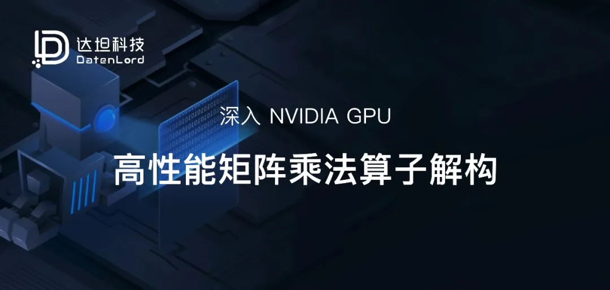

## 引言
本文是文章：Inside NVIDIA GPUs: Anatomy of high performance matmul kernels 的翻译版。本篇文章翻译将分为四个部分，本文是第一部分。

在本篇博文中，我将逐步介绍支撑最尖端（SOTA）NVIDIA GPU 矩阵乘法（matmul）算子的核心硬件概念和编程技术。


为何选择矩阵乘法？

无论是训练还是推理阶段，Transformer 模型的大部分浮点运算（FLOPs）都消耗在矩阵乘法中（如 MLP 中的线性层、Attention 的 QKV 投影、输出投影等）。这些操作具有天然的极高并行性（Embarrassingly Parallel），非常适合 GPU。掌握了矩阵乘法算子的原理，你就拥有了设计几乎任何其他高性能 GPU 算子的工具箱。


本文分为四个部分：

NVIDIA GPU 架构基础：全局内存、共享内存、L1/L2 缓存、功率限制（power throttling）对算力极限（SOL）的影响等。

GPU 汇编语言：SASS 和 PTX。

设计近乎 SOTA 的同步矩阵乘法内核：线程束平铺（warp-tiling）方法。

在 Hopper 上设计 SOTA 异步矩阵乘法内核：利用张量核心（Tensor Cores）、TMA、计算与加载/存储重叠、希尔伯特曲线（Hilbert curves）等。


我的目标是让这篇文章自成体系：既有足够的细节供独立阅读，又足够简洁以避免变成教科书。


本文是系列文章的首篇。后续计划（理想状态下）涵盖：

• 在Blackwell GPU上设计顶尖矩阵乘法内核

• 通过微基准测试探索GPU架构

• 设计顶尖多GPU内核

• 揭秘内存一致性模型（GPU领域的“令牌化器”：默默支撑系统运行的关键组件，却令多数开发者困惑不已）


## NVIDIA GPU 架构基础

要编写高性能的 GPU 内核，你需要对硬件有一个扎实的认知模型。随着我们深入探讨硬件架构，这一点会很快变得清晰。


在本文中，我重点关注 Hopper H100 GPU。如果你能深度理解 Hopper，那么将知识迁移到未来架构（Blackwell, Rubin）或早期架构（Ampere, Volta）就会变得非常简单。


Hopper [1] 和 Ampere [2] 白皮书是非常好的信息来源。

在最高层面上，GPU 执行两个基本任务：

移动和存储数据（内存系统）。

对数据进行有用的操作（计算流水线）。


下方的 H100 框图反映了这种划分：蓝色组件代表内存或数据移动，而红色组件代表计算（热）单元。


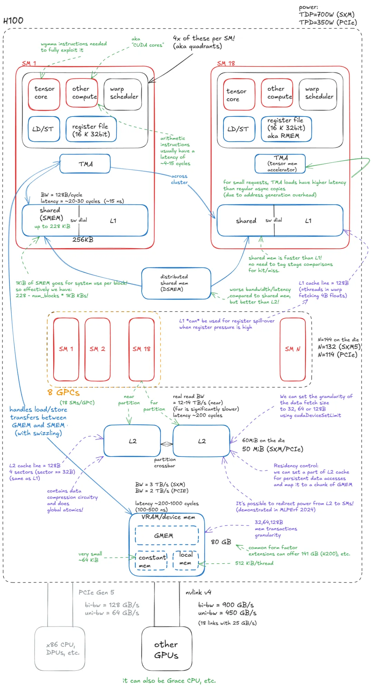

图 1：NVIDIA Hopper H100 GPU 模型

如果你在文中发现任何错误，请直接联系我——欢迎在 X、LinkedIn 或通过匿名反馈给我留言。

## 内存（Memory）
GPU 的内存系统是高度分层的，非常类似于 CPU 架构。


这种分层是由物理学和电路设计决定的：SRAM 单元速度更快但体积更大（实现高速所需的控制电路也增加了其面积），而 DRAM 单元体积更小/密度更高但速度较慢。其结果是，高速内存容量低且昂贵，而慢速内存可以提供大得多的容量。稍后我们将更详细地讨论 DRAM 单元/内存。


这种容量与延迟之间的权衡正是缓存层级存在的原因。在理想世界中，每个计算单元都会坐落在一大池超快内存旁边。由于这在物理上是不可能的，GPU 设计者做出了妥协：将少量快速内存放置在靠近计算单元的地方，并由更远处容量逐渐增大、速度渐慢的内存池作为后盾。这种组织方式最大化了整体系统的吞吐量。


GPU 内存系统由以下部分组成：

设备内存（VRAM/Device Memory）：在 CUDA 术语中，“设备”内存指的是片外（off-chip）DRAM——物理上与 GPU 芯片（die）分离，但封装在同一个板卡上——通常以堆栈式的 HBM 实现。它承载全局内存（GMEM）、每个线程的“局部”内存（寄存器溢出空间）等。

L2 缓存（L2 Cache）：由 SRAM 构建的大容量 k 路组关联缓存。它在物理上分为两部分；每个 SM 直接连接到一个分区，并通过横截（crossbar）间接连接到另一个分区。

分布式共享内存（DSMEM）：物理上接近的一组 SM（即一个 GPC）中共享内存（SMEM）的池化。

L1 缓存与共享内存（Shared Memory）：

L1 缓存：每个 SM 私有的较小 k 路组关联 SRAM 缓存。

共享内存（SMEM）：程序员管理的片上内存。SMEM 和 L1 共享相同的物理存储，它们的相对比例可以通过软件配置。

寄存器堆（Register File/RMEM）：位于计算单元旁边的最快存储单元。寄存器是单个线程私有的。与 CPU 相比，GPU 包含多得多的寄存器，且总 RMEM 容量与 L1/SMEM 存储的总和相当。

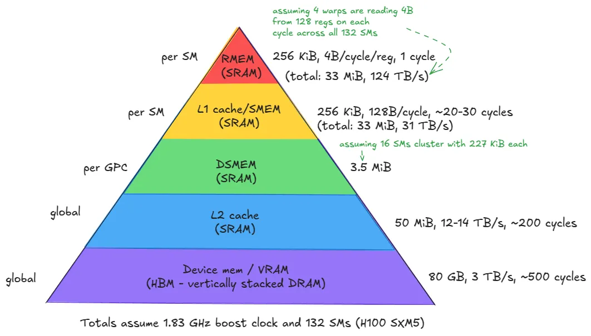

图 2：H100 (SXM5) GPU 的内存层级

📝 注意： 还有一些用于指令的小型缓存，以及常量内存等，为了理解核心原理，我将忽略它们。


从设备内存向下移动到寄存器（第 1-5 级），你会看到一个明显的趋势：带宽以数量级增长，而延迟和容量则以类似的数量级减少。


这引发了一些直接的影响：

将访问最频繁的数据尽可能靠近计算单元存放。

尽量减少对层级结构底层的访问，尤其是设备内存（GMEM）。


另一个值得注意的组件是 张量内存加速器（TMA），它是随 Hopper 引入的。TMA 支持在全局内存和共享内存之间，以及集群（cluster）内的共享内存之间进行异步数据传输。它还支持交织（swizzling）以减少银行冲突（bank conflicts）——我们会在适当的时候讨论这些细节（双关语）。

## 计算（Compute）

从内存转向计算，其基本单位是流式多处理器（SM）。Hopper H100 (SXM5) 总共集成了 132 个 SM。


SM 被组织成图形处理集群（GPC）：每个 GPC 包含 18 个 SM，GPU 上共有 8 个 GPC。四个 GPC 直接连接到一个 L2 分区，另外四个连接到第二个分区。

📝 注意：

GPC 也是支撑 CUDA 中 线程块集群（thread-block cluster） 抽象的硬件单元——我们稍后会回到编程模型。


关于集群的一点：早前我说过每个 GPC 有 18 个 SM，所以 8 个 GPC 应该有 144 个 SM。但 SXM/PCIe 规格暴露的是 132 或 114 个 SM。差异在哪里？这是因为 18 × 8 的布局仅对完整的 GH100 芯片有效——在实际产品中，有些 SM 会被熔断（fused off）。这对我们编写内核时选择集群配置有直接影响。例如，如果集群跨度超过 2 个 SM，你就无法利用所有 SM。


最后注意，“Graphics Processing Cluster (GPC)”中的“Graphics”是一个传统术语。在现代服务器级 GPU 中，这些集群纯粹作为计算/AI 加速单元，而非图形引擎。同样的，GPU 应该去掉“G”，它们是 AI 加速器。

除了前面提到的 L1/SMEM/TMA/RMEM 组件（均位于 SM 内部），每个 SM 还包含：

张量核心（Tensor Cores）：以高吞吐量在小分块（例如 64x16 @ 16x256）上执行矩阵乘法的专用单元。大型矩阵乘法被分解为许多此类分块操作，因此有效利用它们是达到峰值性能的关键。

CUDA 核心与 SFU：所谓的“CUDA 核心”（营销话术）执行标准的浮点运算，如 FMA（融合乘加：c=a∗b+c）。特殊函数单元（SFU）处理超越函数（如 sin,cos,exp,log）以及代数函数（如 sqrt,rsqrt 等）。

加载/存储（LD/ST）单元：服务于加载和存储指令的电路，与 TMA 引擎互补。

线程束调度器（Warp Schedulers）：每个 SM 包含调度器，为 32 个线程组成的组（CUDA 中称为 warps）发布指令。一个线程束调度器每周期可以发布一条线程束指令。


每个 SM 在物理上分为四个象限，每个象限容纳上述计算单元的一个子集。


这导出了以下见解：

📝 并行性（Parallelism）与并发性（Concurrency）

一个 SM 在给定的周期内最多可以同时发布来自四个线程束的指令（即在真正的并行执行中，每周期有 128 个线程）。


然而，一个 SM 可以容纳多达 2048 个并发线程（64 个线程束）。这些线程束常驻在 SM 中，并随着时间的推移被换入和换出调度，允许硬件隐藏内存/流水线延迟。


换句话说，指令并行性（在给定周期内有多少线程开始执行指令）限制为每 SM 128 个线程（4 条 32 宽度的线程束指令），而并发性（调度器中跟踪并有资格运行的线程数）则扩展到 2048 个线程。


## 光速（Speed of Light）与功率限制


既然我们购买 NVIDIA GPU 是为了计算，自然会问：性能上限是什么——GPU 的最大计算吞吐量是多少？这通常被称为“光速”（Speed of Light, SoL）性能：由芯片物理特性决定的上限。


根据数据类型的不同，有不同的性能上限。在 LLM 训练工作负载中，bfloat16 (bf16) 是近年来的主导格式，尽管 fp8 和 4 位格式变得越来越重要（对于推理，fp8 已相当标准）。


峰值吞吐量的计算公式为： perf=freq_clk_max∗num_tc∗flop_per_tc_per_clk

或者用文字描述：最大时钟频率 × 张量核心数量 × 每个张量核心每周期的浮点运算数（FLOPs）。

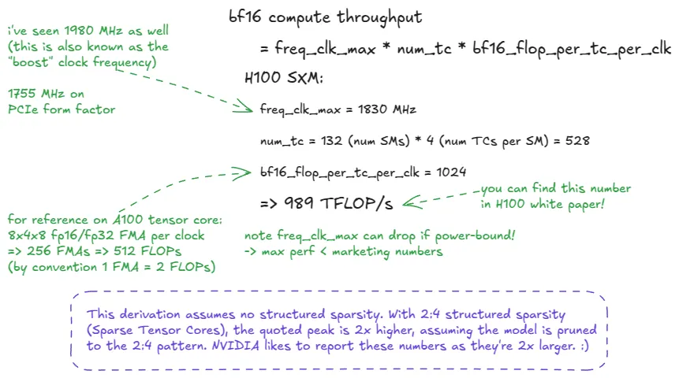

图 3：H100 SXM5 BF16 “光速”推导

📝 FLOP vs FLOPs vs FLOPS vs FLOP/s

FLOP = 单次浮点运算。

FLOP/s = 吞吐量单位：每秒浮点运算次数。

FLOPs（小写 s）= FLOP 的复数（多次运算）。

FLOPS（全大写）常被误用来表示吞吐量，但严格来说应读作“FLOPs”（复数）。将 FLOPS 用作 FLOP/s 是不严谨的！:)

我在上图中留下了一个提示：“光速”实际上并不是恒定的（我想这也是这个比喻失效的地方）。


在实践中，峰值吞吐量取决于实际时钟频率，而时钟频率会因功率限制（Power Throttling）或温度限制而波动。如果 GPU 时钟频率下降，有效的光速也会随之下降。

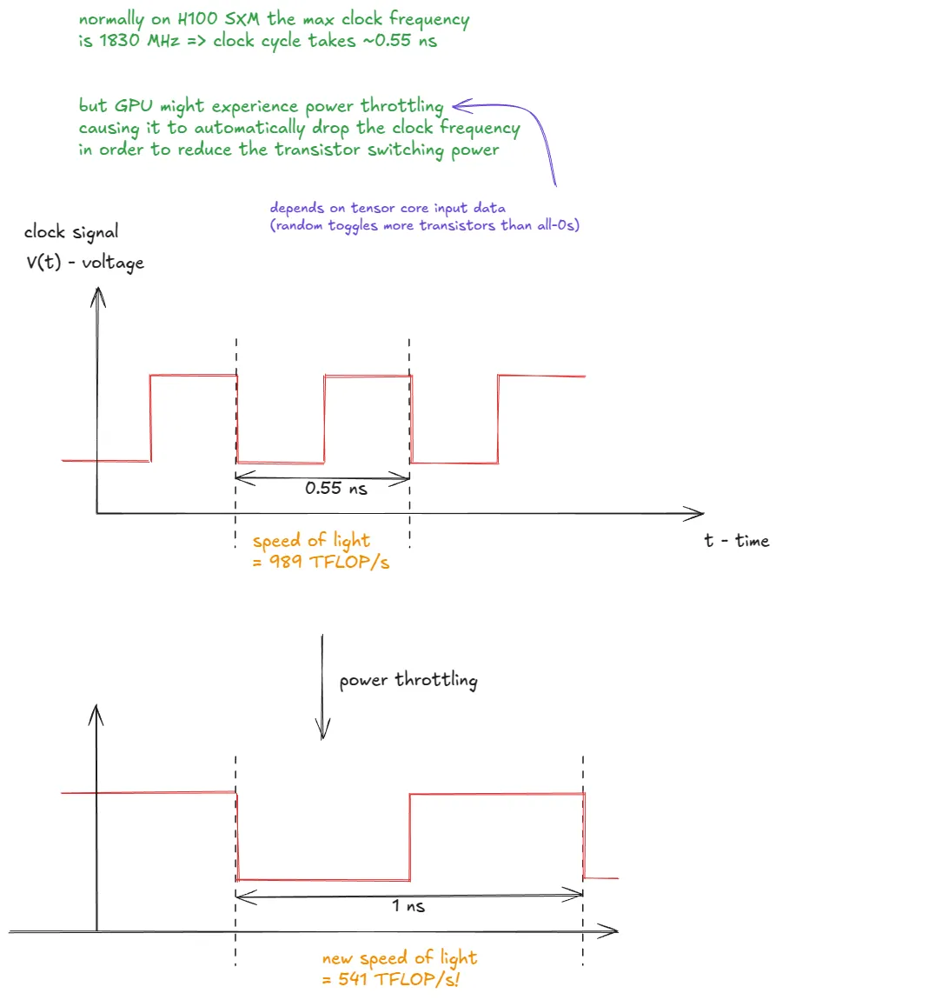

图 4：功率限制降低了时钟频率并拉低了有效的“光速”

📝 延伸阅读： Horace He 在他的博文 [3] 中更深入地探讨了这一现象。


硬件细节目前了解这些就足够了。接下来的重点将转向 CUDA 编程模型，然后我们会再次深入硬件底层，并最终上升到 CUDA C++ 层面。


## CUDA 编程模型

CUDA 编程模型自然地映射到 GPU 硬件和内存层级结构上。其核心抽象包括：

线程 (thread)

线程束 (warp)（32 个线程）

线程块 (thread block)

线程块集群 (thread block cluster)

网格 (grid)（由线程块或集群组成）

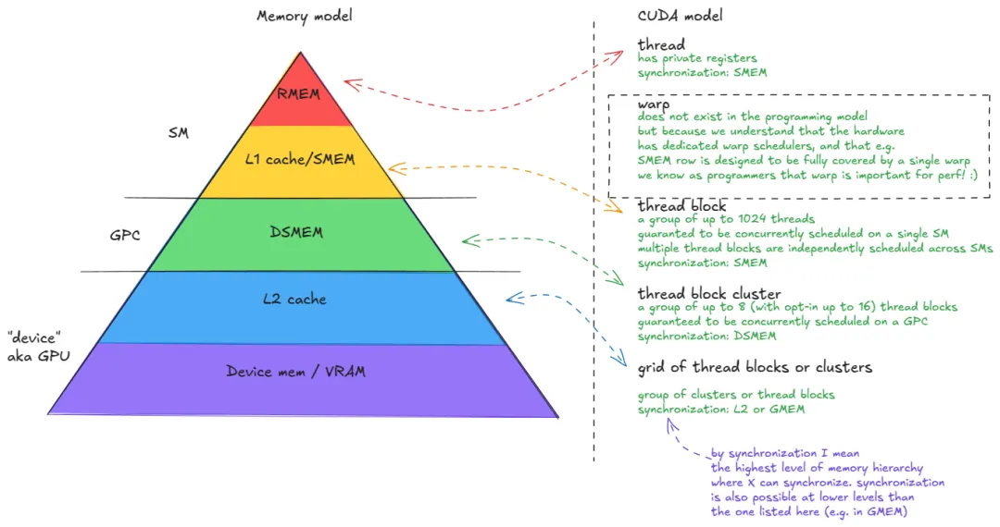

图 5：CUDA 编程模型：线程、线程束、块、集群、网格

每个线程通过 gridDim、blockIdx、blockDim 和 threadIdx 等变量“意识到”自己在 CUDA 层次结构中的位置。在内部，这些变量存储在特殊寄存器中，并在内核启动时由 CUDA 运行时（runtime）初始化。


这些位置信息使得跨 GPU 分配任务变得简单。例如，假设我们要处理一张 1024×1024 的图像。我们可以将其划分为 32×32 的线程块，每个块包含 32×32 排列的线程。每个线程可以计算其全局坐标：

````
const int x = blockIdx.x * blockDim.x + threadIdx.x;
const int y = blockIdx.y * blockDim.y + threadIdx.y;
````

并利用这些坐标从全局内存读取分配给它的像素（image[x][y]），执行点对点操作，并将结果存回。

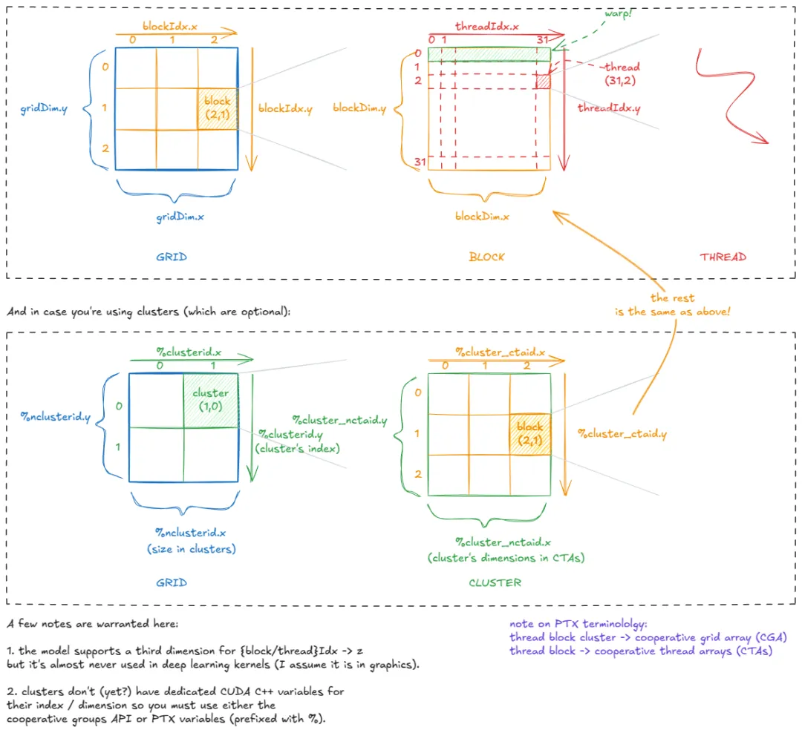

图 6：CUDA 内置变量：线程如何知道自己在哪里

如上图所示，在实践中我们大多使用 1D 或 2D 的网格/集群/块形状。但在内部，它们始终可以根据需要进行逻辑重组。

例如，如果 threadIdx.x 的范围是 0-1023（1024 个线程的 1D 块），我们可以将其拆分为 x = threadIdx.x % 32 和 y = threadIdx.x / 32，从而将其重塑为 32×32 的逻辑 2D 布局。

将 CUDA 模型连接回硬件，有一点现在应该很清楚了：一个线程块应包含至少 4 个线程束（即 128 个线程）。


为什么？ 线程块驻留在单个 SM 上。每个 SM 有 4 个线程束调度器——为了充分利用硬件，你不希望它们处于闲置状态。

📝 至少 4 个线程束的其他原因：

我们稍后会深入探讨，但在 Hopper 架构上，线程束组（warp-group，即 4 个线程束） 是 WGMMA（矩阵乘法）张量核心指令的执行单位。


此外，在使用持久化内核（persistent kernels）时，我们通常每个 SM 仅启动一个线程块，因此构建任务以保持所有线程束调度器忙碌至关重要。

带着 CUDA 编程模型的术语，我们可以继续深入探讨 GPU 的架构细节。


## 全局内存（GMEM）模型

让我们深入探讨 GMEM。如前所述，它是由多层 DRAM 堆叠而成，底部有一个逻辑层（HBM）。但 DRAM 到底是什么？

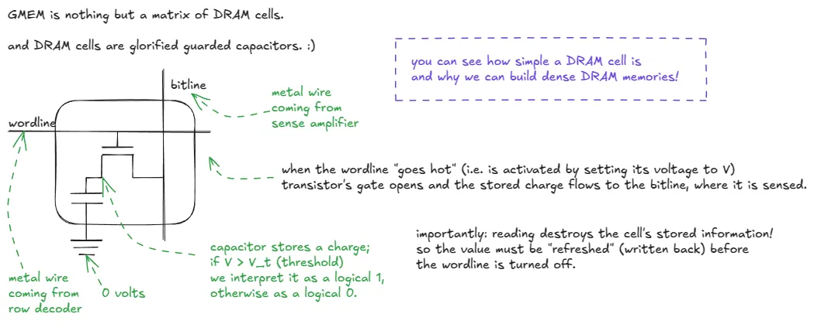

图 7：DRAM 单元内部：晶体管 + 电容器，字线（wordline） + 位线（bitline）

了解了单个位的存储方式后，让我们放大到整个存储矩阵。

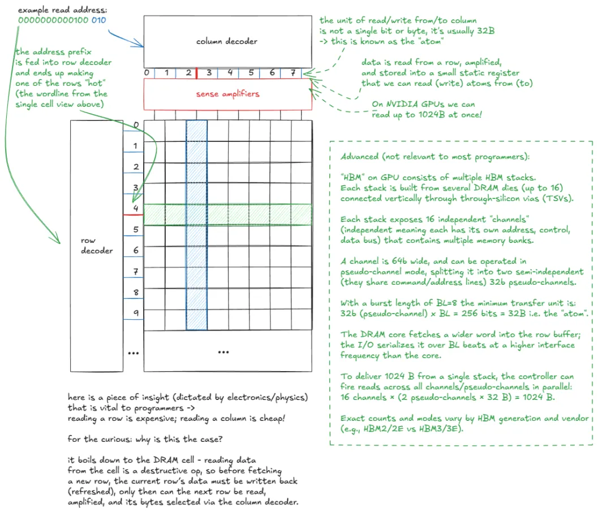

图 8：GMEM 模型

📝 关于 HBM 的延伸阅读： 如果你想更深入地了解 HBM，我发现论文《Demystifying the Characteristics of High Bandwidth Memory for Real-Time Systems》[21] 非常有启发性。

我们可以得出结论：访问模式（access patterns）至关重要，这是由 DRAM 单元的物理特性决定的。

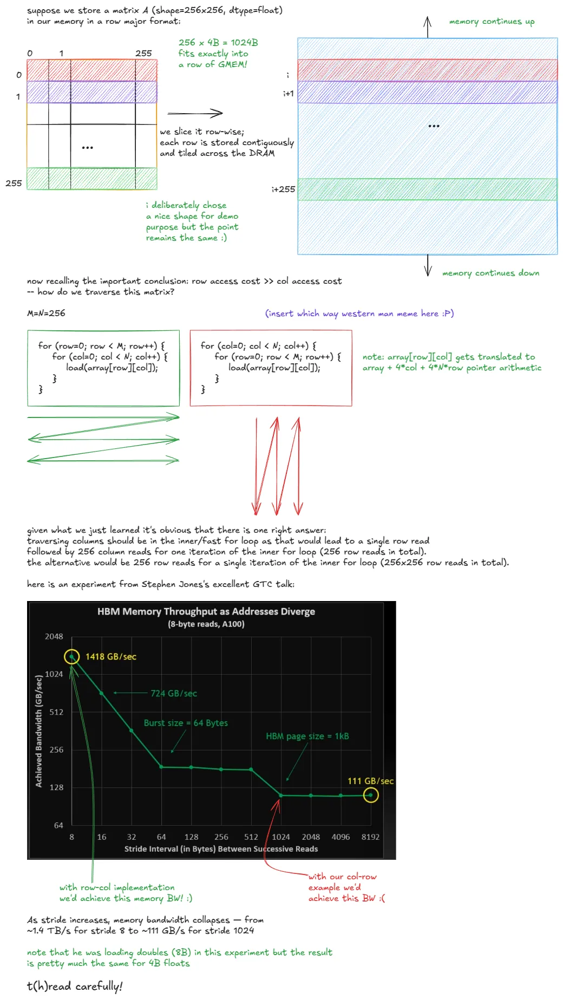

图 9：GMEM 访问模式的影响

Stephen Jones 的演讲《How CUDA Programming Works》[4] 非常值得一看。

如果我们示例中的矩阵是列优先（column-major*的，情况就会反转：列中的元素将连续存储，因此有效的选择是在内层循环遍历行，以避免 DRAM 惩罚。

所以，当人们说“GMEM 合并（coalescing）非常重要”时，指的就是：线程应访问连续的内存位置，以最小化触及的 DRAM 行数。

## 共享内存（SMEM）模型

共享内存（SMEM）具有与 GMEM 截然不同的特性。它由 SRAM 单元而非 DRAM 构建，这使得它在速度和容量的权衡上完全不同。

SRAM 单元的具体设计并不重要——只需知道存储一位信息需要多得多的晶体管。你可以自行搜索“SRAM cell”。

SMEM 组织为 32 个银行（banks），每个银行宽度为 32 位（4 字节）：

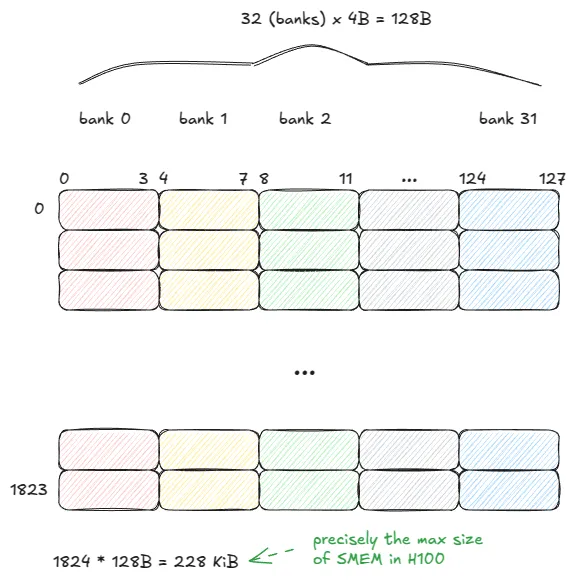

图 10：SMEM 模型

SMEM 可以在单个周期内提供来自所有 32 个银行的数据（128 字节）——但前提是必须遵守一条规则：


同一个线程束（warp）中的线程不得访问同一个银行（bank）内的不同地址。 否则，这些请求将被序列化，分多个周期执行。


这种情况被称为 银行冲突（bank conflict）。如果有 N个线程访问同一个银行中的不同地址，就会产生 N 路银行冲突（N-way bank conflict），该线程束的内存请求将需要 N 个周期才能完成。


在最坏的情况下，所有 32 个线程都指向同一个银行中的不同地址，吞吐量将下降到原来的 1/32。


为了说明这一点，假设线程束大小（warp size）为 5。下方的两种访问模式将分别需要 3 个周期和 1 个周期来完成服务：

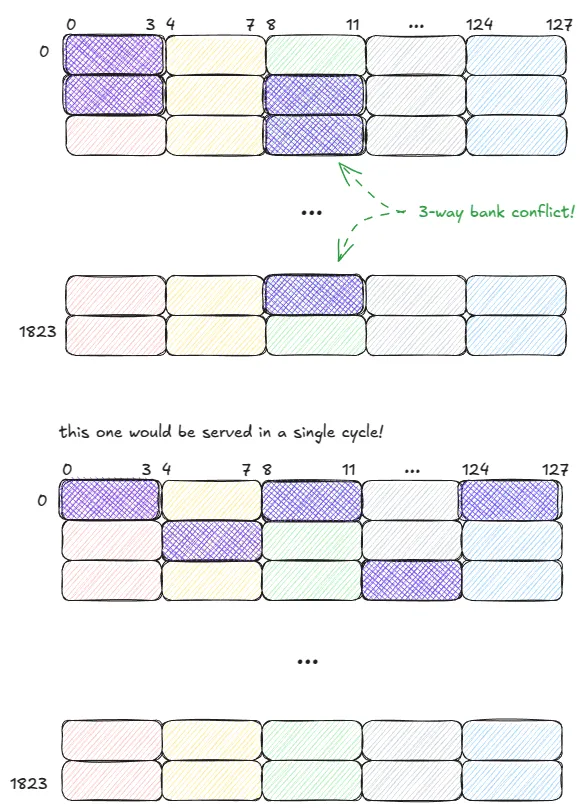

图 11：SMEM: 好与不好的access pattern 对比


重要的是：如果一个线程束（warp）中的多个线程访问同一个银行（bank）内的相同地址，共享内存（SMEM）可以将该值广播（broadcast）或组播（multicast）给所有这些线程。


在下方的示例中，请求在单个周期内即可完成服务：

银行 1（Bank 1） 可以将一个值组播给 2 个线程。

银行 2（Bank 2） 可以将一个值组播给 3 个线程。

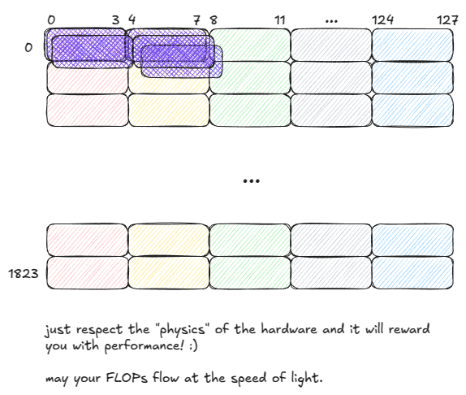

图 12：SMEM：Multicasting


现在，来看硬件拼图的最后一块：L1 缓存。

这是一篇由 Axel 撰写的关于 SMEM 微基准测试（microbenchmarking）的优秀博文 [5]。


## L1 模型

我们已经看到 L1 和 SMEM 共享相同的物理存储，但 L1 在该存储周围增加了一层由硬件管理的脚手架层（scaffolding layer）。


在高层级上，L1 缓存的逻辑流程如下：

线程束（warp）发布一个内存请求（指向 SMEM 或 GMEM）。

请求进入 MIO 流水线并被派遣至 LSUIN 路由器。

路由器导向请求：SMEM 访问立即从数据数组（data array）中获得响应，而 GMEM 访问则进入标签比较（tag-comparison）阶段。

在标签阶段，GMEM 的地址标签与目标集合（target set）中存储的标签进行对比，以确定数据是否驻留在 L1 中。

命中（Hit）：请求直接从数据数组中获得服务（就像 SMEM 一样）。

未命中（Miss）：请求传播至 L2（如有必要，甚至更远，直到 GMEM 或对等 GPU 内存）。当数据返回时，它会被缓存到 L1 中，替换（evicting）现有的一行，并并行地发送回发起请求的线程束。


这就是我刚才描述的系统：

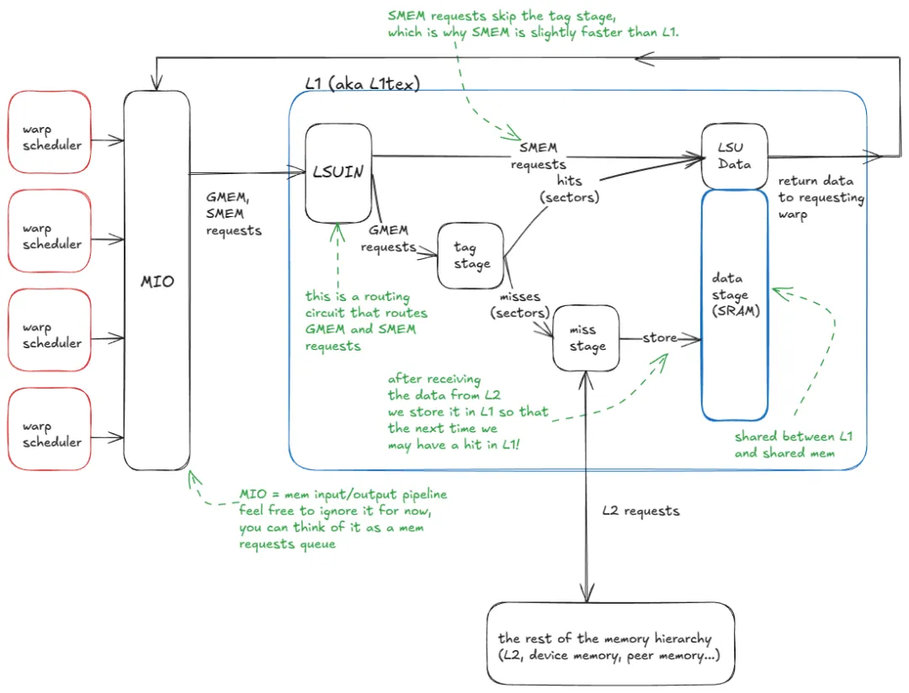

图 13：L1 缓存模型

让我们再深入一层，详细查看标签阶段（tag stage）和数据阶段（data stage）：


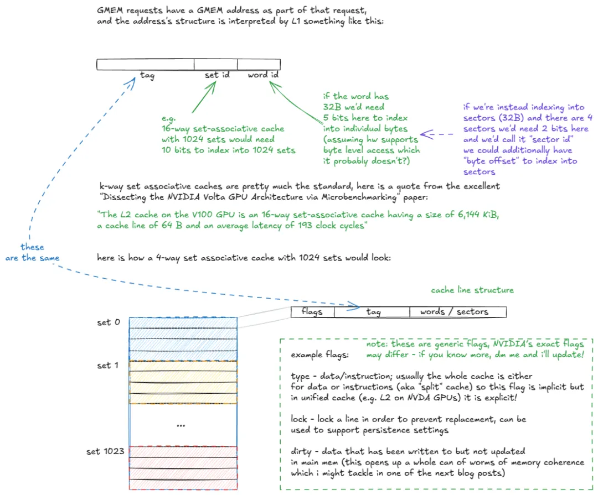

图 14：k 路组关联缓存组织的分解


当一个 GMEM（全局内存） 地址进入标签阶段时，命中/未命中（hit/miss）逻辑按如下方式展开：

标签阶段接收 GMEM 地址。

提取集合 ID 位（set id bits），并检查该集合中的所有缓存行（标签）。

如果发现标签匹配（潜在的缓存命中）：

检查该行的有效性标志（validity flags）。

如果无效 → 视为缓存未命中（继续执行步骤 4）。

如果有效 → 从数据数组中提取所请求的分区（sectors），并交付至线程束的寄存器中。

如果未发现匹配（缓存未命中），请求被路由至内存层级结构的其余部分（L2 及更高层级）。

当数据从 L2 返回时，它被存储在该集合中，并根据替换策略（例如伪 LRU 算法）驱逐（evicting）现有的某一行，同时并行地交付给发起请求的线程束。


注意，L2 缓存与 L1 并没有太大区别，除了它是全局的（而非每个 SM 独立）、容量大得多（具有更高的关联度）、被划分为由横截（crossbar）连接的两个切片，并且支持更细致的持久化和缓存策略。


至此，我们已经涵盖了理解后续章节所需的关键 GPU 硬件组件。

📝 GPU 世代间的梯度：

我之前提到过，理解 Hopper 是深入了解 NVIDIA GPU 未来和过去世代的绝佳基础。


到目前为止，最大的世代跨越是从 Ampere → Hopper，引入了：

分布式共享内存 (DSMEM)：在整个 GPC 的 SMEM 之间，实现加载、存储和原子操作的直接 SM 到 SM 通信。

TMA (张量内存加速器)：用于异步张量数据移动（GMEM ↔ SMEM, SMEM ↔ SMEM）的硬件单元。

线程块集群 (Thread Block Clusters)：一种新的 CUDA 编程模型抽象，用于跨 SM 对块进行分组。

异步事务屏障 (Asynchronous transaction barriers)：拆分式屏障，计数事务（字节数）而非仅仅是线程数。


Ampere (例如 A100) 自身也引入了几个关键特性：

张量核心 (Tensor Cores) 支持 tf32 和 bf16。

异步拷贝 (GMEM → SMEM)，具有两种模式：绕过 L1 和访问 L1。

异步屏障（在共享内存中由硬件加速）。

CUDA 任务图 (CUDA task graphs)：它是 PyTorch 中 CUDA graphs 的基础，减少了 CPU 启动和网格初始化开销。


通过 CUDA 协作组 (CUDA Cooperative Groups) 暴露的线程束级规约指令（实现了单步、整数数据类型的线程束范围规约，无需 shuffle 模式）。

