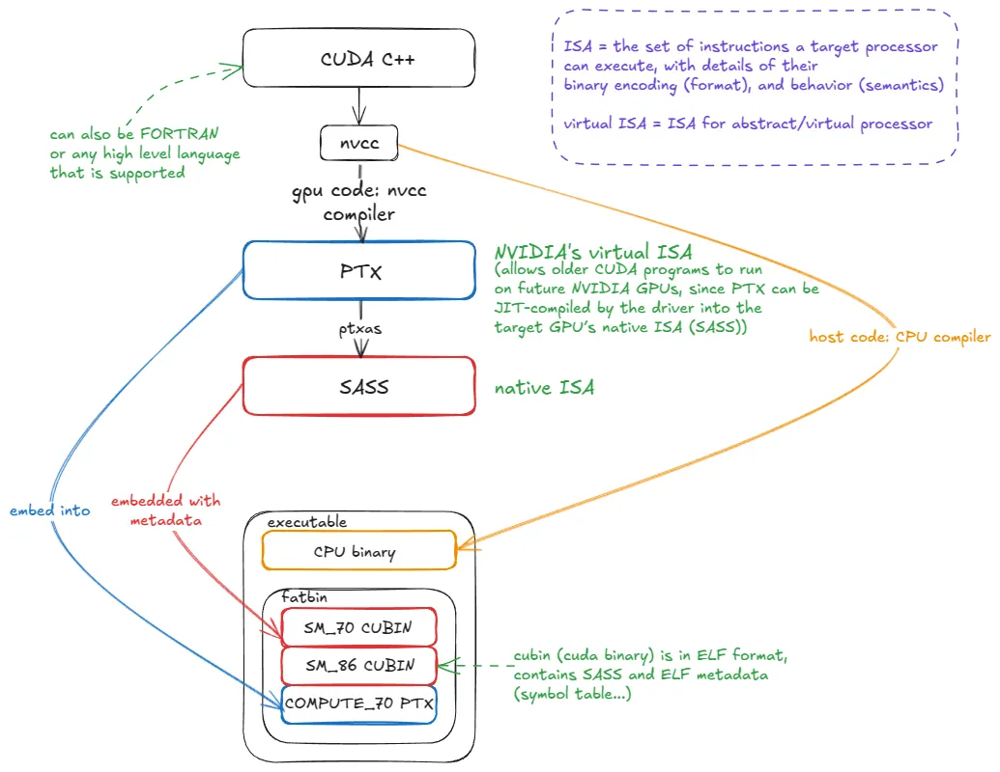
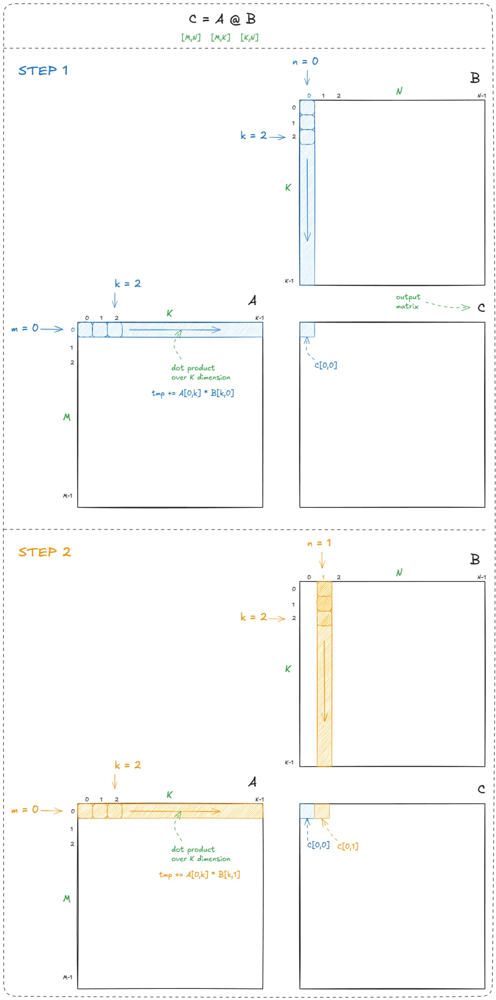
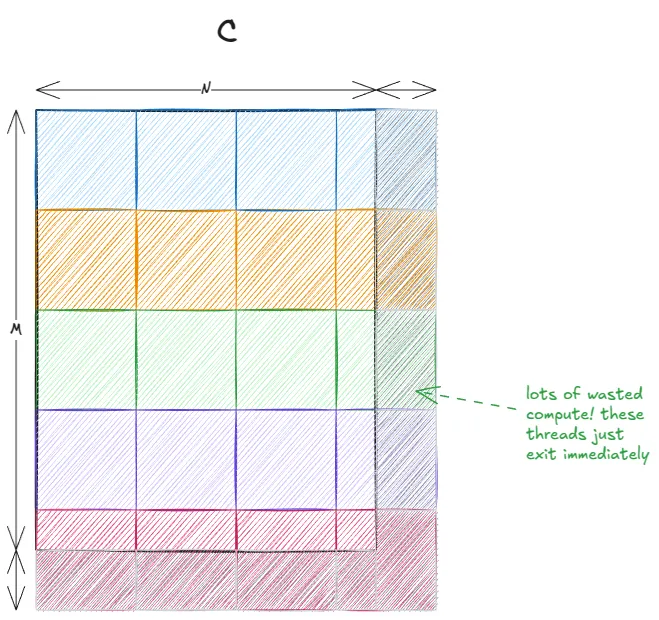
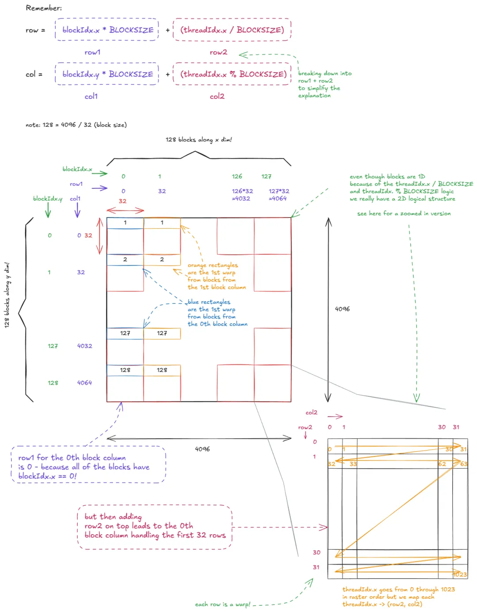
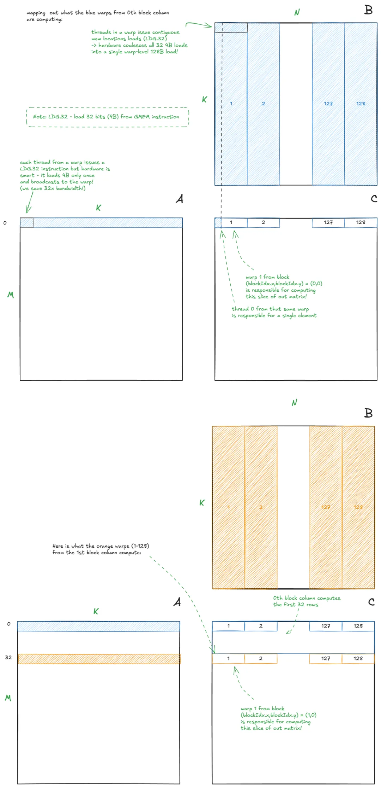
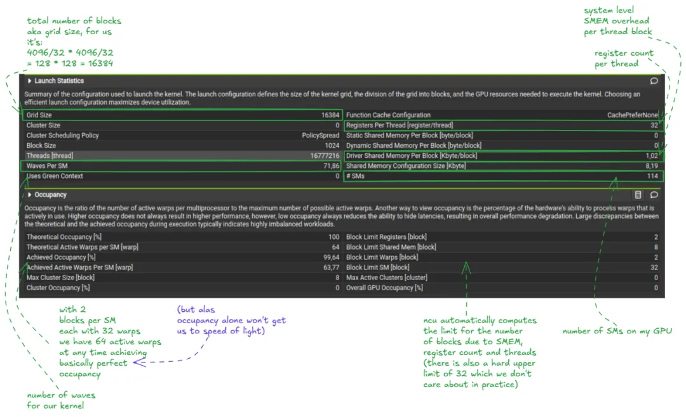
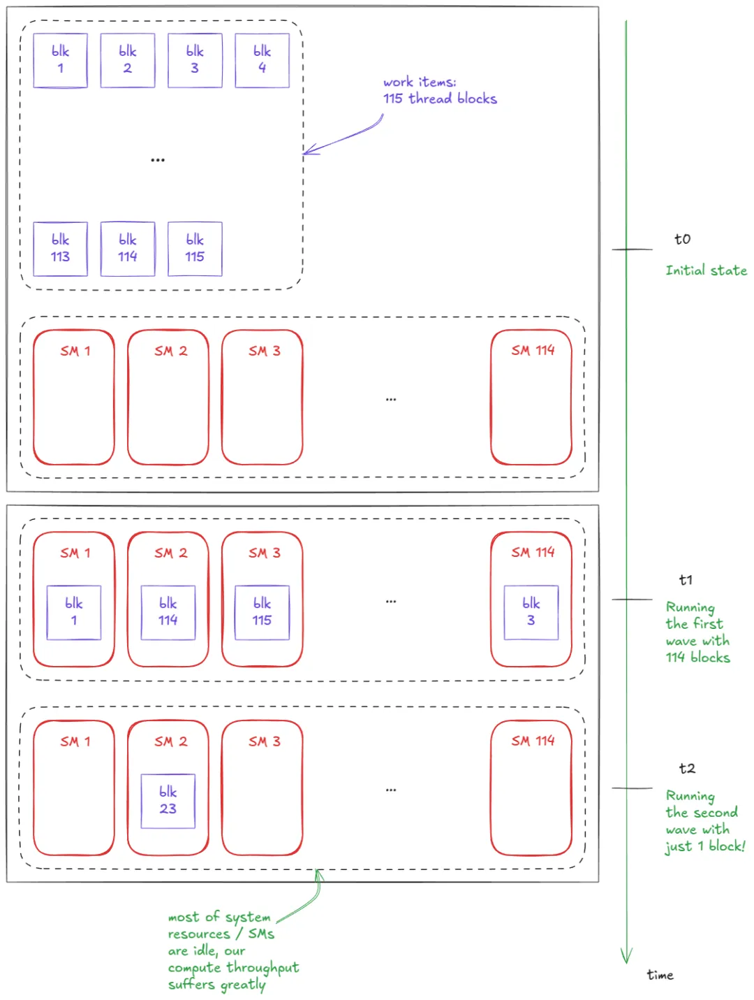
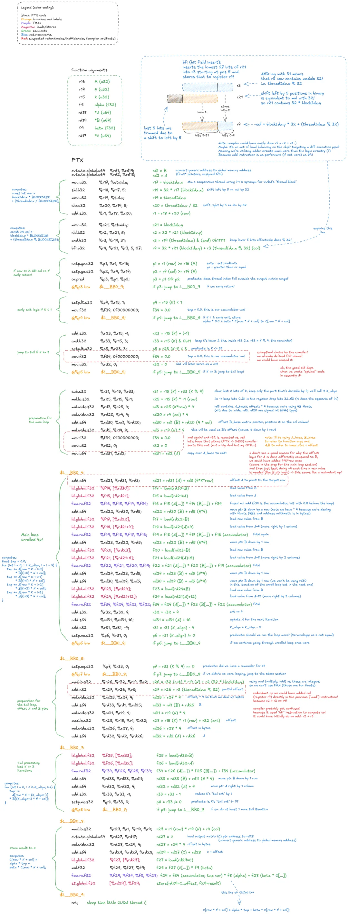
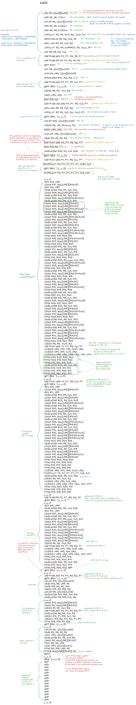

## 引言

本文是文章：Inside NVIDIA GPUs: Anatomy of high performance matmul kernels 的翻译版。本篇文章翻译将分为四个部分，本文是第二部分。

## GPU 汇编语言：PTX 与 SASS

让我们从硬件往上一层，看看它的 ISA（指令集架构）。ISA 仅仅是处理器（如 NVIDIA GPU）可以执行的一组指令，以及它们的二进制编码（操作码、操作数等）和行为语义。这些共同定义了程序员如何指挥硬件执行有用的工作。


ISA 的人类可读形式被称为汇编（assembly）：程序员使用如 FMA R12, R13, R14, R15 这样的助记符来表达指令，而不是编写如 0x1fff…3B 这样的原始二进制。


在 NVIDIA GPU 上，原生 ISA 被称为 SASS。不幸的是，它的文档非常匮乏——尤其是对于最近的 GPU 世代。一些旧世代已被部分或完全逆向工程，但官方文档仍然有限。你可以在此处找到文档 [6]。


PTX 是 NVIDIA 的虚拟 ISA：一种针对抽象 GPU 的指令集。PTX 代码不直接执行，而是由 ptxas 编译成原生 ISA (SASS)。


PTX 的核心优势是前向兼容性。十年前编译为 PTX 的 CUDA 程序今天仍能在 Blackwell 这种现代 GPU 上运行。它可能无法高效利用最新的硬件特性，但能正确执行。


这是因为 PTX 与原生 SASS 一起嵌入在 CUDA 二进制文件中。当二进制文件在未来的 GPU 上运行时，如果不存在匹配的 SASS 代码，PTX 就会被 JIT（即时）编译成目标架构的 SASS。



图 15：CUDA 编译流程：从 CUDA C++ → PTX → SASS

## 为什么关心 PTX/SASS？

因为最后那百分之几的性能提升就隐藏在这里。在今天的规模下，这“几个百分点”是巨大的：如果你在 30,000 张 H100 上训练 LLM，核心内核性能即使只提升 1%，也能转化为节省数百万美元的成本。


正如我的朋友 Aroun 喜欢说的那样：在编写大规模训练/推理内核时，我们关心的是 O(NR)，而不是 O(N)。（这里，NR = nuclear reactors，核反应堆）。换句话说，可能已经没有新的渐进复杂度等级在等待被发现——大的性能红利（基本上）已经消失了。但从数百万个 GPU 中压榨出约 1% 的效率，其效果等同于节省几个 SMR（小型模块化反应堆）的能量。


为了更深入地了解 SASS，我推荐 Aroun 的视频《Introduction to SASS & GPU Microarchitecture》[7]。


理解 SASS 并不意味着你要开始直接用 SASS 编写 CUDA 内核。相反，在编写 CUDA C++ 时，你希望与编译器的输出（PTX/SASS）保持紧密耦合。这让你能复查你的提示（hints）（例如用于展开循环的 #pragma unroll，或向量化加载）是否真的被降低（lowered）成了预期的指令（例如 LDG.128）。


这些底层细节中隐藏性能的一个绝佳例子来自现在著名的 Citadel 论文，《Dissecting the NVIDIA Volta GPU Architecture via Microbenchmarking》[8]。作者通过调整 SASS 以避免内存银行冲突，将性能从 132 GFLOP/s 提升到了 152 GFLOP/s——提升了 15.4%。


还要注意，某些指令在 CUDA C++ 中没有等价物；你必须编写内联 PTX！我们稍后在第 4 章中会看到相关示例。


既然（希望）我已经说服了你 PTX/SASS 的重要性，让我们引入最简单的矩阵乘法内核，它将作为本章剩余部分的运行示例。之后，我们将深入分析其汇编代码。

让我们从最简单的情况开始：一个针对 CPU 等“串行处理器”的朴素矩阵乘法内核：


````
for (int m = 0; m < M; m++) {
    for (int n = 0; n < N; n++) {
        float tmp = 0.0f;  // 用于点积的累加器for (int k = 0; k < K; k++) {
            tmp += A[m][k] * B[k][n];  // A 和 B 是输入矩阵
        }
        C[m][n] = tmp;  // C 是输出矩阵
    }
}
````

我们遍历输出矩阵 (C) 的行 (m) 和列 (n)，并在每个位置计算点积 (C[m,n] = dot(a[m,k], b[k,n]))。这就是教科书上的矩阵乘法定义：




图 16：朴素 CPU 矩阵乘法示例


总计而言，矩阵乘法需要 M x N 个点积运算。每个点积执行 k 次乘加操作，因此总工作量为 2xMxNxk  次浮点运算（FLOPs）（之所以系数为 2，是因为按照惯例，我们将 FMA 计作一次乘法 + 一次加法）。

## 并行性在哪里？

所有这些点积运算都是相互独立的。没有任何理由要求计算 C[0,1] 必须等待 C[0,0] 完成。这种独立性意味着我们可以跨越两个外层循环（即针对 $m$ 和 $n$ 的循环）进行并行化。


有了这一洞察，让我们来看看最简单的 GPU 内核。我们将使用一种稍微更通用的形式：C = alpha * A @ B + beta * C。这就是经典的 GEMM（通用矩阵乘法）。设置 alpha = 1.0 且 beta = 0.0 即可还原为更简单的 C = A @ B。

内核代码：

````
// __global__ 关键字声明一个 GPU 内核__global__ void naive_kernel(int M, int N, int K, float alpha, 
                             const float *A, const float *B, 
                             float beta, float *C) {
  int BLOCKSIZE = 32;
  // 计算该线程负责的行和列const int row = blockIdx.x * BLOCKSIZE + (threadIdx.x / BLOCKSIZE);
  const int col = blockIdx.y * BLOCKSIZE + (threadIdx.x % BLOCKSIZE);
  if (row < M && col < N) {  // 守护条件，以防某些线程超出范围float tmp = 0.0;
    // 计算点积for (int i = 0; i < K; ++i) {
      tmp += A[row * K + i] * B[i * N + col];
    }
    // GEMM 形式：C = alpha * A @ B + beta * C
    C[row * N + col] = alpha * tmp + beta * C[row * N + col];
  }
}
````

我们这样启动它：

````
// 创建足够数量的线程块以映射整个 C 矩阵dim3 gridDim(CEIL_DIV(M, 32), CEIL_DIV(N, 32), 1);
// 每个线程块 32 * 32 = 1024 个线程dim3 blockDim(32 * 32);
// 在设备上异步启动内核执行// 该函数调用在主机（Host）端会立即返回
naive_kernel<<<gridDim, blockDim>>>(M, N, K, alpha, A, B, beta, C);
````

你可以在这里观察到几件事：

内核是从单个线程的角度编写的。这遵循了 SIMT（单指令多线程） 模型：程序员编写一个线程的工作，而 CUDA 处理网格（grids）、集群（clusters）和线程块（blocks）的启动与初始化。（其他编程模型，如 OpenAI 的 Triton [22]，则允许你从 分块（tile） 的角度进行编写。）

每个线程使用其块索引和线程索引（即我们之前讨论过的变量）来计算其在 C 中的 (row, col) 坐标，并写出对应的点积结果。

我们尽可能使用 32×32 的线程块（1024 个线程）对输出矩阵进行分块。

如果 M 或 N 不能被 32 整除，某些线程会落在 C 的有效输出区域之外。这就是为什么我们在代码中加入了一个守护条件（guard）。


上述最后两点结合在一起，导致了一个通常被称为分块量化（tile quantization）的现象：




图 17：分块量化


当分块（tiles）相对于输出矩阵较大时，这种效应尤为明显。在我们的案例中，由于 32 能整除 4096，因此没有问题。但如果矩阵大小是（例如）33×33，那么大约 75% 的线程最终将不做任何有用功。

这段代码本可以写得更简单，通过传递一个 2D 线程块（block）而不是 1D 线程块。在这种情况下，我们不需要硬编码 32 这个块大小，而是可以直接使用 threadIdx.x 和 threadIdx.y。在内部，1D 结构实际上是通过索引算术转换为 2D 的：threadIdx.x / BLOCKSIZE 和 threadIdx.x % BLOCKSIZE，所以实践中并没有太大区别。

我最初从 Simon 的博客 [9] 中改编了这段代码，并专注于对其进行深入的 PTX/SASS 分析（即将推出），所以我不想重复繁重的工作，因为微小的代码更改会导致产生不同的 PTX/SASS。


让我们仔细看看这个内核实际做了什么。在本文的其余部分，我们假设 M = N = 4096。本例中的所有矩阵均为行优先（row-major）格式（在后面的一些例子中，B 将采用列优先格式——这是标准惯例）。


线程的逻辑组织如下：




图 18：朴素矩阵乘法内核中的线程组织

而矩阵乘法逻辑本身如下：



图 19：朴素矩阵乘法内核


当我们的 GMEM（全局内存） 访问是合并（coalesced）的时，硬件会自动发生一些有趣的优化：

（矩阵 A）：对于读取 $A$ 的一个线程束（warp），32 条各线程的 LDG.32 指令（全部来自同一地址）被合并为一条单线程束级的 LDG.32，其结果会被广播（broadcast）到该线程束中的所有线程。

（矩阵 B）：对于读取 $B$ 的一个线程束，32 条连续的各线程 LDG.32 指令被合并为一条单一的 128 字节线程束级加载。这依赖于线程沿着连续维度进行读取。如果它们是沿列读取（非连续），硬件则需要发布多条线程束级指令。


请注意，我们总共启动了 图片 个线程块。然而，H100 PCIe（我使用的显卡）只有 114 个 SM。


这引发了一个问题：每个 SM 可以并发运行多少个块？


通常，有三种资源限制并发性：

寄存器

共享内存 (SMEM)

线程/线程束


从 Nsight Compute 分析器（ncu --set full -o out.ncu-rep naive_kernel，另见下图）中，我们看到该内核每个线程使用 32 个寄存器。每个块有 1024 个线程，即每个块 1024 * 32 = 32,768 个寄存器。由于每个 SM 拥有 65,536 个寄存器（你可以在《CUDA C 编程指南》[10] 中找到这些常量），这将我们限制在每 SM 2 个块。

📝 注意：

提示：编译时可以传递 --ptxas-options=-v，让编译器报告寄存器使用情况和其他资源计数。nvdisasm 也是一个非常有用的小工具。


在 Hopper（计算能力 9.0）上，每个 SM 的最大线程数为 2048。每个块有 1024 个线程，这再次将我们限制在每 SM 2 个块。


回想一下硬件章节，即使内核没有显式使用 SMEM，每个块总会有 1024 字节的系统级开销。在默认每 SM 分配 8192 字节 SMEM 的情况下（不将拨盘调高至 228 KiB），这将允许最多 8 个块。


综合考虑：最大块数/SM = min(2, 2, 8) = 2。


因此，在任何给定时间，该内核在 GPU 上最多可以有 114 x 2 = 228 个常驻线程块。


这意味着我们需要 16,384 / 228约等于71.86 个所谓的波次（waves）才能完成整个矩阵乘法操作。

📝 占用率 (Occupancy)

在 CUDA 术语中，占用率通常指可以在一个 SM 上运行的并发块数。还有一个密切相关的定义：

占用率（线程束）：活跃线程束数量与每 SM 最大线程束数量的比率。

这里的“活跃线程束”是指线程块在启动时被分配了资源（寄存器、SMEM 等）之后的线程束。




图 20：Nsight Compute：占用率（Occupancy）与波次（Waves）信息


这里有一份关于使用 Nsight Compute 分析器的[优秀教程][11]。


这里值得一提的是：就像分块量化（tile quantization）一样，还存在波次量化（wave quantization）的概念。当波次数量较少时，这种效应尤为显著。


例如，假设我启动一个包含 114 个块的内核（正好是我 H100 PCIe 上的 SM 数量）。并假设我们每次只能运行 1 个块/SM。由于每个 SM 只有一个块，内核在单个波次内完成。现在想象我将启动规模增加到 115 个块。突然之间，执行时间几乎翻倍——因为我们需要两个波次——但在第二个波次中，大部分资源都处于闲置状态，只有单个块在运行：



图 21：波次量化


对朴素矩阵乘法内核的基础分析完成后，现在让我们转向 PTX/SASS 视角。以下是我使用的编译设置（Godbolt）：


编译设置：nvcc 12.5.1-O3：最激进的标准优化级别，增加循环展开等。-DNDEBUG：将 assert() 变为空操作，对我们简单的内核无影响。--generate-code=arch=compute_90,code=[compute_90,sm_90a]：为 H100 嵌入 PTX/SASS。--ptxas-options=-v：使 ptxas 在编译期间打印每个内核的资源使用情况。-std=c++17：按照 ISO C++17 标准编译代码。--fast-math：未使用，对本内核不太重要。

另一个重要的设置是 --use_fast_math。它以数值精度换取速度，主要影响 fp32 运算。例如，它将标准数学函数替换为快速、近似的内建函数（如 sinf -> __sinf），为非正规数（denormals，即低于最小“正规”可表示幅度的极小浮点数）启用刷新为零（ftz）等。


以下是上文所示 CUDA C++ 内核经过注释的 PTX 代码。我手动对其进行了解码，以便更好地内化其 ISA。请随意放大并花点时间消化其结构（或者直接跳转到图后的总结，然后再回到图中）：




图 22：对应朴素矩阵乘法 CUDA 内核的 PTX 代码


总而言之，以下是 PTX 代码的高层流程：

计算 row 和 col 变量。有趣的是，编译器使用 bfi（位域插入）指令来计算 col，而不是简单的寄存器 r2 和 r3 的加法。这可能是为了通过将工作路由到利用率较低的单元来平衡执行流水线——但请注意，bfi 本身并不固有地比加法指令快。

早期退出：如果该线程位于 $C$ 的有效范围之外（守护逻辑）。

如果 K < 1：直接跳转到存储至 $C$ 的步骤（tmp 将为 0.0）。

如果 K <= 3：跳转到末尾循环（tail loop）。

否则（如果 K > 3）：在进入主循环之前，计算 A 和 B 的基地址偏移量。

主循环（展开 ×4）：每次迭代执行 4 个 FMA 步骤，与加载和地址算术交织进行。

末尾循环（<= 3 次迭代）：在不展开的情况下执行剩余的点积步骤。

收尾（Epilogue）：加载 C 的输出值，应用 GEMM 更新（alpha * A @ B + beta * C），并使用 st.global.f32 将结果写回全局内存。

这里可以看到一些编译器优化：早期退出、循环展开、拆分为主循环和末尾循环，以及看起来像是流水线负载均衡的操作（假设我的 bfi 假设是正确的）。


特别是展开（unrolling）非常重要，因为它暴露了 ILP（指令级并行）。线程束不需要过快地被切出换成另一个线程束，因为它仍然有独立的指令可以发布——这有助于隐藏延迟。

什么是 ILP（指令级并行）？

指令级并行（ILP）指的是单个 warp 在同一时间内能够“并行推进”的工作量，也就是通过连续发射彼此独立的指令，让多条指令同时处于执行过程中。较高的 ILP 使得 warp 调度器可以在每个时钟周期都发射一条新指令，即使之前发射的指令仍在等待其执行延迟完成。

考虑这两组指令流（假设 FMA 需要 4 个周期）：

低 ILP（完全依赖链）

y = a * b + 1.0;     // 使用 a, bz = y * c + 1.0;     // 依赖于 yw = z * c + 1.0;     // 依赖于 z

每个 FMA 都依赖于前一个结果 => 无法并行调度 => 总延迟 = 12 (3*4) 个周期。

高 ILP（独立操作）

c0 = a0 * b0 + 1.0;c1 = a1 * b1 + 1.0;c2 = a2 * b2 + 1.0;

三个独立的 FMA => 调度器可以在连续的周期内发布它们。在第 0, 1, 2 周期发布，结果在第 4, 5, 6 周期准备就绪 => 总延迟 = 6 个周期。

这就是为什么循环展开/ILP 很重要。

为了调试，你可能想要禁用循环展开，使 PTX/SASS 分析更容易。只需添加：#pragma unroll 1。


展开还减少了跳转（bra）指令的数量，使程序更加简洁/高效。

我也观察到了一些编译器效率低下的地方，例如：

变量不必要的初始化为 0。

A地址的计算过于复杂。

冗余的部分偏移量计算，本可以将两条指令合并为一条。


很有趣！现在让我们看看对应的 SASS 代码：



图 23：对应朴素矩阵乘法 CUDA 内核的 SASS 代码


我将重点强调与 PTX 代码相比的差异：

循环现在被展开了 16 倍！

LDG（加载）指令被移到了循环顶部，实现了计算与数据加载的重叠。FMA（乘加指令）大多集中在每个展开块的末尾。

存在 2 个末尾循环：一个展开了 8 倍，一个展开了 4 倍，最后的循环覆盖剩下的 3 次迭代。


我在 SASS 中也发现了一些有趣的编译器怪癖和低效之处：

程序计数器（R1 寄存器）被加载了但从未被使用。原因不明。

冗余的零初始化依然存在。

一个谓词（predicate）是空操作：它始终为真，因此跳转到标签 L_x_2（4 倍展开循环）的路径永远不会被执行。

4 倍展开循环包含一个多余的 BRA（分支）指令——它循环次数永远不会超过一次。

在最终的 EXIT 之后，代码进入了一个无限 while 循环。是离奇的实现细节还是小故障（glitch）？

最后（这不是故障），代码用 NOPs（空指令） 进行了填充以实现内存对齐。


很有趣！我们感受到了编译器在幕后所做的工作。


现在，有了这些背景知识，让我们转换思路，深入研究一些 SOTA 内核。

📝 下一章的补充阅读：

我强烈推荐 Simon 的优秀博文。它是我深入研究内核的最初灵感来源。在本章中，我将使用他的内核 10（kernel 10） [12] 代码作为参考。虽然代码本身似乎源自 CUTLASS（参见 [13] 和 [14]），但我最先分析的是 Simon 的版本——所以我在这里将遵循该版本。
