## 引言

本文是文章：Inside NVIDIA GPUs: Anatomy of high performance matmul kernels 的翻译版。本篇文章翻译将分为四个部分，本文是最后一部分。

## 在 Hopper 上设计 SOTA 异步矩阵乘法内核

现在是时候祭出所有硬件特性并在 Hopper 上达到真正的 SOTA 了。我们将使用：

TMA 同步加载/存储操作

张量核心 (Tensor Cores)

bf16 精度


这些硬件特性既显著简化了线程束平铺方法，又将性能提升了近一个数量级——Pranjal 报告了从 32 TFLOP/s 到 317 TFLOP/s 的 10 倍增长。


📝 参考代码：

我将以 内核 2（kernel 2） [17] 作为参考（另见我的 PR）。请注意，符号与 Simon 的相比略有变化：As → sA 且 Bs → sB。


这种简化之所以奏效，是因为 TMA 和张量核心抽象掉了我们之前辛苦应对的大部分手动复杂性。


作为迈向 Hopper SOTA 的第一步，让我们修改线程束平铺的基准线：


我们保持完全相同的程序结构，除了：

我们现在每个线程块只需要 128 个线程（4 个线程束）。

分块大小设置为 BM = BN = BK = 64。

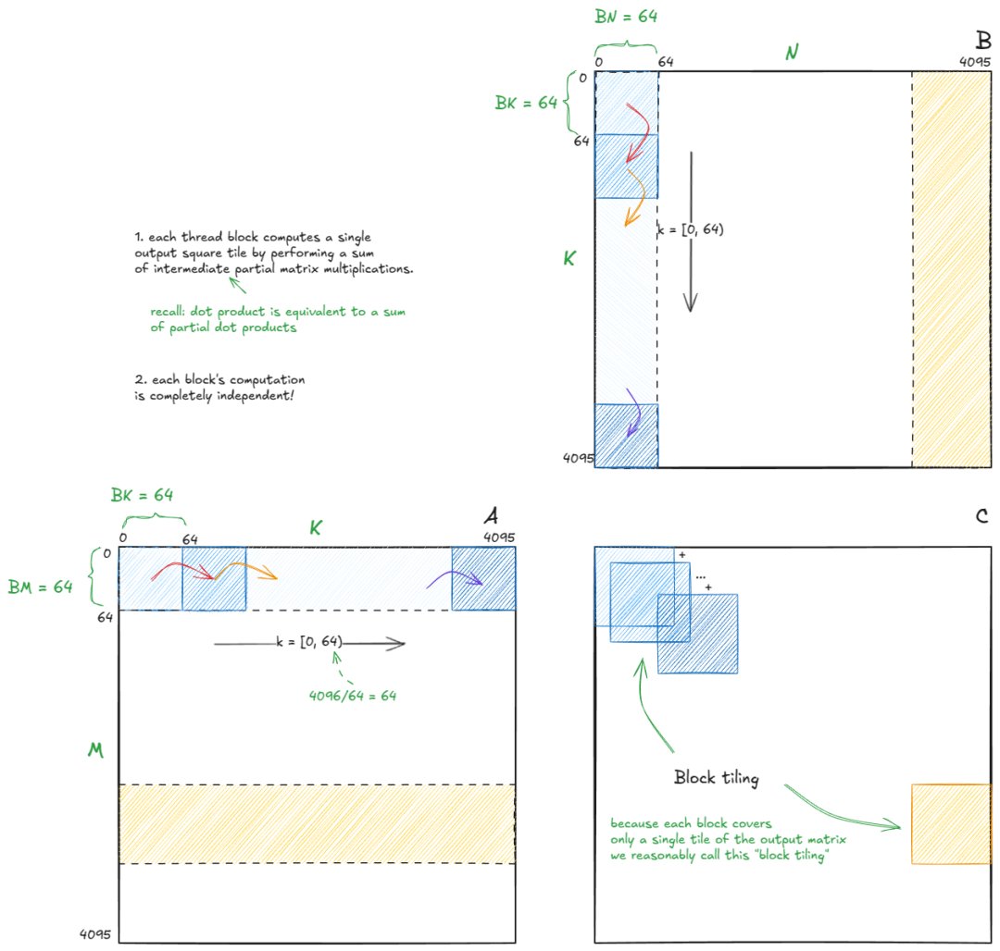
图 34：我们保持与线程束平铺算法相同的高层结构（块平铺）

💡 矩阵格式变化：

重要提示：A 仍然是行优先（row-major），但 B 现在是列优先（column-major）格式。

## 通过 TMA 异步加载到 SMEM

对于第二阶段——将数据加载到 SMEM 中——TMA 用简单得多的方式取代了复杂的线程束级加载模式。我们只需要做：


为 A 和 B 构建张量映射（tensor maps）。

触发 TMA 操作（由块中的单个线程完成）。

使用共享内存屏障进行同步。


TMA 不仅移动数据，还会自动应用 交织（swizzling），这解决了我们之前在线程束平铺中看到的银行冲突（I'll cover swizzling in detail later）。


为了形成张量映射，我们使用 cuTensorMapEncodeTiled。该函数对从 GMEM 将 A 和 B的分块传输到 SMEM 所需的所有元数据进行编码。我们需要为 A 和 B 各准备一个张量映射，但结构上它们是相同的。对于 A，我们指定：

数据类型：bf16

秩（Rank）：2（矩阵）

指针：A

形状：(K, M)（最快步长维度在前）

行步长：K * sizeof(bf16)

sA 的形状：(BK, BM)

交织模式：加载到 sA 时使用 128B 模式


接下来：
````
__shared__ barrier barA;  // 用于 A 和 B 的 SMEM 屏障
__shared__ barrier barB;
if (threadIdx.x == 0) {
    // 使用全部 128 个线程进行初始化
    init(&barA, blockDim.x);
    init(&barB, blockDim.x);
    // 使初始化的屏障对异步代理可见
    cde::fence_proxy_async_shared_cta();
}
__syncthreads();  // 确保屏障对所有线程可见
````

这里我们初始化了 SMEM 屏障，用于同步对 sA 和 sB 的写入。屏障使用所有 128 个线程初始化，因为我们期望块中的每个线程在屏障翻转为“就绪”状态前都到达屏障。


调用 cde::fence_proxy_async_shared_cta() 是 Hopper 代理内存模型（proxy memory model）的一部分。它在 CTA（块）范围内排序“异步代理”（TMA）和“通用代理”（普通线程加载/存储）之间的可见性。这里我们在初始化后立即发布它，以便异步引擎看到屏障的初始化状态。（异步拷贝的完成将由 mbarrier 自身发送信号。）


坦白说：我也不敢声称完全理解了所有内存一致性的细节——官方文档也确实没帮上什么忙。这可能值得写一篇后续文章。如果有人有学习该主题的好资料，请联系我！


在外部 K 循环中：
````
for (int block_k_iter = 0; block_k_iter < num_blocks_k; ++block_k_iter) {
    if (threadIdx.x == 0) {  // 只有一个线程启动 TMA// 该 CTA 分块在 GMEM 中的偏移量：// A: (block_k_iter * BK, num_block_m * BM)
        cde::cp_async_bulk_tensor_2d_global_to_shared(
            &sA[0], tensorMapA, block_k_iter*BK, num_block_m*BM, barA);
        // 更新屏障，设置其在翻转前必须等待的字节数：sizeof(sA)
        tokenA = cuda::device::barrier_arrive_tx(barA, 1, sizeof(sA));

        // B: (block_k_iter * BK, num_block_n * BN)
        cde::cp_async_bulk_tensor_2d_global_to_shared(
            &sB[0], tensorMapB, block_k_iter*BK, num_block_n*BN, barB);
        tokenB = cuda::device::barrier_arrive_tx(barB, 1, sizeof(sB));
    } else {
        tokenA = barA.arrive();  // 仅线程到达（不追踪字节）
        tokenB = barB.arrive();
    }
    barA.wait(std::move(tokenA));  // 阻塞直到：所有线程到达 且 TMA 完成
    barB.wait(std::move(tokenB));
````

逐步解析发生了什么（对 A 和 B 均适用）：

线程 0 通过 cp_async_bulk_tensor_2d_global_to_shared(...) 启动 TMA，指定 SMEM 目的地（sA/sB）、张量映射，以及指示源 GMEM 分块的 GMEM 偏移量。

它立即调用 barrier_arrive_tx(bar, 1, sizeof(sX))，该函数：

计数线程到达（此处为 1，来自线程 0）。

为屏障装载预期字节数，以便它知道异步拷贝何时完成。

所有其他线程调用 bar.arrive()，贡献它们的到达计数（无字节）。

每个线程随后调用 bar.wait(token)。只有当以下两个条件同时满足时，该等待才会完成：

所有 128 个线程均已到达。

异步引擎已将全部 sizeof(sX) 字节写入共享内存。

这种加载模式是标准的 Hopper 惯用法——你会在现代内核中到处看到它。


在异步拷贝期间，TMA 还使用了 128B 交织格式（swizzle format） 对数据进行了交织。

让我们花点时间拆解一下交织（Swizzling）到底意味着什么。我没能在网上找到清晰的解释，所以这是我的尝试——部分是为了你，部分是为了未来的我自己。

## 交织 (Swizzling)

让我们从一个启发性示例开始：

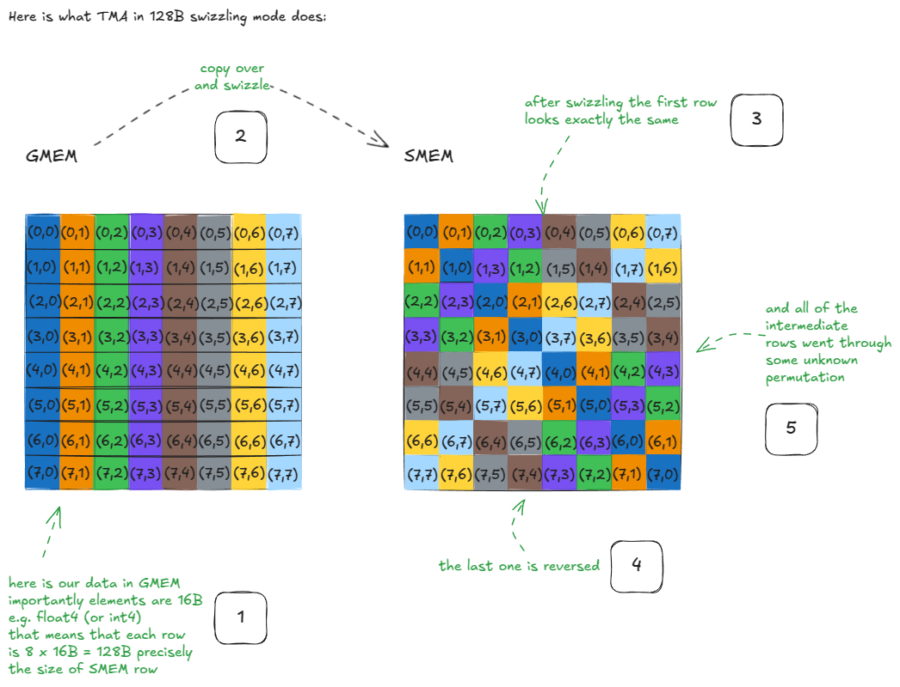
图 35：Swizzling（交织）示例


这里发生了什么？


假设我们要从原始 GMEM 矩阵的第一行加载所有元素。在 Swizzling 之后，这依然很简单：只需从 SMEM 矩阵中读取第一行即可。没什么特别的。


现在，假设我们需要原始 GMEM 矩阵的第一列。请注意，这些元素现在位于 SMEM 的对角线上。这意味着我们可以在单个周期内加载它们，因为没有两个线程会命中同一个银行（bank）——即零银行冲突。


如果没有 Swizzling，这种访问会将所有这些列元素映射到同一个银行的不同地址，产生 8 路银行冲突，并将吞吐量削减 8 倍。


同样的特性适用于任何行或列：在 Swizzling 之后，它们都可以在单个周期内获得服务！


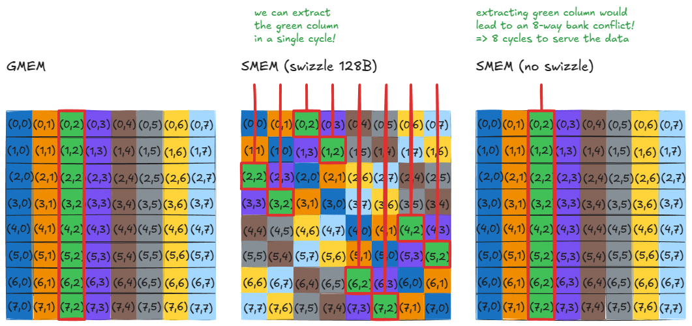
图 36：加载行或列时无银行冲突

存储操作也具有同样的特性。例如，如果你想在 SMEM 中转置一个矩阵，朴素的方法是：加载一行，然后将其作为一列写回。如果没有 Swizzling，这会导致 8 路银行冲突。


启用了 Swizzling 后，我们逃离了这个问题，但你必须在索引（indexing）时保持谨慎。

📝 注意： 当数据从 SMEM 移回 GMEM 时，TMA 会自动进行 Unswizzles（去交织）。

既然动机已经明确，让我们问这样一个问题：TMA 实际上是如何生成 Swizzle 模式的？


事实证明，答案很简单：用特定的掩码模式进行 XOR（异或）。

快速回顾一下 XOR 的真值表：

0, 0 映射为 0

0, 1 映射为 1

1, 0 映射为 1

1, 1 映射为 0

值得注意的是：当其中一个位为 1 时，XOR 会翻转另一个位。

像往常一样，我们可以在 CUTLASS 中找到答案。另一位 Simon 也对掩码模式是如何生成的给出了很好的解释 [18]——尽管没有具体说明该模式如何导致我们刚才看到的特定 Swizzle 布局。


所以剩下的两个大问题是：

XOR 掩码是如何生成的？

该掩码实际上是如何应用并产生 Swizzle 模式的？


## 生成 XOR 掩码

NVIDIA 将每种 Swizzle 模式与特定的“Swizzle 函数”关联起来：

128B Swizzle 模式关联 Swizzle<3,4,3>

64B Swizzle 模式关联 Swizzle<2,4,3>

32B Swizzle 模式关联 Swizzle<1,4,3>

让我们拆解 Swizzle<3,4,3>。随后我会分享其他的 XOR 掩码。
````
// 为了提高可读性，我将每 8 位分为一组。// Swizzle<3, 4, 3>// -> BBits = 3// -> MBase = 4// -> SShift = 3// 步骤 1. 计算 bit_msk = (1 << BBits) - 1
bit_msk = (0b00000001 << 3) - 1 = 0b00000111  
// 步骤 2. 计算 yyy_msk = bit_msk << (MBase + max(0, SShift))
yyy_msk = 0b00000111 << 7 = 0b00111000_00000000
// 步骤 3. 掩盖输入数字 (ABCDEFGH_IJKLMNOP)
masked = input_number & yyy_mask 
// 步骤 4. 向右移动 SShift (masked >> SShift)
shifted = masked >> 3 
// 步骤 5. 与原始输入进行 XOR
output = input_number ^ shifted 
````

通俗地说： Swizzle 函数查看位 GHI（第 9, 8, 7 位，从 0 开始计数）。如果其中任何一位为 1，它就会翻转对应的位 JKL（第 6, 5, 4 位）得到 WYZ。所有其他位保持不变。


让我们为 Swizzle 函数的行为建立一些直觉：

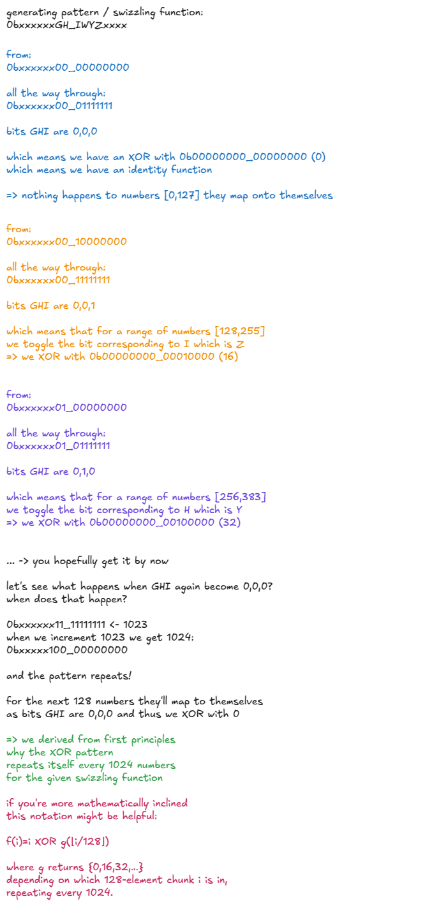
图 37：Swizzle 函数直觉图解

对于 32B 和 64B 交织模式，Swizzle 函数分别为 0bxxxxxxxx_IxxZxxxx 和 0bxxxxxxxH_IxYZxxxx。它们遵循相同的“用掩码进行 XOR”的思想，只是驱动哪些低位被翻转的控制位不同。


这一切如何联系回到我们开始时的那个启发性示例？这就是链接点：

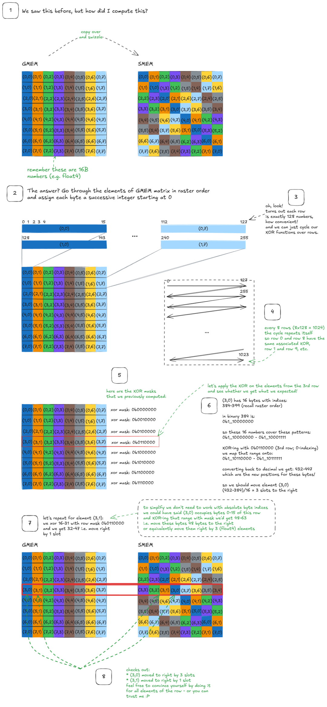
图 38：将 Swizzle 函数连接到矩阵 Swizzle 示例


这就是 Swizzling 的原因（WHY）和方法（HOW）。

## Tensor Cores（张量核心）

回到张量核心。此时，我们已经将 A 和 B 的分块从 GMEM 拉取到了 SMEM 中的 sA 和 sB。它们经过了 Swizzled 处理，准备好供张量核心消耗。


NVIDIA 暴露了几种矩阵乘加（MMA）指令：

wmma —— 线程束协作，同步（旧世代）。

mma.sync —— 线程束协作，同步（Ampere 架构）。

wgmma.mma_async —— 线程束组协作，异步（Hopper 架构）。

📝 注意： 在 CUDA 中，一个 Warp Group（线程束组） = 4 个线程束 = 128 个线程。


我们将专注于 wgmma.mma_async [19]，它是随 Hopper 引入的，目前为止最强大。它是异步的，并利用 4 个协作的线程束共同计算矩阵乘法；这正是我们选择块大小（block size）为 128 的原因。


对于 bf16 操作数，wgmma 支持 m64nNk16 形式的形状，其中 N∈{8,16,24,…,256}。在本例中我们将使用 m64n64k16，但通常较大的 N 值性能更好（前提是你有足够的寄存器和 SMEM 支持）。

📝 注意：m64n64k16 意味着张量核心一次性完成一个 64×16 乘以 16×64 的矩阵乘法。


操作数放置规则如下：sA 可以驻留在寄存器或 SMEM 中，sB 必须驻留在 SMEM 中，而累加器（BM×BN）始终位于寄存器中。


由于这对于单个线程来说寄存器太多了，累加器被划分到线程束组中的各个线程上。在我们的参考内核中，你会看到它这样初始化：
````
float d[WGMMA_N/16][8];  // d 是累加器；GEMM: D = A @ B + Dmemset(d, 0, sizeof(d));  // 初始化为全 0
````

我们设置 WGMMA_M = WGMMA_N = BM = BN = 64。计算得出：

线程束组中有 128 个线程。

每个线程持有 (64/16) \times 8 = 32 个寄存器。

总计：128×32=4096 个寄存器。 ...这恰好匹配累加器的大小（64×64=4096），只是分布在整个组中。

以下是我们将要拆解的张量核心代码片段：
````
asm volatile("wgmma.fence.sync.aligned;" ::: "memory");
wgmma64<1, 1, 1, 0, 0>(d, &sA[0], &sB[0]);
wgmma64<1, 1, 1, 0, 0>(d, &sA[WGMMA_K], &sB[WGMMA_K]);
wgmma64<1, 1, 1, 0, 0>(d, &sA[2*WGMMA_K], &sB[2*WGMMA_K]);
wgmma64<1, 1, 1, 0, 0>(d, &sA[3*WGMMA_K], &sB[3*WGMMA_K]);
asm volatile("wgmma.commit_group.sync.aligned;" ::: "memory");
asm volatile("wgmma.wait_group.sync.aligned %0;" ::"n"(0) : "memory");
````

📝 注释：

某些 Hopper 指令未在 CUDA C++ 中暴露，所以我们使用 asm(...); 嵌入内联 PTX。

::: "memory" 是内存破坏（memory clobber），它防止编译器在 asm 语句周围进行内存优化，提示编译器“不要将周围的内存访问移动到此点之后”。

volatile 告诉编译器该汇编块绝不能被删除或提升。


首先拆解包围实际矩阵乘法调用的“书架指令”（wgmma.fence, commit_group, wait_group）：

wgmma.fence.sync.aligned; —— 文档解释得很清楚：“在先前对任何线程束组寄存器的访问与随后由 wgmma.mma_async 指令对相同寄存器的访问之间建立顺序。”

实际上，线程束组的所有四个线程束都必须在第一个 wgmma.mma_async 之前执行此 fence。

之后就没问题了。即使累加器寄存器在这四个 wgmma 调用中不断更新，我们也不需要在中间添加更多的 fence——对于累加到相同寄存器的相同形状的背靠背 MMA，有一个特殊的异常规则。

wgmma.commit_group —— 另一种样板操作：将之前所有未提交的操作提交到一个“wgmma 组”中。

wgmma.wait_group 0 —— 意味着：在之前的所有组完成之前不要继续。这表示“等一下，直到那四个 MMA 完成，结果实际存入累加器寄存器为止”。

所以标准的节奏是：Fence → 发射一批异步 MMA → Commit 它们 → Wait 等待它们完成。


关于 wgmma 本身，wgmma64 函数是内联 PTX 调用的封装： wgmma.mma_async.sync.aligned.m64n64k16.f32.bf16.bf16


操作码的结构使其含义非常透明：f32 是累加器数据类型，bf16 是输入矩阵 sA 和 sB 的数据类型。语义是通常的融合乘加：D=A@B+D。


以下是为什么我们需要 4 个 wgmma 调用的解释：


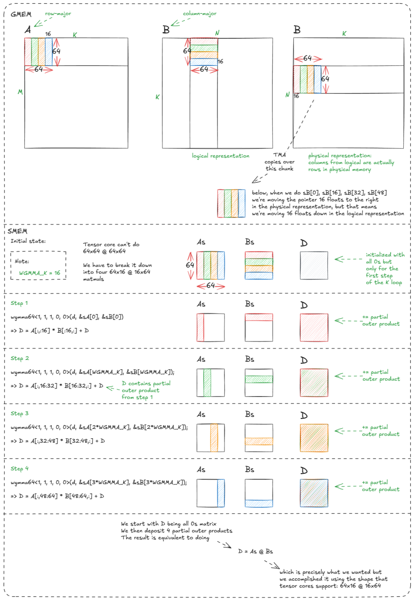
图 39：执行四个 64x16 @ 16x64 的 wgmma 调用等同于执行一个 64x64 @ 64x64 的矩阵乘法


这一部分稍微令人费解的是列优先（column-major）表示法：即 sB[0] … sB[48] 是如何最终映射到正确的逻辑位置/切片的。


但核心结论是：我们之前辛苦应对的大部分线程束平铺（warp-tiling）和线程平铺（thread-tiling）的复杂性，现在都被硬件抽象掉了。过去需要跨线程束进行精心编排的工作，现在已简化为几条样板指令和几个声明式的 wgmma 调用。


即便如此，这仅仅是起点。我们仍然在浪费 TMA 和张量核心（tensor core）的周期：

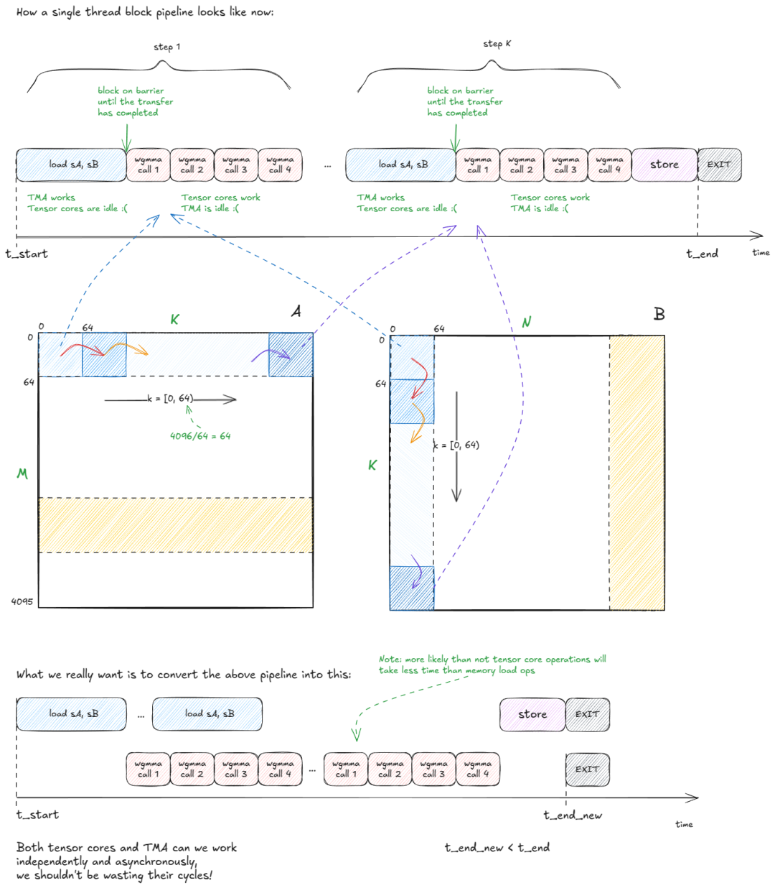
图 40：我们在浪费 TMA 和 TC 周期——我们可以做得更好

解决周期浪费的方法是流水线化（pipelining）计算和数据移动。具体来说，我们将驻留在 SMEM 的分块 sA 和 sB 变成一个长度为（比如）5 的分块队列。


然后我们将工作分配给两个线程束组：

一个线程束组作为 Producer（生产者），负责通过将 A 和 B 的新分块流式传输到队列中，使 TMA 保持忙碌。

另一个线程束组作为 Consumer（消费者），从队列中提取数据以使张量核心保持饱和。


这需要协调。我们使用的机制是 SMEM 屏障队列，队列中的每个槽位都有一对 full[i]/empty[i] 屏障来同步生产者和消费者。
````
// 屏障队列
__shared__ barrier full[QSIZE], empty[QSIZE];
// 使用可用的最大 MMA 形状constexpr int WGMMA_M = 64, WGMMA_K = 16, WGMMA_N=BN;
````

初始化与之前类似：
````
if (threadIdx.x == 0) {
  for (int i = 0; i < QSIZE; ++i) {
      // 在本例中，消费者数量 num_consumers == 1；// 包含来自消费者线程束组（wg）的 128 个线程 + 1 个生产者线程
      init(&full[i], num_consumers * 128 + 1);
      init(&empty[i], num_consumers * 128 + 1);
  }
  cde::fence_proxy_async_shared_cta();  // 与之前相同
}
__syncthreads();  // 与之前相同
````

有两点需要注意：

我们升级到了更大的张量核心（tensor core）MMA（从 m64n64k16 变为 m64nBNk16），因为经验表明这有助于最大化计算吞吐量。

由于队列是多槽位的，屏障初始化必须循环遍历所有条目。


以下是核心逻辑： 在生产者（producer，wg_idx = 0）中，一个线程编排向队列的 TMA 拷贝。它使用 empty[qidx].wait() 阻塞直到一个缓冲区槽位变为空闲，然后为 sA 和 sB 发布 cp_async_bulk_tensor_2d_global_to_shared 指令。最后，它通过 barrier_arrive_tx 发送完成信号，该信号将屏障与拷贝的字节数绑定。 在消费者（consumer，wg_idx > 0）中，所有线程首先将每个队列槽位标记为“empty”（准备好被填充）。然后，对于每个 K 步迭代，它们等待 full[qidx]，在该缓冲区上运行张量核心 MMA，完成后再次将该槽位标记为“empty”。
````
// 生产者if (wg_idx == 0) {
  // wg_idx = threadIdx.x / 128if (tid == 0) {  // 只有线程 0 发布 TMA 调用int qidx = 0;  // 循环缓冲区索引for (int block_k_iter = 0; block_k_iter < num_blocks_k; ++block_k_iter, ++qidx) {
            if (qidx == QSIZE) qidx = 0;  // 绕回// 等待直到该缓冲区被标记为 empty（准备好写入）
            empty[qidx].wait(empty[qidx].arrive());
            // 拷贝 A 和 B 的分块
            cde::cp_async_bulk_tensor_2d_global_to_shared(
                &sA[qidx*BK*BM], tensorMapA, block_k_iter*BK, num_block_m*BM, full[qidx]);
            cde::cp_async_bulk_tensor_2d_global_to_shared(
                &sB[qidx*BK*BN], tensorMapB, block_k_iter*BK, num_block_n*BN, full[qidx]);
            // 为屏障打上预期字节数的标记（非阻塞）
            barrier::arrival_token _ = cuda::device::barrier_arrive_tx(
              full[qidx], 1, (BK*BN+BK*BM)*sizeof(bf16));
        }
    }
} else {
    // 消费者线程束组for (int i = 0; i < QSIZE; ++i) {
        // 最初，所有缓冲区都被视为 empty；准备写入// 所有 128 个消费者线程在每个屏障上到达
        barrier::arrival_token _ = empty[i].arrive();
    }
    // 分布式累加器寄存器，初始化为零float d[BM/WGMMA_M][WGMMA_N/16][8];
    memset(d, 0, sizeof(d));
    int qidx = 0;
    for (int block_k_iter = 0; block_k_iter < num_blocks_k; ++block_k_iter, ++qidx) {
        if (qidx == QSIZE) qidx = 0;  // 绕回// 等待直到 TMA 完成该缓冲区的填充
        full[qidx].wait(full[qidx].arrive());
        // 张量核心核心循环
        warpgroup_arrive();  // 围绕 PTX 样板代码的便捷封装#pragma unroll  // 编译器提示（我们在 PTX/SASS 章节见过）// 提交计算 sA @ sB 所需数量的张量核心操作（见图示）for (int m_it = 0; m_it < BM/WGMMA_M; ++m_it) {
            bf16 *wgmma_sA = sA + qidx*BK*BM + BK*m_it*WGMMA_M;
            #pragma unrollfor (int k_it = 0; k_it < BK/WGMMA_K; ++k_it) {
                wgmma<WGMMA_N, 1, 1, 1, 0, 0>(
                  d[m_it], &wgmma_sA[k_it*WGMMA_K], &sB[qidx*BK*BN + k_it*WGMMA_K]);
            }
        }
        warpgroup_commit_batch();
        warpgroup_wait<0>();
        // 所有 128 个消费者线程将缓冲区标记为已消耗，以便生产者重用
        barrier::arrival_token _ = empty[qidx].arrive();
    }
    // 最后：将累加器 d 写回输出矩阵 C
}
````

可视化图解应该会让这一切变得清晰得多：

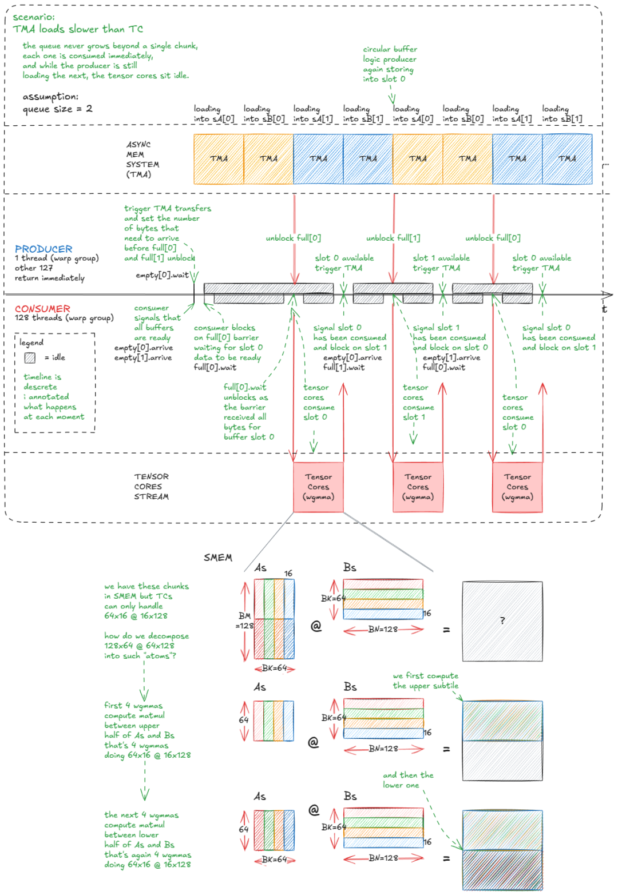
图 41：更高效的 TC/TMA 流水线：生产者线程束组（producer warp-group）将分块流式传输到循环缓冲区；消费者线程束组（consumer warp-group）将分块排干到张量核心（tensor cores）中。


一个自然的调整是将输出分块（output tile）从 128×128 增加到 128×256。问题在于，在这种尺寸下，单个消费者线程束组中的每个线程累加器分片（accumulator shard）会变得太大——每个线程仅为了累加器就需要 256 个 fp32 寄存器，这超出了每个线程的寄存器预算（并会触发寄存器溢出（spilling）到设备内存——这对性能非常不利）。


解决方法是增加另一个消费者线程束组，这样累加器就可以分布在两个组而不是一个组中。我们保留单个生产者（用于驱动 TMA），并以 3×128 = 384 个线程启动该块/CTA：

WG0：生产者（TMA）

WG1：消费者 A（计算 128×256 分块的上半部分）

WG2：消费者 B（计算下半部分）


每个消费者拥有输出矩阵中 64×256 的半个分块，因此每个线程的累加器占用空间减半，从而避免了溢出。


以下是现在矩阵乘法的执行方式：

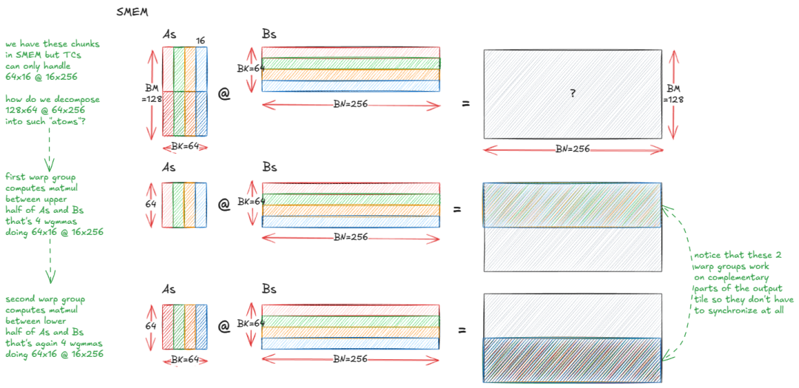

图 42：两个消费者线程束组（warp groups）允许我们将分块从 128x128 增加到 128x256 且不产生寄存器溢出。


下一个重要想法是，我们同样可以隐藏写入输出分块的延迟：

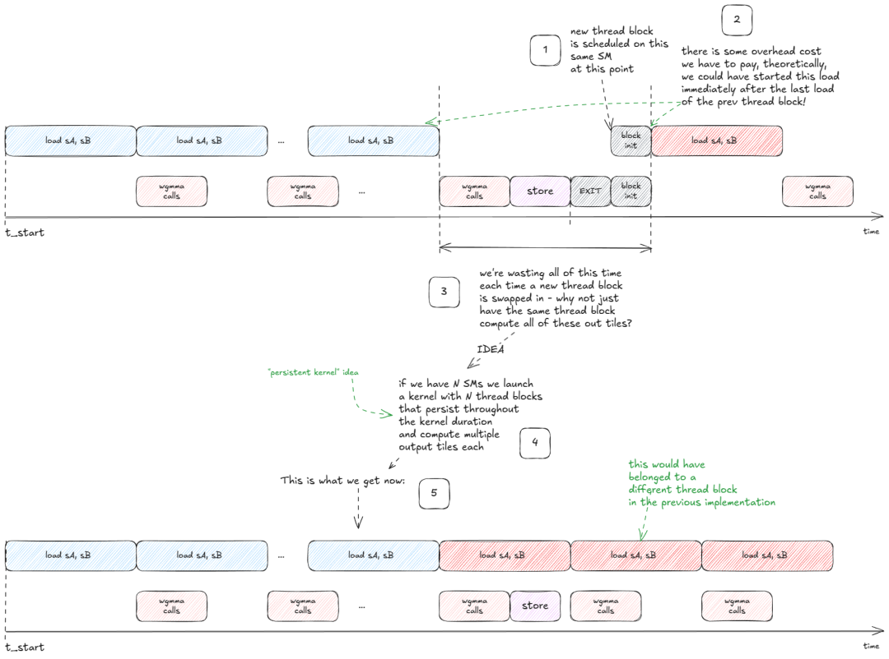

图 43：持久化内核（Persistent kernels）：通过为每个 SM 启动一个处理多个分块的长寿命块（block），使输出存储与传入加载相互重叠。


💡 持久化内核 (Persistent kernels) 持久化内核启动少量且固定数量的线程块（通常每个 SM 一个），并使它们在整个工作负载期间保持活跃。每个块不再是为每个分块启动一次，而是运行一个内部循环，从队列中拉取新分块直到工作完成。

这自然引出了一个问题：每个 SM 应该处理输出分块中的哪一部分子集，以及按什么顺序处理？


这种调度策略看起来是什么样的？ 让我们从一个简单的模型开始来推导各种选项：

输出分块总数：64。

SM 数量：10。

因此，每个 SM 平均需要处理约 6.4 个块。


第一种尝试可能如下所示：

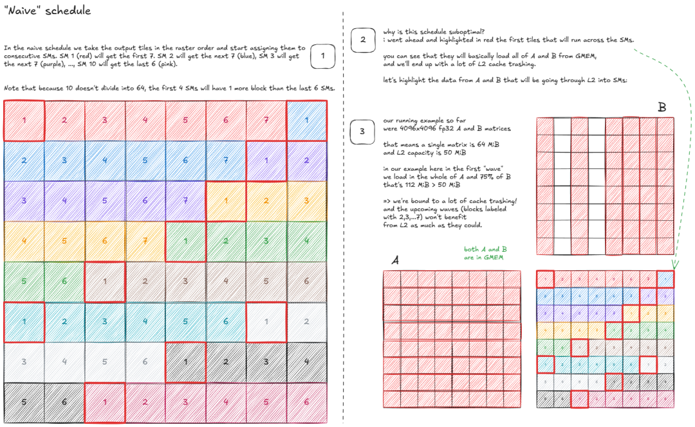

图 45：块状缓存感知调度 (Block-wise cache-aware schedule)


但我们能做得更好吗？令人惊讶的是，答案是肯定的——通过使用空间填充曲线（space-filling curve）：


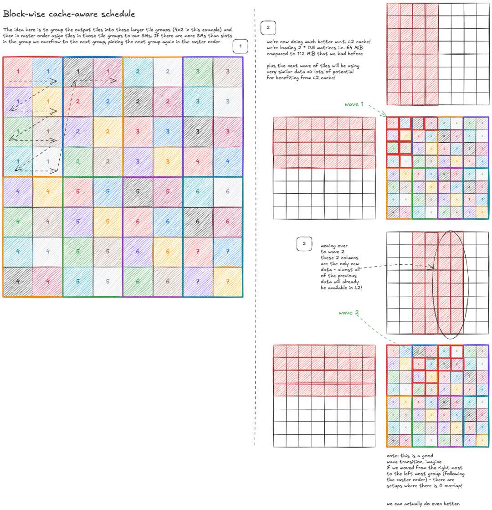


图 45：块状缓存感知调度


但我们能做得更好吗？令人惊讶的是，答案是肯定的——通过使用空间填充曲线（space-filling curve）：


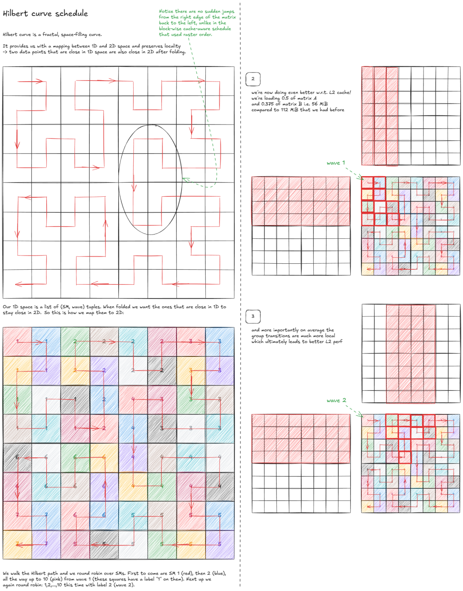

图 46：希尔伯特曲线调度（Hilbert-curve schedule）


我将深入探讨的最后一个想法是利用 Hopper 架构新的集群级（cluster-level） CUDA 执行模型来减少 L2/GMEM 流量：

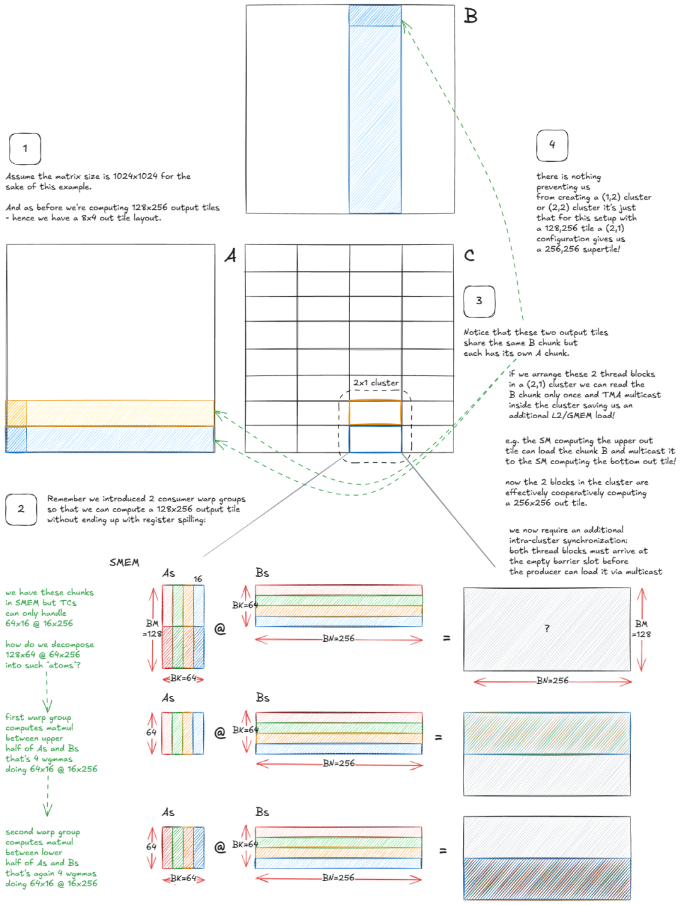

图 47：使用线程块集群（thread block clusters）来减少 L2/GMEM 加载次数。


关键观察点在于，集群内的多个 SM 可以直接共享它们的 SMEM（通过 DSMEM），这让我们可以将集群视为一种“超级 SM（super-SM）”。


从调度角度来看，并没有发生根本性的变化：不再是每个 SM 处理各自独立的输出分块，而是整个集群协作处理一个更大的“超级分块”。算法的机制保持不变，但现在这些 SM 协调加载并复用彼此的数据。


既然希尔伯特曲线遍历已经被设计为最大化局部性，那么“超级 SM”可以遵循相同的遍历模式——只是在更粗的粒度上进行。


最后，为了超越 cuBLAS，我们必须收紧同步本身。到目前为止，我们在屏障（barriers）的 arrive/wait 调用上一直很浪费。


例如，消费者线程实际上不需要在 full[qidx] 上发出到达信号（signal arrival）。唯一重要的条件是“所有字节已到达”。放弃这些冗余的到达信号在每次迭代中可以节省 256 个令牌（tokens）。对于 empty[qidx] 也是如此：一旦 tid == 0 的消费者到达，生产者就可以安全地开始填充，因为消费者端（wgmma）在所有线程中是同步执行的。


一些在实践中累积起来的额外底层技巧（本着 O(NR) 的精神）：

重新平衡寄存器：使用 asm volatile("setmaxnreg.{inc,dec}.sync.aligned.u32 %0;\n" : : "n"(RegCount)); 将寄存器预算从生产者线程束组（轻量级）转移到消费者线程束组（wgmma 期间的重度使用者）。

避免写出时污染缓存：要么使用 __stwt 绕过 L1/L2，或者更好的是，执行异步存储：先溢出到 SMEM，然后让 TMA 异步拷贝到 GMEM。这实现了写回与计算的重叠，就像我们在输入端所做的那样。

跳过冗余初始化：不再将累加器寄存器清零，而是调整张量核心序列，使第一个 MMA 执行 C = A*B，随后的 MMA 执行 C = A*B + C。


作为参考，以下是性能数据（来自 Pranjal 的博客），展示了每个想法是如何叠加在之前想法之上的：


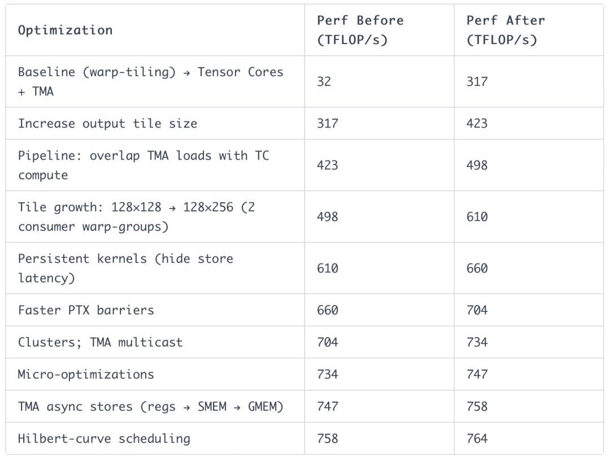

此外，Aroun 提交了一个 PR，使用 stmatrix 方法优化了异步存储，性能又提升了 +1%。又有几座核反应堆被省下来了。


## 结语


我们从解构 GPU 硬件本身开始，重点关注内存分级体系——为 GMEM、SMEM 和 L1 建立了心理模型，并将其与 CUDA 编程模型联系起来。在此过程中，我们还研究了“光速”（理论性能极限），以及它如何受限于功耗——硬件现实就这样渗透进了我们的模型中。


从那里开始，我们沿堆栈向上移动：学习如何通过 PTX/SASS 与硬件对话，以及如何引导编译器生成我们真正想要的指令。


我们一路上掌握了核心概念——分块量化（tile quantization）和波次量化（wave quantization）、占用率（occupancy）、指令级并行（ILP）、屋顶线模型（roofline model）——并围绕基础的等效性建立了直觉：点积可以看作是部分外积之和，或是点积的部分和；以及为什么正方形分块能产生更高的算术强度。

有了这些基础，我们构建了一个近乎 SOTA 的内核（线程束平铺），仅依靠 CUDA 核心、寄存器和共享内存就榨取出了极致性能。


最后，我们跨入了 Hopper 的世界：TMA、交织（swizzling）、张量核心与 wgmma 指令、异步加载/存储流水线、希尔伯特曲线等调度策略、具有 TMA 多播功能的集群、更快的 PTX 屏障等等。


我将以贯穿这一整个系列的信念来收尾：计算机是可以被理解的。

💡 保持联系： 如果你在文章中发现任何错误，请私信我——欢迎在 X 或 LinkedIn 上给我留言，或者通过匿名反馈告诉我也行。


## 致谢 (Acknowledgements)

非常感谢 Hyperstack 在过去一年中为我的实验提供 H100 GPU！ 感谢我的朋友 Aroun Demeure（Magic 公司的 GPU 与 AI 专家，曾任 Apple 和 Imagination 的 GPU 架构师）和 Mark Saroufim（PyTorch 团队）阅读了本博文的预发布版本并提供反馈！

