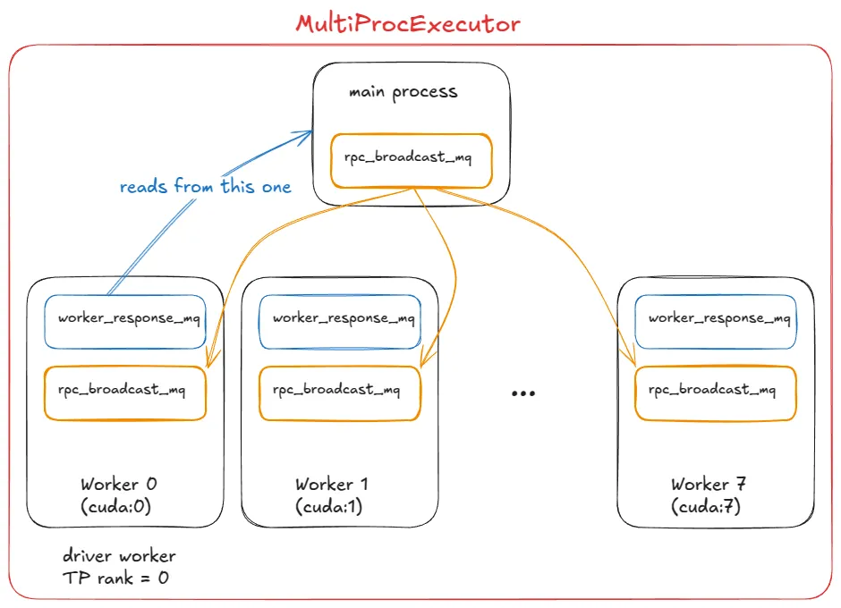
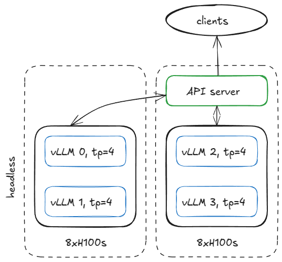
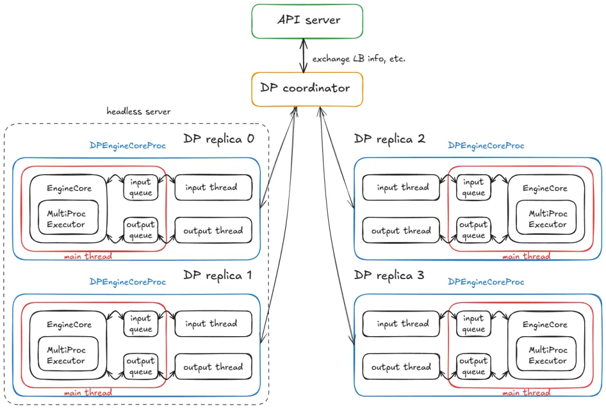
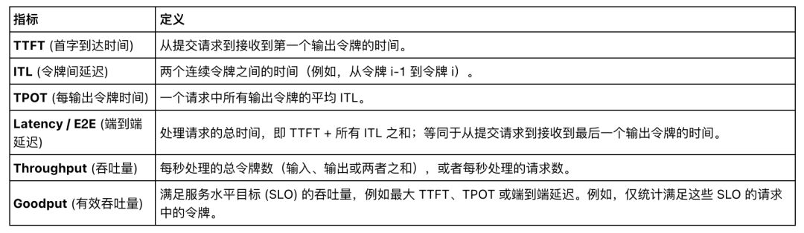
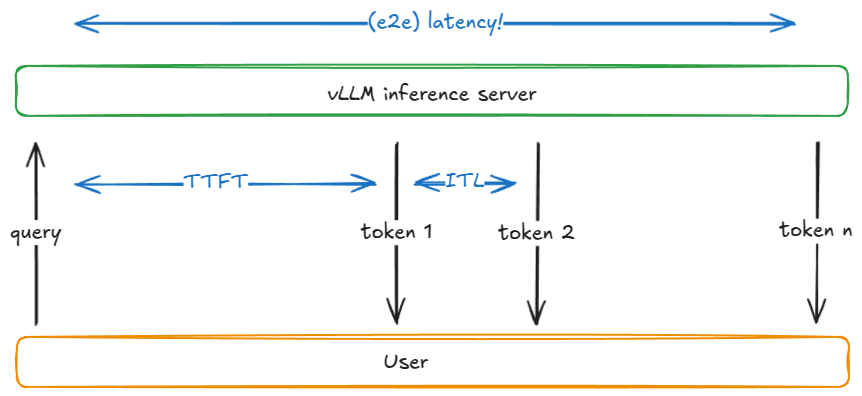
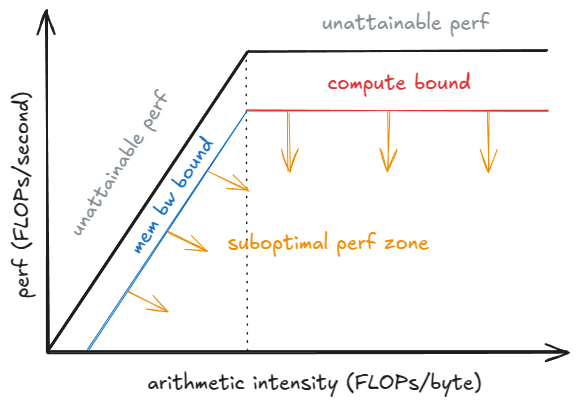

## 引言
在这篇文章中，我将逐步介绍构成现代高吞吐量 LLM 推理系统的所有核心系统组件和高级特性。特别地，我将对 vLLM [1] 的工作原理进行拆解。


本文是系列文章的二篇。前篇由浅入深，然后逐层深入（遵循倒金字塔方法），以便你能够建立起整个系统的准确高层心理模型，而不会沉溺于细节之中。


本篇将深入探讨特定的子系统。

前篇参考：vLLM 内部：高吞吐量 LLM 推理系统解剖


本文是文章：Inside vLLM: Anatomy of a High-Throughput LLM Inference System 的翻译版。点击文末 “阅读原文”跳转英文原文。

## 01 从 UniProcExecutor 到 MultiProcExecutor

有了核心技术，我们现在可以谈谈规模扩展（scaling up）。


假设你的模型权重已无法装入单个 GPU 的 VRAM 中。

第一个选项是使用张量并行（例如 TP=8）将模型分片到同一节点上的多个 GPU。如果模型仍然装不下，下一步就是跨节点的流水线并行（PP）。


📝注意：

节点内带宽显著高于节点间带宽，这就是为什么张量并行（TP）通常优于流水线并行（PP）的原因。（PP 传输的数据量也确实比 TP 少。）

我没有涵盖专家并行（EP），因为我们关注的是标准 Transformer 而非 MoE，也没有涵盖序列并行，因为 TP 和 PP 是实践中最常用的。


在此阶段，我们需要多个 GPU 进程（工作线程）和一个编排层来协调它们。这正是 MultiProcExecutor 所提供的。



这在 vLLM 中是如何运作的：

MultiProcExecutor 初始化一个 rpc_broadcast_mq 消息队列（底层通过共享内存实现）。

构造函数遍历 world_size（例如 TP=8 -> world_size=8），并通过 WorkerProc.make_worker_process 为每个 rank 生成一个守护进程。

对于每个工作进程，父进程首先创建一个读取和写入管道（pipe）。

新进程运行 WorkerProc.worker_main，实例化一个工作线程（经历与 UniprocExecutor 相同的“初始化设备”、“加载模型”等过程）。

每个工作进程确定自己是驱动程序（TP 组中的 rank 0）还是普通工作进程。每个工作进程建立两个队列：

rpc_broadcast_mq（与父进程共享），用于接收工作。

worker_response_mq，用于将响应发送回父进程。

在初始化期间，每个子进程通过管道将其 worker_response_mq 句柄发送给父进程。一旦全部接收完毕，父进程取消阻塞——协调完成。

工作进程随后进入繁忙循环，阻塞在 rpc_broadcast_mq.dequeue。当工作项到达时，它们执行该项（就像在 UniprocExecutor 中一样，但现在是带有 TP/PP 特定分片的工作）。结果通过 worker_response_mq.enqueue 发回。

在运行时，当请求到达时，MultiProcExecutor 将其入队到 rpc_broadcast_mq（非阻塞）发给所有子进程工作线程。然后它在指定的输出 rank 的 worker_response_mq.dequeue 上等待，以收集最终结果。


从引擎的角度来看，没有任何变化——所有这些多进程复杂性都通过调用模型执行器的 execute_model 被抽象掉了。

在 UniProcExecutor 情况下：execute_model 直接导致在工作线程上调用 execute_model。

在 MultiProcExecutor 情况下：execute_model 通过 rpc_broadcast_mq 间接导致在每个工作线程上调用 execute_model。


至此，我们可以使用相同的引擎接口运行资源允许范围内的任意大型模型。


下一步是横向扩展（scale out）：启用数据并行（DP > 1）在节点间复制模型，添加轻量级的 DP 协调层，引入副本间的负载均衡，并在前面放置一个或多个 API 服务器以处理传入流量。


## 02 分布式系统服务 vLLM

设置服务基础设施有很多种方法，为了具体起见，这里有一个例子：假设我们有两个 H100 节点，并希望跨节点运行四个 vLLM 引擎。


如果模型需要 TP=4，我们可以这样配置节点。



2 个 8xH100 节点（1 个无头节点，1 个 API 服务器）的服务器配置


在第一个节点上，以无头（headless）模式（不启动 API 服务器）运行引擎，参数如下：
````
vllm serve <model-name> \
  --tensor-parallel-size 4 \
  --data-parallel-size 4 \
  --data-parallel-size-local 2 \
  --data-parallel-start-rank 0 \
  --data-parallel-address <master-ip> \
  --data-parallel-rpc-port 13345 \
  --headless
````

在另一个节点上运行相同的命令，并进行细微调整：取消 --headless 并修改数据并行（DP）起始秩（rank）：
````
vllm serve <model-name> \
  --tensor-parallel-size 4 \
  --data-parallel-size 4 \
  --data-parallel-size-local 2 \
  --data-parallel-start-rank 2 \
  --data-parallel-address <master-ip> \
  --data-parallel-rpc-port 13345
````

📝注意：

这假设网络已配置好，以便所有节点都能访问指定的 IP 和端口。


这在 vLLM 中是如何运作的？

在无头服务器节点上

在无头节点上，CoreEngineProcManager 会启动 2 个进程（根据 --data-parallel-size-local），每个进程运行 EngineCoreProc.run_engine_core。这些函数中的每一个都会创建一个 DPEngineCoreProc（即引擎核心），然后进入繁忙循环。


DPEngineCoreProc 初始化其父类 EngineCoreProc（EngineCore 的子类），该子类会：

创建 input_queue 和 output_queue (queue.Queue)。

使用 DEALER ZMQ 套接字（异步消息库）与另一个节点上的前端进行初始握手，并接收协调地址信息。

初始化 DP 组（例如使用 NCCL 后端）。

使用 MultiProcExecutor 初始化 EngineCore（如前所述，在 4 个 GPU 上实现 TP=4）。

创建一个 ready_event (threading.Event)。

启动一个输入守护线程，运行 process_input_sockets(..., ready_event)。同样启动一个输出线程。

仍在主线程中，等待 ready_event，直到跨越 2 个节点的所有 4 个进程中的所有输入线程都完成了协调握手，最终执行 ready_event.set()。

一旦解除阻塞，向前端发送一条包含元数据的“就绪（ready）”消息（例如分页 KV 缓存内存中可用的 num_gpu_blocks）。

随后主线程、输入线程和输出线程进入各自的繁忙循环。


简而言之： 我们最终得到了 4 个子进程（每个 DP 副本一个），每个进程运行主线程、输入线程和输出线程。它们与 DP 协调器和前端完成协调握手，然后每个进程的三个线程都在稳态繁忙循环中运行。




当前的稳态：

输入线程 —— 阻塞在输入套接字上，直到 API 服务器路由过来一个请求；收到请求后，它解码载荷，通过 input_queue.put_nowait(...) 将工作项入队，然后返回继续阻塞套接字。

主线程 —— 在 input_queue.get(...) 时被唤醒，将请求喂给引擎；MultiProcExecutor 运行前向传播并将结果入队到 output_queue。

输出线程 —— 在 output_queue.get(...) 时被唤醒，将结果发回 API 服务器，然后恢复阻塞。


其他机制：

DP 波次计数器（DP wave counter） —— 系统跟踪“波次（waves）”；当所有引擎变为空闲时，它们进入静默状态，当新工作到达时计数器增加（对协调/指标很有用）。

控制消息 —— API 服务器发送的不只是推理请求（例如终止请求以及实用/控制 RPC）。

同步步进（Dummy steps for lockstep） —— 如果任何一个 DP 副本有工作，所有副本都会执行一个前向步进；没有请求的副本执行虚拟步进以参与所需的同步点（避免阻塞活跃副本）。

同步说明： 这实际上仅对 MoE 模型是必需的，因为专家层形成 EP 或 TP 组，而注意力层仍是 DP。目前 DP 总是这样做——这只是因为“内置”非 MoE DP 的用途有限，因为你完全可以运行多个独立的 vLLM，并以常规方式在它们之间进行负载均衡。


在 API 服务器节点上

我们实例化一个 AsyncLLM 对象（LLM 引擎的 asyncio 封装）。在内部，这会创建一个 DPLBAsyncMPClient（数据并行、负载均衡、异步、多进程客户端）。


在 MPClient 的父类中，运行 launch_core_engines 函数并：

创建用于启动握手的 ZMQ 地址（如在无头节点上所见）。

生成一个 DPCoordinator 进程。

创建一个 CoreEngineProcManager（与无头节点上的相同）。


在 AsyncMPClient（MPClient 的子类）内部，我们：

创建一个 outputs_queue (asyncio.Queue)。

创建一个 asyncio 任务 process_outputs_socket，它与所有 4 个 DPEngineCoreProc 的输出线程通信（通过输出套接字），并写入 outputs_queue。

随后，AsyncLLM 的另一个 asyncio 任务 output_handler 从此队列中读取数据，并最终将信息发送到 create_completion 函数。


在 DPAsyncMPClient 内部，我们创建一个 asyncio 任务 run_engine_stats_update_task，它与 DP 协调器进行通信。


DP 协调器 在前端（API 服务器）和后端（引擎核心）之间起中介作用。它：

定期将负载均衡信息（队列大小、等待/运行中的请求）发送到前端的 run_engine_stats_update_task。

通过动态改变引擎数量来处理来自前端的 SCALE_ELASTIC_EP 命令（仅适用于 Ray 后端）。

向后端发送 START_DP_WAVE 事件（由前端触发），并向回报告波次状态更新。


综上所述，前端（AsyncLLM）运行多个 asyncio 任务（记住：是并发的，不是并行的）：

一类任务通过 generate 路径处理输入请求（每个新的客户端请求都会生成一个新的 asyncio 任务）。

两个任务（process_outputs_socket，output_handler）处理来自底层引擎的输出消息。

一个任务（run_engine_stats_update_task）维持与 DP 协调器的通信：发送波次触发器、轮询负载均衡状态，并处理动态扩缩容请求。


最后，主服务器进程创建一个 FastAPI 应用，并挂载诸如 OpenAIServingCompletion 和 OpenAIServingChat 之类的端点，暴露出 /completion、/chat/completion 等接口。整个堆栈通过 Uvicorn 进行服务。


总结：完整的请求生命周期！


你从终端发送请求：
````
curl -X POST http://localhost:8000/v1/completions -H "Content-Type: application/json" -d '{
  "model": "TinyLlama/TinyLlama-1.1B-Chat-v1.0",
  "prompt": "The capital of France is",
  "max_tokens": 50,
  "temperature": 0.7
}'
````

接下来发生的事情：

请求命中 API 服务器上 OpenAIServingCompletion 的 create_completion 路由。

该函数异步对提示词进行分词，并准备元数据（请求 ID、采样参数、时间戳等）。

随后调用 AsyncLLM.generate，它遵循与同步引擎相同的流程，最终调用 DPAsyncMPClient.add_request_async。

这反过来调用 get_core_engine_for_request，根据 DP 协调器的状态在引擎之间进行负载均衡（选择得分最低/负载最低的一个：score = len(waiting) * 4 + len(running)）。

ADD 请求被发送到所选引擎的 input_socket。

在该引擎处：

提醒： step() 会调用调度器、模型执行器（反过来可以是 MultiProcExecutor！）等。我们已经见过这些了！

输入线程 —— 取消阻塞，从输入套接字解码数据，并为向主线程提供一个 input_queue 中的工作项。

主线程 —— 在 input_queue 上取消阻塞，将请求添加到引擎，并反复调用 engine_core.step()，将中间结果入队到 output_queue，直到满足停止条件。

输出线程 —— 在 output_queue 上取消阻塞，并通过输出套接字发回结果。


这些结果触发 AsyncLLM 的输出 asyncio 任务（process_outputs_socket 和 output_handler），这些任务将令牌传回 FastAPI 的 create_completion 路由。

FastAPI 附加上元数据（结束原因、logprobs、使用信息等），并通过 Uvicorn 向你的终端返回一个 JSONResponse！


就这样，你的补全请求返回了——整个分布式机制都隐藏在一个简单的 curl 命令后面！:) 太有趣了！！！


📝附加说明：

当添加更多 API 服务器时，负载均衡在操作系统/套接字层处理。从应用程序的角度来看，没有显著变化——复杂性被隐藏了。

使用 Ray 作为 DP 后端，你可以暴露一个 URL 端点 (/scale_elastic_ep)，从而实现引擎副本数量的自动增减。


## 03 基准测试与自动调优 —— 延迟 vs 吞吐量

到目前为止，我们一直在分析“气体颗粒”——请求如何在引擎/系统中流动的内部细节。现在是时候放大视角，将系统作为一个整体来看待，并问一个问题：我们如何衡量推理系统的性能？


在最高层面上，有两个相互竞争的指标：


延迟（Latency） —— 从提交请求到返回令牌的时间。

吞吐量（Throughput） —— 系统每秒能生成/处理的令牌或请求数量。


延迟对于交互式应用最重要，因为用户正在等待响应。

吞吐量在离线工作负载中更重要，例如预训练/后训练运行中的合成数据生成、数据清洗/处理，以及一般的离线批处理推理任务。


在解释为什么延迟和吞吐量会相互竞争之前，让我们先定义几个常见的推理指标：




这里有一个简化模型，用以解释这两个指标的竞争本质。


假设： 权重 I/O（而非 KV 缓存 I/O）占据主导地位；即我们正在处理短序列。


当观察批次大小B 如何影响单个解码步进时，权衡变得清晰。随着 B 下降趋向于 1，ITL 会降低：每步的工作量减少，令牌不会与其他令牌“竞争”。随着 B 上升趋向于无穷大，ITL 会升高，因为我们每步执行的 FLOPs 更多——但由于权重 I/O 被分摊到了更多令牌上，吞吐量会提高（直到达到峰值性能）。


屋顶模型（Roofline Model）有助于理解这一点：在达到饱和批次大小 B_sat 之前，步进时间由 HBM 带宽主导（将权重层层流式传输到片上内存中），因此步进延迟几乎是平坦的——计算 1 个令牌与 10 个令牌耗时相近。超过 B_sat 后，内核变为计算受限型（compute-bound），步进时间大致随 B 增长；每个额外的令牌都会增加 ITL。




📝注意：

为了更严谨，我们必须考虑内核自动调优（kernel auto-tuning）：随着 B 增长，运行库可能会切换到针对该形状更高效的内核，从而改变实现的性能 P_kernel。步进延迟为 t = FLOPs_step / P_kernel，其中 FLOPs_step 是步进中的工作量。你可以看到，当 P_kernel 达到 P_peak 时，每步更多的计算将直接导致延迟增加。

## 04 如何在 vLLM 中进行基准测试

vLLM 提供了 vllm bench {serve,latency,throughput} 命令行界面（CLI），它封装了 vllm/benchmarks/{server,latency,throughput}.py。


以下是这些脚本的功能：

latency —— 使用短输入（默认 32 令牌）并采样 128 个输出令牌，配合小批次（默认 8）。它运行多次迭代并报告该批次的端到端（e2e）延迟。

throughput —— 一次性提交一组固定的提示词（默认：1000 个 ShareGPT 样本，即 QPS=Inf 模式），并报告整个运行过程中的输入/输出/总令牌数以及每秒请求数。

serve —— 启动一个 vLLM 服务器，并通过从泊松（Poisson，或更普遍的 Gamma）分布中采样请求到达间隔时间来模拟真实世界的工作负载。它在一个时间窗口内发送请求，测量我们讨论过的所有指标，并可以可选地强制执行服务器端最大并发数（通过信号量，例如限制服务器为 64 个并发请求）。


以下是如何运行延迟基准测试脚本的示例：
````
vllm bench latency \
  --model <model-name> \
  --input-tokens 32 \
  --output-tokens 128 \
  --batch-size 8
````

CI 中使用的基准测试配置位于 .buildkite/nightly-benchmarks/tests 下。


还有一个自动调优（auto-tune）脚本，它驱动 serve 基准测试以寻找满足目标 SLO 的参数设置（例如，“在保持 p99 端到端延迟 <500 ms 的同时最大化吞吐量”），并返回建议的配置。


## 05 结语

我们从基础的引擎核心（UniprocExecutor）开始，添加了投机采样和前缀缓存等高级特性，扩展到了支持 TP/PP > 1 的 MultiProcExecutor，最后实现了横向扩展，将所有内容封装在异步引擎和分布式服务堆栈中——并以如何测量系统性能结束。


vLLM 还包含了我略过的专门处理逻辑，例如：

多样的硬件后端：TPU、AWS Neuron (Trainium/Inferentia) 等。

架构/技术：MLA、MoE、编码器-解码器（如 Whisper）、池化/嵌入模型、EPLB、m-RoPE、LoRA、ALiBi、无注意力变体、滑动窗口注意力、多模态 LM 和状态空间模型（如 Mamba/Mamba-2, Jamba）。

TP/PP/SP（张量/流水线/序列并行）。

混合 KV 缓存逻辑 (Jenga)、更复杂的采样方法（如束搜索 Beam Sampling）等等。

实验性特性：异步调度。


令人欣慰的是，这些内容大多与上述主流程是正交的——你几乎可以将它们视为“插件”（当然，在实践中存在一些耦合）。


我热衷于理解系统。话虽如此，在这个高度观察，分辨率难免会有所损失。在接下来的文章中，我将放大观察特定的子系统，并深入探讨其细节。


💡联系方式：

如果你在文章中发现任何错误，请通过私信告知我——欢迎通过 X、LinkedIn 或匿名反馈给我留言。


致谢：

非常感谢 Hyperstack 在过去一年中为我的实验提供 H100 GPU！


感谢 Nick Hill (vLLM 核心贡献者, RedHat)、Mark Saroufim (PyTorch)、Kyle Krannen (NVIDIA, Dynamo) 和 Ashish Vaswani 阅读本博文的预发布版本并提供反馈！